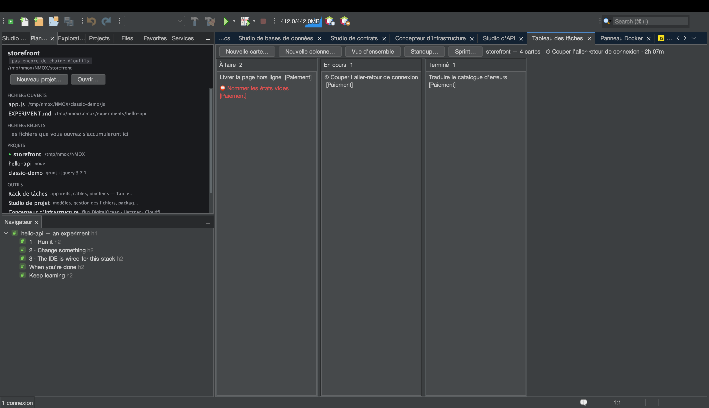
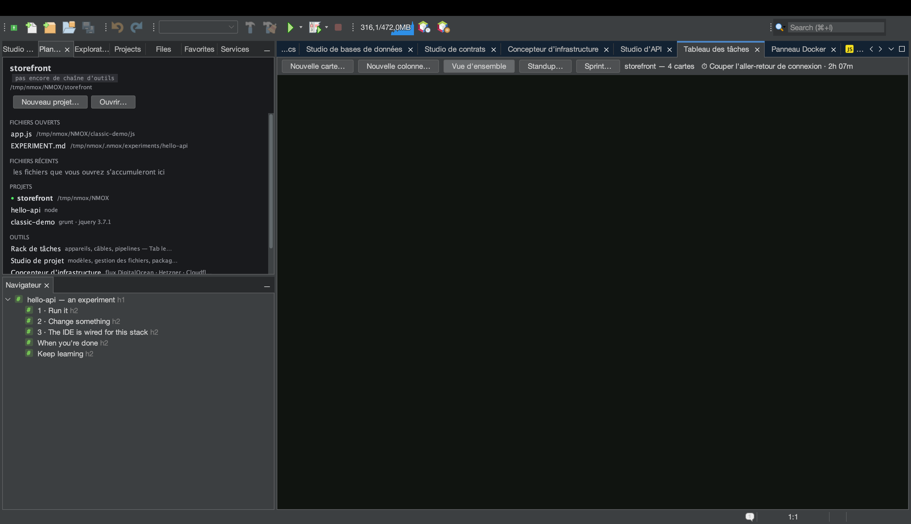
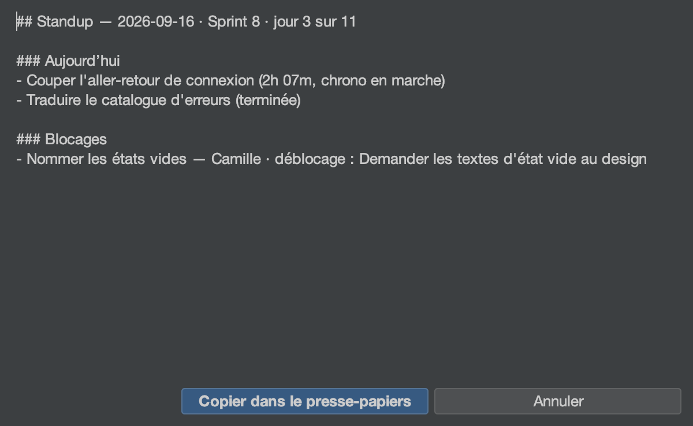

# Tutoriel : le Tableau des tâches et les sprints

<!-- languages -->
[English](task-board.md) · [Español](task-board.es.md) · **Français** · [Deutsch](task-board.de.md) · [Русский](task-board.ru.md) · [Українська](task-board.uk.md) · [Polski](task-board.pl.md) · [Português (Brasil)](task-board.pt.md) · [Bahasa Indonesia](task-board.id.md) · [Filipino](task-board.tl.md) · [Tiếng Việt](task-board.vi.md) · [简体中文](task-board.zh.md) · [हिन्दी](task-board.hi.md) · [עברית](task-board.he.md) · [العربية](task-board.ar.md)
<!-- /languages -->

Le Tableau des tâches est un kanban par projet qui vit dans un seul fichier —
`.nmoxtasks.json`, à côté de votre code — et tout ce que le tableau fait par
ailleurs en est dérivé : un tableau de bord, un chrono, un standup quotidien
et un burndown de sprint. Rien n’est une comptabilité tenue à la main ; les
horodatages des cartes elles-mêmes font foi. Ce tutoriel mène un tableau de
trois cartes jusqu’à un sprint clôturé, en une séance.

## Avant de commencer

Ouvrez un projet (n’importe lequel — le tableau ne se soucie pas de la chaîne
d’outils). Si le projet est un dépôt git, le Standup peut aussi lire vos
commits ; sinon, cette section n’apparaît tout simplement jamais.

## Étapes

1. **Ouvrez le tableau.** `⌥⌘1` (ou `Fenêtre ▸ Tableau des tâches`). Pressez
   **Nouvelle carte…** trois fois et donnez un titre à chaque carte. Les
   cartes se déplacent par glisser-déposer, ou au clavier : une carte
   sélectionnée, **⌘←/⌘→** la déplace d’une colonne et **⌘↑/⌘↓** la
   réordonne ; **Entrée** la modifie, **Suppr** la retire (après
   confirmation, Non étant le choix par défaut), **N** crée une nouvelle
   carte dans cette colonne. Le menu de l’en-tête de chaque colonne permet de
   la renommer, de fixer une **limite WIP indicative** (l’en-tête rougit
   au-delà — elle ne bloque jamais un déplacement), de la déplacer ou de la
   supprimer.

2. **Démarrez le chrono.** Faites glisser une carte dans la colonne du
   milieu, puis clic droit dessus → **Démarrer le chrono**. Un ⏱ apparaît sur
   la carte et l’en-tête du tableau affiche le temps écoulé. Un seul chrono
   tourne à la fois — le démarrer sur une autre carte clôt cette session — et
   une session de moins d’une minute est ignorée en entier, si bien qu’un
   clic égaré n’est jamais compté comme du travail. **Arrêter le chrono**
   l’arrête.

3. **Ajoutez les détails dont un standup a besoin.** Clic droit sur une
   carte → **Définir l'étiquette…** pour la rattacher à une épopée, et sur
   une autre carte **Marquer comme bloquée…** — un responsable et l’action qui
   la débloque (l’action est obligatoire : un blocage sans action est une
   plainte, pas un plan). La carte porte ⛔ ; **Débloquer** l’efface, tout
   comme terminer la carte.

4. **Lisez la Vue d’ensemble.** Pressez **Vue d'ensemble** dans la barre
   d’outils. Le même fichier devient un tableau de bord : les cartes du
   tableau, le **WIP ACTUEL** (les colonnes intermédiaires seulement), ce qui
   a été terminé aujourd’hui et cette semaine, un registre WIP par colonne
   qui vire au rouge en cas de dépassement, une **bande de flux** sur
   14 jours, les cartes inachevées les plus anciennes avec leur âge, la
   légende **ÉPOPÉES** dérivée des étiquettes utilisées, le **registre des
   blocages** (les plus longtemps bloquées d’abord), les notes **RÉTRO** du
   tableau (**Modifier la rétro…**) et le rapport **TEMPS** — pointé
   aujourd’hui et sur les sept derniers jours, puis une ligne par carte, la
   plus active du jour en tête. Une session qui chevauche minuit est découpée
   par jour calendaire, si bien que le chiffre du jour est bien le travail du
   jour.

5. **Terminez quelque chose.** Désactivez **Vue d'ensemble** et déplacez une
   carte dans la dernière colonne. Ce moment est horodaté comme heure de fin
   de la carte (la ressortir de cette colonne annule sa fin, et l’historique
   l’oublie). Chaque chiffre de cartes terminées de la Vue d’ensemble vient
   de ces horodatages.

6. **Démarrez un sprint.** Pressez **Sprint… ▸ Démarrer le sprint…**,
   nommez-le et acceptez la fenêtre de deux semaines (les dates sont au format
   `YYYY-MM-DD` ; une fenêtre à l’envers ou une valeur qui n’est pas une date
   est refusée à voix haute, et rien ne change). Passez en **Vue d'ensemble** :
   elle s’enrichit d’un en-tête de sprint et d’un **burndown** reconstruit à
   partir des horodatages de fin des cartes — la ligne pâle est l’idéal, la
   ligne vive est ce qui s’est passé, et le futur reste vierge.

7. **Rédigez le standup.** Pressez **Standup…**. Le rapport s’ouvre en
   markdown avec un bouton **Copier dans le
   presse-papiers** : **Hier** et **Aujourd’hui** à partir des horodatages de
   fin et des sessions découpées par jour (un chrono en marche se lit
   « chrono en marche »), **Blocages** à partir du registre, **Commits (depuis
   hier)** à partir de `git log`. Les sections qui n’ont rien à dire sont
   omises, jamais affichées vides, et l’en-tête commence par le sprint et son
   décompte de jours (« Sprint 8 · jour 3 sur 14 »).

   

8. **Clôturez le sprint.** **Sprint… ▸ Rapport de sprint…** est le pendant de
   revue du Standup — ce qui est terminé, ce qui reste ouvert à la clôture,
   ce qui est encore bloqué, le temps pointé dans la fenêtre, les notes de
   rétro — et **Sprint… ▸ Clôturer le sprint…** archive la fenêtre, le nombre
   de cartes terminées et la rétro pour la vélocité. Les cartes restent
   exactement où elles sont : clôturer, c’est tenir les comptes, pas faire le
   ménage. La clôture propose ensuite le sprint suivant prérempli (nom
   incrémenté, fenêtre de même durée commençant le lendemain), entièrement
   modifiable, et Annuler ne démarre rien. Dès qu’un historique existe, la
   boîte de dialogue du sprint affiche le chiffre de planification —
   « Vélocité — 3 derniers sprints : … » — et le rapport gagne sa ligne de
   vélocité.

## Ce que vous venez d’apprendre

- **Un seul fichier contient tout l’historique.** Versionnez
  `.nmoxtasks.json` et l’équipe partage le tableau, la rétro et l’historique
  des sprints ; ignorez-le et il reste personnel. Les titres des cartes
  s’affichent toujours en caractères bruts, si bien qu’un tableau versionné ne
  peut pas faire passer du balisage en douce.
- **Le tableau suit le fichier dans les deux sens.** Modifiez-le à la main,
  tirez le push d’un collègue ou passez sur une autre branche, et le tableau
  affiché se met à jour en une seconde et demie environ — une modification
  externe l’emporte sur un geste périmé, et la barre d’état le dit.
- **Les dégâts d’une fusion se réparent au chargement.** Les identifiants de
  cartes en double, les sessions de chrono restées ouvertes par erreur et une
  fenêtre de sprint abîmée sont réparés à la lecture du fichier, si bien
  qu’une fusion qui garde les deux versions ne peut ni gonfler un rapport ni
  empoisonner les cérémonies.
- **Tout ce qui est dérivé est défini.** Le WIP, les fenêtres de fin, le
  burndown et le découpage du TEMPS sont des définitions que vous pouvez lire
  dans le Guide de l’utilisateur, pas des heuristiques.

## Pour aller plus loin

- Les titres des cartes, les étiquettes d’épopée et la requête littérale
  `blocked` sont tous accessibles depuis `⌘I` — voyez le [tutoriel du Plan de
  travail](workbench.fr.md) pour l’habitude de tout chercher.
- Collez le Standup dans une discussion, puis continuez : [Présenter devant
  une salle](show-it-to-a-room.fr.md) couvre Copier en Markdown et la famille
  des captures d’écran.
- Les définitions complètes se trouvent dans la [section Tableau des tâches
  du Guide de l’utilisateur](../user-guide.fr.md).
