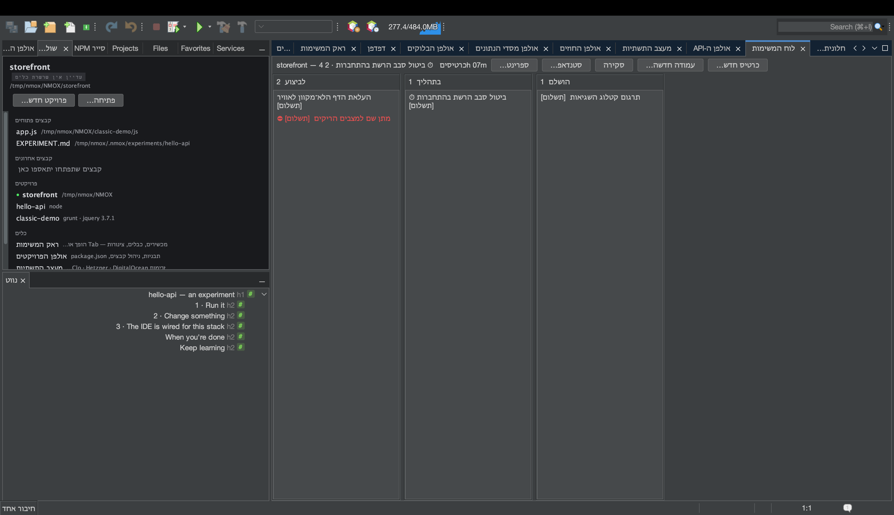
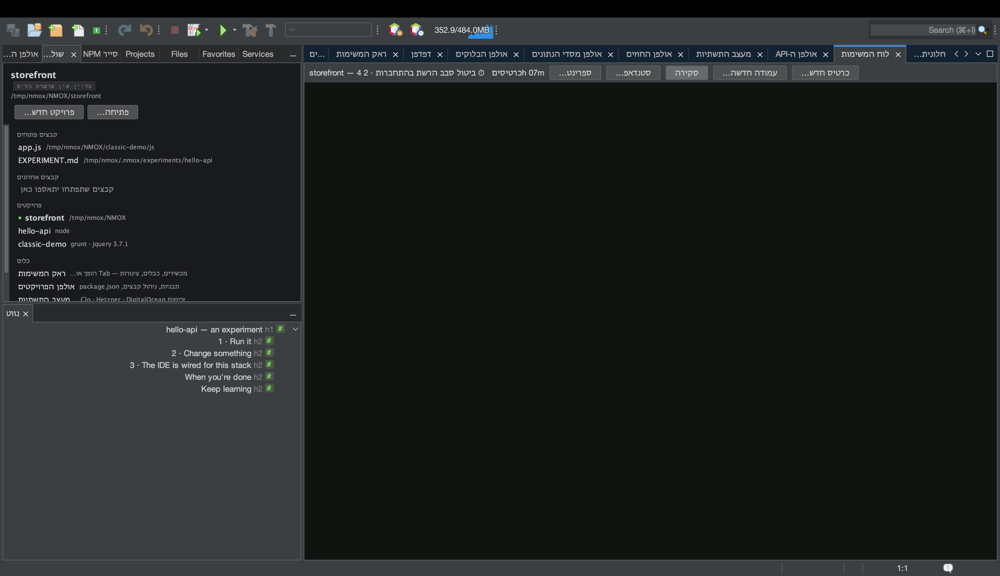
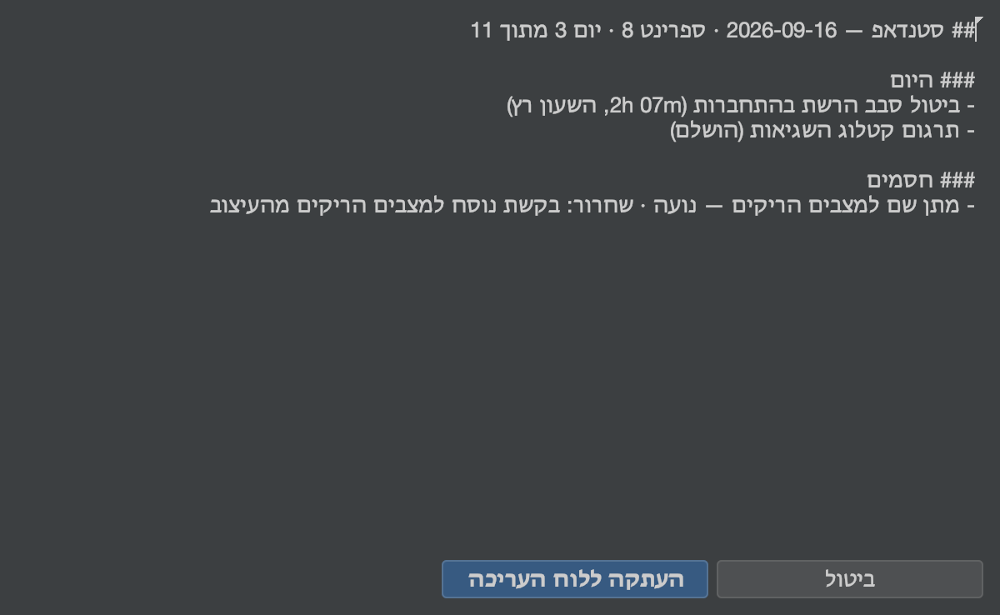

# מדריך: לוח המשימות והספרינטים

<!-- languages -->
[English](task-board.md) · [Español](task-board.es.md) · [Français](task-board.fr.md) · [Deutsch](task-board.de.md) · [Русский](task-board.ru.md) · [Українська](task-board.uk.md) · [Polski](task-board.pl.md) · [Português (Brasil)](task-board.pt.md) · [Bahasa Indonesia](task-board.id.md) · [Filipino](task-board.tl.md) · [Tiếng Việt](task-board.vi.md) · [简体中文](task-board.zh.md) · [हिन्दी](task-board.hi.md) · **עברית** · [العربية](task-board.ar.md)
<!-- /languages -->

לוח המשימות הוא קנבן לכל פרויקט שחי בקובץ אחד — ‎`.nmoxtasks.json` לצד
הקוד שלכם — וכל מה שהלוח עושה מעבר לזה נגזר מהקובץ הזה: לוח מחוונים,
שעון נוכחות, סטנדאפ יומי ו‑burndown של ספרינט. שום דבר אינו הנהלת
חשבונות שאתם מנהלים ביד; החותמות של הכרטיסים עצמם הן הרישום. המדריך לוקח
לוח משלושה כרטיסים ועד ספרינט סגור בישיבה אחת.

## לפני שמתחילים

פתחו פרויקט (כל פרויקט — ללוח לא אכפת משרשרת הכלים). אם הפרויקט הוא מאגר
git, הסטנדאפ יכול לקרוא גם את ה‑commits שלכם; אם לא, המקטע הזה פשוט
לעולם לא מופיע.

## השלבים

1. **פתחו את הלוח.** `⌥⌘1` (או `חלון ◂ לוח המשימות`). לחצו **כרטיס
   חדש…** שלוש פעמים ותנו לכל כרטיס כותרת. כרטיסים זזים בגרירה או
   במקלדת: כשכרטיס בחור, **⌘←/⌘→** מזיז אותו עמודה אחת הצידה ו‑**⌘↑/⌘↓**
   משנה את הסדר; **Enter** עורך, **Delete** מוחק (אחרי שאלה, עם "לא"
   כברירת מחדל), **N** מתחיל כרטיס חדש בעמודה הזו. התפריט בכותרת של כל
   עמודה משנה את שמה, קובע **מגבלת WIP מייעצת** (הכותרת הופכת לאדומה
   מעבר לה — היא אף פעם לא חוסמת הזזה), מערבב אותה או מוחק אותה.

2. **הפעילו שעון.** גררו כרטיס אחד לעמודה האמצעית, לחיצה ימנית עליו ←
   **הפעלת שעון**. ⏱ מופיע על הכרטיס וכותרת הלוח מציגה את הזמן שעובר.
   רק שעון אחד רץ בכל פעם — הפעלת שעון בכרטיס אחר סוגרת את הסשן הזה —
   וסשן קצר מדקה נזרק כולו, כך שלחיצה תועה לעולם לא נספרת כעבודה.
   **עצירת שעון** עוצרת אותו.

3. **הוסיפו את הפרטים שסטנדאפ צריך.** לחיצה ימנית על כרטיס ←
   **הגדרת תווית…** כדי לתייג אותו באפיק, ובכרטיס אחר **סימון כחסום…** —
   אחראי והפעולה שמשחררת את החסימה (הפעולה חובה: חסם בלי פעולה הוא תלונה,
   לא תוכנית). הכרטיס מקבל ⛔; **שחרור חסימה** מנקה אותו, וכך גם סיום
   הכרטיס.

4. **קראו את הסקירה.** לחצו **סקירה** בסרגל הכלים. אותו קובץ הופך ללוח
   מחוונים: הכרטיסים בלוח, **WIP כעת** (רק העמודות האמצעיות), מה הושלם
   היום והשבוע, מרשם WIP לכל עמודה עם פסיקה אדומה בחריגה, **פס זרימה** של
   14 ימים, הכרטיסים הפתוחים הוותיקים ביותר עם הגיל שלהם, מקרא **אפיקים**
   שנגזר מהתוויות שבשימוש, **מרשם החסמים** (התקועים הכי הרבה זמן קודם),
   הערות **רטרו** ברמת הלוח (**עריכת הרטרו…**), ודוח **זמן** — כמה נמדד
   היום ובשבעת הימים האחרונים, ואז שורה לכל כרטיס, מי שעבדו עליו הכי הרבה
   היום קודם. סשן שחוצה חצות נחתך לפי יום קלנדרי, כך שהמספר של היום הוא
   העבודה של היום.

5. **סיימו משהו.** כבו את **סקירה** והזיזו כרטיס לעמודה האחרונה. הרגע
   הזה נחתם כזמן הסיום של הכרטיס (הזזה חזרה מבטלת את הסיום, וההיסטוריה
   שוכחת אותו). כל מספר של "הושלם" בסקירה מגיע מהחותמות האלה.

6. **התחילו ספרינט.** לחצו **ספרינט… ◂ התחלת ספרינט…**, תנו לו שם
   וקבלו את החלון של שבועיים (התאריכים בתבנית `YYYY-MM-DD`; חלון הפוך או
   משהו שאינו תאריך נדחה בקול, ושום דבר לא משתנה). עברו ל‑**סקירה**: היא
   מקבלת כותרת ספרינט ו‑**burndown** ששוחזר מחותמות הסיום של הכרטיסים —
   הקו העמום הוא האידיאל, הקו הבהיר הוא מה שקרה, והעתיד נשאר לא מצויר.

7. **כתבו את הסטנדאפ.** לחצו **סטנדאפ…**. הדוח נפתח כ‑Markdown עם כפתור
   **העתקה ללוח העריכה**: **אתמול** ו‑**היום** מחותמות הסיום ומסשנים
   שנחתכו לפי יום (שעון שרץ נקרא "השעון רץ"), **חסמים** מהמרשם,
   **קומיטים (מאתמול)** מ‑`git log`. מקטעים שאין להם מה לומר
   מושמטים, ולעולם אינם מוצגים ריקים, והכותרת נפתחת בספרינט ובספירת הימים
   שלו ("ספרינט 8 · יום 3 מתוך 14").

   

8. **סגרו את הספרינט.** **ספרינט… ◂ דוח ספרינט…** הוא אח הסקירה של
   הסטנדאפ — מה הושלם, מה נשאר פתוח בסגירה, מה עדיין חסום, הזמן שנמדד
   בתוך החלון, הערות הרטרו — ו‑**ספרינט… ◂ סגירת הספרינט…** שומר בארכיון
   את החלון, מספר הכרטיסים שהושלמו והרטרו לחישוב הוולוסיטי. הכרטיסים
   נשארים בדיוק במקומם: סגירה היא רישום, לא ניקיון. אחר כך הסגירה מציעה
   את הספרינט הבא ממולא מראש (השם במספר הבא, חלון באותו אורך שמתחיל ביום
   שאחרי), ניתן לעריכה מלאה, וביטול לא מתחיל כלום. ברגע שיש היסטוריה,
   תיבת הדו‑שיח של הספרינט מציגה את מספר התכנון — "ולוסיטי — 3 הספרינטים
   האחרונים: …" — והדוח מקבל את שורת הוולוסיטי שלו.

## מה למדתם עכשיו

- **קובץ אחד הוא הרישום כולו.** הכניסו את ‎`.nmoxtasks.json` למאגר,
  והצוות חולק את הלוח, הרטרו והיסטוריית הספרינטים; השאירו אותו מחוץ
  למאגר, והוא נשאר אישי. כותרות כרטיסים תמיד מוצגות כתווים רגילים, כך
  שלוח מהמאגר אינו יכול להבריח markup.
- **הלוח עוקב אחרי הקובץ בשני הכיוונים.** ערכו אותו ביד, משכו push של
  עמית, או עשו checkout לענף אחר, והלוח שעל המסך מתעדכן בתוך שנייה וחצי
  בערך — עריכה מבחוץ גוברת על פעולה ישנה, ושורת המצב אומרת זאת.
- **סכנות מיזוג מתרפאות בטעינה.** מזהי כרטיסים כפולים, סשנים פתוחים של
  שעון שנשארו תלויים וחלון ספרינט משובש מתוקנים כשהקובץ נקרא, כך שמיזוג
  keep-both לא יכול לנפח דוח או להרעיל את הטקסים.
- **כל מה שנגזר מוגדר במפורש.** WIP, חלונות הסיום, ה‑burndown והחיתוך של
  הזמן הם הגדרות שאפשר לקרוא במדריך למשתמש, לא היוריסטיקות.

## הלאה

- כותרות כרטיסים, תוויות אפיקים והשאילתה המילולית `blocked` נגישות כולן
  מ‑`⌘I` — ראו את [המדריך לשולחן העבודה](workbench.he.md) להרגל של לחפש
  הכול.
- הדביקו את הסטנדאפ בצ׳אט, ואז המשיכו: [להציג מול
  קהל](show-it-to-a-room.he.md) עוסק בהעתקה כ‑Markdown ובמשפחת צילומי
  המסך.
- ההגדרות המלאות נמצאות [במקטע לוח המשימות של המדריך
  למשתמש](../user-guide.he.md).
