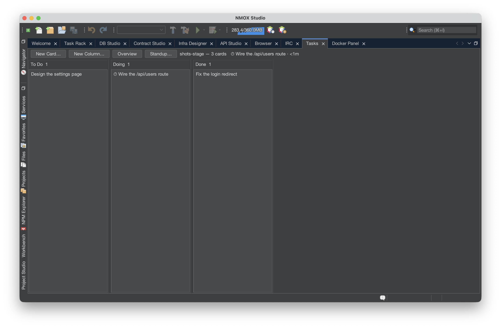
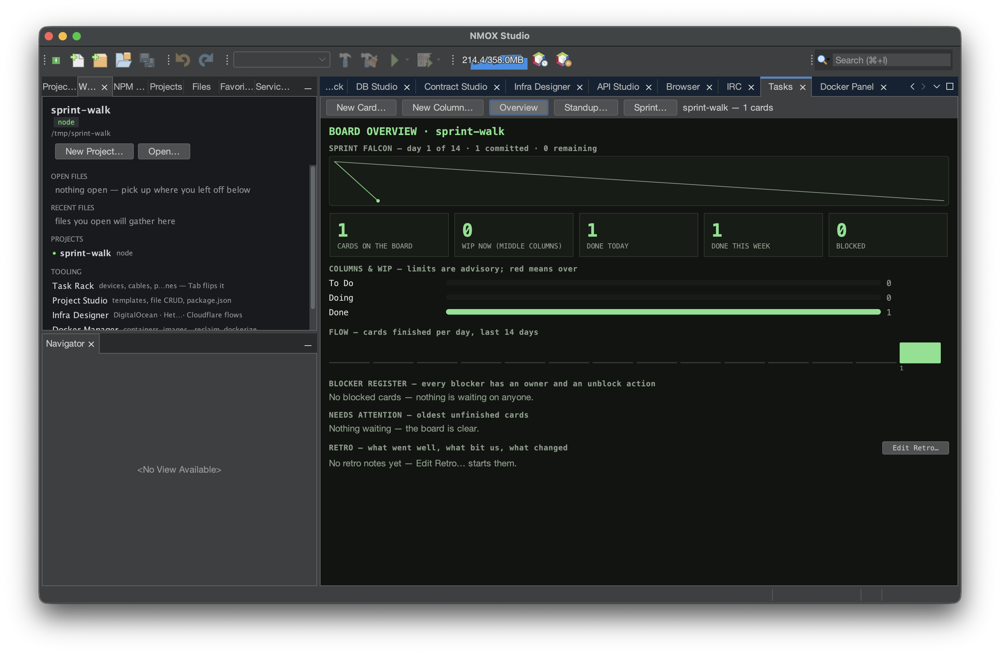
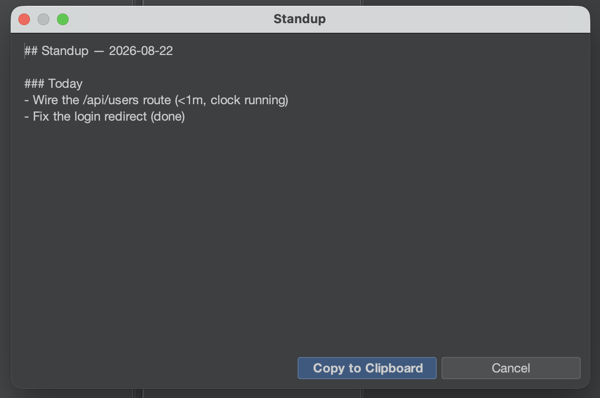

# Tutorial: The Task Board and sprints

The Task Board is a per-project kanban that lives in one file —
`.nmoxtasks.json` beside your code — and everything else the board
does is derived from that file: a dashboard, a time clock, a daily
standup, and a sprint burndown. Nothing is bookkeeping you keep by
hand; the cards' own stamps are the record. This tutorial takes a
board from three cards to a closed sprint in one sitting.

## Before you start

Open a project (any project — the board doesn't care about the
toolchain). If the project is a git repository, the Standup can also
read your commits; if not, that section simply never appears.

## Steps

1. **Open the board.** `⌥⌘1` (or `Window ▸ Tasks`). Press **New
   Card…** three times and give each card a title. Cards move by
   drag, or by keyboard: with a card selected, **⌘←/⌘→** moves it a
   column over and **⌘↑/⌘↓** reorders it; **Enter** edits, **Delete**
   removes (after asking, with No as the default), **N** starts a new
   card in that column. Each column header's menu renames it, sets an
   **advisory WIP limit** (the header turns red past it — it never
   blocks a move), shuffles it, or deletes it.

2. **Clock in.** Drag one card into the middle column, right-click it
   → **Clock In**. A ⏱ appears on the card and the board header shows
   the running elapsed. Only one clock runs at a time — clocking in
   on another card closes this session — and a session shorter than a
   minute is dropped whole, so a stray click is never counted as
   work. **Clock Out** stops it.

3. **Add the details a standup needs.** Right-click a card →
   **Set Label…** to tag it with an epic, and on another card
   **Mark Blocked…** — an owner and the action that unblocks it (the
   action is required: a blocker without one is a complaint, not a
   plan). The card wears ⛔; **Unblock** clears it, and so does
   finishing the card.

4. **Read the Overview.** Press **Overview** on the toolbar. The same
   file becomes a dashboard: cards on the board, **WIP now** (the
   middle columns only), done today and this week, a per-column WIP
   register with red-when-over verdicts, a 14-day **flow strip**, the
   oldest unfinished cards with their ages, the **EPICS** legend
   derived from the labels in use, the **blocker register**
   (longest-stuck first), board-level **RETRO** notes (**Edit
   Retro…**), and the **TIME** report — clocked today and last seven
   days, then one row per card, most-today first. A session that spans
   midnight is clipped per calendar day, so today's number is today's
   work.

5. **Finish something.** Toggle **Overview** off and move a card into
   the last column. That moment is stamped as the card's done time
   (moving it back out un-finishes it and the history forgets it).
   Every done number on the Overview comes from these stamps.

6. **Start a sprint.** Press **Sprint… ▸ Start Sprint…**, name it,
   and accept the two-week window (dates are `YYYY-MM-DD`; a backwards
   window or a non-date is refused out loud and nothing changes).
   Switch to **Overview**: it grows a sprint header and a **burndown**
   reconstructed from the cards' done stamps — the dim line is the
   ideal, the bright line is what happened, and the future stays
   unplotted.

7. **Write the standup.** Press **Standup…**. The report opens as
   markdown with a **Copy to Clipboard** button: **Yesterday** and
   **Today** from done stamps and day-clipped sessions (a running clock
   reads "clock running"), **Blockers** from the register, **Commits
   (since yesterday)** from `git log`. Sections with nothing to say are
   omitted, never rendered empty, and the header opens with the sprint
   and its day count ("Sprint 8 · day 3 of 14").

   

8. **Close the sprint.** **Sprint… ▸ Sprint Report…** is the Standup's
   review sibling — done, open at close, still blocked, clocked time
   within the window, retro notes — and **Sprint… ▸ Close Sprint…**
   archives the window, done count, and retro for velocity. Cards stay
   exactly where they are: closing is bookkeeping, not cleanup. The
   close then offers the next sprint pre-filled (name incremented,
   same-length window starting the day after), fully editable, with
   Cancel starting nothing. Once history exists, the Sprint dialog shows
   the planning number — "Velocity — last 3 sprints: …" — and the
   report gains its velocity line.

## What you just learned

- **One file is the whole record.** Commit `.nmoxtasks.json` and the
  team shares the board, the retro, and the sprint history; ignore it
  and it stays personal. Card titles always render as plain characters,
  so a checked-in board can't smuggle markup.
- **The board follows the file both ways.** Edit it by hand, pull a
  teammate's push, or check out another branch, and the visible board
  updates within about a second and a half — an external edit wins
  over a stale gesture, and the status line says so.
- **Merge hazards heal on load.** Duplicate card ids, stray open clock
  sessions, and a mangled sprint window are repaired when the file is
  read, so a keep-both merge can't inflate a report or poison the
  ceremonies.
- **Everything derived is stated.** WIP, done windows, the burndown,
  and the TIME clip are definitions you can read in the User Guide,
  not heuristics.

## Next

- Card titles, epic labels, and the literal query `blocked` are all
  reachable from `⌘I` — see the [Workbench tutorial](workbench.md) for
  the search-everything habit.
- Paste the Standup into a chat, then keep going: [Show it to a
  room](show-it-to-a-room.md) covers Copy as Markdown and the
  screenshot family.
- The full definitions live in the [User Guide's Task Board
  section](../user-guide.md).
