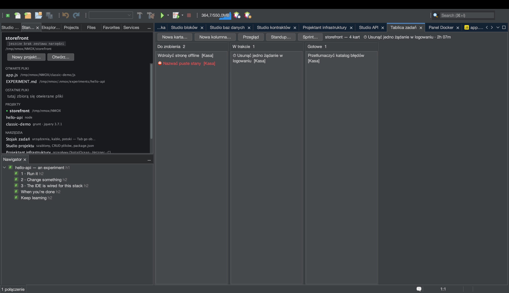
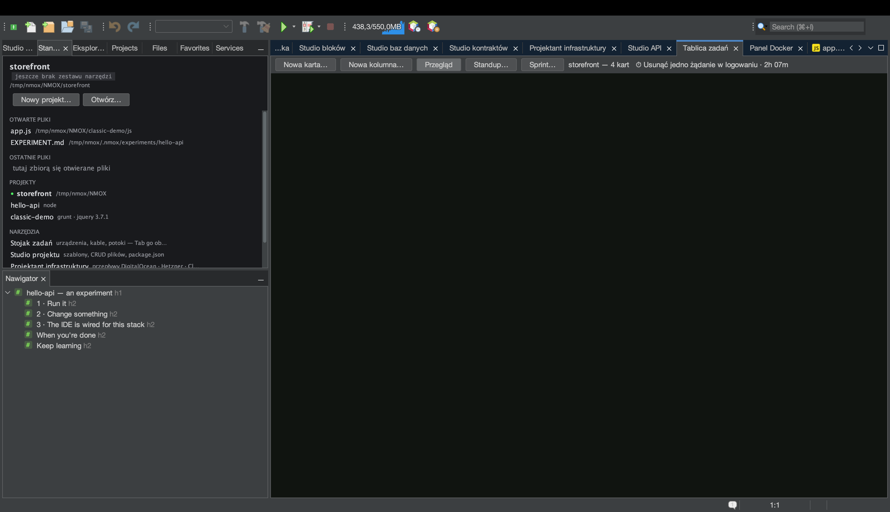
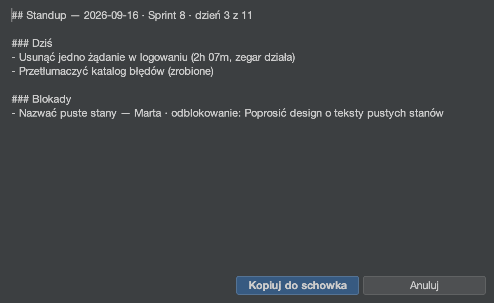

# Samouczek: Tablica zadań i sprinty

<!-- languages -->
[English](task-board.md) · [Español](task-board.es.md) · [Français](task-board.fr.md) · [Deutsch](task-board.de.md) · [Русский](task-board.ru.md) · [Українська](task-board.uk.md) · **Polski** · [Português (Brasil)](task-board.pt.md) · [Bahasa Indonesia](task-board.id.md) · [Filipino](task-board.tl.md) · [Tiếng Việt](task-board.vi.md) · [简体中文](task-board.zh.md) · [हिन्दी](task-board.hi.md) · [עברית](task-board.he.md) · [العربية](task-board.ar.md)
<!-- /languages -->

Tablica zadań to kanban per projekt, który mieszka w jednym pliku —
`.nmoxtasks.json` obok twojego kodu — a wszystko inne, co tablica robi,
wynika z tego pliku: pulpit, zegar pracy, codzienny standup i wykres
spalania sprintu. Nie ma tu żadnej buchalterii prowadzonej ręcznie;
zapisem są znaczniki samych kart. Ten samouczek prowadzi tablicę od
trzech kart do zamkniętego sprintu na jednym posiedzeniu.

## Zanim zaczniesz

Otwórz projekt (dowolny — tablicy nie obchodzi zestaw narzędzi). Jeśli
projekt jest repozytorium git, Standup przeczyta też twoje commity;
jeśli nie, ta sekcja po prostu się nie pojawi.

## Kroki

1. **Otwórz tablicę.** `⌥⌘1` (albo `Okno ▸ Tablica zadań`). Naciśnij
   **Nowa karta…** trzy razy i nadaj każdej karcie tytuł. Karty
   przesuwa się przeciąganiem albo klawiaturą: przy zaznaczonej karcie
   **⌘←/⌘→** przenosi ją o kolumnę, a **⌘↑/⌘↓** zmienia kolejność;
   **Enter** edytuje, **Delete** usuwa (po pytaniu, z Nie jako
   domyślną odpowiedzią), **N** zaczyna nową kartę w tej kolumnie. Menu
   nagłówka każdej kolumny zmienia jej nazwę, ustawia **orientacyjny
   limit WIP** (po jego przekroczeniu nagłówek czerwienieje — nigdy nie
   blokuje przesunięcia), przestawia ją albo usuwa.

2. **Uruchom zegar.** Przeciągnij jedną kartę do środkowej kolumny,
   kliknij ją prawym przyciskiem → **Uruchom zegar**. Na karcie pojawia
   się ⏱, a nagłówek tablicy pokazuje upływający czas. Naraz chodzi tylko
   jeden zegar — uruchomienie go na innej karcie zamyka tę sesję —
   a sesja krótsza niż minuta jest odrzucana w całości, więc przypadkowe
   kliknięcie nigdy nie liczy się jako praca. **Zatrzymaj zegar** go
   zatrzymuje.

3. **Dodaj szczegóły, których potrzebuje standup.** Prawy przycisk na
   karcie → **Ustaw etykietę…**, żeby przypisać ją do epiki, a na innej
   karcie **Oznacz jako zablokowane…** — właściciel i akcja, która ją
   odblokuje (akcja jest wymagana: blokada bez niej to skarga, nie plan).
   Karta nosi ⛔; **Odblokuj** to czyści, podobnie jak ukończenie karty.

4. **Przeczytaj przegląd.** Naciśnij **Przegląd** na pasku narzędzi.
   Ten sam plik staje się pulpitem: karty na tablicy, **WIP TERAZ**
   (tylko środkowe kolumny), zrobione dziś i w tym tygodniu, rejestr WIP
   dla każdej kolumny z czerwonym werdyktem przy przekroczeniu,
   14-dniowy pasek **PRZEPŁYW**, najstarsze niedokończone karty z ich
   wiekiem, legenda **EPIKI** wyprowadzona z używanych etykiet,
   **REJESTR BLOKAD** (najdłużej stojące najpierw), notatki **RETRO** dla
   całej tablicy (**Edytuj retro…**) i raport **CZAS** — zmierzone dziś
   i przez ostatnie siedem dni, a potem jeden wiersz na kartę, najwięcej
   dzisiaj najpierw. Sesja przechodząca przez północ jest cięta per dzień
   kalendarzowy, więc dzisiejsza liczba to dzisiejsza praca.

5. **Skończ coś.** Wyłącz **Przegląd** i przesuń kartę do ostatniej
   kolumny. Ta chwila zostaje zapisana jako czas ukończenia karty
   (przesunięcie jej z powrotem cofa ukończenie, a historia o nim
   zapomina). Każda liczba ukończonych w przeglądzie pochodzi z tych
   znaczników.

6. **Rozpocznij sprint.** Naciśnij **Sprint… ▸ Rozpocznij sprint…**,
   nadaj mu nazwę i zaakceptuj dwutygodniowe okno (daty mają postać
   `YYYY-MM-DD`; okno wstecz albo coś, co nie jest datą, zostaje
   odrzucone na głos i nic się nie zmienia). Przełącz się na
   **Przegląd**: pojawia się nagłówek sprintu i **wykres spalania**
   odtworzony ze znaczników ukończenia kart — przygaszona linia to
   ideał, jasna to to, co się wydarzyło, a przyszłość zostaje
   nienarysowana.

7. **Napisz standup.** Naciśnij **Standup…**. Raport otwiera się jako
   markdown z przyciskiem **Kopiuj do schowka**: **Wczoraj**
   i **Dziś** ze znaczników ukończenia i sesji przyciętych do dnia
   (działający zegar czyta się jako „zegar działa”), **Blokady**
   z rejestru, **Commity (od wczoraj)** z `git log`. Sekcje, które
   nie mają nic do powiedzenia, są pomijane, a nie wyświetlane puste,
   a nagłówek zaczyna się od sprintu i licznika jego dni („Sprint 8 ·
   dzień 3 z 14”).

   

8. **Zamknij sprint.** **Sprint… ▸ Raport sprintu…** to przeglądowe
   rodzeństwo Standupu — zrobione, otwarte w chwili zamknięcia, wciąż
   zablokowane, czas zmierzony w oknie, notatki retro — a **Sprint… ▸
   Zamknij sprint…** archiwizuje okno, liczbę ukończonych i retro na
   potrzeby prędkości. Karty zostają dokładnie tam, gdzie są: zamknięcie
   to buchalteria, nie sprzątanie. Potem zamknięcie proponuje kolejny
   sprint, już wypełniony (nazwa z kolejnym numerem, okno tej samej
   długości zaczynające się dzień później), w pełni edytowalny,
   a Anuluj niczego nie rozpoczyna. Gdy historia już istnieje, okno
   Sprint pokazuje liczbę do planowania — „Prędkość — ostatnie sprinty
   (3): …” — a raport dostaje swój wiersz prędkości.

## Czego się właśnie nauczyłeś

- **Jeden plik to cały zapis.** Wrzuć `.nmoxtasks.json` do repozytorium,
  a zespół dzieli tablicę, retro i historię sprintów; zignoruj go,
  a zostaje osobisty. Tytuły kart zawsze wyświetlają się jako zwykłe
  znaki, więc tablica z repozytorium nie przemyci znaczników.
- **Tablica idzie za plikiem w obie strony.** Edytuj go ręcznie, pobierz
  to, co wypchnął kolega, albo przełącz się na inną gałąź, a widoczna
  tablica zaktualizuje się w ciągu mniej więcej półtorej sekundy —
  zewnętrzna edycja wygrywa z nieaktualnym gestem, a pasek stanu to mówi.
- **Zagrożenia po scaleniu leczą się przy wczytaniu.** Zdublowane
  identyfikatory kart, zabłąkane otwarte sesje zegara i zniekształcone
  okno sprintu są naprawiane podczas czytania pliku, więc scalenie
  „zachowaj oba” nie napompuje raportu ani nie zatruje ceremonii.
- **Wszystko, co wyprowadzone, jest opisane.** WIP, okna ukończenia,
  wykres spalania i cięcie CZASU to definicje, które przeczytasz
  w Podręczniku użytkownika, a nie heurystyki.

## Dalej

- Tytuły kart, etykiety epik i dosłowne zapytanie `blocked` są
  osiągalne z `⌘I` — nawyk szukania wszystkiego opisuje [samouczek
  Stanowiska pracy](workbench.pl.md).
- Wklej Standup do czatu i jedź dalej: [Pokaż to na
  sali](show-it-to-a-room.pl.md) omawia Kopiuj jako Markdown i rodzinę
  zrzutów ekranu.
- Pełne definicje są w [części Podręcznika użytkownika o Tablicy
  zadań](../user-guide.pl.md).
