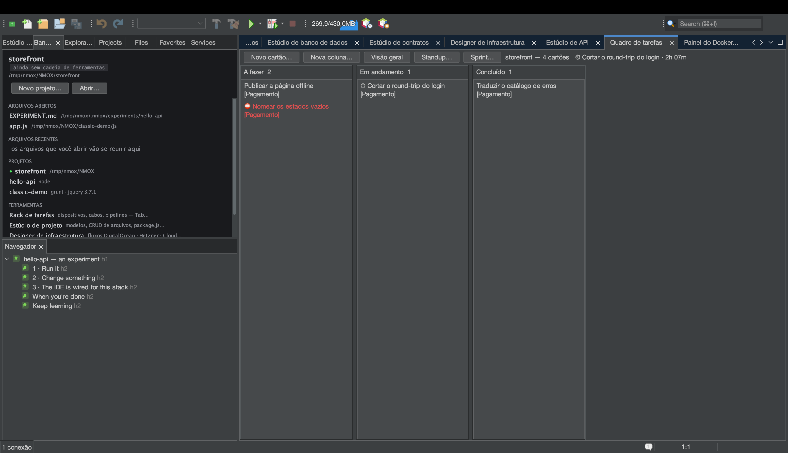
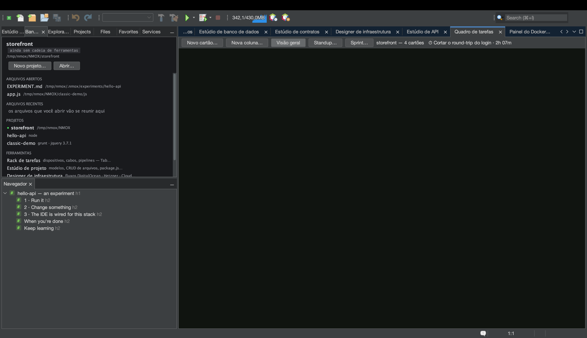
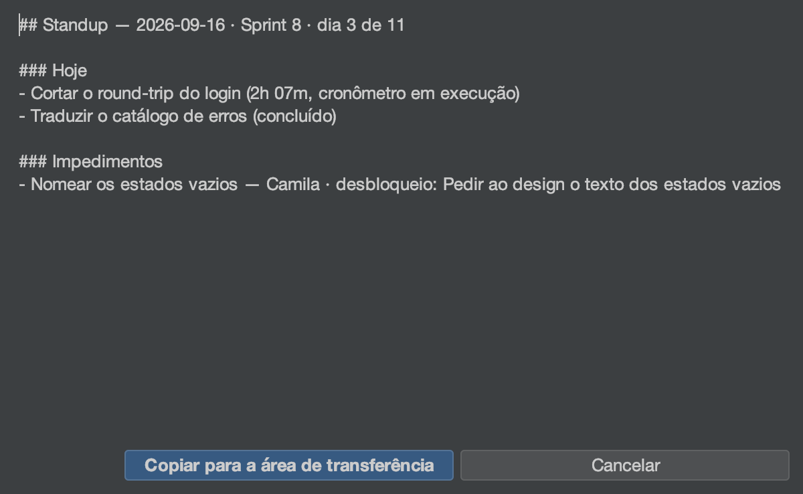

# Tutorial: o Quadro de tarefas e os sprints

<!-- languages -->
[English](task-board.md) · [Español](task-board.es.md) · [Français](task-board.fr.md) · [Deutsch](task-board.de.md) · [Русский](task-board.ru.md) · [Українська](task-board.uk.md) · [Polski](task-board.pl.md) · **Português (Brasil)** · [Bahasa Indonesia](task-board.id.md) · [Filipino](task-board.tl.md) · [Tiếng Việt](task-board.vi.md) · [简体中文](task-board.zh.md) · [हिन्दी](task-board.hi.md) · [עברית](task-board.he.md) · [العربية](task-board.ar.md)
<!-- /languages -->

O Quadro de tarefas é um kanban por projeto que mora num único arquivo —
`.nmoxtasks.json`, ao lado do seu código — e tudo o mais que o quadro faz
é derivado desse arquivo: um painel, um cronômetro, um standup diário e o
burndown de um sprint. Nada é controle que você mantém à mão; as marcações
dos próprios cartões são o registro. Este tutorial leva um quadro de três
cartões a um sprint encerrado numa sentada só.

## Antes de começar

Abra um projeto (qualquer um — o quadro não liga para a cadeia de
ferramentas). Se o projeto for um repositório git, o Standup também
consegue ler os seus commits; se não for, essa seção simplesmente nunca
aparece.

## Passos

1. **Abra o quadro.** `⌥⌘1` (ou `Janela ▸ Quadro de tarefas`). Aperte
   **Novo cartão…** três vezes e dê um título a cada cartão. Os cartões se
   movem arrastando ou pelo teclado: com um cartão selecionado,
   **⌘←/⌘→** o leva para a coluna ao lado e **⌘↑/⌘↓** o reordena;
   **Enter** edita, **Delete** remove (depois de perguntar, com Não como
   padrão) e **N** começa um cartão novo naquela coluna. O menu do
   cabeçalho de cada coluna a renomeia, define um **limite de WIP
   consultivo** (o cabeçalho fica vermelho quando passa dele — ele nunca
   bloqueia um movimento), embaralha ou apaga a coluna.

2. **Ligue o cronômetro.** Arraste um cartão para a coluna do meio, clique
   com o botão direito nele → **Iniciar cronômetro**. Aparece um ⏱ no
   cartão e o cabeçalho do quadro mostra o tempo decorrido. Só um
   cronômetro roda por vez — ligar em outro cartão encerra esta sessão — e
   uma sessão com menos de um minuto é descartada inteira, então um clique
   perdido nunca conta como trabalho. **Parar cronômetro** o encerra.

3. **Acrescente os detalhes que um standup precisa.** Botão direito num
   cartão → **Definir rótulo…** para marcá-lo com um épico e, em outro
   cartão, **Marcar como bloqueado…** — um responsável e a ação que o
   desbloqueia (a ação é obrigatória: um bloqueio sem ela é uma
   reclamação, não um plano). O cartão ganha um ⛔; **Desbloquear** o
   remove, e concluir o cartão também.

4. **Leia a Visão geral.** Aperte **Visão geral** na barra. O mesmo
   arquivo vira um painel: cartões no quadro, **WIP agora** (só as colunas
   do meio), concluídos hoje e nesta semana, um registro de WIP por coluna
   com vereditos em vermelho quando estoura, uma **faixa de fluxo** de 14
   dias, os cartões inacabados mais antigos com as idades, a legenda
   **ÉPICOS** derivada dos rótulos em uso, o **registro de bloqueios** (o
   que está travado há mais tempo primeiro), as notas de
   **RETROSPECTIVA** do quadro (**Editar retrospectiva…**) e o relatório
   de **TEMPO** — cronometrado hoje e nos últimos sete dias, depois uma
   linha por cartão, o de mais tempo hoje primeiro. Uma sessão que atravessa
   a meia-noite é cortada por dia do calendário, então o número de hoje é o
   trabalho de hoje.

5. **Termine alguma coisa.** Desligue a **Visão geral** e mova um cartão
   para a última coluna. Esse momento fica marcado como a hora de conclusão
   do cartão (tirá-lo de lá desfaz a conclusão e o histórico a esquece).
   Todo número de concluídos na Visão geral vem dessas marcações.

6. **Comece um sprint.** Aperte **Sprint… ▸ Iniciar sprint…**, dê um nome
   e aceite a janela de duas semanas (as datas são `YYYY-MM-DD`; uma janela
   de trás para frente ou algo que não é data é recusado em voz alta e nada
   muda). Vá para a **Visão geral**: ela ganha um cabeçalho de sprint e um
   **burndown** reconstruído a partir das marcações de conclusão — a linha
   apagada é a ideal, a linha clara é o que aconteceu, e o futuro fica sem
   desenho.

7. **Escreva o standup.** Aperte **Standup…**. O relatório abre em
   markdown com um botão **Copiar para a área de transferência**:
   **Ontem** e **Hoje** a partir das marcações de
   conclusão e das sessões cortadas por dia (um cronômetro rodando aparece
   como “cronômetro em execução”), **Impedimentos** a partir do registro,
   **Commits (desde ontem)** a partir do
   `git log`. Seções sem nada a dizer são omitidas, nunca mostradas vazias,
   e o cabeçalho abre com o sprint e a contagem de dias
   (“Sprint 8 · dia 3 de 14”).

   

8. **Encerre o sprint.** **Sprint… ▸ Relatório do sprint…** é o irmão de
   revisão do Standup — concluídos, abertos no encerramento, ainda
   bloqueados, tempo cronometrado dentro da janela, notas de retrospectiva
   — e **Sprint… ▸ Encerrar sprint…** arquiva a janela, a contagem de
   concluídos e a retrospectiva para a velocidade. Os cartões ficam
   exatamente onde estão: encerrar é contabilidade, não faxina. Em seguida
   o encerramento oferece o próximo sprint já preenchido (nome
   incrementado, janela do mesmo tamanho começando no dia seguinte),
   totalmente editável, e Cancelar não começa nada. Quando já existe
   histórico, a caixa de diálogo de Sprint mostra o número para o
   planejamento — “Velocidade — últimos 3 sprints: …” — e o relatório ganha
   a linha de velocidade.

## O que você acabou de aprender

- **Um arquivo é o registro inteiro.** Faça commit do `.nmoxtasks.json` e
  o time divide o quadro, a retrospectiva e o histórico de sprints; ignore
  o arquivo e ele fica pessoal. Os títulos dos cartões sempre aparecem como
  caracteres simples, então um quadro versionado não consegue contrabandear
  marcação.
- **O quadro acompanha o arquivo nos dois sentidos.** Edite-o à mão, puxe
  o push de um colega ou troque de branch, e o quadro visível se atualiza
  em cerca de um segundo e meio — uma edição externa vence um gesto
  desatualizado, e a linha de status diz isso.
- **Os perigos de merge se curam na carga.** Ids de cartão duplicados,
  sessões de cronômetro abertas perdidas e uma janela de sprint estragada
  são consertados quando o arquivo é lido, então um merge que mantém os
  dois lados não consegue inflar um relatório nem envenenar as cerimônias.
- **Tudo o que é derivado está declarado.** WIP, as janelas de conclusão,
  o burndown e o corte do TEMPO são definições que você lê no Guia do
  usuário, não heurísticas.

## Próximos passos

- Títulos de cartões, rótulos de épicos e a consulta literal `blocked` são
  todos alcançáveis pelo `⌘I` — veja o [tutorial da Bancada](workbench.pt.md)
  para o hábito de buscar tudo.
- Cole o Standup num chat e siga em frente: [Mostre para uma
  sala](show-it-to-a-room.pt.md) cobre Copiar como Markdown e a família de
  capturas de tela.
- As definições completas estão na [seção do Quadro de tarefas do Guia do
  usuário](../user-guide.pt.md).
