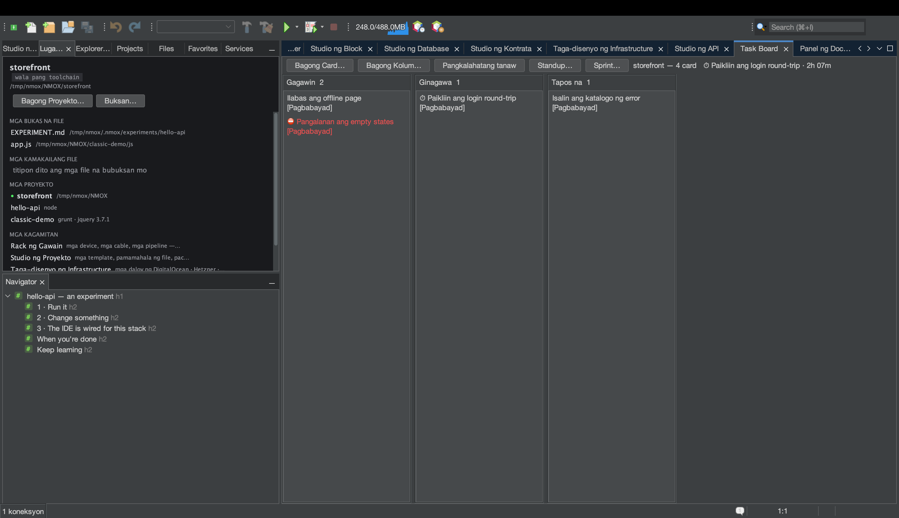
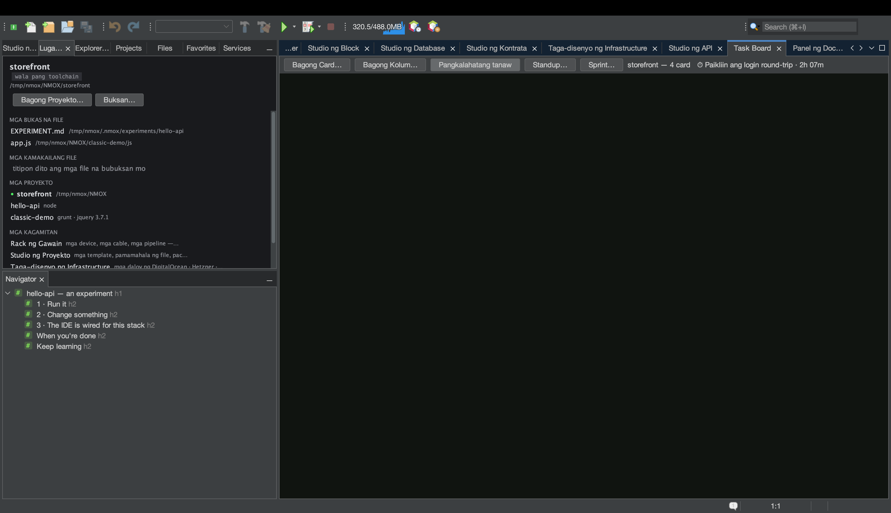
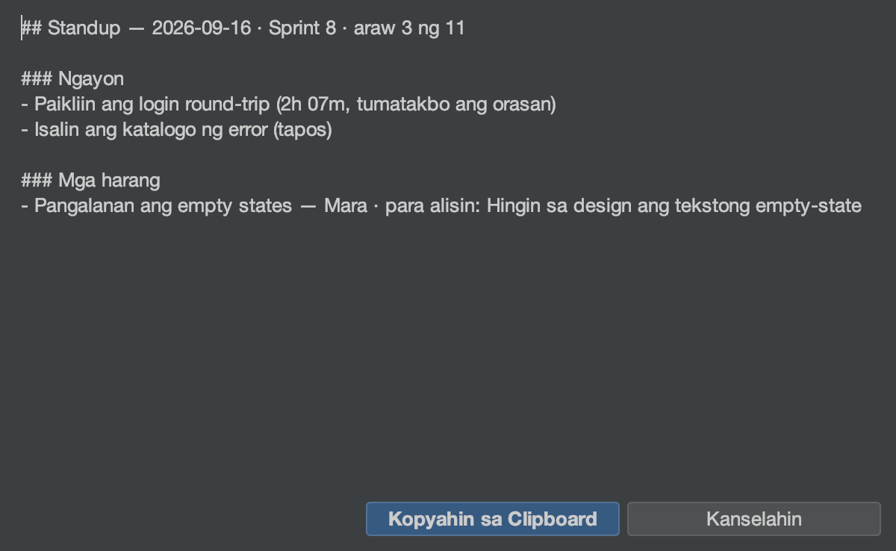

# Tutorial: Ang Task Board at mga sprint

<!-- languages -->
[English](task-board.md) · [Español](task-board.es.md) · [Français](task-board.fr.md) · [Deutsch](task-board.de.md) · [Русский](task-board.ru.md) · [Українська](task-board.uk.md) · [Polski](task-board.pl.md) · [Português (Brasil)](task-board.pt.md) · [Bahasa Indonesia](task-board.id.md) · **Filipino** · [Tiếng Việt](task-board.vi.md) · [简体中文](task-board.zh.md) · [हिन्दी](task-board.hi.md) · [עברית](task-board.he.md) · [العربية](task-board.ar.md)
<!-- /languages -->

Ang Task Board ay isang kanban kada proyekto na nakatira sa iisang file —
`.nmoxtasks.json` sa tabi ng iyong code — at ang lahat ng iba pang ginagawa
ng board ay hinango mula sa file na iyon: isang dashboard, isang time clock,
isang pang-araw-araw na standup, at isang sprint burndown. Walang anumang
talaang iniingatan mo nang mano-mano; ang mga tatak ng mga card mismo ay
ang talaan. Dinadala ng tutorial na ito ang isang board mula tatlong card
hanggang sa isang saradong sprint, nang isang upuan.

## Bago magsimula

Magbukas ng proyekto (anumang proyekto — walang pakialam ang board sa
toolchain). Kung ang proyekto ay isang git repository, mababasa din ng
Standup ang iyong mga commit; kung hindi, ang bahaging iyon ay hindi
kailanman lumilitaw.

## Mga hakbang

1. **Buksan ang board.** `⌥⌘1` (o `Bintana ▸ Task Board`). Pindutin ang
   **Bagong Card…** tatlong beses at bigyan ng pamagat ang bawat card.
   Gumagalaw ang mga card sa paghila, o sa teklado: habang nakapili ang
   isang card, inililipat ito ng **⌘←/⌘→** sa kabilang kolum at inaayos
   muli ng **⌘↑/⌘↓**; nag-e-edit ang **Enter**, nag-aalis ang **Delete**
   (pagkatapos magtanong, na may Hindi bilang default), nagsisimula ng
   bagong card sa kolum na iyon ang **N**. Ang menu ng header ng bawat kolum
   ay nagpapalit ng pangalan nito, nagtatakda ng **limitasyon ng WIP na payo
   lamang** (nagpupula ang header kapag lampas — hindi kailanman pinipigil
   nito ang paglipat), inaayos muli ito, o tinatanggal ito.

2. **Mag-clock in.** Hilahin ang isang card sa gitnang kolum, i-right-click
   ito → **Clock In**. Lumilitaw ang ⏱ sa card at ipinapakita ng header ng
   board ang tumatakbong tagal. Iisang orasan ang tumatakbo sa isang
   pagkakataon — ang pag-clock in sa ibang card ay isinasara ang sesyong ito
   — at ang sesyong wala pang isang minuto ay itinatapon nang buo, kaya ang
   ligaw na pindot ay hindi kailanman binibilang bilang trabaho. Pinapahinto
   ito ng **Clock Out**.

3. **Idagdag ang mga detalyeng kailangan ng standup.** I-right-click ang
   isang card → **Itakda ang Label…** upang tatakan ito ng isang epic, at
   sa ibang card **Markahang Naharang…** — isang may-ari at ang aksyong
   nag-aalis ng harang (kailangan ang aksyon: ang harang na walang aksyon ay
   reklamo, hindi plano). Nagsusuot ng ⛔ ang card; inaalis ito ng
   **Alisin ang harang**, gayon din ang pagtatapos ng card.

4. **Basahin ang Pangkalahatang tanaw.** Pindutin ang **Pangkalahatang
   tanaw** sa toolbar. Nagiging dashboard ang parehong file: mga card sa
   board, **WIP ngayon** (ang mga gitnang kolum lamang), tapos ngayong araw
   at ngayong linggo, isang talaan ng WIP kada kolum na may pulang hatol
   kapag lampas, isang 14-araw na **guhit ng daloy**, ang pinakamatandang
   hindi tapos na mga card at ang kanilang edad, ang legend na **MGA EPIC**
   na hinango mula sa mga label na ginagamit, ang **talaan ng mga harang**
   (pinakamatagal nakabinbin muna), ang mga tala ng **RETRO** sa antas ng
   board (**I-edit ang Retro…**), at ang ulat na **ORAS** — naitala ngayong
   araw at nitong huling pitong araw, saka iisang hanay kada card, ang
   pinakamaraming ngayong araw muna. Ang sesyong tumatawid sa hatinggabi ay
   hinahati kada araw ng kalendaryo, kaya ang bilang ngayong araw ay ang
   trabaho ngayong araw.

5. **Tapusin ang isang bagay.** Patayin ang **Pangkalahatang tanaw** at
   ilipat ang isang card sa huling kolum. Ang sandaling iyon ay itinatatak
   bilang oras ng pagkatapos ng card (ang pag-alis dito ay binabawi ang
   pagkatapos at kinalilimutan ito ng kasaysayan). Bawat bilang ng tapos sa
   Pangkalahatang tanaw ay mula sa mga tatak na ito.

6. **Magsimula ng sprint.** Pindutin ang **Sprint… ▸ Simulan ang Sprint…**,
   pangalanan ito, at tanggapin ang dalawang-linggong window (ang mga petsa
   ay `YYYY-MM-DD`; ang window na pabaligtad o ang hindi petsa ay tinatanggihan
   nang malakas at walang nagbabago). Lumipat sa **Pangkalahatang tanaw**:
   nagkakaroon ito ng header ng sprint at ng **burndown** na muling itinayo
   mula sa mga tatak ng pagkatapos ng mga card — ang malabong linya ay ang
   ideal, ang maliwanag na linya ay ang nangyari, at ang hinaharap ay nananatiling
   hindi iginuhit.

7. **Isulat ang standup.** Pindutin ang **Standup…**. Bumubukas ang ulat bilang
   markdown na may pindutang **Kopyahin sa Clipboard**: **Kahapon** at
   **Ngayon** mula sa mga tatak ng pagkatapos at mga sesyong hinati kada araw
   (ang tumatakbong orasan ay mababasang “tumatakbo ang orasan”), **Mga harang** mula sa
   talaan, **Mga commit (mula kahapon)** mula sa `git log`. Ang mga bahaging
   walang maisasabi ay inaalis, hindi kailanman ipinapakitang walang laman, at
   nagbubukas ang header gamit ang sprint at ang bilang ng araw nito
   (“Sprint 8 · araw 3 ng 14”).

   

8. **Isara ang sprint.** Ang **Sprint… ▸ Ulat ng Sprint…** ay ang kapatid na
   pagsusuri ng Standup — tapos, bukas nang isara, nakaharang pa, naitalang
   oras sa loob ng window, mga tala ng retro — at ang **Sprint… ▸ Isara ang
   Sprint…** ay iniaarkibo ang window, ang bilang ng tapos, at ang retro para
   sa velocity. Nananatili ang mga card kung saan sila eksaktong naroroon: ang
   pagsasara ay pagtatala, hindi paglilinis. Pagkatapos, nag-aalok ang
   pagsasara ng susunod na sprint na nakapuno na (pangalang tinaasan ng bilang,
   window na parehong haba na nagsisimula sa kinabukasan), buong nae-edit, at
   walang sinisimulan ang Cancel. Kapag mayroon nang kasaysayan, ipinapakita ng
   dialog ng Sprint ang bilang para sa pagpaplano — “Velocity — huling 3
   sprint: …” — at nagkakaroon ang ulat ng linya ng velocity nito.

## Ang iyong natutunan

- **Iisang file ang buong talaan.** I-commit ang `.nmoxtasks.json` at
  ibinabahagi ng team ang board, ang retro, at ang kasaysayan ng mga sprint;
  i-ignore ito at nananatili itong pansarili. Laging ipinapakita ang mga
  pamagat ng card bilang payak na mga karakter, kaya ang board na naka-check
  in ay hindi makapagpuslit ng markup.
- **Sinusunod ng board ang file sa magkabilang direksyon.** I-edit ito nang
  mano-mano, i-pull ang push ng kasamahan, o i-check out ang ibang branch, at
  ina-update ang nakikitang board sa loob ng humigit-kumulang isa’t kalahating
  segundo — nananaig ang pagbabago mula sa labas sa isang lipas na kilos, at
  sinasabi ito ng status line.
- **Gumagaling sa pag-load ang mga panganib ng merge.** Ang dobleng id ng
  card, ligaw na bukas na sesyon ng orasan, at sirang window ng sprint ay
  kinukumpuni kapag binabasa ang file, kaya ang keep-both merge ay hindi
  makapagpalobo ng ulat o makapagsira ng mga seremonya.
- **Tahasang sinasabi ang lahat ng hinango.** Ang WIP, ang mga window ng
  tapos, ang burndown, at ang hati ng ORAS ay mga depinisyong mababasa mo sa
  Gabay ng gumagamit, hindi mga hula.

## Susunod

- Ang mga pamagat ng card, ang mga label ng epic, at ang literal na query na
  `blocked` ay pawang naaabot mula sa `⌘I` — tingnan ang [tutorial ng Lugar
  ng Trabaho](workbench.tl.md) para sa kaugaliang hanapin-ang-lahat.
- Idikit ang Standup sa chat, saka magpatuloy: saklaw ng [Ipakita ito sa
  isang silid](show-it-to-a-room.tl.md) ang Kopyahin bilang Markdown at ang
  pamilya ng screenshot.
- Nakatira ang buong mga depinisyon sa [bahagi ng Task Board sa Gabay ng
  gumagamit](../user-guide.tl.md).
