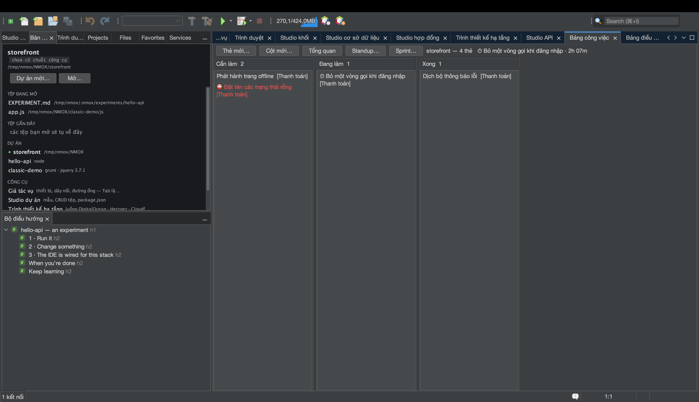
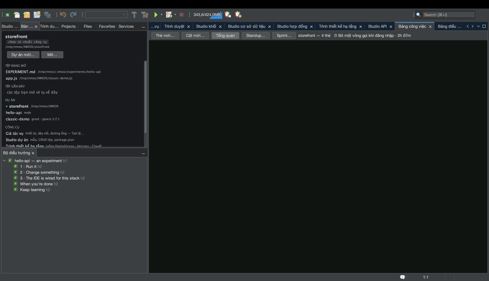
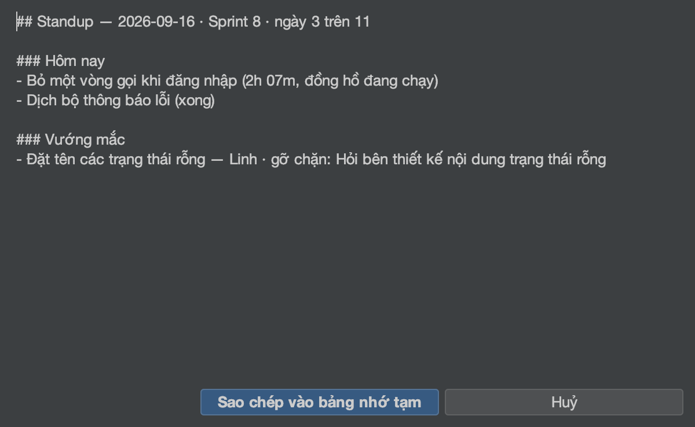

# Hướng dẫn: Bảng công việc và sprint

<!-- languages -->
[English](task-board.md) · [Español](task-board.es.md) · [Français](task-board.fr.md) · [Deutsch](task-board.de.md) · [Русский](task-board.ru.md) · [Українська](task-board.uk.md) · [Polski](task-board.pl.md) · [Português (Brasil)](task-board.pt.md) · [Bahasa Indonesia](task-board.id.md) · [Filipino](task-board.tl.md) · **Tiếng Việt** · [简体中文](task-board.zh.md) · [हिन्दी](task-board.hi.md) · [עברית](task-board.he.md) · [العربية](task-board.ar.md)
<!-- /languages -->

Bảng công việc là một bảng kanban cho từng dự án, sống trong một tệp duy
nhất — `.nmoxtasks.json` nằm cạnh mã của bạn — và mọi thứ khác mà bảng làm
đều được suy ra từ tệp đó: một bảng tổng quan, một đồng hồ bấm giờ, một bản
standup hằng ngày và một biểu đồ burndown cho sprint. Không có gì là sổ sách
bạn phải tự tay ghi; chính các dấu thời gian trên thẻ là bản ghi. Bài hướng
dẫn này đưa một bảng từ ba thẻ tới một sprint đã đóng chỉ trong một buổi.

## Trước khi bắt đầu

Mở một dự án (dự án nào cũng được — bảng không quan tâm tới bộ công cụ). Nếu
dự án là một kho git, bản Standup còn đọc được các commit của bạn; nếu
không, phần đó đơn giản là không bao giờ xuất hiện.

## Các bước

1. **Mở bảng.** `⌥⌘1` (hoặc `Cửa sổ ▸ Bảng công việc`). Nhấn **Thẻ mới…**
   ba lần và đặt tiêu đề cho từng thẻ. Thẻ di chuyển bằng cách kéo, hoặc
   bằng bàn phím: khi một thẻ đang được chọn, **⌘←/⌘→** chuyển nó sang cột
   bên cạnh và **⌘↑/⌘↓** sắp xếp lại nó; **Enter** để sửa, **Delete** để xóa
   (sau khi hỏi, với Không là lựa chọn mặc định), **N** tạo một thẻ mới
   trong cột đó. Trình đơn trên phần đầu mỗi cột cho phép đổi tên cột, đặt
   **giới hạn WIP mang tính khuyến nghị** (phần đầu cột đỏ lên khi vượt —
   nó không bao giờ chặn việc di chuyển), xáo trộn, hoặc xóa cột.

2. **Bắt đầu bấm giờ.** Kéo một thẻ vào cột giữa, nhấp chuột phải vào nó →
   **Bắt đầu bấm giờ**. Một ⏱ hiện trên thẻ và phần đầu bảng hiện thời gian
   đã trôi qua. Mỗi lúc chỉ có một đồng hồ chạy — bắt đầu bấm giờ trên thẻ
   khác sẽ đóng phiên này — và một phiên ngắn hơn một phút bị bỏ đi trọn
   vẹn, nên một cú nhấp nhầm không bao giờ bị tính là công việc. **Dừng bấm
   giờ** để dừng lại.

3. **Thêm những chi tiết một buổi standup cần.** Nhấp chuột phải vào một
   thẻ → **Đặt nhãn…** để gắn nó với một epic, và trên một thẻ khác chọn
   **Đánh dấu bị chặn…** — người phụ trách và hành động sẽ gỡ chặn (hành
   động là bắt buộc: một vướng mắc không có hành động là một lời phàn nàn,
   không phải một kế hoạch). Thẻ mang dấu ⛔; **Gỡ chặn** xóa dấu đó, và
   hoàn thành thẻ cũng vậy.

4. **Đọc Tổng quan.** Nhấn **Tổng quan** trên thanh công cụ. Cùng tệp đó
   biến thành một bảng theo dõi: số thẻ trên bảng, **WIP hiện tại** (chỉ
   các cột giữa), số việc xong hôm nay và tuần này, bảng WIP theo từng cột
   với phán quyết đỏ lên khi vượt, một **dải dòng chảy** 14 ngày, những thẻ
   chưa xong lâu nhất kèm tuổi của chúng, chú giải **EPIC** suy ra từ các
   nhãn đang dùng, **danh sách vướng mắc** (thẻ kẹt lâu nhất đứng trước),
   ghi chú **RETRO** cho cả bảng (**Sửa retro…**), và báo cáo **THỜI GIAN**
   — thời gian đã bấm hôm nay và bảy ngày qua, rồi mỗi thẻ một dòng, thẻ
   nhiều giờ nhất hôm nay đứng đầu. Một phiên vắt qua nửa đêm được cắt theo
   từng ngày lịch, nên con số của hôm nay đúng là công việc của hôm nay.

5. **Hoàn thành một việc.** Tắt **Tổng quan** và chuyển một thẻ vào cột
   cuối. Khoảnh khắc đó được đóng dấu làm thời điểm hoàn thành của thẻ
   (chuyển nó ra lại là bỏ hoàn thành, và lịch sử quên nó đi). Mọi con số
   hoàn thành trên Tổng quan đều đến từ những dấu này.

6. **Bắt đầu một sprint.** Nhấn **Sprint… ▸ Bắt đầu sprint…**, đặt tên, và
   chấp nhận khoảng thời gian hai tuần (ngày theo dạng `YYYY-MM-DD`; một
   khoảng ngược chiều hoặc thứ không phải ngày sẽ bị từ chối rõ ràng và
   không có gì thay đổi). Chuyển sang **Tổng quan**: nó có thêm phần đầu
   sprint và một **burndown** dựng lại từ các dấu hoàn thành của thẻ —
   đường mờ là đường lý tưởng, đường sáng là những gì đã diễn ra, còn tương
   lai thì để trống.

7. **Viết bản standup.** Nhấn **Standup…**. Báo cáo mở ra dưới dạng markdown
   với nút **Sao chép vào bảng nhớ tạm**: **Hôm qua** và **Hôm nay** lấy
   từ các dấu hoàn thành và các phiên đã cắt theo ngày (một đồng hồ đang
   chạy ghi “đồng hồ đang chạy”), **Vướng mắc** lấy từ danh sách vướng mắc,
   **Commit (từ hôm qua)** lấy từ `git log`. Phần nào không có gì để nói thì
   bị lược đi, không bao giờ hiện trống, và phần đầu mở bằng sprint cùng số
   ngày của nó (“Sprint 8 · ngày 3 trên 14”).

   

8. **Đóng sprint.** **Sprint… ▸ Báo cáo sprint…** là người anh em dùng để
   nhìn lại của Standup — việc đã xong, việc còn mở lúc đóng, việc vẫn bị
   chặn, thời gian đã bấm trong khoảng đó, ghi chú retro — còn **Sprint… ▸
   Đóng sprint…** lưu trữ khoảng thời gian, số việc đã xong và retro để tính
   vận tốc. Các thẻ vẫn ở nguyên chỗ cũ: đóng sprint là ghi sổ, không phải
   dọn dẹp. Sau đó, việc đóng sprint đề nghị sprint kế tiếp đã điền sẵn (tên
   tăng lên một, cùng độ dài, bắt đầu từ ngày hôm sau), sửa được toàn bộ, và
   nhấn Hủy thì không bắt đầu gì cả. Khi đã có lịch sử, hộp thoại Sprint hiện
   con số để lập kế hoạch — “Vận tốc — 3 sprint gần nhất: …” — và báo cáo có
   thêm dòng vận tốc.

## Bạn vừa học được gì

- **Một tệp là toàn bộ bản ghi.** Commit `.nmoxtasks.json` và cả nhóm dùng
  chung bảng, retro và lịch sử sprint; bỏ qua nó thì nó vẫn là của riêng
  bạn. Tiêu đề thẻ luôn hiển thị thành ký tự thuần, nên một bảng đã đưa vào
  kho không thể lén chèn markup.
- **Bảng theo tệp theo cả hai chiều.** Sửa tay, kéo về thay đổi của đồng
  đội, hay checkout một nhánh khác, và bảng đang hiện sẽ cập nhật trong
  khoảng một giây rưỡi — một thay đổi từ bên ngoài thắng một thao tác đã cũ,
  và thanh trạng thái nói rõ điều đó.
- **Rủi ro khi merge được chữa lúc nạp.** Id thẻ trùng nhau, phiên đồng hồ
  mở lạc lõng và khoảng thời gian sprint bị hỏng đều được sửa khi đọc tệp,
  nên một lần merge giữ cả hai phía không thể thổi phồng báo cáo hay làm hỏng
  các buổi họp sprint.
- **Mọi thứ suy ra đều được nêu rõ.** WIP, các khoảng tính hoàn thành,
  burndown và cách cắt THỜI GIAN là những định nghĩa bạn đọc được trong Hướng
  dẫn sử dụng, không phải phỏng đoán.

## Tiếp theo

- Tiêu đề thẻ, nhãn epic và truy vấn nguyên văn `blocked` đều với tới được
  từ `⌘I` — xem [bài hướng dẫn về Bàn làm việc](workbench.vi.md) để tập thói
  quen tìm mọi thứ.
- Dán bản Standup vào cuộc trò chuyện, rồi đi tiếp: [Trình bày trước cả
  phòng](show-it-to-a-room.vi.md) nói về Sao chép dưới dạng Markdown và nhóm
  ảnh chụp màn hình.
- Toàn bộ định nghĩa nằm trong [phần Bảng công việc của Hướng dẫn sử
  dụng](../user-guide.vi.md).
