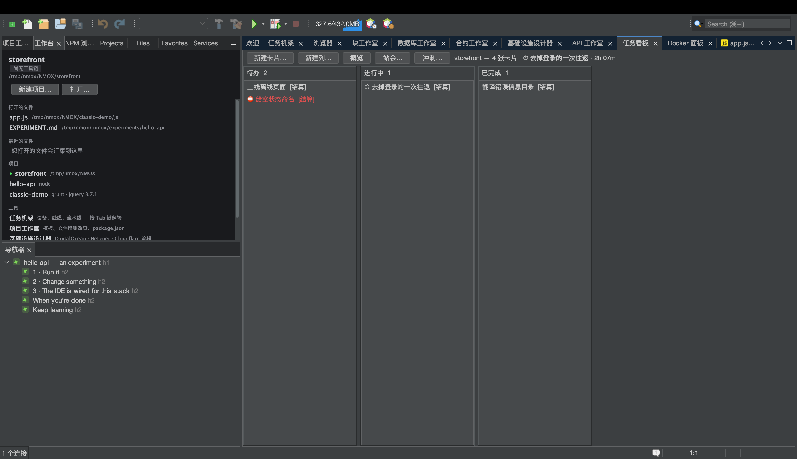
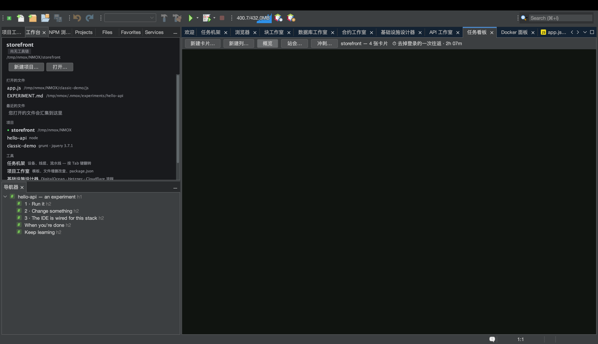
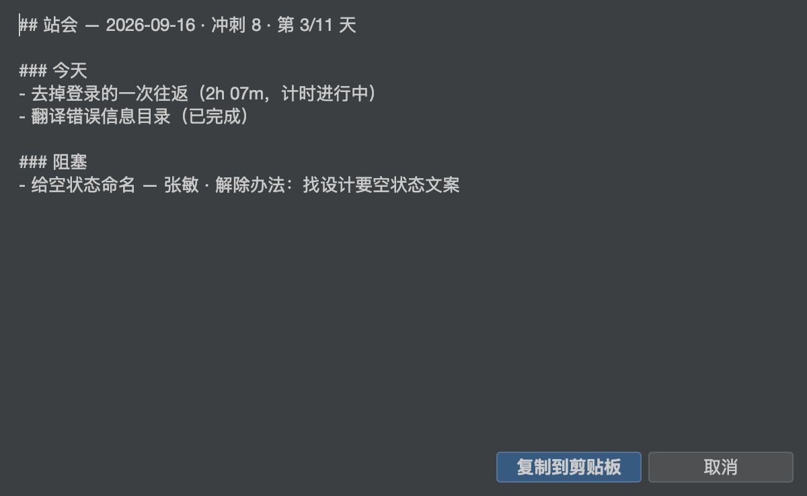

# 教程：任务看板与冲刺

<!-- languages -->
[English](task-board.md) · [Español](task-board.es.md) · [Français](task-board.fr.md) · [Deutsch](task-board.de.md) · [Русский](task-board.ru.md) · [Українська](task-board.uk.md) · [Polski](task-board.pl.md) · [Português (Brasil)](task-board.pt.md) · [Bahasa Indonesia](task-board.id.md) · [Filipino](task-board.tl.md) · [Tiếng Việt](task-board.vi.md) · **简体中文** · [हिन्दी](task-board.hi.md) · [עברית](task-board.he.md) · [العربية](task-board.ar.md)
<!-- /languages -->

任务看板是一块按项目划分的看板，它只住在一个文件里 — 与你的代码放在一起的 `.nmoxtasks.json` — 看板做的其他一切都由这个文件推导出来：仪表盘、计时器、每日站会，以及冲刺燃尽图。没有任何东西需要你手工记账；卡片自己的时间戳就是记录。本教程一次坐下来，把一块看板从三张卡片带到一个关闭的冲刺。

## 开始之前

打开一个项目（什么项目都行 — 看板不关心工具链）。如果项目是 git 仓库，站会还能读取你的提交；如果不是，那一节干脆不会出现。

## 步骤

1. **打开看板。**`⌥⌘1`（或者 `窗口 ▸ 任务看板`）。按三次**新建卡片…**，给每张卡片起个标题。卡片可以拖动，也可以用键盘移动：选中一张卡片后，**⌘←/⌘→** 把它移到相邻的列，**⌘↑/⌘↓** 调整顺序；**Enter** 编辑，**Delete** 删除（会先询问，默认按钮是“否”），**N** 在该列新建一张卡片。每个列头的菜单可以重命名该列、设置**仅供参考的 WIP 限额**（超过时列头变红 — 但它从不阻止移动）、打乱顺序，或者删除该列。

2. **开始计时。**把一张卡片拖进中间那一列，右键点它 → **开始计时**。卡片上会出现一个 ⏱，看板标题栏显示已经过去的时间。同一时间只有一个计时器在走 — 在另一张卡片上开始计时会结束这一段 — 不足一分钟的时段会被整段丢弃，所以一次误点永远不会被算作工作。**停止计时**让它停下。

3. **补上站会需要的细节。**右键点一张卡片 → **设置标签…**，给它打上一个史诗的标签；在另一张卡片上选**标记为受阻…** — 填上负责人以及能解除阻塞的动作（动作是必填的：没有动作的阻塞只是抱怨，不是计划）。卡片会挂上 ⛔；**解除阻塞**会清除它，完成这张卡片也会。

4. **读概览。**按工具栏上的**概览**。同一个文件变成一块仪表盘：看板上的卡片、**当前 WIP**（只算中间各列）、今天和本周完成的数量、按列列出的 WIP 登记（超限时显示红色判定）、14 天的**流动**条、最老的未完成卡片及其存在时长、由正在使用的标签推导出的**史诗**图例、**阻塞登记**（卡得最久的在前）、整块看板的**回顾**记录（**编辑回顾…**），以及**时间**报告 — 今天和最近七天的计时，然后每张卡片一行，今天用时最多的在前。跨越午夜的时段会按日历日切开，所以“今天”的数字就是今天的工作。

5. **完成点什么。**关掉**概览**，把一张卡片移到最后一列。这一刻会被记为这张卡片的完成时间（再把它移出去就会取消完成，历史也会忘掉它）。概览上的每一个完成数字都来自这些时间戳。

6. **开始一个冲刺。**按**冲刺… ▸ 开始冲刺…**，给它起个名字，接受默认的两周窗口（日期格式为 `YYYY-MM-DD`；倒过来的窗口或者不是日期的内容会被明确拒绝，什么都不会改变）。切到**概览**：它会多出一个冲刺标题，以及一张根据卡片的完成时间戳重建的**燃尽图** — 暗线是理想线，亮线是实际发生的，未来的部分不画。

7. **写站会纪要。**按**站会…**。报告以 markdown 形式打开，附带一个**复制到剪贴板**按钮：**昨天**和**今天**来自完成时间戳和按日切开的时段（正在走的计时器显示为“计时进行中”），**阻塞**来自阻塞登记，**提交（自昨天起）**来自 `git log`。无话可说的小节会被省略，从不以空白的形式出现；报告的标题以冲刺及其天数开头（“Sprint 8 · 第 3/14 天”）。

   

8. **关闭冲刺。****冲刺… ▸ 冲刺报告…** 是站会的回顾版兄弟 — 已完成的、关闭时仍未完成的、仍然受阻的、窗口内的计时时间、回顾记录 — 而 **冲刺… ▸ 关闭冲刺…** 会把窗口、完成数和回顾归档，用于计算速率。卡片完全留在原地：关闭是记账，不是清理。关闭之后，它会提议下一个冲刺并预先填好（名字递增，窗口长度相同、从第二天开始），完全可以编辑，按取消则什么都不会开始。一旦有了历史，冲刺对话框就会显示用来做计划的那个数字 — “速率 — 最近 3 个冲刺：…” — 报告里也会多出速率那一行。

## 你刚学到了什么

- **一个文件就是全部记录。**提交 `.nmoxtasks.json`，团队就共享这块看板、回顾和冲刺历史；忽略它，它就只属于你个人。卡片标题始终以纯字符渲染，所以签入仓库的看板没法夹带标记。
- **看板双向跟随文件。**手工编辑它、拉下队友的推送，或者检出另一个分支，可见的看板会在大约一秒半内更新 — 外部编辑会胜过一个过时的操作，状态栏会说明这一点。
- **合并隐患在加载时自愈。**重复的卡片 id、多余的未结束计时时段，以及被弄乱的冲刺窗口，都会在读取文件时修复，所以一次“两边都保留”的合并既不会让报告虚高，也不会毒害敏捷仪式。
- **所有推导出来的东西都有明确定义。**WIP、完成窗口、燃尽图和时间的按日切分，都是你可以在用户指南里读到的定义，而不是经验估算。

## 下一步

- 卡片标题、史诗标签，以及字面查询 `blocked`，都能从 `⌘I` 找到 — 关于“什么都搜”的习惯，请看[工作台教程](workbench.zh.md)。
- 把站会纪要粘贴到聊天里，然后继续：[演示给满屋子的人看](show-it-to-a-room.zh.md)讲的是复制为 Markdown 和截图那一族功能。
- 完整的定义在[用户指南的任务看板一节](../user-guide.zh.md)里。
