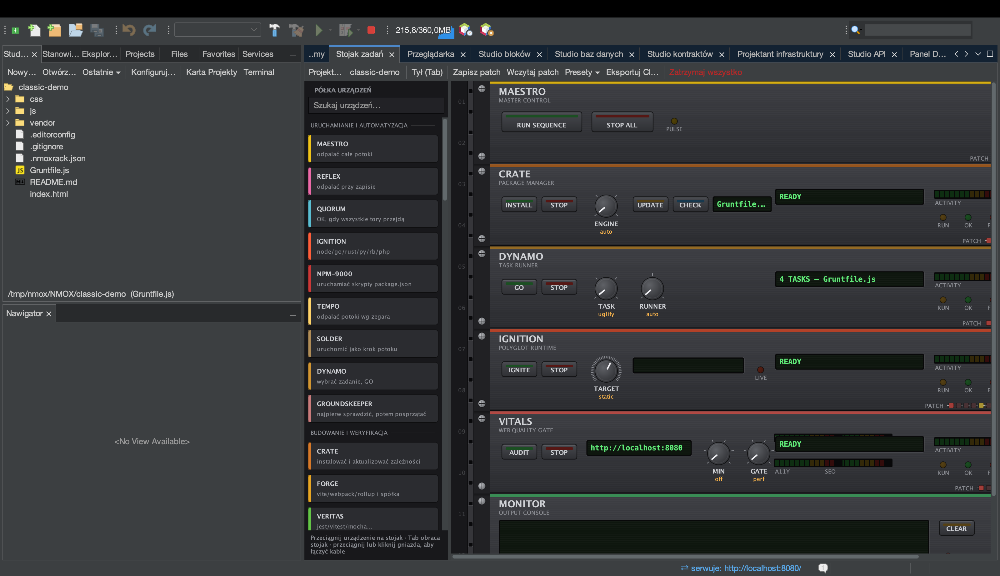
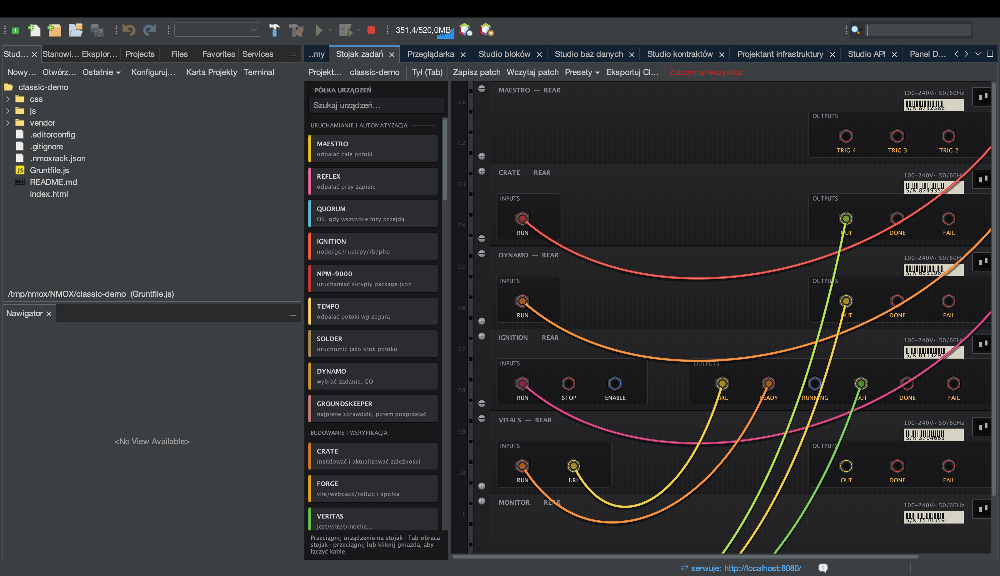

# Samouczek: Stojak zadań

<!-- languages -->
[English](the-task-rack.md) · [Español](the-task-rack.es.md) · [Français](the-task-rack.fr.md) · [Deutsch](the-task-rack.de.md) · [Русский](the-task-rack.ru.md) · [Українська](the-task-rack.uk.md) · **Polski** · [Português (Brasil)](the-task-rack.pt.md) · [Bahasa Indonesia](the-task-rack.id.md) · [Filipino](the-task-rack.tl.md) · [Tiếng Việt](the-task-rack.vi.md) · [简体中文](the-task-rack.zh.md) · [हिन्दी](the-task-rack.hi.md) · [עברית](the-task-rack.he.md) · [العربية](the-task-rack.ar.md)
<!-- /languages -->

Stojak zadań to znak rozpoznawczy NMOX Studio: narzędzia do budowania,
testów i serwowania rozłożone jako stojak urządzeń sprzętowych, które
łączysz kablami krosowymi. Urządzenie uruchamia prawdziwe polecenie;
kabel niesie prawdziwy sygnał. Ten samouczek buduje malutki układ —
uruchom coś i obejrzyj jego wyjście na monitorze — żeby metafora zaskoczyła.

## Zanim zaczniesz

Otwórz projekt (nada się dowolny projekt Node; `Plik ▸ Nowy projekt…` →
„Vanilla Web”, jeśli go potrzebujesz). Otwarcie projektu **celuje** w niego
stojakiem, więc każde urządzenie działa w katalogu tego projektu.

## Kroki

1. **Otwórz stojak.** Kliknij kartę **Stojak zadań** (albo naciśnij `⌘9`).
   Startowy stojak ma jedno urządzenie **MONITOR** — konsolę, która
   pokazuje wyjście poleceń i wiersze błędów.

2. **Dodaj uruchamiacz.** Przeciągnij **IGNITION** z półki urządzeń po lewej
   na stojak. IGNITION to wielojęzyczne urządzenie „uruchom”; wycelowane
   w projekt Node uruchamia `npm run dev` (samo wykrywa menedżera pakietów
   i łańcuch narzędzi).

3. **Połącz go z monitorem.** Kliknij **Tył (Tab)** (albo naciśnij Tab), żeby
   zobaczyć tył, potem kliknij gniazdo **OUT** urządzenia IGNITION i gniazdo
   **IN** urządzenia MONITOR — połączy je kabel krosowy. (Przeciąganie
   między gniazdami też działa; klikanie jest wygodniejsze, gdy stojak jest
   szeroki.)

4. **Odpal.** Obróć stojak przodem i naciśnij przycisk **IGNITE** urządzenia
   IGNITION. Uruchamia proces; wyjście spływa do MONITOR, a diody stanu
   się zapalają. Jeśli projekt nie jest jeszcze zaufany, najpierw dostaniesz
   jednorazowe pytanie o zaufanie do obszaru roboczego — to straż, która
   nie pozwala sklonowanemu repozytorium uruchamiać skryptów bez twojej
   zgody.

5. **Zapisz układ.** Przycisk **Zapisz patch** zapisuje
   `.nmoxrack.json` obok projektu. Otwórz projekt później, a układ —
   urządzenia, kable, położenia pokręteł — wróci dokładnie taki sam.

## Czego się właśnie nauczyłeś

- **Urządzenia to narzędzia z płytami czołowymi.** Pokrętła wybierają
  opcje, przyciski GO uruchamiają, diody i wyświetlacze pokazują stan —
  i każdy element sterujący jest prawdziwy (żadnych martwych pokręteł;
  pilnuje tego test kontraktowy).
- **Kable koordynują tory.** OUT→IN to najprostsze połączenie; bramki
  gotowości (`ENABLE`), bariery łączenia (`QUORUM`) i kable wyzwalające
  pozwalają złożyć cały potok, który reaguje sam na siebie.
- **Wszystko się zapisuje.** Układ to plik, który wrzucasz do repozytorium;
  stojak potrafi nawet wskrzesić działającą sesję po awarii.

## Dalej

- Urządzeń jest 53 — przejrzyj je w [devices.md](../devices.md) albo na
  półce urządzeń (kliknij prawym zamontowane urządzenie, żeby otworzyć jego
  **Jak używać…**).
- Poproś [KVASIR](kvasir.pl.md) o wyjaśnienie nieudanego uruchomienia.
- Wyeksportuj układ do przepływu GitHub Actions: służy do tego **eksport CI**
  stojaka.
