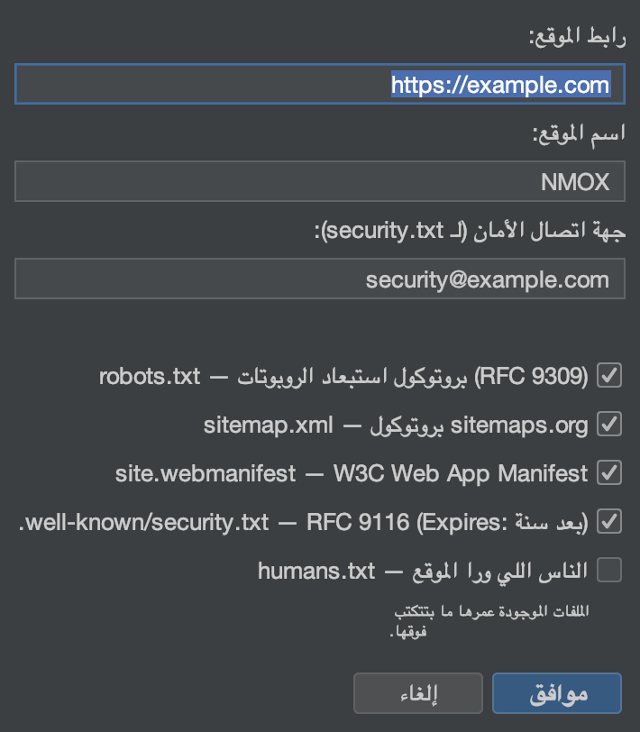

# درس: المعالجات والعدد

<!-- languages -->
[English](wizards-and-kits.md) · [Español](wizards-and-kits.es.md) · [Français](wizards-and-kits.fr.md) · [Deutsch](wizards-and-kits.de.md) · [Русский](wizards-and-kits.ru.md) · [Українська](wizards-and-kits.uk.md) · [Polski](wizards-and-kits.pl.md) · [Português (Brasil)](wizards-and-kits.pt.md) · [Bahasa Indonesia](wizards-and-kits.id.md) · [Filipino](wizards-and-kits.tl.md) · [Tiếng Việt](wizards-and-kits.vi.md) · [简体中文](wizards-and-kits.zh.md) · [हिन्दी](wizards-and-kits.hi.md) · [עברית](wizards-and-kits.he.md) · **العربية**
<!-- /languages -->

NMOX Studio جاي معاه كذا مولّد بيشتغل مرة واحدة وبيضيف هياكل على مستوى
الإنتاج لمشروع موجود، من غير ما يكتب فوق ملفاتكم. الدرس ده بيضيف PWA
لمشروع ويب؛ والباقيين بيشتغلوا بنفس الطريقة.

<!-- screenshot: the PWA Kit wizard, then the generated icons/manifest/sw.js in the tree -->

## العدد

- **عدة PWA** — هيكل تطبيق قابل للتثبيت: **مصنع أيقونات** بـ Java2D
  (ومعاه مجموعة الـ maskable)، وService Worker مقروء (app-shell / الشبكة
  الأول)، وصفحة أوفلاين، وتوصيل في `index.html` بيدّي نفس النتيجة لو
  اتعاد.
- **عدة المعايير** — أساسيات الويب اللي لازم تبقى موجودة: `robots.txt`،
  و`sitemap.xml`، و`manifest` تطبيق الويب، و`security.txt` حسب RFC 9116،
  و`humans.txt`.
- **العدة الكلاسيكية** — وسّعوا أي كود بـ jQuery / MooTools / Prototype /
  Backbone / Knockout، متضمّنين في الريبو أو من npm، ومعاهم هياكل
  webpack/grunt/gulp/bower.

## الخطوات (عدة PWA)

1. **توجّهوا على مشروع ويب** (فيه `index.html`).

2. **شغّلوا المعالج.** `ملف ◂ إضافة للمشروع ◂ عدة PWA…`. حددوا له جذر
   الويب، واكتبوا اسم التطبيق ولون الثيم.

3. **خلّصوا.** المعالج بيولّد مجموعة الأيقونات، و`manifest.webmanifest`،
   و`sw.js`، و`offline.html`، وبيوصّلهم في `index.html` — و**عمره ما
   بيكتب فوق حاجة**: لو الملف موجود، بيكتب جنبه نسخة ‎`.suggested` بداله.

4. **اتأكدوا.** قدّموا المشروع (IGNITION في الراك) وافتحوه — التطبيق بقى
   قابل للتثبيت وبيشتغل أوفلاين.

## اللي اتعلمتوه

- العدد بتطلّع مخرجات حقيقية ومقروءة وملككم — مش صندوق أسود.
- كل مولّد بيدّي نفس النتيجة لو اتعاد، وعمره ما بيكتب فوق شغلكم.
- نفس الالتزام وقت الحفظ موجود في أماكن تانية: `.editorconfig` بيتحترم
  عند الحفظ في المحرر كله.

## بعد كده

- عدة المعايير لـ `security.txt` و`robots`/`sitemap`.
- قيّموا هيدرز النتيجة من تبويب «المعايير» في
  [استوديو الـ API](api-studio.ar.md).
