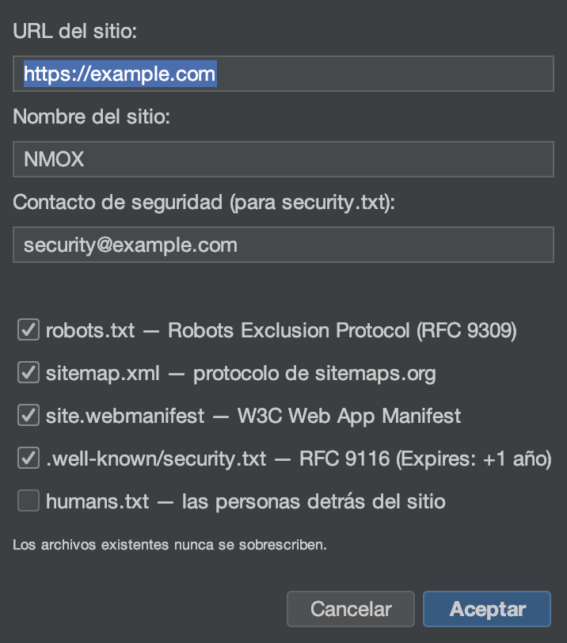

# Tutorial: asistentes y kits

<!-- languages -->
[English](wizards-and-kits.md) · **Español** · [Français](wizards-and-kits.fr.md) · [Deutsch](wizards-and-kits.de.md) · [Русский](wizards-and-kits.ru.md) · [Українська](wizards-and-kits.uk.md) · [Polski](wizards-and-kits.pl.md) · [Português (Brasil)](wizards-and-kits.pt.md) · [Bahasa Indonesia](wizards-and-kits.id.md) · [Filipino](wizards-and-kits.tl.md) · [Tiếng Việt](wizards-and-kits.vi.md) · [简体中文](wizards-and-kits.zh.md) · [हिन्दी](wizards-and-kits.hi.md) · [עברית](wizards-and-kits.he.md) · [العربية](wizards-and-kits.ar.md)
<!-- /languages -->

NMOX Studio trae varios generadores de un solo uso que añaden andamiaje
de calidad de producción a un proyecto existente sin pisar tus archivos.
Este tutorial añade una PWA a un proyecto web; los demás funcionan igual.

<!-- screenshot: the PWA Kit wizard, then the generated icons/manifest/sw.js in the tree -->

## Los kits

- **Kit de PWA**: el andamiaje de una aplicación instalable. Una **forja
  de iconos** en Java2D (con el juego enmascarable incluido), un
  trabajador de servicio legible (shell de aplicación o red primero), una
  página sin conexión y el cableado idempotente del `index.html`.
- **Kit de estándares**: lo mínimo que la web espera. `robots.txt`,
  `sitemap.xml`, el `manifest` de la aplicación web, el `security.txt`
  del RFC 9116 y `humans.txt`.
- **Kit clásico**: amplía cualquier código con jQuery, MooTools,
  Prototype, Backbone o Knockout, incluidos en el repositorio o desde npm,
  más andamiajes de webpack, grunt, gulp o bower.

## Pasos (Kit de PWA)

1. **Apunta a un proyecto web** (uno con un `index.html`).

2. **Ejecuta el asistente.** `Archivo ▸ Añadir al proyecto ▸ PWA Kit…`.
   Indícale la raíz web y ponle un nombre a la aplicación y un color de
   tema.

3. **Termina.** El asistente genera el juego de iconos,
   `manifest.webmanifest`, `sw.js` y `offline.html`, y los cablea en
   `index.html`. Y **nunca pisa nada**: si un archivo ya existe, escribe
   a su lado un hermano `.suggested`.

4. **Compruébalo.** Sirve el proyecto (IGNITION en el rack) y cárgalo: la
   aplicación ya es instalable y funciona sin conexión.

## Lo que acabas de aprender

- Los kits producen resultados reales y legibles que son tuyos, no una
  caja negra.
- Cada generador es idempotente y nunca sobrescribe tu trabajo.
- El mismo civismo al guardar se aplica en otras partes: el editor
  respeta `.editorconfig` al guardar.

## Siguiente

- El Kit de estándares para `security.txt` y `robots`/`sitemap`.
- Pon nota a las cabeceras del resultado en la pestaña Estándares del
  [Estudio de API](api-studio.es.md).
