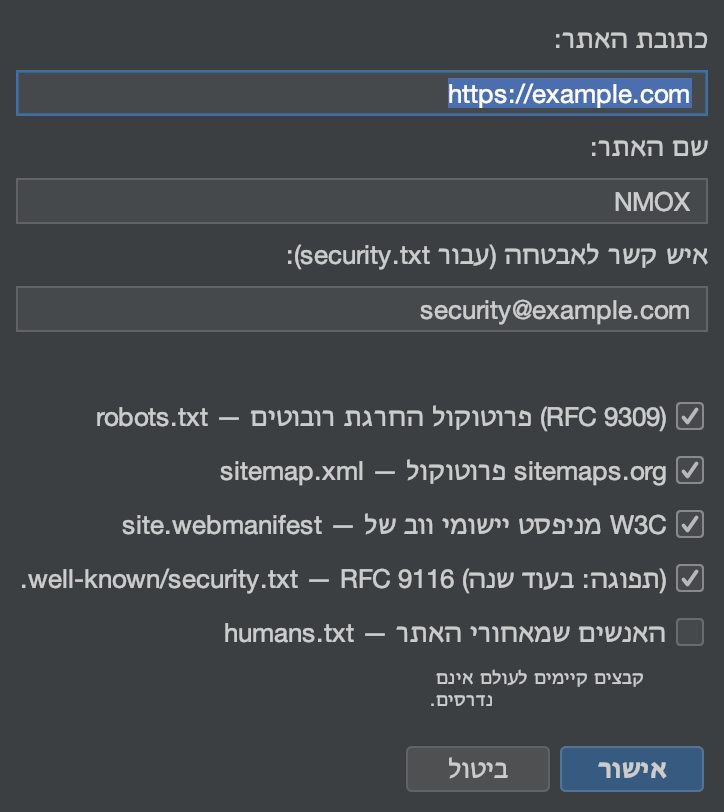

# מדריך: אשפים וערכות

<!-- languages -->
[English](wizards-and-kits.md) · [Español](wizards-and-kits.es.md) · [Français](wizards-and-kits.fr.md) · [Deutsch](wizards-and-kits.de.md) · [Русский](wizards-and-kits.ru.md) · [Українська](wizards-and-kits.uk.md) · [Polski](wizards-and-kits.pl.md) · [Português (Brasil)](wizards-and-kits.pt.md) · [Bahasa Indonesia](wizards-and-kits.id.md) · [Filipino](wizards-and-kits.tl.md) · [Tiếng Việt](wizards-and-kits.vi.md) · [简体中文](wizards-and-kits.zh.md) · [हिन्दी](wizards-and-kits.hi.md) · **עברית** · [العربية](wizards-and-kits.ar.md)
<!-- /languages -->

NMOX Studio מגיע עם כמה מחוללים חד־פעמיים שמוסיפים לפרויקט קיים שלד ברמת ייצור, בלי לדרוס את הקבצים שלכם. המדריך הזה מוסיף PWA לפרויקט ווב; השאר עובדים באותה דרך.

<!-- screenshot: the PWA Kit wizard, then the generated icons/manifest/sw.js in the tree -->

## הערכות

- **ערכת PWA** — שלד לאפליקציה שאפשר להתקין: **יציקת סמלים** ב‑Java2D (כולל הסט ה‑maskable), Service Worker קריא (app shell או רשת תחילה), דף לא מקוון, וחיווט אידמפוטנטי ב‑`index.html`.
- **ערכת תקנים** — הבסיס שכל אתר צריך: `robots.txt`, ‏`sitemap.xml`, ‏`manifest` של אפליקציית הרשת, `security.txt` לפי RFC 9116 ו‑`humans.txt`.
- **ערכה קלאסית** — הרחיבו כל בסיס קוד עם jQuery / MooTools / Prototype / Backbone / Knockout, מצורפים למאגר או דרך npm, ובנוסף שלדים של webpack/grunt/gulp/bower.

## צעדים (ערכת PWA)

1. **כוונו לפרויקט ווב** (כזה שיש בו `index.html`).

2. **הריצו את האשף.** `קובץ ◂ הוספה לפרויקט ◂ ערכת PWA…`. כוונו אותו לשורש הווב שלכם, וקבעו שם לאפליקציה וצבע ערכת נושא.

3. **סיימו.** האשף יוצר את סט הסמלים, `manifest.webmanifest`, ‏`sw.js` ו‑`offline.html`, ומחווט אותם ב‑`index.html` — והוא **לעולם אינו דורס**: אם קובץ כבר קיים, הוא כותב לצידו קובץ ‎`.suggested` במקומו.

4. **ודאו.** הגישו את הפרויקט (IGNITION בראק) וטענו אותו — עכשיו אפשר להתקין את האפליקציה, והיא עובדת גם בלי חיבור.

## מה למדתם

- הערכות מפיקות פלט אמיתי וקריא שהוא שלכם — לא קופסה שחורה.
- כל מחולל אידמפוטנטי ולעולם אינו דורס את העבודה שלכם.
- אותה התנהגות בשמירה חלה גם במקומות אחרים: ‎`.editorconfig` נאכף בשמירה בכל העורך.

## הלאה

- ערכת תקנים עבור `security.txt` ו‑`robots`/`sitemap`.
- תנו ציון לכותרות של התוצאה בלשונית תקנים של [אולפן ה‑API](api-studio.he.md).
