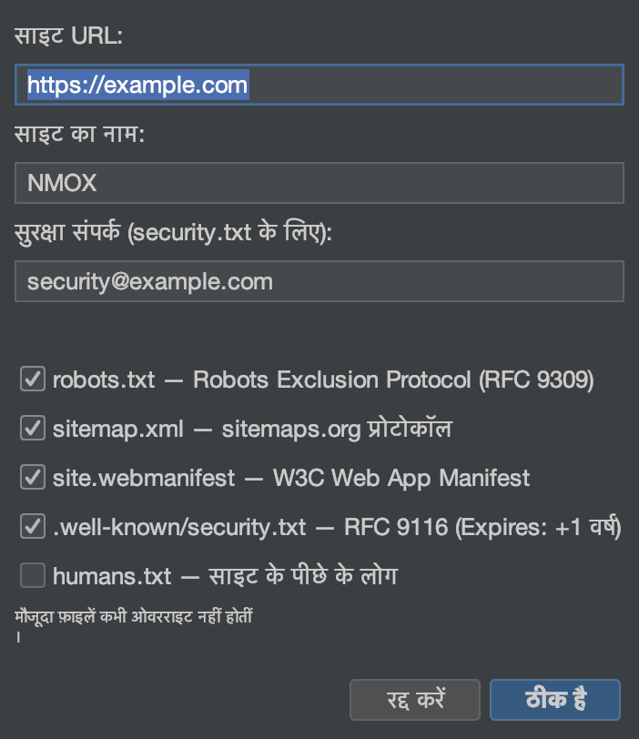

# ट्यूटोरियल: विज़ार्ड और किट

<!-- languages -->
[English](wizards-and-kits.md) · [Español](wizards-and-kits.es.md) · [Français](wizards-and-kits.fr.md) · [Deutsch](wizards-and-kits.de.md) · [Русский](wizards-and-kits.ru.md) · [Українська](wizards-and-kits.uk.md) · [Polski](wizards-and-kits.pl.md) · [Português (Brasil)](wizards-and-kits.pt.md) · [Bahasa Indonesia](wizards-and-kits.id.md) · [Filipino](wizards-and-kits.tl.md) · [Tiếng Việt](wizards-and-kits.vi.md) · [简体中文](wizards-and-kits.zh.md) · **हिन्दी** · [עברית](wizards-and-kits.he.md) · [العربية](wizards-and-kits.ar.md)
<!-- /languages -->

NMOX Studio कई एक-बार चलने वाले जनरेटर के साथ आता है जो किसी मौजूदा
प्रोजेक्ट में प्रोडक्शन-स्तर का ढाँचा जोड़ते हैं, आपकी फ़ाइलों को ऊपर से
लिखे बिना। यह ट्यूटोरियल एक वेब प्रोजेक्ट में PWA जोड़ता है; बाक़ी किट
भी इसी तरह काम करते हैं।

<!-- screenshot: the PWA Kit wizard, then the generated icons/manifest/sw.js in the tree -->

## किट

- **PWA Kit** — संस्थापित की जा सकने वाली ऐप का ढाँचा: Java2D का **आइकन
  कारख़ाना** (मास्क किए जा सकने वाले सेट सहित), पढ़ने लायक़ service worker
  (app-shell / network-first), ऑफ़लाइन पेज, और `index.html` की ऐसी
  जोड़-तोड़ जो दोहराने पर वही नतीजा देती है।
- **Standards Kit** — वेब की बुनियादी चीज़ें: `robots.txt`, `sitemap.xml`,
  वेब ऐप `manifest`, RFC 9116 `security.txt`, `humans.txt`।
- **Classic Kit** — किसी भी कोडबेस में, रिपॉज़िटरी में रखे या npm से,
  jQuery / MooTools / Prototype / Backbone / Knockout जोड़ें, साथ में
  webpack/grunt/gulp/bower का ढाँचा।

## चरण (PWA Kit)

1. **कोई वेब प्रोजेक्ट लक्षित करें** (जिसमें `index.html` हो)।

2. **विज़ार्ड चलाएँ।** `फ़ाइल ▸ प्रोजेक्ट में जोड़ें ▸ PWA Kit…`। उसे अपने वेब रूट पर
   इंगित करें और ऐप का नाम तथा थीम रंग तय करें।

3. **पूरा करें।** विज़ार्ड आइकन सेट, `manifest.webmanifest`, `sw.js` और
   `offline.html` बनाता है और उन्हें `index.html` से जोड़ देता है — और वह
   **कभी ऊपर से नहीं लिखता**: कोई फ़ाइल पहले से हो तो उसकी जगह बग़ल में
   `.suggested` फ़ाइल लिखता है।

4. **पुष्टि करें।** प्रोजेक्ट को सर्व करें (रैक का IGNITION) और खोलें — ऐप
   अब संस्थापित की जा सकती है और ऑफ़लाइन काम करती है।

## आपने अभी क्या सीखा

- किट असली, पढ़ने लायक़ आउटपुट देते हैं जो आपका अपना है — कोई ब्लैक बॉक्स
  नहीं।
- हर जनरेटर दोहराने पर वही नतीजा देता है और आपका काम कभी ऊपर से नहीं
  लिखता।
- सहेजते समय यही नागरिकता बाक़ी जगह भी लागू है: पूरे एडिटर में सहेजने पर
  `.editorconfig` का पालन होता है।

## आगे

- `security.txt` और `robots`/`sitemap` के लिए Standards Kit।
- नतीजे के हेडर का ग्रेड [API स्टूडियो](api-studio.hi.md) के मानक टैब में
  देखें।
