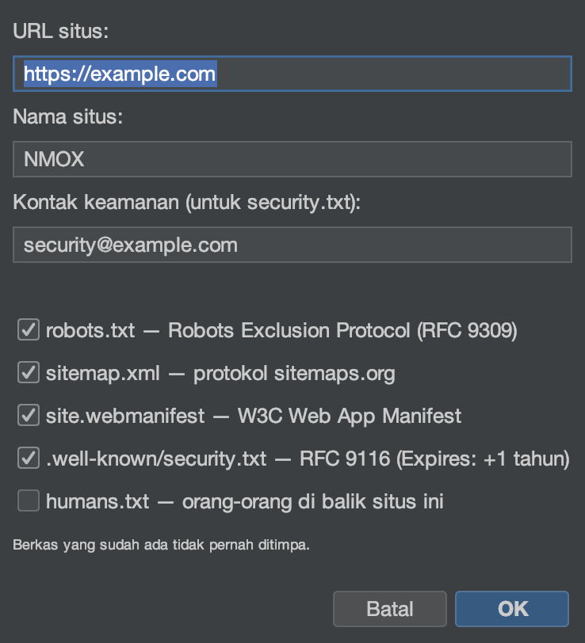

# Tutorial: Wisaya & kit

<!-- languages -->
[English](wizards-and-kits.md) · [Español](wizards-and-kits.es.md) · [Français](wizards-and-kits.fr.md) · [Deutsch](wizards-and-kits.de.md) · [Русский](wizards-and-kits.ru.md) · [Українська](wizards-and-kits.uk.md) · [Polski](wizards-and-kits.pl.md) · [Português (Brasil)](wizards-and-kits.pt.md) · **Bahasa Indonesia** · [Filipino](wizards-and-kits.tl.md) · [Tiếng Việt](wizards-and-kits.vi.md) · [简体中文](wizards-and-kits.zh.md) · [हिन्दी](wizards-and-kits.hi.md) · [עברית](wizards-and-kits.he.md) · [العربية](wizards-and-kits.ar.md)
<!-- /languages -->

NMOX Studio membawa beberapa pembangkit sekali jalan yang menambahkan kerangka
kelas produksi ke proyek yang sudah ada tanpa menimpa berkas Anda. Tutorial ini
menambahkan PWA ke proyek web; yang lain bekerja dengan cara yang sama.

<!-- screenshot: the PWA Kit wizard, then the generated icons/manifest/sw.js in the tree -->

## Kit-kitnya

- **Kit PWA** — kerangka aplikasi yang bisa dipasang: **penempa ikon** Java2D
  (termasuk set yang dapat dimasker), service worker yang mudah dibaca
  (cangkang aplikasi / jaringan dahulu), halaman tanpa jaringan, dan sambungan
  idempoten di `index.html`.
- **Kit Standar** — kebutuhan dasar web: `robots.txt`, `sitemap.xml`,
  `manifest` aplikasi web, `security.txt` sesuai RFC 9116, `humans.txt`.
- **Kit Klasik** — perluas kode mana pun dengan jQuery / MooTools / Prototype /
  Backbone / Knockout, disertakan di repositori atau lewat npm, ditambah kerangka
  webpack/grunt/gulp/bower.

## Langkah-langkah (Kit PWA)

1. **Bidik sebuah proyek web** (yang punya `index.html`).

2. **Jalankan wisayanya.** `Berkas ▸ Tambahkan ke Proyek ▸ PWA Kit…`. Arahkan ke
   akar web Anda, lalu isi nama aplikasi dan warna tema.

3. **Selesai.** Wisaya membuat set ikon, `manifest.webmanifest`, `sw.js`, dan
   `offline.html`, lalu menyambungkannya ke `index.html` — dan ia **tidak pernah
   menimpa**: bila sebuah berkas sudah ada, ia menulis saudara `.suggested`
   sebagai gantinya.

4. **Periksa.** Sajikan proyeknya (IGNITION di rak) lalu muat — aplikasinya kini
   bisa dipasang dan bekerja tanpa jaringan.

## Yang baru saja Anda pelajari

- Kit-kit ini menghasilkan keluaran nyata yang mudah dibaca dan menjadi milik Anda —
  bukan kotak hitam.
- Setiap pembangkit idempoten dan tidak pernah menimpa pekerjaan Anda.
- Kewargaan saat menyimpan yang sama berlaku di tempat lain: `.editorconfig`
  dihormati saat menyimpan di seluruh penyunting.

## Berikutnya

- Kit Standar untuk `security.txt` + `robots`/`sitemap`.
- Nilai tajuk hasilnya di tab Standar [Studio API](api-studio.id.md).
