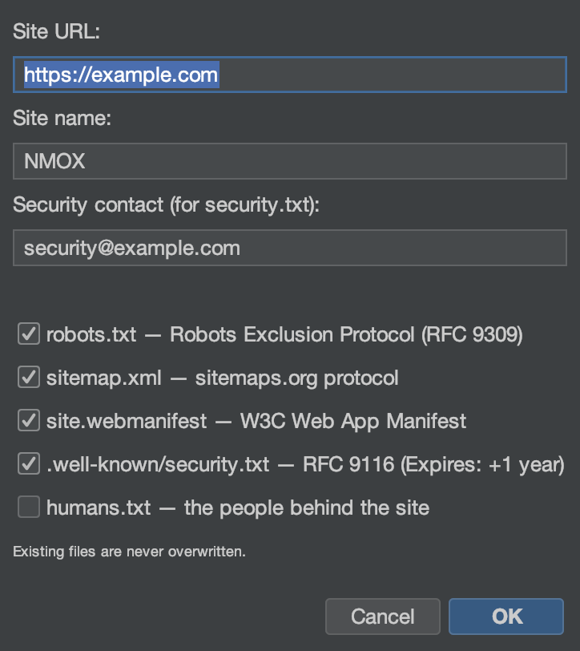

# Tutorial: Wizards & Kits

NMOX Studio ships several one-shot generators that add production-grade
scaffolding to an existing project without clobbering your files. This
tutorial adds a PWA to a web project; the others work the same way.

<!-- screenshot: the PWA Kit wizard, then the generated icons/manifest/sw.js in the tree -->

## The kits

- **PWA Kit** — installable-app scaffolding: a Java2D **icon forge**
  (including the maskable set), a readable service worker (app-shell /
  network-first), an offline page, and idempotent `index.html` wiring.
- **Standards Kit** — the web's table stakes: `robots.txt`, `sitemap.xml`,
  web app `manifest`, RFC 9116 `security.txt`, `humans.txt`.
- **Classic Kit** — extend any codebase with vendored-or-npm jQuery /
  MooTools / Prototype / Backbone / Knockout plus webpack/grunt/gulp/bower
  scaffolds.

## Steps (PWA Kit)

1. **Aim a web project** (one with an `index.html`).

2. **Run the wizard.** `Tools ▸ PWA Kit…`. Point it at your web root and
   set an app name and theme color.

3. **Finish.** The wizard generates the icon set, `manifest.webmanifest`,
   `sw.js`, and `offline.html`, and wires them into `index.html` — and it
   **never clobbers**: if a file exists it writes a `.suggested` sibling
   instead.

4. **Verify.** Serve the project (rack IGNITION) and load it — the app is
   now installable and works offline.

## What you just learned

- The kits produce real, readable output you own — not a black box.
- Every generator is idempotent and never overwrites your work.
- The same on-save citizenship applies elsewhere: `.editorconfig` is
  honored on save across the editor.

## Next

- Standards Kit for `security.txt` + `robots`/`sitemap`.
- Grade the result's headers in [API Studio](api-studio.md)'s Standards
  tab.
