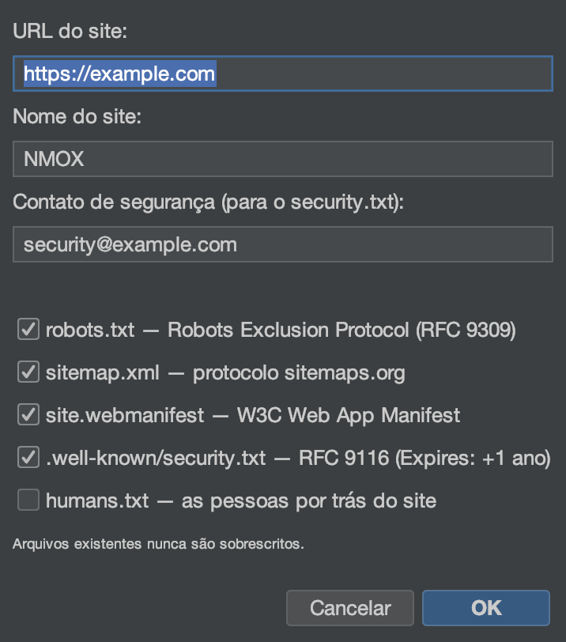

# Tutorial: assistentes e kits

<!-- languages -->
[English](wizards-and-kits.md) · [Español](wizards-and-kits.es.md) · [Français](wizards-and-kits.fr.md) · [Deutsch](wizards-and-kits.de.md) · [Русский](wizards-and-kits.ru.md) · [Українська](wizards-and-kits.uk.md) · [Polski](wizards-and-kits.pl.md) · **Português (Brasil)** · [Bahasa Indonesia](wizards-and-kits.id.md) · [Filipino](wizards-and-kits.tl.md) · [Tiếng Việt](wizards-and-kits.vi.md) · [简体中文](wizards-and-kits.zh.md) · [हिन्दी](wizards-and-kits.hi.md) · [עברית](wizards-and-kits.he.md) · [العربية](wizards-and-kits.ar.md)
<!-- /languages -->

O NMOX Studio traz vários geradores de uso único que acrescentam uma
estrutura de qualidade de produção a um projeto existente sem sobrescrever
os seus arquivos. Este tutorial acrescenta um PWA a um projeto web; os
outros funcionam do mesmo jeito.

<!-- screenshot: the PWA Kit wizard, then the generated icons/manifest/sw.js in the tree -->

## Os kits

- **PWA Kit** — a estrutura de um app instalável: uma **forja de ícones**
  em Java2D (incluindo o conjunto maskable), um service worker legível
  (app-shell / network-first), uma página offline e a ligação idempotente
  no `index.html`.
- **Standards Kit** — o mínimo que a web espera: `robots.txt`,
  `sitemap.xml`, o `manifest` do web app, o `security.txt` da RFC 9116 e o
  `humans.txt`.
- **Classic Kit** — estenda qualquer base de código com jQuery / MooTools /
  Prototype / Backbone / Knockout embutidos ou via npm, mais estruturas de
  webpack/grunt/gulp/bower.

## Passos (PWA Kit)

1. **Aponte para um projeto web** (um que tenha `index.html`).

2. **Rode o assistente.** `Arquivo ▸ Adicionar ao projeto ▸ PWA Kit…`.
   Indique a raiz web e defina o nome do app e a cor do tema.

3. **Conclua.** O assistente gera o conjunto de ícones, o
   `manifest.webmanifest`, o `sw.js` e o `offline.html`, e os liga ao
   `index.html` — e **nunca sobrescreve**: se um arquivo já existe, ele
   escreve um irmão `.suggested` no lugar.

4. **Verifique.** Sirva o projeto (IGNITION no rack) e carregue-o — o app
   agora é instalável e funciona offline.

## O que você aprendeu

- Os kits produzem uma saída real e legível que é sua — não uma caixa-preta.
- Todo gerador é idempotente e nunca sobrescreve o seu trabalho.
- A mesma boa convivência ao salvar vale em outros lugares: o
  `.editorconfig` é respeitado ao salvar em todo o editor.

## Próximos passos

- O Standards Kit para `security.txt` + `robots`/`sitemap`.
- Dê nota aos cabeçalhos do resultado na aba **Padrões** do
  [Estúdio de API](api-studio.pt.md).
