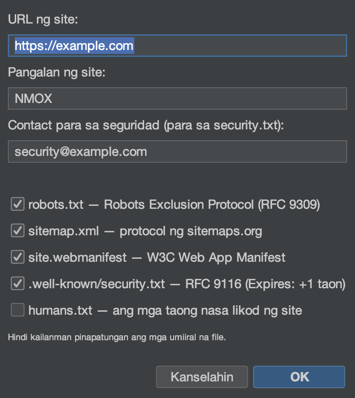

# Tutorial: Mga Wizard at Kit

<!-- languages -->
[English](wizards-and-kits.md) · [Español](wizards-and-kits.es.md) · [Français](wizards-and-kits.fr.md) · [Deutsch](wizards-and-kits.de.md) · [Русский](wizards-and-kits.ru.md) · [Українська](wizards-and-kits.uk.md) · [Polski](wizards-and-kits.pl.md) · [Português (Brasil)](wizards-and-kits.pt.md) · [Bahasa Indonesia](wizards-and-kits.id.md) · **Filipino** · [Tiếng Việt](wizards-and-kits.vi.md) · [简体中文](wizards-and-kits.zh.md) · [हिन्दी](wizards-and-kits.hi.md) · [עברית](wizards-and-kits.he.md) · [العربية](wizards-and-kits.ar.md)
<!-- /languages -->

May dalang ilang minsanang generator ang NMOX Studio na nagdaragdag ng
scaffold na handa para sa produksiyon sa isang proyektong mayroon na,
nang hindi pinapatungan ang iyong mga file. Nagdaragdag ang tutorial na
ito ng PWA sa isang web project; gumagana sa parehong paraan ang iba.

<!-- screenshot: the PWA Kit wizard, then the generated icons/manifest/sw.js in the tree -->

## Ang mga kit

- **PWA Kit** — scaffold para sa app na maii-install: isang Java2D
  **icon forge** (kasama ang maskable na set), service worker na mababasa
  (app-shell / network-first), pahinang offline, at idempotent na
  pagkakabit sa `index.html`.
- **Standards Kit** — ang mga batayan ng web: `robots.txt`, `sitemap.xml`,
  `manifest` ng web app, `security.txt` ayon sa RFC 9116, `humans.txt`.
- **Classic Kit** — palawakin ang anumang codebase ng jQuery / MooTools /
  Prototype / Backbone / Knockout, nakalagay sa repo o mula sa npm, kasama
  ang mga scaffold ng webpack/grunt/gulp/bower.

## Mga hakbang (PWA Kit)

1. **Itutok ang IDE sa isang web project** (isang may `index.html`).

2. **Patakbuhin ang wizard.** `Talaksan ▸ Idagdag sa Proyekto ▸ PWA Kit…`.
   Itutok ito sa web root ng proyekto, at itakda ang pangalan ng app at
   ang kulay ng tema.

3. **Tapusin.** Lumilikha ang wizard ng set ng mga icon,
   `manifest.webmanifest`, `sw.js`, at `offline.html`, at ikinakabit ang
   mga ito sa `index.html` — at **hindi kailanman nagpapatong**: kung
   mayroon nang file, nagsusulat ito ng `.suggested` sa tabi.

4. **Tiyakin.** I-serve ang proyekto (IGNITION sa rack) at buksan ito —
   ang app ay maii-install na at gumagana nang offline.

## Ang iyong natutunan

- Tunay at nababasang output ang mga kit, at sa iyo ito — hindi black box.
- Idempotent ang bawat generator at hindi kailanman pinapatungan ang
  iyong gawa.
- Ang parehong asal sa pag-save ay umiiral sa ibang lugar: iginagalang
  ang `.editorconfig` sa pag-save sa buong editor.

## Susunod

- Standards Kit para sa `security.txt` + `robots`/`sitemap`.
- Markahan ang mga header ng resulta sa tab na Mga Pamantayan ng
  [Studio ng API](api-studio.tl.md).
