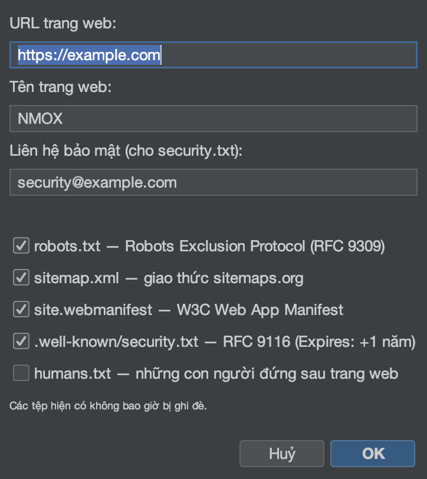

# Hướng dẫn: Trình hướng dẫn và bộ công cụ

<!-- languages -->
[English](wizards-and-kits.md) · [Español](wizards-and-kits.es.md) · [Français](wizards-and-kits.fr.md) · [Deutsch](wizards-and-kits.de.md) · [Русский](wizards-and-kits.ru.md) · [Українська](wizards-and-kits.uk.md) · [Polski](wizards-and-kits.pl.md) · [Português (Brasil)](wizards-and-kits.pt.md) · [Bahasa Indonesia](wizards-and-kits.id.md) · [Filipino](wizards-and-kits.tl.md) · **Tiếng Việt** · [简体中文](wizards-and-kits.zh.md) · [हिन्दी](wizards-and-kits.hi.md) · [עברית](wizards-and-kits.he.md) · [العربية](wizards-and-kits.ar.md)
<!-- /languages -->

NMOX Studio mang theo nhiều trình sinh chạy một lần, thêm khung sườn đạt
chuẩn sản xuất vào một dự án có sẵn mà không ghi đè tệp của bạn. Bài này
thêm PWA vào một dự án web; những bộ khác hoạt động theo cùng một cách.

<!-- screenshot: the PWA Kit wizard, then the generated icons/manifest/sw.js in the tree -->

## Các bộ công cụ

- **PWA Kit** — khung sườn cho ứng dụng cài được: một **lò rèn biểu tượng**
  bằng Java2D (kể cả bộ maskable), một service worker dễ đọc (vỏ ứng dụng /
  ưu tiên mạng), một trang ngoại tuyến, và phần nối dây vào `index.html` chạy
  lại bao nhiêu lần cũng vậy.
- **Standards Kit** — những thứ tối thiểu của web: `robots.txt`,
  `sitemap.xml`, `manifest` của ứng dụng web, `security.txt` theo RFC 9116,
  `humans.txt`.
- **Classic Kit** — mở rộng bất kỳ mã nguồn nào với jQuery / MooTools /
  Prototype / Backbone / Knockout, nhúng sẵn hoặc qua npm, cùng khung sườn
  webpack/grunt/gulp/bower.

## Các bước (PWA Kit)

1. **Nhắm vào một dự án web** (có một tệp `index.html`).

2. **Chạy trình hướng dẫn.** `Tệp ▸ Thêm vào dự án ▸ PWA Kit…`. Chỉ nó tới
   thư mục gốc web của bạn, rồi đặt tên ứng dụng và màu chủ đề.

3. **Hoàn tất.** Trình hướng dẫn sinh ra bộ biểu tượng,
   `manifest.webmanifest`, `sw.js` và `offline.html`, rồi nối chúng vào
   `index.html` — và nó **không bao giờ ghi đè**: nếu tệp đã có, nó ghi một
   tệp `.suggested` bên cạnh.

4. **Kiểm chứng.** Phục vụ dự án (IGNITION trên giá) rồi mở nó — ứng dụng
   giờ đã cài được và chạy được khi mất mạng.

## Bạn vừa học được gì

- Các bộ công cụ tạo ra kết quả thật, dễ đọc, thuộc về bạn — không phải một
  hộp đen.
- Mọi trình sinh đều chạy lại bao nhiêu lần cũng vậy và không bao giờ ghi đè
  công sức của bạn.
- Tinh thần tôn trọng quy ước lúc lưu cũng có ở chỗ khác: `.editorconfig`
  được áp dụng mỗi khi lưu trong toàn bộ trình soạn thảo.

## Tiếp theo

- Standards Kit cho `security.txt` + `robots`/`sitemap`.
- Chấm điểm các tiêu đề của kết quả ở thẻ Tiêu chuẩn của
  [Studio API](api-studio.vi.md).
