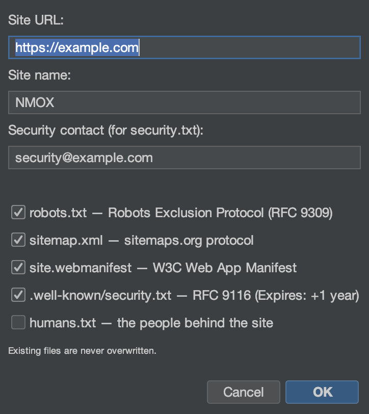

# 教程：向导与套件

<!-- languages -->
[English](wizards-and-kits.md) · [Español](wizards-and-kits.es.md) · [Français](wizards-and-kits.fr.md) · [Deutsch](wizards-and-kits.de.md) · [Русский](wizards-and-kits.ru.md) · [Українська](wizards-and-kits.uk.md) · [Polski](wizards-and-kits.pl.md) · [Português (Brasil)](wizards-and-kits.pt.md) · [Bahasa Indonesia](wizards-and-kits.id.md) · [Filipino](wizards-and-kits.tl.md) · [Tiếng Việt](wizards-and-kits.vi.md) · **简体中文** · [हिन्दी](wizards-and-kits.hi.md) · [עברית](wizards-and-kits.he.md) · [العربية](wizards-and-kits.ar.md)
<!-- /languages -->

NMOX Studio 自带几个一次性的生成器，能给现有项目加上生产级的脚手架，而不会覆盖你的文件。本教程给一个网页项目加上 PWA；其他套件的用法一样。

<!-- screenshot: the PWA Kit wizard, then the generated icons/manifest/sw.js in the tree -->

## 各个套件

- **PWA Kit** — 可安装应用的脚手架：一台 Java2D **图标锻造炉**（包含可遮罩的那一套）、一个读得懂的 service worker（应用外壳优先 / 网络优先）、一个离线页面，以及幂等的 `index.html` 接线。
- **Standards Kit** — 网站的基本功：`robots.txt`、`sitemap.xml`、Web 应用 `manifest`、符合 RFC 9116 的 `security.txt`、`humans.txt`。
- **Classic Kit** — 给任何代码库加上 jQuery / MooTools / Prototype / Backbone / Knockout（直接放进仓库或作为 npm 依赖），再加上 webpack/grunt/gulp/bower 的脚手架。

## 步骤（PWA Kit）

1. **瞄准一个网页项目**（带有 `index.html` 的那种）。

2. **运行向导。**`文件 ▸ 添加到项目 ▸ PWA Kit…`。把它指向你的网站根目录，设好应用名称和主题色。

3. **完成。**向导会生成整套图标、`manifest.webmanifest`、`sw.js` 和 `offline.html`，并把它们接进 `index.html` — 而且它**从不覆盖**：文件已存在时，它会改写一个 `.suggested` 副本在旁边。

4. **验证。**把项目跑起来提供服务（机架上的 IGNITION）并打开它 — 这个应用现在可以安装，断网也能用。

## 你刚学到了什么

- 套件产出的是你自己拥有、读得懂的真实文件，不是黑盒。
- 每个生成器都是幂等的，从不覆盖你的工作。
- 同样的保存时规矩在别处也成立：整个编辑器在保存时都会遵守 `.editorconfig`。

## 下一步

- 用 Standards Kit 生成 `security.txt` 以及 `robots`/`sitemap`。
- 在 [API 工作室](api-studio.zh.md)的**标准**标签页里给结果的响应头打分。
