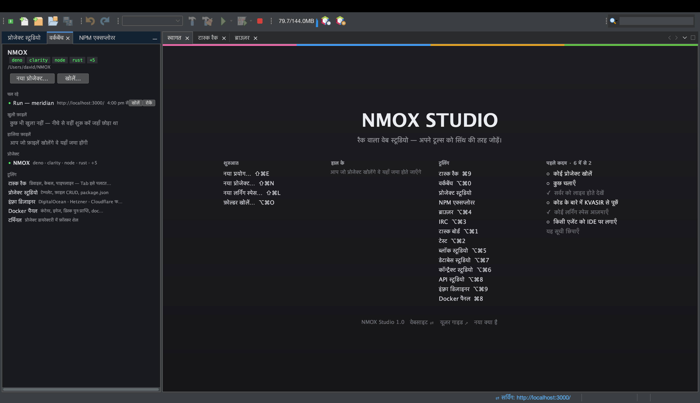

# ट्यूटोरियल: वर्कबेंच

<!-- languages -->
[English](workbench.md) · [Español](workbench.es.md) · [Français](workbench.fr.md) · [Deutsch](workbench.de.md) · [Русский](workbench.ru.md) · [Українська](workbench.uk.md) · [Polski](workbench.pl.md) · [Português (Brasil)](workbench.pt.md) · [Bahasa Indonesia](workbench.id.md) · [Filipino](workbench.tl.md) · [Tiếng Việt](workbench.vi.md) · [简体中文](workbench.zh.md) · **हिन्दी** · [עברית](workbench.he.md) · [العربية](workbench.ar.md)
<!-- /languages -->

वर्कबेंच NMOX Studio का ठिकाना है — एक लॉन्चपैड जो आपका मौजूदा प्रोजेक्ट,
खुली और हालिया फ़ाइलें, जाने-पहचाने प्रोजेक्ट और आपके संस्थापित टूलिंग,
सब एक ही जगह दिखाता है। किसी स्टूडियो में उतरने से पहले आप यहीं दिशा
तय करते हैं।

## इसे खोलें

`⌥⌘0`, या **वर्कबेंच** टैब (पहली शुरुआत में पहले से खुला रहता है)।

## चरण

1. **देखें कि आप कहाँ हैं।** वर्कबेंच का सबसे ऊपरी हिस्सा लक्षित प्रोजेक्ट
   और उसकी मुख्य बातें बताता है। रैक और स्टूडियो जो कुछ भी करते हैं, वह
   इसी प्रोजेक्ट के दायरे में होता है।

2. **फ़ाइलों के बीच जाएँ।** **खुली फ़ाइलें** और **हालिया फ़ाइलें** जीवित
   हैं — दोबारा खोलने के लिए क्लिक करें। हालिया सूची पुनःआरंभ के बाद भी
   बनी रहती है।

3. **प्रोजेक्ट बदलें।** **प्रोजेक्ट** खंड वह सब दिखाता है जिसे NMOX
   Studio जानता है। किसी एक पर क्लिक करके उसे लक्षित करें — रैक,
   एक्सप्लोरर और हालिया सूची, सब उसी प्रोजेक्ट के साथ चलते हैं।

4. **अपना टूलिंग जाँचें।** **टूलिंग** खंड वे स्टूडियो और बाहरी उपकरण
   दिखाता है जिन तक आप पहुँच सकते हैं। लगभग 100 बाहरी उपकरणों की संस्करण
   और संस्थापन-संकेत सहित गहरी जाँच के लिए `उपकरण ▸ परिवेश डॉक्टर…`
   चलाएँ।

## आपने अभी क्या सीखा

- वर्कबेंच वह एक स्क्रीन है जो बताती है “मैं किस पर काम कर रहा हूँ और
  उसके साथ क्या कर सकता हूँ।”
- यहाँ प्रोजेक्ट लक्षित करना वही लक्ष्य है जो रैक इस्तेमाल करता है — एक
  प्रोजेक्ट, एक संदर्भ, हर जगह।

## आगे

- यहाँ से ढाँचा बनाने के लिए [प्रोजेक्ट स्टूडियो](project-studio.hi.md)
  खोलें, या चलाने के लिए [टास्क रैक](the-task-rack.hi.md)।
