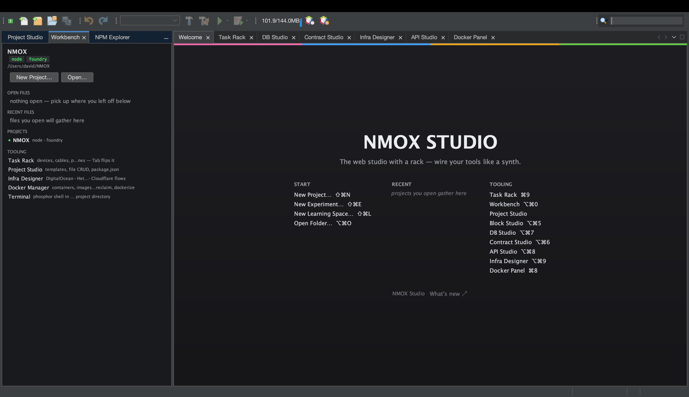

# Tutorial: The Workbench

The Workbench is NMOX Studio's home base — a launchpad that shows your
current project, open and recent files, known projects, and the tooling
you have installed, all in one place. It's where you orient before diving
into a studio.

## Open it

`⌥⌘0`, or the **Workbench** tab (open by default on first launch).

## Steps

1. **See where you are.** The **Current Project** column names the aimed
   project and its key facts. Everything the rack and studios do is
   scoped to this project.

2. **Jump between files.** **Open Files** and **Recent Files** are live —
   click to reopen. The recent list survives restarts.

3. **Switch projects.** The **Projects** column lists everything NMOX
   Studio knows about. Click one to aim there — the rack, explorer, and
   recent list all follow the same project.

4. **Check your tooling.** The **Tooling** column shows the studios and
   external tools you can reach. For a deep probe of ~60 external tools
   with versions and install hints, run `Tools ▸ Environment Doctor`.

## What you just learned

- The Workbench is the one screen that answers "what am I working on and
  what can I do with it."
- Aiming a project here is the same aim the rack uses — one project, one
  context, everywhere.

## Next

- From here, open [Project Studio](project-studio.md) to scaffold, or
  [the Task Rack](the-task-rack.md) to run.
