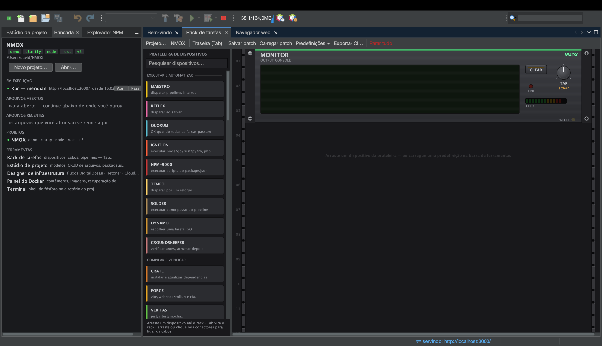

# Tutorial: escreva seu próprio dispositivo de rack

<!-- languages -->
[English](your-own-device.md) · [Español](your-own-device.es.md) · [Français](your-own-device.fr.md) · [Deutsch](your-own-device.de.md) · [Русский](your-own-device.ru.md) · [Українська](your-own-device.uk.md) · [Polski](your-own-device.pl.md) · **Português (Brasil)** · [Bahasa Indonesia](your-own-device.id.md) · [Filipino](your-own-device.tl.md) · [Tiếng Việt](your-own-device.vi.md) · [简体中文](your-own-device.zh.md) · [हिन्दी](your-own-device.hi.md) · [עברית](your-own-device.he.md) · [العربية](your-own-device.ar.md)
<!-- /languages -->

*Uma sentada só. Você vai acrescentar um dispositivo ao rack com um editor
de texto, apertar o botão dele, ver um comando de verdade rodar e ligar a
saída no MONITOR — sem escrever uma linha de Java.*

Novidade da 2.0.0. O rack veio com cinquenta e três dispositivos e, até
agora, um único jeito de acrescentar o quinquagésimo quarto: escrever um
plugin do NetBeans. Este é o outro jeito.



## 1. Crie a pasta

```bash
mkdir -p ~/.nmox/devices.d
```

Essa é toda a instalação. O rack lê a pasta sob demanda, então não há
nada para reiniciar.

## 2. Escreva o dispositivo

Coloque isto em `~/.nmox/devices.d/counter.json`:

```json
{
  "id": "com.example.counter",
  "title": "COUNTER",
  "tagline": "counts the files in the project",
  "accent": "#7FB3D5",
  "category": "OBSERVE",
  "usage": "COUNT lists the project's files of the dialled KIND and shows how many.\nPatch OUT into MONITOR to read the list, or DONE onward to chain.",
  "knobs": [
    { "key": "kind", "label": "KIND", "options": ["js", "ts", "css", "md"] }
  ],
  "ports": [
    { "id": "count", "label": "COUNT", "direction": "IN", "signal": "TRIGGER" },
    { "id": "done", "label": "DONE", "direction": "OUT", "signal": "TRIGGER" },
    { "id": "out", "label": "OUT", "direction": "OUT", "signal": "DATA" }
  ],
  "buttons": [
    { "label": "COUNT", "role": "QUERY",
      "command": ["git", "ls-files", "*.{{kind}}"],
      "emit": "done", "trigger": "count" }
  ]
}
```

Cada linha tem uma função: o **botão giratório** vira `{{kind}}` no
comando, o papel **QUERY** pinta o botão de azul (a lei das cores: azul
pergunta, verde faz, vermelho para) e as três portas deixam o dispositivo
pronto para receber cabos.

## 3. Monte o dispositivo

Abra o **Rack de tarefas** (`⌘9`, ou a aba Rack de tarefas) e procure na
gaveta **Observar** da prateleira. O COUNTER está lá, com a sua descrição
embaixo. Arraste-o para um trilho.

Clique com o botão direito nele e escolha **Como usar COUNTER…**: é o seu
texto de `usage`, e é
por isso que o formato exige duas linhas de verdade.

## 4. Aperte o botão

> Repare que não há uma linha `units`: a prateleira mede a face e
> escolhe a menor altura que cabe (este precisa de 2U por causa do
> botão giratório). Declare `units` só quando quiser espaço extra.

Aponte o rack para um projeto git, gire **KIND** para `js` e aperte
**COUNT**.

A primeira pressão abre a confirmação de **Confiança no espaço de
trabalho**, porque um arquivo de dispositivo executa comandos de verdade e
o anfitrião controla cada processo do mesmo jeito que faz com um
dispositivo embutido. Conceda, e o visor mostra o comando e depois a
última linha da saída. A entrada DONE pisca em verde.

Recuse, e nada é executado — a recusa é o recurso.

## 5. Ligue os cabos

Puxe um cabo do **OUT** do COUNTER até o **IN** do MONITOR. Aperte COUNT
de novo: cada linha chega ao monitor, porque uma porta declarada
`OUT`/`DATA` recebe a saída da execução sem nenhuma configuração a mais.

Agora puxe um cabo do tick do TEMPO até a entrada **COUNT** do COUNTER. O
dispositivo que você escreveu num editor de texto agora anda no ritmo de
um relógio.

## 6. Quebre de propósito

Edite o arquivo e troque o comando por algo com um pipe:

```json
"command": ["sh", "-c", "git ls-files | wc -l"]
```

Salve, e o COUNTER *some* da prateleira. É o formato recusando uma linha
de shell: um comando é uma lista de argumentos (argv), para que quem lê —
você daqui a seis meses, ou um colega revisando o arquivo — veja
exatamente o que vai rodar. O log da IDE diz qual arquivo foi ignorado e
por quê:

```
device file counter.json skipped: button "COUNT" command token
"git ls-files | wc -l" contains "|" — commands are argv, never a shell line
```

Volte à forma de lista e ele reaparece. O mesmo vale para uma ferramenta
indicada por caminho (`./x.sh`), uma `{{variable}}` desconhecida ou um
`usage` de uma linha só: o arquivo é ignorado inteiro em vez de carregado
pela metade, porque um dispositivo cujo rótulo mente é pior do que nenhum
dispositivo.

## O que você acabou de aprender

- Um dispositivo é um **arquivo**: `~/.nmox/devices.d/*.json`, lido sob
  demanda, sem reiniciar, sem compilar.
- Os botões giratórios viram `{{variables}}`; os papéis escolhem as
  cores; as portas deixam o dispositivo ligável e a saída legível.
- **As leis ficam com o anfitrião** — confiança no espaço de trabalho em
  cada execução, a lei das cores, o vocabulário das portas, a lei da
  prateleira — então um arquivo de dispositivo não consegue expressar um
  comando sem controle nem um GO vermelho, por mais que tente.
- As recusas são explícitas no log e totais no efeito.

## Próximos passos

- [device-files.md](../device-files.md) — a referência completa
- [O Rack de tarefas](the-task-rack.pt.md) — cabos, portões e predefinições
- [device-spi.md](../device-spi.md) — o SPI em Java, para dispositivos que
  precisam de estado de verdade: pintura própria, sondagem, conexões
  duradouras
