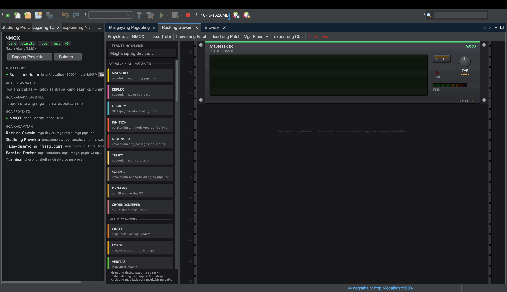

# Tutorial: isulat ang sarili mong kagamitan sa rack

<!-- languages -->
[English](your-own-device.md) · [Español](your-own-device.es.md) · [Français](your-own-device.fr.md) · [Deutsch](your-own-device.de.md) · [Русский](your-own-device.ru.md) · [Українська](your-own-device.uk.md) · [Polski](your-own-device.pl.md) · [Português (Brasil)](your-own-device.pt.md) · [Bahasa Indonesia](your-own-device.id.md) · **Filipino** · [Tiếng Việt](your-own-device.vi.md) · [简体中文](your-own-device.zh.md) · [हिन्दी](your-own-device.hi.md) · [עברית](your-own-device.he.md) · [العربية](your-own-device.ar.md)
<!-- /languages -->

*Isang upuan. Magdaragdag ka ng kagamitan sa rack gamit ang isang text
editor, pipindutin ang pindutan nito, makikita itong nagpapatakbo ng tunay
na command, at ikakabit ang output nito sa MONITOR — nang walang isa mang
linya ng Java.*

Bago sa 2.0.0. Dumating ang rack na may limampu’t tatlong kagamitan at,
hanggang ngayon, iisang paraan para magdagdag ng ika-54: sumulat ng
NetBeans plugin. Ito ang isa pang paraan.



## 1. Gawin ang folder

```bash
mkdir -p ~/.nmox/devices.d
```

Iyan ang buong hakbang ng pag-install. Binabasa ng rack ang folder kapag
kinakailangan, kaya walang anumang kailangang i-restart.

## 2. Isulat ang kagamitan

Ilagay ito sa `~/.nmox/devices.d/counter.json`:

```json
{
  "id": "com.example.counter",
  "title": "COUNTER",
  "tagline": "counts the files in the project",
  "accent": "#7FB3D5",
  "category": "OBSERVE",
  "usage": "COUNT lists the project's files of the dialled KIND and shows how many.\nPatch OUT into MONITOR to read the list, or DONE onward to chain.",
  "knobs": [
    { "key": "kind", "label": "KIND", "options": ["js", "ts", "css", "md"] }
  ],
  "ports": [
    { "id": "count", "label": "COUNT", "direction": "IN", "signal": "TRIGGER" },
    { "id": "done", "label": "DONE", "direction": "OUT", "signal": "TRIGGER" },
    { "id": "out", "label": "OUT", "direction": "OUT", "signal": "DATA" }
  ],
  "buttons": [
    { "label": "COUNT", "role": "QUERY",
      "command": ["git", "ls-files", "*.{{kind}}"],
      "emit": "done", "trigger": "count" }
  ]
}
```

May tungkulin ang bawat bahagi nito: ang **knob** ay nagiging `{{kind}}` sa
command, pinipinturahan ng role na **QUERY** ang pindutan ng asul (ang batas
ng kulay: nagtatanong ang asul, gumagawa ang berde, humihinto ang pula), at
ginagawang nakakabit ito ng tatlong port.

## 3. I-mount ito

Buksan ang **Rack ng Gawain** (`⌘9`, o ang tab na Rack ng Gawain) at hanapin
sa drawer na **Obserbahan** ng istante. Naroon ang COUNTER, may iyong tagline
sa ilalim nito. Hilahin ito sa isang riles.

I-right-click ito at piliin ang **Paano gamitin ang COUNTER…** — iyan ang iyong tekstong
`usage`, at iyan ang dahilan kung bakit hinihingi ng format ang dalawang
tunay na linya.

## 4. Pindutin ito

> Pansinin na walang linyang `units`: sinusukat ng istante ang harapan at
> pinipili ang pinakamababang taas na kasya (kailangan nito ng 2U para sa
> knob). Ipahayag ang `units` lamang kapag gusto ng dagdag na espasyo.

Itutok ang rack sa isang git project, iikot ang **KIND** sa `js`, at pindutin
ang **COUNT**.

Ang unang pindot ay nagbubukas ng pagtatanong ng **Tiwala sa Workspace**,
dahil nagpapatakbo ng tunay na mga command ang file ng kagamitan at
binabantayan ng punong-abala ang bawat pagsisimula ng proseso nang gayon din
sa isang nakapaloob. Pagkatiwalaan, at ipinapakita ng LCD ang command, saka
ang huling linya ng output. Pumipitik na berde ang jack na DONE.

Kung tatanggihan sa halip, walang anumang nagsisimula — ang pagtanggi ay
ang tampok.

## 5. Ikabit ito

Hilahin ang kable mula sa **OUT** ng COUNTER papunta sa **IN** ng MONITOR.
Pindutin muli ang COUNT: dumadapo sa monitor ang bawat linya, dahil ang
idineklarang port na `OUT`/`DATA` ay tumatanggap ng output ng run nang walang
dagdag na configuration.

Ngayon hilahin mula sa tick ng TEMPO papunta sa input na **COUNT** ng COUNTER.
Ang kagamitang isinulat mo sa text editor ay nakasakay ngayon sa isang orasan.

## 6. Sirain ito nang kusa

I-edit ang file at palitan ang command ng isang may pipe:

```json
"command": ["sh", "-c", "git ls-files | wc -l"]
```

I-save, at *nawawala* ang COUNTER sa istante. Iyan ang format na tumatanggi
sa isang shell line: ang command ay isang argv array, upang ang mambabasa —
ikaw, anim na buwan mula ngayon, o kasamahang sinusuri ang file — ay
makakita nang eksakto kung ano ang tatakbo. Sinasabi ng log ng IDE kung aling
file ang nilaktawan at bakit:

```
device file counter.json skipped: button "COUNT" command token
"git ls-files | wc -l" contains "|" — commands are argv, never a shell line
```

Ibalik ang anyong array at bumabalik ito. Gayon din para sa tool na
pinangalanan ayon sa landas (`./x.sh`), isang hindi kilalang `{{variable}}`,
o isang `usage` na iisang linya: nilalaktawan nang buo ang file sa halip na
ikarga nang kalahati, dahil ang kagamitang nagsisinungaling ang label ay mas
masama kaysa walang kagamitan.

## Ang iyong natutunan

- Ang kagamitan ay isang **file**: `~/.nmox/devices.d/*.json`, binabasa kapag
  kinakailangan, walang restart, walang build.
- Nagiging `{{variables}}` ang mga knob; pumipili ng kulay ang mga role;
  ginagawang nakakabit ito ng mga port at nababasa ang output nito.
- **Iniingatan ng punong-abala ang mga batas** — tiwala sa workspace sa bawat
  pagsisimula ng proseso, ang batas ng kulay, ang talasalitaan ng mga port,
  ang batas ng istante — kaya ang file ng kagamitan ay hindi makapagpahayag ng
  command na walang bantay o ng pulang GO kahit tangkain.
- Malakas sa log ang mga pagtanggi at ganap sa bisa.

## Susunod

- [device-files.md](../device-files.md) — ang buong sanggunian
- [Ang Rack ng Gawain](the-task-rack.tl.md) — pagkakabit, mga tarangkahan, at mga preset
- [device-spi.md](../device-spi.md) — ang Java SPI, para sa mga kagamitang
  nangangailangan ng tunay na kalagayan: sariling pagpipinta, polling,
  pangmatagalang koneksyon
