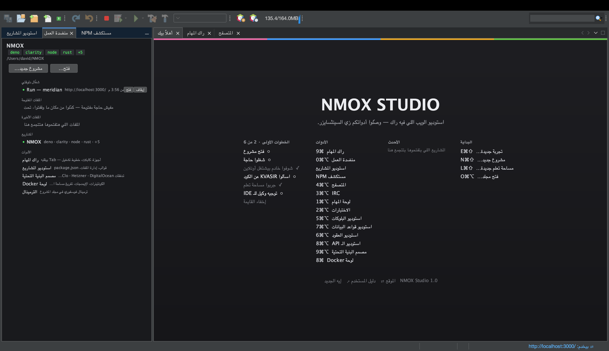
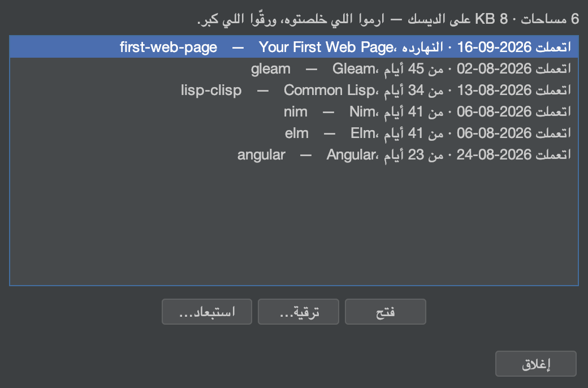
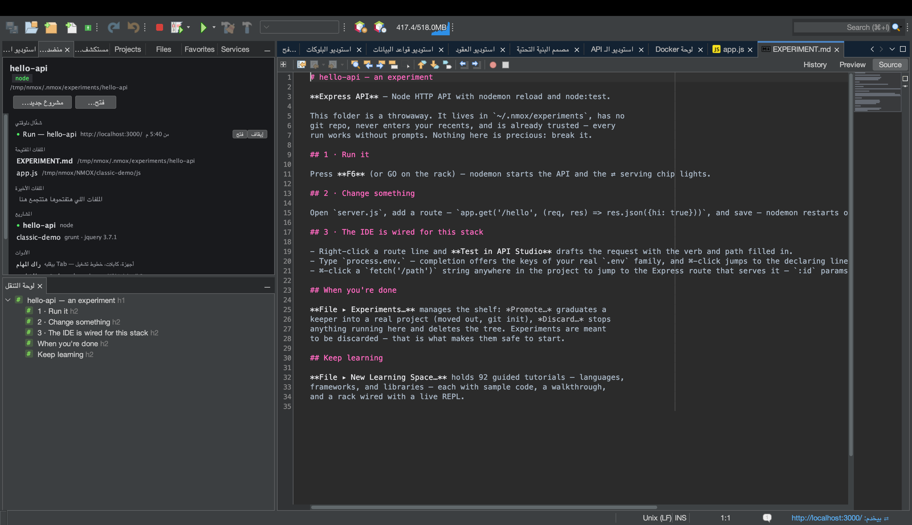
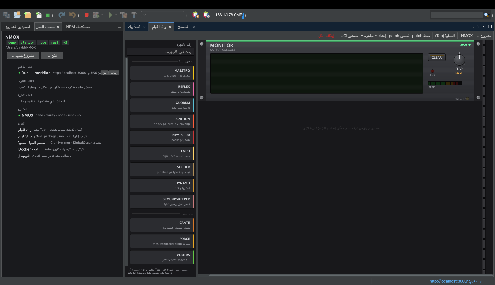
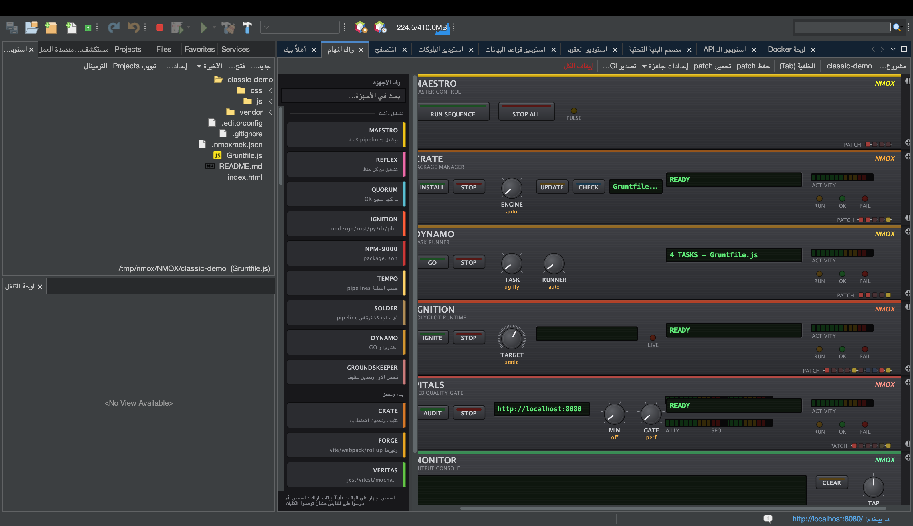
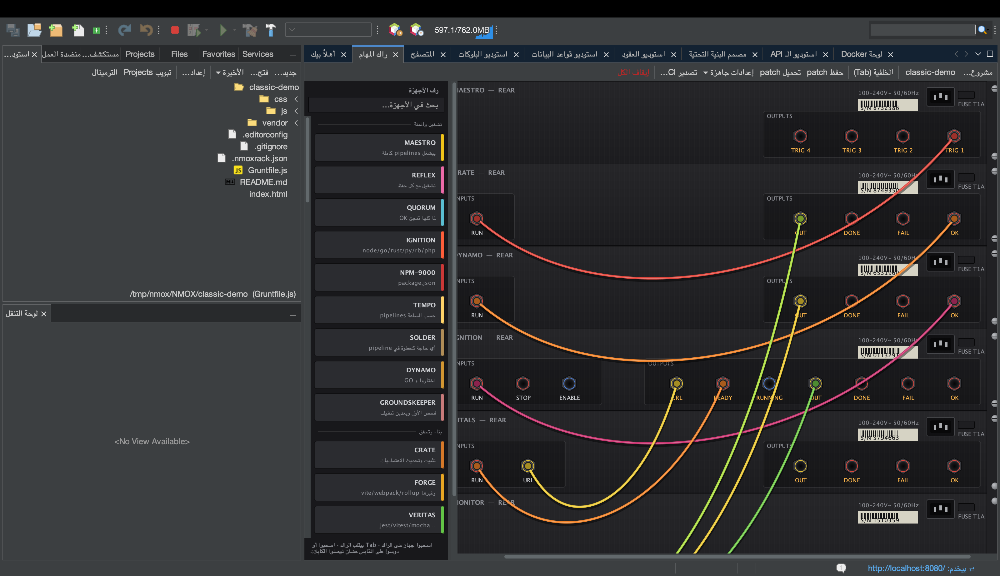
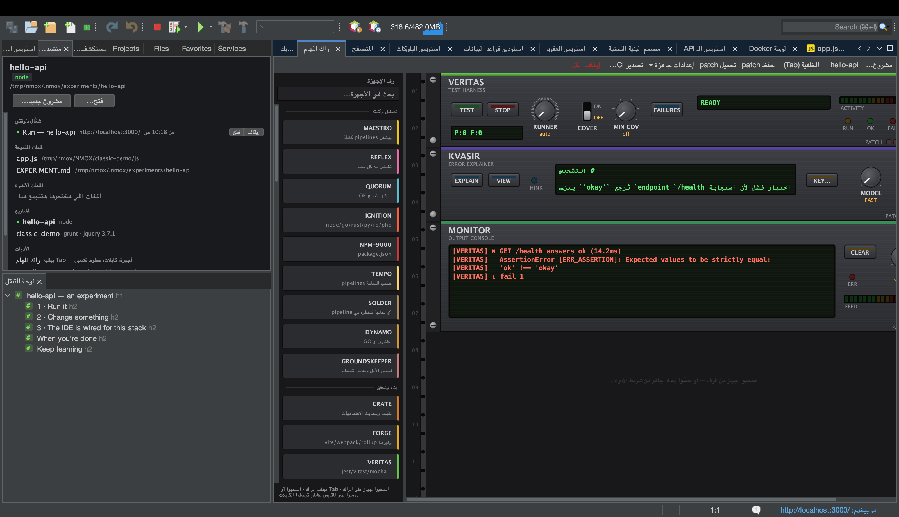
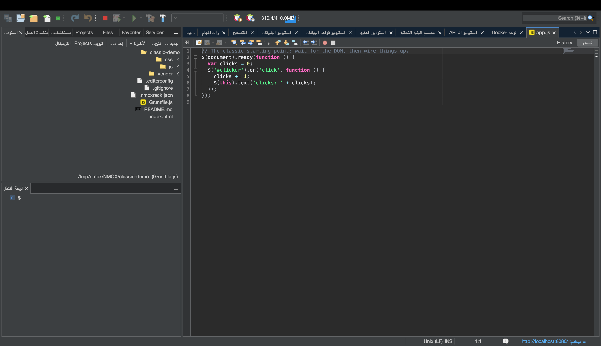

# NMOX Studio — دليل المستخدم

<!-- languages -->
[English](user-guide.md) · [Español](user-guide.es.md) · [Français](user-guide.fr.md) · [Deutsch](user-guide.de.md) · [Русский](user-guide.ru.md) · [Українська](user-guide.uk.md) · [Polski](user-guide.pl.md) · [Português (Brasil)](user-guide.pt.md) · [Bahasa Indonesia](user-guide.id.md) · [Filipino](user-guide.tl.md) · [Tiếng Việt](user-guide.vi.md) · [简体中文](user-guide.zh.md) · [हिन्दी](user-guide.hi.md) · [עברית](user-guide.he.md) · **العربية**
<!-- /languages -->

إزاي تستخدموا المنتج فعلًا. الدليل ده بيمشي على المميزات بالترتيب اللي هتقابلوها بيه: التثبيت، التشغيل الأول، المشاريع، الراك، الاستوديوهات، المعالجات، وشبكات الأمان.

---

<a id="1-install"></a>
## 1. التثبيت

**macOS (مستحسن):**
```bash
brew trust --cask nmox/nmox-studio/nmox-studio
brew install nmox/nmox-studio/nmox-studio
```

سطر `brew trust` هو الموافقة اللي Homebrew بيطلبها مرة واحدة بس لأي tap من طرف تالت — مش هتتسألوا تاني في التحديثات. التطبيق موقّع بـ Apple Developer ID ومتوثّق (notarization) من Apple، عشان كده Gatekeeper بيقبله زي ما هو — الـ cask بينسخه وبس ومش بيعمل له أي حاجة تانية. التثبيت اليدوي من الـ DMG بيشتغل بنفس الطريقة.

**كل الباقي:** نزّلوا ملف من [آخر إصدار](https://github.com/NMOX/NMOX-Studio/releases/latest) — `.dmg` لـ macOS، `-setup.exe` لـ Windows، `.deb` لـ Debian/Ubuntu، `.tar.gz` عام لـ Linux. الأربعة جايين ومعاهم بيئة تشغيل Java بتاعتهم؛ مفيش حاجة تتثبت الأول. `-portable.zip` هو الملف الوحيد اللي بيعتمد على Java بتاعتكم (محتاج Java 21+ على الـ PATH، أو شغّلوه بـ `--jdkhome <path-to-jdk>`).

> **macOS، أول تشغيل:** دوسوا دوبل كليك. macOS بيسأل مرة واحدة إذا كنتوا عايزين تفتحوا تطبيق متنزّل من الإنترنت، وبيقول إن Apple فحصته: دوسوا **فتح** (Open). التطبيق موقّع بـ Apple Developer ID ومتوثّق، والتذكرة مثبّتة على التطبيق وعلى الـ DMG، فالفحص بيشتغل من غير إنترنت — من غير كليك يمين ومن غير `xattr`. المُحدِّث الداخلي بيثبّت في مجلد المستخدم بتاعكم مش جوّه حزمة التطبيق، عشان كده التحديث عمره ما بيكسر التوقيع ده.
>
> لو تثبيت لـ 3.0.0 أو 3.0.1 أو 3.0.2 رد عليكم بـ *"NMOX Studio.app" Not Opened*، ده كان عيب في الطريقة اللي التطبيق كان بيشغّل بيها سكريبت الـ launcher بتاعه، واتصلّح في 3.1.0: ثبّتوا 3.1.0 أو أحدث (`brew upgrade --cask nmox-studio`، أو تنزيل جديد).

### التأكد من الملف اللي نزّلتوه

اختياري، عشرين ثانية، وفحصين لأنهم بيجاوبوا على سؤالين مختلفين.

**هل دي البايتات اللي إحنا نشرناها؟** بيشتغل على أي نظام وبيغطي كل ملف — `SHA256SUMS` و`SHA256SUMS.asc` بينزلوا مع الإصدار:

```bash
curl -sL https://raw.githubusercontent.com/NMOX/NMOX-Studio/main/KEYS | gpg --import
gpg --verify SHA256SUMS.asc SHA256SUMS
sha256sum -c SHA256SUMS --ignore-missing
```

**هل macOS بيضمنه؟** سؤال تاني، Apple هي اللي بتجاوب عليه:

```bash
spctl --assess --type execute -vv "/Applications/NMOX Studio.app"
```

المفروض تشوفوا `source=Notarized Developer ID`. مثبّتات Windows لسه مش موقّعة: لتنزيل Windows، الفحص اللي فوق هو الطريقة.

### التحديث

**أدوات ◂ الإضافات ◂ التحديثات** (أو **مساعدة ◂ البحث عن تحديثات**) بتعرض موديولات أي إصدار أحدث، من مركز التحديثات «NMOX Studio Updates»، اللي بيشاور على آخر إصدار على GitHub. ثبّتوا، وأعيدوا التشغيل لما يطلب منكم، وخلاص. المنصة كمان بتفحص لوحدها، مرة في الأسبوع افتراضيًا (غيّروا ده من **أدوات ◂ الإضافات ◂ الإعدادات**)، وبشكل منفصل الـ IDE بيقولكم مرة في اليوم لو فيه إصدار أحدث؛ اقفلوا ده من الخيارات ◂ عام (على macOS: ‏NMOX Studio ‏◂‏ Settings…، وفي باقي الأنظمة: أدوات ◂ الخيارات). كل موديول موقّع والشهادة جاية جوّه المنتج، فالتحديثات بتتثبت من غير أي طلبات للموافقة على شهادة.

المُحدِّث بيبدّل الموديولات، مش التطبيق اللي حواليها. بيئة تشغيل Java المدمجة، والـ launcher، ومنصة NetBeans نفسها مش بيتغيروا غير لما تثبّتوا إصدار (`brew upgrade --cask nmox-studio`، أو تنزيل جديد)، والإصدار اللي بيغيّر واحد منهم بيقول كده في ملاحظاته — أمر `nmox` وتصليحات الـ launcher على macOS في 3.1.0 أمثلة على كده. أي تثبيت أقدم من 2.35.0 مش ممكن يتحدّث من جوّه التطبيق خالص، لأن 2.35.0 نقلت المنصة: ثبّتوا إصدار حالي بداله.

<a id="2-first-launch"></a>
## 2. التشغيل الأول

من التيرمينال، `nmox .` بيفتح المجلد اللي أنتم واقفين فيه، زي ما `code .` بيعمل: `cd myproject && nmox .`. المجلد بيتوجّه عليه بالظبط زي ما «فتح مجلد…» في نافذة أهلًا بيك بيوجّه عليه، فيه manifest أو مفيش؛ والملف بيتفتح في المحرر (`nmox src/app.js`). الأمر بيرجع على طول — أول `nmox` بيشغّل الـ IDE في الخلفية، وكل `nmox` بعده بيسلّم المجلد بتاعه للـ IDE اللي شغال بالفعل. `nmox` لوحده بيشغّل الـ IDE وبس. إزاي تحطوا `nmox` على الـ PATH:

- **macOS، ‏Homebrew:** الـ cask بيعمل الرابط بدالكم.
- **macOS، من الـ DMG:** اعملوا رابط (مش نسخة) للـ launcher بتاع التطبيق —
  `sudo mkdir -p /usr/local/bin && sudo ln -s "/Applications/NMOX Studio.app/Contents/MacOS/nmox-studio" /usr/local/bin/nmox`.
  لما يشتغل من خلال رابط بيعرف إنه جاي من تيرمينال؛ ولما يشتغل من Finder أو من الـ Dock بيتصرف زي ما طول عمره بيتصرف.
- **Windows:** خانة *إضافة «nmox» لـ PATH* في الـ installer، متعلّم عليها افتراضيًا. افتحوا تيرمينال جديد بعدها؛ التيرمينال اللي مفتوح بالفعل بيفضل على الـ PATH القديم بتاعه.
- **Linux:** الـ `.deb` بيثبّت `/usr/bin/nmox`. من الـ tarball، اعملوا الرابط بنفسكم: `ln -s "$PWD/nmox-studio-<version>/bin/nmox" ~/.local/bin/nmox`.

وتقدروا كمان تدّوا NMOX Studio مجلد من غير تيرمينال، وبيتوجّه عليه بنفس الطريقة:

- **macOS:** كليك يمين على مجلد في Finder واختاروا NMOX Studio من **فتح باستخدام** (Open With)، أو اسحبوا المجلد على أيقونة NMOX Studio في الـ Dock. لو كذا مجلد مرة واحدة، أولهم بس هو اللي بيتوجّه عليه وشريط الحالة بيقول كده، لأن الـ IDE بيشتغل على مجلد واحد في المرة. والملف اللي تسحبوه على الأيقونة بيتفتح في المحرر.
- **Linux (الـ `.deb`):** مدير الملفات بتاعكم بيعرض NMOX Studio تحت *فتح باستخدام* للمجلد. مش بيبقى البرنامج الافتراضي للمجلدات؛ مدير الملفات بيفضل هو الافتراضي.
- **Windows:** علّموا في الـ installer على خانة *إضافة «فتح بـ NMOX Studio» لقايمة كليك يمين بتاعة المجلدات في مستكشف الملفات* (بتبدأ من غير علامة، زي بتاعة VS Code). بعدها مستكشف الملفات بيعرض **فتح بـ NMOX Studio** على المجلد وعلى المساحة الفاضية جوّاه؛ وفي Windows 11 بتلاقوه تحت *إظهار خيارات إضافية* (Show more options). إلغاء التثبيت بيشيله.

الـ IDE بيفتح بتلات تبويبات في منطقة المحرر: **أهلًا بيك ← راك المهام ← المتصفح**. أي نافذة تانية على بُعد اختصار ⌥⌘ واحد، وموجودة في عمود الأدوات في نافذة أهلًا بيك. في الـ dock اللي على الشمال: **استوديو المشاريع** (شجرة الملفات والقوالب)، والقاعدة الأساسية **منضدة العمل**، و**مستكشف NPM**. بيتعمل مجلد `~/NMOX` كمساحة العمل الافتراضية؛ والراك بيفضل متوجّه عليه لحد ما تفتحوا مشروع.



اختصارات تستاهل تتعلموها من أول يوم (كلها موجودة كمان في تبويب أهلًا بيك):

| الاختصار | بيفتح |
|---|---|
| **⌘I** | البحث السريع — بيوصل لكل حاجة |
| **⇧⌘P** | البحث السريع برضه — الاختصار اللي VS Code بيسميه Command Palette |
| **⌘9** | راك المهام |
| **⌥⌘0** | منضدة العمل |
| **⌥⌘1** | لوحة المهام |
| **⌥⌘2** | الاختبارات |
| **⌥⌘3** | عميل دردشة IRC |
| **⌥⌘4** | المتصفح (WebKit مدمج، مع DevTools) |
| **⌥⌘5** | استوديو البلوكات |
| **⌥⌘6** | استوديو العقود |
| **⌥⌘7** | استوديو قواعد البيانات |
| **⌥⌘8** | استوديو الـ API |
| **⌥⌘9** | مصمم البنية التحتية |
| **⌘8** | لوحة Docker |
| **⌘7** | مخطط الملف الحالي |
| **⇧⌘N / ⌥⌘O** | مشروع جديد… / فتح مجلد… |
| **⌥⌘K / ⇧⌘L** | تجربة جديدة… / مساحة تعلم جديدة… |
| **⇧⌘E** | استوديو المشاريع، والتركيز على شجرة الملفات |
| **⇧⌘X** | أدوات ◂ الإضافات |
| **⌃\`** | ترمينال في مجلد المشروع، أو اللي مفتوح بالفعل (Ctrl+\` على Windows وLinux) |
| **⌥⌘P / ⌥⇧⌘K** | تبديل المشروع… / التجارب… |

جايين من VS Code؟ [جايين من VS Code](coming-from-vscode.ar.md) بيربط الاختصارات والأفكار، ومعاها كتابة Windows وLinux جنب كتابة macOS.

<a id="3-projects"></a>
## 3. المشاريع

**الفتح:** أي مجلد فيه واحد من 60 ملف manifest معروفين بيتفتح كمشروع حقيقي — `package.json`، `Cargo.toml`، `go.mod`، `pom.xml`، `composer.json`، `foundry.toml`، `bower.json`، `Gruntfile.js` وأصحابهم — ومعاهم الـ manifests بتاعة سلاسل العقود: مستودع Aiken (`aiken.toml`) أو مستودع Clarinet (`Clarinet.toml`) بيتفتح والمسارات الحقيقية بتاعته متوصّلة. حتى مجلد عادي فيه HTML ووسوم `<script>` **ومن غير** manifest بيتفتح برضه، كمشروع STATIC: الويب الكلاسيكي مواطن من الدرجة الأولى، مش غلطة.

**الإنشاء:** *مشروع جديد…* بيعرض هياكل حقيقية — Angular، ‏Vue، ‏Svelte، ‏JavaScript صافي، Elixir/Phoenix، ‏PHP Web (LEMP) و Classic Web (jQuery). كل واحد جاي ومعاه إعدادات lint وتنسيق الكود والاختبارات متوصّلة من الأول، ومستودع Git متعمل له init: commit هيكل واحد، وبيضم كمان ملف الـ lock لما المعالج يعمل التثبيت بدالكم — عشان كده أول `git status` عندكم بيطلع نضيف.

**التنقل بين المشاريع آمن:** لو فيه أجهزة شغالة (خادم تطوير، مراقب تغييرات)، الـ IDE بيسأل قبل ما ينقل وبيقفلها بشكل مرتب. مفيش حاجة بتفضل شغالة من وراكم، أبدًا. حتى الإغلاق الإجباري للـ IDE مش ممكن يسيب عملية يتيمة.

**التجارب** هي أسرع طريقة تجربوا بيها stack. **ملف ◂ تجربة جديدة…** (⌥⌘K) بيختار قالب وبيعمل مشروع مؤقت تحت `~/.nmox/experiments`: من غير Git، من غير ما يظهر في الأحدث، موثوق فيه من الأول، والاعتماديات متثبتة — عشان **أول تشغيل يشتغل على طول**. وبيتفتح على جولة `EXPERIMENT.md` بتاعته، اللي بتقولكم تدوسوا على إيه، وتغيروا أنهي ملف، وفين ذكاء الـ IDE الخاص بالـ stack ده. احتفظوا باللي يطلع منه حاجة: **ملف ◂ التجارب…** ◂ **ترقية…** بتطلّعه برا وبتعمل له init لمستودع Git، و**تكرار** بيحط جنبه نسخة تجربوا بيها طريقة تانية، و**استبعاد…** بيشيل الباقي. الرف بيوري عمر كل تجربة ومساحة التخزين المقاسة بتاعتها. عايزين حد يمشي معاكم خطوة بخطوة؟ الديالوج بيعرض في أوله 93 مساحة تعلم.





**التشغيل، البناء، الاختبار — والإيقاف:** زرار ▶ في شريط الأدوات (F6) بيشغّل المشروع بالطريقة اللي الـ toolchain بتاعه بيشغّله بيها: سكريبت `dev` أو `start` أو `serve` من package.json (أول واحد موجود فيه منهم)، `cargo run`، `go run`، `dotnet run`، ولمجلد فيه HTML — خادم static صغير على أول بورت فاضي من 8080. ومشروع Node مفيهوش ولا واحد من التلات سكريبتات دول بيقول كده لما تدوسوا ▶، وبيعرض السكريبتات بتاعته في مستكشف NPM، وهناك الدبل كليك بيشغّل أي واحد منهم. البناء والاختبار والتنظيف جنبه وفي قايمة تشغيل. خادم التطوير اللي بيعلن عنوانه بينوّر علامة ⇄ في شريط الحالة وبيفتح الصفحة في المتصفح المدمج. أول مرة كل حاجة بتشتغل بعد سؤال الثقة في مساحة العمل. التشغيل اللي مقدرش يبدأ بيقول كده وبيعرض عليكم تفتحوا طبيب البيئة. للإيقاف: زرار ■ اللي جنب زرار التصحيح (⌥⌘.) بيوقف كل أمر شغال مرة واحدة وبيقول وقّف إيه؛ **تشغيل ◂ إيقاف البناء/التشغيل** بيوقف أمر واحد وبعدها بيعرض **Repeat**. زرار ■ شايف كل حاجة المنتج بيشغّلها بدالكم، ومنها التثبيتات؛ ولما تقفوا عليه بالماوس، التلميح بيقول بالظبط الدوسة هتوقف إيه ومن إمتى كل واحد فيهم شغال.

**`.env` في كل حتة:** لو مشروعكم فيه `.env`، الأجهزة اللي بتشتغل من الراك بتاخد المتغيرات دي. ولما تعدّلوه، شريط الحالة بيوضّح إن إعادة التشغيل هتاخد التغيير — والعمليات اللي شغالة بالفعل بتفضل، بأمانة، على البيئة القديمة بتاعتها.

<a id="4-the-task-rack"></a>
## 4. راك المهام



الراك هو قلب المنتج. كل أداة في شغلكم — npm، والـ bundler، ومشغّل الاختبارات، وخادم التطوير، والـ linter، وgit، والنشر — هي جهاز في الراك: المقابض بتختار المهمة، وGO بيشغّلها، واللمبات بتوضّح الحالة، والشاشة بتقولكم بالكلام إيه اللي حصل.



**الأساسيات:**

- **إضافة أجهزة** بالسحب من الرف (فيه تصنيفات وفلتر للبحث). كل جهاز معاه كارت *طريقة الاستخدام* بتاعه.
- **تشغيل حاجة** بالضغط على زرار GO في الجهاز. قرّبوا الماوس عليه الأول: التلميح بيعرض سطر الأمر اللي هيشتغل بالظبط. من غير سحر.
- **توصيل سلسلة:** دوسوا **Tab** عشان تقلبوا الراك على ضهره. اسحبوا كابل من مخرج **OK** في جهاز لمدخل **GO** في الجهاز اللي بعده. دلوقتي `install → build → test` بقت ضغطة واحدة: السلسلة بتشتغل لوحدها وبتقف عند أول فشل. المخرجات بتظهر على شاشة الفوسفور في جهاز MONITOR.
- **التراجع عن أي تغيير في التركيب** بـ **⌘Z** — إضافة، أو شيل، أو إعادة توصيل. شيل جهاز شغّال بيوقف العملية بتاعته الأول.
- **الإعدادات الجاهزة** بتديكم في ضغطة واحدة راك كامل ومتوصّل — بوابة الإطلاق، وذكاء التطوير، ومسارات الـ Monorepo، وحلقة E2E، وطاولة LAMP، وطاولة Web3، ومراقبة الإتاحة. **حفظ patch** بيكتب الراك جنب المشروع باسم `.nmoxrack.json`؛ ولما توجّهوا للمشروع ده تاني بيتحمّل. مفيش حاجة بتتحفظ غير لما تدوسوا عليه.



**التنسيق، لما السلسلة تكبر:**

- **QUORUM** بيجمع المسارات: مبيشتغلش غير لما *كل* المداخل المتوصّلة بيه تنجح — الـ «استنوا الـ lint والاختبارات وفحص الأنواع» الكلاسيكي.
- **بوابات ENABLE** على العمليات الطويلة: مدخل ENABLE في خادم التطوير معناه «متبدأش قبل ما ده يشتغل».
- **REFLEX** بيراقب الملفات وبيوجّه حسب النمط — `src/**/*.css` لسلسلة، و`**/*.ts` لسلسلة تانية، لكل مسار في المونوريبو.
- **ROSETTA** بيختار مسار الأدوات في المستودعات المختلطة (الراك بيتعرّف على Node/Rust/Go/PHP/… لكل مجلد وبيوجّه كل جهاز على الأساس ده).

**مسارات بتتكلم بأدوات مشروعكم.** في وضع AUTO، أجهزة الـ lint والتنسيق (PURITY، GLOSS) بتتكلم بأدوات المشروع نفسه، بدل ما تروح لأدوات Node في كل حتة: مساحة عمل Deno بتستخدم `deno lint` و`deno fmt`، ومشروع Cargo بيستخدم `cargo clippy` و`cargo fmt`، وموديول Go بيستخدم `go vet` (أو `golangci-lint` لو المشروع جايب الإعدادات بتاعته) و`gofmt`. ملف `biome.json` بيحوّل مسارات Node لـ Biome، وأي وضع صريح للمقبض دايمًا بيغلب AUTO.

**أجهزتكم إنتوا.** الرف بيتوسّع بمحرر نصوص: أي `*.json` في المجلد `~/.nmox/devices.d/` بيبقى جهاز حقيقي — مقابض، وزراير، ولمبات، ومنافذ، وكابلات، بيتحفظ في التوصيلات وتقدروا توصلوله من ⌘I. اكتبوا الأمر كقائمة وسائط، وسمّوا مقبض، و`{{knob}}` بيتبدّل بقيمته لما الزرار يتداس. القواعد بتفضل عند المضيف، مش في ملفكم: **الثقة في مساحة العمل بتحرس أول تشغيل بالظبط زي الجهاز المدمج**.

**بوابات الجودة** بتحوّل «شكله خلصان» لـ «خلصان فعلًا»:

- **VITALS** بيشغّل Lighthouse على الخادم الشغّال عندكم وبيطلب حد أدنى للأداء، أو إمكانية الوصول، أو أفضل الممارسات، أو الـ SEO.
- **VERITAS** بيفرض حد أدنى للتغطية وبيعيد تشغيل الاختبارات اللي فشلت بالظبط، بأساميها.
- **GAUNTLET** بيحمّل على endpoint وبيطلب حد أدنى من الإنتاجية. **PRISM** بيحرس حجم الحزمة، و**BEACON** بيراقب الشهادة والتوفّر لـ URL، و**PREFLIGHT** هو قائمة الفحص قبل الشحن — وصّلوا الـ OK بتاعه بجهاز النشر، والنشر ببساطة مش هيقدر يشتغل طول ما مش كل حاجة خضرا.
- **GOVERNOR** بيحرس من تراجعات استهلاك الغاز في شغل Solidity ‏(`.gas-snapshot`).

**أي حاجة تانية:** **SOLDER** بيغلّف أي أمر shell كجهاز كامل — والراك كله **بيتصدّر لـ GitHub Actions** (السلسلة المحلية بتاعتكم والـ CI بتاعكم هما نفس التوصيلات). **HELM** بيشغّل أوامر عن طريق ssh على خادم بعيد، و**TAIL** بيتابع أي ملف سجل، و**PHOSPHOR** تيرمينال جوه الراك. لما الأمر يطبع عنوان محلي، علامة الـ ⇄ بتنوّر زي أي جهاز بيقدّم، وبتطفي لما التشغيل يخلص.

**الراك بيفضل متزامن لوحده.** عدّلوا `package.json`، ومقبض السكريبتات في NPM-9000 بيتحدّث مكانه. عدّلوا `Gruntfile`، وDYNAMO بيقرا المهام بتاعته من جديد. ضيفوا اعتمادية، وعرض CRATE بيتحدّث. من غير إعادة توجيه، ومن غير زراير تحديث.

### KVASIR — بيشرح آخر فشل



**KVASIR** مساعدة AI على طريقة الراك: جهاز بيشرح الخطأ اللي موجود دلوقتي على مسار MONITOR — مش شريط جانبي للشات. لما تشغيل يفشل، دوسوا **EXPLAIN**، وKVASIR بيسأل الـ AI بتاعكم إيه اللي باظ وإيه الخطوة الجاية بالتحديد. حكم قصير بيظهر على الشاشة؛ و**VIEW** بيفتح الإجابة الكاملة. **MODEL** بيختار بين **FAST** (سريع ورخيص، الافتراضي) و**DEEP** (أقوى). EXPLAIN أزرق: بيقرا وبيسأل، وعمره ما بيلمس مشروعكم.

الرد من KVASIR بييجي باللغة اللي مختارها في NMOX Studio.

**اختاروا الـ AI بتاعكم، واحتفظوا بمفتاحكم.** KVASIR بيشتغل مع **Claude (Anthropic)**، أو **ChatGPT (OpenAI)**، أو **Gemini (Google)** — مفتاحكم، واختياركم. دوسوا **KEY…** عشان تختاروا المزوّد وتلزقوا المفتاح بتاعه؛ الاختيار بيتحفظ، والمفتاح بيتخزن في سلسلة مفاتيح النظام وبس. متغيرات البيئة المعروفة لكل مزوّد بتتقري برضه، والمفتاح المحفوظ بيغلب مفتاح البيئة.

**KVASIR بيبعت إيه، وكل اللي بيبعته.** أول مرة تدوسوا EXPLAIN، مربع حوار بيوضّح بالظبط إيه اللي هيخرج من الكمبيوتر بتاعكم وإيه لأ؛ من غير الموافقة دي مفيش حاجة بتتبعت، والموافقة منفصلة لكل مزوّد. بعد EXPLAIN ناجح، **VIEW** بيفتح الإجابة كمحادثة — وتقدروا تكمّلوا أسئلة عن نفس الفشل.

**اسألوا KVASIR عن الكود بتاعكم.** نفس المساعد بيوصل للمحرر كمان: حدّدوا كود واختاروا **سؤال KVASIR عن التحديد…**، أو **تعديل مع KVASIR…** عشان تقولوا إيه اللي محتاج يتغيّر وتشوفوا قبل وبعد من قبل ما أي حاجة تتطبّق. **⌥⌘G** بيكمّل عند المؤشر كنص شبحي مبيدخلش غير بـ Tab، وعلامة فرع الـ git تقدر تكتب مسودة رسالة الـ commit بتاعتكم.

**وجّهوا وكيل على الـ IDE بتاعكم.** أدوات ‏◂‏ Agent Port ‏(MCP)… بيفتح نقطة وصول MCP يقدر مساعد خارجي يستعلم منها: **للقراءة بس من أساس تصميمها**، مقفولة لحد ما تشغّلوها، بتسمع على واجهة الـ loopback بس وبتطلب التوكن اللي اتعمل عند التشغيل.

الراك قابل للتوسيع: إضافات من طرف تالت تقدر تضيف أجهزة (ثبّتوا ملف الـ NBM بتاعها من أدوات ◂ الإضافات). عشان تكتبوا إضافة بنفسكم، شوفوا [device-spi.md](device-spi.md).

<a id="5-the-editor"></a>
## 5. المحرر



أكتر من 70 لغة بتتلوّن صح — الأدوات الحديثة، والكلاسيكية (ومنها CoffeeScript)، وطبقة الإعدادات كلها، لحد `.env`، و`.editorconfig`، وإعدادات nginx وApache، وملفات Dockerfile وملفات القفل.

- **الإكمال التلقائي** فاهم السياق، وفاهم *المكتبات الكلاسيكية* كمان: لو مشروعكم فيه jQuery، أو MooTools، أو Prototype، أو Backbone/Underscore، أو Knockout (عن طريق اعتماديات npm *أو* وسوم `<script>` عادية)، الـ API بتاعتها بتظهر في الإكمال. المشاريع اللي فيها jQuery 1.x أو 2.x بتاخد تنبيه صريح بنهاية الدعم، مش زنّ.
- **مخطط التنقل (⌘7)** بيعرض تركيب الملف لـ 58 نوع ملف؛ الضغط بينقلكم هناك.
- **الخريطة المصغّرة** — الشكل العام للملف كله جنب شريط التمرير في كل محرر؛ الضغط أو السحب بيحرّك العرض. المستند كله دايمًا بيدخل في الشريط: السطور بتصغر كل ما الملف يكبر. **عرض ◂ الخريطة المصغّرة** بتشغّلها وبتطفيها في كل المحررات المفتوحة مرة واحدة.
- **التمرير الثابت** — التعريفات اللي حاضنة أول العرض (الـ class، وبعدين الـ method اللي نزلتوا لجواها) بتفضل مثبّتة فوق النص، لحد تلات سطور من الكود نفسه؛ الضغط بينقلكم هناك. الشريط بيختفي لما مفيش حاجة حاضنة أول سطر ظاهر.
- **الانتقال لرمز (⌥⇧⌘O)** بينقلكم لأي function، أو class، أو قاعدة، أو عنوان في المشروع كله لما تكتبوا الاسم — مع مطابقة بالبادئة، أو بالحروف الكبيرة الداخلية (camelCase)، أو بحرف بدل. الفهرس محدود وصريح: `node_modules` بيتفوّت، وفي مشروع كبير جدًا مربع الحوار بيقول إنه فحص أول 2,000 ملف، بدل ما يدّعي إنه قرا كل حاجة.
- **نافذة الاختبارات (⌥⌘2)** بتعرض كل اختبار في المشروع *قبل ما أي حاجة تشتغل*، وبتشغّل اختبار واحد، أو ملف واحد، أو كلهم.
- **ملف `.editorconfig` بيتحترم** — وأنتم بتكتبوا ولما تحفظوا. `indent_style` و`indent_size` و`tab_width` بيحددوا Tab وEnter وإعادة المسافة البادئة بيكتبوا إيه، فمشروع التابات بياخد تابات ومشروع الأربع مسافات بياخد أربع مسافات، لكل ملف ولكل قسم glob؛ وكل حفظ بيطبّق `trim_trailing_whitespace` و`insert_final_newline`. أي تعديل في `.editorconfig` بيوصل للمحررات المفتوحة في خلال ثانية أو اتنين. حرف التاب اللي موجود بالفعل في الملف لسه بيترسم بعرض التاب المظبوط في الخيارات، و`charset` و`end_of_line` مش بيتطبّقوا. أجهزة التنسيق بتاعتكم (GLOSS وأصحابه) بتتعامل مع الباقي.

### توسيع الاختصار (⌥⌘E)

اكتبوا اختصار Emmet ودوسوا **⌥⌘E**: `ul>li*3` بيتحوّل لقائمة جاهزة. ده بيشتغل في HTML وقوالب Angular، ونسخة الـ CSS منه بتشتغل كمان في بلوكات `<style>` وخصائص `style`، وهناك المقطع بيفضل محصور في المنطقة بتاعته فعمره ما بيبلع الـ markup اللي حواليه. الاختصار اللي المنتج مش عارفه بيترفض، والنص بتاعكم بيفضل زي ما هو.

### رموز التصميم (الخصائص المخصصة)

كتابة `var(` بتقترح الرموز المعرّفة في ملفات الأنماط الحقيقية في المشروع — كل واحد بعيّنة لونه وبالمكان اللي اتعرّف فيه. **⌘-ضغطة** على استخدام `var(--token)` بتنقلكم لتعريفه. الألوان بتتلوّن باللون اللي هي عليه — hex، و`rgb()`، و`hsl()`، والأسامي، وكمان `oklch()`، و`lab()`، و`color-mix()` — و**⌘-ضغطة** على قيمة لون بتفتح منتقي ألوان بيبدّلها بنفس الشكل اللي كتبتوها بيه بالظبط.

### خاصية الـ class عارفة ملفات الأنماط بتاعتكم

الكتابة جوه `class="…"` بتقترح الـ classes اللي مشروعكم بيعرّفها فعلًا، مع ملف الأنماط اللي جاية منه؛ **⌘-ضغطة** على class بتنقلكم للقاعدة بتاعتها، و**⌘-ضغطة** على selector `.class` بتنقلكم لأول استخدام ليها في الـ markup. **إعادة تسمية الـ class…** بتغيّر الاسم في المشروع كله — المعرّفات الكاملة بس، مع العدد لكل ملف — وبترفض بصوت عالي لو الاسم الجديد مستخدم أو لو فيه تغييرات متحفظتش.

### تشغيل سكريبت، من مكان المؤشر

في جزء `scripts` في `package.json`، **تشغيل السكريبت** بيشغّل السطر اللي عليه المؤشر — من خلال نفس الثقة في مساحة العمل ونفس الـ ■ زي أي تشغيل تاني.

### مفاتيح البيئة، بشكل كامل

كتابة `process.env.` أو `import.meta.env.` بتقترح المفاتيح اللي عيلة ملفات الـ `.env` بتاعتكم بتعرّفها فعلًا، و**⌘-ضغطة** بتنقلكم للسطر اللي بيعرّف المفتاح. القيم بتظهر مقصوصة: التذكير موجود، والسر لأ.

### الترجمات في مشروعكم

كتالوجات الترجمة بتاعة أي مشروع ويب هي بيانات المحرّر بيقراها، زي ملفات الأنماط وملف `.env` بتاعكم. **أدوات ◂ فحص الترجمات…** بيلاقي الكتالوجات (i18next وvue-i18n وsvelte-i18n وXLIFF بتاع Angular وLingui وParaglide وreact-intl أو بتاع I18n Kit)، بيختار لغة المصدر، وبيبلّغ عن تلات حاجات — كخطوط متعرّجة وصفوف في المهام: **ناقص** (صيغ الجمع والسياق بتتقارن على المفتاح الأساسي)، و**مطابق للمصدر** (منقول مش مترجم)، و**عدم تطابق العناصر البديلة** — وده هو الغلط، لأن ترجمة مجموعة `{{name}}` أو `%s` فيها مختلفة عن المصدر تبقى مكسورة. في نتيجة رابعة، **غير مستخدم**، بتظهر بس مع حصر كامل.

### قوالب Angular، بشكل كامل

ملفات `.component.html` بتتفتح بتلوين القوالب الخاص بيها، وبلوكات `@if`/`@for` والتوجيهات الهيكلية بتظهر في الإكمال. ثبّتوا Angular Language Service، وفحص الأنواع في القوالب بيوصل فعلًا: غلطة في اسم خاصية، والـ compiler بتاع Angular نفسه بيقترح الاسم الصح. **⌘B** في القالب بينقلكم للتعريف، وقايمة السياق بتتنقّل بين الـ component، والقالب بتاعه، والأنماط بتاعته، والاختبار بتاعه.

### مكونات Vue وSvelte، بشكل كامل

ملفات `.vue` و`.svelte` بتتفتح بتلوين خاص بيها، وإكمال خاص بيها (ومنه الـ runes اللي فيها نقطة في Svelte 5)، وEmmet في بلوكات القوالب بتاعتها. تشخيصات Vue بتوصل فعلًا للمحرر، عن طريق خادم اللغة بتاع Vue نفسه.

### التنقيح بنقاط توقف حقيقية

اضغطوا في الهامش، واختاروا **تنقيح الملف (نقاط التوقف)**، والبرنامج بيقف هناك — مع مكدّس الاستدعاءات، والمتغيرات، وتقييم التعبيرات. JavaScript وTypeScript بيشتغلوا على طول عن طريق المحوّل المرفق؛ Python بيستخدم debugpy وGo بيستخدم delve، ودول بتثبّتوهم بنفسكم. **التنقيح في Chrome (نقاط التوقف)** بيعمل نفس الحاجة للصفحة: نقاط التوقف في كود المصدر بتاعكم بتوقف في الـ IDE، والمتصفح شغّال ببروفايل مؤقت للاستخدام مرة واحدة. كل ده بيعدّي الأول على الثقة في مساحة العمل.

### التنقيح في المتصفّح

جافاسكربت المتصفّح بتتنقّح بنفس الطريقة: كليك يمين على ملف `.html` أو `.js` أو `.ts` → **تصحيح في Chrome (نقاط توقف)**. نقاط التوقف اللي حطّيتوها في المحرّر بتوقّف الكود اللي شغّال *في المتصفّح*، بنفس المكدّس ونفس المتغيّرات. المتصفّح بيروح لأكتر مصدر حيّ: لو في جهاز بيعلن URL للمشروع، الصفحة دي هي اللي بتفتح؛ وإلا بيفتح ملف `.html` من القرص. سكربت لوحده من غير سيرفر مالوش صفحة — وشريط الحالة بيقول كده بدل ما يخمّن. Chrome بيشتغل بملف تعريف للاستخدام مرة واحدة، وبتاعكم بيفضل زي ما هو. و**Web Workers** كمان بتتنقّح: كل `new Worker(…)` بيبقى جلسة لوحده.

### العرض والمشاركة

**عرض ◂ وضع العرض** بيكبّر مرة واحدة كل محرر، والصفحة في المتصفح المدمج، ونافذة Output، والتيرمينال — وبيرجّع كل حاجة زي ما كانت بالظبط لما تخرجوا منه. **عرض ◂ عرض ضغطات المفاتيح** بيعرض بحجم كبير تركيبة المفاتيح اللي لسه اتداست، لكن عمره ما بيعرض اللي بتكتبوه. **تعديل ◂ نسخ كـ Markdown** بينسخ التحديد كبلوك كود محاط بعلامة اللغة الصح، والنسخة **نسخ كـ Markdown مع رابط** بتضيف رابط GitHub لنفس السطور. **أدوات ◂ حفظ لقطة شاشة…** بيرسم النافذة كلها بحجم مضاعف، مع نسخ لتبويب المحرر لوحده، وللحافظة، ولشجرة المشروع كـ Markdown.

<a id="6-the-studios"></a>
## 6. الاستوديوهات

### الوصول بالكيبورد وقارئ الشاشة

كل عنصر تحكم في الراك ليه اسم وصول، والكلام ده بيتفحص في كل بناء. المقابض منزلقات بتستجيب لأسهم الكيبورد ولـ Home وEnd؛ والأزرار بتستجيب لـ Space وEnter، حتى الباهتة منها، اللي بتقول هي رافضة ليه؛ ولمبات الـ LED والشاشات بتبلّغ عن حالتها. Tab بيقلب الراك — إلا لو التركيز على عنصر تحكم، ساعتها بيسيب مكانه للتنقل العادي بين العناصر.

### Git، في شريط الحالة

شارة **⎇ الفرع** بتوريكم إنتوا على أنهي فرع وفي كام ملف فيه تغييرات؛ بتتقري من الديسك، فمش بتشغّل ولا عملية. الضغط عليها بيفتح التاريخ الكامل، والقايمة فيها **مقارنة المشروع**، و**تعليقات السطور**، و**طلبات الدمج…** عن طريق الـ `gh` بتاعكم، و**صياغة رسالة commit بـ KVASIR…**.

### لوحة المهام (⌥⌘1)

كانبان لكل مشروع، بيتحفظ في `.nmoxtasks.json` جنب الكود وبيتدار معاه في نسخه. اسحبوا الكروت أو حرّكوها بالكيبورد: **⌘↑/⌘↓** بيغيّر الترتيب، والكارت اللي اتحرك بيفضل عليه التركيز. حدود الشغل الجاري نصيحة مش حاجز: العنوان بيبقى أحمر، ومفيش حاجة بتوقفكم. زرار **نظرة عامة** بيبدّل الأعمدة بصورة للوضع — الشغل الجاري، واللي خلص النهارده والأسبوع ده، والتدفق باليوم، والكروت اللي بتقدم — والساعة (**تشغيل الساعة**) بتقيس الوقت الحقيقي لكل كارت، بساعة واحدة بس شغالة في اللوحة كلها. **الستاند أب** بيحوّل كل ده لتقرير تقدروا تلزقوه.

### استوديو البلوكات (⌥⌘5)

ركّبوا Web Components حقيقية من قطع ليها أنواع بتتعشّق في بعض، على طريقة Scratch: التداخل الغلط بيترفض، والكود بيطلع Custom Element مستقل، والضغط على قطعة بيعلّم على السطور بتاعتها. خادم معاينة في الذاكرة بيعرض المكوّن بجد، متركّب مع باقي المكوّنات السليمة في مكتبتكم. الرحلة ذهاب وعودة مضبوطة: إعادة توليد اللي لسه اتقرى بتطلّع نفس الملف، بايت ببايت.

### استوديو الـ API‏ (⌥⌘8)

مجموعات وطلبات وبيئات فيها `{{variables}}` واختبارات، بتتحفظ في `.nmoxapi.json` — الأسرار في سلسلة المفاتيح بس، عمرها ما بتكون في الملف ده. كل استجابة بتاخد درجة أمان حسب الهيدرز بتاعتها. استيراد من curl ومن `.http` ومن OpenAPI ومن Postman ومن Insomnia ومن HAR؛ وتصدير كـ `.http` ونسخ كـ curl أو كـ `fetch`، والمتغيرات متحلولة خلاص.

### استوديو قواعد البيانات (⌥⌘7)

بيدعم SQLite وPostgreSQL وMySQL وMariaDB وMongoDB وCouchDB، بدرايفرات جاية معاه وكلمات سر بتتحفظ في سلسلة المفاتيح بس. الكونسول عارفة المحرّك، ولكل أمر جدول نتايج خاص بيه، وتقدروا تعدّلوا الصفوف في الجدول نفسه لما يكون فيه مفتاح أساسي — مع معاينة لأوامر الـ UPDATE بالظبط قبل التطبيق، وسبب صريح لما حاجة تكون للقراية بس. تصدير لـ CSV أو JSON، والمعادلات متحيّدة.

### استوديو العقود (⌥⌘6)

شجرة مخرجات Foundry وHardhat، و**تفاعل** ماشي بالـ ABI بقيم رجوع وrevert متفككة، وعرض **مراقبة** للبلوكات والأحداث، و**إشراف** بجدول الغاز وأحكام الحجم حسب EIP-170 ودفتر العناوين. **مفيش مفاتيح خاصة أبدًا**: الإرسال بيعدّي عن طريق الحسابات المفتوحة على شبكة محلية، وعناوين الـ URL السرية بتتحفظ في سلسلة المفاتيح.

### مصمم البنية التحتية (⌥⌘9)

مساحة شغل لـ DigitalOcean وHetzner وCloudflare: زامنوا اللي موجود فعلًا، واعملوا تحديث عشان تشوفوا الانحرافات، وامسحوا ستاك كامل والتكلفة قدام عينيكم. التوصيلات الغلط بتترفض بصوت عالي وبتقول ليه، وطول ما فيه عملية سحابة شغالة، المساحة بتتقفل بشريط بيقول ده بالظبط.

### ‫IRC‏ (⌥⌘3)‬

عميل كامل جوه الـ IDE: TLS بتحقق حقيقي من الاسم، وSASL، وامتدادات IRCv3، وإكمال بـ Tab، وتمييز للإشارات، وروابط URL بتتفتح في المتصفح المدمج، وتسجيل المحادثات على الديسك، وفلاتر بتاعتكم، وقايمة قنوات بتتفلتر وإنتوا بتكتبوا.

### الموقع المرفق

**مساعدة ◂ موقع NMOX Studio (محلي)** بيقدّم موقع المنتج من جوه المنتج نفسه، على الواجهة المحلية. بيتكلم الـ 15 لغة اللي الـ IDE بيتكلمها؛ ومبدّل اللغة تحت في آخر الصفحة.

### المتصفح (⌥⌘4)

متصفح حقيقي جوه الـ IDE، بأدوات مطوّرين خاصة بيه — كونسول وDOM وشبكة وتخزين وعروض لـ Vue وSvelte وAngular — عشان المحرّك مش جاي معاه أدوات فحص، والأداة دي بتاعتنا. عارف ملفات المصدر بتاعتكم: اختاروا عنصر، وافتحوا السطر اللي عمله، وغيّروا ستايله في مكانه، والتعريف بينزل في ملف الستايل اللي في المصدر. حفظ ملف بيعيد تحميل الصفحة، ومقاسات أجهزة حقيقية بتساعدكم تختبروا التصميم المتجاوب.

<a id="7-docker"></a>
## 7. Docker

لوحة Docker مركز تحكم: حالة المحرّك، والكونتينرات، والإيمدجات، والـ volumes، والشبكات، مع تشغيل وإيقاف وسجلات وتنظيف. جهاز HARBOR في الراك بيوري نفس الحاجة في نظرة واحدة. وزي ما قلنا قبل كده: شغّلوا كونتينر Postgres أو MySQL أو Mongo، واستوديو قواعد البيانات هيعرض عليكم اتصال جاهز.

تبويب **Dockerize** بيعمل `Dockerfile` جاهز للإنتاج، وملف `.dockerignore`، وملف Compose، مظبوطين على سلسلة أدوات مشروعكم — Node، وPHP-FPM مع nginx، وغيرهم.

<a id="8-wizards-and-kits"></a>
## 8. المعالجات والعدد

كلهم موجودين تحت *ملف جديد…* وفي قايمة السياق بتاعة المشروع، وكلهم **بيدّوا نفس النتيجة لو اتشغّلوا تاني ومبيكتبوش فوق حاجة أبدًا**: التشغيل التاني بيحدّث اللي يخصه وبيسيب تعديلاتكم في حالها؛ واللي ممنوع يكتب فوقه بينزل جنبه كملف `.suggested`.

### عدة المعايير

ملفات `robots.txt` و`sitemap.xml` ومانيفست الويب و`security.txt` حسب RFC 9116 و`humans.txt`، متولّدين من إجاباتكم.

### عدة PWA

مجموعة كاملة من الأيقونات متولّدة من صورة واحدة، ومعاها نسخ maskable؛ وService Worker مقروء — app shell أو الشبكة الأول، على حسب اختياركم —، وصفحة أوفلاين، والتوصيل في `index.html` اللي بيربط كل ده ببعض.

### عدة الإتاحة

الإتاحة كنقطة بداية مش فحص بعد ما الفاس تقع في الراس: `a11y.css` (حلقة تركيز باينة، وأدوات للنص اللي قارئ الشاشة بس بيقراه، وستايلات لرابط التخطي، وبلوك لكل اللي بيفضّلوا حركة أقل)، و`A11Y-NOTES.md` فيه مسار الكيبورد والأسئلة اللي مفيش أتمتة بتجاوب عليها، والتوصيل الآمن للتكرار في `index.html` — اللغة، ورابط التخطي، وملف الستايل. الـ viewport اللي بيمنع التكبير بيتبلّغ عنه، وعمره ما بيتكتب من جديد؛ واللي العدة مش قادر يصلّحه بيقوله، بدل ما يلمسه.

### عدة التدويل

قابل للترجمة من أول يوم، أخو عدة الإتاحة: `locales/en.json` و`locales/es.json` (كتالوج واحد لكل لغة، بنفس المفاتيح)، وملف `i18n.js` من غير اعتماديات بيطبّق الكتالوج على علامات `data-i18n`، وبيحافظ على `<html lang>` صادق، وبيعرض المفتاح الناقص زي ما هو بدل فراغ ساكت؛ وكمان `I18N-NOTES.md` — من غير جمل متركّبة من حتت، و`Intl` للتواريخ والأرقام، والتحويل من اليمين للشمال، والترجمة الوهمية.

### عدة العقود (Web3)

اختاروا سلسلة — Solidity مع Foundry، وSoroban، وSolana، وCosmWasm، وink!‎، وCairo، وMove، وBitcoin مع Miniscript، وClarity على Stacks، وCardano مع Aiken، أو TON مع Tact — واسم للعقد، والعدة بيبني نقطة البداية اللي اتجربت في الواقع: مانيفست، وعقد، واختبار أصلي، وملف CONTRACT-NOTES.md بيشرح أجهزة الراك والخطوات اللي بتتعمل مرة واحدة. المفاتيح عمرها ما بتلمس الـ IDE.

### العدة الكلاسيكي

ضيفوا لأي كود jQuery، أو MooTools، أو Prototype، أو Backbone مع Underscore، أو Knockout، سواء متضمّنين في الريبو (نسخ مثبّتة، ومعاها sha256 متوثّق) أو كاعتماديات npm؛ وكمان هياكل لـ webpack أو grunt أو gulp أو bower.

<a id="9-quick-search-status-line-and-staying-oriented"></a>
## 9. البحث السريع، وشريط الحالة، وإزاي متتوهوش

### شارة ⇄ بيقدّم

في شريط الحالة بتظهر شارة **⇄ بيقدّم** أول ما يكون فيه خوادم شغالة: التشغيل بتاع الـ IDE نفسه، والأجهزة اللي بتقدّم، وأي أمر طبع عنوان محلي. دوسوا واختاروا واحد — بيتفتح في المتصفح المدمج، أو في متصفح النظام لو التبويب ده مش قادر يستقبله.

### ⌘I، اللي بيلاقي كل حاجة

حقل واحد بيوصل لمشاريعكم (الأخيرة والمعروفة)، ولكل جهاز في الراك — ومعاه القفز لعناصر التحكم بتاعته —، ولـ **خوادم شغالة** (Enter بيفتحها في المتصفح)، ولطلبات استوديو الـ API، ولاتصالات وجداول استوديو قواعد البيانات، وللعقود، ولعُقد البنية التحتية، ولكروت لوحة المهام، اللي نتايجها بتقول هي في أنهي عمود، ولـ **سكريبتات npm** بتاعة المشروع المتوجّه عليه: اكتبوا `dev` أو `test` والنتيجة بتتقري *تشغيل سكريبت: ⁦dev⁩ — ⁦vite⁩*. Enter بيشغّله بمدير الحزم بتاع المشروع نفسه (npm أو yarn أو pnpm)، بالظبط زي الدبل كليك في مستكشف NPM — الثقة في مساحة العمل بتسأل الأول في مشروع لسه ماوثقتوش فيه، والتشغيل بينضم لزرار ■ في شريط الأدوات، وخادم التطوير اللي بيطبعه بينوّر علامة ⇄. في الـ monorepo السكريبتات هي نفسها اللي مستكشف NPM بيعرضها.

### شريط الحالة بيقول إيه اللي شغال

جنب شارة الخوادم فيه المشروع اللي متوجهين عليه مع سلسلة أدواته، وفرع الـ git مع عدد الملفات اللي اتغيرت. كل ده بيتقري من الديسك أو من سجلات المنتج بيحتفظ بيها أصلًا — البصة مبتشغّلش ولا عملية.

### منضدة العمل

دي القاعدة: المشروع الحالي، والملفات المفتوحة والأخيرة، والمشاريع الأخيرة، ومشغّل لكل مساحة. طول ما فيه حاجة شغالة، قسم **شغالين** بيقف في أول الصفحة — كل أمر المنتج شغّله عشانكم، مع عنوانه لو طبع واحد ومن إمتى وهو شغال، وكمان كل خادم بيقدّمه جهاز في الراك. في كل سطر زراير **فتح** و**إيقاف** حقيقية، بتوصلوا لها بالكيبورد وبقارئ الشاشة، فتقدروا توقفوا تشغيل واحد من غير ما تاخدوا الباقي معاه. كل عنوان في منضدة العمل زرار حقيقي: Tab بيوصله، وEnter بيفتح. ⌘I بيوصل لنفس التشغيلات: اكتبوا «إيقاف»، وEnter بيوقف التشغيل ده بالظبط. اللي وقفتوه بنفسكم بيظهر *اتوقف* في كل مكان بيتبلّغ فيه عن نهايته — عمره ما بيظهر كفشل.

### اختصارات Emacs (وEclipse وIntelliJ)

أدوات ◂ الخيارات ◂ اختصارات لوحة المفاتيح (على macOS: ‏NMOX Studio ‏◂‏ Settings… ◂ اختصارات لوحة المفاتيح) بيبدّل البروفايل كله: اختصارات الحركة والقص بتاعة Emacs في كل محرر، أو مجموعات Eclipse وIDEA، لو ذاكرة إيديكم هناك. كل اختصار في NMOX (عيلة النوافذ بتاعة ⌥⌘، و⌘P للانتقال إلى ملف، و⌥⌘E بتاع Emmet، واختصارات VS Code) متسجّل في البروفايلات الخمسة كلها، فتبديل البروفايل عمره ما بيكلّفكم اختصارات الاستوديوهات. فيه استثناء واحد مقصود: في بروفايل Eclipse، ‏⇧⌘E بيفضل Switch to Editor بتاع Eclipse نفسه، لأن اللي اختار Eclipse مستني كده.

<a id="10-the-safety-nets-things-you-dont-have-to-do-anything-for"></a>
## 10. شبكات الأمان (حاجات مش محتاجين تعملوا فيها أي حاجة)

### استرجاع الجلسة

الراك بياخد كل كام ثانية لقطة من اللي شغال. خروج إجباري، كراش، `kill -9` — في التشغيل الجاي إشعار بيعرض عليكم ترجعوا بالظبط الجلسة اللي ضاعت، بضغطة واحدة.

### ضمان «مفيش عمليات يتيمة»

الخروج من الـ IDE بيقفل كل عملية هو شغّلها — خوادم التطوير، والـ REPL، والسلاسل، والمراقِبين — TERM الأول، وبعدين KILL لو عاندت، ومعاها العمليات المتفرعة منها.

### BLACKBOX و SONAR

ضيفوا **BLACKBOX** للراك، ويبقى عندكم صندوق أسود: كل تشغيل وكل خروج، بالمدد والاتجاهات، و«إيه اللي اتغير من آخر build أخضر». التشغيل اللي وقفتوه بنفسكم بيتقري STOPPED — لا أخضر ولا فشل، وعمره ما يبقى الحاجة اللي KVASIR بيتطلب منه يشرحها. **SONAR** بيوريكم مين ماسك البورتات بتاعتكم، مع مقارنة بـ Docker، وبيقفل بضغطة واحدة اللي قاعد على 3000.

### ملفات عمرها ما بتتكتب فوقها

ملفات الشغل الأربعة بتاعة الاستوديوهات (`.nmoxapi.json`، `.nmoxdb.json`، `.nmoxweb3.json`، `.nmoxinfra.json`) بتتحمّل من جديد لما تتعدل برّه الـ IDE — بس لو عندكم تغييرات مش محفوظة، هتتسألوا الأول، ومفيش حاجة هتتكتب فوقها. الملف البايظ بيتحط على جنب كـ `.bak` وبيتبلّغ عنه، وعمره ما بيتستبدل في السكوت.

### TypeScript من غير خطوة build

المشروع اللي نقطة دخوله `index.ts` أو `main.ts` أو `src/index.ts` بيشتغل من IGNITION بشيل الأنواع اللي في Node نفسه (`--experimental-strip-types`، من Node 22.6؛ والافتراضي من 23.6 و22.18 LTS). رفض Node الأقدم بيتترجم لجملة بتقول الحد الأدنى ده بالاسم.

### لغتكم

NMOX Studio بيتكلم 15 لغة: English، Español، Français، Deutsch، Русский، Українська، Polski، Português (Brasil)، Bahasa Indonesia، Filipino، Tiếng Việt، 简体中文، हिन्दी، עברית والعربية. بالعبري وبالعربي النافذة كلها بتتقلب من اليمين للشمال، مش النص بس. اختاروا لغتكم من **الخيارات ◂ عام ◂ اللغة** — كل لغة مكتوبة باسمها هي، عشان دايمًا تلاقوا لغتكم. الاختيار بيتكتب في إعدادات التشغيل بتاعتكم (`etc/nmoxstudio.conf`، كـ argument اسمه `--locale`) وبيشتغل كمان على طول. اللي بيتغير: القوائم، ومربعات الحوار، والتلميحات، وسطور الحالة، وشاشة «أهلًا بيك» والخيارات. اللي بيفضل زي ما هو: مفردات واجهات الراك (GO، STOP، EXPLAIN — تسميات الهاردوير، زي اللي على السينث) ومربعات الحوار الأعمق بتاعة المنصة، اللي لسه مالهاش ترجمة. ممكن ماتحتاجوش تختاروا خالص: التثبيت الجديد بيتكلم أصلًا بلغة نظامكم، وكمان من بلد عمرنا ما ذكرناه — تايوان وسنغافورة والبرتغال وكيبيك بيوصلوا للغتهم مش للإنجليزي، لأن الكتالوجات متسمية على اسم لغة وعمرها ما بتتسمى على اسم بلد.

### فحص التحديثات اليومي

في هدوء، مرة في اليوم: لو فيه إصدار أحدث، إشعار بيوديكم لمدير الإضافات، على تبويب **التحديثات**، وهناك مركز التحديثات بيثبّت الموديولات الجديدة مكانها. تقدروا تقفلوه من **الخيارات ◂ عام**.

<a id="11-learning-spaces"></a>
## 11. مساحات التعلم

### مراجعة شغلكم

بعض المساحات فيها نقاط فحص: اختاروا مساحة منهم، و**ملف ◂ فحص شغلي** بيراجع التمارين بجد — ادعاءات الملفات بتتفحص بـ Java صافية، ومنها فحوص *الغياب*، اللي بفضلها أصلًا ينفع نتأكد من «غيّرتوا العنوان»: النص الأصلي بتاع المثال لازم يختفي. ادعاءات الأوامر بتعدّي على سلسلة أدوات المساحة نفسها. كل ✗ بترد بتلميح المساحة نفسها، ولما الفحوص تفشل التقرير بيعرض **شرح مع KVASIR…**: نقاط الفحص اللي فشلت، وكمان في فحص الملف، ملفكم، بحجم محدود وتحت موافقة بتقول بالظبط إيه اللي خارج. الإجابة بتتقري زي مدرس خصوصي: إيه اللي تغيروه، وبعدين تفحصوا تاني.

### الدروس بتاعتكم

حطوا ملف `*.json` في المجلد `~/.nmox/learn-catalog.d/`، وهينضم لنافذة الاختيار، بنفس الـ schema بتاعة المساحات المدمجة؛ و`slug` مطابق بيحل محل واحدة منهم. بتدرّسوا؟ اكتبوا وأنتم بتبنوا: خلّوا التمرين مشروع عادي، و**ملف ◂ تصدير كمساحة تعلم…** بيعمل لكم الملف ده — ملفات المثال، و`TUTORIAL.md` بتاعكم، والمشغّل، ونقاط الفحص بتاعتكم — وبيتراجع قصاد محلل نافذة الاختيار نفسها قبل ما يتكتب، عشان اللي بتدوه للطلبة يبقى بالظبط اللي نافذة الاختيار عندهم هتحمّله.

### الكتالوج

*مساحة تعلم جديدة…* بتعرض 93 درس مدمج — لغات، وframeworks، ومكتبات. كل واحد بيعمل مشروع مثال صغير، ودرس خطوة بخطوة، وراك متوصل فيه **مفسّر حقيقي**: بتكتبوا في الراك، ومفسّر شغال بيرد. مفتاح ENGINE بيختار من 37 مفسّر؛ ولو واحد ناقص، زرار INSTALL بيثبّته في مكانه، والتقدم ظاهر على الشاشة. المساحات موجودة في `~/.nmox/learn`، بعيد عن شغلكم الحقيقي.

### الخطوات الأولى، في شاشة «أهلًا بيك»

عمود رابع بيعدّ أول ست حركات — تفتحوا مشروع، تشغّلوا حاجة في الراك، تشوفوا خادم بيقوم، تسألوا KVASIR عن كود، تجربوا مساحة تعلم، توجّهوا وكيل للـ IDE — وبيعلّم على كل واحدة من السجلات اللي المنتج أصلًا بيحتفظ بيها. كل سطر باب: الضغط عليه بيفتح النافذة أو الحركة. العلامة عمرها ما بتتشال؛ والعمود بيختفي لما الست يتعلّم عليهم كلهم أو لما تدوسوا **إخفاء القائمة**.

### تلات إجابات في قائمة المساعدة

**إيه الجديد…** بيعرض ملاحظات الإصدار اللي شغالين عليه، زي ما اتحزمت في الـ build؛ وفي أول تشغيل بعد تحديث بتتفتح لوحدها بالإصدارات اللي التثبيت بتاعكم لسه ماشافهاش. **الإبلاغ عن مشكلة…** بيجمّع تقرير من بيئتكم ومن آخر أربعين سطر في ملف الـ log، وهو متغطّي أصلًا — مجلد البيت بتاعكم بيبقى `~`، واسم المستخدم `<user>`، وأي حاجة شكلها سر `[redacted]` —، بتعدلوه، وبعدين **فتح على GitHub** بيملى issue مقدمًا وأنتم اللي بتبعتوه، أو بتنسخوه. المنتج عمره ما بيبعت حاجة من نفسه. **اختصارات لوحة المفاتيح…** بيعدّ كل اختصار لـ NMOX في البروفايل الشغال عندكم، زي ما اتقرى من خريطة المفاتيح اللي شغالة فعلًا، عشان مايقدرش يبعد عن اللي القوائم بتعمله.

<a id="12-when-somethings-wrong"></a>
## 12. لما حاجة تبقى مش مظبوطة

### طبيب البيئة

من قائمة **أدوات** بيفحص على الهوا 66 أداة خارجية — node، npm، docker، forge، composer، gopls… — وبيعرض النسخة اللي لقاها وأمر التثبيت لكل حاجة ناقصة.

### حيطان ليها باب

لما خادم لغة أو أداة يبقوا ناقصين، الـ IDE بيقولكم تشغلوا أنهي أمر، أو بيعرض يشغّله؛ عمره ما بيبقى فشل وخلاص. الحيطة دي ليها بابها: TypeScript 7 مش جاي معاه tsserver، عشان كده المحرر بينبّه مرة واحدة لما الـ TypeScript اللي لقاه يبقى 7، وبيعرض سلسلة 5 — ودي نفس اللي بيثبّتها بنفسه لنفس السبب. لما بورت يبقى مشغول، الغلط بيسمّي العملية اللي قاعدة عليه، وSONAR بيقفلها.

### GO مابيعملش حاجة

بصوا على شاشته: الأجهزة بتشرح نفسها بالكلام، وتلميح زرار GO بيعرض بالظبط الأمر اللي كان هيشغّله، عشان تجربوه في Terminal.

### التطبيق بيفتح على مفيش (macOS)

مفيش نافذة، مفيش غلط، في أول تشغيل بعد التثبيت: في نسخة موقّعة المفروض ده ما يحصلش. لو حصل، تبقى النسخة تالفة أو اتغيّرت بعد التنزيل — اتأكدوا بـ `codesign --verify --deep --strict "/Applications/NMOX Studio.app"` وحمّلوا تاني لو الفحص فشل. ملفات الـ log موجودة في `~/Library/Application Support/nmoxstudio/…/var/log/`، لو احتجتوا تفتحوا issue.

<a id="appendix-the-files-nmox-studio-writes-and-what-to-commit"></a>
## ملحق: الملفات اللي NMOX Studio بيكتبها (وإيه منها مكانه في المستودع)

كل حاجة الـ IDE بيحفظها عن مشروع هي ملف JSON مقروء في جذر المشروع، معمول عشان يتشارك مع فريقكم.

| الملف | فيه إيه | يتضاف للمستودع؟ |
|---|---|---|
| `.nmoxapi.json` | مجموعات وطلبات وبيئات واختبارات استوديو الـ API | **أيوه** — زمايلكم بياخدوا مساحة الشغل بتاعتكم كلها |
| `.nmoxdb.json` | الاتصالات والاستعلامات المحفوظة والتاريخ | **أيوه** — كلمات السر *عمرها* ما بتبقى فيه (في سلسلة المفاتيح بس) |
| `.nmoxweb3.json` | شبكات استوديو العقود ودفتر العناوين | **أيوه** — عناوين URL السرية *عمرها* ما بتبقى فيه (في سلسلة المفاتيح بس) |
| `.nmoxinfra.json` | لوحة البنية التحتية: العُقد، والتوصيلات، والخصائص | **أيوه** — توكنات الوصول *عمرها* ما بتبقى فيه (في سلسلة المفاتيح بس) |
| `.nmoxtasks.json` | لوحة المهام: الأعمدة، والكروت، والحدود | **أيوه** — الفريق بيتشارك لوحة واحدة؛ ماتضيفوهاش للمستودع لو المفروض تفضل شخصية |
| `.gas-snapshot` | قيم الأساس بتاعة Foundry لاستهلاك الـ gas (GOVERNOR بيحرسها) | **أيوه** — كده التراجعات في استهلاك الـ gas بتتمسك في مراجعة الكود |
| `.env` | متغيرات البيئة بتاعتكم | **لأ** — ده بالظبط سبب وجود `.env` |
| `*.bak` | ملف شغل ماقدرناش نقراه، اتحفظ عشانكم | لأ — طلّعوا منه اللي محتاجينه، وبعدين امسحوه |

عدّلوا أي ملف من ملفات `.nmox*.json` الأربعة برّه الـ IDE، أو اسحبوا تغييرات زميلة، والاستوديو المقابل بيتحمّل من جديد لوحده — إلا لو عندكم هناك تغييرات مش محفوظة، ساعتها بيسأل الأول.

برّه المشروع: `~/NMOX` هي مساحة الشغل الافتراضية، والتجارب موجودة في `~/.nmox/experiments`، ومساحات التعلم في `~/.nmox/learn`، وحالة الـ IDE نفسه — ترتيب النوافذ، وملفات patch بتاعة الراك، والإعدادات — في مجلد المستخدم بتاع المنصة.
