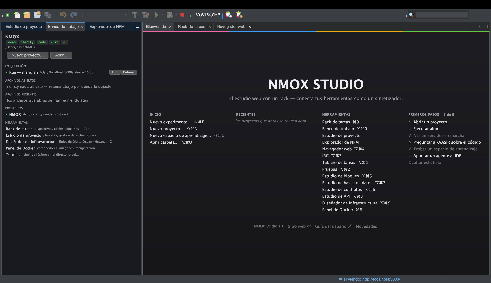
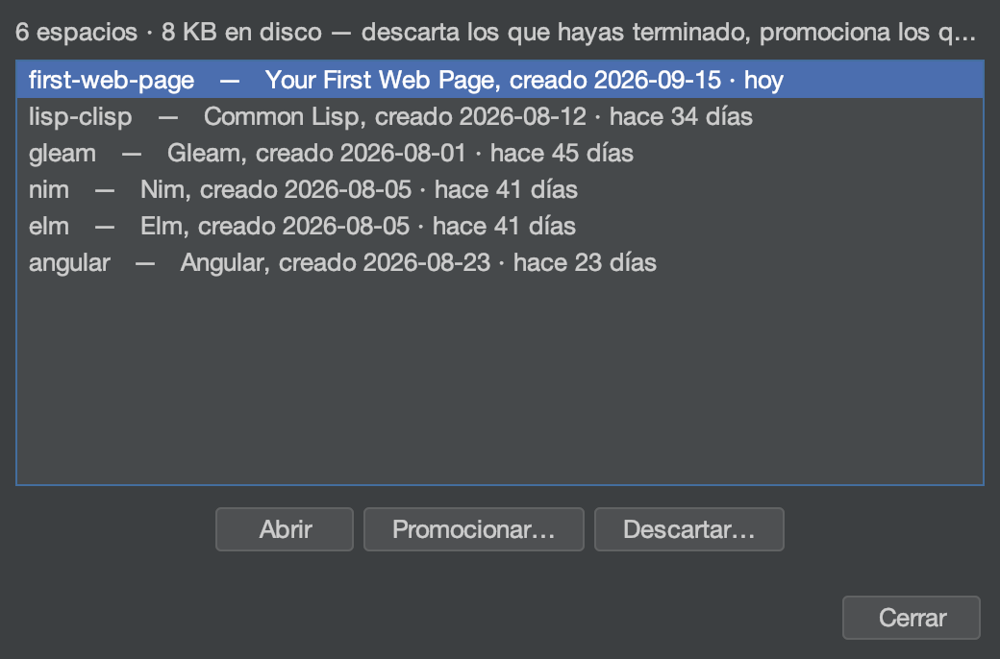
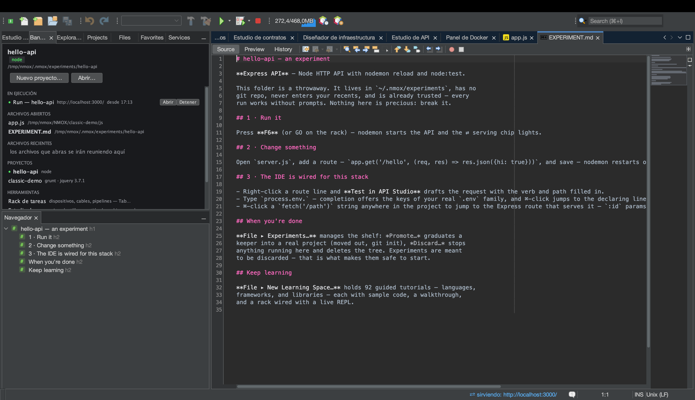
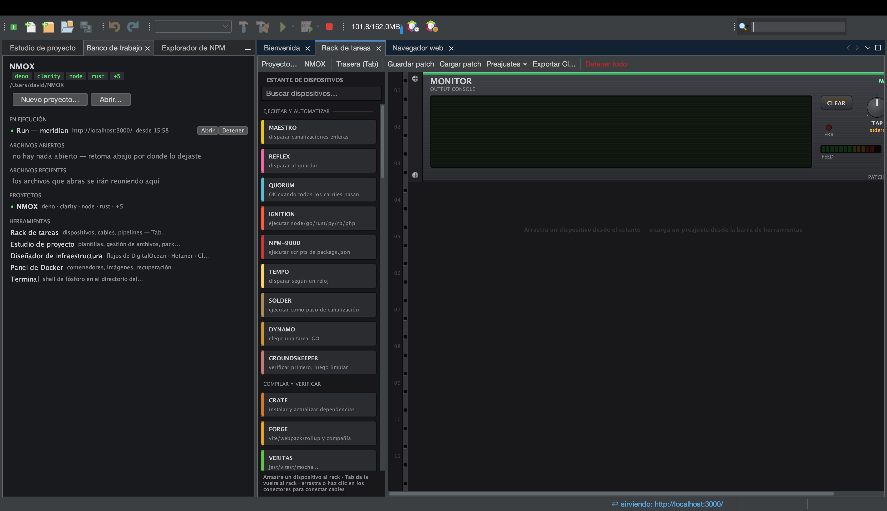
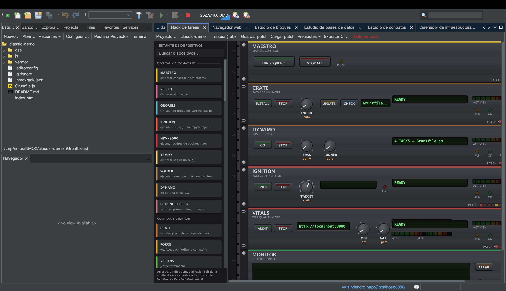
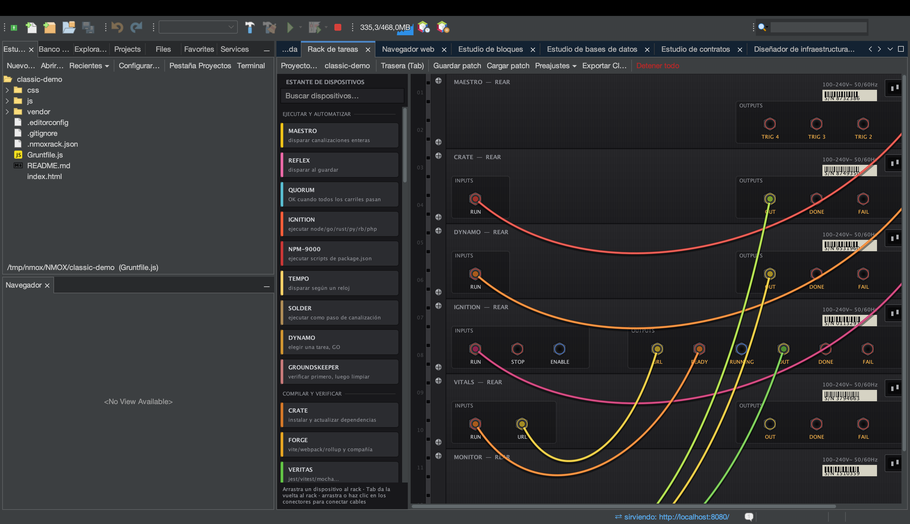
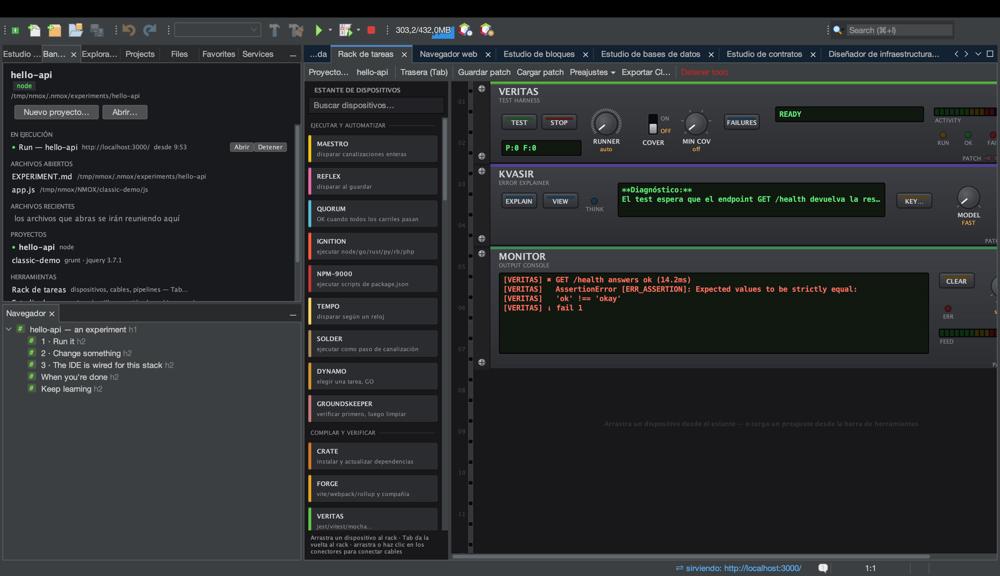
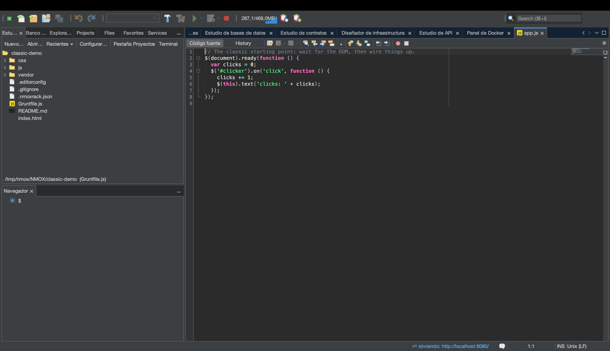

# NMOX Studio — Guía del usuario

<!-- languages -->
[English](user-guide.md) · **Español** · [Français](user-guide.fr.md) · [Deutsch](user-guide.de.md) · [Русский](user-guide.ru.md) · [Українська](user-guide.uk.md) · [Polski](user-guide.pl.md) · [Português (Brasil)](user-guide.pt.md) · [Bahasa Indonesia](user-guide.id.md) · [Filipino](user-guide.tl.md) · [Tiếng Việt](user-guide.vi.md) · [简体中文](user-guide.zh.md) · [हिन्दी](user-guide.hi.md) · [עברית](user-guide.he.md) · [العربية](user-guide.ar.md)
<!-- /languages -->

Cómo usar el producto. Esta guía recorre las funciones en el orden en que las encontrarás: instalación, primer arranque, proyectos, el rack, los estudios, los asistentes y las redes de seguridad.

---

<a id="1-install"></a>
## 1. Instalación

**macOS (recomendado):**
```bash
brew trust --cask nmox/nmox-studio/nmox-studio
brew install nmox/nmox-studio/nmox-studio
```

La línea `brew trust` es la confirmación única de Homebrew para cualquier tap de terceros: no se te volverá a preguntar en las actualizaciones. La aplicación está firmada con un Apple Developer ID y notarizada por Apple, así que Gatekeeper la acepta tal cual: el cask la copia y no le hace nada más. Instalarla a mano desde el DMG funciona igual.

**Todo lo demás:** descarga un archivo de la [última versión](https://github.com/NMOX/NMOX-Studio/releases/latest) — `.dmg` para macOS, `-setup.exe` para Windows, `.deb` para Debian/Ubuntu, `.tar.gz` genérico para Linux. Los cuatro incluyen su propio entorno de ejecución de Java; no hace falta instalar nada antes. El `-portable.zip` es el único artefacto que usa tu propio Java (necesita Java 21+ en el PATH, o arráncalo con `--jdkhome <ruta-al-jdk>`).

> **macOS, primer arranque:** haz doble clic. macOS pregunta una vez si quieres abrir una aplicación descargada de internet, y dice que Apple la ha comprobado: pulsa **Abrir**. La aplicación está firmada con un Apple Developer ID y notarizada, y el tique va grapado tanto a la app como al DMG, así que la comprobación funciona sin conexión: ni clic derecho ni `xattr`. El actualizador integrado instala en tu directorio de usuario y no en el paquete de la app, de modo que actualizar nunca rompe esa firma.
>
> Si una instalación de la 3.0.0, la 3.0.1 o la 3.0.2 respondía *"NMOX Studio.app" Not Opened* (en un macOS en español, que la app no se había abierto), era un defecto en la forma en que la aplicación arrancaba su script lanzador, corregido en la 3.1.0: instala la 3.1.0 o una posterior (`brew upgrade --cask nmox-studio`, o una descarga nueva).

### Verificar tu descarga

Opcional, veinte segundos, y dos comprobaciones porque responden a preguntas distintas.

**¿Son estos los bytes que publicamos?** Funciona en todas las plataformas y cubre cada archivo: `SHA256SUMS` y `SHA256SUMS.asc` vienen con la versión:

```bash
curl -sL https://raw.githubusercontent.com/NMOX/NMOX-Studio/main/KEYS | gpg --import
gpg --verify SHA256SUMS.asc SHA256SUMS
sha256sum -c SHA256SUMS --ignore-missing
```

**¿macOS responde por él?** Otra pregunta, que contesta Apple:

```bash
spctl --assess --type execute -vv "/Applications/NMOX Studio.app"
```

Quieres ver `source=Notarized Developer ID`. Los instaladores de Windows aún no están firmados: para una descarga de Windows, la comprobación de arriba es la vía.

### Actualizar

**Herramientas ▸ Complementos ▸ Actualizaciones** (o **Ayuda ▸ Buscar actualizaciones**) ofrece los módulos del producto de cualquier versión más reciente, desde el centro «Actualizaciones de NMOX Studio», que apunta a la última versión publicada en GitHub. Instala, reinicia cuando se te pida y listo. La plataforma también comprueba por su cuenta, una vez por semana por omisión (se cambia en **Herramientas ▸ Complementos ▸ Configuración**), y aparte el IDE avisa una vez al día de que hay una versión más nueva; eso se apaga en Opciones ▸ General (NMOX Studio ▸ Settings… en macOS, Herramientas ▸ Opciones en los demás sistemas). Cada módulo va firmado y el certificado viaja dentro del producto, así que las actualizaciones se instalan sin preguntas sobre certificados.

El actualizador reemplaza módulos, no la aplicación que los rodea. El entorno de ejecución de Java incluido, el lanzador y la propia plataforma NetBeans solo cambian cuando instalas una versión (`brew upgrade --cask nmox-studio`, o una descarga nueva), y una versión que cambia alguno de ellos lo dice en sus notas — el comando `nmox` de la 3.1.0 y sus correcciones del lanzador de macOS son ejemplos. Una instalación anterior a la 2.35.0 no puede actualizarse desde dentro, porque la 2.35.0 cambió la plataforma: instala una versión actual.

<a id="2-first-launch"></a>
## 2. Primer arranque

Desde una terminal, `nmox .` abre la carpeta en la que estás, como hace `code .`: `cd myproject && nmox .`. Una carpeta queda apuntada exactamente como la apunta «Abrir carpeta…» en la página de bienvenida, tenga manifiesto o no; un archivo se abre en el editor (`nmox src/app.js`). El comando vuelve al instante: el primer `nmox` arranca el IDE en segundo plano, y cada uno de los siguientes le pasa su carpeta al IDE que ya está en marcha. `nmox` a secas solo arranca el IDE. Para tener `nmox` en tu PATH:

- **macOS, con Homebrew:** el cask lo enlaza por ti.
- **macOS, desde el DMG:** enlaza (no copies) el lanzador de la app —
  `sudo mkdir -p /usr/local/bin && sudo ln -s "/Applications/NMOX Studio.app/Contents/MacOS/nmox-studio" /usr/local/bin/nmox`.
  Arrancado a través de un enlace, sabe que viene de una terminal; arrancado desde el Finder o el Dock, se comporta como siempre.
- **Windows:** la casilla del instalador *Añadir «nmox» al PATH*, marcada por omisión. Abre después una terminal nueva: una que ya estaba abierta conserva su PATH anterior.
- **Linux:** el `.deb` instala `/usr/bin/nmox`. Desde el tarball, enlázalo tú: `ln -s "$PWD/nmox-studio-<version>/bin/nmox" ~/.local/bin/nmox`.

También puedes pasarle una carpeta a NMOX Studio sin terminal, y queda apuntada de la misma manera:

- **macOS:** haz clic derecho en una carpeta del Finder y elige NMOX Studio en **Abrir con**, o suelta la carpeta sobre el icono de NMOX Studio en el Dock. Si sueltas varias carpetas a la vez, se apunta la primera y la barra de estado lo dice: el IDE trabaja en una carpeta cada vez. Un archivo soltado sobre el icono se abre en el editor.
- **Linux (el `.deb`):** tu gestor de archivos muestra NMOX Studio en *Abrir con* para una carpeta. No se convierte en tu aplicación predeterminada para carpetas: esa sigue siendo el gestor de archivos.
- **Windows:** marca en el instalador la casilla *Añadir «Abrir con NMOX Studio» al menú contextual de las carpetas en el Explorador* (empieza desmarcada, como la de VS Code). El Explorador ofrece entonces **Abrir con NMOX Studio** sobre una carpeta y sobre el espacio vacío dentro de ella; en Windows 11 está bajo *Mostrar más opciones*. Al desinstalar, desaparece.

El IDE se abre con tres pestañas junto al área del editor: **Bienvenida → Rack de tareas → Navegador web**. Cada una de las demás ventanas está a un atajo ⌥⌘ y aparece en la columna TOOLING de la pestaña de bienvenida. En el panel izquierdo: **Estudio de proyecto** (árbol de archivos y plantillas), la base **Banco de trabajo** y el **Explorador de NPM**. Se crea una carpeta `~/NMOX` como espacio de trabajo predeterminado; el rack apunta ahí hasta que abras un proyecto.



Atajos que conviene aprender el primer día (también aparecen todos en la pestaña de bienvenida):

| Atajo | Abre |
|---|---|
| **⌘I** | Búsqueda rápida — llega a todo (ver §9) |
| **⇧⌘P** | También la Búsqueda rápida — el atajo que VS Code llama paleta de comandos |
| **⌘9** | Rack de tareas |
| **⌥⌘0** | Banco de trabajo |
| **⌥⌘1** | Tablero de tareas |
| **⌥⌘2** | Pruebas |
| **⌥⌘3** | Cliente de chat IRC |
| **⌥⌘4** | Navegador web (WebKit integrado, con DevTools) |
| **⌥⌘5** | Estudio de bloques |
| **⌥⌘6** | Estudio de contratos |
| **⌥⌘7** | Estudio de bases de datos |
| **⌥⌘8** | Estudio de API |
| **⌥⌘9** | Diseñador de infraestructura |
| **⌘8** | Panel de Docker |
| **⌘7** | Esquema del archivo actual |
| **⇧⌘N / ⌥⌘O** | Nuevo proyecto… / Abrir carpeta… |
| **⌥⌘K / ⇧⌘L** | Nuevo experimento… / Nuevo espacio de aprendizaje… |
| **⇧⌘E** | Estudio de proyecto, con el foco en el árbol de archivos |
| **⇧⌘X** | Herramientas ▸ Complementos |
| **⌃\`** | Una terminal en la carpeta del proyecto, o la que ya está abierta (Ctrl+\` en Windows y Linux) |
| **⌥⌘P / ⌥⇧⌘K** | Cambiar de proyecto… / Experimentos… |

¿Vienes de VS Code? [Si vienes de VS Code](coming-from-vscode.es.md) traduce los atajos y las ideas, con la forma de Windows y Linux junto a la de macOS.

<a id="3-projects"></a>
## 3. Proyectos

**Abrir:** cualquier carpeta con uno de los 60 manifiestos reconocidos se abre como un proyecto real — `package.json`, `Cargo.toml`, `go.mod`, `pom.xml`, `composer.json`, `foundry.toml`, `bower.json`, `Gruntfile.js` y compañía — incluidos los manifiestos de las cadenas de contratos: un repositorio Aiken (`aiken.toml`) o Clarinet (`Clarinet.toml`) se abre con sus carriles reales conectados. Una simple carpeta de HTML con etiquetas `<script>` y **sin** manifiesto también se abre, como proyecto STATIC: la web clásica es de primera clase, no un error.

**Crear:** *Nuevo proyecto…* ofrece plantillas reales — Angular, Vue, Svelte, JavaScript sin framework, Elixir/Phoenix, PHP Web (LEMP) y Web clásica (jQuery). Cada una llega con las configuraciones de lint, formato y pruebas ya conectadas y un repositorio git iniciado: un único commit de andamiaje que, cuando el asistente ejecuta la instalación por ti, incluye también el archivo de bloqueo, de modo que tu primer `git status` está limpio.

**Cambiar de proyecto es seguro:** si hay dispositivos en marcha (un servidor de desarrollo, un observador), el IDE pregunta antes de cambiar y los detiene con limpieza. Nada sigue ejecutándose a tus espaldas, nunca. Ni siquiera forzar el cierre del IDE puede dejar un proceso huérfano.

**Los experimentos** son la forma más rápida de probar una tecnología. **Archivo ▸ Nuevo experimento…** (⌥⌘K) elige una plantilla y genera un proyecto desechable en `~/.nmox/experiments`: sin git, sin recientes, ya confiado y con las dependencias instaladas, para que la **primera ejecución funcione**. Se abre con su propio recorrido `EXPERIMENT.md`, que te dice qué pulsar, qué archivo cambiar y dónde vive la inteligencia del IDE para esa tecnología. Conserva lo que prospere: **Archivo ▸ Experimentos…** ▸ **Promocionar…** lo saca e inicia git, **Duplicar** crea una copia para probar otro enfoque y **Descartar** elimina el resto. El estante muestra la edad de cada uno y su coste real en disco. ¿Prefieres el camino guiado? El diálogo presenta los 93 espacios de aprendizaje.





**Ejecutar, construir, probar — y detener:** el ▶ de la barra (F6) ejecuta el proyecto como lo hace su cadena de herramientas: el script `dev`, `start` o `serve` de package.json (el primero que tenga), `cargo run`, `go run`, `dotnet run`, y para una carpeta de HTML un pequeño servidor estático en el primer puerto libre a partir de 8080. Un proyecto Node que no tiene ninguno de esos tres scripts lo dice cuando pulsas ▶ y muestra sus scripts en el **Explorador de NPM**, donde un doble clic ejecuta uno. Construir, Probar y Limpiar están al lado y en el menú Ejecutar. Un servidor de desarrollo que anuncia su dirección enciende el indicador ⇄ de la barra de estado y abre la página en el navegador integrado. Todo se ejecuta tras la confirmación de confianza del espacio de trabajo la primera vez. Una ejecución que no pudo arrancar lo dice y ofrece abrir el Doctor del entorno. Para detener: el ■ a la derecha de Depurar (⌥⌘.) detiene todos los comandos en marcha a la vez y dice qué detuvo; **Ejecutar ▸ Detener compilación/ejecución** detiene uno y luego ofrece **Repetir**. El ■ ve todo lo que el producto ejecuta por ti, incluidas las instalaciones; al pasar el cursor, el mensaje nombra exactamente qué se detendría y desde cuándo lleva cada cosa en marcha.

**`.env` en todas partes:** si tu proyecto tiene un `.env`, los dispositivos lanzados desde el rack reciben esas variables. Edítalo y la barra de estado avisa de que los reinicios lo recogerán — los procesos en marcha conservan honestamente su entorno anterior.

<a id="4-the-task-rack"></a>
## 4. El rack de tareas



El rack es el corazón del producto. Cada herramienta de tu flujo de trabajo — npm, el empaquetador, el ejecutor de pruebas, el servidor de desarrollo, el linter, git, el despliegue — es un dispositivo físico en un rack: los mandos eligen la tarea, GO la ejecuta, los LED muestran el estado y una pantalla LCD te cuenta con palabras qué ocurrió.



**Lo básico:**

- **Añade dispositivos** arrastrándolos desde la paleta (tiene categorías y un filtro de búsqueda). Cada dispositivo trae su ficha *Cómo se usa*.
- **Ejecuta algo** pulsando el botón GO de un dispositivo. Pasa antes el cursor por encima: el mensaje muestra la línea de comandos exacta que se ejecutará. Sin magia.
- **Cablea una tubería:** pulsa **Tab** para girar el rack y ver su parte trasera. Arrastra un cable de conexión desde el jack **OK** de un dispositivo hasta el jack **GO** del siguiente. Ahora `instalar → construir → probar` es una sola pulsación: la cadena se ejecuta sola y se detiene en el primer fallo. La salida corre por la pantalla de fósforo del dispositivo MONITOR.
- **Deshaz cualquier cambio estructural** con **⌘Z** — añadir, quitar y recablear dispositivos. Quitar un dispositivo en marcha detiene antes su proceso.
- **Los preajustes** te dan un rack entero ya cableado con un clic — Ship Gate, Dev Intelligence, Monorepo Lanes, E2E Loop, LAMP Bench, Web3 Bench, Uptime Watch. **Guardar patch** escribe el rack junto al proyecto como `.nmoxrack.json`; al apuntar de nuevo a ese proyecto, se carga. No se guarda nada hasta que lo pulsas.



**Coordinación, cuando tu tubería crece:**

- **QUORUM** une carriles: solo se dispara cuando *todas* sus entradas cableadas han tenido éxito — el clásico «espera a lint Y pruebas Y comprobación de tipos».
- **Las compuertas ENABLE** en los procesos largos: la entrada ENABLE de un servidor de desarrollo significa «no arranques hasta que esto se dispare».
- **REFLEX** vigila archivos y enruta por patrón — `src/**/*.css` a una cadena, `**/*.ts` a otra, por carril en un monorepo.
- **ROSETTA** elige el carril de herramientas en repositorios mixtos (el rack detecta Node/Rust/Go/PHP/… por directorio y apunta cada dispositivo en consecuencia).

**Carriles nativos de tu cadena de herramientas.** En AUTO, los dispositivos de lint y formato (PURITY, GLOSS) hablan la cadena del propio proyecto en vez de recurrir a herramientas de Node en todas partes: un espacio de trabajo Deno usa `deno lint` y `deno fmt`, un proyecto Cargo usa `cargo clippy` y `cargo fmt`, y un módulo Go usa `go vet` (o `golangci-lint` si el proyecto lleva su configuración) y `gofmt`. Un `biome.json` cambia los carriles de Node a Biome, y las posiciones explícitas del mando siempre ganan a AUTO.

**Tus propios dispositivos.** El estante se amplía con un editor de texto: cualquier `*.json` en `~/.nmox/devices.d/` se convierte en un dispositivo real — mandos, botones, LED, puertos y cables, guardado en el montaje y accesible desde ⌘I. Declara un comando como un arreglo de argumentos, nombra un mando y `{{mando}}` se sustituye al pulsar el botón. Las leyes las mantiene el anfitrión, no tu archivo: **la confianza del espacio de trabajo controla el primer arranque igual que en un dispositivo integrado**.

**Las compuertas de calidad** convierten el «parece terminado» en «está terminado»:

- **VITALS** ejecuta Lighthouse contra tu servidor vivo y exige un mínimo de rendimiento, accesibilidad, buenas prácticas o SEO.
- **VERITAS** impone un mínimo de cobertura y vuelve a ejecutar exactamente las pruebas que fallaron, por su nombre.
- **GAUNTLET** mide la carga de un extremo y exige un mínimo de rendimiento. **PRISM** vigila el tamaño del paquete, **BEACON** el certificado y la disponibilidad de una URL, y **PREFLIGHT** es la lista de comprobación previa al envío — cablea su OK a tu dispositivo de despliegue y los despliegues no podrán ejecutarse hasta que todo esté en verde.
- **GOVERNOR** vigila las regresiones de gas en el trabajo con Solidity (`.gas-snapshot`).

**Cualquier otra cosa:** **SOLDER** envuelve cualquier comando de consola como un dispositivo de pleno derecho — y el rack entero **se exporta a GitHub Actions** (tu tubería local y tu integración continua son el mismo cableado). **HELM** ejecuta comandos en un servidor remoto por ssh, **TAIL** sigue cualquier archivo de registro y **PHOSPHOR** es una terminal dentro del rack. Si el comando imprime una dirección local, se enciende el indicador ⇄ como en cualquier dispositivo que sirva, y se apaga cuando la ejecución termina.

**El rack se mantiene sincronizado solo.** Edita `package.json` y el mando de scripts de NPM-9000 se actualiza en su sitio. Edita un `Gruntfile` y DYNAMO vuelve a analizar sus tareas. Añade una dependencia y la pantalla de CRATE se refresca. Sin volver a apuntar, sin botones de recargar.

### KVASIR — explica el último fallo



**KVASIR** es asistencia de IA a la manera del rack: un dispositivo que explica el error que hay ahora mismo en el bus MONITOR, no una barra lateral de chat. Cuando una ejecución falla, pulsa **EXPLAIN** y KVASIR le pregunta a tu IA qué salió mal y cuál es el siguiente paso concreto. Un veredicto breve aparece en la pantalla; **VIEW** abre la respuesta completa. **MODEL** elige entre **FAST** (rápido y barato, el valor por omisión) y **DEEP** (más potente). EXPLAIN es azul: lee y pregunta, nunca toca tu proyecto.

KVASIR responde en el idioma en que está configurado NMOX Studio.

**Elige tu IA y pon tu clave.** KVASIR funciona con **Claude (Anthropic)**, **ChatGPT (OpenAI)** o **Gemini (Google)** — tu clave, tu elección. Pulsa **KEY…** para escoger el proveedor y pegar su clave; la elección se recuerda y la clave vive solo en el llavero del sistema operativo. También se leen las variables de entorno habituales de cada proveedor, y una clave guardada gana a una del entorno.

**Qué envía KVASIR, y todo lo que envía.** La primera vez que pulsas EXPLAIN, un diálogo enumera exactamente lo que saldrá de tu máquina y lo que no; nada se envía sin ese consentimiento, y el consentimiento es por proveedor. Tras un EXPLAIN correcto, el botón **VIEW** abre la respuesta como una conversación, así que puedes seguir preguntando sobre el mismo fallo.

**Pregúntale a KVASIR sobre tu código.** El mismo asistente llega al editor: selecciona código y elige **Preguntar a KVASIR sobre la selección…**, o **Editar con KVASIR…** para decir qué cambiar y ver un antes y un después antes de aplicar nada. **⌥⌘G** completa en el cursor con texto fantasma que solo se inserta si pulsas Tab, y el indicador de rama de git puede redactar tu mensaje de commit.

**Apunta un agente a tu IDE.** Herramientas ▸ Agent Port (MCP)… abre un extremo MCP que un asistente externo puede consultar: es **de solo lectura por construcción**, está apagado hasta que tú lo enciendes, escucha únicamente en la interfaz local y exige el token que se genera al arrancarlo.

El rack es ampliable: los complementos de terceros pueden añadir dispositivos (instala su NBM desde Herramientas ▸ Complementos). Para escribir uno, consulta [device-spi.md](device-spi.md).

<a id="5-the-editor"></a>
## 5. El editor



Más de 70 lenguajes se resaltan como es debido — la pila moderna, la clásica (CoffeeScript incluido) y toda la capa de configuración, hasta `.env`, `.editorconfig`, las configuraciones de nginx y Apache, los Dockerfile y los archivos de bloqueo.

- **El autocompletado** conoce el contexto y también *las bibliotecas clásicas*: si tu proyecto lleva jQuery, MooTools, Prototype, Backbone/Underscore o Knockout (por dependencias de npm *o* por simples etiquetas `<script>`), sus API aparecen al completar. Los proyectos con jQuery 1.x o 2.x reciben una etiqueta honesta de fin de vida, no una regañina.
- **El esquema del Navegador (⌘7)** muestra la estructura del archivo para 58 tipos distintos; pulsa para saltar.
- **El minimapa** — una silueta del archivo entero junto a la barra de desplazamiento de cada editor; pulsa o arrastra para desplazarte. El documento completo siempre cabe en la tira: las filas se encogen a medida que el archivo crece. Ver ▸ Minimapa lo enciende y apaga en todos los editores abiertos a la vez.
- **El desplazamiento adherente** — las declaraciones que encierran la parte alta de la vista (la clase, y luego el método al que has bajado) quedan fijadas sobre el texto, hasta tres líneas del propio código; pulsa una para saltar allí. La barra desaparece cuando nada encierra la primera línea visible.
- **Ir al símbolo (⌥⇧⌘O)** salta a cualquier función, clase, regla o encabezado de todo el proyecto escribiendo su nombre, con coincidencia por prefijo, por mayúsculas internas o por comodín. El índice es acotado y honesto: se omite `node_modules` y, en un proyecto muy grande, el diálogo dice que indexó los primeros 2.000 archivos en vez de fingir que lo leyó todo.
- **La ventana de pruebas (⌥⌘2)** muestra todas las pruebas del proyecto *antes de ejecutar nada*, y ejecuta una, un archivo o todas.
- **Se respeta `.editorconfig`** — mientras escribes y al guardar. `indent_style`, `indent_size` y `tab_width` deciden lo que escriben Tab, Entrar y la reindentación, de modo que un proyecto con tabuladores recibe tabuladores y uno de cuatro espacios recibe cuatro espacios, por archivo y por sección de patrón; cada guardado aplica `trim_trailing_whitespace` e `insert_final_newline`. Un cambio en `.editorconfig` llega a los editores abiertos en un par de segundos. Un carácter de tabulación que ya está en el archivo se sigue dibujando con el ancho de tabulación fijado en Opciones, y `charset` y `end_of_line` no se aplican. Tus dispositivos de formato (GLOSS y compañía) se ocupan del resto.

### Expandir abreviatura (⌥⌘E)

Escribe una abreviatura de Emmet y pulsa **⌥⌘E**: `ul>li*3` se convierte en la lista completa. Funciona en HTML, en las plantillas de Angular y — en su forma de CSS — dentro de bloques `<style>` y atributos `style`, donde el recorte está limitado a la región para que jamás se trague el marcado que la rodea. Una abreviatura que el producto no reconoce se rechaza y deja tu texto intacto.

### Tokens de diseño (propiedades personalizadas)

Al escribir `var(` aparecen los tokens declarados en las hojas de estilo reales de tu proyecto, cada uno con su muestra de color y con la indicación de dónde está declarado. **⌘-clic** sobre un uso de `var(--token)` salta a su declaración. Los colores se pintan como el color que son — hex, `rgb()`, `hsl()`, nombres y también `oklch()`, `lab()` y `color-mix()` — y **⌘-clic** sobre un literal de color abre un selector que lo reemplaza en la forma en que lo escribiste.

### El atributo class conoce tus hojas de estilo

Al escribir dentro de `class="…"` se ofrecen las clases que tu proyecto realmente define, indicando de qué hoja vienen; **⌘-clic** sobre una clase salta a su regla, y **⌘-clic** sobre un selector `.clase` salta a su primer uso en el marcado. **Renombrar clase…** cambia el nombre en todo el proyecto — solo tokens completos, con la cuenta por archivo — y se niega en voz alta si el nombre nuevo ya existe o si hay cambios sin guardar.

### Ejecutar script, desde el cursor

En la sección `scripts` de un `package.json`, **Ejecutar script** ejecuta la línea donde está el cursor — a través de la misma confirmación de confianza del espacio de trabajo y del mismo ■ que cualquier otra ejecución.

### Las claves de entorno, de primera clase

Al escribir `process.env.` o `import.meta.env.` se ofrecen las claves que tu familia de archivos `.env` define de verdad, y **⌘-clic** salta a la línea que declara la clave. Los valores se muestran truncados: el recordatorio está ahí, el secreto no.

### Las traducciones de tu proyecto

Los catálogos de traducción de un proyecto web son datos que el editor lee, igual que tus hojas de estilo y tu `.env`. **Herramientas ▸ Comprobar traducciones…** encuentra los catálogos (i18next, vue-i18n, svelte-i18n, el XLIFF de Angular, Lingui, Paraglide, react-intl o el del I18n Kit), elige la lengua de origen e informa de tres cosas, como subrayados y filas en Tareas: **falta** (las formas de plural y de contexto se comparan por su clave base), **idéntico al origen** (copiado en vez de traducido) y **marcador distinto** — ese es el error, porque una traducción cuyo conjunto de `{{name}}` o `%s` difiere del origen está rota. Un cuarto hallazgo, **sin usar**, solo aparece con un censo completo.

### Plantillas de Angular, de primera clase

Los archivos `.component.html` se abren con resaltado propio de plantilla, con las llaves de bloque `@if`/`@for` y las directivas estructurales al completar. Instala el Angular Language Service y la comprobación de tipos de plantilla llega de verdad: escribe mal el nombre de una propiedad y el propio compilador de Angular te sugiere la correcta. **⌘B** en una plantilla salta a la definición, y el menú contextual pasa entre el componente, su plantilla, sus estilos y su prueba.

### Componentes de Vue y Svelte, de primera clase

Los archivos `.vue` y `.svelte` se abren con su propio resaltado, su propio autocompletado (las runas de Svelte 5 con notación de punto incluidas) y Emmet dentro de sus bloques de plantilla. Los diagnósticos de Vue llegan de verdad al editor a través del servidor de lenguaje de Vue.

### Depuración con puntos de interrupción reales

Haz clic en el margen izquierdo, elige **Depurar archivo (puntos de interrupción)** y el programa se detiene ahí — con la pila, las variables y la evaluación de expresiones. JavaScript y TypeScript funcionan de fábrica gracias al adaptador incluido; Python usa debugpy y Go usa delve, que instalas tú. **Depurar en Chrome** hace lo mismo con una página: los puntos de interrupción de tu código fuente se detienen dentro del IDE mientras el navegador corre en un perfil desechable. Todo pasa antes por la confirmación de confianza del espacio de trabajo.

### Depuración en el navegador

El JavaScript del navegador se depura igual: clic derecho en un archivo `.html`, `.js` o `.ts` → **Depurar en Chrome (puntos de interrupción)**. Los puntos puestos en el editor detienen el código que corre *en el navegador*, con la misma pila y las mismas variables. El navegador sigue a la fuente más viva: si ya hay un dispositivo sirviendo una URL del proyecto, esa página es la que abre; si no, un `.html` se abre desde el disco. Un script suelto sin servidor no tiene página — la línea de estado lo dice en vez de adivinar. Chrome arranca con un perfil desechable y el tuyo queda intacto. Los **Web Workers** también se depuran: cada `new Worker(…)` es su propia sesión.

### Presentar y compartir

**Ver ▸ Modo presentación** agranda de una vez todos los editores, la página del navegador integrado, la ventana de salida y la terminal — y lo devuelve todo exactamente como estaba al salir. **Ver ▸ Mostrar pulsaciones de teclas** muestra en grande el atajo que acabas de pulsar, pero nunca lo que escribes. **Editar ▸ Copiar como Markdown** copia la selección como un bloque delimitado con la etiqueta de lenguaje correcta, y su variante **con enlace** añade el enlace de GitHub a esas mismas líneas. **Herramientas ▸ Guardar captura de pantalla…** pinta la ventana entera al doble de tamaño, y hay variantes para la pestaña del editor sola, para el portapapeles y para copiar el árbol del proyecto como Markdown.

<a id="6-the-studios"></a>
## 6. Los estudios

### Acceso por teclado y con lector de pantalla

Cada control del rack tiene un nombre accesible, y esto se comprueba en cada compilación. Las ruedas son deslizadores que responden a las flechas, Inicio y Fin; los botones responden a Espacio y Entrar, incluidos los que están atenuados, que dicen por qué se niegan; los LED y las pantallas anuncian su estado. Tab gira el rack, salvo cuando el foco está en un control, donde cede el paso al recorrido normal.

### Git, en la barra de estado

El indicador **⎇ rama** muestra en qué rama estás y cuántos archivos has cambiado; se lee del disco, así que no cuesta procesos. Un clic abre el historial completo, y el menú lleva **Diferencias del proyecto**, **Anotar**, las solicitudes de incorporación de tu propio `gh` y **Redactar mensaje de commit con KVASIR**.

### Tablero de tareas (⌥⌘1)

Un kanban por proyecto guardado en `.nmoxtasks.json`, junto a tu código y versionado con él. Arrastra tarjetas o muévelas con el teclado: **⌘↑/⌘↓** las reordena y la tarjeta movida conserva el foco. Los límites de trabajo en curso son consejos, no barreras: la cabecera se pone roja y nada te lo impide. El botón **Resumen** cambia las columnas por un panel — trabajo en curso, terminado hoy y esta semana, flujo por día, tarjetas que envejecen — y el reloj de tiempo (**Fichar**) mide el trabajo real por tarjeta, con un solo reloj corriendo en todo el tablero. **Standup** convierte todo eso en un informe listo para pegar.

### Estudio de bloques (⌥⌘5)

Compone Componentes Web reales con piezas encajables y tipadas, como Scratch: las anidaciones ilegales se rechazan, el código se genera en un elemento personalizado autónomo, y al pulsar una pieza se resaltan sus líneas. Un servidor de vista previa en memoria muestra el componente de verdad, compuesto junto a los demás componentes válidos de tu biblioteca. La ida y vuelta es exacta: volver a generar lo que se acaba de leer da byte por byte el mismo archivo.

### Estudio de API (⌥⌘8)

Colecciones, peticiones, entornos con `{{variables}}` y pruebas, guardado en `.nmoxapi.json` — con los secretos solo en el llavero, nunca en ese archivo. Cada respuesta recibe una nota de seguridad de sus cabeceras. Importa desde curl, `.http`, OpenAPI, Postman, Insomnia y HAR; exporta a `.http` y copia como curl o como `fetch`, con las variables ya resueltas.

### Estudio de bases de datos (⌥⌘7)

SQLite, PostgreSQL, MySQL, MariaDB, MongoDB y CouchDB, con sus controladores incluidos y las contraseñas solo en el llavero. La consola conoce el motor, cada sentencia trae su propia rejilla de resultados, y las filas se editan en la propia rejilla cuando hay clave primaria — con vista previa de las UPDATE exactas antes de aplicarlas, y una razón honesta cuando algo es de solo lectura. Exporta a CSV o JSON, con las fórmulas neutralizadas.

### Estudio de contratos (⌥⌘6)

El árbol de artefactos de Foundry y Hardhat, **Interactuar** guiado por la ABI con retornos y reversiones decodificados, un panel **Vigilar** que sigue bloques y eventos, y **Supervisión** con la tabla de gas, los veredictos de tamaño EIP-170 y la libreta de direcciones. **Nunca hay claves privadas**: los envíos usan las cuentas desbloqueadas de una red local, y las URL secretas viven en el llavero.

### Diseñador de infraestructura (⌥⌘9)

Un lienzo para DigitalOcean, Hetzner y Cloudflare: sincroniza lo que existe de verdad, refresca para ver las diferencias y destruye una pila con su coste delante. Los cables ilegales se niegan en voz alta explicando por qué, y mientras una operación en la nube está en marcha el lienzo se bloquea con un aviso que lo dice.

### IRC (⌥⌘3)

Un cliente completo dentro del IDE: TLS con verificación real del nombre, SASL, extensiones IRCv3, completado con tabulador, resaltados, URL que se abren en el navegador integrado, registro en disco, filtros propios y una lista de canales que puedes filtrar mientras escribes.

### El sitio web incluido

**Ayuda ▸ Sitio web de NMOX Studio (local)** sirve el sitio del producto desde el propio rack, en la interfaz local. Habla las quince lenguas que habla el IDE; el selector está al pie de la página.

### Navegador web (⌥⌘4)

Un navegador de verdad dentro del IDE, con sus propias herramientas de desarrollo — consola, DOM, red, almacenamiento y paneles para Vue, Svelte y Angular — porque el motor no trae inspector y aquí lo ponemos nosotros. Es consciente del código fuente: elige un elemento, abre la línea que lo produjo y cambia su estilo ahí mismo, y el cambio aterriza en la hoja de estilo de origen. Guardar un archivo recarga la página, y hay tamaños de dispositivo reales para probar tu diseño adaptable.

Las páginas en escrituras complejas se pintan con sus formas: el árabe, el persa, el urdu (nastaliq incluido), el kurdo, el pastún, el sindi, el uigur, el siríaco, el thaana y el n’ko unen sus letras y se leen en su propio orden, con los números en el suyo; el hindi y las demás escrituras índicas (bengalí, gurmukhi, guyaratí, oriya, tamil, telugu, canarés, malayalam, cingalés), el tailandés, el tibetano, el birmano y el jemer colocan en su sitio sus signos vocálicos y sus conjuntos; y los acentos escritos como caracteres aparte (como escribe macOS los nombres de archivo) se asientan sobre sus letras. El WebKit de JavaFX no hace nada de esto por sí solo. En macOS y en Windows, el Navegador web enciende el motor de texto complejo del propio WebKit, así que los campos de formulario, las frases en negrita y cursiva, los párrafos justificados y las selecciones miden exactamente. En Linux, donde ese interruptor no existe, el Navegador web da forma al texto por su cuenta y ajusta sus estimaciones de ancho a las fuentes que instaló tu distribución, de modo que una frase llena de conjuntos o escrita en nastaliq puede quedar desplazada unos píxeles. El lao no recibe forma: el propio texto de JavaFX también desplaza sus vocales. El hebreo, el armenio, el georgiano y el etíope se muestran bien por sí solos, niqqud incluido.

<a id="7-docker"></a>
## 7. Docker

La pestaña Docker es un panel de control: estado del motor, contenedores, imágenes, volúmenes y redes, con arrancar, parar, ver registros y limpiar. El dispositivo HARBOR del rack te da lo mismo de un vistazo. Y como ya se dijo: si levantas un contenedor de Postgres, MySQL o Mongo, el Estudio de bases de datos te ofrece una conexión ya hecha.

La pestaña **Dockerize** genera un `Dockerfile` de calidad de producción, un `.dockerignore` y un archivo de composición ajustados a la cadena de herramientas de tu proyecto — Node, PHP-FPM con nginx y más.

<a id="8-wizards-and-kits"></a>
## 8. Asistentes y kits

Todos viven en *Nuevo archivo…* y en el menú contextual del proyecto, y todos son **idempotentes y nunca sobrescriben**: volver a ejecutar uno actualiza lo que le pertenece y deja tus cambios en paz; lo que no puede reescribir aterriza al lado como un archivo `.suggested`.

### Kit de estándares

`robots.txt`, `sitemap.xml`, el manifiesto web, el `security.txt` del RFC 9116 y `humans.txt`, generados a partir de tus respuestas.

### Kit de PWA

Un juego completo de iconos forjado desde una sola imagen, con las variantes enmascarables incluidas; un trabajador de servicio legible — de shell de aplicación o de red primero, tú eliges —, una página para cuando no hay conexión, y el cableado del `index.html` que lo une todo.

### Kit de accesibilidad

La accesibilidad como punto de partida, no como auditoría posterior: `a11y.css` (un anillo de foco visible, una utilidad para texto que solo leen los lectores de pantalla, estilos de enlace de salto y un bloque para quien prefiere menos movimiento), `A11Y-NOTES.md` con el recorrido de teclado y las preguntas que ninguna automatización responde, y el cableado idempotente del `index.html` — el idioma, el enlace de salto y la hoja de estilo. Un viewport que impide ampliar se avisa, nunca se reescribe; lo que el kit no puede arreglar lo dice, no lo toca.

### Kit de internacionalización

Traducible desde el primer día, el hermano del kit de accesibilidad: `locales/en.json` y `locales/es.json` (un catálogo por lengua, con las mismas claves), un `i18n.js` sin dependencias que aplica el catálogo al marcado con `data-i18n`, mantiene `<html lang>` diciendo la verdad y muestra una clave que falta como ella misma, nunca como un hueco en blanco; más `I18N-NOTES.md` — nada de fragmentos concatenados, `Intl` para fechas y números, el recorrido de derecha a izquierda y la seudolocalización.

### Kit de contratos (Web3)

Elige una cadena — Solidity con Foundry, Soroban, Solana, CosmWasm, ink!, Cairo, Move, Bitcoin con Miniscript, Clarity en Stacks, Cardano con Aiken o TON con Tact — y un nombre de contrato, y el kit crea el arranque ya probado en vivo: manifiesto, contrato, prueba nativa y un CONTRACT-NOTES.md que nombra los dispositivos del rack y los pasos que solo se hacen una vez. Las claves nunca tocan el IDE.

### Kit clásico

Añade a cualquier código jQuery, MooTools, Prototype, Backbone con Underscore o Knockout, ya sea incluido en el repositorio (versiones fijadas, con su sha256 anotado) o como dependencias de npm; más andamiajes de webpack, grunt, gulp o bower.

<a id="9-quick-search-status-line-and-staying-oriented"></a>
## 9. Búsqueda rápida, barra de estado y no perder el norte

### El indicador ⇄ sirviendo

En la barra de estado aparece un indicador **⇄ sirviendo** siempre que hay servidores en marcha: la ejecución del propio IDE, los dispositivos que sirven, y cualquier orden que haya impreso una dirección local. Pulsa y elige una: se abre en el navegador integrado, o en el del sistema cuando esa pestaña no puede con ella.

### ⌘I, el buscador universal

Una sola caja alcanza tus proyectos (los recientes y los conocidos), todos los dispositivos del rack — saltando directamente a sus controles —, los **servidores en marcha** (Entrar lo abre en el navegador), las peticiones del Estudio de API, las conexiones y tablas del Estudio de bases de datos, los contratos, los nodos de infraestructura, las tarjetas del Tablero de tareas (el resultado nombra la columna en que están) y los **scripts de npm** del proyecto apuntado: escribe `dev` o `test` y el resultado dice *Ejecutar script: dev — vite*; Entrar lo ejecuta con el propio gestor de paquetes del proyecto (npm, yarn o pnpm), exactamente como lo haría un doble clic en el Explorador de NPM — la confianza del espacio de trabajo pregunta antes en un proyecto en el que aún no confías, la ejecución se suma al ■ de la barra de herramientas, y un servidor de desarrollo que imprima su dirección enciende el indicador ⇄. En un monorepo, los scripts son los que muestra el Explorador de NPM.

### La barra de estado dice qué está vivo

Junto al indicador de servidores están el proyecto apuntado y su cadena de herramientas, y la rama de Git con cuántos archivos has cambiado. Todo se lee del disco o de registros que el producto ya lleva: mirar no cuesta procesos.

### El Banco de trabajo

Es la base: el proyecto actual, los archivos abiertos y recientes, los proyectos recientes y los accesos a cada superficie. Mientras algo corre, la sección **EJECUTÁNDOSE** encabeza la página — cada orden que el producto arrancó por ti, con su dirección si la anunció y desde qué hora corre, más cada servidor que sirve un dispositivo del rack. Cada fila lleva botones **Abrir** y **Detener** de verdad, alcanzables con teclado y con lector de pantalla, así que puedes parar una sola ejecución sin tumbar el resto. Todos los títulos del Banco de trabajo son botones reales: Tab llega, Entrar abre. ⌘I alcanza esas mismas ejecuciones: escribe «detener» y Entrar detiene exactamente esa. Lo que detuviste tú se lee *detenido* allí donde se cuente su desenlace, nunca como un fallo.

### Atajos de Emacs (y de Eclipse, y de IntelliJ)

Herramientas ▸ Opciones ▸ Atajos de teclado (en macOS, NMOX Studio ▸ Settings… ▸ Atajos de teclado) cambia el perfil entero: los movimientos y el cortar y pegar de Emacs en cada editor, o los juegos de Eclipse o IDEA si es esa tu memoria muscular. Cada atajo de NMOX (la familia ⌥⌘ de las ventanas, ⌘P Ir al archivo, el ⌥⌘E de Emmet, los atajos de VS Code) está registrado en los cinco perfiles, así que cambiar de perfil nunca te cuesta los atajos de los estudios. Hay una excepción deliberada: en el perfil de Eclipse, ⇧⌘E sigue siendo el *Switch to Editor* del propio Eclipse, porque quien eligió Eclipse lo espera.

<a id="10-the-safety-nets-things-you-dont-have-to-do-anything-for"></a>
## 10. Las redes de seguridad (lo que no tienes que hacer)

### Resurrección de la sesión

El rack toma una instantánea de lo que corre cada pocos segundos. Un cierre forzado, un fallo, un `kill -9` — al volver a abrir, un aviso te ofrece reanudar exactamente la sesión que perdiste, con un clic.

### La garantía contra huérfanos

Salir del IDE mata todos los procesos que él arrancó — servidores de desarrollo, intérpretes, cadenas, vigilantes —, primero con TERM y luego con KILL si se resisten, descendientes incluidos.

### BLACKBOX y SONAR

Añade **BLACKBOX** a tu rack y tendrás una caja negra: cada arranque y cada salida, con duraciones, tendencias y qué cambió desde la última compilación en verde. Lo que detuviste tú se lee DETENIDO — ni verde ni fallo, y nunca lo que se le pide explicar a KVASIR. **SONAR** enseña quién ocupa tus puertos, cruzado con Docker, y mata de un clic al que se sentó en el 3000.

### Archivos que nunca se pisan

Los cuatro archivos de trabajo de los estudios (`.nmoxapi.json`, `.nmoxdb.json`, `.nmoxweb3.json`, `.nmoxinfra.json`) se recargan cuando los editas fuera del IDE — pero si tienes cambios sin guardar, se te pregunta; nunca se sobrescriben. Un archivo corrupto se aparta como `.bak` y se te dice, nunca se reemplaza en silencio.

### TypeScript sin compilar

Un proyecto cuya entrada es `index.ts`, `main.ts` o `src/index.ts` se ejecuta desde IGNITION con el propio despojado de tipos de Node (`--experimental-strip-types`, desde Node 22.6; por omisión desde 23.6 y 22.18 LTS). La negativa de un Node más viejo se traduce a la frase que nombra ese piso.

### Tu lengua

NMOX Studio habla quince lenguas: English, Español, Français, Deutsch, Русский, Українська, Polski, Português (Brasil), Bahasa Indonesia, Filipino, Tiếng Việt, 简体中文, हिन्दी, עברית y العربية. Elige la tuya en **Opciones ▸ General ▸ Idioma** — cada una aparece con su propio nombre, para que siempre encuentres la tuya. La elección se escribe en tus ajustes de arranque (`etc/nmoxstudio.conf`, como un argumento `--locale`) y también se aplica al vuelo. Cambian los menús, los diálogos, las ayudas emergentes, las barras de estado, la Bienvenida y las Opciones. No cambia el vocabulario de las carátulas del rack (GO, STOP, EXPLAIN — son etiquetas de aparato, como en un sintetizador), ni los diálogos más hondos de la plataforma, que todavía no tienen traducción. No hace falta que elijas nada: una instalación nueva ya habla la lengua de tu sistema, y también desde un país que nunca nombramos — Taiwán, Singapur, Portugal y Quebec aterrizan en su lengua y no en inglés, porque los catálogos llevan el nombre de una lengua y jamás el de un país.

### Comprobación diaria de actualizaciones

Discreta, una vez al día: si hay una versión más nueva, una notificación te lleva al Gestor de complementos, en su pestaña de actualizaciones, donde el centro de actualizaciones instala los módulos nuevos en su sitio. Se apaga en Opciones ▸ General.

<a id="11-learning-spaces"></a>
## 11. Espacios de aprendizaje

### Comprueba tu trabajo

Algunos espacios traen puntos de control: elige uno que los tenga y **Archivo ▸ Comprobar mi trabajo** verifica los ejercicios de verdad — lo que dicen los archivos se comprueba en puro Java, incluidas las comprobaciones de *ausencia*, que es como se verifica «cambiaste el titular»: el texto original del ejemplo tiene que haber desaparecido. Lo que dicen las órdenes se comprueba con la propia cadena de herramientas del espacio. Cada ✗ responde con la pista del propio espacio, y cuando fallan, el informe ofrece **Explicar con KVASIR…**: los puntos que fallaron y, si la comprobación era de archivo, tu propio archivo, acotados y bajo un permiso que dice exactamente qué sale. La respuesta se lee como la de un tutor: qué cambiar, y vuelve a comprobar.

### Tus propios tutoriales

Deja un archivo `*.json` en `~/.nmox/learn-catalog.d/` y se suma al selector de espacios nuevos, con el mismo esquema que los incorporados; un `slug` que coincida reemplaza al de casa. ¿Das clase? Escribe construyendo: haz del ejercicio un proyecto normal y **Archivo ▸ Exportar como espacio de aprendizaje…** genera ese archivo por ti — los ficheros de muestra, tu `TUTORIAL.md`, el guion de ejecución y tus puntos de control —, validado contra el propio analizador del selector antes de escribirlo, así que lo que entregas a tus alumnos es exactamente lo que su selector cargará.

### El catálogo

*Nuevo espacio de aprendizaje…* ofrece 93 tutoriales incorporados — lenguajes, marcos de trabajo y bibliotecas. Cada uno genera un pequeño proyecto de muestra, un tutorial guiado y un rack ya cableado con un **intérprete de verdad**: escribes en el rack y te contesta un intérprete vivo. La rueda ENGINE elige entre 37 intérpretes, y si falta alguno, el botón INSTALL lo instala allí mismo mostrando el progreso en la pantalla. Los espacios viven en `~/.nmox/learn`, aparte de tu trabajo real.

### Primeros pasos, en la Bienvenida

Una cuarta columna enumera los seis primeros gestos — abrir un proyecto, ejecutar algo en el rack, ver un servidor levantarse, preguntarle a KVASIR sobre código, probar un espacio de aprendizaje y apuntar un agente al IDE — y marca cada uno a partir de registros que el producto ya lleva. Cada fila es una puerta: al pulsarla se abre esa ventana o esa acción. Una marca nunca se desmarca; la columna desaparece cuando están los seis, o cuando pulsas **Ocultar esta lista**.

### Las tres respuestas del menú Ayuda

**Novedades…** trae las notas de la versión que ejecutas, incluidas en la propia compilación; en el primer arranque tras una actualización se abren solas con lo que tu instalación no había visto. **Informar de un problema…** arma un informe con tu entorno y las últimas cuarenta líneas del registro, ya redactadas — tu carpeta personal se vuelve `~`, tu usuario `<user>`, y lo que parezca una credencial `[redacted]` —; lo editas y **Abrir en GitHub** rellena una incidencia que envías tú, o lo copias. El producto nunca envía nada por su cuenta. **Atajos de teclado…** enumera cada atajo de NMOX de tu perfil activo, leído del teclado en marcha, así que no puede desviarse de lo que hacen los menús.

<a id="12-when-somethings-wrong"></a>
## 12. Cuando algo va mal

### El Doctor del entorno

En el menú Herramientas, sondea en vivo 66 herramientas externas — node, npm, docker, forge, composer, gopls… — y muestra la versión encontrada y la orden de instalación de lo que falte.

### Muros con puerta

Si falta un servidor de lenguaje o una herramienta, el IDE te dice qué orden ejecutar, o se ofrece a ejecutarla; nunca un fallo a secas. Un muro tiene su propia puerta: TypeScript 7 no trae tsserver, así que si el TypeScript que encuentra el servidor es el 7, el editor lo dice una vez y ofrece instalar la serie 5 — que es la que instala por la misma razón. Si un puerto está ocupado, el error nombra al proceso que se sentó en él, y SONAR lo echa.

### Un GO que no hace nada

Mira su pantalla: los dispositivos se explican con palabras, y la ayuda emergente del botón GO muestra la orden exacta que ejecutaría, para que puedas probarla en una terminal.

### La aplicación se abre y no aparece nada (macOS)

Sin ventana y sin error, en el primer arranque tras instalar: en una compilación firmada esto no debería ocurrir. Si ocurre, la copia está dañada o se modificó tras la descarga: compruébalo con `codesign --verify --deep --strict "/Applications/NMOX Studio.app"` y vuelve a descargarla si falla. Los registros viven bajo `~/Library/Application Support/nmoxstudio/…/var/log/` por si necesitas abrir una incidencia.

<a id="appendix-the-files-nmox-studio-writes-and-what-to-commit"></a>
## Apéndice: los archivos que escribe NMOX Studio (y cuáles versionar)

Todo lo que el IDE guarda de un proyecto es un archivo JSON legible en la raíz del proyecto, pensado para compartirse con tu equipo.

| Archivo | Qué lleva dentro | ¿Versionarlo? |
|---|---|---|
| `.nmoxapi.json` | Colecciones, peticiones, entornos y pruebas del Estudio de API | **Sí** — tu compañero recibe todo tu espacio de trabajo |
| `.nmoxdb.json` | Conexiones, consultas guardadas e historial | **Sí** — las contraseñas *nunca* están ahí (solo en el llavero) |
| `.nmoxweb3.json` | Redes y libreta de direcciones del Estudio de contratos | **Sí** — las URL secretas *nunca* están ahí (solo en el llavero) |
| `.nmoxinfra.json` | El lienzo de infraestructura: nodos, cables y propiedades | **Sí** — los tokens *nunca* están ahí (solo en el llavero) |
| `.nmoxtasks.json` | El Tablero de tareas: columnas, tarjetas y límites | **Sí** — el equipo comparte un tablero; ignóralo si lo quieres personal |
| `.gas-snapshot` | Las referencias de gas de Foundry (GOVERNOR las vigila) | **Sí** — así se cazan las regresiones de gas en la revisión |
| `.env` | Tus variables de entorno | **No** — para eso existe `.env` |
| `*.bak` | Un archivo de trabajo que no se pudo leer, guardado para ti | No — recupera lo que necesites y bórralo |

Edita cualquiera de los cuatro archivos `.nmox*.json` fuera del IDE, o trae los cambios de un compañero, y el estudio correspondiente se recarga solo — salvo que tengas cambios sin guardar, y entonces pregunta primero.

Fuera del proyecto: `~/NMOX` es el espacio de trabajo por omisión, los experimentos viven en `~/.nmox/experiments`, los espacios de aprendizaje en `~/.nmox/learn`, y el estado del propio IDE — disposición de ventanas, patches del rack, preferencias — en el directorio de usuario de la plataforma.
