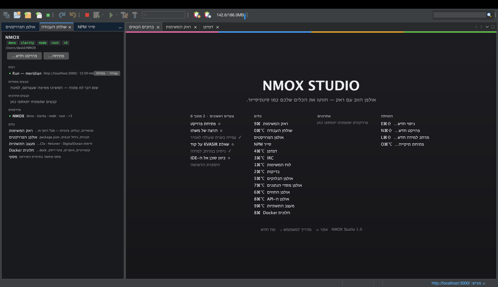
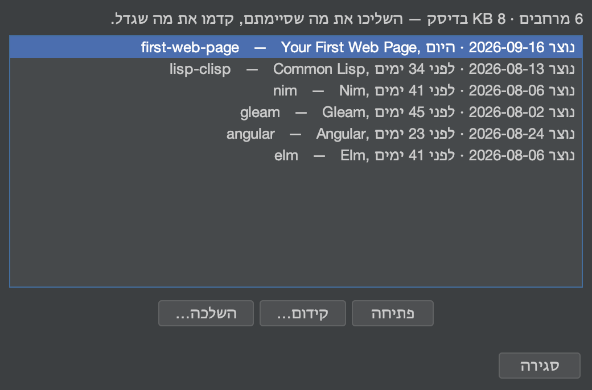
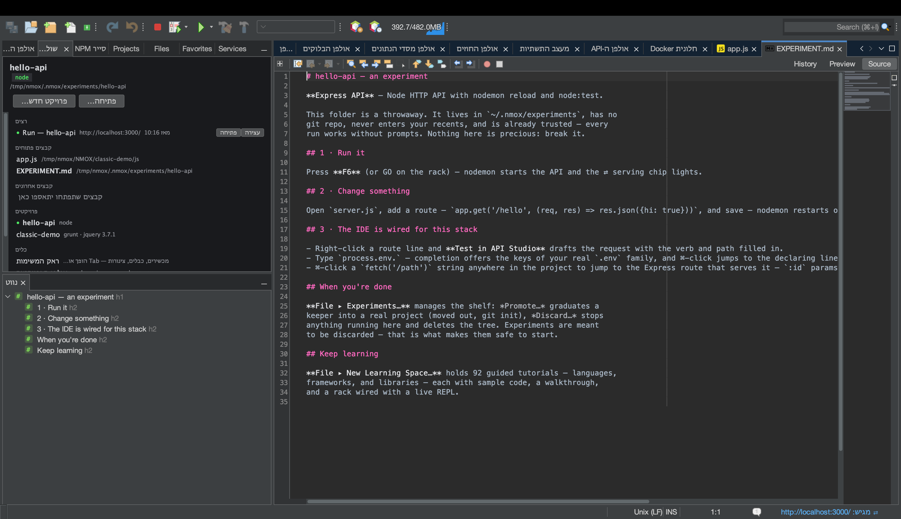
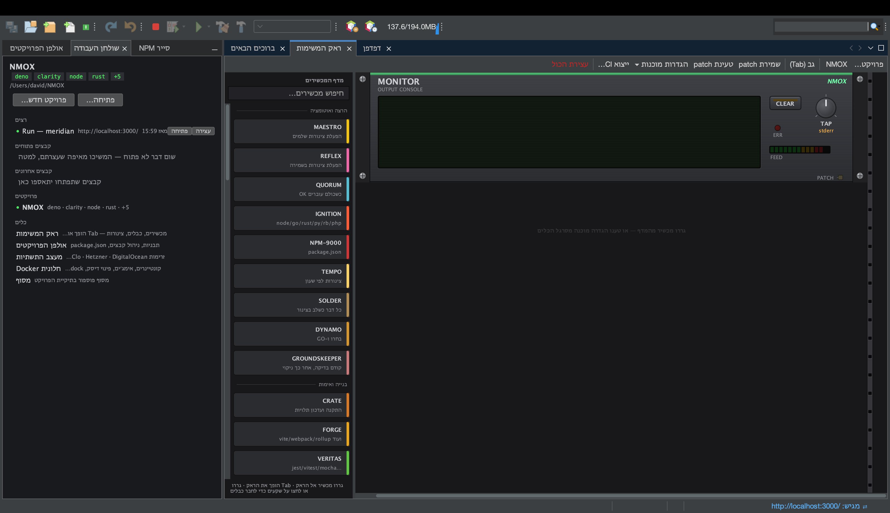
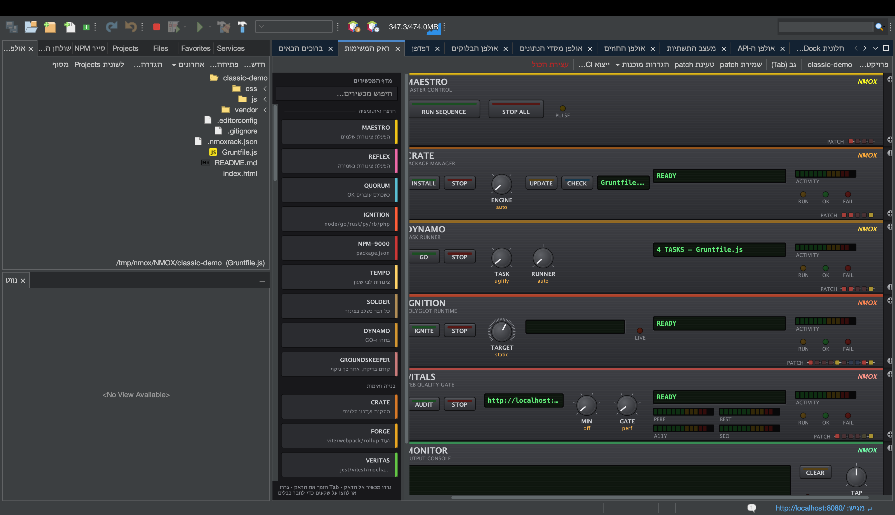
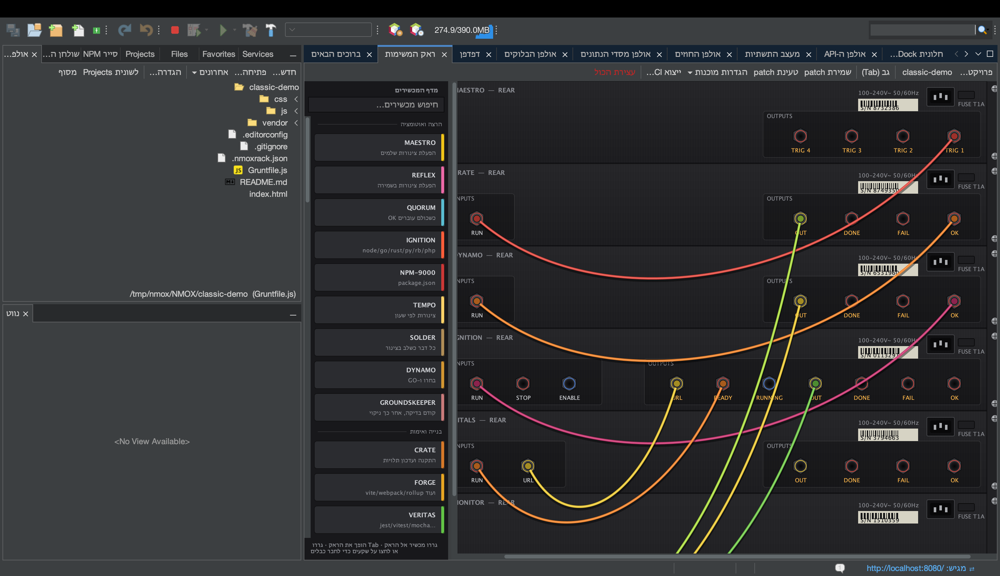
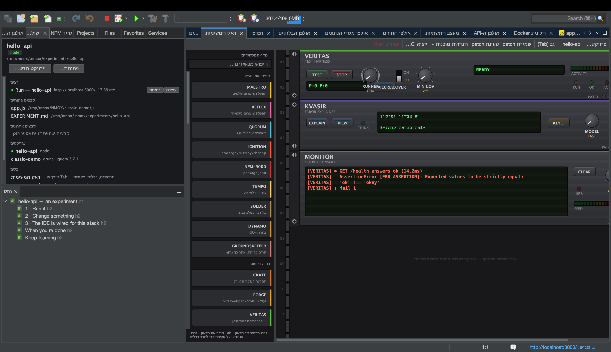
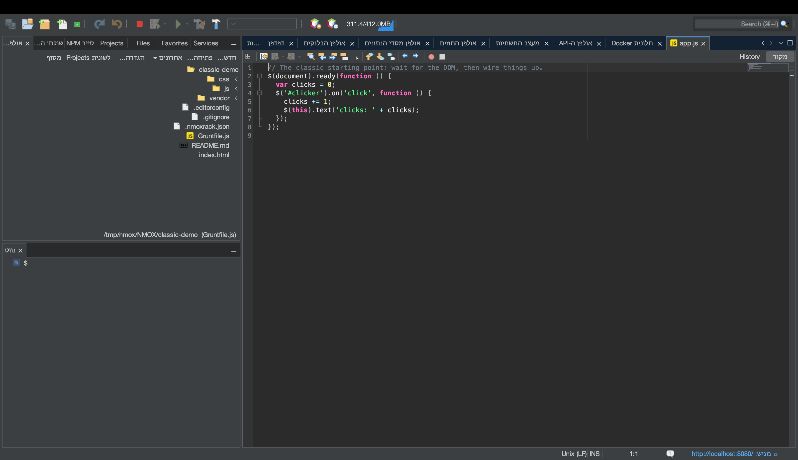

# NMOX Studio — מדריך למשתמש

<!-- languages -->
[English](user-guide.md) · [Español](user-guide.es.md) · [Français](user-guide.fr.md) · [Deutsch](user-guide.de.md) · [Русский](user-guide.ru.md) · [Українська](user-guide.uk.md) · [Polski](user-guide.pl.md) · [Português (Brasil)](user-guide.pt.md) · [Bahasa Indonesia](user-guide.id.md) · [Filipino](user-guide.tl.md) · [Tiếng Việt](user-guide.vi.md) · [简体中文](user-guide.zh.md) · [हिन्दी](user-guide.hi.md) · **עברית** · [العربية](user-guide.ar.md)
<!-- /languages -->

איך משתמשים במוצר בפועל. המדריך עובר על התכונות לפי הסדר שבו תפגשו אותן: התקנה, הפעלה ראשונה, פרויקטים, הראק, האולפנים, האשפים ורשתות הביטחון.

---

<a id="1-install"></a>
## 1. התקנה

**macOS (מומלץ):**
```bash
brew trust --cask nmox/nmox-studio/nmox-studio
brew install nmox/nmox-studio/nmox-studio
```

השורה `brew trust` היא האישור החד־פעמי של Homebrew לכל tap של צד שלישי — בעדכונים לא תישאלו שוב. האפליקציה חתומה ב־Apple Developer ID ועברה notarization אצל Apple, ולכן Gatekeeper מקבל אותה כמות שהיא — ה־cask רק מעתיק אותה ולא עושה בה דבר נוסף. התקנה ידנית מה־DMG עובדת באותו אופן.

**כל השאר:** הורידו קובץ מ[הגרסה האחרונה](https://github.com/NMOX/NMOX-Studio/releases/latest) — `.dmg` ל‑macOS, `-setup.exe` ל‑Windows, `.deb` ל‑Debian/Ubuntu, `.tar.gz` כללי ל‑Linux. כל הארבעה מביאים סביבת ריצה של Java משלהם; אין מה להתקין מראש. `-portable.zip` הוא הארטיפקט היחיד שנשען על Java משלכם (דורש Java 21+ ב‑PATH או הפעלה עם `--jdkhome <נתיב-ל-JDK>`).

> **macOS, הפעלה ראשונה:** לחצו פעמיים. macOS שואל פעם אחת אם לפתוח אפליקציה שהורדה מהאינטרנט, ומציין ש־Apple בדקה אותה: לחצו **פתח** (Open). האפליקציה חתומה ב־Apple Developer ID ועברה notarization, והכרטיס מוצמד גם לאפליקציה וגם ל־DMG, כך שהבדיקה עובדת גם ללא רשת — בלי לחיצה ימנית ובלי `xattr`. המעדכן הפנימי מתקין לתיקיית המשתמש שלכם ולא לחבילת האפליקציה, ולכן עדכון לעולם אינו שובר את החתימה הזו.
>
> אם התקנה של 3.0.0, ‏3.0.1 או 3.0.2 ענתה *"NMOX Studio.app" Not Opened*, זה היה פגם באופן שבו האפליקציה הפעילה את סקריפט המשגר שלה, והוא תוקן ב־3.1.0: התקינו את 3.1.0 או גרסה מאוחרת יותר (`brew upgrade --cask nmox-studio`, או הורדה חדשה).

### אימות ההורדה שלכם

רשות, עשרים שניות, ושתי בדיקות — כי הן עונות על שאלות שונות.

**האם אלה הבתים שפרסמנו?** עובד בכל פלטפורמה ומכסה כל קובץ — `SHA256SUMS` ו־`SHA256SUMS.asc` מצורפים לגרסה:

```bash
curl -sL https://raw.githubusercontent.com/NMOX/NMOX-Studio/main/KEYS | gpg --import
gpg --verify SHA256SUMS.asc SHA256SUMS
sha256sum -c SHA256SUMS --ignore-missing
```

**האם macOS ערב לזה?** שאלה אחרת, שעליה עונה Apple:

```bash
spctl --assess --type execute -vv "/Applications/NMOX Studio.app"
```

אתם רוצים לראות `source=Notarized Developer ID`. מתקיני Windows עדיין אינם חתומים: להורדת Windows הבדיקה שלמעלה היא הדרך.

### עדכון

**כלים ◂ תוספים ◂ עדכונים** (או **עזרה ◂ בדיקת עדכונים**) מציע את המודולים של כל גרסה חדשה יותר, ממרכז העדכונים "NMOX Studio Updates", שמצביע על הגרסה האחרונה ב‑GitHub. התקינו, הפעילו מחדש כשתתבקשו, וזהו. גם הפלטפורמה בודקת בעצמה, פעם בשבוע כברירת מחדל (משנים את זה ב‑**כלים ◂ תוספים ◂ הגדרות**), ובנפרד ה‑IDE מזכיר פעם ביום שיש גרסה חדשה יותר; את זה מכבים ב‑אפשרויות ◂ כללי (ב‑macOS: ‏NMOX Studio ‏◂‏ Settings…, ובמערכות האחרות: כלים ◂ אפשרויות). כל מודול חתום והתעודה מגיעה בתוך המוצר, כך שעדכונים מותקנים בלי בקשות לאישור תעודה.

המעדכן מחליף מודולים, לא את האפליקציה שסביבם. סביבת הריצה של Java המצורפת, המשגר ופלטפורמת NetBeans עצמה משתנים רק כשמתקינים גרסה (`brew upgrade --cask nmox-studio`, או הורדה חדשה), וגרסה שמשנה אחד מהם אומרת זאת בהערות הגרסה שלה — הפקודה `nmox` ותיקוני המשגר ל‑macOS ב‑3.1.0 הם דוגמאות. התקנה ישנה מ‑2.35.0 לא יכולה להתעדכן מתוך האפליקציה בכלל, כי 2.35.0 העבירה את הפלטפורמה: התקינו במקומה גרסה עדכנית.

<a id="2-first-launch"></a>
## 2. הפעלה ראשונה

ממסוף, `nmox .` פותח את התיקייה שבה אתם נמצאים, כמו ש‑`code .` עושה: `cd myproject && nmox .`. התיקייה מקבלת כיוון בדיוק כמו ש"פתיחת תיקייה…" בחלון ברוכים הבאים מכוונת אותה, עם מניפסט או בלעדיו; קובץ נפתח בעורך (`nmox src/app.js`), ובשורה מסוימת אם מציינים אותה כמו ש‑`code -g` עושה (`nmox src/app.js:42` — גם עמודה מתקבלת, והעורך נפתח בתחילת השורה). שם שלא קיים נדחה במסוף (`nmox: typo.js: no such file or folder`) במקום להפעיל משהו. הדגל ‎`-r` של VS Code מתקבל, ו‑‎`-n` פותח בחלון היחיד; ‎`--wait`, ‎`--diff` ושאר הדגלים שקיימים רק ב‑VS Code נדחים בהודעה שמציינת את שמם. הפקודה חוזרת מיד — ה‑`nmox` הראשון מפעיל את ה‑IDE ברקע, וכל `nmox` אחריו מעביר את התיקייה שלו ל‑IDE שכבר רץ. `nmox` לבדו רק מפעיל את ה‑IDE. כך מכניסים את `nmox` ל‑PATH:

- **macOS, ‏Homebrew:** ה‑cask יוצר את הקישור בשבילכם.
- **macOS, מה‑DMG:** צרו קישור (לא עותק) למשגר של האפליקציה —
  `sudo mkdir -p /usr/local/bin && sudo ln -s "/Applications/NMOX Studio.app/Contents/MacOS/nmox-studio" /usr/local/bin/nmox`.
  כשהוא מופעל דרך קישור, הוא יודע שהגיע ממסוף; כשהוא מופעל מ‑Finder או מה‑Dock, הוא מתנהג כמו תמיד.
- **Windows:** תיבת הסימון *הוספת "nmox" ל-PATH* במתקין, מסומנת כברירת מחדל. אחר כך פתחו מסוף חדש; מסוף שכבר פתוח שומר את ה‑PATH הישן שלו.
- **Linux:** ה‑`.deb` מתקין את `/usr/bin/nmox`. מה‑tarball, צרו את הקישור בעצמכם: `ln -s "$PWD/nmox-studio-<version>/bin/nmox" ~/.local/bin/nmox`.

ב‑Linux וב‑Windows אפשר למסור ל‑NMOX Studio תיקייה גם בלי מסוף, והיא מקבלת כיוון באותה דרך:

- **Linux (ה‑`.deb`):** מנהל הקבצים שלכם מציג את NMOX Studio תחת *פתיחה באמצעות* עבור תיקייה. הוא לא הופך לברירת המחדל שלכם לתיקיות; מנהל הקבצים נשאר ברירת המחדל.
- **Windows:** סמנו במתקין את התיבה *הוספת "פתיחה באמצעות NMOX Studio" לתפריט ההקשר של תיקיות בסייר הקבצים* (היא מתחילה לא מסומנת, כמו זו של VS Code). סייר הקבצים מציע אז **פתיחה באמצעות NMOX Studio** על תיקייה ועל השטח הריק שבתוכה; ב‑Windows 11 הפריט נמצא תחת *הצגת אפשרויות נוספות* (Show more options). הסרת ההתקנה מסירה אותו.

ב‑macOS, השתמשו ב‑`nmox .` או ב‑**קובץ ◂ פתיחת תיקייה…**. ה‑*פתח באמצעות* (Open With) של Finder והסמל ב‑Dock עדיין אינם יכולים למסור תיקייה ל‑NMOX Studio, ולכן האפליקציה לא מציעה את עצמה שם.

ה‑IDE נפתח עם שלוש לשוניות באזור העורך: **ברוכים הבאים ← ראק המשימות ← דפדפן**. כל חלון אחר נמצא במרחק קיצור ⌥⌘ אחד ומופיע בעמודה כלים של חלון ברוכים הבאים. במעגן השמאלי: **אולפן הפרויקטים** (עץ קבצים ותבניות), בסיס הבית **שולחן העבודה** ו**סייר NPM**. התיקייה `~/NMOX` נוצרת כסביבת העבודה המוגדרת כברירת מחדל; הראק מכוון אליה עד שתפתחו פרויקט.



קיצורי מקלדת שמשתלמים כבר ביום הראשון (כולם מופיעים גם בלשונית ברוכים הבאים):

| קיצור | פותח |
|---|---|
| **⌘I** | חיפוש מהיר — מגיע לכל דבר |
| **⇧⌘P** | גם חיפוש מהיר — הקיצור ש‑VS Code קורא לו Command Palette |
| **⌘9** | ראק המשימות |
| **⌥⌘0** | שולחן העבודה |
| **⌥⌘1** | לוח המשימות |
| **⌥⌘2** | בדיקות |
| **⌥⌘3** | לקוח צ׳אט IRC |
| **⌥⌘4** | דפדפן (WebKit מובנה, עם DevTools) |
| **⌥⌘5** | אולפן הבלוקים |
| **⌥⌘6** | אולפן החוזים |
| **⌥⌘7** | אולפן מסדי הנתונים |
| **⌥⌘8** | אולפן ה‑API |
| **⌥⌘9** | מעצב התשתיות |
| **⌘8** | חלונית Docker |
| **⌘7** | מתאר של הקובץ הנוכחי |
| **⇧⌘N / ⌥⌘O** | פרויקט חדש… / פתיחת תיקייה… |
| **⌥⌘K / ⇧⌘L** | ניסוי חדש… / מרחב למידה חדש… |
| **⇧⌘E** | אולפן הפרויקטים, עם המיקוד על עץ הקבצים |
| **⇧⌘X** | כלים ◂ תוספים |
| **⌃\`** | מסוף בתיקיית הפרויקט, או זה שכבר פתוח (Ctrl+\` ב‑Windows וב‑Linux) |
| **⌥⌘P / ⌥⇧⌘K** | החלפת פרויקט… / ניסויים… |

מגיעים מ‑VS Code? [מגיעים מ‑VS Code](coming-from-vscode.he.md) ממפה את הקיצורים ואת הרעיונות, עם הכתיב של Windows ושל Linux לצד זה של macOS.

<a id="3-projects"></a>
## 3. פרויקטים

**פתיחה:** כל תיקייה עם אחד מ‑60 המניפסטים המזוהים נפתחת כפרויקט אמיתי — `package.json`, `Cargo.toml`, `go.mod`, `pom.xml`, `composer.json`, `foundry.toml`, `bower.json`, `Gruntfile.js` וקרוביהם — כולל המניפסטים של שרשראות החוזים: מאגר Aiken (`aiken.toml`) או מאגר Clarinet (`Clarinet.toml`) נפתח עם המסלולים האמיתיים והמחוברים שלו. גם תיקייה פשוטה עם HTML ותגיות `<script>` **ובלי** מניפסט נפתחת, כפרויקט STATIC: הווב הקלאסי הוא אזרח מן המניין, לא שגיאה.

**יצירה:** *פרויקט חדש…* מציע שלדים אמיתיים — Angular, ‏Vue, ‏Svelte, ‏JavaScript נקי, Elixir/Phoenix, ‏PHP Web (LEMP) ו‑Classic Web (jQuery). כל אחד מגיע עם תצורות lint, עיצוב קוד ובדיקות מחוברות מראש ועם מאגר Git מאותחל: קומיט שלד יחיד, שכולל גם את קובץ הנעילה כשהאשף מריץ עבורכם את ההתקנה — כך ה‑`git status` הראשון שלכם נקי.

**עץ הקבצים** הוא אולפן הפרויקטים (⇧⌘E). לחיצה ימנית על קובץ או תיקייה מציעה חדש, גזירה, העתקה, הדבקה, מחיקה ושינוי שם, וגם — כמו ב‑Explorer של VS Code — **העתקת נתיב**, **העתקת נתיב יחסי** (יחסית לפרויקט) ו**הצגה ב-Finder** (**הצגה בסייר הקבצים** ב‑Windows, **פתיחת התיקייה המכילה** ב‑Linux).

**מעבר בין פרויקטים הוא בטוח:** אם מכשירים רצים (שרת פיתוח, עוקב שינויים), ה‑IDE שואל לפני המעבר ומכבה אותם בצורה מסודרת. שום דבר לא ממשיך לרוץ מאחורי הגב שלכם, אף פעם. אפילו סגירה כפויה של ה‑IDE לא יכולה להשאיר תהליך יתום.

**ניסויים** הם הדרך המהירה ביותר לנסות stack. **קובץ ◂ ניסוי חדש…** (⌥⌘K) בוחר תבנית ויוצר פרויקט חד־פעמי תחת `~/.nmox/experiments`: בלי Git, בלי רשומות בפריטים האחרונים, כבר מהימן, התלויות מותקנות — כדי ש**ההרצה הראשונה פשוט תעבוד**. הוא נפתח עם סיור `EXPERIMENT.md` משלו, שאומר על מה ללחוץ, איזה קובץ לשנות ואיפה נמצאת האינטליגנציה של ה‑IDE עבור ה‑stack הזה. שמרו את מה שהופך למשהו: **קובץ ◂ ניסויים…** ◂ **קידום…** מוציא אותו החוצה ומאתחל מאגר Git, **שכפול** מניח לצידו עותק לגישה שנייה, **השלכה…** מפנה את השאר. המדף מציג את הגיל של כל פריט ואת עלות האחסון הנמדדת שלו. מעדיפים ליווי? הדיאלוג מציג בראשו את 93 מרחבי הלמידה.





**הרצה, בנייה, בדיקה — ועצירה:** ה‑▶ בסרגל הכלים (F6) מריץ את הפרויקט כפי שה‑toolchain שלו מריץ אותו: הסקריפט `dev`, ‏`start` או `serve` מ‑package.json (הראשון מהם שקיים בו), `cargo run`, `go run`, `dotnet run`, ועבור תיקייה עם HTML — שרת סטטי קטן על הפורט הפנוי הראשון החל מ‑8080. פרויקט Node שאין בו אף אחד משלושת הסקריפטים האלה אומר זאת כשלוחצים על ▶, ומציג את הסקריפטים שלו בסייר NPM, שם לחיצה כפולה מריצה אחד מהם. בנייה, בדיקה וניקוי נמצאים לידו ובתפריט הרצה. שרת פיתוח שמכריז על הכתובת שלו מדליק את הסימן ⇄ בשורת המצב ופותח את הדף בדפדפן המובנה. בפעם הראשונה הכול רץ מאחורי בקשת האמון בסביבת העבודה. הפעלה שלא יכלה להצליח אומרת זאת ומציעה לפתוח את אבחון הסביבה. לעצירה: ה‑■ שליד כפתור הניפוי (⌥⌘.) עוצר בבת אחת כל פקודה שרצה ואומר מה עצר; **הרצה ◂ עצירת בנייה/הרצה** עוצר פקודה אחת ומציע אחר כך **Repeat**. ה‑■ רואה כל מה שהמוצר מפעיל עבורכם, כולל התקנות; במעבר העכבר, הרמז אומר בדיוק מה לחיצה תעצור ומאז מתי כל אחד מהם רץ.

**`.env` בכל מקום:** אם בפרויקט שלכם יש `.env`, המכשירים שמופעלים מהראק מקבלים את המשתנים האלה. כשעורכים אותו, שורת המצב מציינת שהפעלות מחדש יקלטו את השינוי — תהליכים שכבר רצים שומרים, ביושר, על הסביבה הישנה שלהם.

<a id="4-the-task-rack"></a>
## 4. ראק המשימות



הראק הוא לב המוצר. כל כלי בתהליך העבודה שלכם — npm, ה‑bundler, מריץ הבדיקות, שרת הפיתוח, ה‑linter, git, הפריסה — הוא מכשיר בראק: חוגות בוחרות את המשימה, GO מריץ אותה, נוריות מראות את המצב, וצג אומר לכם במילים מה קרה.



**היסודות:**

- **הוספת מכשירים** בגרירה מהמדף (יש בו קטגוריות ומסנן חיפוש). כל מכשיר מגיע עם כרטיס *איך משתמשים* משלו.
- **הרצה של משהו** בלחיצה על כפתור ה‑GO של מכשיר. רחפו מעליו קודם: הרמז מציג את שורת הפקודה המדויקת שתרוץ. בלי קסמים.
- **חיווט שרשרת:** לחצו **Tab** כדי להפוך את הראק לצדו האחורי. גררו כבל משקע ה‑**OK** של מכשיר אחד אל שקע ה‑**GO** של המכשיר הבא. עכשיו `install → build → test` היא הקשה אחת: השרשרת רצה מעצמה ונעצרת בכישלון הראשון. הפלט רץ על מסך הזרחן של מכשיר ה‑MONITOR.
- **ביטול כל שינוי מבני** עם **⌘Z** — הוספה, הסרה, חיווט מחדש. הסרת מכשיר שרץ עוצרת קודם את התהליך שלו.
- **הגדרות מוכנות** נותנות בלחיצה אחת ראק שלם ומחווט — שער השילוח, מודיעין פיתוח, מסלולי מונוריפו, לולאת E2E, ספסל LAMP, ספסל Web3, משמר זמינות. **שמירת patch** כותבת את הראק לצד הפרויקט בשם `.nmoxrack.json`; כשמכוונים שוב אל אותו פרויקט, הוא נטען. שום דבר לא נשמר עד שלוחצים עליה.



**תיאום, כשהשרשרת גדלה:**

- **QUORUM** מאחד מסלולים: הוא מופעל רק כש*כל* הכניסות המחווטות אליו הצליחו — ה"לחכות ל‑lint וגם לבדיקות וגם לבדיקת טיפוסים" הקלאסי.
- **שערי ENABLE** על תהליכים ארוכים: כניסת ה‑ENABLE של שרת פיתוח פירושה "לא להתחיל לפני שזה מופעל".
- **REFLEX** צופה בקבצים ומנתב לפי תבנית — `src/**/*.css` לשרשרת אחת, `**/*.ts` לאחרת, לכל מסלול במונוריפו.
- **ROSETTA** בוחר את מסלול הכלים במאגרים מעורבים (הראק מזהה Node/Rust/Go/PHP/… לכל תיקייה ומכוון כל מכשיר בהתאם).

**מסלולים שמדברים את שרשרת הכלים שלכם.** במצב AUTO, מכשירי ה‑lint והעיצוב (PURITY, GLOSS) מדברים את שרשרת הכלים של הפרויקט עצמו, במקום לפנות לכלי Node בכל מקום: סביבת עבודה של Deno משתמשת ב‑`deno lint` וב‑`deno fmt`, פרויקט Cargo ב‑`cargo clippy` וב‑`cargo fmt`, מודול Go ב‑`go vet` (או ב‑`golangci-lint`, אם הפרויקט מביא איתו את התצורה שלו) וב‑`gofmt`. קובץ `biome.json` מעביר את מסלולי ה‑Node ל‑Biome, ומיקום חוגה מפורש תמיד גובר על AUTO.

**המכשירים שלכם.** המדף מתרחב בעזרת עורך טקסט: כל `*.json` בתיקייה `~/.nmox/devices.d/` הופך למכשיר אמיתי — חוגות, כפתורים, נוריות, יציאות וכבלים, נשמר בחיווט ונגיש דרך ⌘I. הצהירו על פקודה כרשימת ארגומנטים, תנו שם לחוגה, ו‑`{{knob}}` מוחלף בערך שלה בלחיצה על הכפתור. החוקים נשארים אצל המארח, לא בקובץ שלכם: **אמון בסביבת העבודה שומר על ההפעלה הראשונה בדיוק כמו במכשיר מובנה**.

**שערי איכות** הופכים "נראה גמור" ל"גמור באמת":

- **VITALS** מריץ את Lighthouse מול השרת שרץ אצלכם ודורש רצפה לביצועים, לנגישות, לשיטות עבודה מומלצות או ל‑SEO.
- **VERITAS** אוכף רצפת כיסוי ומריץ שוב בדיוק את הבדיקות שנכשלו, לפי שמן.
- **GAUNTLET** מעמיס על נקודת קצה ודורש תפוקה מינימלית. **PRISM** שומר על גודל החבילה, **BEACON** על התעודה והזמינות של כתובת URL, ו‑**PREFLIGHT** הוא רשימת הבדיקות לפני שילוח — חווטו את ה‑OK שלו אל מכשיר הפריסה שלכם, ופריסה פשוט לא יכולה לרוץ כל עוד לא הכול ירוק.
- **GOVERNOR** שומר מפני נסיגות בצריכת הגז בעבודה עם Solidity ‏(`.gas-snapshot`).

**כל השאר:** **SOLDER** עוטף כל פקודת shell כמכשיר מלא — והראק כולו **מיוצא ל‑GitHub Actions** (השרשרת המקומית שלכם וה‑CI שלכם הם אותו חיווט). **HELM** מריץ פקודות דרך ssh על שרת מרוחק, **TAIL** עוקב אחרי כל קובץ יומן, ו‑**PHOSPHOR** הוא מסוף בתוך הראק. כשהפקודה מדפיסה כתובת מקומית, סימן ה‑⇄ נדלק כמו בכל מכשיר מגיש, וכבה כשההרצה מסתיימת.

**הראק שומר על עצמו מסונכרן.** שנו את `package.json`, וחוגת הסקריפטים של NPM-9000 מתעדכנת במקום. שנו `Gruntfile`, ו‑DYNAMO קורא מחדש את המשימות שלו. הוסיפו תלות, והתצוגה של CRATE מתרעננת. בלי כיוון מחדש, בלי כפתורי רענון.

### KVASIR — מסביר את הכישלון האחרון



**KVASIR** הוא עזרת AI בדרך של הראק: מכשיר שמסביר את השגיאה שנמצאת כרגע על אפיק ה‑MONITOR — לא סרגל צד של צ׳אט. כשהרצה נכשלת, לחצו **EXPLAIN**, ו‑KVASIR שואל את ה‑AI שלכם מה השתבש ומה הצעד הבא הקונקרטי. פסק דין קצר מופיע על הצג; **VIEW** פותח את התשובה המלאה. **MODEL** בוחר בין **FAST** (מהיר וזול, ברירת המחדל) לבין **DEEP** (חזק יותר). EXPLAIN כחול: הוא קורא ושואל, ולעולם לא נוגע בפרויקט שלכם.

התשובה של KVASIR מגיעה בשפה שנבחרה ב־NMOX Studio.

**בחרו את ה‑AI שלכם, שמרו את המפתח שלכם.** KVASIR עובד עם **Claude (Anthropic)**, **ChatGPT (OpenAI)** או **Gemini (Google)** — המפתח שלכם, הבחירה שלכם. לחצו **KEY…** כדי לבחור ספק ולהדביק את המפתח שלו; הבחירה נשמרת, והמפתח נשמר אך ורק במחזיק המפתחות של המערכת. גם משתני הסביבה המקובלים של כל ספק נקראים, ומפתח שמור גובר על מפתח מהסביבה.

**מה KVASIR שולח, וכל מה שהוא שולח.** בלחיצה הראשונה על EXPLAIN, תיבת דו‑שיח מפרטת בדיוק מה יוצא מהמחשב שלכם ומה לא; בלי ההסכמה הזו לא נשלח דבר, וההסכמה נפרדת לכל ספק. אחרי EXPLAIN מוצלח, **VIEW** פותח את התשובה כשיחה — אפשר להמשיך לשאול על אותו כישלון.

**שאלו את KVASIR על הקוד שלכם.** אותו עוזר מגיע גם לעורך: סמנו קוד ובחרו **שאלת KVASIR על הבחירה…**, או **עריכה עם KVASIR…** כדי לומר מה צריך להשתנות ולראות לפני ואחרי עוד לפני שמשהו מוחל. **⌥⌘G** משלים במיקום הסמן כטקסט רפאים שנכנס רק עם Tab, וסימן ענף ה‑git יכול לנסח את הודעת ה‑commit שלכם.

**כוונו סוכן אל ה‑IDE שלכם.** כלים ‏◂‏ Agent Port ‏(MCP)… פותח נקודת גישה של MCP שעוזר חיצוני יכול לתשאל: **לקריאה בלבד מעצם התכנון**, כבוי עד שתפעילו אותו, מאזין רק על ממשק ה‑loopback ודורש את האסימון שנוצר בהפעלה.

הראק ניתן להרחבה: הרחבות של צד שלישי יכולות להוסיף מכשירים (התקינו את קובץ ה‑NBM שלהן דרך כלים ◂ תוספים). כדי לכתוב הרחבה בעצמכם, ראו [device-spi.md](device-spi.md).

<a id="5-the-editor"></a>
## 5. העורך



יותר מ‑70 שפות נצבעות כמו שצריך — הערימה המודרנית, הקלאסית (כולל CoffeeScript) וכל שכבת התצורה, עד `.env`, `.editorconfig`, תצורות nginx ו‑Apache, קובצי Dockerfile וקובצי נעילה.

- **ההשלמה האוטומטית** מבינה הקשר, וגם *את הספריות הקלאסיות*: אם הפרויקט שלכם כולל jQuery, MooTools, Prototype, Backbone/Underscore או Knockout (דרך תלויות npm *או* תגי `<script>` פשוטים), ממשקי ה‑API שלהן מופיעים בהשלמה. פרויקטים עם jQuery 1.x או 2.x מקבלים הודעה כנה על סוף החיים, לא נזיפה.
- **מתאר הנווט (⌘7)** מציג את מבנה הקובץ ל‑58 סוגי קבצים; לחיצה קופצת לשם.
- **המפה המוקטנת** — קווי המתאר של הקובץ כולו לצד פס הגלילה של כל עורך; לחיצה או גרירה מזיזות את התצוגה. המסמך כולו תמיד נכנס ברצועה: השורות מתכווצות ככל שהקובץ גדל. **תצוגה ◂ מפה מוקטנת** מפעילה ומכבה אותה בכל העורכים הפתוחים בבת אחת.
- **הגלילה הדביקה** — ההצהרות שעוטפות את ראש התצוגה (המחלקה, ואז המתודה שגללתם לתוכה) נשארות מוצמדות מעל הטקסט, עד שלוש שורות של קוד המקור עצמו; לחיצה קופצת לשם. הפס נעלם כששום דבר אינו עוטף את השורה העליונה הנראית.
- **מעבר לסמל (⌥⇧⌘O)** קופץ לכל פונקציה, מחלקה, כלל או כותרת בפרויקט כולו כשמקלידים את השם — עם התאמות לפי תחילית, לפי אותיות רישיות פנימיות (camelCase) או לפי תו כללי. האינדקס מוגבל וכן: `node_modules` מדולגת, ובפרויקט גדול מאוד תיבת הדו‑שיח אומרת שהיא סרקה את 2,000 הקבצים הראשונים, במקום להעמיד פנים שקראה הכול.
- **חלון הבדיקות (⌥⌘2)** מציג כל בדיקה בפרויקט *לפני שמשהו רץ*, ומריץ בדיקה אחת, קובץ אחד או את כולן.
- **LSP**: פתחו קובץ ששרת השפה שלו מותקן (typescript, gopls, rust-analyzer, pyright…) ותקבלו אבחונים, מידע במעבר העכבר ומעבר להגדרה. השגיאות והאזהרות של השרת הן גם שורות ב‑**פריטי פעולה** (⌘6), על שם השרת (`[lsp:gopls]`), לכל קובץ שהשרת דיווח עליו. חלק מהשרתים מדווחים רק על הקבצים הפתוחים אצלכם; gopls מדווח על כל החבילה. חסר שרת? ה‑IDE מציע את פקודת ההתקנה במקום להיכשל בשקט.

  

- **הקובץ `.editorconfig` מכובד** — בזמן ההקלדה ובשמירה. `indent_style`, ‏`indent_size` ו‑`tab_width` קובעים מה Tab, ‏Enter והזחה מחדש כותבים, כך שפרויקט של טאבים מקבל טאבים ופרויקט של ארבעה רווחים מקבל ארבעה רווחים, לכל קובץ ולכל מקטע glob; כל שמירה מחילה את `trim_trailing_whitespace` ואת `insert_final_newline`. שינוי ב‑`.editorconfig` מגיע לעורכים הפתוחים תוך שנייה או שתיים. תו טאב שכבר נמצא בקובץ עדיין מצויר ברוחב הטאב שנקבע באפשרויות, ו‑`charset` ו‑`end_of_line` אינם מוחלים. מכשירי העיצוב שלכם (GLOSS וחבריו) מטפלים בשאר.
- **גם הקובץ ‎`.vscode/settings.json` של מאגר מכובד באותה דרך**: `editor.tabSize`, ‏`editor.insertSpaces` ו‑`editor.indentSize` קובעים את ההזחה, `files.trimTrailingWhitespace` ו‑`files.insertFinalNewline` (כשהם `true`) חלים בשמירה, ובלוק של שפה כמו `"[typescript]": {…}` גובר עליהם בשפה שלו. כשיש בפרויקט גם ‎`.editorconfig`, ה‑‎`.editorconfig` גובר בכל מקום ששניהם אומרים משהו. ל‑`editor.detectIndentation` של VS Code, שנותן להזחה של הקובץ עצמו לגבור, אין כאן מקבילה.

### הרחבת קיצור (⌥⌘E)

הקלידו קיצור Emmet ולחצו **⌥⌘E**: `ul>li*3` הופך לרשימה המוכנה. זה עובד ב‑HTML ובתבניות Angular, ובגרסת ה‑CSS שלו גם בבלוקים של `<style>` ובמאפייני `style`, שם הקטע נשאר תחום לאזור ולכן לעולם לא בולע את ה‑markup שמסביב. קיצור שהמוצר אינו מכיר נדחה, והטקסט שלכם נשאר כמו שהוא.

### אסימוני עיצוב (מאפיינים מותאמים אישית)

הקלדת `var(` מציעה את האסימונים שמוצהרים בגיליונות הסגנונות האמיתיים של הפרויקט — כל אחד עם דוגמית הצבע שלו ועם המקום שבו הוא מוצהר. **⌘-לחיצה** על שימוש ב‑`var(--token)` קופצת להצהרה שלו. צבעים נצבעים כצבע שהם — hex, `rgb()`, `hsl()`, שמות, וגם `oklch()`, `lab()` ו‑`color-mix()` — ו‑**⌘-לחיצה** על ליטרל צבע פותחת בורר שמחליף אותו בדיוק בצורה שבה כתבתם אותו.

### מאפיין ה‑class מכיר את גיליונות הסגנונות שלכם

הקלדה בתוך `class="…"` מציעה את המחלקות שהפרויקט שלכם באמת מגדיר, יחד עם גיליון הסגנונות שממנו הן באות; **⌘-לחיצה** על מחלקה קופצת לכלל שלה, ו‑**⌘-לחיצה** על סלקטור `.class` קופצת לשימוש הראשון שלה ב‑markup. **שינוי שם מחלקה…** משנה את השם בכל הפרויקט — רק מזהים שלמים, עם הספירה לכל קובץ — ומסרב בקול אם השם החדש כבר תפוס או אם יש שינויים שלא נשמרו.

### הרצת סקריפט, ממיקום הסמן

בקטע `scripts` של `package.json`, **הרצת סקריפט** מריצה את השורה שבה נמצא הסמן — דרך אותו אמון בסביבת העבודה ואותו ■ כמו כל הרצה אחרת.

### מפתחות סביבה, באופן מלא

הקלדת `process.env.` או `import.meta.env.` מציעה את המפתחות שמשפחת קובצי ה‑`.env` שלכם באמת מצהירה עליהם, ו‑**⌘-לחיצה** קופצת לשורה שמצהירה על המפתח. הערכים מוצגים מקוצרים: התזכורת שם, הסוד לא.

### תרגומים בפרויקט שלכם

קטלוגי התרגום של פרויקט אינטרנט הם נתונים שהעורך קורא, כמו גלי העיצוב שלכם וה־`.env` שלכם. **כלים ◂ בדיקת תרגומים…** מוצא את הקטלוגים (i18next, vue-i18n, svelte-i18n, ה־XLIFF של Angular, Lingui, Paraglide, react-intl או זה של I18n Kit), בוחר את שפת המקור ומדווח על שלושה דברים — כקווים גליים וכשורות במשימות: **חסר** (צורות רבים והקשר מושוות לפי מפתח הבסיס), **זהה למקור** (הועתק ולא תורגם), ו**אי־התאמה של מחזיקי מקום** — זו השגיאה, כי תרגום שקבוצת ה־`{{name}}` או ה־`%s` שלו שונה מהמקור פשוט שבור. ממצא רביעי, **לא בשימוש**, מופיע רק במפקד מלא.

### תבניות Angular, באופן מלא

קובצי `.component.html` נפתחים עם צביעת תבניות משלהם, ועם בלוקים של `@if`/`@for` והנחיות מבניות בהשלמה. התקינו את Angular Language Service, ובדיקת הטיפוסים של התבניות באמת מגיעה: טעות בשם מאפיין, והקומפיילר של Angular עצמו מציע את השם הנכון. **⌘B** בתבנית קופץ להצהרה, ותפריט ההקשר עובר בין הרכיב, התבנית שלו, הסגנונות שלו והבדיקה שלו.

### רכיבי Vue ו‑Svelte, באופן מלא

קובצי `.vue` ו‑`.svelte` נפתחים עם צביעה משלהם, השלמה משלהם (כולל ה‑runes עם הנקודה של Svelte 5) ו‑Emmet בבלוקי התבנית שלהם. האבחונים של Vue באמת מגיעים לעורך, דרך שרת השפה של Vue עצמו.

### ניפוי שגיאות עם נקודות עצירה אמיתיות

לחצו בשוליים, בחרו **ניפוי הקובץ (נקודות עצירה)**, והתוכנית עוצרת שם — עם מחסנית קריאות, משתנים והערכת ביטויים. JavaScript ו‑TypeScript עובדים מהקופסה דרך המתאם המצורף; Python משתמש ב‑debugpy ו‑Go ב‑delve, שאותם מתקינים בעצמכם. **ניפוי ב‑Chrome (נקודות עצירה)** עושה את אותו הדבר לדף: נקודות העצירה בקוד המקור שלכם עוצרות ב‑IDE, בזמן שהדפדפן רץ עם פרופיל חד־פעמי. הכול עובר קודם דרך אמון בסביבת העבודה. למאגר שיש בו `.vscode/launch.json` יש דלת נוספת: הקלידו שם של תצורה בחיפוש המהיר, ו‑Enter מפעיל את ה‑`program` של תצורת Node או Python בתוך ה‑`cwd` שלה, עם ה‑`args` וה‑`env` שלה, או פותח את ה‑`url` של תצורת Chrome עם ה‑`webRoot` שלה; תצורה שמגדירה `envFile`, ‏`runtimeExecutable` או כל דבר אחר שמנגנון הניפוי לא יכול להעביר נדחית בשמה בשורת המצב, במקום להתחיל בלעדיו.

### ניפוי שגיאות בדפדפן

JavaScript של הדפדפן מנופה באותה דרך: לחיצה ימנית על קובץ `.html`, `.js` או `.ts` → **ניפוי ב‑Chrome (נקודות עצירה)**. נקודות עצירה שהוצבו בעורך עוצרות את הקוד שרץ *בדפדפן*, עם אותה מחסנית ואותם משתנים. הדפדפן הולך למקור החי ביותר: אם התקן כבר מכריז על כתובת לפרויקט, זה הדף שייפתח; אחרת `.html` נפתח מהדיסק. לסקריפט בודד בלי שרת אין דף — שורת המצב אומרת זאת במקום לנחש. Chrome עולה בפרופיל חד־פעמי, והפרופיל שלכם נשאר שלם. גם **Web Workers** מנופים: כל `new Worker(…)` הופך להפעלה נפרדת.

### הצגה ושיתוף

**תצוגה ◂ מצב הצגה** מגדיל בבת אחת כל עורך, את הדף בדפדפן המובנה, את חלון Output ואת המסוף — ומשחזר הכול בדיוק ביציאה. **תצוגה ◂ הצגת הקשות** מציג בגדול את צירוף המקשים שנלחץ זה עתה, אבל לעולם לא את מה שאתם מקלידים. **עריכה ◂ העתקה כ‑Markdown** מעתיקה את הבחירה כבלוק מגודר עם תג השפה הנכון, והגרסה **העתקה כ‑Markdown עם קישור** מוסיפה את הקישור ל‑GitHub לאותן שורות. **כלים ◂ שמירת צילום מסך…** מצייר את כל החלון בגודל כפול, עם גרסאות ללשונית העורך לבדה, ללוח הגזירים ולעץ הפרויקט כ‑Markdown.

<a id="6-the-studios"></a>
## 6. האולפנים

### גישה במקלדת ובקורא מסך

לכל פקד בראק יש שם נגיש, וזה נבדק בכל בנייה. כפתורי הסיבוב הם מחוונים שמגיבים למקשי החיצים, ל‑Home ול‑End; הלחצנים מגיבים לרווח ול‑Enter, גם המעומעמים שבהם, שאומרים למה הם מסרבים; נוריות LED ותצוגות מדווחות על מצבן. Tab הופך את הראק — אלא אם המיקוד נמצא על פקד, ואז הוא מפנה את מקומו למעבר הרגיל בין הפקדים.

### Git, בשורת המצב

השבב **⎇ ענף** מראה באיזה ענף אתם ובכמה קבצים יש שינויים; הוא נקרא מהדיסק ולכן אינו עולה אף תהליך. לחיצה פותחת את ההיסטוריה המלאה, והתפריט כולל את **השוואת הפרויקט**, את **ייחוס שורות**, את **בקשות משיכה…** דרך ה‑`gh` שלכם ואת **ניסוח הודעת commit עם KVASIR…**.

### לוח המשימות (⌥⌘1)

קנבן לכל פרויקט, שנשמר ב‑`.nmoxtasks.json` לצד הקוד ומנוהל איתו בגרסאות. גררו כרטיסים או הזיזו אותם במקלדת: **⌘↑/⌘↓** משנה את הסדר, והכרטיס שהוזז שומר על המיקוד. מגבלות העבודה בתהליך הן עצה, לא מחסום: הכותרת הופכת לאדומה, ושום דבר לא עוצר אתכם. הלחצן **סקירה** מחליף את העמודות בתמונת מצב — עבודה בתהליך, מה הושלם היום והשבוע, זרימה לפי יום, כרטיסים מתיישנים — והשעון (**הפעלת שעון**) מודד את הזמן האמיתי לכל כרטיס, עם שעון רץ אחד בלבד בכל הלוח. **סטנדאפ** הופך את כל זה לדוח שאפשר להדביק.

### אולפן הבלוקים (⌥⌘5)

הרכיבו Web Components אמיתיים מחלקים מוקלדים שמשתלבים זה בזה, בסגנון Scratch: קינון לא חוקי נדחה, הקוד נוצר כ‑Custom Element עצמאי, ולחיצה על חלק מדגישה את השורות שלו. שרת תצוגה מקדימה בזיכרון מציג את הרכיב באמת, מורכב יחד עם שאר הרכיבים התקינים בספרייה שלכם. המסלול הלוך ושוב מדויק: יצירה מחדש של מה שנקרא זה עתה מפיקה את אותו קובץ, בייט אחר בייט.

### אולפן ה‑API (⌥⌘8)

אוספים, בקשות, סביבות עם `{{variables}}` ובדיקות, שנשמרים ב‑`.nmoxapi.json` — הסודות נמצאים רק במחזיק המפתחות, אף פעם לא בקובץ הזה. כל תגובה מקבלת ציון אבטחה לפי הכותרות שלה. ייבוא מ‑curl, מ‑`.http`, מ‑OpenAPI, מ‑Postman, מ‑Insomnia ומ‑HAR; ייצוא כ‑`.http` והעתקה כ‑curl או כ‑`fetch`, עם משתנים שכבר נפתרו.

### אולפן מסדי הנתונים (⌥⌘7)

SQLite, PostgreSQL, MySQL, MariaDB, MongoDB ו‑CouchDB, עם מנהלי התקן מצורפים וסיסמאות שנשמרות רק במחזיק המפתחות. הקונסולה מכירה את המנוע, לכל הוראה יש טבלת תוצאות משלה, ואפשר לערוך שורות ישירות בטבלה כשיש מפתח ראשי — עם תצוגה מקדימה של פקודות ה‑UPDATE המדויקות לפני ההחלה, וסיבה כנה כשמשהו זמין לקריאה בלבד. ייצוא ל‑CSV או ל‑JSON, עם נוסחאות מנוטרלות.

### אולפן החוזים (⌥⌘6)

עץ התוצרים של Foundry ושל Hardhat, **אינטראקציה** מונחית ABI עם ערכי החזרה ו‑revert מפוענחים, תצוגת **מעקב** אחר בלוקים ואירועים, ו‑**פיקוח** עם טבלת הגז, קביעות הגודל לפי EIP-170 ופנקס הכתובות. **אף פעם לא מפתחות פרטיים**: שליחות עוברות דרך החשבונות הפתוחים של רשת מקומית, וכתובות URL סודיות נשמרות במחזיק המפתחות.

### מעצב התשתיות (⌥⌘9)

משטח עבודה עבור DigitalOcean, Hetzner ו‑Cloudflare: סנכרנו את מה שקיים באמת, רעננו כדי לראות סטיות, והשמידו מחסנית כשהעלות שלה מול העיניים. חיבורים לא חוקיים נדחים בקול ואומרים למה, וכל עוד פעולת ענן רצה, המשטח ננעל עם פס שאומר בדיוק את זה.

### IRC (⌥⌘3)

לקוח מלא בתוך ה‑IDE: TLS עם אימות שם אמיתי, SASL, הרחבות IRCv3, השלמה ב‑Tab, הדגשות, כתובות URL שנפתחות בדפדפן המובנה, תיעוד השיחות לדיסק, מסננים משלכם ורשימת ערוצים שמסננים תוך כדי הקלדה.

### האתר המצורף

**עזרה ◂ אתר NMOX Studio (מקומי)** מגיש את אתר המוצר מתוך המוצר עצמו, בממשק המקומי. הוא מדבר את חמש־עשרה השפות שה‑IDE מדבר; בורר השפה נמצא בתחתית הדף.

### דפדפן (⌥⌘4)

דפדפן אמיתי בתוך ה‑IDE, עם כלי פיתוח משלו — קונסולה, DOM, רשת, אחסון ותצוגות ל‑Vue, ל‑Svelte ול‑Angular — כי המנוע לא מגיע עם כלי בדיקה, והכלי הזה הוא שלנו. הוא מכיר את קובצי המקור שלכם: בחרו רכיב, פתחו את השורה שיצרה אותו, עצבו אותו מחדש במקום, וההצהרה נוחתת בגיליון הסגנון שבמקור. שמירת קובץ טוענת את הדף מחדש, וגדלי מכשירים אמיתיים עוזרים לבחון את הפריסה הרספונסיבית שלכם.

<a id="7-docker"></a>
## 7. Docker

חלונית Docker היא מרכז בקרה: מצב המנוע, קונטיינרים, אימג׳ים, volumes ורשתות, עם הפעלה, עצירה, יומנים וניקוי. הכלי HARBOR בראק מראה את אותו הדבר במבט אחד. וכפי שכבר נאמר: הפעילו קונטיינר של Postgres, MySQL או Mongo, ואולפן מסדי הנתונים יציע לכם חיבור מוכן.

הלשונית **Dockerize** יוצרת `Dockerfile` מוכן לייצור, קובץ `.dockerignore` וקובץ Compose, מותאמים לשרשרת הכלים של הפרויקט שלכם — Node, ‏PHP-FPM עם nginx ועוד.

<a id="8-wizards-and-kits"></a>
## 8. אשפים וערכות

כולם נמצאים תחת *קובץ חדש…* ובתפריט ההקשר של הפרויקט, וכולם **אידמפוטנטיים ולעולם אינם דורסים**: הרצה שנייה מעדכנת את מה ששייך לה ומשאירה את השינויים שלכם בשקט; מה שאסור לה לדרוס נוחת לידו כקובץ `.suggested`.

### ערכת תקנים

`robots.txt`, `sitemap.xml`, מניפסט הרשת, `security.txt` לפי RFC 9116 ו‑`humans.txt`, שנוצרים מהתשובות שלכם.

### ערכת PWA

סט מלא של סמלים שנוצקים מתמונה אחת, כולל גרסאות maskable; Service Worker קריא — app shell או רשת תחילה, לבחירתכם —, דף לא מקוון והחיווט ב‑`index.html` שמחבר את הכול יחד.

### ערכת נגישות

נגישות כנקודת פתיחה, לא כבדיקה בדיעבד: `a11y.css` (טבעת מיקוד גלויה, כלי עזר לטקסט שרק קוראי מסך קוראים, סגנונות לקישור הדילוג ובלוק לכל מי שמעדיפים פחות תנועה), `A11Y-NOTES.md` עם מסלול המקלדת והשאלות שאף אוטומציה אינה עונה עליהן, והחיווט האידמפוטנטי ב‑`index.html` — שפה, קישור דילוג, גיליון סגנון. viewport שאוסר הגדלה מדווח, ולעולם אינו משוכתב; מה שהערכה אינה יכולה לתקן היא אומרת, במקום לגעת בו.

### ערכת בינאום

ניתן לתרגום מהיום הראשון, אחותה של ערכת הנגישות: `locales/en.json` ו‑`locales/es.json` (קטלוג אחד לכל שפה, אותם מפתחות), קובץ `i18n.js` בלי תלויות שמחיל את הקטלוג על סימון `data-i18n`, שומר על `<html lang>` אמין ומציג מפתח חסר כמו שהוא במקום כחור שקט; ובנוסף `I18N-NOTES.md` — בלי מקטעים מורכבים, `Intl` לתאריכים ולמספרים, המעבר מימין לשמאל ולוקליזציית הדמה.

### ערכת חוזים (Web3)

בחרו שרשרת — Solidity עם Foundry, ‏Soroban, ‏Solana, ‏CosmWasm, ‏ink!, ‏Cairo, ‏Move, ‏Bitcoin עם Miniscript, ‏Clarity על Stacks, ‏Cardano עם Aiken או TON עם Tact — ושם לחוזה, והערכה בונה את נקודת ההתחלה שהוכחה בשטח: מניפסט, חוזה, בדיקה מקורית וקובץ CONTRACT-NOTES.md שמפרט את כלי הראק ואת הצעדים החד־פעמיים. מפתחות לעולם אינם נוגעים ב‑IDE.

### ערכה קלאסית

הוסיפו לכל קוד את jQuery, ‏MooTools, ‏Prototype, ‏Backbone עם Underscore או Knockout, בין שמצורפים למאגר (גרסאות מקובעות, עם sha256 מתועד) ובין שכתלויות npm; ובנוסף שלדים עבור webpack, ‏grunt, ‏gulp או bower.

<a id="9-quick-search-status-line-and-staying-oriented"></a>
## 9. חיפוש מהיר, שורת המצב ושמירה על התמצאות

### השבב ⇄ מגיש

בשורת המצב מופיע שבב **⇄ מגיש** ברגע ששרתים רצים: ההרצה של ה‑IDE עצמו, הכלים שמגישים, וכל פקודה שהדפיסה כתובת מקומית. לחצו ובחרו אחד — הוא נפתח בדפדפן המובנה, או בדפדפן של המערכת אם הלשונית ההיא אינה יכולה לקבל אותו.

### ⌘I, המאתר הכללי

שדה אחד מגיע אל הפרויקטים שלכם (האחרונים והמוכרים), אל כל כלי בראק — כולל קפיצה לפקדים שלו —, אל **שרתים חיים** (Enter פותח אותם בדפדפן), אל הבקשות של אולפן ה‑API, אל החיבורים והטבלאות של אולפן מסדי הנתונים, אל החוזים, אל צמתי התשתית, אל הכרטיסים של לוח המשימות, שהתוצאות שלהם מציינות באיזו עמודה הם נמצאים, אל **שמות הפקודות של VS Code** (*Format Document*, ‏*Toggle Terminal*, ‏*Git: Commit*, ‏*Open Settings* — כל אחת מופיעה תחת *פקודות VS Code* לצד הפעולה שעושה כאן את אותו הדבר, כך שהשם שלה כאן הוא מה שתקלידו בפעם הבאה), ואל **סקריפטי ה‑npm** של הפרויקט שמכוונים אליו: הקלידו `dev` או `test`, והתוצאה נקראת *הרצת סקריפט: ⁦dev⁩ — ⁦vite⁩*. Enter מריץ אותו עם מנהל החבילות של הפרויקט עצמו (npm, ‏yarn או pnpm), בדיוק כמו לחיצה כפולה בסייר NPM — בפרויקט שעוד לא נתתם בו אמון, האמון בסביבת העבודה שואל קודם, ההרצה מצטרפת ל‑■ שבסרגל הכלים, ושרת פיתוח שהיא מדפיסה מדליק את סימן ה‑⇄. במונוריפו אלה הסקריפטים שסייר NPM מציג. מאגר שיש בו `.vscode/tasks.json` מציג את המשימות שלו באותה דרך — *הרצת משימה: ⁦build⁩ — ⁦make all⁩* — ו‑Enter מריץ את המשימה מאחורי אותה שאלת אמון, בחלון Output ותחת ה‑■ שבסרגל הכלים; משימת מעטפת רצה במעטפת ש‑VS Code היה משתמש בה (ה‑`$SHELL` שלכם, כמעטפת התחברות ב‑macOS; ‏PowerShell ב‑Windows) או במעטפת שה‑`options.shell` שלה מציין; משימה שצריכה ערך שרק VS Code יכול לספק, או שתלויה במשימה אחרת, אומרת זאת בשורת המצב במקום לרוץ. הקובץ ‎`.vscode/launch.json` של המאגר מציג את התצורות שלו לצידן — *ניפוי: ⁦Launch Program⁩ — ⁦${workspaceFolder}/server.js⁩* — ו‑Enter מפעיל את מנגנון הניפוי עם נקודות העצירה על התצורה הזאת, אחרי אותה שאלת אמון.

### שורת המצב אומרת מה חי

לצד שבב השרתים נמצאים הפרויקט שמכוונים אליו עם שרשרת הכלים שלו, וענף ה‑git עם מספר הקבצים שהשתנו. כל עוד יש בעיה במשהו שה‑IDE בודק, הספירה **⁦✕ 2 ⚠ 1⁩** מציגה את השגיאות והאזהרות מכל שרת שפה ומכל כלי; לחיצה עליה פותחת את פריטי הפעולה. כל זה נקרא מהדיסק או מרישומים שהמוצר מנהל ממילא — מבט אינו עולה אף תהליך.

### שולחן העבודה

זה הבסיס: הפרויקט הנוכחי, קבצים פתוחים ואחרונים, פרויקטים אחרונים ומשגר לכל משטח. כל עוד משהו רץ, המקטע **רצים** עומד בראש הדף — כל פקודה שהמוצר הפעיל עבורכם, עם הכתובת שלה אם הדפיסה כזו ומאז מתי היא רצה, ובנוסף כל שרת שכלי בראק מגיש. בכל שורה יש לחצני **פתיחה** ו‑**עצירה** אמיתיים, נגישים במקלדת ובקורא מסך, כך שאפשר לעצור הרצה אחת בלי לקחת איתה את השאר. כל כותרת בשולחן העבודה היא לחצן אמיתי: Tab מגיע אליה, Enter פותח. ⌘I מגיע לאותן הרצות: הקלידו "עצירה", ו‑Enter עוצר בדיוק את ההרצה הזו. מה שעצרתם בעצמכם מופיע כ‑*נעצר* בכל מקום שבו מדווח על סיומו — אף פעם לא ככישלון.

### קיצורי המקשים של Emacs (ושל Eclipse ו‑IntelliJ)

כלים ◂ אפשרויות ◂ מיפוי מקשים (ב־macOS: ‏NMOX Studio ◂ Settings… ◂ מיפוי מקשים) מחליף את כל הפרופיל: קיצורי התנועה והגזירה של Emacs בכל עורך, או הסטים של Eclipse ושל IDEA, אם שם נמצא זיכרון השריר שלכם. כל קיצור של NMOX (משפחת החלונות של ⌥⌘, ‏⌘P למעבר לקובץ, ⌥⌘E של Emmet וקיצורי VS Code) רשום בכל חמשת הפרופילים, כך שהחלפת פרופיל לעולם אינה עולה לכם בקיצורי האולפנים. חריג אחד מכוון: בפרופיל Eclipse, ‏⇧⌘E נשאר ה‑Switch to Editor של Eclipse עצמו, כי מי שבחר ב‑Eclipse מצפה לזה.

<a id="10-the-safety-nets-things-you-dont-have-to-do-anything-for"></a>
## 10. רשתות הביטחון (דברים שלא צריך לעשות בשבילם כלום)

### שחזור הסשן

הראק שומר כל כמה שניות תמונת מצב של מה שרץ. יציאה כפויה, קריסה, `kill -9` — בהפעלה הבאה הודעה מציעה להחזיר בלחיצה אחת בדיוק את הסשן שאבד.

### ההבטחה נגד תהליכים יתומים

יציאה מה‑IDE הורגת כל תהליך שהיא הפעילה — שרתי פיתוח, REPL, שרשראות, צופים — קודם TERM, ואחר כך KILL אם הם מתעקשים, כולל תהליכי צאצא.

### BLACKBOX ו‑SONAR

הוסיפו את **BLACKBOX** לראק, ויש לכם קופסה שחורה: כל הפעלה וכל סיום, עם משכי זמן, מגמות ומה השתנה מאז הבנייה הירוקה האחרונה. הרצה שעצרתם בעצמכם נקראת STOPPED — לא ירוקה ולא כישלון, ואף פעם לא הדבר ש‑KVASIR מתבקש להסביר. **SONAR** מראה מי תופס את הפורטים שלכם, בהצלבה עם Docker, ומעיף בלחיצה אחת את מי שיושב על 3000.

### קבצים שאף פעם לא נדרסים

ארבעת קובצי העבודה של האולפנים (`.nmoxapi.json`, `.nmoxdb.json`, `.nmoxweb3.json`, `.nmoxinfra.json`) נטענים מחדש כשמשנים אותם מחוץ ל‑IDE — אבל אם יש לכם שינויים שלא נשמרו, תישאלו, ושום דבר לא יידרס. קובץ פגום מועבר הצידה כ‑`.bak` ומדווח, ואף פעם לא מוחלף בשקט.

### TypeScript בלי שלב בנייה

פרויקט שנקודת הכניסה שלו היא `index.ts`, `main.ts` או `src/index.ts` רץ מ‑IGNITION עם הסרת הטיפוסים של Node עצמו (`--experimental-strip-types`, מ‑Node 22.6; ברירת המחדל מ‑23.6 ו‑22.18 LTS). הסירוב של Node ישן יותר מתורגם למשפט שנוקב ברף המינימום הזה.

### השפה שלכם

NMOX Studio מדבר חמש־עשרה שפות: English, Español, Français, Deutsch, Русский, Українська, Polski, Português (Brasil), Bahasa Indonesia, Filipino, Tiếng Việt, 简体中文, हिन्दी, עברית ו־العربية. בעברית ובערבית החלון כולו נפרש מימין לשמאל, לא רק הטקסט. בחרו את השפה שלכם ב‑**אפשרויות ◂ כללי ◂ שפה** — כל שפה מופיעה בשמה שלה, כדי שתמיד תמצאו את שלכם. הבחירה נכתבת להגדרות ההפעלה שלכם (`etc/nmoxstudio.conf`, כארגומנט `--locale`) ונכנסת לתוקף גם מיד. מה מתחלף: התפריטים, תיבות הדו־שיח, חלוניות העצות, שורות המצב, מסך ברוכים הבאים והאפשרויות. מה נשאר: אוצר המילים של חזיתות הראק (GO, STOP, EXPLAIN — תוויות חומרה, כמו על סינתיסייזר) ותיבות הדו־שיח העמוקות יותר של הפלטפורמה, שעדיין אין להן תרגום. ייתכן שלא תצטרכו לבחור בכלל: התקנה חדשה כבר מדברת בשפת המערכת שלכם, וגם ממדינה שמעולם לא ציינו — טייוואן, סינגפור, פורטוגל וקוויבק מגיעות לשפה שלהן ולא לאנגלית, כי הקטלוגים נקראים על שם שפה ואף פעם לא על שם מדינה.

### בדיקת העדכונים היומית

בשקט, פעם ביום: אם יש גרסה חדשה יותר, הודעה מובילה אתכם אל מנהל התוספים, ללשונית **עדכונים**, שם מרכז העדכונים מתקין את המודולים החדשים במקומם. אפשר לכבות אותה ב‑**אפשרויות ◂ כללי**.

<a id="11-learning-spaces"></a>
## 11. מרחבי למידה

### בדיקת העבודה שלכם

לחלק מהמרחבים יש נקודות בדיקה: בחרו מרחב כזה, ו‑**קובץ ◂ בדיקת העבודה שלי** בודק את התרגילים באמת — מה שהקבצים טוענים נבדק ב‑Java טהור, כולל בדיקות *היעדרות*, שבזכותן בכלל אפשר לבדוק "שיניתם את הכותרת": הטקסט המקורי של הדוגמה חייב להיעלם. מה שהפקודות טוענות עובר דרך שרשרת הכלים של המרחב עצמו. כל ✗ עונה ברמז של המרחב עצמו, וכשבדיקות נכשלות הדוח מציע **הסבר עם KVASIR…**: נקודות הבדיקה שנכשלו וגם, בבדיקת קובץ, הקובץ שלכם, בהיקף מוגבל ותחת הסכמה שנוקבת בדיוק במה שיוצא. התשובה נקראת כמו מורה פרטי: מה לשנות, ואז לבדוק שוב.

### המדריכים שלכם

שימו קובץ `*.json` בתיקייה `~/.nmox/learn-catalog.d/`, והוא מצטרף לבורר, באותה סכמה כמו המרחבים המובנים; `slug` זהה מחליף אחד מהם. מלמדים? כתבו תוך כדי בנייה: הפכו את התרגיל לפרויקט רגיל, ו‑**קובץ ◂ ייצוא כמרחב למידה…** יוצר עבורכם את הקובץ הזה — קובצי הדוגמה, ה‑`TUTORIAL.md` שלכם, המפעיל ונקודות הבדיקה שלכם — ונבדק מול המנתח של הבורר עצמו לפני שהוא נכתב, כך שמה שאתם נותנים לתלמידים הוא בדיוק מה שהבורר שלהם טוען.

### הקטלוג

*מרחב למידה חדש…* מציע 93 מדריכים מובנים — שפות, מסגרות עבודה וספריות. כל אחד יוצר פרויקט דוגמה קטן, מדריך מודרך וראק שכבר מחובר אליו **מפרש אמיתי**: אתם מקלידים בראק, ומפרש חי עונה. הכפתור ENGINE בוחר מבין 37 מפרשים; אם אחד חסר, הכפתור INSTALL מתקין אותו ממש שם, עם ההתקדמות על המסך. המרחבים נמצאים ב‑`~/.nmox/learn`, בנפרד מהעבודה האמיתית שלכם.

### צעדים ראשונים, במסך ברוכים הבאים

עמודה רביעית מונה את שש הפעולות הראשונות — לפתוח פרויקט, להריץ משהו בראק, לראות שרת עולה, לשאול את KVASIR על קוד, לנסות מרחב למידה, לכוון סוכן אל ה‑IDE — ומסמנת כל אחת לפי רשומות שהמוצר ממילא שומר. כל שורה היא דלת: לחיצה פותחת את החלון או את הפעולה. סימון לעולם לא נמחק; העמודה נעלמת כשכל השש מסומנות או כשלוחצים על **הסתרת הרשימה**.

### שלוש התשובות של תפריט עזרה

**מה חדש…** מציג את הערות הגרסה שבה אתם עובדים, כפי שנארזו בבנייה; בהפעלה הראשונה אחרי עדכון הן נפתחות מעצמן עם מה שההתקנה שלכם עוד לא ראתה. **דיווח על בעיה…** מרכיב דוח מהסביבה שלכם ומארבעים השורות האחרונות של קובץ היומן, כשהוא כבר מושחר — תיקיית הבית שלכם הופכת ל‑`~`, שם המשתמש ל‑`<user>`, וכל מה שנראה כמו סוד ל‑`[redacted]` —, אתם עורכים אותו, ואז **פתיחה ב‑GitHub** ממלא מראש issue שאתם שולחים בעצמכם, או שאתם מעתיקים אותו. המוצר אף פעם לא שולח דבר מיוזמתו. **קיצורי מקלדת…** מונה כל קיצור של NMOX בפרופיל הפעיל שלכם, כפי שהוא נקרא ממיפוי המקשים שרץ בפועל, כך שהוא לא יכול לסטות ממה שהתפריטים עושים.

<a id="12-when-somethings-wrong"></a>
## 12. כשמשהו לא בסדר

### אבחון הסביבה

בתפריט **כלים** הוא בודק בזמן אמת 66 כלים חיצוניים — node, npm, docker, forge, composer, gopls… — ומציג את הגרסה שנמצאה ואת פקודת ההתקנה לכל מה שחסר.

### חומות עם דלת

כשחסר שרת שפה או כלי, ה‑IDE אומר לכם איזו פקודה להריץ, או מציע להריץ אותה; אף פעם לא כישלון חשוף. לחומה יש דלת משלה: TypeScript 7 לא מגיע עם tsserver, לכן העורך מתריע פעם אחת כשה‑TypeScript שנמצא הוא 7, ומציע את סדרה 5 — שאותה הוא גם מתקין בעצמו מאותה סיבה. כשפורט תפוס, השגיאה נוקבת בתהליך שהתיישב עליו, ו‑SONAR מעיף אותו.

### GO שלא עושה כלום

הסתכלו על המסך שלו: המכשירים מסבירים את עצמם במילים, וחלונית העצה של כפתור GO מציגה בדיוק את הפקודה שהוא היה מריץ, כדי שתוכלו לנסות אותה ב‑Terminal.

### האפליקציה נפתחת לריק (macOS)

אין חלון, אין שגיאה, בהפעלה הראשונה אחרי ההתקנה: בגרסה חתומה זה לא אמור לקרות. אם זה קרה, העותק פגום או שונה אחרי ההורדה — בדקו עם `codesign --verify --deep --strict "/Applications/NMOX Studio.app"` והורידו מחדש אם הבדיקה נכשלת. קובצי היומן נמצאים ב‑`~/Library/Application Support/nmoxstudio/…/var/log/`, אם תצטרכו לפתוח issue.

<a id="appendix-the-files-nmox-studio-writes-and-what-to-commit"></a>
## נספח: הקבצים ש‑NMOX Studio כותב (ומה מהם שייך למאגר)

כל מה שה‑IDE שומר על פרויקט הוא קובץ JSON קריא בשורש הפרויקט, שנועד לשיתוף עם הצוות שלכם.

| קובץ | מה יש בו | להוסיף למאגר? |
|---|---|---|
| `.nmoxapi.json` | אוספים, בקשות, סביבות ובדיקות של אולפן ה‑API | **כן** — חברי הצוות מקבלים את כל סביבת העבודה שלכם |
| `.nmoxdb.json` | חיבורים, שאילתות שמורות והיסטוריה | **כן** — סיסמאות *אף פעם* לא נמצאות בו (רק במחזיק המפתחות) |
| `.nmoxweb3.json` | רשתות ופנקס הכתובות של אולפן החוזים | **כן** — כתובות URL סודיות *אף פעם* לא נמצאות בו (רק במחזיק המפתחות) |
| `.nmoxinfra.json` | בד התשתית: צמתים, חיווט, מאפיינים | **כן** — אסימוני גישה *אף פעם* לא נמצאים בו (רק במחזיק המפתחות) |
| `.nmoxtasks.json` | לוח המשימות: עמודות, כרטיסים, מגבלות | **כן** — הצוות חולק לוח אחד; אל תכניסו אותו למאגר אם הוא אמור להישאר אישי |
| `.gas-snapshot` | ערכי הבסיס של Foundry לצריכת gas (GOVERNOR שומר עליהם) | **כן** — כך נתפסות נסיגות בצריכת gas בסקירת הקוד |
| `.env` | משתני הסביבה שלכם | **לא** — בשביל זה בדיוק קיים `.env` |
| `*.bak` | קובץ עבודה שלא ניתן היה לקרוא, שנשמר בשבילכם | לא — הוציאו ממנו את מה שאתם צריכים, ואז מחקו |

שנו אחד מארבעת קובצי `.nmox*.json` מחוץ ל‑IDE, או משכו את השינויים של עמיתה, והאולפן המתאים נטען מחדש מעצמו — אלא אם יש לכם שם שינויים שלא נשמרו, ואז הוא שואל קודם.

מחוץ לפרויקט: `~/NMOX` היא סביבת העבודה שמוגדרת כברירת מחדל, הניסויים נמצאים ב‑`~/.nmox/experiments`, מרחבי הלמידה ב‑`~/.nmox/learn`, והמצב של ה‑IDE עצמו — סידור החלונות, קובצי patch של הראק, ההגדרות — בתיקיית המשתמש של הפלטפורמה.
