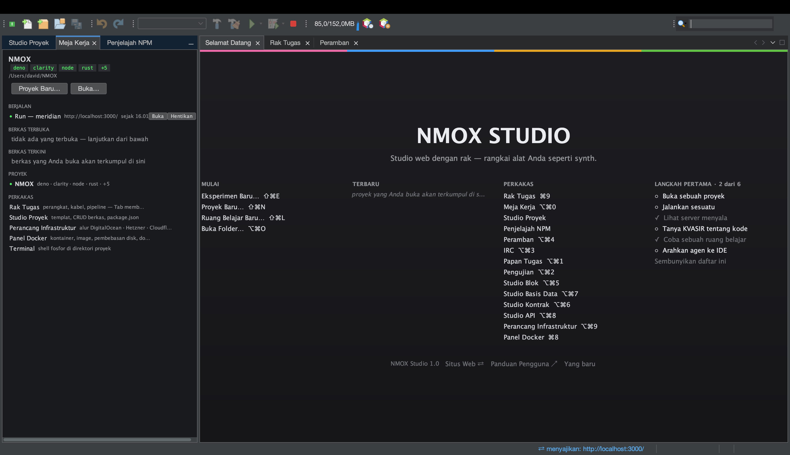
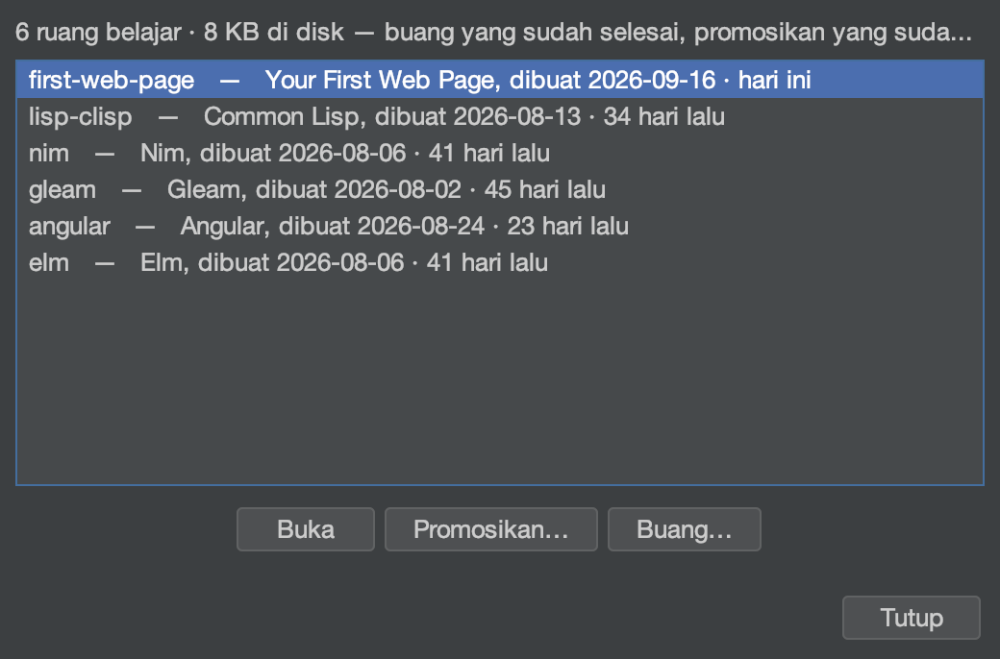
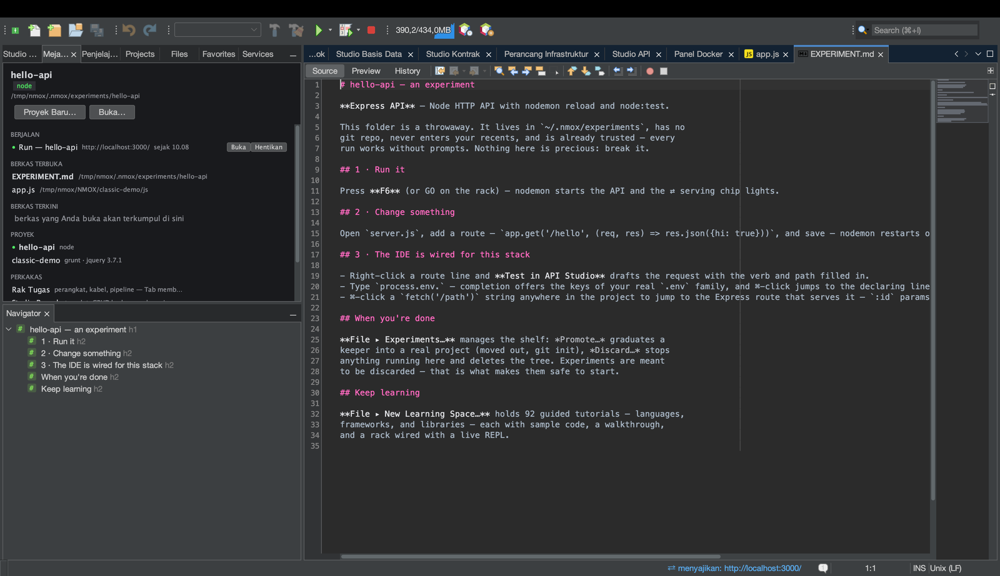
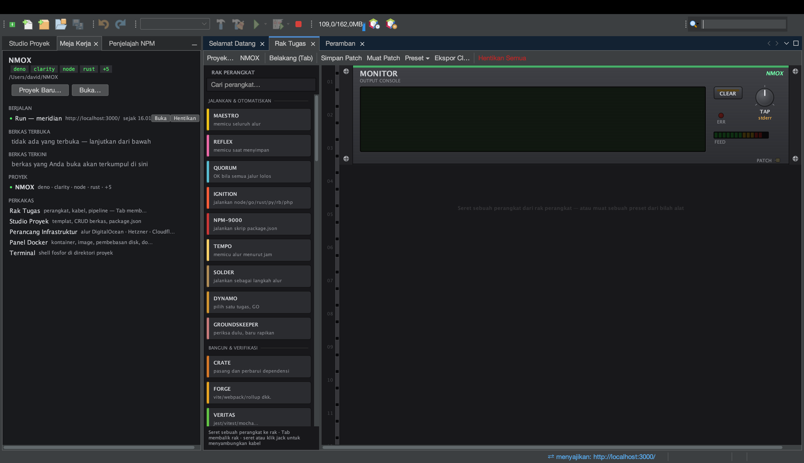
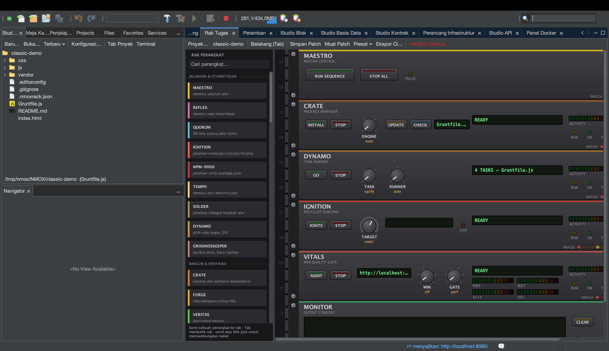
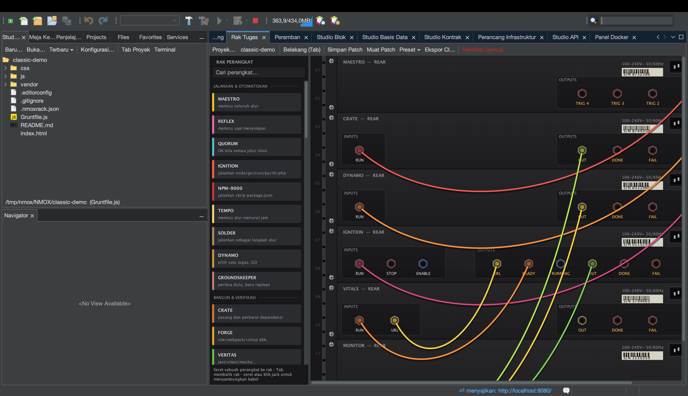
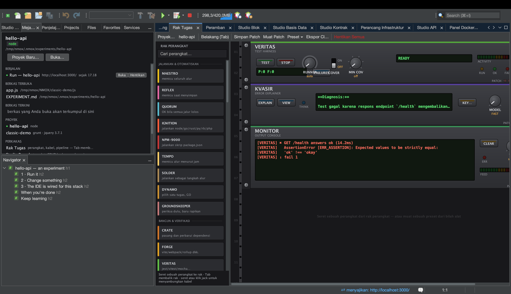
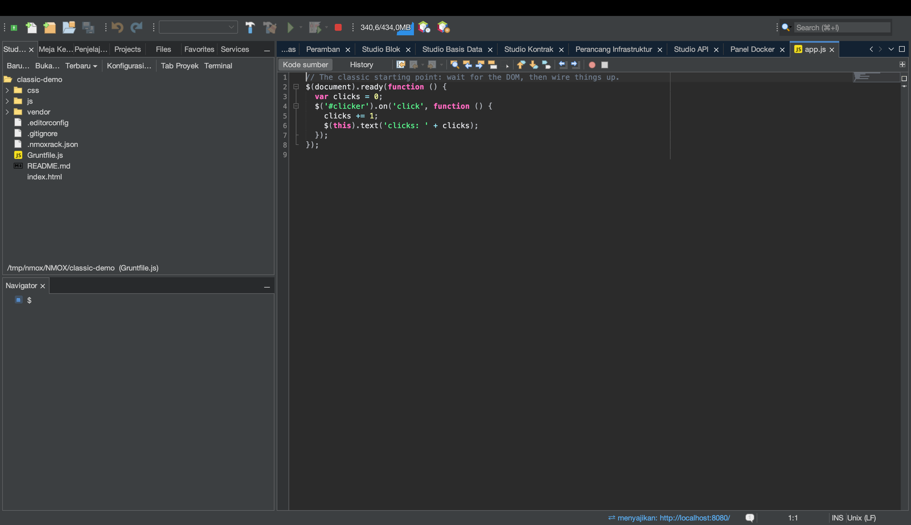
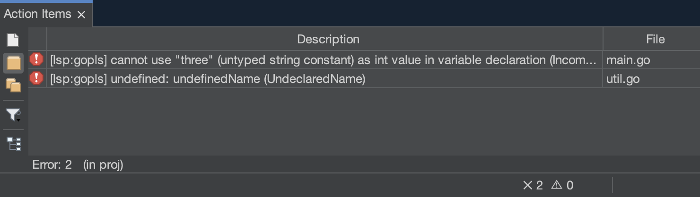

# NMOX Studio — Panduan pengguna

<!-- languages -->
[English](user-guide.md) · [Español](user-guide.es.md) · [Français](user-guide.fr.md) · [Deutsch](user-guide.de.md) · [Русский](user-guide.ru.md) · [Українська](user-guide.uk.md) · [Polski](user-guide.pl.md) · [Português (Brasil)](user-guide.pt.md) · **Bahasa Indonesia** · [Filipino](user-guide.tl.md) · [Tiếng Việt](user-guide.vi.md) · [简体中文](user-guide.zh.md) · [हिन्दी](user-guide.hi.md) · [עברית](user-guide.he.md) · [العربية](user-guide.ar.md)
<!-- /languages -->

Cara memakai produk ini. Panduan ini menyusuri fitur sesuai urutan yang akan Anda temui: pemasangan, peluncuran pertama, proyek, rak, studio, wisaya, dan jaring pengaman.

---

<a id="1-install"></a>
## 1. Pemasangan

**macOS (disarankan):**
```bash
brew trust --cask nmox/nmox-studio/nmox-studio
brew install nmox/nmox-studio/nmox-studio
```

Baris `brew trust` adalah konfirmasi sekali jalan dari Homebrew untuk tap pihak ketiga mana pun — Anda tidak akan ditanya lagi saat pembaruan. Aplikasi ini ditandatangani dengan Apple Developer ID dan dinotarisasi oleh Apple, jadi Gatekeeper menerimanya apa adanya — cask hanya menyalinnya dan tidak melakukan apa pun lagi padanya. Memasang secara manual dari DMG bekerja dengan cara yang sama.

**Selebihnya:** unduh berkas dari [rilis terbaru](https://github.com/NMOX/NMOX-Studio/releases/latest) — `.dmg` untuk macOS, `-setup.exe` untuk Windows, `.deb` untuk Debian/Ubuntu, `.tar.gz` umum untuk Linux. Keempatnya membawa lingkungan Java sendiri; tidak ada yang perlu dipasang lebih dulu. `-portable.zip` adalah satu-satunya artefak yang memakai Java Anda sendiri (perlu Java 21+ di PATH, atau jalankan dengan `--jdkhome <jalur-ke-jdk>`).

> **macOS, peluncuran pertama:** klik dua kali. macOS bertanya sekali apakah akan membuka aplikasi yang diunduh dari internet, dan menyebutkan bahwa Apple sudah memeriksanya: klik **Buka** (*Open*). Aplikasi ditandatangani dengan Apple Developer ID dan dinotarisasi, dan tiketnya dilekatkan pada aplikasi maupun DMG, sehingga pemeriksaannya bekerja luring — tanpa klik kanan dan tanpa `xattr`. Pembaru bawaan memasang ke direktori pengguna Anda, bukan ke bundel aplikasi, sehingga pembaruan tidak pernah merusak tanda tangan itu.
>
> Jika pemasangan 3.0.0, 3.0.1, atau 3.0.2 menjawab *"NMOX Studio.app" Not Opened* (“NMOX Studio.app” tidak dibuka), itu adalah cacat dalam cara aplikasi menjalankan skrip peluncurnya, yang diperbaiki di 3.1.0: pasang 3.1.0 atau yang lebih baru (`brew upgrade --cask nmox-studio`, atau unduhan baru).

### Memverifikasi unduhan Anda

Opsional, dua puluh detik, dan dua pemeriksaan karena keduanya menjawab pertanyaan yang berbeda.

**Apakah ini byte yang kami terbitkan?** Bekerja di semua platform dan mencakup setiap berkas — `SHA256SUMS` dan `SHA256SUMS.asc` disertakan dalam rilis:

```bash
curl -sL https://raw.githubusercontent.com/NMOX/NMOX-Studio/main/KEYS | gpg --import
gpg --verify SHA256SUMS.asc SHA256SUMS
sha256sum -c SHA256SUMS --ignore-missing
```

**Apakah macOS menjaminnya?** Pertanyaan lain, dijawab oleh Apple:

```bash
spctl --assess --type execute -vv "/Applications/NMOX Studio.app"
```

Anda ingin melihat `source=Notarized Developer ID`. Pemasang Windows belum ditandatangani: untuk unduhan Windows, pemeriksaan di atas adalah caranya.

### Pembaruan

**Alat ▸ Plugin ▸ Pembaruan** (atau **Bantuan ▸ Periksa pembaruan**) menawarkan modul produk dari rilis mana pun yang lebih baru, dari pusat “Pembaruan NMOX Studio”, yang mengarah ke rilis GitHub terbaru. Pasang, mulai ulang saat diminta, selesai. Platform juga memeriksa sendiri, seminggu sekali secara bawaan (ubah di **Alat ▸ Plugin ▸ Pengaturan**), dan secara terpisah IDE memberi tahu tentang rilis yang lebih baru sekali sehari; matikan itu di Opsi ▸ Umum (NMOX Studio ▸ Settings… di macOS, Alat ▸ Opsi di tempat lain). Setiap modul ditandatangani dan sertifikatnya disertakan di dalam produk, sehingga pembaruan terpasang tanpa pertanyaan tentang sertifikat.

Pembaru mengganti modul, bukan aplikasi di sekelilingnya. Lingkungan Java bawaan, peluncur, dan NetBeans Platform itu sendiri hanya berubah ketika Anda memasang sebuah rilis (`brew upgrade --cask nmox-studio`, atau unduhan baru), dan rilis yang mengubah salah satunya mengatakannya di catatan rilisnya — perintah `nmox` dan perbaikan peluncur macOS di 3.1.0 adalah contohnya. Pemasangan yang lebih tua dari 2.35.0 sama sekali tidak bisa diperbarui dari dalam aplikasi, karena 2.35.0 memindahkan platformnya: pasanglah rilis terbaru.

<a id="2-first-launch"></a>
## 2. Peluncuran pertama

Dari terminal, `nmox .` membuka folder tempat Anda berada, seperti `code .`: `cd myproject && nmox .`. Sebuah folder diarahkan persis seperti Buka Folder… di halaman Selamat Datang mengarahkannya, dengan atau tanpa manifes; sebuah berkas terbuka di penyunting (`nmox src/app.js`), pada sebuah baris bila Anda menyebutkannya seperti pada `code -g` (`nmox src/app.js:42` — kolom juga diterima, dan penyunting terbuka di awal baris). Nama yang tidak ada ditolak di terminal (`nmox: typo.js: no such file or folder`) alih-alih menjalankan apa pun. Opsi `-r` milik VS Code diterima dan `-n` membuka di satu-satunya jendela; `--wait`, `--diff`, dan opsi lain yang hanya dikenal VS Code ditolak dengan menyebut namanya. Perintah itu langsung kembali — `nmox` yang pertama menjalankan IDE di latar belakang, dan setiap `nmox` berikutnya menyerahkan foldernya kepada IDE yang sudah berjalan. `nmox` saja hanya menjalankan IDE. Cara memasukkan `nmox` ke PATH Anda:

- **macOS, Homebrew:** cask menautkannya untuk Anda.
- **macOS, dari DMG:** tautkan (jangan salin) peluncur aplikasi —
  `sudo mkdir -p /usr/local/bin && sudo ln -s "/Applications/NMOX Studio.app/Contents/MacOS/nmox-studio" /usr/local/bin/nmox`.
  Bila dijalankan lewat tautan, ia tahu bahwa ia dipanggil dari terminal; bila dijalankan dari Finder atau Dock, ia berperilaku seperti biasa.
- **Windows:** kotak *Add "nmox" to PATH* di pemasang, tercentang secara bawaan. Buka terminal baru setelahnya; terminal yang sudah terbuka tetap memakai PATH lamanya.
- **Linux:** `.deb` memasang `/usr/bin/nmox`. Dari tarball, tautkan sendiri: `ln -s "$PWD/nmox-studio-<version>/bin/nmox" ~/.local/bin/nmox`.

Di Linux dan Windows Anda juga bisa menyerahkan sebuah folder kepada NMOX Studio tanpa terminal, dan folder itu diarahkan dengan cara yang sama:

- **Linux (`.deb`):** pengelola berkas Anda mencantumkan NMOX Studio di bawah *Buka Dengan* (*Open With*) untuk sebuah folder. NMOX Studio tidak menjadi bawaan Anda untuk folder; pengelola berkas tetap menjadi bawaannya.
- **Windows:** centang kotak *Add "Open with NMOX Studio" to the right-click menu of folders in Explorer* di pemasang (awalnya tidak tercentang, seperti milik VS Code). Explorer lalu menawarkan **Open with NMOX Studio** pada sebuah folder dan pada ruang kosong di dalamnya; di Windows 11 ia berada di bawah *Show more options* (*Tampilkan opsi lainnya*). Mencopot pemasangan menghapusnya.

Di macOS, gunakan `nmox .` atau **Berkas ▸ Buka Folder…**. *Buka Dengan* (*Open With*) di Finder dan ikon Dock belum dapat menyerahkan sebuah folder kepada NMOX Studio, sehingga aplikasi ini tidak menawarkan dirinya di sana.

IDE terbuka dengan tiga tab di samping area editor: **Selamat Datang → Rak Tugas → Peramban**. Setiap jendela lain berjarak satu pintasan ⌥⌘ dan tercantum di kolom PERKAKAS halaman Selamat Datang. Di panel kiri: **Studio Proyek** (pohon berkas dan templat), basis **Meja Kerja**, dan **Penjelajah NPM**. Folder `~/NMOX` dibuat sebagai ruang kerja bawaan; rak mengarah ke sana sampai Anda membuka sebuah proyek.



Pintasan yang layak dipelajari di hari pertama (semuanya juga tercantum di tab selamat datang):

| Pintasan | Membuka |
|---|---|
| **⌘I** | Pencarian cepat — menjangkau segalanya |
| **⇧⌘P** | Pencarian cepat juga — pintasan yang oleh VS Code disebut Command Palette |
| **⌘9** | Rak Tugas |
| **⌥⌘0** | Meja Kerja |
| **⌥⌘1** | Papan Tugas |
| **⌥⌘2** | Pengujian |
| **⌥⌘3** | Klien obrolan IRC |
| **⌥⌘4** | Peramban (WebKit bawaan, dengan DevTools) |
| **⌥⌘5** | Studio Blok |
| **⌥⌘6** | Studio Kontrak |
| **⌥⌘7** | Studio Basis Data |
| **⌥⌘8** | Studio API |
| **⌥⌘9** | Perancang Infrastruktur |
| **⌘8** | Panel Docker |
| **⌘7** | Struktur berkas saat ini |
| **⇧⌘N / ⌥⌘O** | Proyek Baru… / Buka Folder… |
| **⌥⌘K / ⇧⌘L** | Eksperimen Baru… / Ruang Belajar Baru… |
| **⇧⌘E** | Studio Proyek, dengan fokus pada pohon berkas |
| **⇧⌘X** | Alat ▸ Plugin |
| **⌃\`** | Terminal di folder proyek, atau yang sudah terbuka (Ctrl+\` di Windows dan Linux) |
| **⌥⌘P / ⌥⇧⌘K** | Ganti Proyek… / Eksperimen… |

Datang dari VS Code? [Beralih dari VS Code](coming-from-vscode.id.md) memetakan pintasan dan gagasannya, dengan ejaan Windows dan Linux di samping ejaan macOS.

<a id="3-projects"></a>
## 3. Proyek

**Membuka:** folder mana pun yang memuat satu dari 60 manifes yang dikenali akan terbuka sebagai proyek sungguhan — `package.json`, `Cargo.toml`, `go.mod`, `pom.xml`, `composer.json`, `foundry.toml`, `bower.json`, `Gruntfile.js`, dan kerabatnya — termasuk manifes rantai kontrak: repositori Aiken (`aiken.toml`) atau Clarinet (`Clarinet.toml`) terbuka dengan jalur aslinya sudah terpasang. Folder biasa berisi HTML dengan tag `<script>` dan **tanpa** manifes juga terbuka, sebagai proyek STATIC: web klasik adalah warga kelas satu di sini, bukan sebuah kesalahan.

**Membuat:** *Proyek baru…* menawarkan kerangka sungguhan — Angular, Vue, Svelte, JavaScript polos, Elixir/Phoenix, PHP Web (LEMP), dan Web klasik (jQuery). Masing-masing datang dengan konfigurasi lint, format, dan uji yang sudah terpasang serta repositori git yang telah disiapkan: satu komit kerangka yang, ketika wisaya menjalankan pemasangan untuk Anda, turut memuat berkas kunci — sehingga `git status` pertama Anda bersih.

**Pohon berkas** adalah Studio Proyek (⇧⌘E). Klik kanan sebuah berkas atau folder untuk Baru, Potong, Salin, Tempel, Hapus, dan Ganti Nama, dan — seperti di Explorer VS Code — **Salin Jalur**, **Salin Jalur Relatif** (relatif terhadap proyek), dan **Tampilkan di Finder** (**Tampilkan di File Explorer** di Windows, **Buka Folder Induk** di Linux).

**Berpindah proyek itu aman:** jika ada perangkat yang berjalan (server pengembangan, pengamat), IDE bertanya sebelum berpindah dan mematikannya dengan rapi. Tidak ada yang terus berjalan di belakang Anda, tidak pernah. Bahkan menutup paksa IDE pun tidak bisa meninggalkan proses telantar.

**Eksperimen** adalah cara tercepat mencoba sebuah tumpukan teknologi. **Berkas ▸ Eksperimen Baru…** (⌥⌘K) memilih templat dan membuat proyek sekali pakai di `~/.nmox/experiments`: tanpa git, tanpa daftar terkini, sudah dipercaya, dependensi terpasang — agar **Jalankan yang pertama langsung berhasil**. Ia terbuka pada panduan `EXPERIMENT.md` miliknya sendiri, yang memberi tahu apa yang harus ditekan, berkas mana yang diubah, dan di mana kecerdasan IDE untuk tumpukan itu berada. Simpan yang berkembang: **Berkas ▸ Eksperimen…** ▸ **Promosikan…** memindahkannya keluar dan menyiapkan git, **Gandakan** membuat salinan di sampingnya untuk pendekatan kedua, **Buang** membereskan sisanya. Raknya menampilkan usia tiap eksperimen dan biaya diskanya yang terukur. Lebih suka jalur terpandu? Dialognya menampilkan 93 ruang belajar di depan.





**Jalankan, bangun, uji — dan hentikan:** tombol ▶ pada bilah (F6) menjalankan proyek sebagaimana perkakasnya menjalankannya: skrip `dev`, `start`, atau `serve` dari package.json (yang pertama dimilikinya), `cargo run`, `go run`, `dotnet run`, dan untuk folder berisi HTML sebuah server statis kecil pada porta bebas pertama mulai 8080. Proyek Node yang tidak punya satu pun dari ketiga skrip itu mengatakannya saat Anda menekan ▶ dan menampilkan skripnya di **Penjelajah NPM**, tempat klik ganda menjalankan salah satunya. Bangun, Uji, dan Bersihkan ada di sebelahnya dan di menu Jalankan. Server pengembangan yang mengumumkan alamatnya menyalakan tanda ⇄ di bilah status dan membuka halamannya di peramban bawaan. Semuanya melewati konfirmasi kepercayaan ruang kerja pada kali pertama. Sebuah jalannya yang gagal dimulai mengatakannya terus terang dan menawarkan membuka Dokter lingkungan. Untuk menghentikan: ■ di kanan Awakutu (⌥⌘.) menghentikan semua perintah yang berjalan sekaligus dan menyebutkan apa yang dihentikannya; **Jalankan ▸ Hentikan build/jalankan** menghentikan satu lalu menawarkan **Ulangi**. Si ■ melihat semua yang produk jalankan untuk Anda, termasuk pemasangan; saat disorot, keterangannya menyebut persis apa yang akan dihentikan sebuah tekanan, dan sejak kapan masing-masing berjalan.

**`.env` di mana-mana:** jika proyek Anda punya `.env`, perangkat yang diluncurkan dari rak menerima variabel itu. Suntinglah, dan bilah status mencatat bahwa mulai-ulang akan mengambilnya — proses yang sedang berjalan dengan jujur mempertahankan lingkungan lamanya.

<a id="4-the-task-rack"></a>
## 4. Rak Tugas



Rak adalah jantung produk ini. Setiap perkakas dalam alur kerja Anda — npm, pembundel, penjalan uji, server pengembangan, linter, git, penerapan — adalah sebuah perangkat di dalam rak: kenop memilih tugas, GO menjalankannya, LED menunjukkan keadaan, dan sebuah layar LCD memberi tahu Anda dengan kata-kata apa yang terjadi.



**Dasar-dasarnya:**

- **Tambahkan perangkat** dengan menyeretnya dari palet (ada kategori dan penyaring pencarian). Setiap perangkat membawa kartu *Cara memakai*-nya sendiri.
- **Jalankan sesuatu** dengan menekan tombol GO sebuah perangkat. Arahkan kursor dulu ke atasnya: keterangannya menampilkan baris perintah persis yang akan dijalankan. Tidak ada sihir.
- **Rangkai sebuah alur:** tekan **Tab** untuk memutar rak ke sisi belakangnya. Tarik kabel patch dari jack **OK** satu perangkat ke jack **GO** perangkat berikutnya. Kini `pasang → bangun → uji` hanya satu tekanan: rantainya berjalan sendiri dan berhenti pada kegagalan pertama. Keluarannya bergulir di layar fosfor perangkat MONITOR.
- **Batalkan perubahan struktur apa pun** dengan **⌘Z** — menambah, membuang, merangkai ulang. Membuang perangkat yang sedang berjalan menghentikan prosesnya lebih dulu.
- **Prasetel** memberi Anda satu rak penuh yang sudah dirangkai dengan sekali klik — Ship Gate, Dev Intelligence, Monorepo Lanes, E2E Loop, LAMP Bench, Web3 Bench, Uptime Watch. **Simpan Patch** menulis rak di samping proyek sebagai `.nmoxrack.json`; mengarahkan proyek itu lagi akan memuatnya. Tidak ada yang tersimpan sampai Anda menekannya.



**Koordinasi, ketika alur Anda membesar:**

- **QUORUM** menyatukan jalur: ia hanya memicu ketika *semua* masukan terangkainya berhasil — klasik “tunggu lint DAN uji DAN pemeriksaan tipe”.
- **Gerbang ENABLE** pada proses panjang: masukan ENABLE sebuah server pengembangan berarti “jangan mulai sebelum ini memicu”.
- **REFLEX** mengawasi berkas dan mengarahkan menurut pola — `src/**/*.css` ke satu rantai, `**/*.ts` ke rantai lain, per jalur di sebuah monorepo.
- **ROSETTA** memilih jalur perkakas di repositori campuran (rak mendeteksi Node/Rust/Go/PHP/… per direktori dan mengarahkan tiap perangkat sesuai itu).

**Jalur yang berbicara dengan perkakas Anda sendiri.** Pada AUTO, perangkat lint dan format (PURITY, GLOSS) berbicara dengan perkakas proyek itu sendiri alih-alih meraih perkakas Node di mana-mana: ruang kerja Deno memakai `deno lint` dan `deno fmt`, proyek Cargo memakai `cargo clippy` dan `cargo fmt`, modul Go memakai `go vet` (atau `golangci-lint` bila proyeknya membawa konfigurasinya) dan `gofmt`. Sebuah `biome.json` mengalihkan jalur Node ke Biome, dan posisi kenop yang eksplisit selalu mengalahkan AUTO.

**Perangkat Anda sendiri.** Raknya bisa diperluas dengan penyunting teks: `*.json` mana pun di `~/.nmox/devices.d/` menjadi perangkat sungguhan — kenop, tombol, LED, porta dan kabel, tersimpan dalam rangkaian dan terjangkau dari ⌘I. Nyatakan sebuah perintah sebagai larik argumen, beri nama sebuah kenop, dan `{{kenop}}` akan menggantikannya saat tombol ditekan. Hukumnya tetap pada tuan rumah, bukan pada berkas Anda: **kepercayaan ruang kerja menjaga peluncuran pertama persis seperti pada perangkat bawaan**.

**Gerbang mutu** mengubah “kelihatannya selesai” menjadi “memang selesai”:

- **VITALS** menjalankan Lighthouse terhadap server hidup Anda dan menuntut ambang untuk kinerja, keteraksesan, praktik baik, atau SEO.
- **VERITAS** menegakkan ambang cakupan dan menjalankan ulang persis uji yang gagal, menurut namanya.
- **GAUNTLET** membebani sebuah endpoint dan menuntut keluaran minimum. **PRISM** menjaga ukuran bundel, **BEACON** menjaga sertifikat dan ketersediaan sebuah URL, dan **PREFLIGHT** adalah daftar periksa sebelum berangkat — rangkaikan OK-nya ke perangkat penerapan Anda, dan penerapan secara fisik tidak bisa berjalan sebelum semuanya hijau.
- **GOVERNOR** menjaga regresi gas dalam pekerjaan Solidity (`.gas-snapshot`).

**Selebihnya:** **SOLDER** membungkus perintah shell apa pun menjadi perangkat sepenuhnya — dan seluruh rak **diekspor ke GitHub Actions** (alur lokal Anda dan integrasi Anda adalah rangkaian yang sama). **HELM** menjalankan perintah di server jauh lewat ssh, **TAIL** mengikuti berkas log mana pun, dan **PHOSPHOR** adalah terminal di dalam rak. Bila perintahnya mencetak alamat lokal, tanda ⇄ menyala seperti pada perangkat penyaji mana pun, dan padam ketika jalannya berakhir.

**Rak menjaga dirinya tetap selaras.** Sunting `package.json` dan kenop skrip NPM-9000 memperbarui dirinya di tempat. Sunting sebuah `Gruntfile` dan DYNAMO membaca ulang tugas-tugasnya. Tambahkan sebuah dependensi dan tampilan CRATE menyegarkan diri. Tanpa mengarahkan ulang, tanpa tombol segarkan.

### KVASIR — menjelaskan kegagalan terakhir



**KVASIR** adalah bantuan AI dengan cara rak: sebuah perangkat yang menjelaskan galat yang sedang ada di bus MONITOR, bukan bilah obrolan di samping. Ketika sebuah jalannya gagal, tekan **EXPLAIN** dan KVASIR bertanya kepada AI Anda apa yang salah dan apa langkah berikutnya yang konkret. Putusan singkat mendarat di layar; **VIEW** membuka jawaban selengkapnya. **MODEL** memilih **FAST** (cepat dan murah, bawaan) atau **DEEP** (lebih kuat). EXPLAIN berwarna biru: ia membaca dan bertanya, ia tidak pernah menyentuh proyek Anda.

KVASIR menjawab dalam bahasa yang dipilih untuk NMOX Studio.

**Pilih AI Anda, pasang kunci Anda.** KVASIR bekerja dengan **Claude (Anthropic)**, **ChatGPT (OpenAI)** atau **Gemini (Google)** — kunci Anda, pilihan Anda. Tekan **KEY…** untuk memilih penyedia dan menempelkan kuncinya; pilihannya diingat, dan kuncinya hanya tinggal di gantungan kunci sistem operasi. Variabel lingkungan yang lazim bagi tiap penyedia juga dibaca, dan kunci yang tersimpan mengalahkan kunci dari lingkungan.

**Apa yang KVASIR kirim, dan itu seluruhnya.** Pertama kali Anda menekan EXPLAIN, sebuah dialog merinci persis apa yang akan meninggalkan mesin Anda dan apa yang tidak; tidak ada yang dikirim tanpa persetujuan itu, dan persetujuannya berlaku per penyedia. Setelah EXPLAIN yang berhasil, tombol **VIEW** membuka jawabannya sebagai percakapan — Anda bisa terus bertanya tentang kegagalan yang sama.

**Tanyakan kode Anda kepada KVASIR.** Asisten yang sama menjangkau penyunting: pilih kode lalu pilih **Tanya KVASIR tentang pilihan…**, atau **Sunting dengan KVASIR…** untuk mengatakan apa yang harus diubah dan melihat sebelum dan sesudahnya sebelum apa pun diterapkan. **⌥⌘G** melengkapi di kursor dengan teks bayangan yang hanya masuk bila Anda menekan Tab, dan tanda cabang git dapat menyusun pesan komit Anda.

**Arahkan sebuah agen ke IDE Anda.** Alat ▸ Agent Port (MCP)… membuka titik akhir MCP yang bisa ditanyai asisten dari luar: ia **hanya-baca menurut rancangannya**, mati sampai Anda menyalakannya, hanya mendengarkan pada antarmuka lokal, dan menuntut token yang dibuat saat ia dinyalakan.

Rak ini dapat diperluas: plugin pihak ketiga bisa menambahkan perangkat (pasang NBM mereka lewat Alat ▸ Plugin). Untuk menulis satu, lihat [device-spi.md](device-spi.md).

<a id="5-the-editor"></a>
## 5. Penyunting



Lebih dari 70 bahasa disorot sebagaimana mestinya — tumpukan modern, tumpukan klasik (termasuk CoffeeScript), dan seluruh lapisan konfigurasi, sampai ke `.env`, `.editorconfig`, konfigurasi nginx dan Apache, Dockerfile, serta berkas kunci.

- **Pelengkapan** mengenali konteks, dan juga *pustaka klasik*: bila proyek Anda membawa jQuery, MooTools, Prototype, Backbone/Underscore, atau Knockout (lewat dependensi npm *atau* tag `<script>` biasa), API mereka muncul saat melengkapi. Proyek jQuery 1.x dan 2.x mendapat penanda akhir masa pakai yang jujur, bukan omelan.
- **Kerangka Penjelajah (⌘7)** menampilkan struktur berkas untuk 58 jenis; klik untuk melompat.
- **Minimap** — siluet seluruh berkas di samping bilah gulir tiap penyunting; klik atau seret untuk menggulir. Seluruh dokumen selalu muat dalam bilah itu: barisnya menyusut seiring berkas membesar. Tampilan ▸ Minimap menyalakan dan mematikannya sekaligus di semua penyunting yang terbuka.
- **Gulir lengket** — deklarasi yang melingkupi bagian atas tampilan (kelasnya, lalu metode yang Anda masuki) tetap tersemat di atas teks, sampai tiga baris dari kode itu sendiri; klik salah satunya untuk melompat ke sana. Bilahnya lenyap ketika tak ada yang melingkupi baris teratas.
- **Ke simbol (⌥⇧⌘O)** melompat ke fungsi, kelas, aturan, atau judul mana pun di seluruh proyek dengan mengetik namanya — cocok menurut awalan, huruf besar di tengah kata, atau kartu bebas. Indeksnya terbatas dan jujur: `node_modules` dilewati, dan pada proyek yang sangat besar dialognya berkata bahwa ia mengindeks 2.000 berkas pertama, bukannya berpura-pura membaca semuanya.
- **Jendela uji (⌥⌘2)** menampilkan setiap uji dalam proyek *sebelum apa pun dijalankan*, dan menjalankan satu uji, satu berkas, atau semuanya.
- **LSP**: buka berkas yang server bahasanya terpasang (typescript, gopls, rust-analyzer, pyright, …) dan Anda mendapat diagnostik, keterangan saat melayang, dan lompat ke definisi. Galat dan peringatan server itu juga menjadi baris di **Item tindakan** (⌘6), dinamai menurut servernya (`[lsp:gopls]`), untuk setiap berkas yang sudah dilaporkan server itu. Sebagian server hanya melaporkan berkas yang sedang Anda buka; gopls melaporkan seluruh paket. Servernya tidak ada? IDE menawarkan perintah pemasangannya alih-alih gagal diam-diam.

  

- **`.editorconfig` dihormati** — saat Anda mengetik dan saat Anda menyimpan. `indent_style`, `indent_size`, dan `tab_width` menentukan apa yang ditulis Tab, Enter, dan indentasi ulang, sehingga proyek bertab mendapat tab dan proyek empat spasi mendapat empat spasi, per berkas dan per bagian glob; setiap penyimpanan menerapkan `trim_trailing_whitespace` dan `insert_final_newline`. Suntingan pada `.editorconfig` sampai ke penyunting yang terbuka dalam beberapa detik. Karakter tab harfiah yang sudah ada di dalam berkas tetap digambar dengan lebar tab yang diatur di Opsi, dan `charset` serta `end_of_line` tidak diterapkan. Perangkat pemformat Anda (GLOSS dan kawan-kawan) mengurus sisanya.
- **`.vscode/settings.json` sebuah repositori dihormati dengan cara yang sama:** `editor.tabSize`, `editor.insertSpaces`, dan `editor.indentSize` menentukan indentasi, `files.trimTrailingWhitespace` dan `files.insertFinalNewline` (bila `true`) diterapkan saat menyimpan, dan blok bahasa seperti `"[typescript]": {…}` menimpanya untuk bahasa itu. Bila proyek juga punya `.editorconfig`, `.editorconfig` yang menang di mana pun keduanya mengatur sesuatu. `editor.detectIndentation` milik VS Code, yang membiarkan indentasi berkas itu sendiri menang, tidak punya padanan di sini.

### Bentangkan singkatan (⌥⌘E)

Ketik sebuah singkatan Emmet lalu tekan **⌥⌘E**: `ul>li*3` menjadi daftar yang lengkap. Ini bekerja di HTML, di templat Angular, dan — dalam bentuk CSS-nya — di dalam blok `<style>` dan atribut `style`, dengan potongannya dibatasi pada wilayah itu sehingga tak pernah menelan markah di sekitarnya. Singkatan yang tak dikenali produk ini ditolak dan meninggalkan teks Anda apa adanya.

### Token rancangan (properti kustom)

Mengetik `var(` menawarkan token yang dideklarasikan di lembar gaya proyek Anda yang sesungguhnya, masing-masing dengan contoh warnanya dan tempat ia dideklarasikan. **⌘-klik** pada pemakaian `var(--token)` melompat ke deklarasinya. Warna dilukis sebagai warna yang sebenarnya — hex, `rgb()`, `hsl()`, nama, dan juga `oklch()`, `lab()`, dan `color-mix()` — dan **⌘-klik** pada sebuah literal warna membuka pemilih yang menggantinya dalam bentuk persis seperti yang Anda tulis.

### Atribut class mengenal lembar gaya Anda

Mengetik di dalam `class="…"` menawarkan kelas yang benar-benar didefinisikan proyek Anda, sekaligus lembar gaya asalnya; **⌘-klik** pada sebuah kelas melompat ke aturannya, dan **⌘-klik** pada pemilih `.kelas` melompat ke pemakaian pertamanya dalam markah. **Ganti nama kelas…** mengganti nama di seluruh proyek — hanya token utuh, dengan jumlah per berkas — dan menolak dengan lantang bila nama barunya sudah ada atau masih ada perubahan yang belum disimpan.

### Jalankan skrip, dari kursor

Di bagian `scripts` sebuah `package.json`, **Jalankan skrip** menjalankan baris tempat kursor berada — lewat konfirmasi kepercayaan ruang kerja yang sama dan ■ yang sama seperti jalannya yang lain.

### Kunci lingkungan, kelas satu

Mengetik `process.env.` atau `import.meta.env.` menawarkan kunci yang benar-benar didefinisikan keluarga berkas `.env` Anda, dan **⌘-klik** melompat ke baris yang mendeklarasikan kunci itu. Nilainya ditampilkan terpotong: pengingatnya ada, rahasianya tidak.

### Terjemahan dalam proyek Anda

Katalog terjemahan sebuah proyek web adalah data yang dibaca editor, sama seperti stylesheet dan `.env` Anda. **Alat ▸ Periksa Terjemahan…** menemukan katalognya (i18next, vue-i18n, svelte-i18n, XLIFF Angular, Lingui, Paraglide, react-intl, atau milik I18n Kit), memilih bahasa sumber, dan melaporkan tiga hal sebagai garis berlekuk dan baris di Tugas: **hilang** (bentuk jamak dan konteks dibandingkan pada kunci dasarnya), **identik dengan sumber** (disalin, bukan diterjemahkan), dan **placeholder tidak cocok** — yang ini galat, sebab terjemahan dengan himpunan `{{name}}` atau `%s` berbeda dari sumber sudah rusak. Temuan keempat, **tak terpakai**, hanya muncul pada sensus lengkap.

### Templat Angular, kelas satu

Berkas `.component.html` terbuka dengan penyorotan templatnya sendiri, dengan blok `@if`/`@for` dan direktif struktural dalam pelengkapan. Pasang Angular Language Service dan pemeriksaan tipe templat benar-benar sampai: salah mengetik nama properti, dan kompiler Angular sendiri menyarankan yang benar. **⌘B** di dalam templat melompat ke deklarasinya, dan menu konteks berpindah antara komponen, templatnya, gayanya, dan ujinya.

### Komponen Vue dan Svelte, kelas satu

Berkas `.vue` dan `.svelte` terbuka dengan penyorotannya sendiri, pelengkapannya sendiri (termasuk rune bertitik Svelte 5), dan Emmet di dalam blok templatnya. Diagnostik Vue benar-benar sampai ke penyunting, lewat server bahasa Vue sendiri.

### Awakutu dengan titik henti yang sungguhan

Klik di margin kiri, pilih **Debug berkas (titik henti)**, dan programnya berhenti di sana — lengkap dengan tumpukan, variabel, dan penilaian ungkapan. JavaScript dan TypeScript jalan sejak awal berkat adaptor bawaan; Python memakai debugpy dan Go memakai delve, yang Anda pasang sendiri. **Debug di Chrome (titik henti)** melakukan hal yang sama untuk sebuah halaman: titik henti di sumber Anda berhenti di dalam IDE sementara peramban berjalan pada profil sekali pakai. Repositori yang membawa `.vscode/launch.json` punya satu pintu lagi: ketik nama sebuah konfigurasi di Pencarian Cepat, dan Enter memulai `program` Node atau Python milik konfigurasi itu di dalam `cwd`-nya, dengan `args` dan `env`-nya, atau membuka `url` konfigurasi Chrome dengan `webRoot`-nya; konfigurasi yang mengatur `envFile`, `runtimeExecutable`, atau apa pun yang tidak bisa diteruskan pengawakutu ditolak dengan menyebut namanya di baris status alih-alih dimulai tanpanya. Semuanya lebih dulu melewati konfirmasi kepercayaan ruang kerja.

### Awakutu di peramban

JavaScript peramban diawakutu dengan cara sama: klik kanan berkas `.html`, `.js`, atau `.ts` → **Debug di Chrome (titik henti)**. Titik henti di editor menghentikan kode yang berjalan *di peramban*, dengan tumpukan dan variabel yang sama. Peramban mengikuti sumber yang paling hidup: bila sebuah perangkat sudah mengumumkan URL proyek, halaman itulah yang terbuka; kalau tidak, `.html` dibuka dari diska. Skrip tunggal tanpa peladen tidak punya halaman — baris status mengatakannya alih-alih menebak. Chrome berjalan dengan profil sekali pakai; milik Anda tetap utuh. **Web Worker** juga diawakutu: setiap `new Worker(…)` menjadi sesinya sendiri.

### Mempertunjukkan dan berbagi

**Tampilan ▸ Mode presentasi** sekaligus memperbesar setiap penyunting yang terbuka, halaman di peramban bawaan, jendela keluaran, dan terminal — lalu mengembalikan semuanya persis seperti semula saat Anda keluar. **Tampilan ▸ Tampilkan ketukan tombol** menampilkan besar-besar kombinasi yang baru Anda tekan, tetapi tidak pernah apa yang Anda ketik. **Sunting ▸ Salin sebagai Markdown** menyalin pilihan sebagai blok berpagar dengan label bahasa yang tepat, dan variannya **dengan tautan** menambahkan tautan GitHub ke baris yang sama. **Alat ▸ Simpan Tangkapan Layar…** melukis seluruh jendela pada ukuran ganda, dengan varian untuk tab penyunting saja, untuk papan klip, dan untuk menyalin pohon proyek sebagai Markdown.

<a id="6-the-studios"></a>
## 6. Studio-studio

### Akses lewat papan tik dan pembaca layar

Setiap kendali di rak punya nama yang terbaca, dan itu diperiksa pada setiap kali membangun. Kenop adalah penggeser yang menuruti tombol panah, Home dan End; tombol menuruti spasi dan Enter, termasuk yang diredupkan, yang mengatakan mengapa ia menolak; LED dan layar mengumumkan keadaannya. Tab memutar rak — kecuali ketika fokus ada pada sebuah kendali, di situ ia mengalah pada penelusuran biasa.

### Git, di bilah status

Tanda **⎇ cabang** menunjukkan Anda di cabang mana dan berapa berkas yang berubah; ia dibaca dari cakram, jadi tak memakan proses sama sekali. Sekali klik membuka riwayat lengkapnya, dan menunya membawa **Beda proyek**, **Anotasi**, permintaan tarik lewat `gh` milik Anda sendiri, serta **Susun pesan komit dengan KVASIR**.

### Papan Tugas (⌥⌘1)

Sebuah kanban per proyek yang tersimpan di `.nmoxtasks.json` — di samping kode Anda dan berversi bersamanya. Seret kartunya atau pindahkan dengan papan tik: **⌘↑/⌘↓** mengurutkan ulang, dan kartu yang dipindahkan tetap memegang fokus. Batas pekerjaan berjalan itu nasihat, bukan penghalang: kepalanya memerah dan tak ada yang menahan Anda. Tombol **Ikhtisar** menukar kolomnya dengan sebuah dasbor — yang sedang berjalan, selesai hari ini dan pekan ini, alir per hari, kartu yang menua — dan jam kerjanya (**Absen masuk**) mengukur waktu yang sebenarnya per kartu, dengan hanya satu jam berjalan di seluruh papan. **Standup** mengubah semua itu menjadi laporan siap tempel.

### Studio Blok (⌥⌘5)

Susunlah Web Component yang sungguhan dari kepingan bertipe yang saling mengunci, dengan cara Scratch: sarang yang tak sah ditolak, kodenya lahir sebagai elemen kustom yang berdiri sendiri, dan mengeklik sebuah kepingan menyorot baris-barisnya. Sebuah server pratinjau di memori memperlihatkan komponennya sungguh-sungguh, tersusun bersama komponen sah lainnya di pustaka Anda. Bolak-baliknya persis: membangkitkan ulang apa yang baru dibaca menghasilkan berkas yang sama, bita demi bita.

### Studio API (⌥⌘8)

Koleksi, permintaan, lingkungan dengan `{{variabel}}`, dan uji, tersimpan di `.nmoxapi.json` — rahasianya hanya di gantungan kunci, tak pernah di berkas itu. Setiap tanggapan mendapat nilai keamanan dari tajuknya sendiri. Impor dari curl, `.http`, OpenAPI, Postman, Insomnia, dan HAR; ekspor ke `.http`, dan salin sebagai curl atau sebagai `fetch`, dengan variabelnya sudah terisi.

### Studio Basis Data (⌥⌘7)

SQLite, PostgreSQL, MySQL, MariaDB, MongoDB, dan CouchDB, dengan penggeraknya sudah menyatu dan kata sandinya hanya di gantungan kunci. Konsolnya mengenali mesinnya, tiap pernyataan punya kisi hasilnya sendiri, dan barisnya disunting di dalam kisi itu bila ada kunci utama — dengan pratinjau UPDATE yang persis sebelum diterapkan, dan alasan yang jujur ketika sesuatu hanya bisa dibaca. Ekspor ke CSV atau JSON, dengan rumusnya dijinakkan.

### Studio Kontrak (⌥⌘6)

Pohon artefak Foundry dan Hardhat, **Berinteraksi** yang dituntun ABI dengan kembalian dan pembatalan yang terbaca, panel **Awasi** yang mengikuti blok dan peristiwa, serta **Pengawasan** dengan tabel gas, putusan ukuran EIP-170, dan buku alamat. **Tidak pernah ada kunci privat**: pengiriman memakai akun tak terkunci sebuah jaringan lokal, dan URL rahasia tinggal di gantungan kunci.

### Perancang Infrastruktur (⌥⌘9)

Sebuah kanvas untuk DigitalOcean, Hetzner, dan Cloudflare: selaraskan dengan apa yang benar-benar ada, segarkan untuk melihat selisihnya, dan hancurkan setumpuk sumber daya dengan biayanya terpampang. Sambungan yang tak sah menolak dengan lantang dan menyebut sebabnya, dan selama sebuah operasi awan berjalan, kanvasnya terkunci dengan pita yang mengatakannya.

### IRC (⌥⌘3)

Sebuah klien penuh di dalam IDE: TLS dengan pemeriksaan nama yang sungguhan, SASL, perluasan IRCv3, pelengkapan dengan Tab, penyorotan, URL yang terbuka di peramban bawaan, pencatatan ke cakram, penyaring milik Anda sendiri, dan daftar kanal yang Anda saring sambil mengetik.

### Situs web yang menyertai

**Bantuan ▸ Situs Web NMOX Studio (lokal)** menyajikan situs produk ini dari raknya sendiri, pada antarmuka lokal. Ia berbicara dalam lima belas bahasa yang sama seperti IDE-nya; pemilihnya ada di kaki halaman.

### Peramban (⌥⌘4)

Sebuah peramban sungguhan di dalam IDE, dengan perkakas pengembangnya sendiri — konsol, DOM, jaringan, penyimpanan, dan panel untuk Vue, Svelte, dan Angular — sebab mesinnya tak membawa pemeriksa apa pun, dan yang ini milik kita. Ia sadar akan sumbernya: pilih sebuah elemen, buka baris yang melahirkannya, ubah gayanya di tempat, dan deklarasinya mendarat di lembar gaya asalnya. Menyimpan sebuah berkas memuat ulang halamannya, dan ada ukuran perangkat yang sungguhan untuk menguji tata letak Anda yang lentur.

Halaman dalam aksara kompleks dilukis terbentuk: Arab, Persia, Urdu (termasuk Nastaliq), Kurdi, Pashto, Sindhi, Uighur, Suryani, Thaana, dan N’Ko menyambung hurufnya dan terbaca dalam urutannya sendiri, dengan angka dalam urutan angkanya; Hindi dan aksara India lainnya (Bengali, Gurmukhi, Gujarati, Oriya, Tamil, Telugu, Kannada, Malayalam, Sinhala), Thai, Tibet, Myanmar, dan Khmer menempatkan tanda vokal dan konjungnya di tempatnya; dan aksen yang ditulis sebagai karakter terpisah (seperti cara macOS menulis nama berkas) duduk di atas hurufnya. WebKit milik JavaFX tidak melakukan semua ini sendiri. Di macOS dan Windows, Peramban menyalakan mesin teks kompleks milik WebKit sendiri, sehingga kolom formulir, frasa tebal dan miring, paragraf rata kiri-kanan, dan seleksi terukur dengan tepat. Di Linux, tempat saklar itu tidak ada, Peramban membentuk teksnya sendiri dan menyesuaikan perkiraan lebarnya dengan fon yang dipasang distribusi Anda, sehingga frasa yang penuh konjung atau yang diset dalam Nastaliq bisa bergeser beberapa piksel. Lao tidak dibentuk: teks milik JavaFX sendiri juga menggeser vokalnya. Ibrani, Armenia, Georgia, dan Etiopia tampil dengan benar dengan sendirinya, termasuk niqqud.

<a id="7-docker"></a>
## 7. Docker

Tab Docker adalah panel kendali: keadaan mesin, kontainer, image, volume, dan jaringan, lengkap dengan mulai, henti, log, dan bersih-bersih. Perangkat HARBOR di rak menunjukkan hal yang sama dalam sekali pandang. Dan seperti sudah disebut: jalankan kontainer Postgres, MySQL, atau Mongo, dan Studio Basis Data menawarkan sambungan yang sudah jadi.

Tab **Dockerize** membuat `Dockerfile` kelas produksi, `.dockerignore`, dan berkas komposisi yang disesuaikan dengan rantai perkakas proyek Anda — Node, PHP-FPM dengan nginx, dan lainnya.

<a id="8-wizards-and-kits"></a>
## 8. Pemandu dan kit

Semuanya ada di *Berkas Baru…* dan di menu konteks proyek, dan semuanya **idempoten serta tidak pernah menimpa**: menjalankannya lagi hanya memperbarui apa yang menjadi miliknya sendiri dan membiarkan suntingan Anda; apa yang tidak boleh ditulis ulang mendarat di sebelahnya sebagai berkas `.suggested`.

### Kit standar

`robots.txt`, `sitemap.xml`, manifes web, `security.txt` sesuai RFC 9116, dan `humans.txt`, dibuat dari jawaban Anda.

### Kit PWA

Satu set ikon lengkap yang ditempa dari satu gambar, termasuk varian yang dapat dimasker; service worker yang mudah dibaca — cangkang aplikasi atau jaringan dahulu, Anda yang memilih —, halaman untuk saat tanpa jaringan, dan sambungan di `index.html` yang mengikat semuanya.

### Kit aksesibilitas

Aksesibilitas sebagai titik awal, bukan audit setelah semuanya jadi: `a11y.css` (cincin fokus yang terlihat, alat bantu untuk teks yang hanya dibaca pembaca layar, gaya untuk tautan lompat, dan blok bagi yang memilih lebih sedikit gerak), `A11Y-NOTES.md` berisi penelusuran lewat papan ketik dan pertanyaan yang tidak bisa dijawab otomatisasi mana pun, serta sambungan idempoten di `index.html` — bahasa, tautan lompat, lembar gaya. Viewport yang melarang perbesaran diperingatkan, tidak pernah ditulis ulang; apa yang tidak bisa diperbaiki kit ini disebutkan, bukan disentuh.

### Kit internasionalisasi

Dapat diterjemahkan sejak hari pertama, saudara kit aksesibilitas: `locales/en.json` dan `locales/es.json` (satu katalog per bahasa, kunci yang sama), `i18n.js` tanpa ketergantungan yang menerapkan katalog pada markah `data-i18n`, menjaga `<html lang>` tetap jujur, dan menampilkan kunci yang hilang sebagai dirinya sendiri, bukan sebagai kekosongan yang diam; ditambah `I18N-NOTES.md` — tanpa potongan yang disambung, `Intl` untuk tanggal dan angka, penelusuran kanan ke kiri, dan pseudolokalisasi.

### Kit kontrak (Web3)

Pilih satu rantai — Solidity dengan Foundry, Soroban, Solana, CosmWasm, ink!, Cairo, Move, Bitcoin dengan Miniscript, Clarity di Stacks, Cardano dengan Aiken, atau TON dengan Tact — dan sebuah nama kontrak, lalu kit menyiapkan awalan yang sudah terbukti langsung: manifes, kontrak, uji bawaan, dan CONTRACT-NOTES.md yang menyebut perangkat rak dan langkah sekali jalan. Kunci tidak pernah menyentuh IDE.

### Kit klasik

Tambahkan ke kode mana pun jQuery, MooTools, Prototype, Backbone dengan Underscore, atau Knockout, entah disertakan di dalam repositori (versi dipatok, sha256 dicatat) atau sebagai ketergantungan npm; ditambah kerangka webpack, grunt, gulp, atau bower.

<a id="9-quick-search-status-line-and-staying-oriented"></a>
## 9. Pencarian cepat, baris status, dan tetap tahu arah

### Tanda ⇄ menyajikan

Di baris status muncul tanda **⇄ menyajikan** setiap kali ada peladen yang hidup: jalannya IDE sendiri, perangkat yang melayani, dan perintah apa pun yang telah mencetak alamat lokal. Klik dan pilih satu: ia terbuka di peramban bawaan, atau di peramban sistem bila tab itu tidak sanggup menerimanya. Selama ada sesuatu yang diperiksa IDE yang bermasalah, hitungan **✕ 2 ⚠ 1** menampilkan galat dan peringatan dari setiap server bahasa dan alat; klik untuk membuka Item tindakan.

### ⌘I, pencari untuk segalanya

Satu kotak menjangkau proyek Anda (yang terkini dan yang dikenal), setiap perangkat rak — langsung ke kendalinya —, **peladen yang sedang hidup** (Enter membukanya di peramban), permintaan Studio API, sambungan dan tabel Studio Basis Data, kontrak, simpul infrastruktur, kartu Papan Tugas (hasilnya menyebut kolom tempat kartu itu berada), **nama perintah VS Code** (*Format Document*, *Toggle Terminal*, *Git: Commit*, *Open Settings* — masing-masing terdaftar di bawah *Perintah VS Code* di samping tindakan yang melakukan hal yang sama di sini, jadi namanya di sini yang Anda ketik lain kali), serta **skrip npm** proyek yang diarahkan: ketik `dev` atau `test` dan hasilnya terbaca *Jalankan skrip: dev — vite*; Enter menjalankannya dengan pengelola paket proyek itu sendiri (npm, yarn, atau pnpm), persis seperti klik ganda di Penjelajah NPM — Kepercayaan Ruang Kerja bertanya lebih dulu pada proyek yang belum Anda percayai, jalannya bergabung dengan ■ di bilah alat, dan server pengembangan yang dicetaknya menyalakan tanda ⇄. Di sebuah monorepo, skripnya adalah yang ditampilkan Penjelajah NPM. Repositori yang membawa `.vscode/tasks.json` mendaftar tugas-tugasnya dengan cara yang sama — *Jalankan tugas: build — make all* — dan Enter menjalankan tugas itu setelah pertanyaan kepercayaan yang sama, di jendela Output dan di bawah ■ di bilah alat; tugas shell berjalan di shell yang akan dipakai VS Code (`$SHELL` Anda, sebagai shell login di macOS; PowerShell di Windows) atau di shell yang disebut `options.shell`-nya; tugas yang memerlukan nilai yang hanya bisa diberikan VS Code, atau bergantung pada tugas lain, mengatakannya di baris status alih-alih berjalan. `.vscode/launch.json` repositori itu mendaftar konfigurasi-konfigurasinya di sampingnya — *Debug: Launch Program — ${workspaceFolder}/server.js* — dan Enter memulai pengawakutu titik henti pada konfigurasi itu setelah pertanyaan kepercayaan yang sama.

### Baris status memberi tahu apa yang hidup

Di sebelah tanda peladen ada proyek yang sedang dibidik beserta rantai perkakasnya, dan cabang Git dengan jumlah berkas yang Anda ubah. Semua itu dibaca dari cakram atau dari catatan yang memang sudah disimpan produk ini: melihatnya tidak memakan proses sama sekali.

### Meja Kerja

Inilah pangkalan: proyek berjalan, berkas yang terbuka dan yang terkini, proyek terkini, dan peluncur untuk setiap permukaan. Selama ada yang berjalan, bagian **SEDANG BERJALAN** memimpin halaman — setiap perintah yang produk ini mulai untuk Anda, dengan alamatnya bila ia mengumumkan satu dan sejak jam berapa ia berjalan, ditambah setiap peladen yang dilayani perangkat rak. Setiap baris punya tombol **Buka** dan **Hentikan** yang sungguhan, terjangkau papan ketik maupun pembaca layar, sehingga satu jalan dapat dihentikan tanpa menjatuhkan yang lain. Semua judul di Meja Kerja adalah tombol sungguhan: Tab sampai ke sana, Enter membukanya. ⌘I menjangkau jalan yang sama: ketik «hentikan» lalu Enter menghentikan tepat yang itu. Yang Anda hentikan sendiri terbaca *dihentikan* di mana pun hasilnya dilaporkan, tidak pernah sebagai kegagalan.

### Pintasan Emacs (juga Eclipse dan IntelliJ)

Alat ▸ Opsi ▸ Pintasan keyboard (di macOS: NMOX Studio ▸ Settings… ▸ Pintasan keyboard) mengganti seluruh profil peta tombol: gerakan serta potong dan tempel ala Emacs di setiap penyunting, atau kumpulan Eclipse dan IDEA bila di sanalah ingatan jari Anda. Setiap pintasan NMOX (keluarga jendela ⌥⌘, ⌘P untuk membuka berkas, ⌥⌘E milik Emmet, pintasan VS Code) terdaftar di kelima profil, jadi berganti profil tidak pernah merenggut pintasan studio dari Anda. Satu pengecualian disengaja: di profil Eclipse, ⇧⌘E tetap *Switch to Editor* milik Eclipse sendiri, karena pengguna yang memilih Eclipse mengharapkannya.

<a id="10-the-safety-nets-things-you-dont-have-to-do-anything-for"></a>
## 10. Jaring pengaman (yang tidak perlu Anda lakukan apa-apa untuk mendapatkannya)

### Kebangkitan sesi

Rak memotret apa yang sedang berjalan setiap beberapa detik. Penutupan paksa, kegagalan, `kill -9` — saat dijalankan lagi, sebuah pesan menawarkan untuk memulihkan persis sesi yang hilang, dengan satu klik.

### Jaminan tanpa yatim

Keluar dari IDE mematikan setiap proses yang ia mulai — peladen pengembangan, REPL, rantai, pengawas —, TERM dahulu, KILL kalau membangkang, keturunannya sekalian.

### BLACKBOX dan SONAR

Pasang **BLACKBOX** di rak Anda dan Anda punya perekam penerbangan: setiap awal dan setiap akhir, dengan lamanya, kecenderungannya, dan apa yang berubah sejak bangunan hijau terakhir. Yang Anda hentikan sendiri terbaca DIHENTIKAN — bukan hijau, bukan kegagalan, dan tidak pernah menjadi hal yang diminta dijelaskan kepada KVASIR. **SONAR** menunjukkan siapa yang menguasai porta Anda, disilangkan dengan Docker, dan dengan satu klik mengusir yang menduduki 3000.

### Berkas yang tidak pernah ditimpa

Keempat berkas kerja studio (`.nmoxapi.json`, `.nmoxdb.json`, `.nmoxweb3.json`, `.nmoxinfra.json`) dimuat ulang bila Anda menyuntingnya di luar IDE — tetapi bila ada perubahan yang belum disimpan, Anda ditanya, bukan ditimpa. Berkas yang rusak disingkirkan sebagai `.bak` dan dilaporkan, tidak pernah diganti diam-diam.

### TypeScript tanpa membangun

Proyek yang pintu masuknya `index.ts`, `main.ts`, atau `src/index.ts` berjalan dari IGNITION dengan pelucutan tipe milik Node sendiri (`--experimental-strip-types`, sejak Node 22.6; bawaan sejak 23.6 dan 22.18 LTS). Penolakan dari Node yang lebih tua diterjemahkan menjadi kalimat yang menyebut ambang itu.

### Bahasa Anda

NMOX Studio berbicara dalam lima belas bahasa: English, Español, Français, Deutsch, Русский, Українська, Polski, Português (Brasil), Bahasa Indonesia, Filipino, Tiếng Việt, 简体中文, हिन्दी, עברית, dan العربية. Pilih bahasa Anda di **Opsi ▸ Umum ▸ Bahasa** — masing-masing tertulis dengan namanya sendiri, agar Anda selalu menemukan milik Anda. Pilihan itu ditulis ke pengaturan peluncuran Anda (`etc/nmoxstudio.conf`, sebagai argumen `--locale`) dan juga berlaku seketika. Yang berubah: menu, dialog, tip alat, baris status, layar sambutan, dan opsi. Yang tetap: kosakata panel depan rak (GO, STOP, EXPLAIN — itu label perangkat, seperti pada synthesizer), serta dialog platform yang lebih dalam, yang belum punya terjemahan. Mungkin Anda tidak pernah perlu memilih: pemasangan yang baru sudah berbicara dalam bahasa sistem Anda, bahkan dari negeri yang tidak pernah kami sebut — Taiwan, Singapura, Portugal, dan Quebec mendarat pada bahasanya sendiri, bukan pada bahasa Inggris, karena katalognya diberi nama menurut bahasa dan tidak pernah menurut negara.

### Pemeriksaan pembaruan harian

Tenang, sekali sehari: bila ada rilis yang lebih baru, sebuah pemberitahuan membawa Anda ke pengelola modul, pada tab pembaruannya, tempat pusat pembaruan memasang modul baru di tempatnya. Matikan di Opsi ▸ Umum.

<a id="11-learning-spaces"></a>
## 11. Ruang belajar

### Periksa pekerjaan Anda

Sebagian ruang membawa titik pemeriksaan: pilih salah satunya, dan **Berkas ▸ Periksa Hasil Kerja** benar-benar memeriksa latihannya — apa yang dinyatakan berkas diperiksa dengan Java murni, termasuk pemeriksaan *ketidakhadiran*, satu-satunya cara memastikan «Anda mengubah judulnya»: teks asli contoh itu harus sudah lenyap. Apa yang dinyatakan perintah lewat rantai perkakas ruang itu sendiri. Setiap ✗ menjawab dengan petunjuk ruang itu, dan bila gagal laporannya menawarkan **Jelaskan dengan KVASIR…**: titik yang gagal dan, untuk pemeriksaan berkas, berkas Anda sendiri, dibatasi dan di bawah izin yang menyebut persis apa yang keluar. Jawabannya terbaca seperti seorang tutor: apa yang harus diubah, lalu periksa lagi.

### Tutorial Anda sendiri

Letakkan berkas `*.json` di `~/.nmox/learn-catalog.d/` dan ia ikut masuk ke pemilih, dengan skema yang sama dengan bawaan; `slug` yang sama menggantikan yang bawaan. Sedang mengajar? Menulislah sambil membangun: jadikan latihan itu proyek biasa, lalu **Berkas ▸ Ekspor sebagai Ruang Belajar…** menyusun berkas itu untuk Anda — berkas contoh, `TUTORIAL.md` Anda, penggerak jalannya, dan titik pemeriksaan Anda — sudah diuji dengan pengurai milik pemilih itu sendiri sebelum ditulis, sehingga yang Anda serahkan kepada murid persis sama dengan yang akan dimuat pemilih mereka.

### Katalognya

*Ruang Belajar Baru…* menawarkan 93 tutorial bawaan — bahasa, kerangka kerja, dan pustaka. Masing-masing membuat proyek contoh kecil, tutorial yang dituntun, dan rak yang sudah terpasang **penafsir sungguhan**: Anda mengetik di rak dan penafsir yang hidup menjawab. Kenop ENGINE memilih di antara 37 penafsir; bila salah satu tidak ada, tombol INSTALL memasangnya di tempat itu juga sambil menampilkan kemajuannya di layar. Ruang-ruang itu tinggal di `~/.nmox/learn`, terpisah dari pekerjaan Anda yang sebenarnya.

### Langkah pertama, di layar sambutan

Kolom keempat mendaftar enam gerakan pertama — membuka proyek, menjalankan sesuatu di rak, melihat sebuah peladen hidup, bertanya kepada KVASIR tentang kode, mencoba ruang belajar, mengarahkan agen ke IDE — dan mencentang masing-masing dari catatan yang memang sudah disimpan produk ini. Setiap baris adalah pintu: sekali klik, jendela atau tindakan itu terbuka. Centang tidak pernah kembali kosong; kolomnya hilang bila keenamnya sudah selesai, atau bila Anda menekan **Sembunyikan daftar ini**.

### Tiga jawaban menu Bantuan

**Apa yang Baru…** memuat catatan rilis yang sedang Anda jalankan, disertakan dalam bangunannya sendiri; pada mula pertama setelah pembaruan, catatan itu terbuka sendiri berisi rilis yang belum pernah dilihat pemasangan Anda. **Laporkan Masalah…** menyusun laporan berisi lingkungan Anda dan empat puluh baris terakhir log, sudah disunting — folder rumah Anda menjadi `~`, nama masuk Anda `<user>`, dan apa pun yang menyerupai kredensial menjadi `[redacted]` —; Anda menyuntingnya, lalu **Buka di GitHub** mengisikan sebuah isu yang Anda kirim sendiri, atau Anda salin. Produk ini tidak pernah mengirim apa pun atas kemauannya sendiri. **Pintasan Papan Ketik…** mendaftar setiap pintasan NMOX di profil Anda yang aktif, ditambah yang global (pintu ⌥⌘K / ⇧⌘N / ⇧⌘L di halaman Selamat Datang), dibaca dari peta tombol yang sedang berjalan, sehingga ia tidak mungkin menyimpang dari apa yang dilakukan menu.

<a id="12-when-somethings-wrong"></a>
## 12. Ketika ada yang tidak beres

### Dokter Lingkungan

Di menu Alat, ia menjajaki langsung 66 perkakas luar — node, npm, docker, forge, composer, gopls… — dan menunjukkan versi yang ditemukan serta perintah pemasangan bagi yang tidak ada.

### Tembok yang punya pintu

Bila peladen bahasa atau sebuah perkakas tidak ada, IDE memberi tahu perintah mana yang harus dijalankan, atau menawarkan menjalankannya; tidak pernah sekadar kegagalan. Satu tembok punya pintunya sendiri: TypeScript 7 tidak membawa tsserver, jadi bila TypeScript yang ditemukan adalah 7, penyunting mengatakannya sekali dan menawarkan jalur 5 — jalur yang ia pasang sendiri karena alasan yang sama. Bila sebuah porta sudah terpakai, pesan galat menyebut proses yang menduduki, dan SONAR mengusirnya.

### GO yang tidak melakukan apa-apa

Lihat layarnya: perangkat menjelaskan dirinya dengan kata-kata, dan tip pada tombol GO menampilkan perintah persis yang akan ia jalankan, supaya Anda bisa mencobanya di terminal.

### Aplikasi terbuka tanpa apa pun (macOS)

Tanpa jendela, tanpa galat, pada mula pertama setelah pemasangan: pada build yang ditandatangani ini seharusnya tidak terjadi. Jika terjadi, salinannya rusak atau diubah setelah diunduh — periksa dengan `codesign --verify --deep --strict "/Applications/NMOX Studio.app"` dan unduh ulang bila gagal. Log berada di bawah `~/Library/Application Support/nmoxstudio/…/var/log/` bila Anda perlu membuka isu.

<a id="appendix-the-files-nmox-studio-writes-and-what-to-commit"></a>
## Lampiran: berkas yang ditulis NMOX Studio (dan mana yang layak dikomit)

Semua yang disimpan IDE tentang sebuah proyek adalah berkas JSON yang terbaca di akar proyek, dirancang untuk dibagi dengan tim Anda.

| Berkas | Isinya | Dikomit? |
|---|---|---|
| `.nmoxapi.json` | Koleksi, permintaan, lingkungan, dan uji Studio API | **Ya** — rekan Anda menerima seluruh meja kerja Anda |
| `.nmoxdb.json` | Sambungan, kueri tersimpan, dan riwayat | **Ya** — kata sandi *tidak pernah* ada di sana (hanya di gantungan kunci) |
| `.nmoxweb3.json` | Jaringan dan buku alamat Studio Kontrak | **Ya** — alamat rahasia *tidak pernah* ada di sana (hanya di gantungan kunci) |
| `.nmoxinfra.json` | Kanvas infrastruktur: simpul, sambungan, sifat | **Ya** — token *tidak pernah* ada di sana (hanya di gantungan kunci) |
| `.nmoxtasks.json` | Papan Tugas: kolom, kartu, batas | **Ya** — tim berbagi satu papan; abaikan bila ingin pribadi |
| `.gas-snapshot` | Patokan gas per uji dari Foundry (GOVERNOR menjaganya) | **Ya** — begitulah kemunduran gas tertangkap saat tinjauan |
| `.env` | Peubah lingkungan Anda | **Tidak** — justru itulah gunanya `.env` |
| `*.bak` | Berkas kerja yang gagal diurai, disimpan untuk Anda | Tidak — ambil yang Anda perlukan, lalu hapus |

Sunting salah satu dari empat berkas `.nmox*.json` di luar IDE, atau tarik perubahan rekan Anda, dan studio yang bersangkutan memuat ulang dengan sendirinya — kecuali bila Anda punya perubahan yang belum disimpan di sana, maka ia bertanya lebih dahulu.

Di luar proyek: `~/NMOX` adalah meja kerja bawaan, percobaan tinggal di `~/.nmox/experiments`, ruang belajar di `~/.nmox/learn`, dan keadaan IDE sendiri — tata letak jendela, patch rak, preferensi — di direktori pengguna platform.
