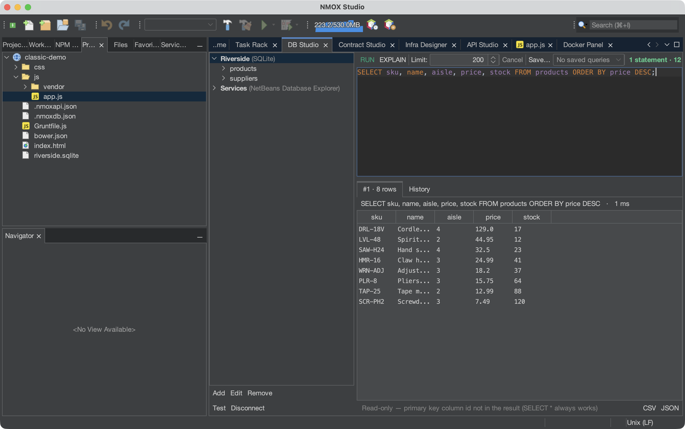
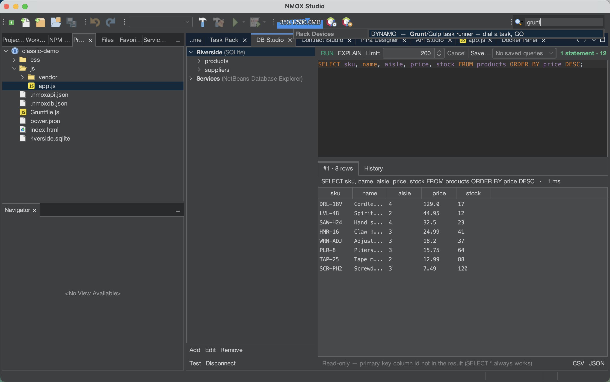

# NMOX Studio — User Guide

How to actually use the thing. This guide walks the features in the order
you'll meet them: install, first launch, projects, the rack, the studios,
the wizards, and the safety nets. For every device's knobs and jacks, see
**[the device reference](devices.md)** (generated from the code — always
current). For contributor/build docs, see the README and CLAUDE.md.

---

## 1. Install

**macOS (recommended):**
```bash
brew tap nmox/nmox-studio https://github.com/NMOX/NMOX-Studio
brew install --cask nmox-studio
```

**Everything else:** grab an asset from the
[latest release](https://github.com/NMOX/NMOX-Studio/releases/latest) —
macOS `.dmg`, Windows `-setup.exe`, Debian/Ubuntu `.deb`, generic Linux
`.tar.gz`. All four bundle their own Java runtime; nothing to install
first. The `-portable.zip` is the one bring-your-own-Java artifact
(needs Java 21+ on PATH, or launch with `--jdkhome <path-to-jdk>`).

## 2. First launch

The IDE opens with the full suite of tabs along the editor area:
**Workbench → Rack → DB → Web3 → Infra → API → Docker** — every major
surface is one click away from minute one. A `~/NMOX` folder is created
as your default workspace; the rack aims there until you open a project.


Window shortcuts, worth learning on day one:

| Shortcut | Opens |
|---|---|
| **⌘I** | Quick Search — reaches everything (see §9) |
| **⇧⌘6** | Contract Studio (Web3) |
| **⇧⌘7** | DB Studio |
| **⇧⌘8** | API Studio |
| **⇧⌘9** | Infra Designer |
| **⌘7** | Navigator outline for the current file |

## 3. Projects

**Opening:** any folder carrying one of 30 recognized manifests opens as a
real project — `package.json`, `Cargo.toml`, `go.mod`, `pom.xml`,
`composer.json`, `foundry.toml`, `bower.json`, `Gruntfile.js`,
`gulpfile.js`, `webpack.config.js`, and friends. A plain folder of HTML
with script tags and **no** manifest opens too, as a STATIC project — the
classic web is first-class, not an error.

**Creating:** *New Project…* offers real scaffolds — React, Vue, Svelte,
Angular, Vanilla JS, Elixir/Phoenix, PHP Web (LEMP, with compose file and
front controller), and Classic Web (jQuery). Each template arrives with
lint/format/test configs wired and a git repo initialized.

**Switching is safe:** if devices are running (a dev server, a watcher),
the IDE asks before switching projects and shuts them down cleanly.
Nothing keeps running behind your back — ever. Even force-quitting the
IDE can't orphan a process (§10).

**Experiments** are throwaway projects that live in `~/.nmox/experiments`:
create one to try an idea with zero ceremony, then either **Promote** it
into a real project folder (it gets a git repo) or **Discard** it. Find
them under the Tools menu.

**.env everywhere:** if your project has a `.env`, devices launched from
the rack get those variables. Edit it and the status line notes that
restarts will pick it up — running processes honestly keep their old
environment.

## 4. The Task Rack

The rack is the heart of the product. Every tool in your workflow — npm,
bundler, test runner, dev server, linter, git, deploy — is a hardware
device in a rack: knobs choose the task, GO runs it, LEDs show state, and
an LCD tells you what happened in words.


**The basics:**
- **Add devices** by dragging them from the palette (it has categories and
  a search filter). Every device has a *How to use* card in the palette.
- **Run something** by pressing a device's GO button. Hover any GO first —
  the tooltip shows the exact command line it will run. No magic.
- **Wire a pipeline:** press **Tab** to flip the rack to its rear. Drag a
  patch cable from one device's **OK** jack to the next device's **GO**
  jack. Now `install → build → test` is one keypress: the chain runs
  itself, stopping at the first failure. Output scrolls on the MONITOR
  device's phosphor screen (stderr in its own color; the TAP knob picks
  which device you're watching).
- **Undo anything structural** with **⌘Z** — device adds, removes,
  rewires. Removing a running device stops its process first.
- **Presets** give you a full wired rack in one click — Ship Gate, Dev
  Intelligence, Monorepo Lanes, LAMP Bench, Web3 Bench, Uptime Watch.
  Patches persist per project automatically.


**Coordination, when your pipeline grows:**
- **QUORUM** joins lanes: it fires only when *all* of its wired inputs
  have succeeded — the classic "wait for lint AND test AND typecheck".
- **ENABLE gates** on long-runners: a dev server's ENABLE input means
  "don't start until this fires".
- **REFLEX** watches files and routes by glob — `src/**/*.css` to one
  chain, `**/*.ts` to another, per lane in a monorepo.
- **ROSETTA** picks the toolchain lane in mixed repos (the rack detects
  Node/Rust/Go/PHP/… per directory and aims each device accordingly).

**Quality gates** turn "looks done" into "is done":
- **VITALS** runs Lighthouse against your served app and *gates* on a
  floor — performance, accessibility, best-practices, SEO, or all.
- **VERITAS** enforces a coverage floor and re-runs exactly the tests
  that failed, by name.
- **GAUNTLET** load-benches an endpoint and gates on throughput.
- **PRISM** gates on bundle size. **BEACON** watches a URL's cert and
  uptime. **PREFLIGHT** is the ship checklist — wire its OK to your
  deploy device and deploys physically can't run until every check is
  green.
- **GOVERNOR** gates Solidity work on gas regressions (`.gas-snapshot`).

**Anything else:** **SOLDER** wraps any shell command as a first-class
device — and the whole rack **exports to GitHub Actions** (your local
pipeline and your CI are the same wiring). **HELM** runs commands on a
remote server over ssh. **TAIL** follows any log file. **WORMHOLE**
tunnels. **PHOSPHOR** is a terminal in the rack.

**The rack stays in sync by itself.** Edit `package.json` and NPM-9000's
script knob updates in place. Edit a `Gruntfile` and DYNAMO re-parses its
tasks. Add a dependency and CRATE's display refreshes. No re-aiming, no
refresh buttons.

## 5. The editor


48 languages highlight properly — the modern stack, the classic stack
(CoffeeScript included), and the whole config layer down to `.env`,
`.editorconfig`, nginx and Apache configs, Dockerfiles, and lockfiles.

- **Completion** is context-aware, and *classic-library-aware*: if your
  project carries jQuery, MooTools, Prototype, Backbone/Underscore, or
  Knockout (via npm deps *or* plain script tags), their APIs appear in
  completion. jQuery 1.x/2.x projects get an honest end-of-life chip, not
  a nag.
- **Navigator outline (⌘7)** shows file structure for 45 file types;
  click to jump.
- **LSP**: open a file whose language server is installed (typescript,
  gopls, rust-analyzer, pyright, …) and you get diagnostics, hover, and
  go-to-definition. Missing a server? The IDE offers the install command
  instead of failing silently.
- **Run Focused Test**: with your caret in a test method, one action runs
  exactly that test — JS/TS, Go, Rust, Python, PHPUnit, and more.
- **Debugging**: Python and Go get real breakpoint debugging (debugpy /
  delve) through the INSPECTOR device or the editor action.
- **`.editorconfig` is honored on save** — indent, charset, final
  newline. Your formatter devices (GLOSS et al.) handle the rest.

## 6. The studios

### API Studio (⇧⌘8)


A Postman-style client that lives with your project. Build requests
(params, headers, body, auth), organize them in collections, and define
`{{variables}}` per environment. Every response is graded on its security
headers — an A–F chip tells you at a glance whether your API sends HSTS,
CSP, and friends. Write assertions per request and run whole collections
as a test suite. Everything persists to `.nmoxapi.json` in your project —
commit it, and your teammate has your workspace. When a dev server starts
in the rack, API Studio offers to set `{{baseUrl}}` for you.

### DB Studio (⇧⌘7)


Connect to SQLite, PostgreSQL, MySQL, MariaDB, MongoDB, or CouchDB —
drivers are bundled, nothing to install. Passwords go **only** to your OS
keychain. Three ways connections find you: add one manually, accept the
offer when your project's `.env` carries `DB_*`/`DATABASE_URL`, or accept
the offer when a database container is running in Docker. The console is
kind-aware (SQL kit for SQL engines, JSON commands for Mongo/Couch), runs
multiple statements with per-statement result grids, and keeps history
plus named saved queries. **Edit rows in the grid** — single-table,
primary-keyed results only (the grid tells you *why* when it's
read-only), and Apply shows you the exact UPDATE statements before
touching anything. EXPLAIN is a button. Export any grid to CSV or JSON.
NetBeans Database Explorer connections (Oracle, Derby, anything with a
JDBC driver) appear in the tree too and run in the same console.

### Contract Studio (⇧⌘6)
Web3 development with a hard safety rule: **the IDE never touches a
private key.** Sends go through your devnet's unlocked accounts only.
Build with Foundry or Hardhat and your compiled contracts appear in the
artifact tree (they re-scan automatically after a FORGE build). Start the
ANVIL device in the rack and the studio connects to the local chain by
itself. **Interact** calls any function from the ABI — decoded returns,
decoded reverts and custom errors, receipts for sends. **Watch** streams
blocks and decodes event logs live. **Oversight** shows the gas report,
EIP-170 size verdicts per contract, and your deployment address book
(persisted to `.nmoxweb3.json`; secret RPC URLs live in the keychain and
never reach the file).

### Infra Designer (⇧⌘9)
Design cloud infrastructure like a Node-RED flow: drag nodes (droplets,
volumes, load balancers, DNS, workers) onto the canvas, wire them, and
see the estimated monthly cost before anything exists. Three providers:
DigitalOcean, Hetzner, Cloudflare — API tokens are stored in your OS
keychain. **Sync** pulls your live resources in; **Refresh** shows drift
between the canvas and reality; **Deploy** creates what's designed (with
cloud-init user data on nodes that take it); **Destroy stack** tears down
with the monthly cost of what you're destroying framed in the confirm
dialog. Right-click a deployed node to copy its ssh command. The design
persists to `.nmoxinfra.json`.

## 7. Docker

The Docker tab is a control panel: engine status, containers, images,
volumes, networks — start, stop, logs, prune. The HARBOR rack device
gives you the same at a glance from the rack. The **Dockerize** tab
generates a production-grade `Dockerfile`, `.dockerignore`, and compose
file tuned to your project's toolchain (Node, PHP-FPM+nginx, and more).
And as noted above: run a Postgres/MySQL/Mongo container, and DB Studio
offers you a ready-made connection.

## 8. Wizards and kits

All under *New File…* / the project context menu, all **idempotent and
never-clobbering** — re-running one updates what it owns and leaves your
edits alone; anything it won't overwrite lands as a `.suggested` sibling.

- **Standards Kit** — `robots.txt`, `sitemap.xml`, web manifest, RFC 9116
  `security.txt`, `humans.txt`, generated from your answers.
- **PWA Kit** — full icon set forged from one source image (including
  maskable variants), a readable service worker (app-shell or
  network-first, your choice), an offline page, and the `index.html`
  wiring to tie it together.
- **Classic Kit** — extend any codebase with jQuery, MooTools, Prototype,
  Backbone+Underscore, or Knockout, either vendored (pinned versions,
  sha256 recorded in a NOTICE file) or as npm deps; plus webpack, grunt,
  gulp, or bower scaffolds.

## 9. Quick Search, status line, and staying oriented



**⌘I is the universal finder.** One box reaches: your projects (recent
and known), every rack device (jump straight to a device's controls),
**live servers** (anything currently serving — hit Enter to open it in
the browser), API Studio requests, DB connections and tables, contracts,
and infra nodes.

**The status line tells you what's alive:** a `⇄ serving N` chip appears
whenever dev servers are up — click it to see URLs and open one. Next to
it: the aimed project and toolchain.

**The Workbench tab** is home base: current project, open and recent
files, recent projects, and launchers for every tool surface.

## 10. The safety nets (things you don't have to do anything for)

- **Session resurrection.** The rack snapshots what's running every few
  seconds. Force-quit, crash, `kill -9` — on relaunch a toast offers to
  restart exactly the session you lost, one click.
- **The orphan guarantee.** Quitting the IDE kills every process it
  started — dev servers, REPLs, chains, watchers — TERM first, KILL if
  they resist, descendants included.
- **BLACKBOX** (add it to your rack) is a flight recorder: every launch
  and exit, durations, trends, and "what changed since the last green
  build" when something breaks.
- **SONAR** shows who owns your ports, cross-referenced with Docker, with
  a one-click kill for the squatter on 3000.
- **Never-clobber files.** All four studio workspace files
  (`.nmoxapi.json`, `.nmoxdb.json`, `.nmoxweb3.json`, `.nmoxinfra.json`)
  reload when edited outside the IDE — but if you have unsaved changes,
  you're asked, never overwritten. A corrupt file is set aside as `.bak`
  and reported, never silently replaced.
- **Daily update check** — quiet, once a day, with a one-click download
  when there's a release. Turn it off in Options ▸ General.

## 11. Learning Spaces

*New Learning Space…* offers 52 built-in tutorials — languages (Python,
Rust, Go, Ruby, Lua, Elixir, Clojure, Solidity, …), frameworks, and
libraries. Each generates a small sample project, a walked tutorial, and
a rack pre-wired with a **real REPL device** — you type into the rack and
a live interpreter answers. The REPL's ENGINE knob selects among 26
interpreters; if one isn't installed, the INSTALL button installs it
right there, streaming progress onto the REPL screen. Spaces live in
`~/.nmox/learn`, apart from your real work.

## 12. When something's wrong

- **Environment Doctor** (Tools menu) live-probes ~32 external tools —
  node, npm, docker, forge, composer, gopls, … — showing found versions
  and the install command for anything missing.
- **Missing language server / missing tool**: the IDE tells you the
  command to run (or offers to run it), never a bare failure.
- **Port already in use**: the error names the process squatting on it
  (SONAR will kill it).
- **A device's GO does nothing**: check its LCD — devices explain
  themselves in words, and the GO tooltip shows the exact command it
  would run, so you can try it in a terminal.
- Logs live under `~/Library/Application Support/nmoxstudio/…/var/log/`
  (macOS) if you need to file an issue.

---

*Found something this guide gets wrong? That's a bug — the project treats
documentation drift as CI-worthy. Please file an issue.*
