# NMOX Studio — User Guide

> Prefer pictures? **[The visual tour](tour.md)** shows every major feature on one page, with real screenshots ([tour.html](tour.html) is the phosphor-styled version for a browser). Prefer doing? **[The Kitchen Sink](kitchen-sink.md)** exercises every surface in one hands-on sitting. Prefer a story? **[A Day at Meridian](a-day-at-meridian.md)** builds one real thing through every area, screenshots from a live session.

How to actually use the thing. This guide walks the features in the order
you'll meet them: install, first launch, projects, the rack, the studios,
the wizards, and the safety nets. For every device's knobs and jacks, see
**[the device reference](devices.md)** (generated from the code — always
current). For contributor/build docs, see the README and CLAUDE.md.

---

## 1. Install

**macOS (recommended):**
```bash
brew trust --cask nmox/nmox-studio/nmox-studio
brew install nmox/nmox-studio/nmox-studio
```

The `brew trust` line is Homebrew's one-time acknowledgment for any
third-party tap — you won't be asked again for updates. The app is
ad-hoc signed but not notarized (no Apple Developer ID yet), so a
quarantined copy would be refused by Gatekeeper on first launch: the
cask clears the quarantine attribute itself in a `postflight` step and
prints that it did, right in the install output. Nothing silent. If you
install from the DMG by hand instead, see the note below — one command
(or right-click → Open) clears it.

**Everything else:** grab an asset from the
[latest release](https://github.com/NMOX/NMOX-Studio/releases/latest) —
macOS `.dmg`, Windows `-setup.exe`, Debian/Ubuntu `.deb`, generic Linux
`.tar.gz`. All four bundle their own Java runtime; nothing to install
first. The `-portable.zip` is the one bring-your-own-Java artifact
(needs Java 21+ on PATH, or launch with `--jdkhome <path-to-jdk>`).

> **macOS, first launch:** the app is ad-hoc signed but not notarized,
> so Gatekeeper asks before it will run. **Right-click the app → Open**
> the first time and confirm, or run
> `xattr -d com.apple.quarantine "/Applications/NMOX Studio.app"`. Either
> clears it for good.

### Updating

Since v1.51.0 the IDE updates itself: **Tools ▸ Plugins ▸ Updates**
(or **Help ▸ Check for Updates**) offers the product modules of any
newer release, fed from the "NMOX Studio Updates" center that points at
the latest GitHub release. Install, restart when prompted, done — no
re-download of the full app. The platform also checks quietly on its
own (weekly by default; change or disable it under **Tools ▸ Plugins ▸
Settings**), separate from the daily one-line version check in
Options ▸ General. Since v2.42.0 every module is signed and since
v2.43.0 the signing certificate ships inside the product, so the
installer runs with no certificate prompts at all (self-signed until
v3.0 — verify any download against the GPG-signed `SHA256SUMS` on the
release page; the key lives in the repo-root `KEYS` file). One honest
caveat: the bundled Java runtime
and launcher only change with a full installer, so a fresh install from
a release asset is still right for major platform jumps.

> **Crossing 2.35.0**: version 2.35.0 moved the underlying platform
> (NetBeans RELEASE310), and the platform cluster ships only in
> installers — so an install at 2.34.5 or older will not see 2.35.0+
> in the in-app updater: the Plugin Installer names the missing
> platform versions and refuses to proceed — measured live on a stock
> 2.34.5 against the real 2.35.0 catalog, install left byte-identical.
> Install fresh or `brew upgrade` once; in-app updates resume from
> there within the 2.35.x line. (One caveat for scripted setups: the
> headless `--modules --update-all` CLI does NOT check platform
> floors and will install-then-fail across this boundary — originals
> land in `update/backup`; don't script updates across a platform
> jump.)

## 2. First launch

From a terminal, `nmoxstudio --open <folder>` launches the app with
that folder opened as a project and the rack aimed at it — the same
door the Welcome page's Open Folder… opens.

The IDE opens with the full suite of tabs along the editor area:
**Welcome → Task Rack → DB Studio → Contract Studio → Infra Designer →
API Studio → Docker Panel** — every major surface is one click away from
minute one. On the left dock: **Project Studio** (file tree + templates),
the **Workbench** home base, and the **NPM Explorer**. A `~/NMOX` folder
is created as your default workspace; the rack aims there until you open
a project.


Shortcuts, worth learning on day one (they're also all listed right on
the Welcome tab):

| Shortcut | Opens |
|---|---|
| **⌘I** | Quick Search — reaches everything (see §9) |
| **⌘9** | Task Rack |
| **⌥⌘0** | Workbench |
| **⌥⌘3** | IRC chat client |
| **⌥⌘4** | Browser (in-app WebKit, with DevTools) |
| **⌥⌘5** | Block Studio |
| **⌥⌘6** | Contract Studio (Web3) |
| **⌥⌘7** | DB Studio |
| **⌥⌘8** | API Studio |
| **⌥⌘9** | Infra Designer |
| **⌘8** | Docker Panel |
| **⌘7** | Navigator outline for the current file |
| **⇧⌘N / ⌥⌘O** | New Project… / Open Folder… |
| **⇧⌘E / ⇧⌘L** | New Experiment… / New Learning Space… |

## 3. Projects

**Opening:** any folder carrying one of 60 recognized manifests opens as a
real project — `package.json`, `Cargo.toml`, `go.mod`, `pom.xml`,
`composer.json`, `foundry.toml`, `bower.json`, `Gruntfile.js`,
`gulpfile.js`, `webpack.config.js`, and friends — including the contract
chains' own manifests: a cloned Aiken repo (`aiken.toml`) or Clarinet
repo (`Clarinet.toml`) opens with its real lanes (`aiken check`,
`clarinet check`) wired, and a Tact repo rides its npm scripts. A plain folder of HTML
with script tags and **no** manifest opens too, as a STATIC project — the
classic web is first-class, not an error.

**Creating:** *New Project…* offers real scaffolds — React, Vue, Svelte
(Vite + Svelte 5, runes syntax), Angular, Vanilla JS, Elixir/Phoenix,
PHP Web (LEMP, with compose file and front controller), and Classic Web
(jQuery). Each template arrives with lint/format/test configs wired and
a git repo initialized — one scaffold commit that, when the wizard runs
the install for you, also holds the lockfile, so your first `git status`
is clean.

**Switching is safe:** if devices are running (a dev server, a watcher),
the IDE asks before switching projects and shuts them down cleanly.
Nothing keeps running behind your back — ever. Even force-quitting the
IDE can't orphan a process (§10).

**Experiments** are the fastest way to try a stack — the first tool to
reach for when something is new. **File ▸ New Experiment…** (⇧⌘E, and
the first entry on the Welcome tab) picks a template and generates a
throwaway project under `~/.nmox/experiments`: no git, no recents,
already trusted, dependencies installed so the **first Run just
works** — and it opens on its own `EXPERIMENT.md` walkthrough telling
you what to press, which file to change, and where this stack's IDE
intelligence lives (an Express experiment points at Test in API
Studio and `process.env.` completion; a Vue one at the SFC style-block
powers). Keep what turns into something — **File ▸ Experiments…** ▸
**Promote** moves it out and git-inits it, **Duplicate** forks a full
copy beside the original to try a second approach, and **Discard** the rest;
the shelf shows each one's age and its measured disk cost, an empty
shelf offers to start one, and re-opening an experiment brings its
walkthrough back. Want the guided path instead? The dialog fronts the
93 Learning Spaces.

Both shelves are one ⌘I away — type an experiment's or space's name
and Enter aims the studio there (experiments quietly, keeping the
shelf's no-recents promise; spaces loudly like any project) — and
both graduate the same way: **Promote…** moves a keeper out of its
shelf home, drops the marker, and git-inits it into an ordinary
project, with anything still running there stopped first so nothing
keeps writing into the old path. The Learning Spaces manager
(File ▸ Learning Spaces…) carries the same teaching header as the
experiments shelf — count, disk cost, each space's age — and an
empty shelf offers the 93-space catalog instead of a dead end.

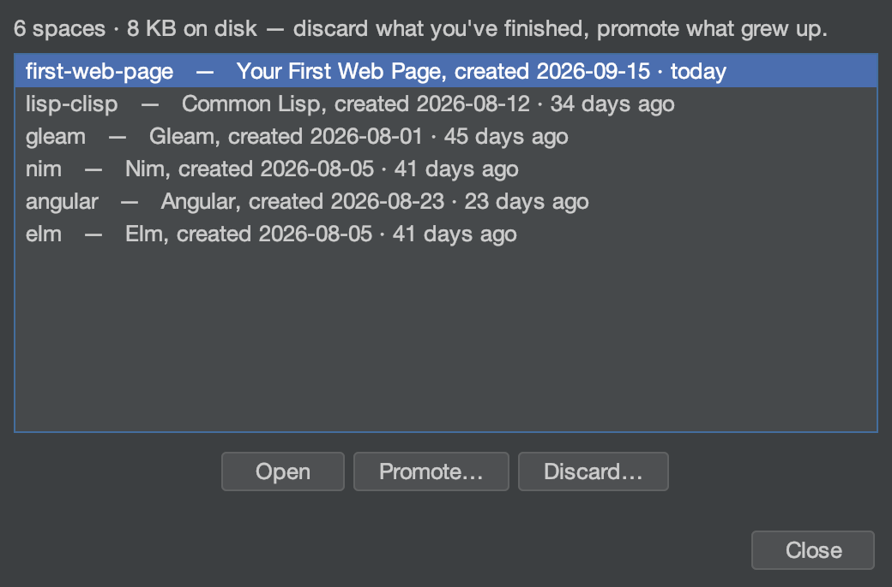

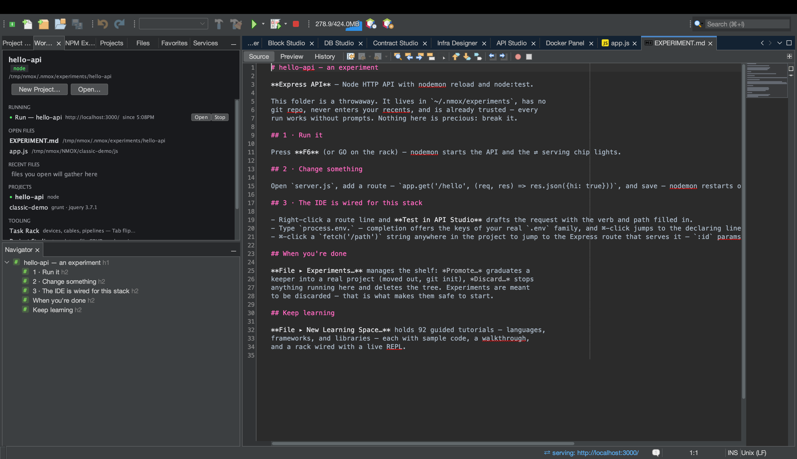

**Run, Build, Test — and Stop:** the toolbar's ▶ (F6) runs the aimed
project the way its toolchain runs: a `start` script if package.json
has one, `cargo run`, `go run`, `dotnet run`, and for a plain folder of
HTML a small static server on the first free port from 8080. Build,
Test and Clean sit beside it and in the Run menu. A dev server that
announces its address lights the ⇄ chip on the status line and opens
the page in the in-app Browser. Everything runs behind the Workspace
Trust prompt the first time. A run that could not start (the tool is
not on your PATH) says so on the status line and raises a balloon whose
click opens the Environment Doctor; the reason itself is in the Output
tab (one balloon per wall — pressing Run again replaces it, never stacks
another). A Node project that declares dependencies but has no
`node_modules` yet — a fresh clone, a wizard project whose install was
skipped — is refused out loud before it can die in "Cannot find
module", and pointed at **NPM Explorer ▸ Install** — the balloon that
comes with it runs the install on click, through the same trust gate.
Every command the
product runs for you also shows in the status bar's progress area with
a Cancel that stops exactly that command. To stop: the ■ right of Debug on the
toolbar (⌥⌘.) stops every running command at once (and says what it stopped
on the status line), and **Run ▸ Stop Build/Run** — the platform's own
item — stops one and offers **Repeat** afterwards. The ■ sees every
command the product starts for you: the ▶'s runs, a script
double-clicked in the **NPM Explorer** or run from a package.json line
(Run Script), a Focused Test or a Tests-window run, and — since
v2.74.0 — every rack device's run too (a device stopped this way reads
STOPPED on its faceplate, as if you had pressed its own STOP, and so
does the rack's own **Stop All** since v2.75.0 — and since v2.84.0 the
RECORD agrees: the Output tab's last line reads `[exit N] stopped`,
the flight recorder files a STOPPED, `run_history` says `stopped`,
and neither BLACKBOX nor ORACLE mistakes your own stop for a
failure); the Workbench's
RUNNING section and ⌘I list them all. A script the
NPM Explorer started prints a local address the same way the ▶ does
(the ⇄ chip lights, Live Servers sees it), shows **● running since
HH:mm** on its row, offers **Stop Script** on right-click, and refuses to start a
second copy while the first runs; Enter on a selected script runs it
too. It also arms the Browser the way the
▶ does: the script's first printed address opens in the in-app Browser.
And while a new project's or experiment's dependency install is still
running, both the ▶ and the Explorer refuse to run the project — the
status line says so and names the ■ — because a run against a
half-written `node_modules` only ends in a wall of missing modules. The ■ also sees the installs the
product starts for you (a new project's or experiment's `npm install`,
Project Configuration's add/remove, a language-server install) and an
`ng generate` — hover it and the tooltip names exactly what a press
would stop, and since when each has run. Each NPM Explorer run gets its own Output tab named like
the ■'s entry.

**.env everywhere:** if your project has a `.env`, devices launched from
the rack get those variables. Edit it and the status line notes that
restarts will pick it up — running processes honestly keep their old
environment.

## 4. The Task Rack

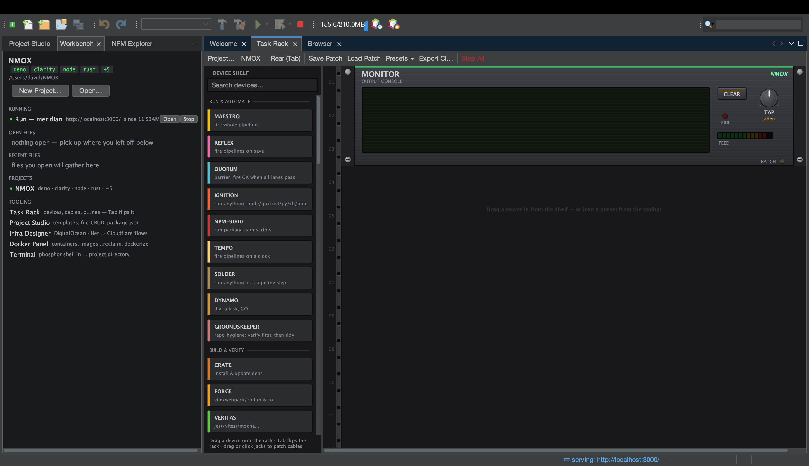

The rack is extensible: third-party plugins can add devices (install their NBM via Tools ▸ Plugins). To write one, see [device-spi.md](device-spi.md).

The rack is the heart of the product. Every tool in your workflow — npm,
bundler, test runner, dev server, linter, git, deploy — is a hardware
device in a rack: knobs choose the task, GO runs it, LEDs show state, and
an LCD tells you what happened in words.


**The basics:**
- **Add devices** by dragging them from the palette (it has categories and
  a search filter). Every device has a *How to use* card in the palette.
- **Run something** by pressing a device's GO button. Hover any GO first —
  the tooltip shows the exact command line it will run. No magic.
- **Wire a pipeline:** press **Tab** to flip the rack to its rear. Drag a
  patch cable from one device's **OK** jack to the next device's **GO**
  jack. Now `install → build → test` is one keypress: the chain runs
  itself, stopping at the first failure. Output scrolls on the MONITOR
  device's phosphor screen (stderr in its own color; the TAP knob picks
  which device you're watching).
- **Undo anything structural** with **⌘Z** — device adds, removes,
  rewires. Removing a running device stops its process first.
- **Presets** give you a full wired rack in one click — Ship Gate, Dev
  Intelligence, Monorepo Lanes, E2E Loop, LAMP Bench, Web3 Bench,
  Uptime Watch. Patches persist per project automatically.


**Coordination, when your pipeline grows:**
- **QUORUM** joins lanes: it fires only when *all* of its wired inputs
  have succeeded — the classic "wait for lint AND test AND typecheck".
- **ENABLE gates** on long-runners: a dev server's ENABLE input means
  "don't start until this fires".
- **REFLEX** watches files and routes by glob — `src/**/*.css` to one
  chain, `**/*.ts` to another, per lane in a monorepo.
- **ROSETTA** picks the toolchain lane in mixed repos (the rack detects
  Node/Rust/Go/PHP/… per directory and aims each device accordingly).

**Toolchain-native lanes.** The lint and format devices (PURITY,
GLOSS) on AUTO speak your project's own toolchain rather than reaching
for Node tooling everywhere: a Deno workspace lints and formats with
`deno lint` / `deno fmt`, a Cargo project with `cargo clippy` /
`cargo fmt`, a Go module with `go vet` (or `golangci-lint` when the
project carries a `.golangci` config) and `gofmt` — whose
list-only-exits-zero quirk the CHECK verdict compensates for by
reading the output. A `biome.json` flips the Node lanes to Biome, and
the explicit knob positions always win over AUTO. A ROSETTA override
outranks a stray manifest, so a Go module that keeps a `deno.json`
around for scripts still vets as Go.

**Your own devices (new in 2.0.0).** The shelf is extensible with a
text editor: any `*.json` in `~/.nmox/devices.d/` becomes a real device
— knobs, buttons, LEDs, ports, patch cables, saved into the patch and
reachable from ⌘I. Declare a command as an argv array, name a knob, and
`{{knob}}` substitutes into it when the button is pressed.

The laws stay with the host, not your file: **workspace trust gates the
first spawn in a project exactly as it does for a built-in**, the button
role picks its colour, and ports are checked against the same lexicon.
The format refuses what it cannot read honestly — a shell line, a tool
named by path, an unknown variable — and skips that file whole with the
reason in the IDE log, so a device on your shelf always does what its
label says. See [device-files.md](device-files.md) for the reference and
[Write your own device](tutorials/your-own-device.md) for a walkthrough;
for devices that need real state (custom painting, polling, long-lived
connections) the Java [Device SPI](device-spi.md) is still there.

**Quality gates** turn "looks done" into "is done":
- **VITALS** runs Lighthouse against your served app and *gates* on a
  floor — performance, accessibility, best-practices, SEO, or all.
- **VERITAS** enforces a coverage floor and re-runs exactly the tests
  that failed, by name.
- **GAUNTLET** load-benches an endpoint and gates on throughput.
- **PRISM** gates on bundle size. **BEACON** watches a URL's cert and
  uptime. **PREFLIGHT** is the ship checklist — wire its OK to your
  deploy device and deploys physically can't run until every check is
  green.
- **GOVERNOR** gates Solidity work on gas regressions (`.gas-snapshot`).

**Anything else:** **SOLDER** wraps any shell command as a first-class
device — and the whole rack **exports to GitHub Actions** (your local
pipeline and your CI are the same wiring). **HELM** runs commands on a
remote server over ssh. **TAIL** follows any log file. **WORMHOLE**
tunnels. **PHOSPHOR** is a terminal in the rack. If the command prints a local address (npx http-server, python -m http.server, npm run dev through NPM-9000, gulp serve through DYNAMO), the ⇄ chip lights like any serve device — ⌘I Live Servers, VITALS and BEACON see it — and goes dark when the run ends; HELM never announces (a remote host's localhost is not yours). STOP reads STOPPED whatever the process's exit code. Picking a serving from the chip or from ⌘I Live Servers opens it in the in-app Browser (the system browser only when none is wired up); the Docker panel's published port and SONAR's Browse open the same way. A serving the ▶ or an NPM script started also carries a **Stop** in the chip's menu, right under its Open; a rack device's server keeps its faceplate STOP.

**The rack stays in sync by itself.** Edit `package.json` and NPM-9000's
script knob updates in place. Edit a `Gruntfile` and DYNAMO re-parses its
tasks. Add a dependency and CRATE's display refreshes. No re-aiming, no
refresh buttons.

### ORACLE — explain the last failure


**ORACLE** is AI assistance the rack way: a device that explains the error
currently on the MONITOR bus, not a chat sidebar. When a run fails, press
**EXPLAIN** and ORACLE asks Anthropic's API what went wrong and the
concrete next step to fix it. A short verdict lands on the display; **VIEW**
opens the full answer. **MODEL** dials **HAIKU** (cheap, fast — the default)
or **SONNET** (stronger). EXPLAIN is blue: it reads and asks, it never
touches your project.

**Set your key** with **KEY…** — it is stored in your OS keychain (macOS
Keychain, GNOME Keyring, Windows Credential Vault), never on disk and never
in any project file. Alternatively, ORACLE reads the environment variable
**`ANTHROPIC_API_KEY`**, or **`CLAUDE_API_KEY`** if the first is unset (a
stored key wins over both). No key, no call — ORACLE just says so.

**What ORACLE sends, and the whole of it.** The first time you press
EXPLAIN, ORACLE asks for a one-time consent, because sending your build
output to an external service is a choice only you can make. It sends
**only**:

- the failing command (e.g. `npm test`);
- its exit code;
- up to five sampled lines of error output;
- the device (task lane) that ran it (e.g. `VERITAS`);
- the project's name.

It does **not** send your source files, your environment variables, your
`.env`, or any secret. Your API key authenticates the request and is never
part of the message. The consent is remembered; everything is off until you
press the button.

If the network is down, the key is wrong, or the model declines, ORACLE
says so plainly on its display — it never fails silently and never crashes.

**Keep asking.** After a successful EXPLAIN, the **VIEW** button opens
the diagnosis as a conversation: ask follow-ups about the same failure
("which file first?", "what does that flag do?") and each turn carries
the full history, so the answers stay anchored to your actual error.
Same bounds and gates as the editor's Ask ORACLE; the transcript shows
exactly what the model was told, starting with the disclosed failure
context itself.

**Ask ORACLE about your code.** The same assistant reaches the editor:
select any code, in any language, right-click, and choose **Ask ORACLE
About Selection…**. Type a question (or leave it empty for a plain
explanation), pick a depth — Fast (Haiku, the default) or Deep
(Sonnet), remembered for next time — and a conversation window opens — keep asking follow-ups
about the same selection, up to ten exchanges (the cap surfaces in the
transcript, never silently). This flow has its **own**
one-time consent, separate from the failure flow — the failure consent
promises your source never leaves the machine, so sending a selection
must earn its own yes. It sends only the code you selected (capped),
the file's name and language, and your question — never the rest of the
file, other files, or your environment. Same key, same honesty: no key
or no consent and it says so; nothing is ever sent without your click.

**Let ORACLE edit your code.** Right-click a selection and choose
**Edit with ORACLE…**: say what to change ("use const", "add error
handling", "convert to async/await") and the proposed replacement
arrives as a BEFORE/AFTER preview — nothing touches your file until
you press **Apply**, which replaces exactly the selection as one undo
unit (⌘Z brings it straight back). The refusals are features: a
selection over the 8,000-character cap is refused outright rather than
truncated (a rewrite of a shortened selection would silently delete
the tail), a reply that isn't exactly one code block is refused rather
than guessed at (the model's prose "I can't do that from the selection
alone" is shown as itself), and if the file changed while ORACLE was
thinking, Apply refuses and asks you to re-select — your buffer is
never patched blind. Same consent, same key, same disclosure as Ask
ORACLE: only the selection, the file's name, its language, and your
instruction ever leave the machine.

**Let ORACLE complete at the caret.** Press **⌥⌘G** (or right-click ▸
**Complete with ORACLE**) and the code around the caret is sent once
— 6,000 characters before it, 1,500 after, clipped from the far ends
— after the same consent Ask and Edit use. The reply appears as gray
ghost text at the caret: **Tab** inserts it (one undo unit); typing,
Backspace, moving the caret, or clicking dismisses it (Escape is
swallowed by the window system inside a docked editor, so it is not
the dismiss key). A
multi-line completion shows its first line with "… +N lines"; Tab
inserts all of it. Nothing touches your file until Tab. There is no
always-on stream: no keystroke ever leaves the machine on its own, and
each press is one bounded send you asked for.

**Let ORACLE draft your commit message.** Click the git branch chip on
the status line and choose **Draft Commit Message with ORACLE…**: the
STAGED diff (and only the staged diff — up to 12,000 characters, with
truncation confessed) goes up behind its own one-time consent, and the
drafted subject-and-body lands in an editable dialog with a **Copy**
button. Nothing in this flow ever runs `git commit` — you stay the
committer. Nothing staged? It says so and sends nothing.

**Pull requests, from the same chip.** **Pull Requests…** lists the
repo's open PRs using your own `gh` CLI — your login, your config; the
IDE never stores a forge token. Select one and **Open in Browser**
shows it in the in-app Browser; **Review Threads…** shows its review
comments as plain text (path:line, author, date, body — read-only,
nothing is ever posted); **Checkout…** runs `gh pr checkout` in the
aimed repo after two guards: a tree with modified or staged files is
refused out loud (untracked files alone are fine — git leaves them in
place), then a confirm names the PR and branch with No as the default.
If `gh` itself fails after staging files (it does on a shallow clone),
the attempt's leftovers are reset and the tree is as it was — the
status line says so beside gh's own reason.
No `gh`, not signed in, or not a GitHub repo? The refusal tells you
exactly which.

**The web that's coming is already typed here.** JavaScript completion
knows `Temporal`, `navigator.gpu` (WebGPU), `document.startViewTransition`,
and the built-in AI task APIs (`LanguageModel`, `Summarizer`,
`Translator`) — with snippets to match (`viewtransition`, `temporal`,
`gpu`, `llm`, `importjson`). And `.wit` files — the WebAssembly
Component Model's interface language — open as first-class citizens:
highlighting, comment toggling, completion, and an outline of every
interface, world, and record. The bets behind these live in
docs/engineering/futures-2031.md.

**Your import map is navigable.** In a project whose entry page
carries a `<script type="importmap">`, ⌘-click a bare specifier like
`'lit'` in any import statement to jump to its mapping, and press
⌃Space inside the import quotes to list every mapped specifier with
its target. Relative paths stay out of it — they never needed the map.

**The newest CSS completes too.** Anchor positioning (`anchor-name`,
`position-area`, `position-try-fallbacks`…), view transitions,
scroll-driven animations (`animation-timeline`, `animation-range`…),
`field-sizing`, `interpolate-size`, and `@starting-style` all complete
at a property position with a one-line meaning beside each — and after
the colon, that property's keyword values. The platform's own
checker may still underline them as unknown; the popup is right.

**Point an agent at your IDE.** Tools ▸ Agent Port (MCP)… starts a
local server that an AI agent (anything that speaks MCP) can connect
to and READ your project's live state: what's aimed (and which
toolchain and package manager it uses), what ran lately (the flight
recorder's launches and exits with their codes and durations — a run
you stopped yourself reads `stopped`, never `failed`), what's serving,
what's running (every command the toolbar ■ would stop, with when it
started), what you have open in the editor (the active file, unsaved
tabs flagged), where a name is declared (`find_symbol` answers from
the same Go to Symbol index as ⌥⇧⌘O), one file's structure
(`outline`, the Navigator's own items), which lines contain a literal
(`search_text`, bounded and every cap reported), what failed last,
what the linters found, what's on the rack. Start with the
`ide_context` tool for a one-call overview; every answer is typed and
structured, not just text, and every tool is annotated read-only so a
well-behaved agent knows it can call them freely.

**What gates it.** The port is off until you start it, listens on
loopback only, and hands you a token the agent must present — copy the
ready-made `.mcp.json` from the dialog. While it listens the status
line shows **⌁ agent port :N** (click it for the dialog, or to stop);
it also dies when the IDE quits. It is strictly read-only — nothing an
agent asks can run a command or change a file, and the build fails if
that ever changes — and it keeps the editor's own secret law: `.env`
files, package-manager rc files and private keys are never searched,
never listed, never outlined.

**A complete MCP server.** Besides tools it exposes **resources**
(browsable URIs like `nmox://context`, `nmox://runs`, `nmox://editor`
and `nmox://diagnostics` an agent attaches as context, plus templates
`nmox://outline/{file}` and `nmox://search/{query}` for the two tools
that take an argument, with **argument completion** for the file slot
from the project's own files), **prompts** (ready-made templates like
*Diagnose the last failure* that fold your IDE's live state into the
question; *Where is a symbol declared* takes a name and folds the
symbol hits in), and an **event stream**: an agent can **subscribe**
so a run starting, a server going live, or an attached outline's file
changing is pushed instead of polled for, and the same stream carries
every run's start and end as **log messages** — its whole output once
the agent asks for the `debug` level. It drops into any MCP client the
idiomatic way. The [Agent Port tutorial](tutorials/agent-port.md)
walks it by hand, and `scripts/agent-port-walk.mjs` walks it with the
official client.

## 5. The editor


70+ languages highlight properly — the modern stack, the classic stack
(CoffeeScript included), and the whole config layer down to `.env`,
`.editorconfig`, nginx and Apache configs, Dockerfiles, and lockfiles.

- **Completion** is context-aware, and *classic-library-aware*: if your
  project carries jQuery, MooTools, Prototype, Backbone/Underscore, or
  Knockout (via npm deps *or* plain script tags), their APIs appear in
  completion. jQuery 1.x/2.x projects get an honest end-of-life chip, not
  a nag.
- **Navigator outline (⌘7)** shows file structure for 58 file types;
  click to jump.
- **Minimap** — a silhouette of the whole file beside every editor's
  scrollbar (one bar per line, indent to length, the visible band drawn
  over it); click or drag it to scroll. The whole document always fits
  the strip: rows shrink as the file grows, and past 40,000 lines the
  strip shows an ellipsis rather than reading on. View ▸ Minimap turns
  it off and on for every open editor at once.
- **Sticky scroll** — the declarations enclosing the top of the view
  (the class, then the method you scrolled into) stay pinned above the
  text, up to three rows of the source's own lines; click a row to jump
  to it. The rows are the Navigator outline's items, so they exist for
  the same 58 file types; the bar disappears when nothing encloses the
  top line. View ▸ Sticky Scroll toggles it for every open editor.
- **Go to Symbol (⌥⇧⌘O**, or Navigate ▸ Go to Symbol…**)** jumps to any
  function, class, rule, or heading in the whole aimed project by
  typing its name — every name the outline can see, in every file, with
  prefix/camel-case/wildcard matching. The same symbols answer in Quick
  Search (⌘I). The index is bounded and honest: `node_modules` and its
  heavy siblings are skipped, and on a very large project the dialog
  says it indexed the first 2,000 files rather than pretending it read
  everything.
- **The Tests window (⌥⌘2**, or Window ▸ Tests**)** shows every test in
  the aimed project *before anything runs* — discovered with the same
  patterns Run Focused Test uses, so the window never lists a test it
  cannot run. Double-click opens the declaration; **Run** executes
  exactly that test through the same trust gate as the editor gesture,
  and **Stop** ends the test runs (only those — never the dev server)
  while one is live.
  On a very large project the footer says the listing is partial rather
  than pretending it read everything.
- **LSP**: open a file whose language server is installed (typescript,
  gopls, rust-analyzer, pyright, …) and you get diagnostics, hover, and
  go-to-definition. Missing a server? The IDE offers the install command
  instead of failing silently.
- **Run Focused Test**: with your caret in a test method, one action runs
  exactly that test — JS/TS, Go, Rust, Python, PHPUnit, and more.
- **`.editorconfig` is honored on save** — indent, charset, final
  newline. Your formatter devices (GLOSS et al.) handle the rest.
- **Color literals show their color** in CSS, SCSS, and Less: every
  `#hex`, `rgb()`, `hsl()`, `hwb()`, `oklch()`, `oklab()`, `lab()`,
  `lch()`, and named color is painted as the color it names, right
  where it's written — and `color-mix()` paints the actual computed
  mix, with its component colors layered inside. Comments stay prose, and
  identifiers that merely contain a color name (`$red-dark`) never
  light up. ⌘-click a literal to open a **color picker** seeded with
  that color — picking replaces the literal in its authored form (hex
  stays hex, `rgb()` stays `rgb()`, `hsl()` stays `hsl()`) as a
  single undoable edit. In the Browser DevTools, selecting an element shows a
  **WCAG contrast verdict** (ratio plus AA/AAA for normal and large
  text) computed from its own colors.
- **Compile to CSS**: right-click an .scss stylesheet and compile it
  to its sibling .css — the gesture also arms recompile-on-save, so
  every later ⌘S keeps the .css fresh (and, with a local page open in
  the Browser, repaints it — scss to pixels with no terminal).
  Partials (`_name.scss`) are refused honestly; sass errors land on
  the status bar in sass's own words.
- **stylelint findings arrive on their own**: give a project any
  stylelint config and diagnostics land in your stylesheets on
  file-open, rule names included — the modern linter that understands
  nesting, `@container`, and the new color functions, reporting beside
  the editor's built-in checks. Install once: `npm i -g stylelint-lsp
  stylelint`.
- **The Browser is a design surface too**: a toolbar dropdown
  constrains the page to a device viewport (iPhone/Android/Tablet/
  Laptop, real CSS pixels, media queries fire for real), and saving
  any web file auto-reloads a local page — the save → see loop with
  no manual refresh. Remote pages never auto-reload.

### Expand Abbreviation (⌥⌘E)

Emmet-style expansion in HTML **and Angular templates**: type
`ul>li.item$*3` and press **⌥⌘E** — the abbreviation becomes real,
indented markup with the caret parked at the first useful empty spot.
The grammar covers elements (dashed custom elements included), `.class`
and `#id` (a leading `.` or `#` implies a `div`), attributes
`[href=/ target=_blank]`, text `{hi}`, child `>`, sibling `+`,
multiplication `*3` with `$` numbering (`$$` zero-pads), grouping
`(...)`, void elements, and sensible default attributes for
`a`/`img`/`input`/`link`/`iframe`/`label`. It is auto-pair aware — the
caret sitting before an auto-closed `}` still expands — and it refuses
honestly: a bare word only expands when it *is* an HTML element, and
anything unparseable leaves your text untouched with a status-line
hint. `lorem` and `lorem5` emit deterministic placeholder text — the
canonical passage, capitalized and period-closed, the same every press
so diffs stay honest; `ul>li*3>lorem4` fills a whole mock list. And
climb-up `^` returns one level per caret — `header>h1^main` puts main
beside header, `div>ul>li^^footer` climbs two — with two honest
refusals where real Emmet silently clamps: climbing past the root, and
climbing out of a `(...)` group (put the sibling after the group). The
grammar's deliberately-out list is now empty.

The same chord speaks **CSS** in stylesheets (v1.336.0 closed the
grammar's recorded "CSS abbreviations" out): in any CSS/SCSS/Less pane,
`m10-20` → `margin: 10px 20px;`, `df` → `display: flex;`, `c#f00` →
`color: #f00;`, `w100p!` → `width: 100% !important;`. The grammar is an
exact-match subset — a keyword table of the declarations designers type
all day plus a numeric family (`px` default; `p`/`e`/`r` suffixes for
`%`/`em`/`rem`; margin and padding take up to four `-`-separated
values) — because a fuzzy match that guesses wrong mutates your
stylesheet. Chain declarations with `+`: `df+aic+jcc` expands to three
lines at your indent, and one bad part refuses the whole chain — never
a partial expansion. Anything it can't expand exactly is refused with the same
status-line hint, and a token after a `:` never expands — that's a
value being typed, not an abbreviation.

### Design tokens (custom properties)

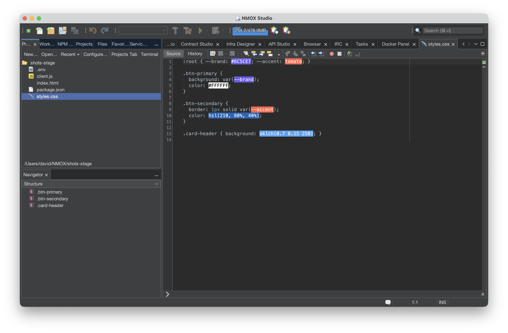

Your design system's `--tokens` are first-class in every stylesheet
dialect. Type `var(` and complete from the **whole project's** custom
properties — each row shows the token's value, behind a color swatch
when the value is a color, so the popup doubles as a legend of the
design system (invoke with ⌃Space; document tokens list first).
**⌘-click** a `var(--token)` usage to jump to its declaration, same
file or across the project. And `var()` usages whose token declares a
color **paint as that color** right in the editor — the swatch resolves
through the indirection (document-local by design; cross-file
resolution rides the completion and the jump, which run off the paint
path).

### The class attribute knows your stylesheets

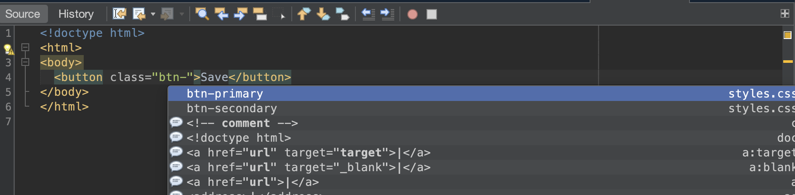

In HTML, Vue, Svelte, and Angular templates, `class="…"` completes
from the classes your project's stylesheets **actually declare** —
CSS, SCSS, Less, indented Sass, and the markup family's own `<style>`
blocks — each row naming its declaring file (⌃Space; this file's
classes list first). **⌘-click** a class in the attribute to land on
its rule, or ⌘-click a `.selector` in a stylesheet to land on its
first `class="…"` usage in your markup — the status line reports the
count when there are more. Classes only, deliberately: `#id` selectors
are textually indistinguishable from hex colors without a full value
parser, so the id attribute waits rather than guessing.

**Rename Class…** (right-click any class token, in markup or a
stylesheet) rewrites every whole-token span across the project — attr
usages, `<style>` selectors, stylesheet rules — and reports the count
per file. It refuses out loud rather than guessing: renaming onto an
existing class (the rules would merge), a project larger than the
bounded file census (a partial rename is corruption), or unsaved
changes in any affected file. Open, unmodified editors reload the
renamed text themselves.

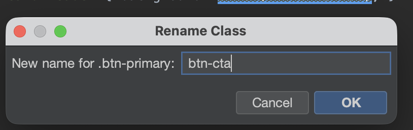

### Run Script, from the caret

Right-click any line inside package.json's `"scripts"` object and
**Run Script** runs it — through the same Workspace Trust gate and
package-manager detection (corepack pin, then lockfile) as every other
runner. A dependency named like a script never runs, and a `scripts`
key nested in some other object never qualifies; the refusals say so
on the status line.

### Env keys, first-class

Type `process.env.` (or Vite's `import.meta.env.`) in any JS/TS file
and completion offers the keys your project's real `.env` family
declares — `.env`, `.env.local`, and the mode variants — each row
naming its declaring file, with values truncated in the popup so a
secret is reminded, never disclosed. **⌘-click** a key to land on its
declaring line. `fetch('/api/…')` gets the same treatment one gesture
over: ⌘-click the path string and land on the Express route that
registers it.

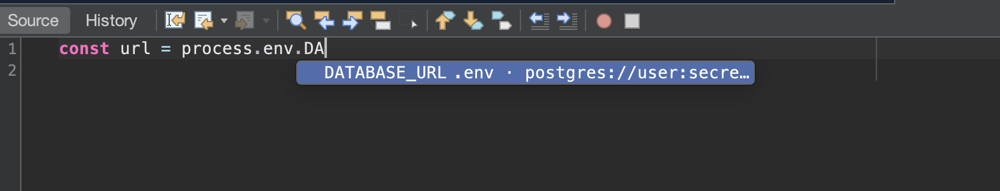

### Angular templates, first-class

`.component.html` files are their own language in NMOX Studio, lit by
the Angular team's own grammars — `@if`/`@for` blocks, structural
directives, and interpolations all highlight, and `@`-block /
`*`-directive completion appears in any project with an
`angular.json`.

- **Template type-checking**: install the Angular Language Service
  when the IDE offers it (the install runs *inside your project* —
  the service must match your workspace's Angular and TypeScript
  versions; note it needs TypeScript 5.x). After that, binding to a
  property that doesn't exist on the component class draws the Angular
  compiler's own "Did you mean…?" error as you type.
- **⌘B in a template** jumps to the definition — `{{ title }}` lands
  on the `title` field in the component class.
- **Right-click ▸ Open Angular Template** in a component class opens
  the template its decorator points at (`templateUrl` wins; the
  same-basename sibling is the fallback). **Right-click ▸ Open
  Component Class** in a template goes the other way. Misses are
  reported on the status line — an inline-template component has no
  file to open, and the action says so.

### Vue and Svelte components, first-class

`.vue` and `.svelte` files get the whole keyboard (since v2.14.0 —
they carry real editor kits, so ⌘/ toggles comments and **⌥⌘E expands
Emmet abbreviations** right in your component markup, in every keymap
profile). Auto-pairs type and delete symmetrically, and **⌃Space
completion speaks the framework**: Vue directives with their
shorthands (`v-if`, `v-model`, `@click`, `:class`), the Composition
API and `<script setup>` macros, and the built-in components; Svelte
5 runes including the dotted forms (`$state.raw`, `$effect.pre`),
template blocks and directives.

**Vue diagnostics that actually arrive:** when a `.vue` file opens in
a trusted workspace with no language server yet, the IDE offers a
one-click project-local install of `@vue/language-server@2` with
TypeScript (it must be the 2.x line — the 3.x server only serves
VS Code's tsserver-bridge arrangement and publishes nothing to any
other editor). With it installed, the server runs against your
project's own TypeScript and a typo'd property in a template gets the
real compiler squiggle. Svelte's `svelteserver` works with its
defaults — install it globally or let the project pin it.

### Debugging with real breakpoints

Click the gutter (or **⌘F8**) to set a breakpoint, right-click →
**Debug File (breakpoints)**, and the program stops there — with the
call stack, the variables in scope, stepping, and watch expressions you
can evaluate against the paused program.


Debugging a **server** works the same way: run *Debug File*, hit the
endpoint from anywhere (curl, a browser, API Studio), and the breakpoint
stops the request mid-flight. The debuggee's console — the `listening on
3100` line and everything after it — appears in the **Output** window,
which opens with the session.

> **Breakpoints are managed in the gutter.** The IDE's *Breakpoints*
> window (Window ▸ Debugging ▸ Breakpoints) does not yet list breakpoints
> from the debug adapters, so use the gutter to add and remove them. This
> is a NetBeans platform limitation, not an NMOX one — it affects Python
> and Go breakpoints identically.

- **JavaScript and TypeScript** debug through
  [js-debug](https://github.com/microsoft/vscode-js-debug) — the same
  engine VS Code uses — **bundled in the box**. Nothing to install: if
  `node` runs your file, you can debug it. (TypeScript works where node
  runs it directly, or via source maps on compiled output.)
- **Python** uses debugpy, **Go** uses delve. Install those yourself;
  the IDE tells you the command if they're missing.
- The program runs with your project root as its working directory, so
  `require`, imports, and `node_modules` resolve exactly as they would
  from a terminal.
- Debugging runs your project's code, so the first time in a folder the
  IDE asks whether you trust it — the same gate the rack uses before it
  fires a device. **Keep Safe** stops the launch before anything runs.


The **INSPECTOR** rack device is a different tool for a different job: it
starts your program with a debug port open (`node --inspect`, `dlv`,
`debugpy`) and prints the endpoint, so you can attach an external client
like chrome://inspect. Use the editor action for breakpoints in NMOX
Studio; use INSPECTOR when something else does the debugging.

One limit worth knowing: a debug session follows one process. Child
processes your program spawns keep running, undebugged, rather than
pausing for an attach that never comes.

### Debugging in the browser

Browser-side JavaScript debugs the same way: right-click an `.html`,
`.js`, or `.ts` file → **Debug in Chrome (breakpoints)** and the IDE
launches Chrome (or Edge/Chromium — whichever is installed) at your
page. Breakpoints set in the editor stop the code running *in the
browser*, with the same stack, variables, and stepping.


Where the browser goes, most-live source first: if a rack serve device
(IGNITION, NPM dev server, …) is already announcing a URL for the
project, that page is what opens — breakpoints bind inside the site you
are actually running, dev-server transforms and all. With no live
server, an `.html` file opens directly from disk; a bare script with no
server has no page to load it, and the status line says so instead of
guessing. The browser runs with a fresh throwaway profile — your real
Chrome stays untouched — and stopping the session closes it completely.

One browser-specific limit: a page's **Web Workers pause** under the
debugger rather than running undebugged (the session can follow only
the page itself). A page whose core logic lives in a worker will appear
stuck while debugging; debug it with the worker code inlined or via
INSPECTOR + chrome://inspect instead.

### Presenting and sharing (v2.87.0)

Three gestures for the person who shows NMOX Studio to a room, a
reader, or a feed — the developer-evangelist grant:

- **View ▸ Presentation Mode.** One toggle makes every open editor
  legible from the back of a room: the editor font grows by ten points,
  live, in every editor that is open now or opened while the mode is on.
  It rides the platform editor's own text zoom (the same ⌥-wheel zoom you
  can still use to fine-tune on top), so nothing is written to your
  settings — toggle it off, or restart, and the font is exactly what it
  was. The menu item shows a check while the mode is on and the status
  line says so.
- **View ▸ Show Keystrokes.** The chord you just pressed appears large at
  the bottom of the window for a moment — ⌘S, ⌥⌘G, ⇧⌘O, or `⌘Z ×3` when
  you repeat one — so the room can follow your hands. Only chords with
  ⌘, ⌃ or ⌥ and the function keys are shown; what you type never is, so a
  password or a token can't end up on the projector. Toggle it off, or
  restart, and it's gone.
- **Edit ▸ Copy as Markdown** (or right-click). The selection — or, with nothing
  selected, the whole file — lands on the clipboard as a fenced code
  block tagged with the file's language (` ```jsx `, ` ```typescript `,
  ` ```bash `…), ready to paste into a README, a GitHub issue, a blog
  post or a chat. Two things a hand-typed fence gets wrong are handled
  for you: the block always ends the code in one clean newline, and a
  snippet that itself contains three backticks gets a longer fence so it
  renders whole instead of ending early. The status line says how many
  lines were copied and which tag they carry.
- **Edit ▸ Copy as Markdown with Link** (or right-click). The same block,
  followed by a link to those exact lines on GitHub —
  `[src/App.jsx#L3-L14](https://github.com/you/repo/blob/main/src/App.jsx#L3-L14)`
  — for an issue, a review comment or a post that should say where the
  code lives. It links the branch you have checked out (a detached HEAD
  links by commit), so what you paste is what a reader can open. It only
  vouches for what it can read: a file outside a git repository, a
  repository without an `origin`, or an origin that is not GitHub is a
  spoken refusal on the status line, and nothing is copied.
- **Tools ▸ Save Screenshot…** The whole IDE window, painted by Swing at
  2x, saved as a PNG where you choose (Pictures by default, named by
  the moment: `nmox-studio-2026-09-06-081530.png`). Because it is the
  IDE painting itself rather than the OS capturing the screen, there is
  no screen-recording permission to grant, no desktop in the frame and
  nothing to crop, and the text is crisp on a retina slide. The status
  line names the file and its pixel size.
- **Tools ▸ Save Editor Screenshot…** The same shot of just the editor
  area's selected tab — toolbar, gutter, code, sidebars, no IDE chrome —
  for a slide that wants the code alone, named after the document
  (`App.jsx-2026-09-06-081530.png`). It takes the tab you are looking at
  even when the focus is in the Navigator or a tool window; with nothing
  open in the editor area the status line says so instead of saving a
  blank.
- **Tools ▸ Copy Editor Screenshot.** The same editor shot straight onto
  the clipboard, ready to paste into Slack, an issue or a slide — no
  chooser, no file.

## 6. The studios

### Keyboard and screen-reader access

The rack is fully operable without a mouse: **Tab** moves between a
device's controls (a focus ring shows where you are), **arrow keys**
turn the focused knob (Home/End jump to the rails), and **Space/Enter**
press buttons and flip toggles. Every knob, button, LED, LCD and meter
on all 53 devices reports its name, role, value and state to assistive
technology, so screen readers announce the rack the way they announce
native controls. (With a control focused, Tab traverses; use the
toolbar's Rear toggle to flip the rack.) The same name law covers every
window the product opens — the Workbench, the studios, the explorers,
the Welcome, IRC, the Tests window: every button they paint carries an
accessible name, and a window added without one fails the build. Since
v2.85.0 the law reaches the rest of the input family too — every text
area, text field, combo, spinner, table, list and tree in the product
speaks its own name (taken from the label beside it), three build gates
holding it.


### Git, on the status line

Aim at any project inside a git repository and the status line grows a
**⎇ branch chip** — `⎇ main ±3` means you're on `main` with three changed
files. The branch is read from `.git/HEAD` directly (no git process runs
until you interact); the count refreshes on aim, on click, and every 30
seconds while visible.


Click the chip and the git verbs are right there: **Show Changes** and
**Diff Project** against the aimed project, blame (**Annotate**) on the
file open in the editor — or the file selected in Project Studio's tree —
**History** (the full search-and-diff history browser: message/author/date
filters, per-commit diffs), and **Refresh**. The **Team** menu carries the
same suite plus branch operations and shelving, fully enabled the moment a
project is aimed — aiming opens the project for the whole platform (it
shows up in the Projects and Files windows too), so every project-sensitive
verb has real context without selecting anything first. In-editor change
stripes appear in the gutter as you edit a tracked file.

### Task Board (⌥⌘1)


A per-project kanban. Columns of cards, dragged **or keyed** between
them — with a card selected, **⌘←/⌘→** moves it a column over and
**⌘↑/⌘↓** reorders it, and the moved card keeps focus so the gesture
repeats without the mouse. **Enter** edits a card, **Delete** removes it
(after asking, with No as the default), **N** starts a new one in that
column. Each column's header menu renames it, sets an **advisory WIP
limit** (the header turns red past the limit — it never blocks a move),
shuffles it left/right, or deletes it with its cards after a confirm.
Card titles match in ⌘I, with the column riding along.

The board persists to `.nmoxtasks.json` beside the project — commit it
and the team shares one board; ignore it and it stays personal. Edits
made outside the IDE (a pull, a teammate's push, a text editor) win over
a stale gesture: the board reloads instead of overwriting them, and the
status line says so. Because a checked-in board arrives with clones,
card text always renders as plain characters — an `<html>`-shaped title
is just its letters, never markup.

**The Overview toggle** swaps the column strip for a dashboard read of
the same board: cards on the board, **WIP now** (the middle columns —
never To Do, never Done), done today and done this week, a per-column
WIP register with red-when-over verdicts, a 14-day **flow strip** of
cards finished per day, and the oldest unfinished cards with their
ages. Finishing a card — moving it into the board's last column —
stamps the moment; dragging it back out un-finishes it and the history
forgets it. Old boards just start with an empty flow strip until the
first card lands in Done.

Cards can carry more than a title: **Set Label…** tags a card with an
epic (the overview derives a color-dot legend from the labels in use),
and **Mark Blocked…** records who owns the blocker and what unblocks
it — the card wears ⛔ on the board, and the overview's **blocker
register** lists every stuck card with its owner, days stuck, and
unblock action. Finishing a blocked card clears it from the register.
The overview also keeps board-level **retro notes** (Edit Retro…),
saved with the board so a checked-in retro is the team's.

**The time clock:** right-click a card → **Clock In** to start
tracking (⏱ appears on the card and the header shows the running
elapsed); **Clock Out** stops it. Only one clock runs at a time —
clocking in elsewhere closes the running session. The overview's
**TIME** section is the report: clocked today and last-7-days totals,
then per-card rows, most-today first. Sessions live in
`.nmoxtasks.json`, so a running clock survives a restart. Because that
file is often checked in, a merge can leave session lists no gesture
could have made — stray open sessions are healed on load: each closes
at its own start (no invented time), and if a merge left two cards
"running", the one clocked in latest keeps the clock.

The board also follows the file both ways: edit `.nmoxtasks.json` by
hand, pull a teammate's changes, or check out another branch, and the
visible board updates within about a second and a half. And ⌘I reaches
the board's new dimensions — search an epic label to list its cards,
or type `blocked` to surface everything in the blocker register.

**The Standup button** turns all of that into words: yesterday and
today from your done stamps and tracked time, blockers from the
register, and the last day's git commits — assembled as markdown with
one Copy to Clipboard button. Empty sections are omitted, so the
report only says what actually happened.


**Sprints** (v2.37.0) give the ceremonies a home: **Sprint… ▸ Start
Sprint…** names a window (start/end dates — backwards windows and
non-dates are refused out loud), the Board Overview grows a burndown
reconstructed from your cards' own done stamps (the dim line is the
ideal; the phosphor line is what actually happened — the future stays
unplotted), and **Sprint Report…** turns the sprint into markdown:
done, open-at-close, still-blocked, clocked time, retro notes, and a
velocity line once sprints have been archived. **Close Sprint…**
archives the window, done count, and retro for velocity — cards stay
exactly where they are, and a mangled sprint window in a merged
`.nmoxtasks.json` heals to "no sprint" rather than poisoning the
ceremonies.


### Block Studio (⌥⌘5)

A Scratch-like composer for real Web Components. Drag pieces from the
palette — elements, text, state, props, slots, timers, event handlers,
actions — and they snap together only where the interlock rules allow;
the real, runnable custom-element code appears beside the canvas as you
build, and clicking any piece highlights exactly the lines it produced.
The whole canvas works without a mouse too: arrows traverse and re-order
pieces, **Enter** offers exactly the legal pieces for the selection,
**F2** edits parameters, and every piece announces itself to screen
readers.

A workspace holds **any number of components** — the toolbar switcher
jumps between them, **+** adds one, **−** removes one (your saved file
under `src/components/` is never touched). **Save Component** writes
`src/components/<tag>.js` — and refuses to overwrite any file Block
Studio didn't generate. **Open Component…** goes the other way: a
generated file (even one you hand-edited within its shapes) parses back
into blocks, replacing the same-tag component or joining the workspace
as a new one. **Preview** serves the current component live on
localhost (it shows up in ⌘I and the ⇄ serving chip like any dev
server) — and it serves the *whole workspace*: every other valid
component's module rides along, so a component that nests a sibling's
tag (an Element piece whose tag is, say, `my-badge`) renders it live
instead of an inert unknown element. ⌘Z undoes any structural edit. The block trees persist in
`.nmoxblocks.json` beside your project — commit it and a teammate gets
your canvas.

### API Studio (⌥⌘8)

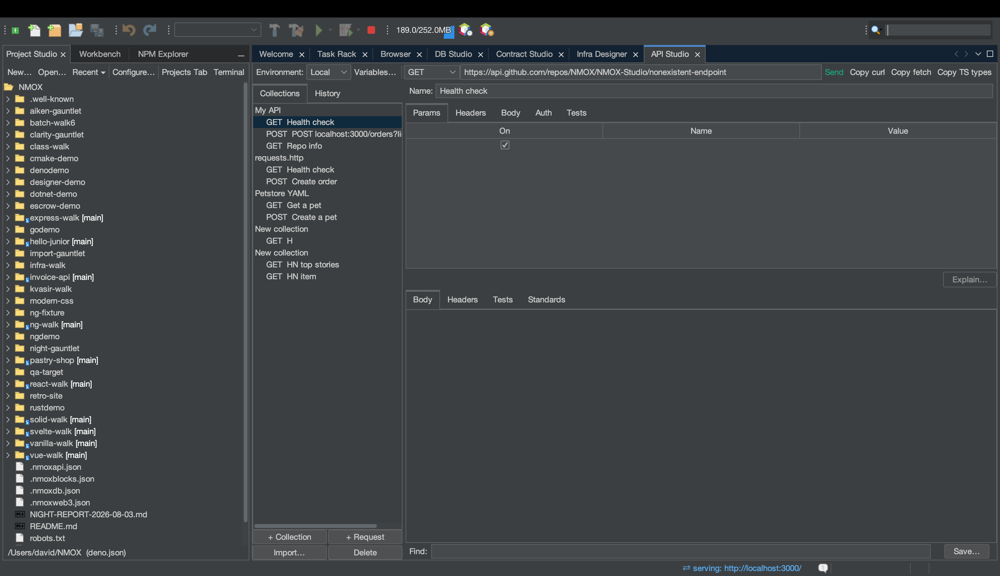


**Copy TS types** sits beside Copy curl and Copy fetch on the request
bar: the JSON response on screen becomes TypeScript interfaces on the
clipboard — nested objects as interfaces (dependency-first), array
elements merged with optional keys, a null beside a non-null sibling
kept honest as `| null`, and empty arrays as `unknown[]` rather than a
guess. A non-JSON response refuses on the status line.

A Postman-style client that lives with your project. Build requests
(params, headers, body, auth), organize them in collections, and define
`{{variables}}` per environment. Every response is graded on its security
headers — an A–F chip tells you at a glance whether your API sends HSTS,
CSP, and friends. Write assertions per request and run whole collections
as a test suite. Everything persists to `.nmoxapi.json` in your project —
commit it, and your teammate has your workspace. When a dev server starts
in the rack, API Studio offers to set `{{baseUrl}}` for you.

The **Import…** menu reads everything you already have: a pasted curl
command (devtools' "Copy as cURL" — an `Authorization: Bearer/Basic`
header is lifted into the Auth field so the secret lands in your OS
keychain, never the committable workspace file), `.http`/`.rest`
request files (the REST Client dialect — its `{{variables}}` are API
Studio's own syntax, so they import verbatim), OpenAPI 3 JSON or YAML
documents (one request per operation, path templates becoming
`{{variables}}`), **Postman Collections v2.x** (folders keep identity
as "Folder / Request" names, `{{variables}}` verbatim, bearer/basic
auth — request-level or inherited — goes keychain-side), and **HAR
captures** from the browser's Network tab (only XHR/fetch traffic
imports, session cookies and opaque captured Authorization values are
dropped and counted — recorded credentials never land in a file).
**Copy curl** puts the exact command Send would run on your
clipboard, and **Export collection to .http…** writes the whole
collection for any editor or CI runner — with auth deliberately left
in the keychain and a per-request comment saying what to re-add.
Imports refuse what they can't represent (multipart forms, `@file`
bodies, Swagger 2, Postman v1/scripts) instead of
importing it wrong. See the [migration
tutorial](tutorials/migrating-from-postman.md) for the full walk.

And when a `.http` file from your repo is already open in the editor,
right-click it → **Open in API Studio** — it lands as a collection
directly, same import, no chooser.

The left panel is tabbed **Collections | History**: every send leaves
a history row (time, method, the authored `{{var}}` url, status,
duration — failed sends included, capped at 50). Double-click a row to
restore it as a request; the auth token deliberately doesn't ride
history, so re-enter it.

The keyboard speaks fluent REST client: **⌘Enter** (Ctrl+Enter on
Linux/Windows) sends from anywhere in the tab — and cancels while a
send is in flight. In the collections tree, right-click for
**Duplicate** (⌘D — the copy lands right after its source with working
auth, under its own keychain id), **Rename…** for collections and
requests alike, and **Delete** (also the Delete key; deleting a
non-empty collection asks first, with No as the default).

When a response is wrong and you don't know why, **Explain with
ORACLE…** sends a redacted picture of it — method, URL with query
values masked, status, headers with credential headers dropped and
counted, capped body — to the same AI that explains rack failures,
after a consent dialog that quotes exactly that list. It opens as a
conversation, so you can ask follow-ups. Switching projects clears the
armed response first: Explain can never disclose another project's
traffic.

### DB Studio (⌥⌘7)

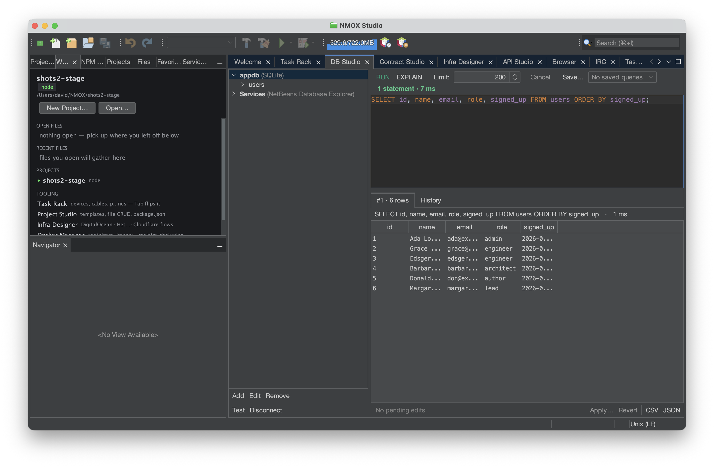


Connect to SQLite, PostgreSQL, MySQL, MariaDB, MongoDB, or CouchDB —
drivers are bundled, nothing to install. Passwords go **only** to your OS
keychain. Three ways connections find you: add one manually, accept the
offer when your project's `.env` carries `DB_*`/`DATABASE_URL`, or accept
the offer when a database container is running in Docker. The console is
kind-aware (SQL kit for SQL engines, JSON commands for Mongo/Couch), runs
multiple statements with per-statement result grids, and keeps history
plus named saved queries. **Edit rows in the grid** — single-table,
primary-keyed results only (the grid tells you *why* when it's
read-only), and Apply shows you the exact UPDATE statements before
touching anything. EXPLAIN is a button. Export any grid to CSV or JSON.
NetBeans Database Explorer connections (Oracle, Derby, anything with a
JDBC driver) appear in the tree too and run in the same console.

A failed statement grows an **Explain…** button under its error
message: ORACLE gets the SQL you ran (including its literal values —
the consent line says so, because the error is usually *about* a
literal), the error message, and the engine kind. Never the
connection details, the password (keychain-only, out of reach by
construction), or any rows — a failed statement produced none.

### Contract Studio (⌥⌘6)

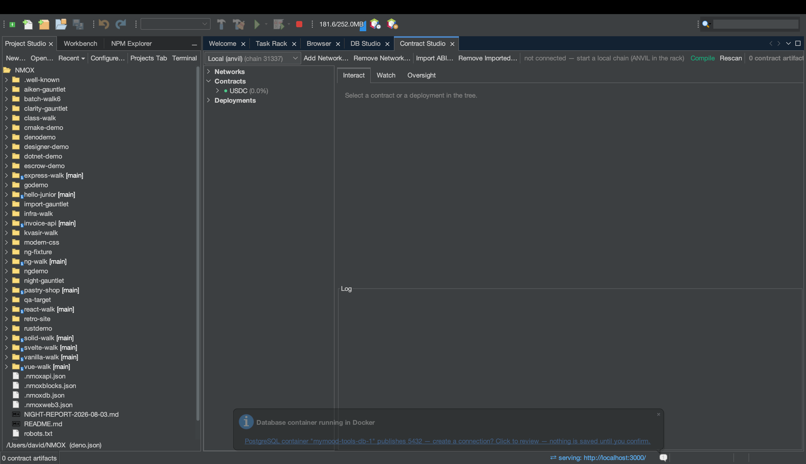


*Want the full worked example? **[Making a Smart Contract](making-a-smart-contract.md)** builds a real escrow contract — code, tests, gas gate, and the live ANVIL loop.*

Beyond the EVM: the rack's **STELLAR** console builds and tests Soroban
contracts (the quickstart local net is a knob position), **ANCHOR** runs
a real Solana validator with a truthful SERVING gate, **Cairo** is a
full language here (`Scarb.toml` projects — editor, outline, LSP, and
every lane speak scarb), and the **Multi-Chain Bench** preset puts all
three chains on one MONITOR. Deploys and invokes that need identities
are SOLDER one-liners; every chain CLI keeps its own keys — the IDE
never sees them.

Web3 development with a hard safety rule: **the IDE never touches a
private key.** Sends go through your devnet's unlocked accounts only.
Build with Foundry or Hardhat and your compiled contracts appear in the
artifact tree (they re-scan automatically after a FORGE build). Start the
ANVIL device in the rack and the studio connects to the local chain by
itself. **Interact** calls any function from the ABI — decoded returns,
decoded reverts and custom errors, receipts for sends. **Watch** streams
blocks and decodes event logs live. **Oversight** shows the gas report,
EIP-170 size verdicts per contract, and your deployment address book
(persisted to `.nmoxweb3.json`; secret RPC URLs live in the keychain and
never reach the file).

**Import ABI…** (toolbar) makes any deployed contract interactable
with no build at all — paste its ABI from a block explorer or a
teammate, attach by address, and it joins the tree beside your built
artifacts (Remove Imported… is the inverse). **Add Network…** offers
presets for Ethereum mainnet and Sepolia through keyless public
gateways — read-only engagement: calls and watches work immediately,
sends still need a devnet or your own wallet.

Token contracts get a face: an attached artifact that implements the
complete ERC-20 interface shows the **token strip** — name, symbol,
decimals, and total supply read live from the chain, amounts rendered
through the token's own decimals, plus a read-only **Balance of…**
lookup. ERC-721s get their own face — name/symbol on the strip and
an **Owner of…** lookup (ownerOf + tokenURI). On an ERC-20's
transfer/approve/transferFrom, the amount field accepts a human
"1.5" and converts through the token's own decimals — raw integers
pass through, and anything ambiguous is refused, never guessed. An
import that carries its address opens already attached. And **Inspect tx…**
on the Watch tab decodes any transaction hash against your artifacts'
ABIs: the named function with its arguments, decoded event logs, gas,
and **History…** beside it queries past events over a bounded block
range (refused past the cap, never clamped) with decoded rows and a
formula-safe CSV export; the connection chip shows the live gas
price.
and status — unknown selectors shown raw, never guessed.

### Infra Designer (⌥⌘9)

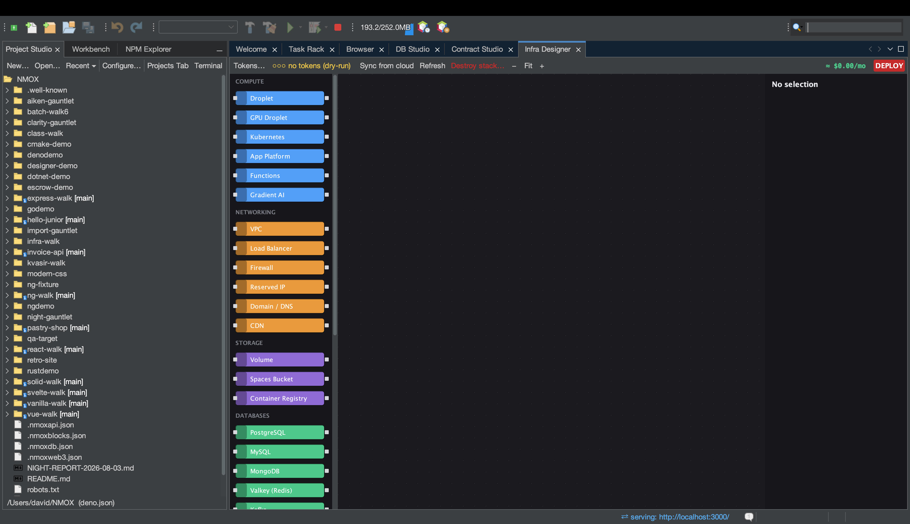


Design cloud infrastructure like a Node-RED flow: drag nodes (droplets,
volumes, load balancers, DNS, workers) onto the canvas, wire them, and
see the estimated monthly cost before anything exists. Three providers:
DigitalOcean, Hetzner, Cloudflare — API tokens are stored in your OS
keychain. **Sync** pulls your live resources in; **Refresh** shows drift
between the canvas and reality; **Deploy** creates what's designed (with
cloud-init user data on nodes that take it); **Destroy stack** tears down
with the monthly cost of what you're destroying framed in the confirm
dialog. Right-click a deployed node to copy its ssh command. The design
persists to `.nmoxinfra.json`.

### IRC (⌥⌘3)

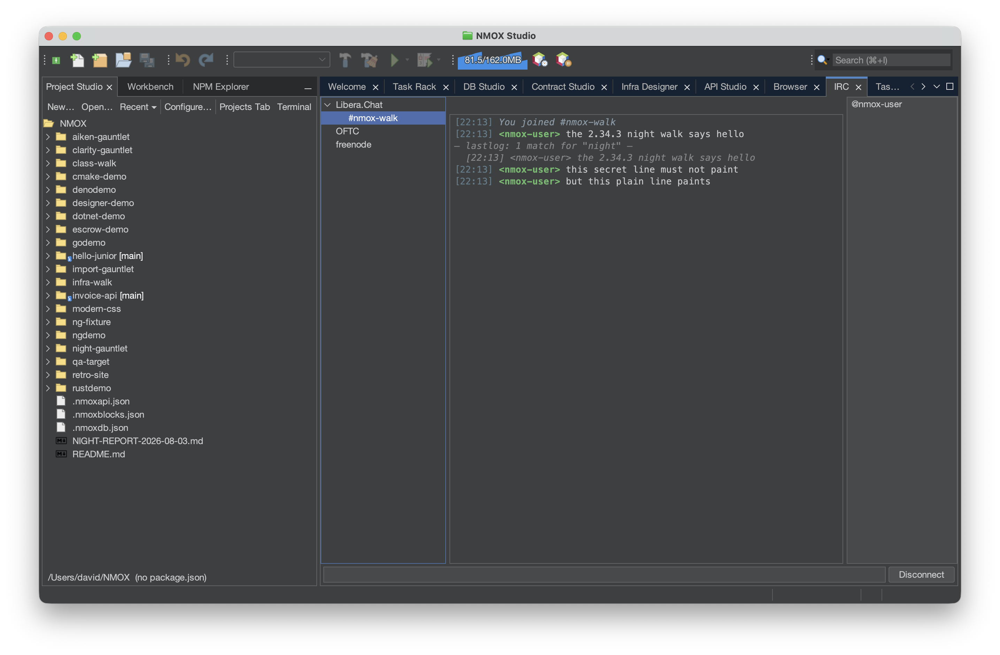

A real IRC client in a tab: networks and channels in a tree on the
left, a styled transcript (mIRC colors, `/me` actions, clickable links
that open in the in-app Browser), the channel's nick list on the right
(away users dimmed), and an input line with **Tab nick completion**
(repeat Tab to cycle), **Up/Down input history**, and **Ctrl+U** to
clear the line (the readline chord — Escape belongs to the window
system in a docked tab and never reaches the input). **Nothing connects
at boot** — the first connection is always your Connect button press.

**Connecting.** freenode ships as the default network (Libera.Chat and
OFTC as presets). Select a network in the tree and press **Connect**,
or `/connect host [port]` for an ad-hoc server. Right-click the tree
for **Add / Edit / Delete Network…** — the form takes host, port, TLS,
nick, SASL account, password, and autojoin channels. The password goes
**only to your OS keychain**, never to a settings file; deleting a
network deletes its keychain entry with it.

**SASL and NickServ.** With a SASL account set, the client
authenticates in-registration (IRCv3 SASL PLAIN — what Libera.Chat
expects); a failure shows an honest transcript line and never retries
your password. Without one, the same keychain password identifies to
NickServ after connect. The client also negotiates `server-time`
(replayed history keeps its real timestamps), `echo-message`,
`multi-prefix`, `away-notify`, `account-notify`, and `message-tags`
when the server offers them.

**Mentions.** A message containing your nick (or any keyword you add to
the config) gets a highlighted background, a red badge count on the
channel's tree row, and — when the IRC tab is hidden — a desktop
notification that clicks through to the channel. **⌘F** opens a find
bar over the transcript (highlight-all, Enter cycles, ⌘F again
closes).

**Logging.** Conversations log to plain text under
`~/.nmox/irc-logs/<network>/<channel>/YYYY-MM-DD.log`, one file per
day. `/log off` and `/log on` toggle it (persisted); NickServ and
ChanServ traffic is **never** written to disk.

**Commands** (`/help` lists these in-app):

| Command | Does |
|---|---|
| `/connect [host [port]]` | connect the selected (or an ad-hoc) network |
| `/join #chan` · `/part [#chan]` | enter / leave a channel |
| `/msg nick text` · `/query nick` | private message / open a query tab |
| `/me action` · `/notice target text` | action line / NOTICE |
| `/nick newnick` · `/topic [text]` | change nick / show or set topic |
| `/whois nick` | a tidy card: user@host, server, channels, idle, account |
| `/list [pattern]` | channel browser — filter, sort, double-click to join |
| `/ignore [nick]` · `/unignore nick` | drop someone's messages silently (per network, persisted) |
| `/away [message]` | mark yourself away / back |
| `/log [on\|off]` | per-channel logging |
| `/ctcp nick VERSION\|PING` | CTCP query |
| `/filter add name #chan\|* regex` | hide matching lines — your own custom filters (`del`/`enable`/`disable`/`list`) |
| `/lastlog text [count]` | the last matching scrollback lines, printed dim in place |
| `/raw LINE` · `/quit [message]` | raw protocol line / disconnect for good |

**Custom filters.** Beyond the smart join/part/quit filter, `/filter
add` takes a name, a scope (`#channel` or `*` for everywhere), and a
case-insensitive regex; matching chat lines and channel notices are
hidden with no signal at all — no unread bold, no mention, no query
tab — while the log on disk keeps every line. Filters persist across
restarts, and a filtered line is tested in its displayed form
(`<nick> body`) so a filter can target a nick, a phrase, or both.

Closing the tab does **not** disconnect — a chat client outlives its
window; reopen the tab and you're still in every channel. Only
Disconnect or `/quit` ends a session.

### The bundled website

**Help ▸ NMOX Studio Website (local)** (or the Welcome footer's
**Website ⇄** link) serves the product's own site — shipped inside the
install — on a free localhost port and opens it in the in-app Browser.
The ⇄ chip names the URL; any browser on your machine can visit it.
It is the dogfood made visible: the site's `a11y.css` and `i18n.js`
are the A11y and I18n Kits' own output (build-gated byte-for-byte),
and the EN/ES buttons ride the kit's `setLocale`.
The same site is deployed publicly at
<https://nmox.github.io/NMOX-Studio/> — identical bytes, different host.

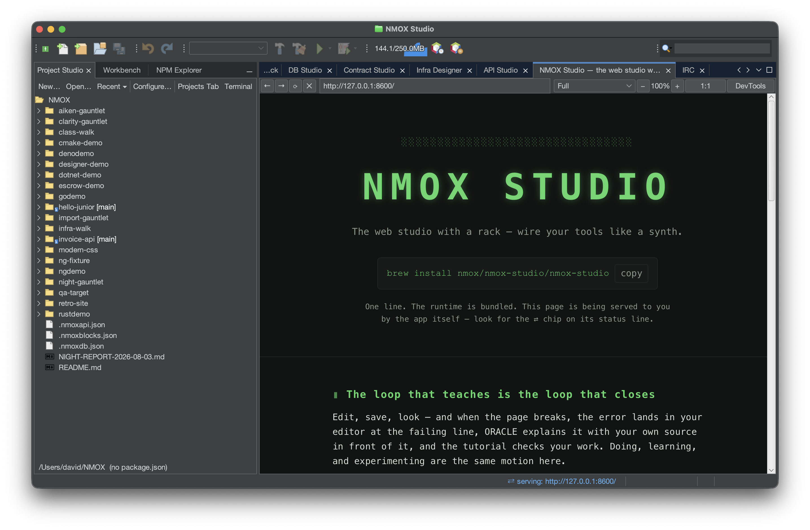

### Browser (⌥⌘4)

The in-app browser is a real WebKit engine (JavaFX WebView, shipped in
the bundled runtime) with the chrome you expect — URL bar (a bare
`example.com` gets `https://`), back/forward, reload/stop, load
progress, zoom buttons — and, since v1.206.0, **developer tools**: the
**DevTools** button in the toolbar opens a bottom pane with seven tabs.
A bare open lands on your project's live dev server when one is
running, else a home page; the rack's SCOPE device and every
Open-in-Browser action route here too.

- **Console** — the page's `console.log/info/warn/error/debug` output
  (the originals still fire), plus `window.onerror` and unhandled
  promise rejections, level-colored with timestamps. The input line at
  the bottom is a REPL: type an expression, see the result (errors
  render red, never a dialog). Entries are bounded — 1000 rows, 8k
  chars each; when older rows are evicted an honest "N older entries
  dropped" line says so.

  Since v2.39.0, a runtime error on a page served from **your**
  project also lands in the editor itself: a squiggle at the failing
  line and an Action Items row with click-to-navigate, cleared on the
  next reload — the console shows every error, the editor only ever
  carries your files. And **Explain error…** beside Clear asks ORACLE
  about the page's last located error, sending the message plus a few
  capped source lines around the failing line under its own consent
  that states literally what leaves (v2.39.2).

  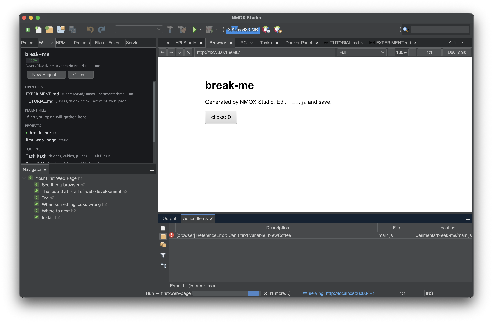

  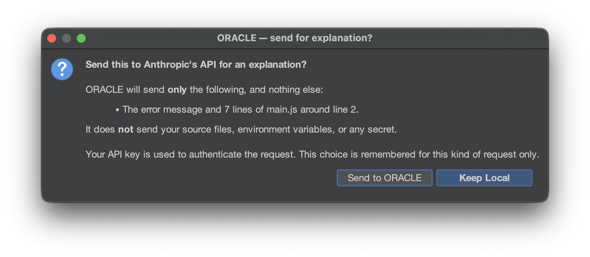

  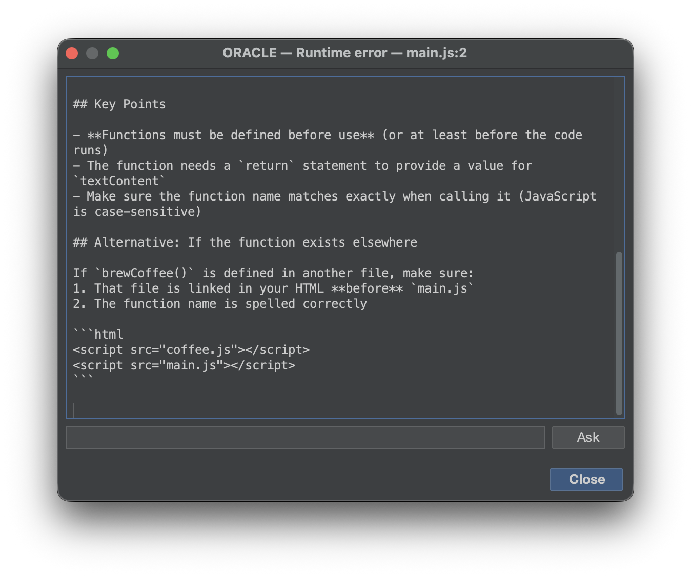
- **DOM** — press Refresh for a tree of the live document (bounded:
  depth 30, 5000 nodes, an honest "…N more" row past a cap). Selecting
  a node outlines it in the page and shows its attributes plus a
  curated 15-property computed-style summary. Since v1.357.0 the tab
  is **source-aware**:
  - **Pick element** arms a crosshair in the page — click any element
    and the tree selects it, outlined and detailed, with the click
    swallowed so the page doesn't navigate.
  - **Open Source** (or double-click a tree node) opens the HTML file
    that produced the element, at the line. It only trusts pages it
    can trace to your disk — `file://` pages and anything served by a
    rack serve device — and it refuses honestly otherwise: a remote
    page says "not served from a project here," and an element that
    only exists because a script created it says "likely
    script-generated" instead of jumping somewhere wrong.
  - **Edit Style…** applies a property/value tweak inline in the page
    instantly, then writes it into the source stylesheet — the rule
    chosen by asking the page which selectors matched (the cascade's
    own answer, last match wins), replaced in place or inserted with
    the block's own indentation. The refusals keep it safe: inline
    `<style>` rules, unserved stylesheets, a `.css` with a
    preprocessor sibling ("compiled output — edit the preprocessor
    source instead"), and files with unsaved editor changes all
    decline with the reason on the status bar while the preview stays
    visible. The walkthrough:
    [Browser to Source](tutorials/browser-to-source.md).
- **Motion** — DHTML, reborn as a keyframe timeline (v2.12.0). Select
  an element in the DOM tab, then author a real CSS animation on a
  timeline strip: one row per property, a diamond per keyframe — drag
  a diamond to move its stop (it can never pass a neighbor),
  double-click a track to add a stop, double-click a diamond to edit
  its value, drag the ruler to scrub the live page to that exact
  moment (the paused-negative-delay trick — the element really sits
  there). Seven DHTML-classic presets load with one click: marquee,
  pulse, fly-in, bounce, shake, spin, rainbow. **Play** previews in
  the page through a single injected preview style tag;
  **Apply to Source** lands the `@keyframes` block and the
  `animation:` shorthand in the source stylesheet in one atomic write,
  through the same rule-matching and the same refusal ladder as Edit
  Style — and a same-named `@keyframes` block is replaced at its LAST
  occurrence, the one the cascade actually uses.
- **Network** — requests the page makes via `fetch` or
  `XMLHttpRequest` **after** the DevTools instrumentation injects (on
  page load): method, URL, status, duration, size when the response
  declares one. Requests from before the injection are not visible,
  and bodies are deliberately not captured (v1) — the row list is
  bounded at 500.
- **Storage** — a read-only (v1) table of localStorage,
  sessionStorage, and cookies, refreshed on demand, values capped at
  500 chars.
- **Vue** — the component tree of a running **Vue 2 or Vue 3** app:
  select a component to see its props and state and outline its root
  element in the page. No Vue on the page is an honest empty state;
  Angular has its own tab (below); React is not inspected.
- **Svelte** — source mapping for a running **Svelte** app served from
  a dev build (`vite dev`): dev mode stamps every rendered element
  with the `.svelte` file, line, and column that produced it, and the
  pane groups those by file — select a line to outline its element in
  the page. The honest limit, stated plainly: Svelte *compiles
  components away*, so no component instances, props, or state exist
  at runtime for any inspector to walk — file/line source mapping is
  everything dev mode offers, and a production build offers nothing at
  all (the pane says so instead of claiming "no Svelte").
- **Angular** — the component tree of a running **Angular dev build**:
  class names, instance state, and host directives, resolved through
  `window.ng.getComponent` (the debug API Angular exposes in dev
  builds); select a component to see its fields and outline its host
  element in the page. Both misses are honest: a **production build**
  stamps `ng-version` but strips `window.ng`, so the pane says
  "production build, no component tree" (the official Angular DevTools
  is limited the same way) — and a page with no Angular at all says
  that instead.

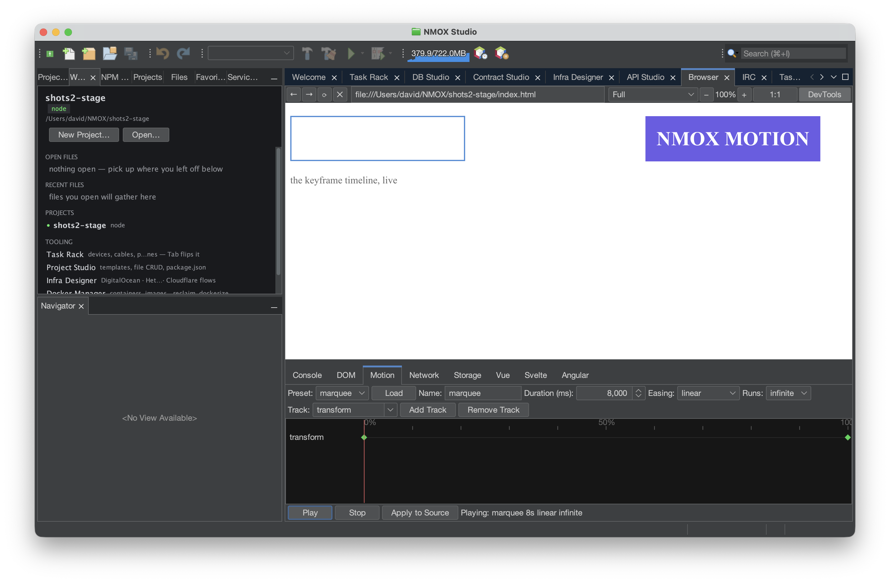

Everything the page hands the tools is treated as untrusted: strings
are capped, lists are bounded, and a hostile page can fill a ring
buffer but never the IDE's memory. A dev build on a plain JDK (no
JavaFX) shows an honest explanation in the tab and routes pages to
your system browser instead.

## 7. Docker

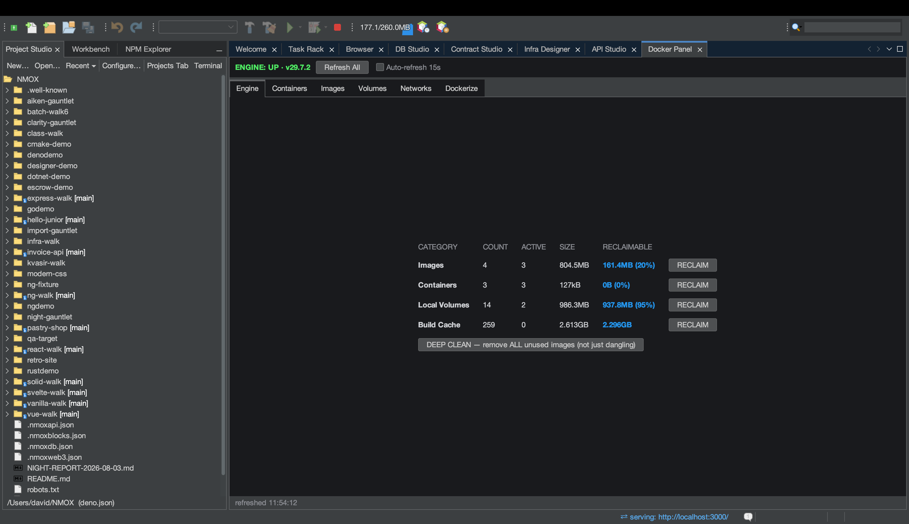


The Docker tab is a control panel: engine status, containers, images,
volumes, networks — start, stop, logs, prune. The HARBOR rack device
gives you the same at a glance from the rack. The **Dockerize** tab
generates a production-grade `Dockerfile`, `.dockerignore`, and compose
file tuned to your project's toolchain (Node, PHP-FPM+nginx, and more).
And as noted above: run a Postgres/MySQL/Mongo container, and DB Studio
offers you a ready-made connection.

## 8. Wizards and kits

All under *New File…* / the project context menu, all **idempotent and
never-clobbering** — re-running one updates what it owns and leaves your
edits alone; anything it won't overwrite lands as a `.suggested` sibling.

- **Standards Kit** — `robots.txt`, `sitemap.xml`, web manifest, RFC 9116
  `security.txt`, `humans.txt`, generated from your answers.
- **PWA Kit** — full icon set forged from one source image (including
  maskable variants), a readable service worker (app-shell or
  network-first, your choice), an offline page, and the `index.html`
  wiring to tie it together.
- **A11y Kit** — accessibility as a starting point, not an audit
  afterthought: `a11y.css` (a visible `:focus-visible` ring, a
  `.visually-hidden` utility, skip-link styles, a
  `prefers-reduced-motion` block), `A11Y-NOTES.md` (the keyboard walk
  and the questions automation can't answer, pointing at the DevTools
  WCAG contrast check and the VITALS a11y gate), and idempotent
  `index.html` wiring — `lang`, a skip link, the stylesheet. A
  zoom-disabling viewport is warned about, never rewritten; problems
  the kit can't fix are reported, not touched.

  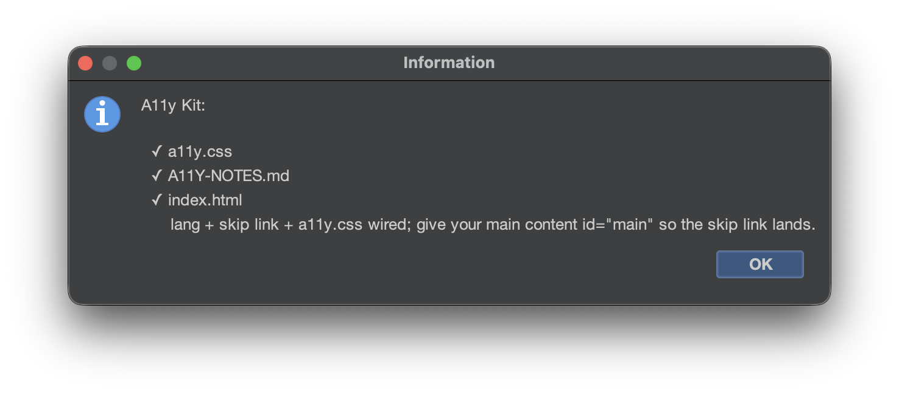
- **I18n Kit** — translatable from day one, the A11y Kit's sibling:
  `locales/en.json` + `locales/es.json` (one catalog per language,
  same keys), a dependency-free `i18n.js` that applies the catalog to
  `data-i18n` markup, keeps `<html lang>` truthful, and surfaces a
  missing key as itself (never a silent blank), `I18N-NOTES.md` (no
  concatenated fragments, `Intl` for dates and numbers, the RTL walk,
  pseudo-localization), and the idempotent script-tag wiring.

  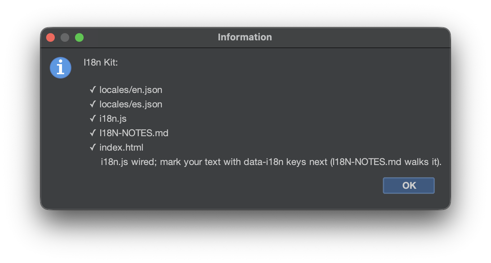
- **Contract Kit (Web3)** — (new to contracts? read
  [the Beginner's Guide](smart-contracts-beginners-guide.md) first) — pick a chain (Solidity/Foundry, Soroban, Solana,
  CosmWasm, ink!, Cairo, Move, Bitcoin/Miniscript, Clarity on
  Stacks, Cardano/Aiken, or TON/Tact) and a contract name, and the kit scaffolds the live-proven
  starter: manifest, contract, native test, and a CONTRACT-NOTES.md
  naming the rack devices and one-time steps. Keys never touch the
  IDE. (Move projects that name AptosFramework in Move.toml drive
  every lane with `aptos move compile/test` instead of `sui move` —
  the dialect is sniffed, not dialed.)
- **Classic Kit** — extend any codebase with jQuery, MooTools, Prototype,
  Backbone+Underscore, or Knockout, either vendored (pinned versions,
  sha256 recorded in a NOTICE file) or as npm deps; plus webpack, grunt,
  gulp, or bower scaffolds.

## 9. Quick Search, status line, and staying oriented

The **⇄ serving** chip on the status line lists every live server (the IDE's Run, the serve devices, and any command that printed a local address); click it and pick one — it opens in the in-app Browser, or your system browser when the Browser tab cannot take it.


**⌘I is the universal finder.** One box reaches: your projects (recent
and known), every rack device (jump straight to a device's controls),
**live servers** (anything currently serving — hit Enter to open it in
the browser), API Studio requests, DB connections and tables, contracts,
infra nodes, and Task Board cards (the hit names the card's column).

**The status line tells you what's alive:** a `⇄ serving N` chip appears
whenever dev servers are up — click it to see URLs and open one. Next to
it: the aimed project and toolchain.

**The Workbench tab** is home base: current project, open and recent
files, recent projects, and launchers for every tool surface. While
anything runs, a **RUNNING** section leads the page — every command the
product started for you (the ▶'s run, an NPM script, a test, an
install, an `ng generate`) with its address when it announced one and
since when it runs, plus every server a rack device is serving. Each
row has real **Open** and **Stop** buttons (keyboard and screen-reader
reachable), so one run can be stopped without taking the rest down;
a rack device's run appears here too, with the server its device
announced on the same row. Every row's title on the Workbench — open
files, recent files, projects, running commands — is a real button:
Tab reaches it, Enter opens it.
⌘I reaches the same runs: type "stop" or the run's own words and Enter
stops exactly that one. A run you stopped yourself reads *stopped*
wherever its outcome is reported — the wizard's install says "Install
stopped", a stopped test reads "Focused test stopped" — never a
failure.

**Emacs (and Eclipse, IntelliJ) keyboard shortcuts:** Tools ▸ Options ▸
Keymap switches the whole keymap profile — Emacs movement and kill/yank
chords in every editor, or the Eclipse/IDEA sets if those are your
muscle memory. Every NMOX shortcut (the ⌥⌘ window family, ⌘P Go to
File, Emmet's ⌥⌘E) is registered in all five profiles, so switching
keymaps never costs you the studio chords.

## 10. The safety nets (things you don't have to do anything for)

- **Session resurrection.** The rack snapshots what's running every few
  seconds. Force-quit, crash, `kill -9` — on relaunch a toast offers to
  restart exactly the session you lost, one click.
- **The orphan guarantee.** Quitting the IDE kills every process it
  started — dev servers, REPLs, chains, watchers — TERM first, KILL if
  they resist, descendants included.
- **BLACKBOX** (add it to your rack) is a flight recorder: every launch
  and exit, durations, trends, and "what changed since the last green
  build" when something breaks. A run you stopped yourself reads
  STOPPED — neither a green nor a failure, and never the thing ORACLE
  is asked to explain.
- **SONAR** shows who owns your ports, cross-referenced with Docker, with
  a one-click kill for the squatter on 3000.
- **Never-clobber files.** All four studio workspace files
  (`.nmoxapi.json`, `.nmoxdb.json`, `.nmoxweb3.json`, `.nmoxinfra.json`)
  reload when edited outside the IDE — but if you have unsaved changes,
  you're asked, never overwritten. A corrupt file is set aside as `.bak`
  and reported, never silently replaced.
- **TypeScript without a build** — a project whose entry is `index.ts`,
  `main.ts` or `src/index.ts` runs from IGNITION (and the node lane) with
  Node's own type stripping (`--experimental-strip-types`, Node 22.6+; the
  default from 23.6 and 22.18 LTS). An older Node's refusal is translated
  into the sentence that names the floor.
- **Daily update check** — quiet, once a day; a newer release shows a
  notification whose click opens the Plugin Manager on its Updates tab,
  where the update center installs the new modules in place
  when there's a release. Turn it off in Options ▸ General.

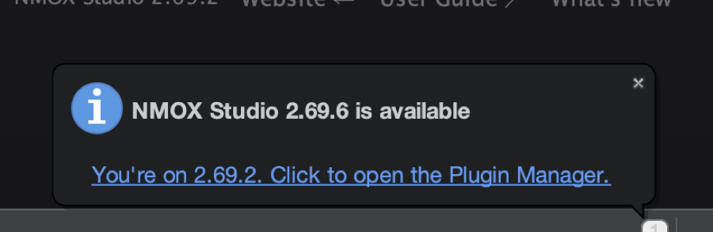

## 11. Learning Spaces

Some spaces **check your work**: pick a space with checkpoints (Your
First Web Page, Go, Rust, Playwright today) and **File ▸ Check My
Work** verifies the exercises for real — file claims checked
pure-Java (including *absent* checks, which is how "you changed the
heading" is verifiable: the sample's original text must be gone, and
*atLeast* counts, which is how "you added a third item" is), and
command claims through the space's own toolchain (`cargo test` is the
honest verifier of a Rust exercise). Every ✗ answers with the space's
own hint. Any catalog entry — including your drop-ins below — can
declare its own `checkpoints`.

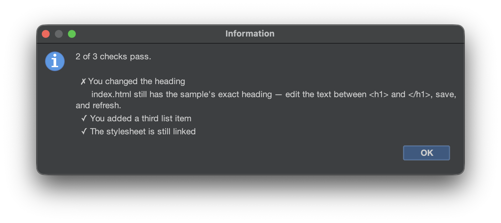

When checks fail, the report offers **Explain with ORACLE…** — the
failed checkpoints and (for a file check) your own checked file,
capped, under its own consent that names exactly what leaves. The
answer reads like a tutor: what to change, and "re-run the checks."

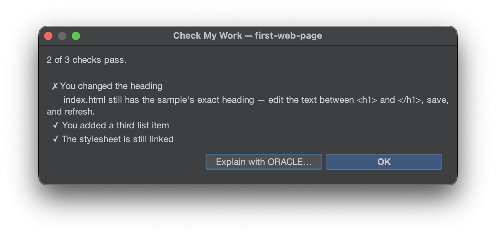

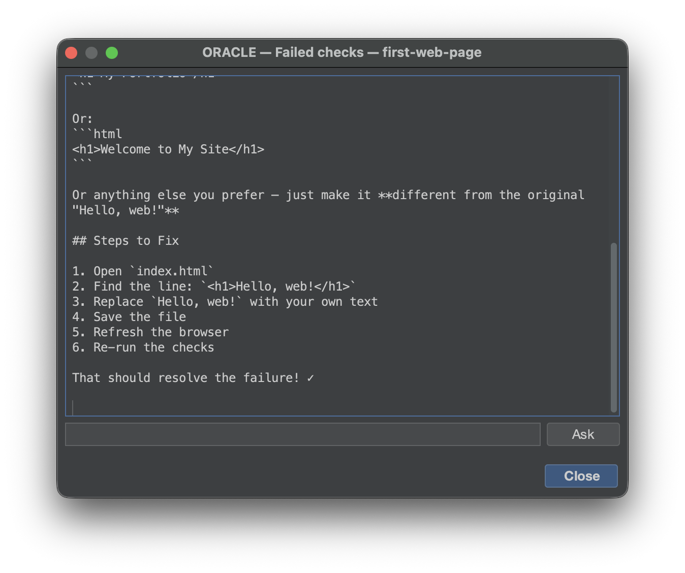

You can add your own tutorials: drop a `*.json` file in `~/.nmox/learn-catalog.d/` and it joins the New Learning Space picker (same schema as the built-ins; a matching `slug` overrides a built-in). See [learning-spaces.md](learning-spaces.md) for the schema and a worked example.

Teaching a class? Author by building: make the exercise a normal
project and **File ▸ Export as Learning Space…** emits that drop-in
for you — sample files, your `TUTORIAL.md`, the run driver, and your
`.nmox-checkpoints.json` as Check My Work checkpoints — validated
against the picker's own parser before it's written, so what you hand
your students is exactly what their picker will load.

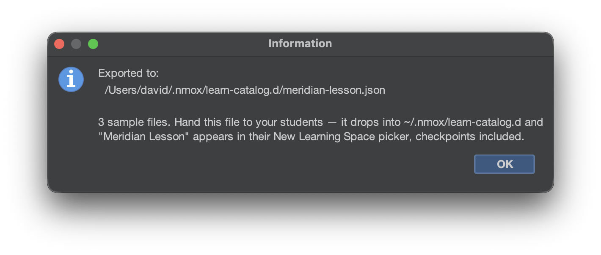

*New Learning Space…* offers 93 built-in tutorials — languages (Python,
Rust, Go, Ruby, Lua, Elixir, Clojure, Solidity, …), frameworks, and
libraries. Each generates a small sample project, a walked tutorial, and
a rack pre-wired with a **real REPL device** — you type into the rack and
a live interpreter answers. The REPL's ENGINE knob selects among 37
interpreters; if one isn't installed, the INSTALL button installs it
right there, streaming progress onto the REPL screen. Spaces live in
`~/.nmox/learn`, apart from your real work.

### First Steps, on the Welcome page (v2.66.0; named First Steps since v2.69.11)

A fourth Welcome column lists the six first gestures — open a project,
run something in the rack, see a server go live, ask ORACLE about code,
try a learning space, point an agent at the IDE — and ticks each one
from records the product already keeps (recent projects, the rack's
flight recorder, the serving registry, your ORACLE consent,
`~/.nmox/learn`, the Agent Port's started-once record). Every row is a
door: click it and the gesture's window or action opens. Hover a step
for its gesture. A tick never un-ticks; the column disappears when all
six are done, or when you press **Hide this list**.

### The Help menu's three answers (v2.64.0)

- **What's New…** — the release notes for the version you run, bundled
  in the build. On the first boot after an update the dialog opens once
  with the releases your install has not seen (newest first, ten at
  most, the rest counted). A fresh install shows nothing — it just
  remembers its version.

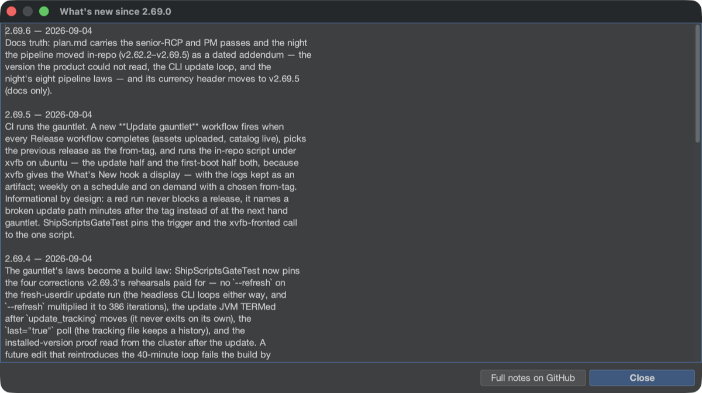
- **Report a Problem…** — a bug report with the environment and the last
  forty lines of the log, redacted (your home path becomes `~`, your
  login `<user>`, anything shaped like a credential `[redacted]`). Edit
  it, then **Open on GitHub** pre-fills a new issue that you submit, or
  **Copy** it. The product never sends anything itself.
- **Keyboard Shortcuts…** — every NMOX chord in your active keymap
  profile plus the global ones (the Welcome's ⇧⌘E / ⇧⌘N / ⇧⌘L doors),
  read from the running keymap through the platform, so it cannot drift
  from what the menus do. Editor-kit chords (Emmet ⌥⌘E, template Go to
  Declaration ⌘B) are documented in chapter 5.

## 12. When something's wrong

- **Environment Doctor** (Tools menu) live-probes 66 external tools —
  node, npm, docker, forge, composer, gopls, … — showing found versions
  and the install command for anything missing.
- **Missing language server / missing tool**: the IDE tells you the
  command to run (or offers to run it), never a bare failure. One
  wall has its own door: TypeScript 7 (the Go port) ships no tsserver,
  so if the typescript the language server finds is 7, the editor says
  so once and offers `npm install -g typescript@5` — the install the
  IDE runs for you pins 5 for the same reason.
- **Port already in use**: the error names the process squatting on it
  (SONAR will kill it).
- **A device's GO does nothing**: check its LCD — devices explain
  themselves in words, and the GO tooltip shows the exact command it
  would run, so you can try it in a terminal.
- **The app opens to nothing on macOS** (no window, no error, first
  launch after install): that's Gatekeeper quarantine — see the note in
  §1. Right-click → Open once and it's fixed forever.
- Logs live under `~/Library/Application Support/nmoxstudio/…/var/log/`
  (macOS) if you need to file an issue.

## Appendix: the files NMOX Studio writes (and what to commit)

Everything the IDE persists for a project is a readable JSON file in the
project root, designed to be shared with your team:

| File | What's in it | Commit it? |
|---|---|---|
| `.nmoxapi.json` | API Studio collections, requests, environments, tests | **Yes** — your teammate gets your whole API workspace |
| `.nmoxdb.json` | DB connection specs, saved queries, history | **Yes** — passwords are *never* in it (OS keychain only) |
| `.nmoxweb3.json` | Contract Studio networks + deployment address book | **Yes** — secret RPC URLs are *never* in it (keychain only) |
| `.nmoxinfra.json` | The infra canvas: nodes, wiring, properties | **Yes** — API tokens are *never* in it (keychain only) |
| `.nmoxtasks.json` | The Task Board: columns, cards, WIP limits | **Yes** — the team shares one board; leave it ignored to keep it personal |
| `.gas-snapshot` | Foundry per-test gas baselines (GOVERNOR gates on it) | **Yes** — that's how gas regressions get caught in review |
| `.env` | Your environment variables | **No** — that's the whole point of `.env` |
| `*.bak` | A workspace file that failed to parse, kept for you | No — recover what you need, then delete |

Edit any of the four `.nmox*.json` files outside the IDE (or pull a
teammate's changes) and the matching studio reloads on its own — unless
you have unsaved changes there, in which case it asks first.

Outside the project: `~/NMOX` is the default workspace, experiments live
in `~/.nmox/experiments`, Learning Spaces in `~/.nmox/learn`, and the
IDE's own state (window layout, rack patches, preferences) in the
platform userdir (`~/Library/Application Support/nmoxstudio` on macOS).

---

*NMOX Studio is free and open source (Apache 2.0). Found something this
guide gets wrong, or have an idea? Please
[open an issue](https://github.com/NMOX/NMOX-Studio/issues).*
