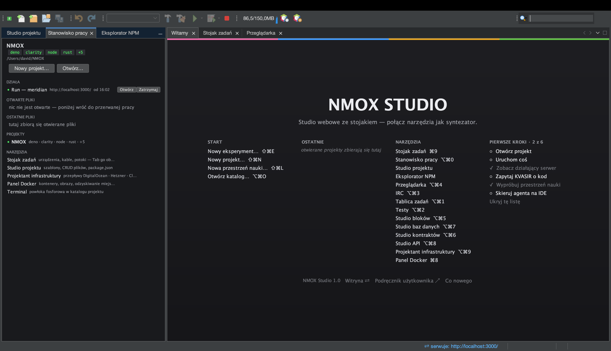
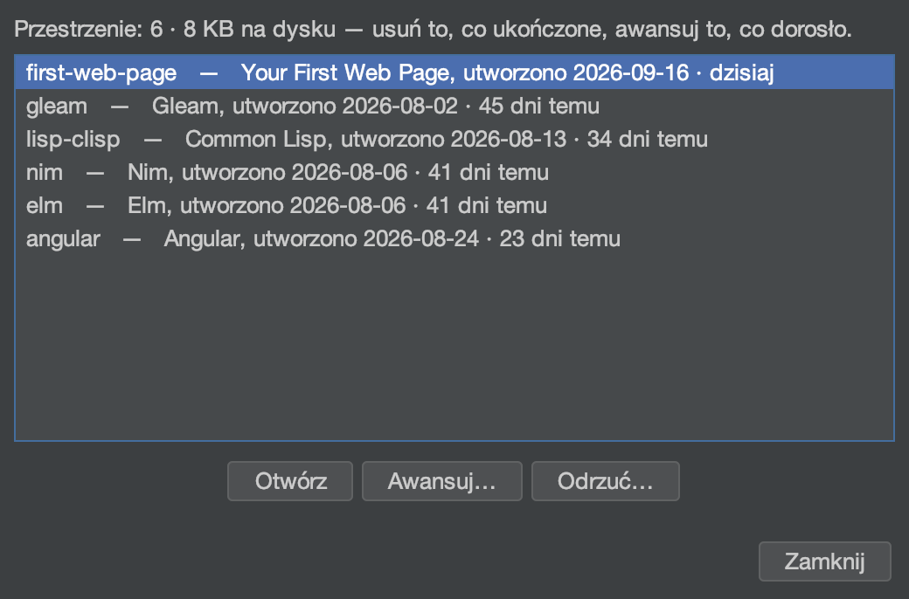
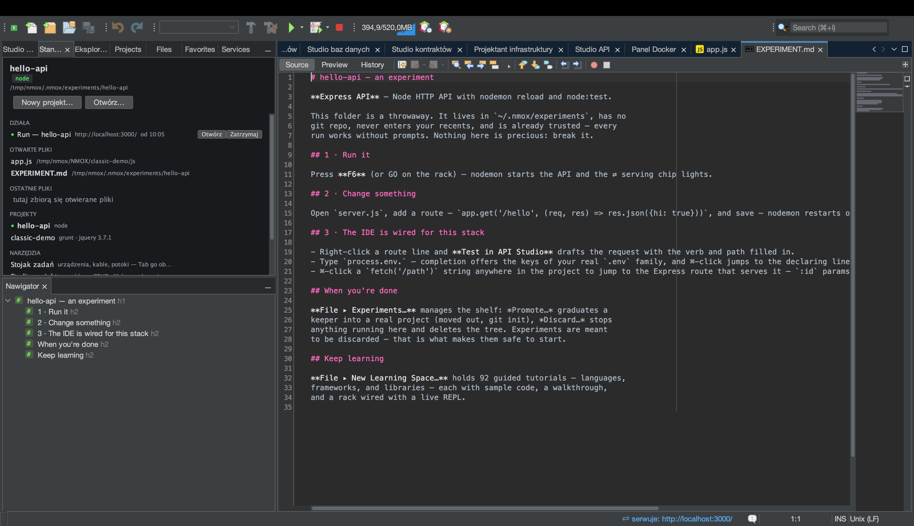
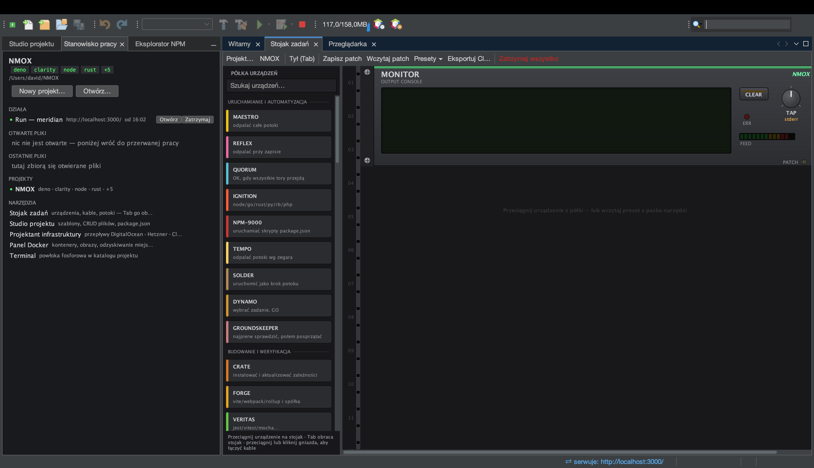
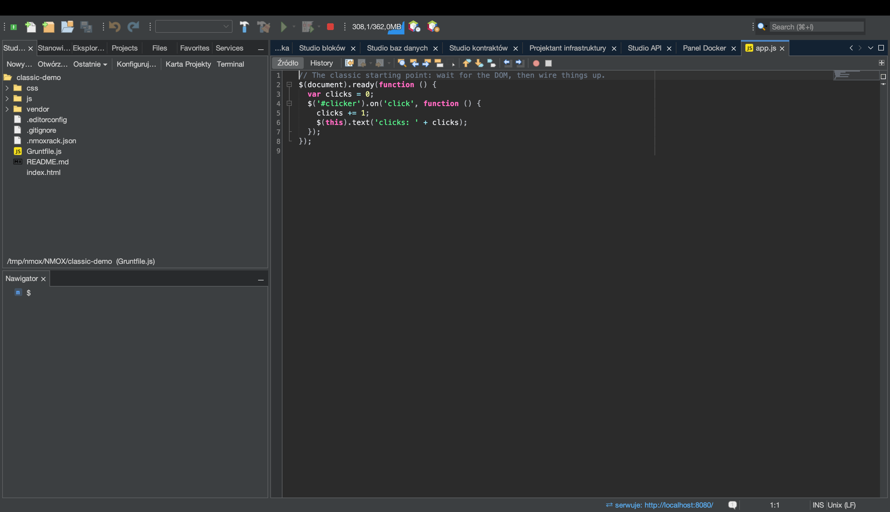

# NMOX Studio — Podręcznik użytkownika

<!-- languages -->
[English](user-guide.md) · [Español](user-guide.es.md) · [Français](user-guide.fr.md) · [Deutsch](user-guide.de.md) · [Русский](user-guide.ru.md) · [Українська](user-guide.uk.md) · **Polski** · [Português (Brasil)](user-guide.pt.md) · [Bahasa Indonesia](user-guide.id.md) · [Filipino](user-guide.tl.md) · [Tiếng Việt](user-guide.vi.md) · [简体中文](user-guide.zh.md) · [हिन्दी](user-guide.hi.md) · [עברית](user-guide.he.md) · [العربية](user-guide.ar.md)
<!-- /languages -->

Jak używać produktu. Podręcznik omawia funkcje w kolejności, w jakiej je napotkasz: instalacja, pierwsze uruchomienie, projekty, stojak, studia, kreatory i siatki bezpieczeństwa.

---

<a id="1-install"></a>
## 1. Instalacja

**macOS (zalecane):**
```bash
brew trust --cask nmox/nmox-studio/nmox-studio
brew install nmox/nmox-studio/nmox-studio
```

Wiersz `brew trust` to jednorazowe potwierdzenie Homebrew dla dowolnego zewnętrznego tapa — przy aktualizacjach nikt nie zapyta ponownie. Aplikacja jest podpisana identyfikatorem Apple Developer ID i notaryzowana przez Apple, więc Gatekeeper przyjmuje ją taką, jaka jest — cask ją kopiuje i nic więcej z nią nie robi. Ręczna instalacja z DMG działa tak samo.

**Wszystko inne:** pobierz plik z [najnowszego wydania](https://github.com/NMOX/NMOX-Studio/releases/latest) — `.dmg` dla macOS, `-setup.exe` dla Windows, `.deb` dla Debiana/Ubuntu, zwykły `.tar.gz` dla Linuksa. Wszystkie cztery niosą własne środowisko uruchomieniowe Javy; niczego nie trzeba instalować wcześniej. `-portable.zip` to jedyny artefakt korzystający z twojej Javy (wymaga Javy 21+ w PATH albo uruchomienia z `--jdkhome <ścieżka-do-jdk>`).

> **macOS, pierwsze uruchomienie:** kliknij dwukrotnie. macOS raz zapyta, czy otworzyć aplikację pobraną z internetu, i powie, że Apple ją sprawdził: kliknij **Otwórz**. Aplikacja jest podpisana identyfikatorem Apple Developer ID i notaryzowana, a bilet jest przypięty zarówno do aplikacji, jak i do DMG, więc sprawdzenie działa offline — bez prawego przycisku i bez `xattr`. Wbudowana aktualizacja instaluje w katalogu użytkownika, a nie w pakiecie aplikacji, więc aktualizacja nigdy nie psuje tego podpisu.
>
> Jeśli instalacja 3.0.0, 3.0.1 lub 3.0.2 odpowiedziała *“NMOX Studio.app” Not Opened* („nie otwarto aplikacji”), był to błąd w sposobie, w jaki aplikacja uruchamiała swój skrypt startowy, poprawiony w 3.1.0: zainstaluj 3.1.0 lub nowszą (`brew upgrade --cask nmox-studio` albo nowe pobranie).

### Weryfikacja pobranego pliku

Opcjonalnie, dwadzieścia sekund i dwie kontrole, bo odpowiadają na różne pytania.

**Czy to te bajty, które opublikowaliśmy?** Działa na każdej platformie i obejmuje każdy plik — `SHA256SUMS` i `SHA256SUMS.asc` są dołączone do wydania:

```bash
curl -sL https://raw.githubusercontent.com/NMOX/NMOX-Studio/main/KEYS | gpg --import
gpg --verify SHA256SUMS.asc SHA256SUMS
sha256sum -c SHA256SUMS --ignore-missing
```

**Czy macOS za to ręczy?** Inne pytanie, na które odpowiada Apple:

```bash
spctl --assess --type execute -vv "/Applications/NMOX Studio.app"
```

Oczekujesz `source=Notarized Developer ID`. Instalatory Windows nie są jeszcze podpisane: dla pobrania pod Windows powyższa kontrola jest właściwą drogą.

### Aktualizacja

**Narzędzia ▸ Wtyczki ▸ Aktualizacje** (albo **Pomoc ▸ Sprawdź aktualizacje**) proponuje moduły produktu z każdego nowszego wydania, z centrum „NMOX Studio Updates”, które wskazuje najnowsze wydanie na GitHubie. Zainstaluj, uruchom ponownie na żądanie i gotowe. Platforma sprawdza też sama, domyślnie raz w tygodniu (zmienisz to w **Narzędzia ▸ Wtyczki ▸ Ustawienia**), a niezależnie od tego IDE raz dziennie wspomina o nowszym wydaniu; wyłączysz to w Opcje ▸ Ogólne (w macOS: NMOX Studio ▸ Settings…, gdzie indziej: Narzędzia ▸ Opcje). Każdy moduł jest podpisany, a certyfikat jest dołączony do produktu, więc aktualizacje instalują się bez pytań o certyfikat.

Aktualizator wymienia moduły, a nie aplikację wokół nich. Dołączone środowisko Javy, program uruchamiający i sama platforma NetBeans zmieniają się tylko wtedy, gdy instalujesz wydanie (`brew upgrade --cask nmox-studio` albo nowe pobranie), a wydanie, które zmienia któreś z nich, mówi o tym w notatkach — przykładami są polecenie `nmox` i poprawki programu uruchamiającego w macOS z wydania 3.1.0. Instalacja starsza niż 2.35.0 w ogóle nie zaktualizuje się z wnętrza aplikacji, bo 2.35.0 przeniosło platformę: zainstaluj bieżące wydanie.

<a id="2-first-launch"></a>
## 2. Pierwsze uruchomienie

Z terminala `nmox .` otwiera katalog, w którym stoisz, tak jak robi to `code .`: `cd myproject && nmox .`. Katalog jest celowany dokładnie tak, jak celuje go „Otwórz katalog…” na stronie powitalnej, z manifestem czy bez; plik otwiera się w edytorze (`nmox src/app.js`), a na konkretnym wierszu, jeśli podasz go tak jak w `code -g` (`nmox src/app.js:42` — kolumna jest przyjmowana, a edytor otwiera się na początku wiersza). Nazwa, której nie ma, zostaje odrzucona w terminalu (`nmox: typo.js: no such file or folder`), zamiast cokolwiek uruchamiać. Polecenie wraca od razu — pierwsze `nmox` uruchamia IDE w tle, a każde kolejne przekazuje swój katalog już działającemu IDE. Samo `nmox` po prostu uruchamia IDE. Jak dodać `nmox` do PATH:

- **macOS, Homebrew:** cask podlinkuje je za ciebie.
- **macOS, z DMG:** podlinkuj (nie kopiuj) program uruchamiający aplikacji —
  `sudo mkdir -p /usr/local/bin && sudo ln -s "/Applications/NMOX Studio.app/Contents/MacOS/nmox-studio" /usr/local/bin/nmox`.
  Uruchomiony przez dowiązanie wie, że przyszedł z terminala; uruchomiony z Findera albo z Docka zachowuje się jak zawsze.
- **Windows:** pole *Add "nmox" to PATH* w instalatorze („Dodaj nmox do PATH”), domyślnie zaznaczone. Potem otwórz nowy terminal; już otwarty zachowuje stary PATH.
- **Linux:** pakiet `.deb` instaluje `/usr/bin/nmox`. Z archiwum tar podlinkuj je sam: `ln -s "$PWD/nmox-studio-<version>/bin/nmox" ~/.local/bin/nmox`.

W Linuksie i Windows katalog możesz podać NMOX Studio także bez terminala, a zostanie wycelowany tak samo:

- **Linux (pakiet `.deb`):** menedżer plików wymienia NMOX Studio pod *Otwórz za pomocą* dla katalogu. Nie staje się domyślnym programem dla katalogów; tym pozostaje menedżer plików.
- **Windows:** zaznacz w instalatorze pole *Add "Open with NMOX Studio" to the right-click menu of folders in Explorer* („Dodaj Open with NMOX Studio do menu kontekstowego katalogów w Eksploratorze”; domyślnie niezaznaczone, jak w VS Code). Eksplorator oferuje wtedy **Open with NMOX Studio** na katalogu i na pustym miejscu wewnątrz niego; w Windows 11 znajdziesz to pod *Pokaż więcej opcji*. Odinstalowanie to usuwa.

W macOS użyj `nmox .` albo **Plik ▸ Otwórz katalog…**. *Otwórz za pomocą* w Finderze i ikona w Docku nie potrafią jeszcze przekazać katalogu do NMOX Studio, więc aplikacja się tam nie proponuje.

IDE otwiera się z trzema kartami przy obszarze edytora: **Witamy → Stojak zadań → Przeglądarka**. Każde inne okno jest o jeden skrót ⌥⌘ i figuruje w kolumnie NARZĘDZIA strony powitalnej. W lewym doku: **Studio projektu** (drzewo plików i szablony), baza **Stanowisko pracy** oraz **Eksplorator NPM**. Powstaje katalog `~/NMOX` jako domyślna przestrzeń robocza; stojak wskazuje tam, dopóki nie otworzysz projektu.



Skróty warte nauczenia się pierwszego dnia (wszystkie są też wypisane na karcie powitalnej):

| Skrót | Otwiera |
|---|---|
| **⌘I** | Szybkie wyszukiwanie — sięga wszędzie |
| **⇧⌘P** | Też szybkie wyszukiwanie — skrót, który VS Code nazywa paletą poleceń |
| **⌘9** | Stojak zadań |
| **⌥⌘0** | Stanowisko pracy |
| **⌥⌘1** | Tablica zadań |
| **⌥⌘2** | Testy |
| **⌥⌘3** | Klient czatu IRC |
| **⌥⌘4** | Przeglądarka (wbudowany WebKit, z DevTools) |
| **⌥⌘5** | Studio bloków |
| **⌥⌘6** | Studio kontraktów |
| **⌥⌘7** | Studio baz danych |
| **⌥⌘8** | Studio API |
| **⌥⌘9** | Projektant infrastruktury |
| **⌘8** | Panel Dockera |
| **⌘7** | Struktura bieżącego pliku |
| **⇧⌘N / ⌥⌘O** | Nowy projekt… / Otwórz katalog… |
| **⌥⌘K / ⇧⌘L** | Nowy eksperyment… / Nowa przestrzeń nauki… |
| **⇧⌘E** | Studio projektu, z fokusem na drzewie plików |
| **⇧⌘X** | Narzędzia ▸ Wtyczki |
| **⌃\`** | Terminal w katalogu projektu albo ten już otwarty (Ctrl+\` w Windows i Linuksie) |
| **⌥⌘P / ⌥⇧⌘K** | Przełącz projekt… / Eksperymenty… |

Przychodzisz z VS Code? [Przesiadka z VS Code](coming-from-vscode.pl.md) mapuje skróty i pojęcia, z zapisem dla Windows i Linuksa obok zapisu dla macOS.

<a id="3-projects"></a>
## 3. Projekty

**Otwieranie:** każdy katalog z jednym z 60 rozpoznawanych manifestów otwiera się jako prawdziwy projekt — `package.json`, `Cargo.toml`, `go.mod`, `pom.xml`, `composer.json`, `foundry.toml`, `bower.json`, `Gruntfile.js` i pokrewne — łącznie z manifestami łańcuchów kontraktowych: repozytorium Aiken (`aiken.toml`) albo Clarinet (`Clarinet.toml`) otwiera się z podpiętymi prawdziwymi torami. Zwykły katalog z HTML-em i znacznikami `<script>`, **bez** manifestu, też się otwiera — jako projekt STATIC: klasyczny web jest tu pełnoprawny, a nie błędem.

**Tworzenie:** *Nowy projekt…* oferuje prawdziwe rusztowania — Angular, Vue, Svelte, czysty JavaScript, Elixir/Phoenix, PHP Web (LEMP) i Klasyczny web (jQuery). Każde przychodzi z podpiętymi konfiguracjami lintera, formatowania i testów oraz z zainicjowanym repozytorium git: jeden commit rusztowania, który — gdy kreator wykona instalację za ciebie — zawiera też plik blokady, więc twój pierwszy `git status` jest czysty.

**Przełączanie jest bezpieczne:** jeśli urządzenia pracują (serwer deweloperski, obserwator), IDE pyta przed przełączeniem i zatrzymuje je czysto. Nic nie działa dalej za twoimi plecami — nigdy. Nawet wymuszone zamknięcie IDE nie osieroci procesu.

**Eksperymenty** to najszybszy sposób, by spróbować stosu. **Plik ▸ Nowy eksperyment…** (⌥⌘K) wybiera szablon i tworzy jednorazowy projekt w `~/.nmox/experiments`: bez gita, bez ostatnio używanych, już zaufany, z zainstalowanymi zależnościami — żeby **pierwsze uruchomienie po prostu zadziałało**. Otwiera się na własnym przewodniku `EXPERIMENT.md`, który mówi, co nacisnąć, który plik zmienić i gdzie mieszka inteligencja IDE dla tego stosu. Zachowaj to, z czego coś wyrosło: **Plik ▸ Eksperymenty…** ▸ **Awansuj** wynosi go na zewnątrz i inicjuje gita, **Powiel** tworzy obok kopię na drugie podejście, **Odrzuć** sprząta resztę. Półka pokazuje wiek każdego i jego zmierzony koszt na dysku. Wolisz drogę z przewodnikiem? Okno wysuwa na przód 93 przestrzenie nauki.





**Uruchom, zbuduj, przetestuj — i zatrzymaj:** ▶ na pasku (F6) uruchamia projekt tak, jak uruchamia go jego zestaw narzędzi: skrypt `dev`, `start` albo `serve` z package.json (pierwszy, który ma), `cargo run`, `go run`, `dotnet run`, a dla katalogu z HTML-em mały serwer statyczny na pierwszym wolnym porcie od 8080. Projekt Node bez żadnego z tych trzech skryptów mówi o tym po naciśnięciu ▶ i pokazuje swoje skrypty w Eksploratorze NPM, gdzie podwójne kliknięcie uruchamia jeden z nich. Zbuduj, Przetestuj i Wyczyść są obok i w menu Uruchom. Serwer deweloperski, który ogłosi swój adres, zapala wskaźnik ⇄ na pasku stanu i otwiera stronę we wbudowanej przeglądarce. Wszystko za pierwszym razem przechodzi przez pytanie o zaufanie do przestrzeni roboczej. Uruchomienie, które nie mogło wystartować, mówi to wprost i proponuje otwarcie Doktora środowiska. Aby zatrzymać: ■ na prawo od Debuguj (⌥⌘.) zatrzymuje naraz każde działające polecenie i mówi, co zatrzymał; **Uruchom ▸ Zatrzymaj budowanie/uruchomienie** zatrzymuje jedno i proponuje potem **Powtórz**. ■ widzi wszystko, co produkt uruchamia za ciebie, łącznie z instalacjami; po najechaniu podpowiedź nazywa dokładnie to, co zatrzymałoby naciśnięcie, i od kiedy każde działa.

**`.env` wszędzie:** jeśli twój projekt ma `.env`, urządzenia uruchamiane ze stojaka dostają te zmienne. Zmień go, a pasek stanu odnotuje, że ponowne uruchomienia je podchwycą — działające procesy uczciwie zachowują swoje dawne środowisko.

<a id="4-the-task-rack"></a>
## 4. Stojak zadań



Stojak jest sercem produktu. Każde narzędzie twojego procesu pracy — npm, bundler, uruchamiacz testów, serwer deweloperski, linter, git, wdrożenie — jest urządzeniem w stojaku: pokrętła wybierają zadanie, GO je uruchamia, diody pokazują stan, a wyświetlacz mówi słowami, co się stało.


**Podstawy:**

- **Dodawaj urządzenia**, przeciągając je z palety (ma kategorie i filtr wyszukiwania). Każde urządzenie ma swoją kartę *Jak używać*.
- **Uruchom coś**, naciskając przycisk GO urządzenia. Najpierw najedź na niego: podpowiedź pokaże dokładny wiersz poleceń, który zostanie wykonany. Żadnej magii.
- **Okabluj potok:** naciśnij **Tab**, aby obrócić stojak tyłem. Przeciągnij kabel krosowy z gniazda **OK** jednego urządzenia do gniazda **GO** następnego. Teraz `instalacja → budowa → testy` to jedno naciśnięcie: łańcuch idzie sam i zatrzymuje się na pierwszej porażce. Wyjście przewija się po luminoforowym ekranie urządzenia MONITOR.
- **Cofnij dowolną zmianę struktury** przez **⌘Z** — dodanie, usunięcie, przełożenie kabli. Usunięcie działającego urządzenia najpierw zatrzymuje jego proces.
- **Zestawy** dają cały okablowany stojak jednym kliknięciem — Ship Gate, Dev Intelligence, Monorepo Lanes, E2E Loop, LAMP Bench, Web3 Bench, Uptime Watch. **Zapisz patch** zapisuje stojak obok projektu jako `.nmoxrack.json`; ponowne wskazanie tego projektu go wczytuje. Nic nie jest zapisywane, dopóki nie naciśniesz tego przycisku.


**Koordynacja, gdy potok rośnie:**

- **QUORUM** łączy tory: odpala się dopiero wtedy, gdy *wszystkie* jego podłączone wejścia zakończyły się powodzeniem — klasyczne „czekaj na linter I testy I sprawdzenie typów”.
- **Bramki ENABLE** na długo działających: wejście ENABLE serwera deweloperskiego znaczy „nie startuj, dopóki to nie odpali”.
- **REFLEX** obserwuje pliki i rozsyła je według wzorca — `src/**/*.css` do jednego łańcucha, `**/*.ts` do drugiego, per tor w monorepozytorium.
- **ROSETTA** wybiera tor narzędziowy w mieszanych repozytoriach (stojak wykrywa Node/Rust/Go/PHP/… per katalog i celuje każdym urządzeniem odpowiednio).

**Tory mówią językiem twoich własnych narzędzi.** W położeniu AUTO urządzenia lintujące i formatujące (PURITY, GLOSS) mówią narzędziami samego projektu, zamiast wszędzie sięgać po narzędzia Node: przestrzeń robocza Deno używa `deno lint` i `deno fmt`, projekt Cargo — `cargo clippy` i `cargo fmt`, moduł Go — `go vet` (albo `golangci-lint`, gdy projekt niesie swoją konfigurację) i `gofmt`. Plik `biome.json` przestawia tory Node na Biome, a jawne położenia pokrętła zawsze wygrywają z AUTO.

**Twoje własne urządzenia.** Półkę rozszerza się edytorem tekstu: dowolny `*.json` w `~/.nmox/devices.d/` staje się prawdziwym urządzeniem — pokrętła, przyciski, diody, porty i kable, zapisane w układzie i osiągalne z ⌘I. Zadeklaruj polecenie jako tablicę argumentów, nazwij pokrętło, a `{{pokrętło}}` podstawi się przy naciśnięciu przycisku. Prawa zostają u gospodarza, nie w twoim pliku: **zaufanie do przestrzeni roboczej pilnuje pierwszego uruchomienia dokładnie tak, jak przy urządzeniu wbudowanym**.

**Bramki jakości** zamieniają „wygląda na skończone” w „jest skończone”:

- **VITALS** puszcza Lighthouse na twój żywy serwer i wymaga progu wydajności, dostępności, dobrych praktyk albo widoczności w wyszukiwarkach.
- **VERITAS** pilnuje progu pokrycia i powtarza dokładnie te testy, które padły, po nazwie.
- **GAUNTLET** obciąża punkt końcowy i wymaga minimalnej przepustowości. **PRISM** pilnuje rozmiaru paczki, **BEACON** certyfikatu i dostępności adresu, a **PREFLIGHT** to lista kontrolna przed wysyłką — podłącz jego OK do urządzenia wdrożeniowego, a wdrożenia fizycznie nie ruszą, dopóki wszystko nie będzie na zielono.
- **GOVERNOR** pilnuje regresji gazu w pracy z Solidity (`.gas-snapshot`).

**Wszystko inne:** **SOLDER** opakowuje dowolne polecenie powłoki w pełnoprawne urządzenie — a cały stojak **eksportuje się do GitHub Actions** (twój lokalny potok i twoja integracja to to samo okablowanie). **HELM** wykonuje polecenia na zdalnym serwerze po ssh, **TAIL** śledzi dowolny dziennik, a **PHOSPHOR** to terminal wewnątrz stojaka. Jeśli polecenie wypisze lokalny adres, wskaźnik ⇄ zapala się jak przy każdym serwującym urządzeniu i gaśnie, gdy uruchomienie się kończy.

**Stojak sam trzyma się w zgodzie.** Zmień `package.json`, a pokrętło skryptów NPM-9000 zaktualizuje się na miejscu. Zmień `Gruntfile`, a DYNAMO odczyta swoje zadania na nowo. Dodaj zależność, a wyświetlacz CRATE się odświeży. Bez ponownego celowania, bez przycisków odświeżania.

### KVASIR — wyjaśnia ostatnią porażkę


**KVASIR** to pomoc SI po stojakowemu: urządzenie, które wyjaśnia błąd leżący właśnie na szynie MONITOR, a nie boczny panel czatu. Gdy uruchomienie padnie, naciśnij **EXPLAIN**, a KVASIR spyta twoją SI, co poszło nie tak i jaki jest konkretny następny krok. Krótki werdykt ląduje na wyświetlaczu; **VIEW** otwiera pełną odpowiedź. **MODEL** wybiera **FAST** (szybko i tanio, domyślnie) albo **DEEP** (mocniej). EXPLAIN jest niebieski: czyta i pyta, nigdy nie dotyka twojego projektu.

KVASIR odpowiada w języku ustawionym w NMOX Studio.

**Wybierz swoją SI, włóż swój klucz.** KVASIR działa z **Claude (Anthropic)**, **ChatGPT (OpenAI)** albo **Gemini (Google)** — twój klucz, twój wybór. Naciśnij **KEY…**, aby wybrać dostawcę i wkleić jego klucz; wybór jest zapamiętywany, a klucz mieszka wyłącznie w pęku kluczy systemu. Zwykłe zmienne środowiskowe każdego dostawcy też są czytane, a klucz zapisany wygrywa z kluczem ze środowiska.

**Co KVASIR wysyła — i to wszystko, co wysyła.** Przy pierwszym naciśnięciu EXPLAIN okno wylicza dokładnie to, co opuści twoją maszynę, i to, co jej nie opuści; bez tej zgody nie wysyła się nic, a zgoda obowiązuje osobno dla każdego dostawcy. Po udanym EXPLAIN przycisk **VIEW** otwiera odpowiedź jako rozmowę — możesz dopytywać o tę samą porażkę.

**Zapytaj KVASIR o swój kod.** Ten sam asystent sięga do edytora: zaznacz kod i wybierz **Zapytaj KVASIR o zaznaczenie…** albo **Edytuj z KVASIR…**, żeby powiedzieć, co zmienić, i zobaczyć „przed” i „po”, zanim cokolwiek zostanie zastosowane. **⌥⌘G** uzupełnia przy kursorze widmowym tekstem, który wstawi się dopiero po Tab, a wskaźnik gałęzi git potrafi napisać twój opis commita.

**Wyceluj agenta w swoje IDE.** Narzędzia ▸ Agent Port (MCP)… otwiera punkt końcowy MCP, który zewnętrzny asystent może odpytywać: jest **tylko do odczytu z konstrukcji**, wyłączony, dopóki go nie włączysz, nasłuchuje wyłącznie na interfejsie lokalnym i wymaga tokenu utworzonego przy starcie.

Stojak jest rozszerzalny: wtyczki innych osób mogą dodawać urządzenia (zainstaluj ich NBM przez Narzędzia ▸ Wtyczki). Aby napisać własne, zobacz [device-spi.md](device-spi.md).

<a id="5-the-editor"></a>
## 5. Edytor



Ponad 70 języków jest kolorowanych jak należy — nowoczesny zestaw, klasyczny (razem z CoffeeScriptem) i cała warstwa konfiguracji, aż po `.env`, `.editorconfig`, konfiguracje nginksa i Apache, pliki Dockerfile oraz pliki blokad.

- **Uzupełnianie** zna kontekst, a także *klasyczne biblioteki*: jeśli twój projekt niesie jQuery, MooTools, Prototype, Backbone/Underscore albo Knockout (przez zależności npm *lub* zwykłe znaczniki `<script>`), ich API pojawiają się przy uzupełnianiu. Projekty na jQuery 1.x i 2.x dostają uczciwą plakietkę o końcu wsparcia, a nie natrętne przypomnienie.
- **Struktura w Nawigatorze (⌘7)** pokazuje budowę pliku dla 58 rodzajów; kliknięcie przenosi na miejsce.
- **Minimapa** — sylwetka całego pliku obok paska przewijania każdego edytora; kliknij albo pociągnij, żeby przewinąć. Cały dokument zawsze mieści się w pasku: wiersze kurczą się, gdy plik rośnie. Widok ▸ Minimapa włącza ją i wyłącza naraz we wszystkich otwartych edytorach.
- **Lepkie przewijanie** — deklaracje obejmujące górę widoku (klasa, a potem metoda, do której zjechałeś) zostają przypięte nad tekstem, do trzech wierszy samego kodu; kliknięcie przenosi do wiersza. Pasek znika, gdy nic nie obejmuje pierwszego widocznego wiersza.
- **Idź do symbolu (⌥⇧⌘O)** przenosi do dowolnej funkcji, klasy, reguły albo nagłówka w całym projekcie po wpisaniu nazwy — z dopasowaniem po przedrostku, po wielkich literach wewnątrz słowa albo po masce. Indeks jest ograniczony i uczciwy: `node_modules` jest pomijany, a przy bardzo dużym projekcie okno mówi, że zindeksowało pierwsze 2000 plików, zamiast udawać, że przeczytało wszystko.
- **Okno testów (⌥⌘2)** pokazuje wszystkie testy projektu *zanim cokolwiek się uruchomi*, i uruchamia jeden test, plik albo całość.
- **Serwery języka (LSP):** otwórz plik, dla którego języka jest zainstalowany serwer (typescript, gopls, rust-analyzer, pyright, …), a dostaniesz diagnostykę, podpowiedzi po najechaniu i przejście do definicji. Błędy i ostrzeżenia serwera są też wierszami w oknie **Elementy do zrobienia** (⌘6), nazwanymi od serwera (`[lsp:gopls]`), dla każdego pliku, o którym serwer coś zgłosił. Niektóre serwery zgłaszają tylko otwarte pliki; gopls zgłasza cały pakiet. Brak serwera? IDE proponuje polecenie instalacji, zamiast po cichu zawieść.

  

- **`.editorconfig` jest respektowany** — podczas pisania i przy zapisie. `indent_style`, `indent_size` i `tab_width` decydują, co wpisują Tab, Enter i ponowne wcięcie, osobno dla każdego pliku i każdej sekcji wzorca; każdy zapis stosuje `trim_trailing_whitespace` i `insert_final_newline`. Zmiana w `.editorconfig` dociera do otwartych edytorów w ciągu paru sekund. Znak tabulacji, który już jest w pliku, nadal rysuje się z szerokością tabulacji ustawioną w Opcjach, a `charset` i `end_of_line` nie są stosowane.

### Rozwiń skrót (⌥⌘E)

Wpisz skrót Emmeta i naciśnij **⌥⌘E**: `ul>li*3` zamienia się w gotową listę. Działa w HTML-u, w szablonach Angulara i — w postaci CSS — wewnątrz bloków `<style>` i atrybutów `style`, gdzie wycinek jest ograniczony do regionu, więc nigdy nie połknie otaczającego znacznika. Skrót, którego produkt nie zna, zostaje odrzucony i zostawia twój tekst nietknięty.

### Tokeny projektowe (właściwości własne)

Wpisanie `var(` podpowiada tokeny zadeklarowane w prawdziwych arkuszach stylów twojego projektu, każdy z próbką koloru i miejscem deklaracji. **⌘-kliknięcie** na użyciu `var(--token)` przenosi do jego deklaracji. Kolory są malowane tym kolorem, którym są — hex, `rgb()`, `hsl()`, nazwy, a także `oklch()`, `lab()` i `color-mix()` — a **⌘-kliknięcie** na literale koloru otwiera wybierak, który zastąpi go dokładnie w tym zapisie, w jakim go napisałeś.

### Atrybut class zna twoje arkusze stylów

Pisanie wewnątrz `class="…"` podpowiada klasy, które twój projekt naprawdę definiuje, wraz z arkuszem, z którego pochodzą; **⌘-kliknięcie** na klasie przenosi do jej reguły, a **⌘-kliknięcie** na selektorze `.klasa` do jej pierwszego użycia w znaczniku. **Zmień nazwę klasy…** zmienia nazwę w całym projekcie — tylko całe tokeny, z liczbą na plik — i odmawia na głos, jeśli nowa nazwa jest już zajęta albo zostały niezapisane zmiany.

### Uruchom skrypt, prosto od kursora

W sekcji `scripts` pliku `package.json` polecenie **Uruchom skrypt** wykonuje wiersz, w którym stoi kursor — przez to samo pytanie o zaufanie do przestrzeni roboczej i to samo ■, co każde inne uruchomienie.

### Klucze środowiska, pełnoprawne

Wpisanie `process.env.` albo `import.meta.env.` podpowiada klucze, które twoja rodzina plików `.env` naprawdę definiuje, a **⌘-kliknięcie** przenosi do wiersza z deklaracją. Wartości pokazywane są przycięte: przypomnienie jest, sekretu nie ma.

### Tłumaczenia w Twoim projekcie

Katalogi tłumaczeń projektu webowego to dane, które edytor czyta tak jak Twoje arkusze stylów i Twój `.env`. **Narzędzia ▸ Sprawdź tłumaczenia…** znajduje katalogi (i18next, vue-i18n, svelte-i18n, XLIFF Angulara, Lingui, Paraglide, react-intl albo ten z I18n Kit), wybiera język źródłowy i zgłasza trzy rzeczy — falkami i wierszami w zadaniach: **brak** (formy liczby mnogiej i kontekstu porównywane są po kluczu bazowym), **identyczne ze źródłem** (skopiowane, a nie przetłumaczone) oraz **niezgodność symboli zastępczych** — to jest błąd, bo tłumaczenie o innym zestawie `{{name}}` czy `%s` jest zepsute. Czwarte ustalenie, **nieużywane**, pojawia się tylko przy pełnym spisie.

### Szablony Angulara, pełnoprawne

Pliki `.component.html` otwierają się z własnym kolorowaniem szablonu, z blokami `@if`/`@for` i dyrektywami strukturalnymi w uzupełnianiu. Zainstaluj Angular Language Service, a sprawdzanie typów w szablonie naprawdę dociera: pomyl nazwę właściwości, a własny kompilator Angulara podpowie właściwą. **⌘B** w szablonie przenosi do deklaracji, a menu kontekstowe przechodzi między komponentem, jego szablonem, stylami i testem.

### Komponenty Vue i Svelte, pełnoprawne

Pliki `.vue` i `.svelte` otwierają się z własnym kolorowaniem, własnym uzupełnianiem (łącznie z kropkowanymi runami Svelte 5) i Emmetem wewnątrz bloków szablonu. Diagnostyka Vue naprawdę dociera do edytora — przez własny serwer języka Vue.

### Debugowanie z prawdziwymi pułapkami

Kliknij na lewym marginesie, wybierz **Debuguj plik (pułapki)** i program zatrzyma się w tym miejscu — ze stosem, zmiennymi i obliczaniem wyrażeń. JavaScript i TypeScript działają od razu dzięki dołączonemu adapterowi; Python używa debugpy, a Go delve, które instalujesz sam. **Debuguj w Chrome** robi to samo dla strony: pułapki w twoim źródle zatrzymują się w IDE, podczas gdy przeglądarka chodzi na jednorazowym profilu. Repozytorium, które ma `.vscode/launch.json`, daje jeszcze jedno wejście: wpisz nazwę konfiguracji w Szybkim wyszukiwaniu, a Enter uruchamia `program` Node albo Pythona z tej konfiguracji w jej `cwd` albo otwiera `url` konfiguracji Chrome z jej `webRoot`; konfiguracja, która ustawia `args`, `env` albo cokolwiek innego, czego debuger nie potrafi przekazać, zostaje odrzucona z nazwy na pasku stanu, zamiast wystartować bez tego. Wszystko najpierw przechodzi przez pytanie o zaufanie do przestrzeni roboczej.

### Debugowanie w przeglądarce

JavaScript przeglądarki debuguje się tak samo: prawy przycisk na pliku `.html`, `.js` lub `.ts` → **Debuguj w Chrome (punkty przerwania)**. Pułapki postawione w edytorze zatrzymują kod działający *w przeglądarce*, z tym samym stosem i tymi samymi zmiennymi. Przeglądarka idzie do najżywszego źródła: jeśli urządzenie już ogłasza URL projektu, otworzy się właśnie ta strona; w przeciwnym razie `.html` otworzy się z dysku. Samotny skrypt bez serwera nie ma strony — wiersz stanu to powie, zamiast zgadywać. Chrome startuje z jednorazowym profilem, Twój pozostaje nietknięty. **Web Workery** też się debuguje: każdy `new Worker(…)` staje się własną sesją.

### Pokazywanie i dzielenie się

**Widok ▸ Tryb prezentacji** naraz powiększa każdy otwarty edytor, stronę we wbudowanej przeglądarce, okno wyjścia i terminal — i przy wyjściu przywraca wszystko dokładnie tak, jak było. **Widok ▸ Pokazuj naciśnięcia klawiszy** wyświetla wielkim drukiem właśnie naciśnięty skrót, ale nigdy tego, co piszesz. **Edycja ▸ Kopiuj jako Markdown** kopiuje zaznaczenie jako ogrodzony blok z właściwą etykietą języka, a wariant **z odnośnikiem** dokłada odnośnik GitHub do tych samych wierszy. **Narzędzia ▸ Zapisz zrzut ekranu…** maluje całe okno w podwójnym rozmiarze, a warianty obejmują samą kartę edytora, schowek i drzewo projektu jako Markdown.

<a id="6-the-studios"></a>
## 6. Studia

### Dostęp z klawiatury i przez czytnik ekranu

Każdy element sterujący w stojaku ma dostępną nazwę, a sprawdza się to przy każdej budowie. Pokrętła są suwakami, które słuchają strzałek, Home i End; przyciski słuchają spacji i Entera, także te przygaszone, które mówią, dlaczego odmawiają; diody i wyświetlacze ogłaszają swój stan. Tab obraca stojak — poza sytuacją, gdy ognisko jest na elemencie sterującym, gdzie ustępuje zwykłemu przechodzeniu.

### Git na pasku stanu

Plakietka **⎇ gałąź** pokazuje, na której gałęzi jesteś i ile plików się zmieniło; czyta się ją z dysku, więc nie kosztuje żadnego procesu. Kliknięcie otwiera pełną historię, a menu niesie **Różnice projektu**, **Adnotuj**, żądania scalenia przez twoje własne `gh` oraz **Napisz opis commita z KVASIR**.

### Tablica zadań (⌥⌘1)

Kanban per projekt zapisany w `.nmoxtasks.json` — obok twojego kodu i wersjonowany razem z nim. Przeciągaj karty albo przesuwaj je klawiaturą: **⌘↑/⌘↓** zmienia kolejność, a przesunięta karta zachowuje ognisko. Limity pracy w toku są radą, nie zaporą: nagłówek czerwienieje i nic cię nie zatrzymuje. Przycisk **Przegląd** zamienia kolumny na pulpit — co w toku, zrobione dziś i w tym tygodniu, przepływ dzienny, starzejące się karty — a zegar (**Odbij kartę**) mierzy prawdziwy czas na kartę, przy czym na całej tablicy chodzi tylko jeden zegar. **Standup** zamienia to wszystko w raport gotowy do wklejenia.

### Studio bloków (⌥⌘5)

Składaj prawdziwe Web Components z typowanych, zazębiających się elementów, na sposób Scratcha: niedozwolone zagnieżdżenia są odrzucane, kod powstaje jako samodzielny element własny, a kliknięcie elementu podświetla jego wiersze. Serwer podglądu w pamięci pokazuje komponent naprawdę, złożony z pozostałymi poprawnymi komponentami twojej biblioteki. Obieg jest dokładny: ponowne wygenerowanie tego, co właśnie wczytano, daje bajt w bajt ten sam plik.

### Studio API (⌥⌘8)

Kolekcje, żądania, środowiska ze `{{zmiennymi}}` i testy, zapisywane w `.nmoxapi.json` — sekrety wyłącznie w pęku kluczy, nigdy w tym pliku. Każda odpowiedź dostaje ocenę bezpieczeństwa ze swoich nagłówków. Import z curl, `.http`, OpenAPI, Postmana, Insomnii i HAR; eksport do `.http` oraz kopiowanie jako curl albo jako `fetch`, z już podstawionymi zmiennymi.

### Studio baz danych (⌥⌘7)

SQLite, PostgreSQL, MySQL, MariaDB, MongoDB i CouchDB, ze sterownikami w komplecie i hasłami wyłącznie w pęku kluczy. Konsola zna silnik, każde polecenie ma własną siatkę wyników, a wiersze edytuje się w samej siatce, gdy jest klucz główny — z podglądem dokładnych UPDATE przed zastosowaniem i uczciwym powodem, gdy coś jest tylko do odczytu. Eksport do CSV albo JSON, z unieszkodliwionymi formułami.

### Studio kontraktów (⌥⌘6)

Drzewo artefaktów Foundry i Hardhata, **Interakcja** prowadzona przez ABI z rozszyfrowanymi zwrotami i wycofaniami, panel **Obserwuj** śledzący bloki i zdarzenia, oraz **Nadzór** z tabelą gazu, werdyktami rozmiaru EIP-170 i książką adresową. **Nigdy żadnych kluczy prywatnych**: wysyłki idą przez odblokowane konta sieci lokalnej, a tajne adresy mieszkają w pęku kluczy.

### Projektant infrastruktury (⌥⌘9)

Płótno dla DigitalOcean, Hetznera i Cloudflare: zsynchronizuj to, co istnieje naprawdę, odśwież, by zobaczyć rozbieżności, i zniszcz stos, mając jego koszt przed oczami. Niedozwolone połączenia odmawiają na głos i mówią dlaczego, a póki trwa operacja w chmurze, płótno blokuje się z paskiem, który to oznajmia.

### IRC (⌥⌘3)

Pełny klient wewnątrz IDE: TLS z prawdziwym sprawdzeniem nazwy, SASL, rozszerzenia IRCv3, uzupełnianie tabulatorem, podświetlenia, odnośniki otwierające się we wbudowanej przeglądarce, zapis na dysk, własne filtry i lista kanałów, którą przesiewasz w trakcie pisania.

### Dołączona witryna

**Pomoc ▸ Witryna NMOX Studio (lokalnie)** podaje witrynę produktu z jego własnego stojaka, na interfejsie lokalnym. Mówi tymi samymi piętnastoma językami co IDE; przełącznik jest w stopce.

### Przeglądarka (⌥⌘4)

Prawdziwa przeglądarka wewnątrz IDE, z własnymi narzędziami deweloperskimi — konsolą, DOM-em, siecią, magazynem i panelami dla Vue, Svelte i Angulara — bo silnik nie niesie własnego inspektora, a ten jest nasz. Zna twoje źródła: wskaż element, otwórz wiersz, który go wytworzył, zmień jego styl na miejscu, a deklaracja wyląduje w źródłowym arkuszu stylów. Zapisanie pliku przeładowuje stronę, a prawdziwe rozmiary urządzeń służą do sprawdzania układu responsywnego.

<a id="7-docker"></a>
## 7. Docker

Karta Docker to pulpit sterowniczy: stan silnika, kontenery, obrazy, wolumeny i sieci, z uruchamianiem, zatrzymywaniem, dziennikami i sprzątaniem. Urządzenie HARBOR na stojaku pokazuje to samo jednym spojrzeniem. I jak już powiedziano: uruchom kontener Postgresa, MySQL-a albo Mongo, a Studio baz danych zaproponuje ci gotowe połączenie.

Karta **Dockerize** tworzy `Dockerfile` klasy produkcyjnej, `.dockerignore` oraz plik kompozycji dopasowane do łańcucha narzędzi twojego projektu — Node, PHP-FPM z nginksem i inne.

<a id="8-wizards-and-kits"></a>
## 8. Kreatory i zestawy

Wszystkie mieszkają w *Nowy plik…* oraz w menu kontekstowym projektu i wszystkie są **idempotentne i nigdy nie nadpisują**: kolejne uruchomienie odświeża to, co należy do samego zestawu, a twoje zmiany zostawia w spokoju; czego przepisać nie wolno, ląduje obok jako plik `.suggested`.

### Zestaw standardów

`robots.txt`, `sitemap.xml`, manifest sieciowy, `security.txt` zgodny z RFC 9116 oraz `humans.txt`, utworzone z twoich odpowiedzi.

### Zestaw PWA

Pełny komplet ikon wykuty z jednego obrazu, wraz z wariantami maskowalnymi; czytelny service worker — powłoka aplikacji albo sieć najpierw, twój wybór — strona na czas bez sieci i okablowanie w `index.html`, które wiąże to wszystko razem.

### Zestaw dostępności

Dostępność jako punkt wyjścia, a nie audyt po fakcie: `a11y.css` (widoczny pierścień fokusa, narzędzie dla tekstu czytanego tylko przez czytniki ekranu, style odnośnika pomijającego i blok dla tych, którzy wolą mniej ruchu), `A11Y-NOTES.md` z przejściem po klawiaturze i pytaniami, na które żadna automatyka nie odpowie, oraz idempotentne okablowanie `index.html` — język, odnośnik pomijający, arkusz stylów. O viewporcie zakazującym powiększania dostaniesz ostrzeżenie, ale nikt go nie przepisze; czego zestaw naprawić nie umie, to nazywa, a nie rusza.

### Zestaw internacjonalizacji

Przetłumaczalny od pierwszego dnia, brat zestawu dostępności: `locales/en.json` i `locales/es.json` (po jednym katalogu na język, te same klucze), `i18n.js` bez zależności, który stosuje katalog do znaczników `data-i18n`, pilnuje, by `<html lang>` mówił prawdę, i pokazuje brakujący klucz jako jego samego, nigdy jako cichą pustkę; do tego `I18N-NOTES.md` — żadnych sklejanych fragmentów, `Intl` do dat i liczb, przejście od prawej do lewej i pseudolokalizacja.

### Zestaw kontraktów (Web3)

Wybierz łańcuch — Solidity z Foundry, Soroban, Solana, CosmWasm, ink!, Cairo, Move, Bitcoin z Miniscriptem, Clarity na Stacks, Cardano z Aikenem albo TON z Tactem — oraz nazwę kontraktu, a zestaw postawi sprawdzony na żywo początek: manifest, kontrakt, natywny test i CONTRACT-NOTES.md nazywający urządzenia stojaka i kroki jednorazowe. Klucze nigdy nie dotykają środowiska.

### Zestaw klasyczny

Dodaj do dowolnego kodu jQuery, MooTools, Prototype, Backbone z Underscore albo Knockout — czy to w samym repozytorium (przypięte wersje, zapisany sha256), czy jako zależności npm; do tego rusztowania webpacka, grunta, gulpa lub bowera.

<a id="9-quick-search-status-line-and-staying-oriented"></a>
## 9. Szybkie wyszukiwanie, pasek stanu i trzymanie się kursu

### Znacznik ⇄ obsługuje

Na pasku stanu pojawia się znacznik **⇄ obsługuje**, gdy tylko działają serwery: uruchomienie samego środowiska, urządzenia obsługujące oraz każde polecenie, które wypisało lokalny adres. Kliknij i wybierz jeden — otworzy się we wbudowanej przeglądarce albo w przeglądarce systemu, gdy tamta karta go nie przyjmie. Dopóki cokolwiek, co sprawdza IDE, ma problem, licznik **✕ 2 ⚠ 1** pokazuje błędy i ostrzeżenia ze wszystkich serwerów języka i narzędzi; kliknij go, aby otworzyć Elementy do zrobienia.

### ⌘I, wyszukiwarka do wszystkiego

Jedno pole sięga twoich projektów (ostatnich i znanych), każdego urządzenia na stojaku — prosto do jego pokręteł —, **działających serwerów** (Enter otwiera je w przeglądarce), żądań Studia API, połączeń i tabel Studia baz danych, kontraktów, węzłów infrastruktury, kart Tablicy zadań (trafienie nazywa kolumnę, w której karta stoi) oraz **skryptów npm** wycelowanego projektu: wpisz `dev` albo `test`, a trafienie brzmi *Uruchom skrypt: dev — vite*; Enter uruchamia go własnym menedżerem pakietów projektu (npm, yarn albo pnpm), dokładnie tak jak podwójne kliknięcie w Eksploratorze NPM. W projekcie, któremu jeszcze nie ufasz, najpierw pojawi się pytanie o zaufanie do obszaru roboczego, uruchomienie dołącza do ■ na pasku narzędzi, a serwer deweloperski, który wypisze adres, zapala znacznik ⇄. W monorepozytorium są to te skrypty, które pokazuje Eksplorator NPM. Repozytorium, które ma `.vscode/tasks.json`, wymienia swoje zadania w ten sam sposób — *Uruchom zadanie: build — make all* — a Enter uruchamia zadanie po tym samym pytaniu o zaufanie, w oknie Output i pod ■ na pasku narzędzi; zadanie powłoki działa w powłoce, której użyłby VS Code (twój `$SHELL`, w macOS jako powłoka logowania; w Windows PowerShell), albo w tej, którą wskazuje jego `options.shell`; zadanie, które potrzebuje wartości dostępnej tylko w VS Code albo zależy od innego zadania, mówi o tym na pasku stanu, zamiast się uruchomić. Obok nich jest jego `.vscode/launch.json` — *Debuguj: Launch Program — ${workspaceFolder}/server.js* — a Enter uruchamia debuger z pułapkami na tej konfiguracji po tym samym pytaniu o zaufanie.

### Pasek stanu mówi, co żyje

Obok znacznika serwerów stoi wycelowany projekt ze swoim łańcuchem narzędzi oraz gałąź Gita wraz z liczbą zmienionych plików. Wszystko to czyta się z dysku albo z zapisów, które produkt i tak prowadzi — spojrzenie nie kosztuje ani jednego procesu.

### Stanowisko pracy

To macierzysty port: bieżący projekt, pliki otwarte i ostatnie, ostatnie projekty oraz uruchomienie każdej powierzchni. Dopóki coś działa, stronę otwiera sekcja **DZIAŁA** — każde polecenie, które produkt uruchomił za ciebie, z jego adresem, jeśli go ogłosiło, i od której godziny idzie, a do tego każdy serwer obsługiwany przez urządzenie ze stojaka. W każdym wierszu są prawdziwe przyciski **Otwórz** i **Zatrzymaj**, dosięgalne z klawiatury i przez czytnik ekranu, więc jedno uruchomienie można zatrzymać, nie kładąc reszty. Wszystkie tytuły na Stanowisku pracy to prawdziwe przyciski: Tab tam dochodzi, Enter otwiera. ⌘I sięga tych samych uruchomień: wpisz „zatrzymaj”, a Enter zatrzyma dokładnie to jedno. To, co zatrzymałeś sam, czyta się jako *zatrzymane* wszędzie tam, gdzie mowa o wyniku, i nigdy jako porażka.

### Skróty Emacsa (a także Eclipse i IntelliJ)

Narzędzia ▸ Opcje ▸ Skróty klawiszowe (w macOS: NMOX Studio ▸ Settings… ▸ Skróty klawiszowe) przełącza cały profil: ruchy oraz wycinanie i wklejanie Emacsa w każdym edytorze, albo zestawy Eclipse i IDEA, jeśli tam siedzi twoja pamięć mięśniowa. Każdy skrót NMOX, łącznie ze skrótami VS Code, jest zapisany we wszystkich pięciu profilach, więc zmiana profilu nigdy nie kosztuje cię skrótów studiów. Jeden wyjątek jest celowy: w profilu Eclipse ⇧⌘E pozostaje własnym *Switch to Editor* Eclipse’a, bo kto wybrał Eclipse, tego się spodziewa.

<a id="10-the-safety-nets-things-you-dont-have-to-do-anything-for"></a>
## 10. Siatki bezpieczeństwa (to, po co nie trzeba nic robić)

### Wskrzeszenie sesji

Stojak co kilka sekund robi zdjęcie temu, co działa. Wymuszone zamknięcie, awaria, `kill -9` — przy następnym starcie dymek proponuje wznowić dokładnie tę utraconą sesję, jednym kliknięciem.

### Gwarancja bez sierot

Wyjście ze środowiska zabija każdy proces, który ono uruchomiło — serwery deweloperskie, interpretery, łańcuchy, obserwatorów — najpierw TERM, potem KILL, gdy się opierają, wraz z potomkami.

### BLACKBOX i SONAR

Wstaw **BLACKBOX** na stojak, a masz rejestrator lotu: każdy start i każde wyjście, z czasami trwania, tendencjami i tym, co zmieniło się od ostatniej zielonej kompilacji. To, co zatrzymałeś sam, czyta się jako ZATRZYMANE — ani zielone, ani porażka, i nigdy to, co prosi się KVASIRa wyjaśnić. **SONAR** pokazuje, kto zajmuje twoje porty, zestawiając to z Dockerem, i jednym kliknięciem wyrzuca tego, kto rozsiadł się na 3000.

### Pliki, których nikt nie nadpisuje

Cztery pliki robocze studiów (`.nmoxapi.json`, `.nmoxdb.json`, `.nmoxweb3.json`, `.nmoxinfra.json`) wczytują się ponownie, gdy zmienisz je poza środowiskiem — ale jeśli masz niezapisane zmiany, dostaniesz pytanie, a nie nadpisanie. Uszkodzony plik odkłada się jako `.bak` i mówi ci o tym; nigdy nie podmienia się go po cichu.

### TypeScript bez budowania

Projekt, którego wejściem jest `index.ts`, `main.ts` albo `src/index.ts`, uruchamia się z IGNITION przy pomocy własnego zdejmowania typów Node-a (`--experimental-strip-types`, od Node 22.6; domyślnie od 23.6 i 22.18 LTS). Odmowa starszego Node-a zostaje przetłumaczona na zdanie, które nazywa ten próg.

### Twój język

NMOX Studio mówi piętnastoma językami: English, Español, Français, Deutsch, Русский, Українська, Polski, Português (Brasil), Bahasa Indonesia, Filipino, Tiếng Việt, 简体中文, हिन्दी, עברית i العربية. Wybierz swój w **Opcje ▸ Ogólne ▸ Język** — każdy zapisany własną nazwą, żebyś zawsze znalazł swój. Wybór trafia do twoich ustawień uruchamiania (`etc/nmoxstudio.conf`, jako argument `--locale`) i działa też od razu. Zmieniają się menu, okna dialogowe, podpowiedzi, paski stanu, ekran powitalny i opcje. Zostaje słownictwo płyt czołowych stojaka (GO, STOP, EXPLAIN — to napisy na urządzeniu, jak na syntezatorze) oraz głębsze okna samej platformy, dla których tłumaczenia jeszcze nie ma. Być może nigdy nie będziesz musiał wybierać: świeża instalacja mówi już językiem twojego systemu, i to z kraju, którego nigdy nie wymieniliśmy — Tajwan, Singapur, Portugalia i Quebec lądują we własnym języku, a nie po angielsku, bo katalogi noszą nazwę języka, nigdy kraju.

### Codzienne sprawdzanie aktualizacji

Ciche, raz dziennie: jeśli jest nowsze wydanie, powiadomienie prowadzi cię do menedżera modułów, na jego kartę aktualizacji, gdzie centrum aktualizacji instaluje nowe moduły na miejscu. Wyłącza się w Opcje ▸ Ogólne.

<a id="11-learning-spaces"></a>
## 11. Przestrzenie nauki

### Sprawdź swoją pracę

Niektóre przestrzenie mają punkty kontrolne: wybierz taką, a **Plik ▸ Sprawdź moją pracę** naprawdę sprawdzi ćwiczenia — to, co twierdzą pliki, jest sprawdzane w czystej Javie, wraz ze sprawdzeniami *nieobecności*, którymi jedynie da się sprawdzić „zmieniłeś nagłówek”: pierwotny tekst przykładu musi zniknąć. To, co twierdzą polecenia, przechodzi przez własny łańcuch narzędzi przestrzeni. Każdy ✗ odpowiada podpowiedzią samej przestrzeni, a przy niepowodzeniu raport proponuje **Wyjaśnij z KVASIR-em…**: punkty, które padły, oraz — przy sprawdzeniu pliku — twój własny plik, przycięte i pod zgodą, która wprost nazywa, co wychodzi. Odpowiedź czyta się jak odpowiedź korepetytora: co zmienić, a potem sprawdź jeszcze raz.

### Twoje własne kursy

Wrzuć plik `*.json` do `~/.nmox/learn-catalog.d/`, a dołączy on do wyboru, w tym samym schemacie co wbudowane; zgodny `slug` zastępuje domowy. Uczysz? Pisz, budując: zrób z ćwiczenia zwykły projekt, a **Plik ▸ Eksportuj jako przestrzeń nauki…** złoży ten plik za ciebie — pliki przykładowe, twój `TUTORIAL.md`, sterownik uruchomienia i twoje punkty kontrolne — sprawdzony parserem samego wyboru, zanim zostanie zapisany, więc to, co wręczysz uczniom, jest dokładnie tym, co wczyta ich wybór.

### Katalog

*Nowa przestrzeń nauki…* oferuje 93 wbudowane kursy — języki, szkielety i biblioteki. Każdy tworzy mały projekt przykładowy, prowadzony kurs i stojak, na którym wisi już **prawdziwy interpreter**: piszesz na stojaku, a żywy interpreter odpowiada. Pokrętło ENGINE wybiera spośród 37 interpreterów, a gdy któregoś brak, przycisk INSTALL stawia go na miejscu, pokazując postęp na ekranie. Przestrzenie mieszkają w `~/.nmox/learn`, z dala od twojej prawdziwej pracy.

### Pierwsze kroki, na ekranie powitalnym

Czwarta kolumna wymienia sześć pierwszych gestów — otworzyć projekt, uruchomić coś na stojaku, zobaczyć wstający serwer, zapytać KVASIR-a o kod, spróbować przestrzeni nauki, wycelować agenta w środowisko — i odhacza każdy na podstawie zapisów, które produkt i tak prowadzi. Każdy wiersz to drzwi: kliknięcie otwiera to okno albo tę czynność. Odhaczenie nigdy się nie cofa; kolumna znika, gdy sześć jest gotowych albo gdy naciśniesz **Ukryj tę listę**.

### Trzy odpowiedzi menu Pomoc

**Co nowego…** pokazuje notatki wydania, które uruchamiasz, dołączone do samej kompilacji; przy pierwszym starcie po aktualizacji otwierają się same z tym, czego twoja instalacja jeszcze nie widziała. **Zgłoś problem…** składa raport z twojego środowiska i ostatnich czterdziestu wierszy dziennika, już zamazanych — katalog domowy staje się `~`, login `<user>`, a wszystko, co wygląda na sekret, `[redacted]`; edytujesz go, a **Otwórz na GitHubie** wypełnia zgłoszenie, które wysyłasz sam, albo je kopiujesz. Produkt nigdy niczego nie wysyła z własnej woli. **Skróty klawiszowe…** wymienia każdy skrót NMOX z twojego czynnego profilu, odczytany z działającej mapy klawiszy, więc nie może się rozminąć z tym, co robią menu.

<a id="12-when-somethings-wrong"></a>
## 12. Kiedy coś jest nie tak

### Doktor środowiska

W menu Narzędzia bada na żywo 66 zewnętrznych narzędzi — node, npm, docker, forge, composer, gopls… — i pokazuje znalezioną wersję, a dla brakujących polecenie instalacji.

### Mury z drzwiami

Gdy brak serwera języka albo narzędzia, środowisko mówi, jakie polecenie uruchomić, albo proponuje, że uruchomi je samo; nigdy samą porażkę. Jeden mur ma własne drzwi: TypeScript 7 nie niesie tsservera, więc jeśli znaleziony TypeScript to siódemka, edytor mówi o tym raz i proponuje linię piątą — tę samą, którą sam instaluje z tego samego powodu. Gdy port jest zajęty, błąd nazywa proces, który się na nim rozsiadł, a SONAR go wyrzuca.

### GO, które nic nie robi

Spójrz na jego wyświetlacz: urządzenia tłumaczą się słowami, a podpowiedź przy przycisku GO pokazuje dokładne polecenie, które by uruchomiło, żebyś mógł spróbować go w terminalu.

### Aplikacja otwiera się w pustkę (macOS)

Ani okna, ani błędu, przy pierwszym starcie po instalacji: w podpisanej kompilacji nie powinno się to zdarzyć. Jeśli się zdarzy, kopia jest uszkodzona albo została zmieniona po pobraniu — sprawdź poleceniem `codesign --verify --deep --strict "/Applications/NMOX Studio.app"` i pobierz ponownie, jeśli kontrola się nie powiedzie. Dzienniki leżą pod `~/Library/Application Support/nmoxstudio/…/var/log/`, gdybyś musiał założyć zgłoszenie.

<a id="appendix-the-files-nmox-studio-writes-and-what-to-commit"></a>
## Dodatek: pliki, które pisze NMOX Studio (i co z nich wrzucać do repozytorium)

Wszystko, co środowisko przechowuje o projekcie, to czytelny plik JSON w korzeniu projektu, zrobiony po to, by dzielić się nim z zespołem.

| Plik | Co jest w środku | Wrzucać do repozytorium? |
|---|---|---|
| `.nmoxapi.json` | Kolekcje, żądania, środowiska i testy Studia API | **Tak** — kolega dostaje całe twoje stanowisko pracy |
| `.nmoxdb.json` | Połączenia, zapisane zapytania i historia | **Tak** — haseł tam *nigdy* nie ma (tylko w pęku kluczy) |
| `.nmoxweb3.json` | Sieci i książka adresowa Studia kontraktów | **Tak** — tajnych adresów tam *nigdy* nie ma (tylko w pęku) |
| `.nmoxinfra.json` | Płótno infrastruktury: węzły, okablowanie, właściwości | **Tak** — żetonów tam *nigdy* nie ma (tylko w pęku kluczy) |
| `.nmoxtasks.json` | Tablica zadań: kolumny, karty, limity | **Tak** — zespół dzieli jedną tablicę; pomiń, jeśli ma być osobista |
| `.gas-snapshot` | Wzorce zużycia gazu z Foundry (pilnuje ich GOVERNOR) | **Tak** — tak łapie się regresje gazu podczas przeglądu |
| `.env` | Twoje zmienne środowiskowe | **Nie** — po to właśnie jest `.env` |
| `*.bak` | Plik roboczy, którego nie dało się odczytać, zachowany dla ciebie | Nie — odzyskaj, co trzeba, i skasuj |

Zmień którykolwiek z czterech plików `.nmox*.json` poza środowiskiem albo ściągnij zmiany kolegi, a odpowiednie studio wczyta je samo — chyba że masz tam niezapisane zmiany, wtedy najpierw zapyta.

Poza projektem: `~/NMOX` to domyślne stanowisko pracy, eksperymenty mieszkają w `~/.nmox/experiments`, przestrzenie nauki w `~/.nmox/learn`, a stan samego środowiska — układ okien, patche stojaka, ustawienia — w katalogu użytkownika platformy.
