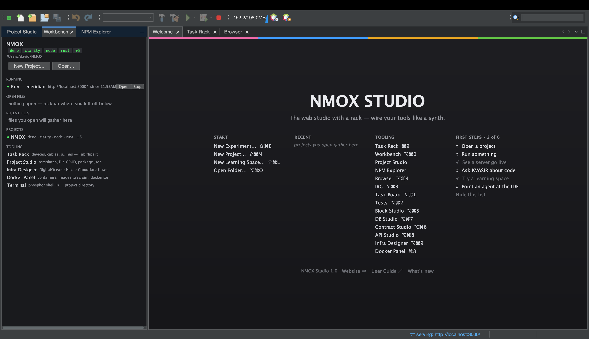

# NMOX Studio — Gabay ng gumagamit

<!-- languages -->
[English](user-guide.md) · [Español](user-guide.es.md) · [Français](user-guide.fr.md) · [Deutsch](user-guide.de.md) · [Русский](user-guide.ru.md) · [Українська](user-guide.uk.md) · [Polski](user-guide.pl.md) · [Português (Brasil)](user-guide.pt.md) · [Bahasa Indonesia](user-guide.id.md) · **Filipino** · [Tiếng Việt](user-guide.vi.md) · [简体中文](user-guide.zh.md) · [हिन्दी](user-guide.hi.md)
<!-- /languages -->

Kung paano gamitin ang produkto. Dinadaanan ng gabay na ito ang mga tampok sa pagkakasunod-sunod na makakaharap mo: pag-install, unang pagbukas, mga proyekto, ang rack, ang mga studio, ang mga wizard at ang mga panangga.

---

<a id="1-install"></a>
## 1. Pag-install

**macOS (inirerekomenda):**
```bash
brew trust --cask nmox/nmox-studio/nmox-studio
brew install nmox/nmox-studio/nmox-studio
```

Ang linyang `brew trust` ang minsanang kumpirmasyon ng Homebrew para sa anumang third-party na tap — hindi ka na tatanungin muli sa mga update. Ang app ay ad-hoc na nilagdaan ngunit hindi notarized, kaya tatanggihan ng Gatekeeper ang kopyang naka-quarantine sa unang pagbukas: inaalis mismo ng cask ang quarantine attribute sa isang hakbang na `postflight` at sinasabi iyon sa output ng pag-install. Walang tahimik na nangyayari.

**Lahat ng iba pa:** kumuha ng file mula sa [pinakabagong bersyon](https://github.com/NMOX/NMOX-Studio/releases/latest) — `.dmg` para sa macOS, `-setup.exe` para sa Windows, `.deb` para sa Debian/Ubuntu, karaniwang `.tar.gz` para sa Linux. Lahat ng apat ay may sariling Java runtime; walang kailangang i-install nang maaga. Ang `-portable.zip` lamang ang artefact na gumagamit ng sarili mong Java (kailangan ng Java 21+ sa PATH, o patakbuhin gamit ang `--jdkhome <landas-ng-jdk>`).

> **macOS, unang pagbukas:** ang app ay ad-hoc na nilagdaan ngunit hindi notarized, kaya nagtatanong ang Gatekeeper bago ito patakbuhin. Sa unang pagkakataon, **i-right-click ang app → Buksan** at kumpirmahin, o patakbuhin ang
> `xattr -d com.apple.quarantine "/Applications/NMOX Studio.app"`. Alinman sa dalawa ay panghabambuhay na ang bisa.

### Pag-update

Ini-update ng IDE ang sarili nito: nag-aalok ang **Mga Kasangkapan ▸ Mga Plugin ▸ Mga Update** ng mga modyul mula sa anumang mas bagong bersyon. I-install, i-restart kapag hiniling, tapos na — walang muling pag-download ng buong app. Isang tapat na paalala: ang kasamang Java runtime at ang launcher ay nagbabago lamang sa isang buong installer, kaya para sa malalaking paglipat ng plataporma, tama pa ring mag-install muli mula sa isang file ng bersyon.

<a id="2-first-launch"></a>
## 2. Unang pagbukas

Mula sa terminal, sinisimulan ng `nmoxstudio --open <folder>` ang app kasama ang folder na iyon na bukas bilang proyekto at nakaturo dito ang rack — ang parehong pinto na binubuksan ng “Buksan ang folder…” sa welcome page.

Bumubukas ang IDE kasama ang tatlong tab sa tabi ng lugar ng editor: **Maligayang Pagdating → Rack ng Gawain → Browser**. Isang ⌥⌘ shortcut lang ang layo ng bawat ibang window, at nakalista ang mga ito sa hanay na TOOLING ng welcome page. Sa kaliwang dock: **Studio ng Proyekto** (puno ng mga file at mga template), ang batayang **Lugar ng Trabaho** at ang **Explorer ng NPM**. Gumagawa ng folder na `~/NMOX` bilang default na workspace; doon nakaturo ang rack hanggang magbukas ka ng proyekto.



Mga shortcut na sulit matutunan sa unang araw (nakalista rin silang lahat sa welcome tab):

| Shortcut | Binubuksan |
|---|---|
| **⌘I** | Mabilisang paghahanap — naaabot ang lahat |
| **⌘9** | Rack ng Gawain |
| **⌥⌘0** | Lugar ng Trabaho |
| **⌥⌘1** | Task Board |
| **⌥⌘2** | Mga Test |
| **⌥⌘3** | Kliyente ng chat na IRC |
| **⌥⌘4** | Browser (nakapaloob na WebKit, may DevTools) |
| **⌥⌘5** | Studio ng Block |
| **⌥⌘6** | Studio ng Kontrata |
| **⌥⌘7** | Studio ng Database |
| **⌥⌘8** | Studio ng API |
| **⌥⌘9** | Taga-disenyo ng Infrastructure |
| **⌘8** | Docker Panel |
| **⌘7** | Balangkas ng kasalukuyang file |
| **⇧⌘N / ⌥⌘O** | Bagong proyekto… / Buksan ang folder… |
| **⇧⌘E / ⇧⌘L** | Bagong eksperimento… / Bagong espasyo ng pagkatuto… |

<a id="3-projects"></a>
## 3. Mga Proyekto

**Pagbubukas:** anumang folder na may isa sa 60 kinikilalang manifest ay bumubukas bilang tunay na proyekto — `package.json`, `Cargo.toml`, `go.mod`, `pom.xml`, `composer.json`, `foundry.toml`, `bower.json`, `Gruntfile.js`, at mga kauri — kasama na ang mga manifest ng mga contract chain: ang isang Aiken (`aiken.toml`) o Clarinet (`Clarinet.toml`) na repositoryo ay bumubukas na nakakabit na ang tunay nitong mga linya. Bumubukas din ang payak na folder ng HTML na may `<script>` at **walang** manifest, bilang proyektong STATIC: ang klasikong web ay first-class dito, hindi isang mali.

**Paglikha:** nag-aalok ang *Bagong proyekto…* ng tunay na mga balangkas — Angular, Vue, Svelte, payak na JavaScript, Elixir/Phoenix, PHP Web (LEMP), at Klasikong web (jQuery). Bawat isa ay dumarating na nakakabit na ang mga setting para sa lint, format at pagsusulit, at may nakahandang git na repositoryo: iisang commit ng balangkas na, kapag pinatakbo ng wizard ang pag-install para sa iyo, dala rin ang lockfile — kaya malinis ang iyong unang `git status`.

**Ligtas ang paglipat:** kung may tumatakbong mga kagamitan (isang development server, isang tagamasid), nagtatanong ang IDE bago lumipat at malinis itong pinapatay. Walang patuloy na tumatakbo sa likod mo — kailanman. Kahit ang sapilitang pagsasara ng IDE ay hindi makakaiwan ng ulilang proseso.

**Ang mga eksperimento** ang pinakamabilis na paraan para subukan ang isang stack. Ang **File ▸ Bagong eksperimento…** (⇧⌘E) ay pumipili ng template at gumagawa ng pansamantalang proyekto sa `~/.nmox/experiments`: walang git, walang kamakailan, pinagkakatiwalaan na, nakainstall na ang mga dependency — para **gumana agad ang unang Patakbuhin**. Bumubukas ito sa sarili nitong gabay na `EXPERIMENT.md`, na nagsasabi kung ano ang pipindutin, aling file ang babaguhin, at kung saan naroon ang talino ng IDE para sa stack na iyon. Itago ang nagiging kapaki-pakinabang: **File ▸ Mga eksperimento…** ▸ **Itaas** ang naglalabas nito at nag-uumpisa ng git, **Doblehin** ang gumagawa ng kopya sa tabi para sa pangalawang paraan, at **Itapon** ang nag-aalis ng iba. Ipinapakita ng istante ang edad ng bawat isa at ang nasukat nitong laki sa disk. Mas gusto mo ang gabay na landas? Inuuna ng dialog ang 93 espasyo ng pagkatuto.


**Patakbuhin, buuin, subukin — at itigil:** ang ▶ sa toolbar (F6) ay pinapatakbo ang proyekto gaya ng pagpapatakbo ng sarili nitong mga kasangkapan: isang `start` na script kung mayroon ang package.json, `cargo run`, `go run`, `dotnet run`, at para sa folder ng HTML ay isang maliit na static na server sa unang bakanteng port mula 8080. Katabi nito at nasa menu ng Patakbuhin ang Buuin, Subukin at Linisin. Ang development server na nag-aanunsyo ng address nito ay nagpapailaw sa ⇄ sa status bar at binubuksan ang pahina sa nakapaloob na browser. Ang lahat ay dumadaan muna sa pagtatanong ng tiwala sa workspace. Ang pagtakbong hindi makasimula ay tapat na sinasabi ito at nag-aalok buksan ang Doktor ng kapaligiran. Para huminto: ang ■ sa kanan ng Debug (⌥⌘.) ay pinapatigil ang lahat ng tumatakbong utos nang sabay at sinasabi kung ano ang pinatigil; ang **Patakbuhin ▸ Itigil** ay pinapatigil ang isa at pagkatapos ay nag-aalok ng **Ulitin**. Nakikita ng ■ ang lahat ng sinisimulan ng produkto para sa iyo, pati na ang mga pag-install; kapag inilapit ang cursor, pinangangalanan ng tooltip nang eksakto kung ano ang ititigil ng isang pindot, at kung mula kailan tumatakbo ang bawat isa.

**`.env` saanman:** kung may `.env` ang iyong proyekto, natatanggap ng mga kagamitang inilunsad mula sa rack ang mga variable na iyon. Baguhin ito at tatalâ ang status bar na kukunin ito ng mga muling pagsisimula — tapat na pinapanatili ng tumatakbong proseso ang lumang kapaligiran nito.

<a id="4-the-task-rack"></a>
## 4. Ang Rack ng Gawain


Ang rack ang puso ng produkto. Bawat kasangkapan sa daloy ng iyong trabaho — npm, ang bundler, ang tagapagpatakbo ng pagsusulit, ang development server, ang linter, ang git, ang paglalagay — ay isang kagamitan sa isang rack: pumipili ng gawain ang mga knob, pinapatakbo ito ng GO, ipinapakita ng mga LED ang kalagayan, at sinasabi sa iyo ng isang LCD sa mga salita kung ano ang nangyari.


**Ang batayan:**

- **Magdagdag ng kagamitan** sa pamamagitan ng paghila mula sa paleta (may mga kategorya at panala ito). May sariling kard na *Paano gamitin* ang bawat kagamitan.
- **Magpatakbo ng isang bagay** sa pagpindot ng GO ng isang kagamitan. Ilapit muna ang cursor: ipinapakita ng tooltip ang eksaktong linya ng utos na tatakbo. Walang mahika.
- **Ikabit ang isang daloy:** pindutin ang **Tab** upang ibaling ang rack sa likuran nito. Hilahin ang patch cable mula sa jack na **OK** ng isang kagamitan papunta sa jack na **GO** ng susunod. Ngayon ang `i-install → buuin → subukin` ay iisang pindot na lamang: umaandar ang tanikala nang mag-isa at humihinto sa unang pagkabigo. Umaagos ang output sa pantalang posporo ng kagamitang MONITOR.
- **Bawiin ang anumang pagbabago sa istruktura** sa pamamagitan ng **⌘Z** — pagdaragdag, pagtatanggal, muling pagkakabit. Ang pagtanggal ng tumatakbong kagamitan ay pinapatigil muna ang proseso nito.
- **Ang mga preset** ay nagbibigay ng buong nakakabit na rack sa isang pindot — Ship Gate, Dev Intelligence, Monorepo Lanes, E2E Loop, LAMP Bench, Web3 Bench, Uptime Watch. Kusang naiimbak ang mga kabitan kada proyekto.


**Pag-uugnay, kapag lumaki ang iyong daloy:**

- **QUORUM** ang nagtatagpo ng mga linya: pumuputok lamang ito kapag *lahat* ng nakakabit nitong pasukan ay nagtagumpay — ang klasikong “hintayin ang lint AT ang pagsusulit AT ang pagsusuri ng uri”.
- **Ang mga tarangkahang ENABLE** sa mga matagal tumakbo: ang pasukang ENABLE ng isang development server ay nangangahulugang “huwag magsimula hangga’t hindi pumuputok ito”.
- **REFLEX** ang nagbabantay sa mga file at nagruruta ayon sa padron — `src/**/*.css` sa isang tanikala, `**/*.ts` sa iba, kada linya sa isang monorepo.
- **ROSETTA** ang pumipili ng linya ng kasangkapan sa mga halo-halong repositoryo (tinutukoy ng rack ang Node/Rust/Go/PHP/… kada direktoryo at itinutok ang bawat kagamitan nang naaayon).

**Mga linyang nagsasalita ng sarili mong kasangkapan.** Sa AUTO, ang mga kagamitan sa lint at format (PURITY, GLOSS) ay nagsasalita ng kasangkapan ng mismong proyekto sa halip na abutin ang mga kagamitang Node saanman: ang isang workspace na Deno ay gumagamit ng `deno lint` at `deno fmt`, ang proyektong Cargo ng `cargo clippy` at `cargo fmt`, ang modyul na Go ng `go vet` (o `golangci-lint` kapag may dalang kompigurasyon ang proyekto) at `gofmt`. Binabaling ng isang `biome.json` ang mga linyang Node sa Biome, at laging nananaig sa AUTO ang tahasang posisyon ng knob.

**Ang sarili mong mga kagamitan.** Napapalawak ang istante gamit ang isang editor ng teksto: anumang `*.json` sa `~/.nmox/devices.d/` ay nagiging tunay na kagamitan — mga knob, pindutan, LED, port at kable, naiimbak sa kabitan at naaabot mula sa ⌘I. Ipahayag ang isang utos bilang hanay ng mga argumento, pangalanan ang isang knob, at ihahalili ang `{{knob}}` kapag pinindot ang pindutan. Nananatili sa punong-abala ang mga batas, hindi sa iyong file: **binabantayan ng tiwala sa workspace ang unang pagtakbo nang eksakto gaya sa isang kagamitang nakapaloob**.

**Ang mga tarangkahan ng kalidad** ang nagpapalit ng “mukhang tapos” sa “tapos na”:

- **VITALS** ang nagpapatakbo ng Lighthouse laban sa iyong buhay na server at humihingi ng pinakamababang antas ng bilis, ng pagkamaaabot, ng mabubuting kasanayan, o ng SEO.
- **VERITAS** ang nagpapatupad ng pinakamababang saklaw at inuulit nang eksakto ang mga pagsusulit na bumagsak, ayon sa pangalan.
- **GAUNTLET** ang naglalagay ng bigat sa isang endpoint at humihingi ng pinakamababang daloy. **PRISM** ang nagbabantay sa laki ng bundle, **BEACON** sa sertipiko at pagkabuhay ng isang URL, at **PREFLIGHT** ang tsek-lista bago magpadala — ikabit ang OK nito sa iyong kagamitan sa paglalagay at hindi talaga makakatakbo ang paglalagay hangga’t hindi berde ang lahat.
- **GOVERNOR** ang nagbabantay sa mga pag-urong ng gas sa gawaing Solidity (`.gas-snapshot`).

**Anupaman ang iba:** binabalot ng **SOLDER** ang anumang utos sa shell bilang isang ganap na kagamitan — at ang buong rack ay **nailalabas sa GitHub Actions** (ang iyong lokal na daloy at ang iyong integrasyon ay iisang kabitan). Nagpapatakbo ang **HELM** ng mga utos sa malayong server sa pamamagitan ng ssh, sinusundan ng **TAIL** ang anumang file ng talaan, at ang **PHOSPHOR** ay isang terminal sa loob ng rack. Kung magpi-print ang utos ng lokal na address, nagliliwanag ang ⇄ gaya sa anumang naghahaing kagamitan, at namamatay ito pagkatapos ng pagtakbo.

**Kusang nananatiling magkasundo ang rack.** Baguhin ang `package.json` at magsasariwa sa kinalalagyan ang knob ng mga script ng NPM-9000. Baguhin ang isang `Gruntfile` at babasahin muli ng DYNAMO ang mga gawain nito. Magdagdag ng dependency at magsasariwa ang tanaw ng CRATE. Walang muling pagtutok, walang pindutang pang-refresh.

### KVASIR — ipinapaliwanag ang huling pagkabigo


Ang **KVASIR** ay tulong ng AI sa paraan ng rack: isang kagamitang nagpapaliwanag sa maling nasa MONITOR bus ngayon, hindi isang gilid na panel ng usapan. Kapag bumagsak ang isang pagtakbo, pindutin ang **EXPLAIN** at tatanungin ng KVASIR ang iyong AI kung ano ang nagkamali at kung ano ang konkretong susunod na hakbang. Isang maikling hatol ang dumadapo sa pantalan; binubuksan ng **VIEW** ang buong sagot. Pumipili ang **MODEL** ng **FAST** (mabilis at mura, ang likas) o **DEEP** (mas malakas). Asul ang EXPLAIN: nagbabasa ito at nagtatanong, hindi nito hinahawakan kailanman ang iyong proyekto.

**Piliin ang iyong AI, ilagay ang iyong susi.** Gumagana ang KVASIR sa **Claude (Anthropic)**, **ChatGPT (OpenAI)** o **Gemini (Google)** — iyong susi, iyong pili. Pindutin ang **KEY…** upang piliin ang tagapaglaan at idikit ang susi nito; naaalala ang pinili, at nakatira ang susi sa keychain lamang ng operating system. Binabasa rin ang karaniwang mga environment variable ng bawat tagapaglaan, at nananaig ang naimbak na susi sa isang mula sa kapaligiran.

**Kung ano ang ipinapadala ng KVASIR, at iyon na ang lahat.** Sa unang pagpindot mo sa EXPLAIN, inililista ng isang dayalogo nang eksakto kung ano ang aalis sa iyong makina at kung ano ang hindi; walang ipinapadala nang walang pahintulot na iyon, at ang pahintulot ay kada tagapaglaan. Pagkatapos ng matagumpay na EXPLAIN, binubuksan ng **VIEW** ang sagot bilang isang usapan — maaari kang magpatuloy sa pagtatanong tungkol sa parehong pagkabigo.

**Tanungin ang KVASIR tungkol sa iyong kodigo.** Naaabot ng parehong katulong ang editor: pumili ng kodigo at piliin ang **Tanungin ang KVASIR tungkol sa pinili…**, o **I-edit gamit ang KVASIR…** upang sabihin kung ano ang babaguhin at makita ang bago at pagkatapos bago pa may maisagawa. Ang **⌥⌘G** ay pumupuno sa kinaroroonan ng cursor ng multong teksto na pumapasok lamang kapag pinindot mo ang Tab, at kayang isulat ng tanda ng sanga ng git ang iyong mensahe ng commit.

**Itutok ang isang ahente sa iyong IDE.** Ang Mga Kasangkapan ▸ Agent Port (MCP)… ay nagbubukas ng dulong MCP na maaaring tanungin ng katulong mula sa labas: ito ay **basahin-lamang ayon sa pagkakagawa**, patay hangga’t hindi mo binubuksan, nakikinig lamang sa lokal na interface, at humihingi ng tokeng nilikha nang buksan ito.

Napapalawak ang rack: maaaring magdagdag ng kagamitan ang mga plugin ng iba (i-install ang NBM nila sa Mga Kasangkapan ▸ Mga Plugin). Upang sumulat ng isa, tingnan ang [device-spi.md](device-spi.md).

<a id="5-the-editor"></a>
## 5. Ang editor


Mahigit 70 wika ang nakukulayan nang wasto — ang makabagong salansan, ang klasiko (kasama ang CoffeeScript), at ang buong patong ng kompigurasyon, hanggang sa `.env`, `.editorconfig`, mga kompigurasyon ng nginx at Apache, mga Dockerfile, at mga lockfile.

- **Ang pagkumpleto** ay may malay sa konteksto, at may malay din sa *klasikong aklatan*: kung may dalang jQuery, MooTools, Prototype, Backbone/Underscore, o Knockout ang iyong proyekto (sa pamamagitan ng mga dependency ng npm *o* payak na tag na `<script>`), lumilitaw ang kanilang mga API sa pagkumpleto. Ang mga proyektong jQuery 1.x at 2.x ay binibigyan ng tapat na tanda ng katapusan ng buhay, hindi ng paulit-ulit na paalala.
- **Ang balangkas ng Navigator (⌘7)** ay nagpapakita ng istruktura ng file para sa 58 uri; pindutin upang tumalon.
- **Ang minimap** — isang anyo ng buong file sa tabi ng scrollbar ng bawat editor; pindutin o hilahin upang mag-scroll. Laging kasya ang buong dokumento sa guhit: umuurong ang mga hanay habang lumalaki ang file. Ang Tanaw ▸ Minimap ay binubuksan at sinasara ito nang sabay para sa lahat ng bukás na editor.
- **Ang dumidikit na scroll** — ang mga deklarasyong bumabalot sa itaas ng tanaw (ang klase, saka ang paraang pinasok mo) ay nananatiling nakapaskil sa ibabaw ng teksto, hanggang tatlong hanay ng mismong kodigo; pindutin ang isa upang tumalon doon. Nawawala ang guhit kapag walang bumabalot sa pinakaunang nakikitang hanay.
- **Pumunta sa simbolo (⌥⇧⌘O)** ay tumatalon sa anumang function, klase, tuntunin, o pamagat sa buong proyekto sa pagta-type ng pangalan nito — may tugma ayon sa unlapi, sa malalaking titik sa gitna ng salita, o sa panghalili. Nakatakda at tapat ang indeks: nilalaktawan ang `node_modules`, at sa napakalaking proyekto sinasabi ng dayalogo na na-indeks nito ang unang 2,000 file sa halip na magkunwaring nabasa ang lahat.
- **Ang bintana ng pagsusulit (⌥⌘2)** ay nagpapakita ng bawat pagsusulit sa proyekto *bago pa may tumakbo*, at pinapatakbo ang isa, isang file, o lahat.

### Buksan ang daglat (⌥⌘E)

Mag-type ng daglat ng Emmet at pindutin ang **⌥⌘E**: nagiging buong talaan ang `ul>li*3`. Gumagana ito sa HTML, sa mga template ng Angular, at — sa anyong CSS nito — sa loob ng mga bloke ng `<style>` at mga katangiang `style`, kung saan nakakulong ang hiwa sa rehiyon upang hindi nito kailanman malulon ang markup sa paligid. Ang daglat na hindi kilala ng produkto ay tinatanggihan at iniiwan nang buo ang iyong teksto.

### Mga token ng disenyo (mga sariling katangian)

Ang pag-type ng `var(` ay nag-aalok ng mga tokeng idineklara sa tunay na mga stylesheet ng iyong proyekto, bawat isa may sariling patse ng kulay at kung saan idineklara. Ang **⌘-pindot** sa isang paggamit ng `var(--token)` ay tumatalon sa deklarasyon nito. Ipininta ang mga kulay bilang ang kulay na sila nga — hex, `rgb()`, `hsl()`, mga pangalan, at pati `oklch()`, `lab()` at `color-mix()` — at ang **⌘-pindot** sa isang literal ng kulay ay nagbubukas ng pampili na papalit dito sa mismong anyong isinulat mo.

### Kilala ng katangiang class ang iyong mga stylesheet

Ang pag-type sa loob ng `class="…"` ay nag-aalok ng mga klaseng tunay na tinutukoy ng iyong proyekto, sabay sabi kung saang stylesheet nanggaling; ang **⌘-pindot** sa isang klase ay tumatalon sa tuntunin nito, at ang **⌘-pindot** sa isang pampiling `.klase` ay tumatalon sa unang paggamit nito sa markup. Ang **Palitan ang pangalan ng klase…** ay nagpapalit sa buong proyekto — buong token lamang, may bilang kada file — at tumatangging malakas kung nagagamit na ang bagong pangalan o may hindi pa naise-save na pagbabago.

### Patakbuhin ang script, mula sa cursor

Sa bahaging `scripts` ng isang `package.json`, pinapatakbo ng **Patakbuhin ang script** ang hanay na kinalalagyan ng cursor — sa parehong pagtatanong ng tiwala sa workspace at sa parehong ■ gaya ng anumang ibang pagtakbo.

### Mga susi ng kapaligiran, first-class

Ang pag-type ng `process.env.` o `import.meta.env.` ay nag-aalok ng mga susing talagang tinutukoy ng iyong pamilya ng mga file na `.env`, at ang **⌘-pindot** ay tumatalon sa hanay na nagdedeklara ng susi. Pinuputol ang mga halagang ipinapakita: naroon ang paalala, wala ang lihim.

### Mga template ng Angular, first-class

Bumubukas ang mga file na `.component.html` na may sariling pangkukulay ng template, may mga blokeng `@if`/`@for` at mga direktibang pang-istruktura sa pagkumpleto. I-install ang Angular Language Service at talagang dumarating ang pagsusuri ng uri sa template: mali ang pangalan ng isang katangian at ang mismong compiler ng Angular ang magmumungkahi ng tama. Ang **⌘B** sa loob ng isang template ay tumatalon sa deklarasyon, at ang menu ng konteksto ay lumilipat sa pagitan ng komponente, ng template nito, ng mga estilo nito, at ng pagsusulit nito.

### Mga komponente ng Vue at Svelte, first-class

Bumubukas ang mga file na `.vue` at `.svelte` na may sariling pangkukulay, sariling pagkumpleto (kasama ang tuldok na mga rune ng Svelte 5), at Emmet sa loob ng mga blokeng template nila. Talagang dumarating sa editor ang mga diyagnostiko ng Vue, sa pamamagitan ng sariling language server ng Vue.

### Pag-debug gamit ang tunay na breakpoint

Pindutin ang kaliwang gilid, piliin ang **I-debug ang file (mga breakpoint)**, at hihinto roon ang programa — kasama ang salansan, ang mga variable, at ang pagtaya ng mga ekspresyon. Gumagana ang JavaScript at TypeScript mula sa pabrika dahil sa kasamang adapter; gumagamit ang Python ng debugpy at ang Go ng delve, na ikaw ang mag-i-install. Ganoon din ang ginagawa ng **I-debug sa Chrome** para sa isang pahina: humihinto sa loob ng IDE ang mga breakpoint sa iyong pinagmulan habang tumatakbo ang browser sa isang pansamantalang profile. Dumadaan muna ang lahat sa pagtatanong ng tiwala sa workspace.

### Pagpapakita at pagbabahagi

Ang **Tanaw ▸ Presentation Mode** ay sabay-sabay na nagpapalaki sa bawat bukás na editor, sa pahina sa nakapaloob na browser, sa bintana ng Output, at sa Terminal — at ibinabalik ang lahat nang eksakto pagkalabas mo. Ang **Tanaw ▸ Ipakita ang mga Pindot** ay ipinapakitang malaki ang kombinasyong katatapos mong pindutin, ngunit hindi kailanman ang tinitipa mo. Ang **I-edit ▸ Kopyahin bilang Markdown** ay kinokopya ang pinili bilang nakabakod na bloke na may tamang tatak ng wika, at ang bersyong **may link** ay idinadagdag ang link ng GitHub sa mismong mga hanay na iyon. Ang **Mga Kasangkapan ▸ I-save ang screenshot…** ay ipininta ang buong bintana sa doble ang laki, may mga bersyon para sa tab ng editor lamang, para sa clipboard, at para kopyahin ang puno ng proyekto bilang Markdown.

<a id="6-the-studios"></a>
## 6. Ang mga studio

### Pag-abot gamit ang teklado at ang screen reader

Bawat kontrol sa rack ay may pangalang naaabot, at sinusuri iyon sa bawat pagbuo. Ang mga knob ay mga slider na sumusunod sa mga arrow, sa Home at sa End; ang mga pindutan ay sumusunod sa Espasyo at Enter, pati na ang mga nakadimm na nagsasabi kung bakit sila tumatanggi; ang mga LED at pantalan ay ipinapahayag ang kanilang kalagayan. Ibinabaling ng Tab ang rack — maliban kung nasa isang kontrol ang pokus, kung saan ito ay nagbibigay-daan sa karaniwang paglipat.

### Git, sa status bar

Ipinapakita ng tandang **⎇ sanga** kung nasaang sanga ka at kung ilang file ang nabago; binabasa ito mula sa disk, kaya wala itong gastos na proseso. Ang isang pindot ay nagbubukas ng buong kasaysayan, at ang menu ay may **Pagkakaiba ng proyekto**, **Anotasyon**, ang mga pull request sa iyong sariling `gh`, at **Isulat ang mensahe ng commit gamit ang KVASIR**.

### Pisara ng Gawain (⌥⌘1)

Isang kanban kada proyekto na naka-imbak sa `.nmoxtasks.json` — katabi ng iyong kodigo at kasama nitong binibersyon. Hilahin ang mga kard o igalaw ang mga ito sa teklado: ang **⌘↑/⌘↓** ang nag-aayos muli, at ang inilipat na kard ay hawak pa rin ang pokus. Ang mga hangganan ng kasalukuyang gawain ay payo, hindi harang: nagpupula ang ulunan at walang pumipigil sa iyo. Ang pindutang **Pangkalahatang tanaw** ay pinapalitan ang mga hanay ng isang dashboard — kasalukuyang ginagawa, tapos ngayon at ngayong linggo, daloy kada araw, mga kard na tumatanda — at ang orasan (**Mag-time in**) ay sinusukat ang tunay na oras kada kard, na may iisang orasang umaandar sa buong pisara. Ang **Standup** ay ginagawang isang ulat na handang idikit ang lahat ng iyon.

### Studio ng Block (⌥⌘5)

Bumuo ng tunay na Web Components mula sa mga piyesang may uri na nagkakabit-kabit, sa paraang Scratch: tinatanggihan ang mga bawal na pagpapasok, isinisilang ang kodigo bilang isang custom element na nakatayo mag-isa, at ang pagpindot sa isang piyesa ay nagpapaliwanag sa mga hanay nito. Isang preview server sa memorya ang nagpapakita ng komponente nang totoo, kasama ng ibang mga wastong komponente sa iyong aklatan. Eksakto ang balikan: ang muling paglikha ng kabababasa lamang ay nagbibigay ng parehong file, byte kada byte.

### Studio ng API (⌥⌘8)

Mga koleksyon, kahilingan, kapaligirang may `{{variable}}`, at pagsusulit, na naka-imbak sa `.nmoxapi.json` — ang mga lihim ay nasa keychain lamang, hindi kailanman sa file na iyon. Bawat tugon ay binibigyan ng marka ng seguridad mula sa sarili nitong mga header. Mag-import mula sa curl, `.http`, OpenAPI, Postman, Insomnia at HAR; mag-export sa `.http`, at kopyahin bilang curl o bilang `fetch`, na nakalagay na ang mga variable.

### Studio ng Database (⌥⌘7)

SQLite, PostgreSQL, MySQL, MariaDB, MongoDB at CouchDB, kasama na ang mga driver at ang mga password sa keychain lamang. Kilala ng console ang makina, may sariling grid ng resulta ang bawat pahayag, at ang mga hanay ay ine-edit sa mismong grid kapag may pangunahing susi — may silip sa mismong mga UPDATE bago ilapat, at may tapat na dahilan kapag basahin-lamang ang isang bagay. Mag-export sa CSV o JSON, na pinawalang-bisa ang mga pormula.

### Studio ng Kontrata (⌥⌘6)

Ang puno ng mga artefact ng Foundry at Hardhat, isang **Makipag-ugnayan** na ginagabayan ng ABI na may nabasang mga balik at pagbawi, isang paneling **Bantayan** na sumusunod sa mga bloke at pangyayari, at ang **Pangangasiwa** na may talaan ng gas, mga hatol sa laking EIP-170, at ang aklat ng mga address. **Kailanma’y walang pribadong susi**: ang mga padala ay dumadaan sa mga hindi nakakandadong account ng isang lokal na network, at ang mga lihim na URL ay nakatira sa keychain.

### Taga-disenyo ng Infrastructure (⌥⌘9)

Isang lienzo para sa DigitalOcean, Hetzner at Cloudflare: itugma sa kung ano ang tunay na umiiral, i-refresh upang makita ang pagkakaiba, at gibain ang isang salansan habang nakalantad ang halaga nito. Ang mga bawal na kabit ay tumatanggi nang malakas at sinasabi kung bakit, at habang tumatakbo ang isang gawain sa ulap, nakakandado ang lienzo na may guhit na nagsasabi nito.

### IRC (⌥⌘3)

Isang buong kliyente sa loob ng IDE: TLS na may tunay na pagsusuri ng pangalan, SASL, mga pagpapalawig ng IRCv3, pagkumpleto sa Tab, mga pagtatampok, mga URL na bumubukas sa nakapaloob na browser, pagtatala sa disk, sarili mong mga panala, at isang talaan ng mga channel na sinasala mo habang nagta-type.

### Ang kasamang websayt

Ang **Tulong ▸ Websayt ng NMOX Studio (lokal)** ay naghahain ng websayt ng produkto mula sa sarili nitong rack, sa lokal na interface. Nagsasalita ito ng parehong labintatlong wika na sinasalita ng IDE; nasa paanan ng pahina ang pampili.

### Browser (⌥⌘4)

Isang tunay na browser sa loob ng IDE, na may sariling mga kasangkapan ng developer — console, DOM, network, imbakan, at mga panel para sa Vue, Svelte at Angular — dahil walang dalang inspektor ang makina, at atin itong isa. May malay ito sa iyong pinagmulan: pumili ng elemento, buksan ang hanay na lumikha nito, baguhin ang estilo nito sa mismong kinaroroonan, at ang deklarasyon ay dadapo sa pinagmulang stylesheet. Ang pag-save ng file ay muling nagkakarga ng pahina, at may tunay na sukat ng kagamitan upang subukin ang iyong nakikiayong ayos.

<a id="7-docker"></a>
## 7. Docker

Ang tab na Docker ay isang panel ng kontrol: kalagayan ng makina, mga lalagyan, imahen, volume, at network, kasama ang pagsisimula, paghinto, mga tala, at paglilinis. Ang kagamitang HARBOR sa rak ay nagpapakita ng gayon din sa isang sulyap. At gaya ng nasabi na: patakbuhin ang isang lalagyan ng Postgres, MySQL, o Mongo, at mag-aalok sa inyo ang Studio ng Database ng handa nang koneksyon.

Ang tab na **Dockerize** ay gumagawa ng `Dockerfile` na pang-produksiyon, ng `.dockerignore`, at ng talaksang pangkomposisyon na akma sa hanay ng kasangkapan ng inyong proyekto — Node, PHP-FPM kasama ang nginx, at iba pa.

<a id="8-wizards-and-kits"></a>
## 8. Mga pantulong at kit

Nasa *Bagong Talaksan…* silang lahat at nasa menu ng proyekto, at pawang **idempotente at hindi kailanman pumapatong**: ang muling pagpapatakbo ay nagsasariwa lamang sa kung ano ang kanila, at hindi ginagalaw ang inyong mga binago; ang hindi maaaring isulat muli ay dumadapo sa tabi bilang talaksang `.suggested`.

### Kit ng mga pamantayan

`robots.txt`, `sitemap.xml`, ang manipesto ng web, ang `security.txt` ayon sa RFC 9116, at `humans.txt`, na ginawa mula sa inyong mga sagot.

### Kit ng PWA

Isang buong hanay ng mga ikon na pinanday mula sa iisang larawan, kasama ang mga uring may maskara; isang service worker na mababasa — balat ng aplikasyon o unahin ang network, kayo ang pipili —, isang pahina para sa walang network, at ang pagkakabit sa `index.html` na nagtatali sa lahat.

### Kit ng aksesibilidad

Aksesibilidad bilang pinagsisimulan, hindi bilang pagsusuri pagkatapos ng lahat: `a11y.css` (nakikitang singsing ng pokus, kasangkapan para sa tekstong binabasa lamang ng mga tagabasa ng tabing, mga estilo ng tumatalong kawing, at bloke para sa mga nais ng mas kaunting galaw), `A11Y-NOTES.md` na may lakad sa pamamagitan ng teklado at ang mga tanong na hindi masasagot ng anumang awtomasyon, at ang idempotenteng pagkakabit sa `index.html` — ang wika, ang tumatalong kawing, ang tabing ng estilo. Ang viewport na pumipigil sa paglaki ay binabalaan, hindi kailanman isinusulat muli; ang hindi kayang ayusin ng kit ay sinasabi, hindi hinihipo.

### Kit ng internasyonalisasyon

Maisasalin mula sa unang araw, kapatid ng kit ng aksesibilidad: `locales/en.json` at `locales/es.json` (isang katalogo bawat wika, magkatulad na susi), isang `i18n.js` na walang kailangang iba na naglalapat ng katalogo sa markang `data-i18n`, nagpapanatiling totoo ang `<html lang>`, at nagpapakita ng nawawalang susi bilang sarili nito, hindi bilang tahimik na puwang; kasama ang `I18N-NOTES.md` — walang pinagdugtong-dugtong na piraso, `Intl` para sa petsa at bilang, ang lakad mula kanan pakaliwa, at ang seudolokalisasyon.

### Kit ng kontrata (Web3)

Pumili ng kadena — Solidity kasama ang Foundry, Soroban, Solana, CosmWasm, ink!, Cairo, Move, Bitcoin kasama ang Miniscript, Clarity sa Stacks, Cardano kasama ang Aiken, o TON kasama ang Tact — at ng pangalan ng kontrata, at itatayo ng kit ang pasimulang napatunayan nang buhay: manipesto, kontrata, katutubong pagsubok, at isang CONTRACT-NOTES.md na pumapangalan sa mga kagamitan ng rak at sa mga hakbang na minsanan. Hindi kailanman nahahawakan ng IDE ang mga susi.

### Klasikong kit

Idagdag sa anumang kodigo ang jQuery, MooTools, Prototype, Backbone kasama ang Underscore, o Knockout, maging nasa mismong imbakan (nakapakong bersiyon, nakatalang sha256) o bilang kailangan ng npm; kasama ang mga balangkas ng webpack, grunt, gulp, o bower.

<a id="9-quick-search-status-line-and-staying-oriented"></a>
## 9. Mabilisang paghahanap, guhit ng kalagayan, at hindi pagkaligaw

### Ang tanda na ⇄ naglilingkod

Lumilitaw sa guhit ng kalagayan ang tandang **⇄ naglilingkod** tuwing may mga tagapaglingkod na gising: ang pagtakbo ng IDE mismo, ang mga kagamitang naglilingkod, at anumang utos na nagpalimbag ng lokal na adres. Pindutin at pumili ng isa: bubukas ito sa nakapaloob na pantingin, o sa pantingin ng sistema kapag hindi ito kaya ng tab na iyon.

### ⌘I, ang pangkalahatang tagahanap

Isang kahon lamang ang umaabot sa inyong mga proyekto (ang kamakailan at ang kilala), sa bawat kagamitan ng rak — tuwid sa mga kontrol nito —, sa mga **tagapaglingkod na gising** (Enter ang magbubukas nito sa pantingin), sa mga kahilingan ng Studio ng API, sa mga koneksyon at talahanayan ng Studio ng Database, sa mga kontrata, sa mga buko ng imprastruktura, at sa mga kard ng Pisara ng Gawain, at pinapangalanan ng hanap ang hanay na kinalalagyan ng kard.

### Sinasabi ng guhit ng kalagayan kung ano ang buhay

Katabi ng tanda ng mga tagapaglingkod ay ang tinutukang proyekto kasama ang hanay ng kasangkapan nito, at ang sanga ng Git kasama ang bilang ng talaksang binago ninyo. Lahat ito ay binabasa mula sa disk o mula sa mga talaang itinatago na ng produkto: ang pagtingin ay walang halagang proseso.

### Ang Lugar ng Trabaho

Ito ang tahanan: kasalukuyang proyekto, mga talaksang bukas at kamakailan, mga kamakailang proyekto, at panimula para sa bawat ibabaw. Habang may tumatakbo, ang bahaging **TUMATAKBO** ang nangunguna sa pahina — bawat utos na sinimulan ng produkto para sa inyo, kasama ang adres nito kung nagbigay ito ng isa at kung mula anong oras ito tumatakbo, dagdag pa ang bawat tagapaglingkod na hawak ng isang kagamitan ng rak. May tunay na butones na **Buksan** at **Ihinto** ang bawat hanay, naaabot ng teklado at ng tagabasa ng tabing, kaya maaaring ihinto ang isang pagtakbo nang hindi ibinabagsak ang iba. Tunay na butones ang lahat ng pamagat sa Lugar ng Trabaho: naaabot ng Tab, binubuksan ng Enter. Umaabot din ang ⌘I sa gayon ding mga pagtakbo: itipa ang «ihinto» at ihihinto ng Enter ang eksaktong iyon. Ang inyong ihininto mismo ay mababasang *ihininto* saanman iulat ang kinalabasan nito, hindi kailanman bilang kabiguan.

### Mga daglat ng Emacs (at ng Eclipse, at ng IntelliJ)

Ang Mga Kasangkapan ▸ Mga Pagpipilian ▸ Mapa ng Teklado ay nagpapalit ng buong hanay: ang mga galaw at ang gupit at dikit ng Emacs sa bawat patnugot, o ang mga hanay ng Eclipse at IDEA kung doon nakatira ang alaala ng inyong mga daliri. Nakatala sa lahat ng limang hanay ang bawat daglat ng NMOX, kaya hindi kailanman nagagastos ng pagpapalit ang mga daglat ng mga studio.

<a id="10-the-safety-nets-things-you-dont-have-to-do-anything-for"></a>
## 10. Ang mga lambat ng kaligtasan (ang hindi ninyo kailangang gawin)

### Muling pagkabuhay ng sesyon

Kinukunan ng rak ng larawan ang tumatakbo kada ilang segundo. Isang sapilitang pagsara, isang pagbagsak, isang `kill -9` — sa muling pagbukas, may abisong nag-aalok na ibalik ang eksaktong sesyong nawala sa inyo, sa isang pindot.

### Ang katiyakan laban sa mga ulila

Ang paglabas sa IDE ay pumapatay sa bawat prosesong sinimulan nito — mga tagapaglingkod ng pagbuo, mga REPL, mga tanikala, mga bantay —, TERM muna at KILL kung tumatanggi, kasama ang mga inapo.

### BLACKBOX at SONAR

Ilagay ang **BLACKBOX** sa inyong rak at mayroon kayong itim na kahon: bawat pagsisimula at bawat paglabas, kasama ang tagal, ang takbo ng panahon, at kung ano ang nagbago mula sa huling luntiang pagbuo. Ang ihininto ninyo mismo ay mababasang IHININTO — hindi luntian, hindi kabiguan, at hindi kailanman ang bagay na ipinapaliwanag sa KVASIR. Ipinapakita ng **SONAR** kung sino ang may hawak sa inyong mga daungan, isinabay sa Docker, at sa isang pindot ay pinapaalis ang nakaupo sa 3000.

### Mga talaksang hindi kailanman pinapatungan

Ang apat na talaksang gawain ng mga studio (`.nmoxapi.json`, `.nmoxdb.json`, `.nmoxweb3.json`, `.nmoxinfra.json`) ay muling binabasa kapag binago ninyo ang mga ito sa labas ng IDE — ngunit kung may hindi pa naitalang pagbabago, kayo ang tatanungin, hindi papatungan. Ang talaksang sira ay inilalagay sa tabi bilang `.bak` at iniuulat, hindi kailanman pinapalitan nang tahimik.

### TypeScript nang walang pagbuo

Ang proyektong ang pasukan ay `index.ts`, `main.ts`, o `src/index.ts` ay tumatakbo mula sa IGNITION sa pamamagitan ng sariling paghuhubad ng uri ng Node (`--experimental-strip-types`, mula sa Node 22.6; likas na mula 23.6 at 22.18 LTS). Ang pagtanggi ng mas lumang Node ay isinasalin sa pangungusap na pumapangalan sa hangganang iyon.

### Ang inyong wika

Nagsasalita ang NMOX Studio ng labintatlong wika: English, Español, Français, Deutsch, Русский, Українська, Polski, Português (Brasil), Bahasa Indonesia, Filipino, Tiếng Việt, 简体中文, at हिन्दी. Piliin ang sa inyo sa **Mga Pagpipilian ▸ Pangkalahatan ▸ Wika** — bawat isa ay nakasulat sa sarili nitong pangalan, upang matagpuan ninyo palagi ang sa inyo. Isinusulat ang pinili sa inyong mga ayos ng pagsisimula (`etc/nmoxstudio.conf`, bilang argumentong `--locale`) at umiiral din agad. Nagbabago: ang mga menu, ang mga dayalogo, ang mga paalala, ang mga guhit ng kalagayan, ang pagsalubong, at ang mga pagpipilian. Nananatili: ang bokabularyo ng mga harapan ng rak (GO, STOP, EXPLAIN — mga tatak ng kasangkapan, tulad sa isang sintesayser), at ang mas malalalim na dayalogo ng plataporma, na wala pang salin. Maaaring hindi na kayo kailanman pumili: ang bagong instalasyon ay nagsasalita na ng wika ng inyong sistema, at maging mula sa bansang hindi namin kailanman pinangalanan — ang Taiwan, Singapur, Portugal, at Quebec ay dumadapo sa sariling wika at hindi sa Ingles, sapagkat ang mga katalogo ay ipinangalan sa isang wika at kailanman ay hindi sa isang bansa.

### Ang pang-araw-araw na tingin sa pagbabago

Tahimik, minsan sa isang araw: kung may mas bagong labas, may abisong maghahatid sa inyo sa tagapamahala ng modyul, sa tab nito ng mga pagbabago, kung saan inilalagay ng sentro ng pagbabago ang mga bagong modyul sa kinalalagyan nila. Patayin ito sa Mga Pagpipilian ▸ Pangkalahatan.

<a id="11-learning-spaces"></a>
## 11. Mga espasyo ng pagkatuto

### Suriin ang inyong gawa

May ilang espasyong may mga hintuan ng pagsusuri: pumili ng gayon at ang **Talaksan ▸ Suriin ang Aking Gawa** ay tunay na sumusuri sa mga pagsasanay — ang sinasabi ng mga talaksan ay sinusuri sa purong Java, kasama ang pagsusuri ng *kawalan*, na siyang tanging paraan upang mapatunayan ang «binago ninyo ang pamagat»: kailangang mawala na ang orihinal na teksto ng halimbawa. Ang sinasabi ng mga utos ay dumadaan sa sariling hanay ng kasangkapan ng espasyo. Bawat ✗ ay sumasagot gamit ang sariling pahiwatig ng espasyo, at kapag may pumalya, nag-aalok ang ulat ng **Ipaliwanag sa KVASIR…**: ang mga hintuang pumalya at, sa pagsusuri ng talaksan, ang inyong sariling talaksan, may hangganan at sa ilalim ng pahintulot na nagsasabi mismo kung ano ang lumalabas. Ang sagot ay parang sa isang tagapagturo: kung ano ang babaguhin, at pagkatapos ay suriin muli.

### Ang inyong sariling mga aralin

Maglagay ng talaksang `*.json` sa `~/.nmox/learn-catalog.d/` at sasama ito sa pampili, sa gayon ding balangkas ng mga likas; ang tumutugmang `slug` ay humahalili sa likas. Nagtuturo kayo? Sumulat sa pamamagitan ng paggawa: gawing pangkaraniwang proyekto ang pagsasanay, at ang **Talaksan ▸ Iluwas bilang Espasyo ng Pagkatuto…** ang bubuo ng talaksang iyon para sa inyo — ang mga halimbawa, ang inyong `TUTORIAL.md`, ang tagapagpatakbo, at ang inyong mga hintuan — na pinatunayan laban sa sariling tagabasa ng pampili bago isulat, kaya ang ibibigay ninyo sa inyong mga mag-aaral ay eksaktong ilalapag ng kanilang pampili.

### Ang katalogo

Ang *Bagong Espasyo ng Pagkatuto…* ay nag-aalok ng 93 likas na aralin — mga wika, balangkas, at aklatan. Bawat isa ay bumubuo ng maliit na halimbawang proyekto, isang giniyahang aralin, at isang rak na nakakabit na ang **tunay na tagapagsalin**: nagtatipa kayo sa rak at sumasagot ang buhay na tagapagsalin. Ang pihit na ENGINE ay pumipili sa 37 tagapagsalin; kung wala ang isa, inilalagay ito ng butones na INSTALL doon din, habang ipinapakita ang usad sa tabing. Nakatira ang mga espasyo sa `~/.nmox/learn`, hiwalay sa inyong tunay na gawain.

### Mga unang hakbang, sa pagsalubong

Isang ikaapat na hanay ang naglilista ng anim na unang kilos — magbukas ng proyekto, magpatakbo ng isang bagay sa rak, makita ang isang tagapaglingkod na magising, magtanong sa KVASIR tungkol sa kodigo, sumubok ng espasyo ng pagkatuto, at ituro ang isang ahente sa IDE — at minamarkahan ang bawat isa mula sa mga talang itinatago na ng produkto. Bawat hanay ay pintuan: isang pindot at bumubukas ang bintana o ang kilos. Hindi na nawawala ang marka; naglalaho ang hanay kapag tapos na ang anim, o kapag pinindot ninyo ang **Itago ang listahang ito**.

### Ang tatlong sagot ng menu ng Tulong

Ang **Ano ang Bago…** ay nagdadala ng mga tala ng bersiyong pinapatakbo ninyo, kasama sa mismong pagbuo; sa unang pagbukas matapos ang pagbabago, kusa itong bumubukas dala ang mga labas na hindi pa nakikita ng inyong instalasyon. Ang **Mag-ulat ng Suliranin…** ay bumubuo ng ulat mula sa inyong kapaligiran at sa huling apatnapung guhit ng talaan, sinala na — ang inyong sariling tahanan ay nagiging `~`, ang inyong pangalan sa pagpasok ay `<user>`, at anumang mukhang lihim ay `[redacted]` —; inaayos ninyo ito, at ang **Buksan sa GitHub** ang magpupuno ng isang isyung kayo mismo ang magpapadala, o kokopyahin ninyo. Hindi kailanman nagpapadala ng anuman ang produkto sa sarili nitong pasya. Ang **Mga Daglat sa Teklado…** ay naglilista ng bawat daglat ng NMOX sa inyong gamit na hanay, binasa mula sa buhay na mapa ng teklado, kaya hindi ito maaaring lumihis sa ginagawa ng mga menu.

<a id="12-when-somethings-wrong"></a>
## 12. Kapag may mali

### Ang Manggagamot ng Kapaligiran

Nasa menu ng Mga Kasangkapan, sinisiyasat nito nang buhay ang 66 panlabas na kasangkapan — node, npm, docker, forge, composer, gopls… — at ipinapakita ang natagpuang bersiyon at ang utos ng pag-instala para sa nawawala.

### Mga pader na may pinto

Kapag walang tagapaglingkod ng wika o kasangkapan, sinasabi ng IDE kung anong utos ang patatakbuhin, o nag-aalok itong patakbuhin mismo; hindi kailanman basta kabiguan. May sariling pinto ang isang pader: walang dalang tsserver ang TypeScript 7, kaya kung ang natagpuang TypeScript ay ika-7, minsang sasabihin ito ng patnugot at ihahain ang linyang ika-5 — ang siya ring inilalagay nito sa gayon ding dahilan. Kapag may kumuha na sa isang daungan, pinapangalanan ng mali ang prosesong nakaupo roon, at pinapaalis ito ng SONAR.

### Isang GO na walang ginagawa

Tingnan ang tabing nito: nagpapaliwanag ang mga kagamitan sa pamamagitan ng salita, at ipinapakita ng paalala sa butones na GO ang eksaktong utos na patatakbuhin sana nito, upang masubok ninyo ito sa isang terminal.

### Bumubukas ang aplikasyon sa wala (macOS)

Walang bintana at walang mali, sa unang pagbukas matapos mag-instala: kuwarentenas iyon ng Gatekeeper — tingnan ang paalala sa kabanata 1. Kanang pindot at Buksan, minsan lamang, at ayos na habambuhay. Nakatira ang mga talaan sa ilalim ng `~/Library/Application Support/nmoxstudio/…/var/log/` sakaling kailanganin ninyong magbukas ng isyu.

<a id="appendix-the-files-nmox-studio-writes-and-what-to-commit"></a>
## Dagdag: ang mga talaksang isinusulat ng NMOX Studio (at kung alin ang isasama sa imbakan)

Lahat ng itinatago ng IDE tungkol sa isang proyekto ay mababasang talaksang JSON sa ugat ng proyekto, ginawa upang maibahagi sa inyong pangkat.

| Talaksan | Ano ang laman | Isama sa imbakan? |
|---|---|---|
| `.nmoxapi.json` | Mga koleksyon, kahilingan, kapaligiran, at pagsubok ng Studio ng API | **Oo** — makukuha ng kasama ninyo ang buong lugar ng inyong trabaho |
| `.nmoxdb.json` | Mga koneksyon, naitagong tanong, at kasaysayan | **Oo** — *hindi kailanman* naroon ang mga hudyat (nasa susian lamang) |
| `.nmoxweb3.json` | Mga network at aklat ng adres ng Studio ng Kontrata | **Oo** — *hindi kailanman* naroon ang lihim na adres (nasa susian lamang) |
| `.nmoxinfra.json` | Ang lienso ng imprastruktura: buko, kableng, at katangian | **Oo** — *hindi kailanman* naroon ang mga token (nasa susian lamang) |
| `.nmoxtasks.json` | Ang Pisara ng Gawain: hanay, kard, at hangganan | **Oo** — iisang pisara ang hawak ng pangkat; huwag isama kung nais pansarili |
| `.gas-snapshot` | Ang panukat ng gas ng Foundry (binabantayan ito ng GOVERNOR) | **Oo** — gayon nahuhuli ang paurong na gas sa pagsusuri |
| `.env` | Ang inyong mga pabago ng kapaligiran | **Hindi** — iyan mismo ang dahilan ng `.env` |
| `*.bak` | Isang talaksang gawaing hindi nabasa, itinago para sa inyo | Hindi — kunin ang kailangan, saka burahin |

Baguhin ang alinman sa apat na talaksang `.nmox*.json` sa labas ng IDE, o hilahin ang mga pagbabago ng kasama, at kusang magbabasang muli ang katumbas na studio — maliban kung may hindi pa naitalang pagbabago kayo roon, at magtatanong muna ito.

Sa labas ng proyekto: ang `~/NMOX` ang likas na lugar ng trabaho, ang mga pagsubok ay nasa `~/.nmox/experiments`, ang mga espasyo ng pagkatuto ay nasa `~/.nmox/learn`, at ang kalagayan ng IDE mismo — ang ayos ng mga bintana, ang mga patch ng rak, ang mga pagpipilian — ay nasa direktoryo ng gumagamit ng plataporma.
