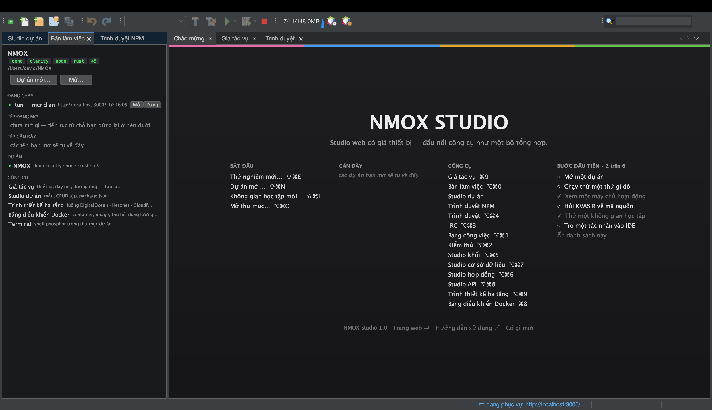
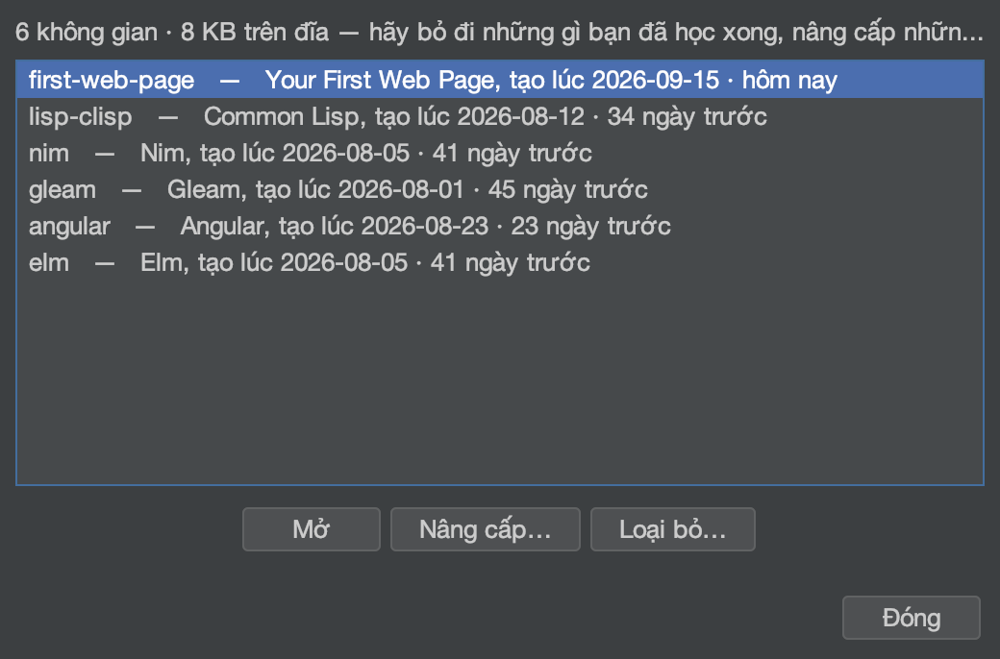
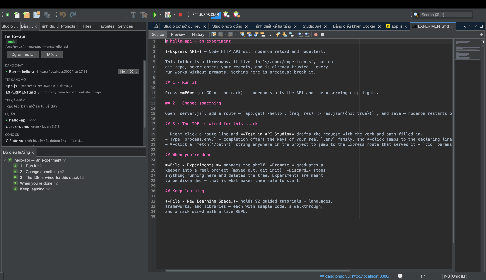
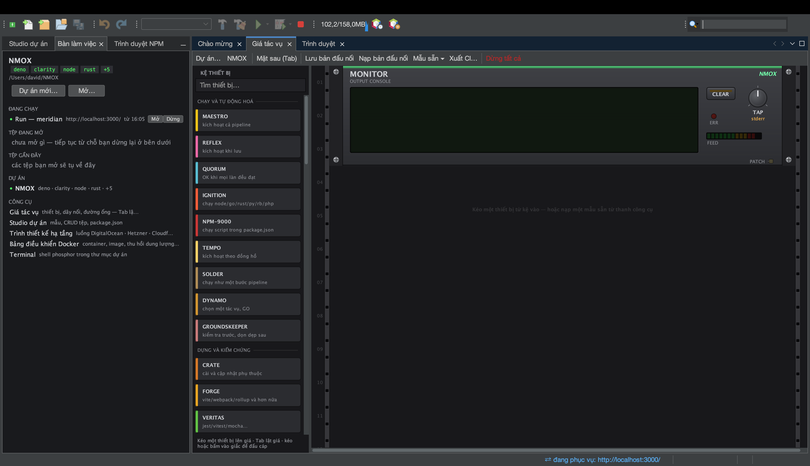
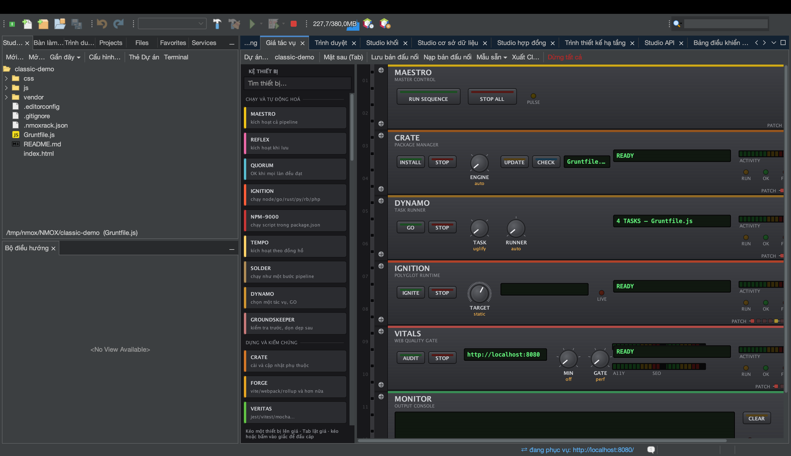
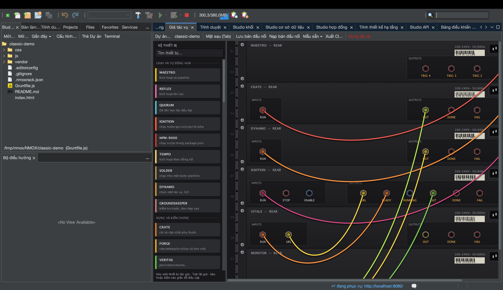
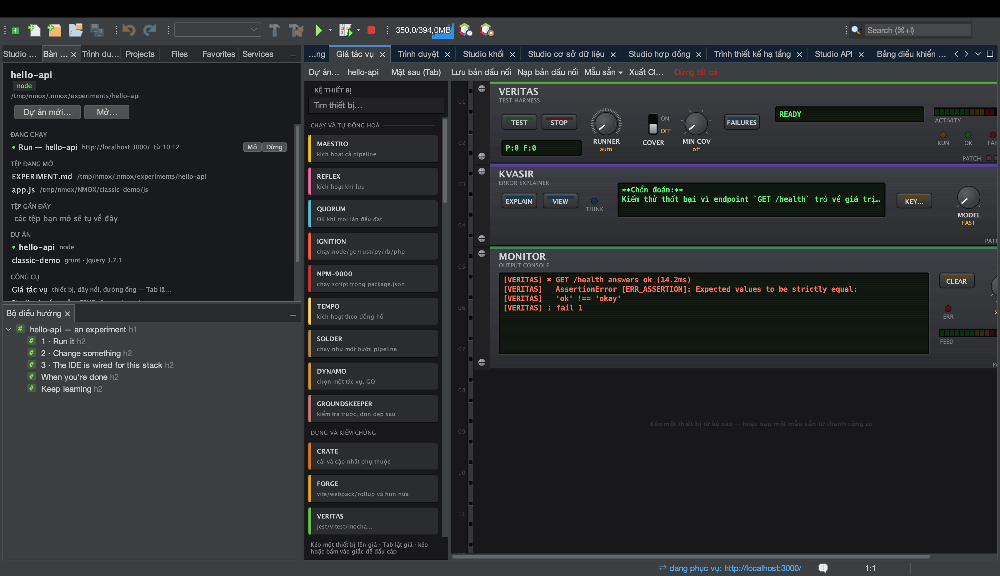
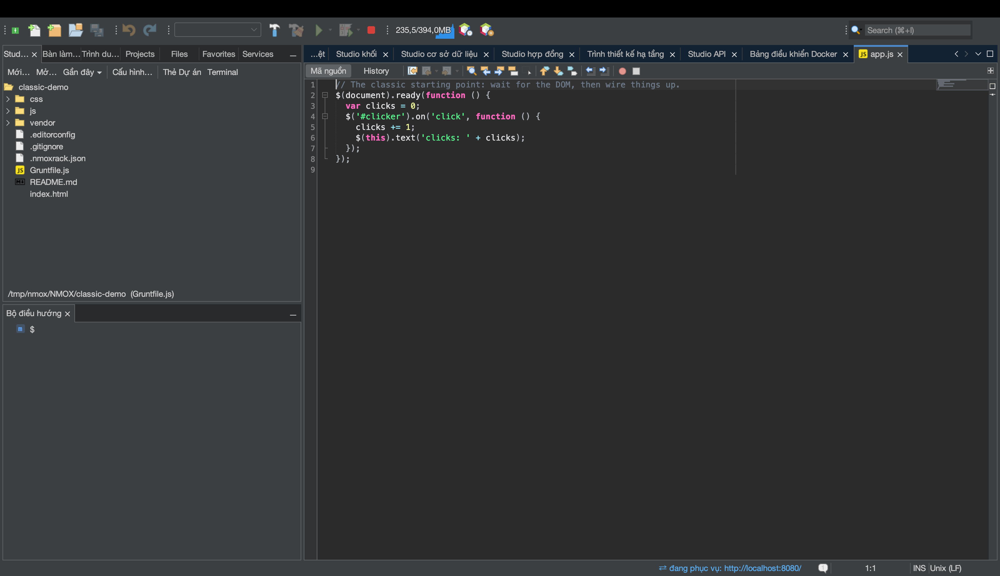

# NMOX Studio — Hướng dẫn sử dụng

<!-- languages -->
[English](user-guide.md) · [Español](user-guide.es.md) · [Français](user-guide.fr.md) · [Deutsch](user-guide.de.md) · [Русский](user-guide.ru.md) · [Українська](user-guide.uk.md) · [Polski](user-guide.pl.md) · [Português (Brasil)](user-guide.pt.md) · [Bahasa Indonesia](user-guide.id.md) · [Filipino](user-guide.tl.md) · **Tiếng Việt** · [简体中文](user-guide.zh.md) · [हिन्दी](user-guide.hi.md) · [עברית](user-guide.he.md) · [العربية](user-guide.ar.md)
<!-- /languages -->

Cách dùng sản phẩm. Hướng dẫn này đi qua các tính năng theo thứ tự bạn sẽ gặp: cài đặt, lần chạy đầu tiên, dự án, giá, các studio, các trình hướng dẫn và các lưới an toàn.

---

<a id="1-install"></a>
## 1. Cài đặt

**macOS (khuyến nghị):**
```bash
brew trust --cask nmox/nmox-studio/nmox-studio
brew install nmox/nmox-studio/nmox-studio
```

Dòng `brew trust` là xác nhận một lần của Homebrew cho mọi tap của bên thứ ba — các lần cập nhật sau sẽ không hỏi lại. Ứng dụng được ký bằng Apple Developer ID và được Apple công chứng, nên Gatekeeper chấp nhận nó nguyên trạng — cask chỉ sao chép nó và không làm gì thêm. Cài thủ công từ DMG cũng vậy.

**Mọi thứ khác:** tải một tệp từ [bản phát hành mới nhất](https://github.com/NMOX/NMOX-Studio/releases/latest) — `.dmg` cho macOS, `-setup.exe` cho Windows, `.deb` cho Debian/Ubuntu, `.tar.gz` thông thường cho Linux. Cả bốn đều mang sẵn môi trường chạy Java; không cần cài gì trước. `-portable.zip` là tạo phẩm duy nhất dùng Java của chính bạn (cần Java 21+ trong PATH, hoặc chạy với `--jdkhome <đường-dẫn-jdk>`).

> **macOS, lần chạy đầu tiên:** nhấp đúp vào ứng dụng. macOS hỏi một lần xem có mở một ứng dụng tải về từ internet không, và cho biết Apple đã kiểm tra nó: bấm **Mở** (Open). Ứng dụng được ký bằng Apple Developer ID và được công chứng, vé công chứng được ghim vào cả ứng dụng lẫn DMG, nên việc kiểm tra hoạt động ngoại tuyến — không cần nhấp chuột phải, không cần `xattr`. Trình cập nhật tích hợp cài vào thư mục người dùng chứ không vào gói ứng dụng, nên cập nhật không bao giờ phá chữ ký đó.
>
> Nếu một bản cài 3.0.0, 3.0.1 hoặc 3.0.2 đáp lại bằng *"NMOX Studio.app" Not Opened* (nghĩa là “chưa mở được NMOX Studio.app”; macOS hiện hộp thoại này bằng ngôn ngữ của hệ thống), đó là một lỗi trong cách ứng dụng khởi động tập lệnh khởi chạy của nó, đã được sửa trong 3.1.0: hãy cài 3.1.0 trở lên (`brew upgrade --cask nmox-studio`, hoặc tải bản mới).

### Kiểm chứng bản tải về

Tùy chọn, hai mươi giây, và hai phép kiểm vì chúng trả lời hai câu hỏi khác nhau.

**Đây có đúng là những byte chúng tôi đã phát hành không?** Chạy được trên mọi nền tảng và bao phủ mọi tệp — `SHA256SUMS` và `SHA256SUMS.asc` đi kèm bản phát hành:

```bash
curl -sL https://raw.githubusercontent.com/NMOX/NMOX-Studio/main/KEYS | gpg --import
gpg --verify SHA256SUMS.asc SHA256SUMS
sha256sum -c SHA256SUMS --ignore-missing
```

**macOS có bảo chứng cho nó không?** Một câu hỏi khác, do Apple trả lời:

```bash
spctl --assess --type execute -vv "/Applications/NMOX Studio.app"
```

Bạn cần thấy `source=Notarized Developer ID`. Bộ cài Windows chưa được ký: với bản tải Windows, phép kiểm ở trên là cách.

### Cập nhật

**Công cụ ▸ Plugin ▸ Cập nhật** (hoặc **Trợ giúp ▸ Kiểm tra cập nhật**) đưa ra các mô-đun sản phẩm của mọi bản phát hành mới hơn, lấy từ trung tâm cập nhật “NMOX Studio Updates”, vốn trỏ tới bản phát hành mới nhất trên GitHub. Cài, khởi động lại khi được nhắc, là xong. Nền tảng cũng tự kiểm tra, mặc định mỗi tuần một lần (đổi ở **Công cụ ▸ Plugin ▸ Cài đặt chung**), và riêng IDE thì mỗi ngày một lần báo cho bạn khi có bản mới hơn; tắt việc đó ở Tùy chọn ▸ Chung (trên macOS là NMOX Studio ▸ Settings…, ở nơi khác là Công cụ ▸ Tùy chọn). Mọi mô-đun đều được ký và chứng chỉ đi kèm ngay trong sản phẩm, nên các bản cập nhật được cài mà không hỏi gì về chứng chỉ.

Trình cập nhật thay các mô-đun, chứ không thay ứng dụng bao quanh chúng. Môi trường chạy Java đi kèm, trình khởi chạy và chính NetBeans Platform chỉ thay đổi khi bạn cài một bản phát hành (`brew upgrade --cask nmox-studio`, hoặc tải bản mới), và bản phát hành nào thay đổi một trong số đó sẽ nói rõ trong ghi chú phát hành — lệnh `nmox` và các bản sửa trình khởi chạy trên macOS của 3.1.0 là ví dụ. Một bản cài cũ hơn 2.35.0 hoàn toàn không thể cập nhật trong ứng dụng, vì 2.35.0 đã chuyển sang nền tảng mới: hãy cài một bản phát hành hiện hành.

<a id="2-first-launch"></a>
## 2. Lần chạy đầu tiên

Từ dòng lệnh, `nmox .` mở thư mục bạn đang đứng, giống như `code .`: `cd myproject && nmox .`. Một thư mục được nhắm đúng như cách “Mở thư mục…” trên trang Chào mừng nhắm nó, dù có tệp kê khai hay không; một tệp thì mở trong trình soạn thảo (`nmox src/app.js`), tại một dòng nếu bạn chỉ ra dòng đó theo cách của `code -g` (`nmox src/app.js:42` — cột cũng được chấp nhận và trình soạn thảo mở ở đầu dòng). Một tên không tồn tại sẽ bị từ chối ngay trên dòng lệnh (`nmox: typo.js: no such file or folder`) thay vì khởi động bất cứ thứ gì. `-r` của VS Code được chấp nhận và `-n` mở trong cửa sổ duy nhất; `-a` và `-v` sẽ bị từ chối kèm tên. `nmox -w file` mở tệp và chờ đến khi bạn đóng thẻ của nó, còn `nmox -d left right` so sánh hai tệp trong khung xem khác biệt, nhờ vậy NMOX Studio trở thành trình soạn thảo và difftool của git: `git config --global core.editor "nmox -w"`, và `nmox --help` in ra các dòng để biến nó thành difftool và mergetool. Lưu thông điệp, đóng thẻ, và git sẽ tiếp tục. Khi đã đặt mergetool (`mergetool.nmox.cmd` là `nmox -w "$MERGED"`), `git mergetool` mở từng tệp bị xung đột trong trình soạn thảo. Trong tệp đó, và trong bất kỳ tệp nào mang dấu xung đột của git, phía hiện tại của mỗi xung đột được tô một màu và phía đến được tô màu khác, còn dòng `<<<<<<<` mang một cảnh báo mà bản sửa nhanh của nó (⌘. trên Mac, Alt+Enter ở nơi khác, hoặc bóng đèn ở lề) đưa ra ba lựa chọn của VS Code: **Chấp nhận thay đổi hiện tại**, **Chấp nhận thay đổi đến** và **Chấp nhận cả hai thay đổi**. Mỗi lựa chọn là một lần sửa, được hoàn tác bằng một lần ⌘Z; nếu khối đã thay đổi sau khi cảnh báo xuất hiện, không gì bị thay thế và thanh trạng thái sẽ nói vậy. Một khối không đúng hình dạng của git (một dấu phân cách thứ hai, một khối nằm trong khối khác) sẽ không được đề nghị gì, thay vì bị đoán. Các màu tô là những mục “Xung đột hợp nhất” trong Tùy chọn ▸ Phông chữ và màu sắc ▸ Highlighting. **Nhóm ▸ Dùng NMOX Studio với Git…** hiển thị các thiết lập đó bên cạnh giá trị hiện tại của chúng, và đặt chúng giúp bạn. Thông điệp commit mở ra như tệp riêng của git: các dòng `#` là chú thích, chỉ phần bạn viết mới được kiểm tra chính tả, và dòng tóm tắt vượt quá 72 ký tự — chỗ các công cụ của git cắt bớt — sẽ nhận cảnh báo. Danh sách `git rebase -i` tô sáng từng lệnh và từng commit, còn Bật tắt chú thích loại một dòng ra mà không xóa nó. Nếu không, lệnh trả về ngay — lần `nmox` đầu tiên khởi động IDE ở chế độ nền, và mỗi lần sau đó trao thư mục của nó cho IDE đang chạy. Gõ `nmox` không kèm gì thì chỉ khởi động IDE. Đưa `nmox` vào PATH của bạn:

- **macOS, Homebrew:** cask tự tạo liên kết giúp bạn.
- **macOS, từ DMG:** tạo liên kết (đừng sao chép) tới trình khởi chạy của ứng dụng —
  `sudo mkdir -p /usr/local/bin && sudo ln -s "/Applications/NMOX Studio.app/Contents/MacOS/nmox-studio" /usr/local/bin/nmox`.
  Được khởi động qua một liên kết, nó biết mình được gọi từ dòng lệnh; khởi động từ Finder hay Dock, nó vẫn chạy như trước giờ.
- **Windows:** ô *Add "nmox" to PATH* trong trình cài đặt, được đánh dấu sẵn. Hãy mở một cửa sổ dòng lệnh mới sau đó; cửa sổ đang mở vẫn giữ PATH cũ.
- **Linux:** gói `.deb` cài `/usr/bin/nmox`. Nếu dùng tệp tarball, hãy tự tạo liên kết: `ln -s "$PWD/nmox-studio-<version>/bin/nmox" ~/.local/bin/nmox`.

Trên Linux và Windows, bạn cũng có thể trao một thư mục cho NMOX Studio mà không cần dòng lệnh, và nó được nhắm theo cùng một cách:

- **Linux (gói `.deb`):** trình quản lý tệp của bạn liệt kê NMOX Studio trong *Mở bằng* (Open With) cho một thư mục. Nó không trở thành ứng dụng mặc định cho thư mục; trình quản lý tệp vẫn giữ vai trò đó.
- **Windows:** đánh dấu ô *Add "Open with NMOX Studio" to the right-click menu of folders in Explorer* trong trình cài đặt (mặc định không được đánh dấu, giống như của VS Code). Khi đó Explorer có mục **Open with NMOX Studio** trên một thư mục và trên khoảng trống bên trong nó; trên Windows 11 mục này nằm dưới *Show more options*. Gỡ cài đặt sẽ gỡ luôn mục này.

Trên macOS, hãy dùng `nmox .` hoặc **Tệp ▸ Mở thư mục…**. Mục *Mở bằng* (Open With) của Finder và biểu tượng trên Dock hiện chưa thể trao một thư mục cho NMOX Studio, nên ứng dụng không tự đề xuất mình ở đó.

IDE mở ra với ba thẻ nằm cạnh vùng soạn thảo: **Chào mừng → Giá tác vụ → Trình duyệt**. Mọi cửa sổ khác chỉ cách một phím tắt ⌥⌘ và đều có trong cột TOOLING của trang chào mừng. Ở khung bên trái: **Studio dự án** (cây tệp và mẫu), nền **Bàn làm việc** và **Trình duyệt NPM**. Một thư mục `~/NMOX` được tạo làm không gian làm việc mặc định; giá hướng vào đó cho tới khi bạn mở một dự án.



Những phím tắt đáng học trong ngày đầu (tất cả cũng có trên thẻ chào mừng):

| Phím tắt | Mở |
|---|---|
| **⌘I** | Tìm nhanh — với tới mọi thứ |
| **⇧⌘P** | Cũng là Tìm nhanh — tổ hợp mà VS Code gọi là Command Palette |
| **⌘9** | Giá tác vụ |
| **⌥⌘0** | Bàn làm việc |
| **⌥⌘1** | Bảng công việc |
| **⌥⌘2** | Kiểm thử |
| **⌥⌘3** | Ứng dụng trò chuyện IRC |
| **⌥⌘4** | Trình duyệt (WebKit tích hợp, có DevTools) |
| **⌥⌘5** | Studio khối |
| **⌥⌘6** | Studio hợp đồng |
| **⌥⌘7** | Studio cơ sở dữ liệu |
| **⌥⌘8** | Studio API |
| **⌥⌘9** | Trình thiết kế hạ tầng |
| **⌘8** | Bảng Docker |
| **⌘7** | Cấu trúc tệp hiện tại |
| **⇧⌘N / ⌥⌘O** | Dự án mới… / Mở thư mục… |
| **⌥⌘K / ⇧⌘L** | Thử nghiệm mới… / Không gian học tập mới… |
| **⇧⌘E** | Studio dự án, với tiêu điểm ở cây tệp |
| **⇧⌘X** | Công cụ ▸ Plugin |
| **⌃\`** | Một Terminal trong thư mục dự án, hoặc Terminal đã mở sẵn (Ctrl+\` trên Windows và Linux) |
| **⌥⌘P / ⌥⇧⌘K** | Chuyển dự án… / Thử nghiệm… |

Bạn chuyển sang từ VS Code? [Chuyển từ VS Code sang](coming-from-vscode.vi.md) đối chiếu các tổ hợp phím và các ý tưởng, kèm cách bấm trên Windows và Linux bên cạnh cách bấm trên macOS.

**Các vị trí trong Terminal mở ra khi ⌘-nhấp** (Ctrl-nhấp trên Windows và Linux). Nhấp vào một chỗ mà công cụ đã in ra và tệp sẽ mở tại dòng đó: `src/app.ts:42:7` từ tsc, `(/abs/app.js:10:5)` trong một khung ngăn xếp của Node hay Jest, `tests/test_x.py:12:` từ pytest, `--> src/main.rs:3:5` từ rustc, `File "x.py", line 12` từ một traceback của Python. Một đường dẫn tuyệt đối mở đúng như được in ra. Một đường dẫn tương đối được đọc từ thư mục của dự án đang nhắm, nơi ⌃\` khởi động shell của nó; sau một lệnh `cd` vào thư mục con, đường dẫn có thể chỉ tới một tệp không có ở đó, và thanh trạng thái cho biết nó đã tìm đường dẫn nào thay vì đoán. Một URL hay một `host:port` không bao giờ là liên kết.

<a id="3-projects"></a>
## 3. Dự án

**Mở:** bất kỳ thư mục nào mang một trong 60 tệp kê khai được nhận biết đều mở ra như một dự án thật — `package.json`, `Cargo.toml`, `go.mod`, `pom.xml`, `composer.json`, `foundry.toml`, `bower.json`, `Gruntfile.js` và những họ hàng của chúng — kể cả các tệp kê khai của những chuỗi hợp đồng: một kho Aiken (`aiken.toml`) hay Clarinet (`Clarinet.toml`) mở ra với đúng các làn của nó đã được nối sẵn. Một thư mục HTML thuần với thẻ `<script>` và **không** có tệp kê khai cũng mở được, dưới dạng dự án STATIC: web cổ điển ở đây là công dân hạng nhất, không phải một lỗi.

**Tạo:** *Dự án mới…* đưa ra những bộ khung thật — Angular, Vue, Svelte, JavaScript thuần, Elixir/Phoenix, PHP Web (LEMP) và Web cổ điển (jQuery). Mỗi bộ đến với cấu hình lint, định dạng và kiểm thử đã nối sẵn cùng một kho git đã khởi tạo: một commit khung duy nhất mà, khi trình hướng dẫn chạy phần cài đặt giúp bạn, cũng mang theo tệp khóa — nên lần `git status` đầu tiên của bạn sạch sẽ.

**Cây tệp** là Studio dự án (⇧⌘E). Nhấp chuột phải vào một tệp hoặc thư mục để có Mới, Cắt, Sao chép, Dán, Xóa và Đổi tên, và — như Explorer của VS Code — **Sao chép đường dẫn**, **Sao chép đường dẫn tương đối** (tương đối so với dự án) và **Hiện trong Finder** (**Hiện trong File Explorer** trên Windows, **Mở thư mục chứa** trên Linux).

**Chuyển dự án là an toàn:** nếu có thiết bị đang chạy (một máy chủ phát triển, một trình theo dõi), IDE hỏi trước khi chuyển và tắt chúng gọn ghẽ. Không có gì chạy tiếp sau lưng bạn, không bao giờ. Ngay cả việc buộc thoát IDE cũng không thể bỏ lại một tiến trình mồ côi.

**Thử nghiệm** là cách nhanh nhất để thử một bộ công nghệ. **Tệp ▸ Thử nghiệm mới…** (⌥⌘K) chọn một mẫu và tạo một dự án dùng một lần trong `~/.nmox/experiments`: không git, không danh sách gần đây, đã được tin cậy, các phụ thuộc đã cài — để **lần Chạy đầu tiên chạy được ngay**. Nó mở ra ở chính bản hướng dẫn `EXPERIMENT.md` của mình, nói cho bạn biết nhấn gì, sửa tệp nào, và trí thông minh của IDE dành cho bộ công nghệ ấy nằm ở đâu. Giữ lại thứ thành hình: **Tệp ▸ Thử nghiệm…** ▸ **Nâng cấp…** đưa nó ra ngoài và khởi tạo git, **Nhân bản** tạo một bản sao bên cạnh để thử cách thứ hai, **Loại bỏ…** dọn phần còn lại. Kệ hiển thị tuổi của từng cái và chi phí đĩa đo được. Bạn thích con đường có hướng dẫn hơn? Hộp thoại đưa 93 không gian học lên trước.





**Chạy, dựng, kiểm thử — và dừng:** nút ▶ trên thanh công cụ (F6) chạy dự án đang nhắm theo đúng cách bộ công cụ của nó chạy: kịch bản `dev`, `start` hoặc `serve` trong package.json (kịch bản đầu tiên mà nó có), `cargo run`, `go run`, `dotnet run`, và với một thư mục HTML thuần thì một máy chủ tĩnh nhỏ trên cổng trống đầu tiên kể từ 8080. Một dự án Node không có kịch bản nào trong ba kịch bản đó sẽ nói rõ khi bạn nhấn ▶ và hiện các kịch bản của nó trong Trình duyệt NPM, nơi một cú nhấp đúp sẽ chạy một kịch bản. Dựng, Kiểm thử và Dọn nằm ngay cạnh và trong trình đơn Chạy. Một máy chủ phát triển thông báo địa chỉ của mình sẽ thắp dấu ⇄ trên thanh trạng thái và mở trang trong trình duyệt tích hợp. Mọi thứ lần đầu đều đi qua lời hỏi tin cậy không gian làm việc. Một lần chạy không khởi động được sẽ nói thẳng và mời mở Trình chẩn đoán môi trường. Để dừng: nút ■ bên phải Gỡ lỗi (⌥⌘.) dừng mọi lệnh đang chạy cùng lúc và nói nó đã dừng những gì; **Chạy ▸ Dừng build/chạy** dừng một lệnh rồi mời **Lặp lại**. Nút ■ thấy mọi thứ sản phẩm khởi chạy giúp bạn, kể cả các lần cài đặt; khi rê chuột, chú giải nêu đúng thứ một cú nhấn sẽ dừng, và mỗi thứ đã chạy từ bao giờ.

**`.env` ở khắp nơi:** nếu dự án của bạn có `.env`, các thiết bị khởi chạy từ giá sẽ nhận những biến đó. Sửa nó và thanh trạng thái ghi nhận rằng những lần khởi động lại sẽ nhận — các tiến trình đang chạy trung thực giữ nguyên môi trường cũ của chúng.

<a id="4-the-task-rack"></a>
## 4. Giá tác vụ



Giá là trái tim của sản phẩm. Mọi công cụ trong luồng làm việc của bạn — npm, trình đóng gói, trình chạy kiểm thử, máy chủ phát triển, trình soi lỗi, git, việc triển khai — đều là một thiết bị trong một giá: các núm chọn tác vụ, GO chạy nó, các đèn LED cho thấy trạng thái, và một màn hình LCD kể cho bạn bằng lời chuyện gì đã xảy ra.



**Những điều căn bản:**

- **Thêm thiết bị** bằng cách kéo chúng từ bảng chọn (bảng có phân loại và ô lọc tìm kiếm). Mỗi thiết bị đều mang theo thẻ *Cách dùng* của nó.
- **Chạy một thứ gì đó** bằng cách nhấn nút GO của một thiết bị. Hãy rê chuột lên trước: chú giải cho thấy đúng dòng lệnh sẽ được chạy. Không có phép màu nào cả.
- **Đấu một dây chuyền:** nhấn **Tab** để lật giá ra mặt sau. Kéo một sợi dây patch từ giắc **OK** của thiết bị này tới giắc **GO** của thiết bị kế tiếp. Giờ `cài → dựng → kiểm thử` chỉ còn một phím: dây chuyền tự chạy và dừng ngay ở lần hỏng đầu tiên. Kết quả trôi trên màn hình lân quang của thiết bị MONITOR.
- **Hoàn tác mọi thay đổi cấu trúc** bằng **⌘Z** — thêm, bớt, đấu lại. Gỡ một thiết bị đang chạy sẽ dừng tiến trình của nó trước.
- **Các bộ dựng sẵn** trao cho bạn cả một giá đã đấu dây chỉ với một cú nhấp — Ship Gate, Dev Intelligence, Monorepo Lanes, E2E Loop, LAMP Bench, Web3 Bench, Uptime Watch. **Lưu bản đấu nối** ghi giá bên cạnh dự án thành `.nmoxrack.json`; nhắm lại vào dự án đó sẽ nạp nó. Không có gì được lưu cho đến khi bạn nhấn nút này.



**Sự phối hợp, khi dây chuyền của bạn lớn dần:**

- **QUORUM** gộp các làn: nó chỉ kích hoạt khi *tất cả* các đầu vào đã đấu của nó đều thành công — cái kinh điển “chờ soi lỗi VÀ kiểm thử VÀ kiểm kiểu”.
- **Các cổng ENABLE** trên những thứ chạy lâu: đầu vào ENABLE của một máy chủ phát triển có nghĩa là “đừng khởi động cho tới khi cái này kích hoạt”.
- **REFLEX** trông chừng các tệp và định tuyến theo mẫu — `src/**/*.css` sang một dây chuyền, `**/*.ts` sang dây chuyền khác, theo từng làn trong một monorepo.
- **ROSETTA** chọn làn công cụ trong những kho lẫn lộn (giá nhận ra Node/Rust/Go/PHP/… theo từng thư mục và hướng mỗi thiết bị cho phù hợp).

**Những làn nói đúng bộ công cụ của bạn.** Ở AUTO, các thiết bị soi lỗi và định dạng (PURITY, GLOSS) nói bằng bộ công cụ của chính dự án thay vì với tay sang công cụ Node ở khắp nơi: một không gian Deno dùng `deno lint` và `deno fmt`, một dự án Cargo dùng `cargo clippy` và `cargo fmt`, một mô-đun Go dùng `go vet` (hoặc `golangci-lint` khi dự án mang theo cấu hình của nó) và `gofmt`. Một tệp `biome.json` chuyển các làn Node sang Biome, và vị trí núm đặt rõ ràng luôn thắng AUTO.

**Thiết bị của riêng bạn.** Kệ có thể mở rộng chỉ bằng một trình soạn thảo văn bản: bất kỳ tệp `*.json` nào trong `~/.nmox/devices.d/` đều trở thành một thiết bị thật — núm, nút, đèn LED, cổng và dây, được lưu vào sơ đồ và với tới được từ ⌘I. Khai báo một lệnh dưới dạng mảng đối số, đặt tên một núm, và `{{núm}}` sẽ được thế vào khi nút được nhấn. Các luật ở lại với chủ nhà, không nằm trong tệp của bạn: **lòng tin không gian làm việc canh lần chạy đầu tiên y như với một thiết bị dựng sẵn**.

**Các cổng chất lượng** biến “trông có vẻ xong” thành “đã xong”:

- **VITALS** chạy Lighthouse trên máy chủ đang sống của bạn và đòi một mức sàn về hiệu năng, khả năng tiếp cận, thực hành tốt hoặc SEO.
- **VERITAS** giữ một mức sàn về độ phủ và chạy lại đúng những bài kiểm thử đã hỏng, theo tên.
- **GAUNTLET** dồn tải lên một điểm cuối và đòi một mức thông lượng tối thiểu. **PRISM** canh kích thước gói, **BEACON** canh chứng chỉ và tình trạng sống của một địa chỉ, còn **PREFLIGHT** là bản kiểm trước khi gửi đi — đấu đầu OK của nó vào thiết bị triển khai và việc triển khai đơn giản là không thể chạy chừng nào chưa xanh hết.
- **GOVERNOR** canh những bước lùi về phí gas trong công việc Solidity (`.gas-snapshot`).

**Mọi thứ khác:** **SOLDER** bọc bất kỳ lệnh shell nào thành một thiết bị đầy đủ — và cả giá **xuất ra GitHub Actions** (dây chuyền cục bộ của bạn và phần tích hợp của bạn là cùng một sơ đồ đấu nối). **HELM** chạy lệnh trên máy chủ từ xa qua ssh, **TAIL** dõi theo bất kỳ tệp nhật ký nào, và **PHOSPHOR** là một cửa sổ dòng lệnh ngay trong giá. Nếu lệnh in ra một địa chỉ cục bộ, dấu ⇄ sáng lên như với mọi thiết bị phục vụ, rồi tắt khi lần chạy kết thúc.

**Giá tự giữ mình đồng bộ.** Sửa `package.json` và núm kịch bản của NPM-9000 tự cập nhật tại chỗ. Sửa một `Gruntfile` và DYNAMO đọc lại các tác vụ của nó. Thêm một phụ thuộc và màn hình của CRATE tự làm mới. Không phải hướng lại, không có nút làm mới nào.

### KVASIR — giải thích lần hỏng gần nhất



**KVASIR** là trợ giúp AI theo cách của giá: một thiết bị giải thích cái lỗi đang nằm trên bus MONITOR, chứ không phải một khung trò chuyện bên lề. Khi một lần chạy hỏng, hãy nhấn **EXPLAIN** và KVASIR sẽ hỏi AI của bạn xem đã sai ở đâu và bước tiếp theo cụ thể là gì. Một phán quyết ngắn hiện lên màn hình; **VIEW** mở ra câu trả lời đầy đủ. **MODEL** chọn giữa **FAST** (nhanh, rẻ, mặc định) và **DEEP** (mạnh hơn). EXPLAIN màu xanh: nó đọc và hỏi, nó không bao giờ đụng vào dự án của bạn.

KVASIR trả lời bằng ngôn ngữ mà NMOX Studio đang dùng.

**Chọn AI của bạn, đặt khóa của bạn.** KVASIR làm việc với **Claude (Anthropic)**, **ChatGPT (OpenAI)** hoặc **Gemini (Google)** — khóa của bạn, lựa chọn của bạn. Nhấn **KEY…** để chọn nhà cung cấp và dán khóa của họ; lựa chọn được ghi nhớ, còn khóa chỉ sống trong chùm khóa của hệ điều hành. Các biến môi trường quen thuộc của từng nhà cung cấp cũng được đọc, và khóa đã lưu thắng khóa từ môi trường.

**KVASIR gửi đi những gì, và chỉ có vậy.** Lần đầu bạn nhấn EXPLAIN, một hộp thoại liệt kê đúng những gì sẽ rời khỏi máy bạn và những gì thì không; không có gì được gửi mà thiếu sự đồng ý ấy, và sự đồng ý được tính riêng cho từng nhà cung cấp. Sau một lần EXPLAIN thành công, nút **VIEW** mở câu trả lời như một cuộc trò chuyện — bạn có thể hỏi tiếp về đúng lần hỏng đó.

**Hỏi KVASIR về mã của bạn.** Cũng chính trợ lý ấy với tới trình soạn thảo: chọn một đoạn mã rồi chọn **Hỏi KVASIR về vùng chọn…**, hoặc **Sửa bằng KVASIR…** để nói cần đổi gì và xem một bản trước và một bản sau trước khi bất cứ gì được áp dụng. **⌥⌘G** gợi ý ngay tại con trỏ bằng chữ mờ, chỉ chèn vào nếu bạn nhấn Tab, và dấu nhánh git có thể soạn giúp bạn lời nhắn commit.

**Hướng một tác nhân vào IDE của bạn.** Công cụ ▸ Agent Port (MCP)… mở một điểm cuối MCP mà một trợ lý bên ngoài có thể hỏi: nó **chỉ đọc theo thiết kế**, tắt cho tới khi bạn bật, chỉ lắng nghe trên giao diện cục bộ, và đòi đúng thẻ được sinh ra lúc khởi động.

Giá có thể mở rộng: các trình cắm của bên thứ ba có thể thêm thiết bị (cài tệp NBM của họ qua Công cụ ▸ Plugin). Để tự viết một cái, xem [device-spi.md](device-spi.md).

<a id="5-the-editor"></a>
## 5. Trình soạn thảo



Hơn 70 ngôn ngữ được tô màu đúng cách — bộ hiện đại, bộ cổ điển (kể cả CoffeeScript) và trọn lớp cấu hình, xuống tới `.env`, `.editorconfig`, cấu hình nginx và Apache, các tệp Dockerfile và các tệp khóa phiên bản.

- **Gợi ý hoàn thành** hiểu ngữ cảnh, và cũng hiểu *các thư viện cổ điển*: nếu dự án của bạn mang jQuery, MooTools, Prototype, Backbone/Underscore hay Knockout (qua phụ thuộc npm *hoặc* thẻ `<script>` thuần), API của chúng sẽ xuất hiện khi gợi ý. Dự án dùng jQuery 1.x hay 2.x nhận một dấu hết vòng đời trung thực, chứ không phải một lời nhắc dai dẳng.
- **Dàn ý trong Trình duyệt cấu trúc (⌘7)** cho thấy cấu trúc tệp với 58 kiểu tệp; nhấp để nhảy tới.
- **Bản đồ thu nhỏ** — bóng dáng của cả tệp nằm cạnh thanh cuộn của mỗi trình soạn thảo; nhấp hoặc kéo để cuộn. Cả tài liệu luôn vừa trong dải đó: các hàng co lại khi tệp lớn dần. Xem ▸ Bản đồ thu nhỏ bật tắt nó cho mọi trình soạn thảo đang mở cùng lúc.
- **Cuộn dính** — những khai báo bao lấy phần trên của khung nhìn (lớp, rồi tới phương thức bạn vừa cuộn vào) được ghim lại phía trên phần chữ, tối đa ba dòng của chính mã nguồn; nhấp một dòng để nhảy tới đó. Thanh này biến mất khi không có gì bao lấy dòng trên cùng.
- **Tới ký hiệu (⌥⇧⌘O)** nhảy tới bất kỳ hàm, lớp, quy tắc hay tiêu đề nào trong cả dự án bằng cách gõ tên nó — khớp theo tiền tố, theo chữ hoa giữa từ, hoặc theo ký tự đại diện. Chỉ mục có giới hạn và trung thực: `node_modules` bị bỏ qua, và với một dự án rất lớn hộp thoại nói rằng nó đã lập chỉ mục 2.000 tệp đầu tiên thay vì giả vờ đã đọc hết.
- **Cửa sổ kiểm thử (⌥⌘2)** cho thấy mọi bài kiểm thử trong dự án *trước khi bất cứ gì chạy*, và chạy một bài, một tệp, hoặc tất cả.
- **LSP**: mở một tệp có máy chủ ngôn ngữ đã được cài (typescript, gopls, rust-analyzer, pyright, …) là bạn có chẩn đoán, chú thích khi rê chuột và đi tới định nghĩa. Lỗi và cảnh báo của máy chủ cũng thành các dòng trong **Mục cần xử lý** (⌘6), mang tên máy chủ (`[lsp:gopls]`), cho mọi tệp mà máy chủ đã báo cáo. Có máy chủ chỉ báo cáo các tệp bạn đang mở; gopls báo cáo cả gói. Thiếu máy chủ? IDE đưa ra lệnh cài đặt thay vì lặng lẽ thất bại.

  

- **`.editorconfig` được tôn trọng** — cả khi bạn gõ lẫn khi bạn lưu. `indent_style`, `indent_size` và `tab_width` quyết định Tab, Enter và việc thụt lề lại sẽ viết ra gì, nên một dự án dùng tab nhận tab còn một dự án thụt bốn dấu cách nhận bốn dấu cách, theo từng tệp và từng phần glob; mỗi lần lưu áp dụng `trim_trailing_whitespace` và `insert_final_newline`. Một thay đổi trong `.editorconfig` tới được các trình soạn thảo đang mở trong vòng vài giây. Một ký tự tab có sẵn trong tệp vẫn được vẽ theo độ rộng tab đặt trong Tùy chọn, còn `charset` và `end_of_line` không được áp dụng. Các thiết bị định dạng của bạn (GLOSS và các thiết bị cùng loại) lo phần còn lại.
- **`.vscode/settings.json` của một kho mã cũng được tôn trọng theo cùng cách**: `editor.tabSize`, `editor.insertSpaces` và `editor.indentSize` quyết định việc thụt lề, `files.trimTrailingWhitespace` và `files.insertFinalNewline` (khi là `true`) được áp dụng khi lưu, và một khối ngôn ngữ như `"[typescript]": {…}` ghi đè chúng cho ngôn ngữ của nó. Khi dự án cũng có `.editorconfig`, thì `.editorconfig` thắng ở bất cứ chỗ nào cả hai cùng nói. `editor.detectIndentation` của VS Code, vốn để cách thụt lề sẵn có của một tệp thắng, không có tương đương ở đây.

### Bung tắt tự (⌥⌘E)

Gõ một tắt tự Emmet rồi nhấn **⌥⌘E**: `ul>li*3` trở thành cả danh sách. Nó chạy trong HTML, trong khuôn mẫu Angular, và — ở dạng CSS — bên trong khối `<style>` và thuộc tính `style`, nơi phần cắt bị giới hạn trong vùng đó nên không bao giờ nuốt mất phần đánh dấu xung quanh. Một tắt tự mà sản phẩm không nhận ra sẽ bị từ chối và để nguyên chữ bạn đã gõ.

### Token thiết kế (thuộc tính tùy biến)

Gõ `var(` sẽ đưa ra những token được khai báo trong chính các tệp kiểu của dự án bạn, mỗi cái kèm ô màu và nơi nó được khai báo. **⌘-nhấp** vào một chỗ dùng `var(--token)` sẽ nhảy tới khai báo của nó. Màu được vẽ đúng như màu chúng là — hex, `rgb()`, `hsl()`, tên màu, và cả `oklch()`, `lab()` lẫn `color-mix()` — còn **⌘-nhấp** vào một giá trị màu sẽ mở bảng chọn thay nó vào đúng dạng bạn đã viết.

### Thuộc tính class biết các tệp kiểu của bạn

Gõ bên trong `class="…"` sẽ đưa ra những lớp mà dự án bạn thực sự định nghĩa, kèm tệp kiểu chúng đến từ đâu; **⌘-nhấp** vào một lớp nhảy tới quy tắc của nó, còn **⌘-nhấp** vào bộ chọn `.lớp` nhảy tới chỗ dùng đầu tiên trong phần đánh dấu. **Đổi tên lớp…** đổi tên trong cả dự án — chỉ những token trọn vẹn, kèm số lượng theo từng tệp — và từ chối ra tiếng nếu tên mới đã có hoặc còn thay đổi chưa lưu.

### Chạy kịch bản, ngay từ con trỏ

Trong phần `scripts` của một `package.json`, lệnh **Chạy kịch bản** chạy đúng dòng có con trỏ — qua cùng lời hỏi tin cậy không gian làm việc và cùng nút ■ như mọi lần chạy khác.

### Khóa môi trường, hạng nhất

Gõ `process.env.` hay `import.meta.env.` sẽ đưa ra những khóa mà họ tệp `.env` của bạn thực sự định nghĩa, và **⌘-nhấp** nhảy tới dòng khai báo khóa ấy. Giá trị hiển thị bị cắt bớt: lời nhắc thì có, bí mật thì không.

### Bản dịch trong dự án của bạn

Các danh mục bản dịch của một dự án web là dữ liệu mà trình chỉnh sửa đọc, giống như biểu định kiểu và `.env` của bạn. **Công cụ ▸ Kiểm tra bản dịch…** tìm các danh mục (i18next, vue-i18n, svelte-i18n, XLIFF của Angular, Lingui, Paraglide, react-intl, hoặc của I18n Kit), chọn ngôn ngữ nguồn và báo ba điều, dưới dạng gạch lượn sóng và dòng trong cửa sổ Action Items: **thiếu** (các dạng số nhiều và ngữ cảnh được so trên khóa gốc), **giống nguồn** (sao chép chứ không dịch), và **sai chỗ giữ** — đây mới là lỗi, vì một bản dịch có tập `{{name}}` hay `%s` khác nguồn là đã hỏng. Phát hiện thứ tư, **không dùng**, chỉ xuất hiện khi kiểm kê đầy đủ.

### Liên kết trong tài liệu của bạn

README được đọc trên GitHub, và một liên kết trong đó không dẫn tới đâu sẽ do người đọc kế tiếp phát hiện, chứ không phải bạn. **Công cụ ▸ Kiểm tra liên kết Markdown…** đọc mọi tệp Markdown trong dự án đang nhắm và kiểm tra từng liên kết và hình ảnh tương đối theo đúng cách GitHub sẽ hiển thị: tệp hoặc thư mục được nêu phải tồn tại, và một `#heading` phải là tiêu đề của tệp đó theo quy tắc neo của GitHub (chữ thường, bỏ dấu câu, khoảng trắng thành gạch nối, tiêu đề lặp lại được đánh số `-1`, `-2`). Liên kết không dẫn tới đâu là lỗi; tiêu đề không tồn tại, và liên kết đi ra ngoài dự án, là cảnh báo. Chúng hiện thành gạch lượn sóng trên liên kết và thành dòng trong cửa sổ Action Items, và thanh trạng thái tóm tắt lần chạy (`Liên kết Markdown: 12 tệp, 148 liên kết, 1 không dẫn tới đâu`).

Liên kết có lược đồ (`https:`, `mailto:`) không được kiểm tra: không gì rời khỏi máy của bạn. Mọi thứ bên trong khối mã hay đoạn mã nội dòng cũng vậy, vì một liên kết trong ví dụ chỉ là ví dụ, và cả phần neo của liên kết tới một tệp mã nguồn (`app.js#L10` là neo dòng của GitHub). Liên kết bắt đầu bằng `/` được đọc từ gốc dự án, như cách GitHub đọc nó.

### Khuôn mẫu Angular, hạng nhất

Tệp `.component.html` mở ra với cách tô màu khuôn mẫu riêng, với các khối `@if`/`@for` và các chỉ thị cấu trúc trong gợi ý. Hãy cài Angular Language Service và việc kiểm kiểu cho khuôn mẫu thực sự tới nơi: gõ sai tên một thuộc tính, chính trình biên dịch của Angular sẽ gợi tên đúng. **⌘B** trong khuôn mẫu nhảy tới khai báo, còn trình đơn ngữ cảnh chuyển qua lại giữa thành phần, khuôn mẫu, tệp kiểu và bài kiểm thử của nó.

### Thành phần Vue và Svelte, hạng nhất

Tệp `.vue` và `.svelte` mở ra với cách tô màu riêng, gợi ý riêng (kể cả các rune có dấu chấm của Svelte 5) và Emmet bên trong khối khuôn mẫu của chúng. Chẩn đoán của Vue thực sự tới được trình soạn thảo, qua chính máy chủ ngôn ngữ của Vue.

### Gỡ lỗi với điểm dừng thật

Nhấp vào lề trái, chọn **Gỡ lỗi tệp (điểm dừng)** và chương trình sẽ dừng ngay đó — kèm ngăn xếp, các biến và việc tính biểu thức. JavaScript và TypeScript chạy được ngay nhờ bộ chuyển đi kèm; Python dùng debugpy còn Go dùng delve, do bạn tự cài. **Gỡ lỗi trong Chrome** làm y như vậy với một trang: các điểm dừng trong mã nguồn của bạn dừng lại ngay trong IDE trong khi trình duyệt chạy trên một hồ sơ dùng một lần. Một kho mã có `.vscode/launch.json` còn có thêm một lối vào: gõ tên một cấu hình vào Tìm kiếm nhanh và Enter sẽ khởi chạy `program` Node hoặc Python của cấu hình đó trong `cwd` của nó, kèm `args` và `env` của nó, hoặc mở `url` của một cấu hình Chrome với `webRoot` của nó; một cấu hình đặt `envFile`, `runtimeExecutable` hay bất cứ thứ gì khác mà trình gỡ lỗi không truyền tiếp được sẽ bị từ chối kèm tên trên thanh trạng thái thay vì được khởi chạy khi thiếu chúng. Mọi thứ đều đi qua lời hỏi tin cậy không gian làm việc trước.

### Gỡ lỗi trong trình duyệt

JavaScript trong trình duyệt cũng gỡ lỗi như vậy: nhấp chuột phải vào tệp `.html`, `.js` hay `.ts` → **Gỡ lỗi trong Chrome (điểm dừng)**. Điểm dừng đặt trong trình chỉnh sửa dừng đúng đoạn mã đang chạy *trong trình duyệt*, với cùng ngăn xếp và cùng biến. Trình duyệt đi theo nguồn còn sống nhất: nếu một thiết bị đã công bố URL của dự án, chính trang đó sẽ mở; nếu không, một tệp `.html` mở từ đĩa. Một tệp script lẻ không có máy phục vụ thì không có trang nào — dòng trạng thái nói vậy thay vì đoán. Chrome chạy với một hồ sơ dùng một lần, hồ sơ của bạn không bị chạm tới. **Web Worker** cũng gỡ lỗi được: mỗi `new Worker(…)` thành một phiên riêng.

### Trình bày và chia sẻ

**Xem ▸ Chế độ trình chiếu** phóng to cùng lúc mọi trình soạn thảo đang mở, trang trong trình duyệt tích hợp, cửa sổ kết xuất và cửa sổ dòng lệnh — rồi trả lại mọi thứ đúng như cũ khi bạn thoát. **Xem ▸ Hiện phím bấm** hiện thật lớn tổ hợp phím bạn vừa bấm, nhưng không bao giờ hiện thứ bạn gõ. **Chỉnh sửa ▸ Sao chép dưới dạng Markdown** chép phần đã chọn thành khối có rào kèm đúng nhãn ngôn ngữ, còn biến thể **kèm liên kết** thêm liên kết GitHub tới chính những dòng ấy. **Chỉnh sửa ▸ Mở trên GitHub** và **Chỉnh sửa ▸ Sao chép liên kết GitHub** (cũng có qua nhấp chuột phải, trong trình soạn thảo và trên cây của Studio dự án) cho ra cùng liên kết đó mà không kèm khối: dòng tại con trỏ hoặc các dòng đang chọn, một tệp, hoặc một thư mục (trang `tree` của nó; thư mục gốc của dự án là trang đầu của kho). Mở sẽ đưa bạn tới trình duyệt của chính bạn, nơi bạn đã đăng nhập, nên blame và các bình luận review đều dùng được. Một tệp nằm ngoài kho git, một kho không có `origin`, hoặc một origin không phải GitHub sẽ bị từ chối trên thanh trạng thái và không có gì được sao chép — một trình soạn thảo còn thay đổi chưa lưu cũng vậy, vì liên kết sẽ cho thấy những dòng khác với những gì bạn đang thấy. **Nhóm ▸ Pull request mới trên GitHub** (cũng có trong trình đơn của dấu nhánh) mở trong trình duyệt của bạn chính trang New Pull Request của GitHub cho nhánh bạn đang checkout: bước tiếp theo sau một lần push, không phải tự tìm kho và nhánh. Một HEAD tách rời sẽ bị từ chối, vì nó không có nhánh nào để đề xuất. **Công cụ ▸ Lưu ảnh chụp màn hình…** vẽ cả cửa sổ ở kích thước gấp đôi, cùng các biến thể cho riêng thẻ soạn thảo, cho khay nhớ tạm, và để chép cây dự án ra dạng Markdown.

<a id="6-the-studios"></a>
## 6. Các studio

### Dùng bằng bàn phím và trình đọc màn hình

Mọi nút điều khiển trên giá đều có một tên đọc được, và điều đó được kiểm tra ở mỗi lần dựng. Các núm là thanh trượt nghe theo phím mũi tên, Home và End; các nút nghe theo phím cách và Enter, kể cả những nút đang mờ, vốn nói rõ vì sao chúng từ chối; đèn LED và màn hình đều công bố trạng thái của mình. Tab lật giá lại — trừ khi tiêu điểm đang nằm trên một nút điều khiển, lúc đó nó nhường cho việc chuyển tiêu điểm thông thường.

### Git, trên thanh trạng thái

Dấu **⎇ nhánh** cho biết bạn đang ở nhánh nào và bao nhiêu tệp đã đổi; nó được đọc từ đĩa nên không tốn một tiến trình nào. Một cú nhấp mở ra toàn bộ lịch sử, còn trình đơn mang theo **Diff dự án**, **Chú giải**, các yêu cầu kéo qua chính `gh` của bạn, và **Soạn thông điệp commit bằng KVASIR…**.

Sau nó, `↑2 ↓1` là các commit mà nhánh của bạn có còn upstream của nó chưa có (cần push) và ngược lại (cần pull), chỉ hiện khi khác không và chỉ với nhánh có upstream. Trình đơn của nó bắt đầu bằng **Chuyển nhánh…**, **Commit…**, **Pull…** và **Push…**, chính các hộp thoại của mô-đun git.

Bên cạnh dấu nhánh, một ghi chú kín đáo hơn trả lời câu hỏi bạn hỏi thường xuyên nhất: ai đã viết dòng mà con trỏ đang ở? `Ada Lovelace, 3 ngày trước · Fix the parser` đi theo con trỏ, bằng ngôn ngữ của bạn, và chú thích nổi của nó nêu commit và ngày. Một cú nhấp mở chú giải của cả tệp — đúng mục **Chú giải** mà dấu nhánh đưa ra. Ghi chú hỏi git một lần cho mỗi phiên bản đã lưu của tệp, không bao giờ lúc khởi động và không bao giờ cho một tệp nằm ngoài kho, và không nói gì với tệp mà git không theo dõi. Một dòng bạn đã sửa nhưng chưa commit sẽ hiện **Chưa commit**. Khi tệp còn thay đổi chưa lưu, ghi chú hiện **Tác giả dòng: có thay đổi chưa lưu** thay cho một cái tên, vì git đọc tệp như nó đã được lưu, và dòng 40 trên màn hình chưa chắc là dòng 40 trên đĩa; lưu lại là cái tên quay về. **Xem ▸ Tác giả dòng** tắt và bật ghi chú.

### Bảng công việc (⌥⌘1)

Một bảng kanban cho mỗi dự án, lưu trong `.nmoxtasks.json` — nằm cạnh mã của bạn và được quản lý phiên bản cùng nó. Kéo các thẻ hoặc dời chúng bằng bàn phím: **⌘↑/⌘↓** sắp xếp lại, và thẻ vừa dời vẫn giữ tiêu điểm. Giới hạn việc đang làm là lời khuyên chứ không phải rào chắn: phần đầu cột đỏ lên, nhưng không có gì ngăn bạn. Nút **Tổng quan** đổi các cột lấy một bảng theo dõi — việc đang làm, xong hôm nay và trong tuần, dòng chảy theo ngày, những thẻ đang cũ dần — còn đồng hồ bấm giờ (**Bắt đầu bấm giờ**) đo thời gian thật theo từng thẻ, và cả bảng chỉ có duy nhất một đồng hồ chạy. **Standup…** biến tất cả những thứ đó thành một bản báo cáo dán được ngay.

### Studio khối (⌥⌘5)

Ghép các Web Component thật từ những mảnh có kiểu khớp vào nhau, theo lối Scratch: những cách lồng không hợp lệ bị từ chối, mã sinh ra là một phần tử tùy biến đứng độc lập, và nhấp vào một mảnh sẽ tô sáng những dòng của nó. Một máy chủ xem trước trong bộ nhớ cho thấy thành phần ấy thật sự, ghép cùng những thành phần hợp lệ khác trong thư viện của bạn. Vòng đi về là chính xác: sinh lại thứ vừa đọc cho ra đúng cùng một tệp, từng byte một.

### Studio API (⌥⌘8)

Bộ sưu tập, yêu cầu, môi trường với `{{biến}}` và các bài kiểm thử, lưu trong `.nmoxapi.json` — còn bí mật thì chỉ nằm trong chùm khóa, không bao giờ trong tệp ấy. Mỗi phản hồi được chấm một điểm an toàn từ chính các tiêu đề của nó. Nhập từ curl, `.http`, OpenAPI, Postman, Insomnia và HAR; xuất ra `.http`, và chép thành curl hoặc thành `fetch`, với các biến đã được thay sẵn.

### Studio cơ sở dữ liệu (⌥⌘7)

SQLite, PostgreSQL, MySQL, MariaDB, MongoDB và CouchDB, với trình điều khiển đi kèm và mật khẩu chỉ nằm trong chùm khóa. Bảng điều khiển hiểu từng loại máy, mỗi câu lệnh có lưới kết quả riêng, và các hàng sửa được ngay trong lưới khi có khóa chính — kèm bản xem trước đúng những câu UPDATE trước khi áp dụng, và một lý do trung thực khi thứ gì đó chỉ đọc được. Xuất ra CSV hoặc JSON, với công thức đã bị vô hiệu.

### Studio hợp đồng (⌥⌘6)

Cây tạo phẩm của Foundry và Hardhat, phần **Tương tác** do ABI dẫn đường với giá trị trả về và các lần hoàn tác đã giải mã, khung **Theo dõi** bám các khối và sự kiện, cùng phần **Giám sát** với bảng phí gas, phán quyết kích thước EIP-170 và sổ địa chỉ. **Không bao giờ có khóa riêng**: việc gửi đi dùng các tài khoản đã mở khóa của một mạng cục bộ, còn những địa chỉ bí mật thì sống trong chùm khóa.

### Trình thiết kế hạ tầng (⌥⌘9)

Một khung vẽ cho DigitalOcean, Hetzner và Cloudflare: đồng bộ với thứ thật sự đang tồn tại, làm mới để thấy chỗ lệch, và phá bỏ cả một chồng tài nguyên với chi phí bày ngay trước mắt. Những đường nối không hợp lệ từ chối ra tiếng và nói rõ vì sao, còn trong lúc một thao tác trên đám mây đang chạy thì khung vẽ khóa lại kèm một dải chữ nói đúng điều đó.

### IRC (⌥⌘3)

Một ứng dụng đầy đủ ngay trong IDE: TLS có kiểm tra tên thật sự, SASL, các mở rộng IRCv3, hoàn thành bằng phím Tab, các điểm nhấn, những địa chỉ mở ra trong trình duyệt tích hợp, ghi nhật ký xuống đĩa, bộ lọc của riêng bạn, và một danh sách kênh mà bạn lọc dần trong lúc gõ.

### Trang web đi kèm

**Trợ giúp ▸ Trang web NMOX Studio (cục bộ)** phục vụ trang web của sản phẩm từ chính giá của nó, trên giao diện cục bộ. Nó nói đúng mười lăm thứ tiếng mà IDE nói; bộ chọn nằm ở chân trang.

### Trình duyệt (⌥⌘4)

Một trình duyệt thật ngay trong IDE, với bộ công cụ nhà phát triển của riêng nó — bảng điều khiển, DOM, mạng, kho lưu, và các khung cho Vue, Svelte và Angular — bởi bộ máy không mang theo trình kiểm tra nào, và cái này là của chúng tôi. Nó biết mã nguồn của bạn: chọn một phần tử, mở đúng dòng đã sinh ra nó, đổi kiểu ngay tại chỗ, và khai báo ấy sẽ nằm vào đúng tệp kiểu gốc. Lưu một tệp là trang tự tải lại, và có sẵn những kích thước thiết bị thật để thử bố cục co giãn của bạn.

Các trang viết bằng hệ chữ phức tạp được vẽ đúng hình: tiếng Ả Rập, Ba Tư, Urdu (kể cả kiểu Nastaliq), Kurd, Pashto, Sindh, Duy Ngô Nhĩ, Syriac, Thaana và N’Ko nối các chữ và đọc theo đúng chiều của chúng, các con số cũng theo chiều riêng của mình; tiếng Hindi và các hệ chữ Ấn khác (Bengal, Gurmukhi, Gujarat, Oriya, Tamil, Telugu, Kannada, Malayalam, Sinhala), chữ Thái, Tạng, Myanmar và Khmer đặt dấu nguyên âm và chữ ghép vào đúng chỗ; còn dấu thanh được viết thành ký tự riêng (như cách macOS ghi tên tệp) thì nằm đúng trên chữ của nó. WebKit của JavaFX tự nó không làm được những điều này. Trên macOS và Windows, Trình duyệt bật bộ máy văn bản phức tạp của chính WebKit, nên ô nhập liệu, cụm chữ đậm và nghiêng, đoạn văn căn đều và vùng chọn đều được đo chính xác. Trên Linux, nơi không có công tắc ấy, Trình duyệt tự tạo hình chữ và khớp các ước lượng độ rộng với những phông mà bản phân phối của bạn đã cài, nên một cụm đầy chữ ghép hoặc viết bằng Nastaliq có thể lệch vài điểm ảnh. Chữ Lào không được tạo hình: chính văn bản của JavaFX cũng làm lệch nguyên âm của nó. Chữ Do Thái, Armenia, Gruzia và Ethiopia tự hiển thị đúng, kể cả dấu niqqud.

<a id="7-docker"></a>
## 7. Docker

Thẻ Docker là một bảng điều khiển: trạng thái của máy, các thùng chứa, ảnh, ổ đĩa và mạng, cùng với khởi động, dừng, nhật ký và dọn dẹp. Thiết bị HARBOR trên giá cho bạn ngần ấy chỉ trong một cái nhìn. Và như đã nói: chạy một thùng chứa Postgres, MySQL hay Mongo, và Studio cơ sở dữ liệu sẽ mời bạn một kết nối đã sẵn sàng.

Thẻ **Dockerize** sinh ra một `Dockerfile` đạt chuẩn sản xuất, một `.dockerignore` và một tệp soạn thảo hợp với bộ công cụ của dự án bạn — Node, PHP-FPM cùng nginx, và nhiều thứ khác.

<a id="8-wizards-and-kits"></a>
## 8. Trình hướng dẫn và bộ công cụ

Tất cả nằm trong *Tệp mới…* và trong trình đơn ngữ cảnh của dự án, và tất cả đều **luỹ đẳng và không bao giờ ghi đè**: chạy lại một bộ chỉ làm mới những gì thuộc về chính nó và để yên các sửa đổi của bạn; thứ không được phép viết lại sẽ đáp xuống bên cạnh dưới dạng tệp `.suggested`.

### Bộ chuẩn mực

`robots.txt`, `sitemap.xml`, bản kê khai web, `security.txt` theo RFC 9116 và `humans.txt`, được sinh ra từ những câu trả lời của bạn.

### Bộ PWA

Một bộ biểu tượng đầy đủ rèn từ một tấm ảnh duy nhất, kể cả các biến thể che được; một service worker dễ đọc — vỏ ứng dụng hoặc mạng trước, bạn chọn —, một trang cho lúc mất mạng, và phần nối dây trong `index.html` buộc tất cả lại với nhau.

### Bộ tiếp cận

Khả năng tiếp cận là điểm khởi đầu, không phải cuộc kiểm tra muộn màng: `a11y.css` (một vòng tiêu điểm nhìn thấy được, một tiện ích cho phần chữ chỉ trình đọc màn hình mới đọc, kiểu dáng cho liên kết nhảy qua, và một khối cho ai muốn ít chuyển động hơn), `A11Y-NOTES.md` với lượt đi bằng bàn phím và những câu hỏi không máy móc nào trả lời được, cùng phần nối dây luỹ đẳng trong `index.html` — ngôn ngữ, liên kết nhảy qua, bảng kiểu. Một viewport cấm phóng to sẽ được cảnh báo chứ không bao giờ bị viết lại; điều bộ này không sửa được thì nó nói ra, chứ không đụng vào.

### Bộ quốc tế hoá

Dịch được ngay từ ngày đầu, anh em với bộ tiếp cận: `locales/en.json` và `locales/es.json` (mỗi ngôn ngữ một danh mục, cùng bộ khoá), một `i18n.js` không phụ thuộc gì, áp danh mục lên phần đánh dấu `data-i18n`, giữ cho `<html lang>` nói thật, và hiện một khoá thiếu bằng chính nó chứ không phải một khoảng trống lặng lẽ; thêm `I18N-NOTES.md` — không ghép mảnh, `Intl` cho ngày tháng và con số, lượt đi từ phải sang trái, và giả bản địa hoá.

### Bộ hợp đồng (Web3)

Chọn một chuỗi — Solidity với Foundry, Soroban, Solana, CosmWasm, ink!, Cairo, Move, Bitcoin với Miniscript, Clarity trên Stacks, Cardano với Aiken hoặc TON với Tact — và một tên hợp đồng, rồi bộ sẽ dựng phần khởi đầu đã được chứng thực trực tiếp: bản kê khai, hợp đồng, bài kiểm tra bản địa và một CONTRACT-NOTES.md gọi tên các thiết bị trên giá cùng những bước chỉ làm một lần. Khoá không bao giờ chạm tới IDE.

### Bộ cổ điển

Thêm vào bất cứ mã nguồn nào jQuery, MooTools, Prototype, Backbone cùng Underscore, hoặc Knockout, hoặc để ngay trong kho (phiên bản ghim chặt, sha256 ghi lại) hoặc làm phụ thuộc npm; thêm khung sườn của webpack, grunt, gulp hay bower.

<a id="9-quick-search-status-line-and-staying-oriented"></a>
## 9. Tìm nhanh, thanh trạng thái, và giữ được phương hướng

### Dấu ⇄ đang phục vụ

Trên thanh trạng thái hiện dấu **⇄ đang phục vụ** mỗi khi có máy chủ đang chạy: lượt chạy của chính IDE, các thiết bị đang phục vụ, và bất cứ lệnh nào đã in ra một địa chỉ nội bộ. Bấm rồi chọn một cái: nó mở trong trình duyệt tích hợp, hoặc trong trình duyệt của hệ thống khi thẻ kia không kham nổi.

### ⌘I, cái tìm cho mọi thứ

Một ô duy nhất với tới các dự án của bạn (gần đây và đã biết), tới từng thiết bị trên giá — nhảy thẳng đến bộ điều khiển của nó —, tới các **máy chủ đang chạy** (Enter mở nó trong trình duyệt), tới các yêu cầu của Studio API, tới các kết nối và bảng của Studio cơ sở dữ liệu, tới các hợp đồng, tới các nút hạ tầng, tới các thẻ của Bảng công việc (kết quả gọi tên cột thẻ đang đứng), tới **tên lệnh của VS Code** (*Format Document*, *Toggle Terminal*, *Git: Commit*, *Open Settings* — mỗi lệnh được liệt kê dưới *Lệnh VS Code* cạnh hành động làm cùng việc đó ở đây, nên lần sau bạn gõ luôn tên ở đây của nó), và tới các **npm script** của dự án đang nhắm: gõ `dev` hay `test` và kết quả đọc là *Chạy script: dev — vite*; Enter chạy nó bằng chính trình quản lý gói của dự án (npm, yarn hoặc pnpm), đúng như cú nhấp đúp trong Trình duyệt NPM — với một dự án bạn chưa tin cậy, lời hỏi tin cậy không gian làm việc đến trước, lượt chạy nhập vào nút ■ trên thanh công cụ, và một máy chủ phát triển mà nó in ra sẽ thắp dấu ⇄. Trong một monorepo, đó là các script mà Trình duyệt NPM hiển thị. Các tác vụ trong `.vscode/tasks.json` của một kho mã cũng được liệt kê theo cùng cách — *Chạy tác vụ: build — make all* — và Enter chạy tác vụ sau cùng lời hỏi tin cậy, trong cửa sổ Output và dưới nút ■ trên thanh công cụ; một tác vụ shell chạy trong shell mà VS Code sẽ dùng (`$SHELL` của bạn, một login shell trên macOS; PowerShell trên Windows) hoặc shell mà `options.shell` của nó chỉ định; một tác vụ cần một giá trị mà chỉ VS Code mới cung cấp được, hoặc phụ thuộc vào một tác vụ khác, sẽ nói điều đó trên thanh trạng thái thay vì chạy. `.vscode/launch.json` của kho mã liệt kê các cấu hình của nó bên cạnh — *Gỡ lỗi: Launch Program — ${workspaceFolder}/server.js* — và Enter khởi động trình gỡ lỗi với điểm dừng cho cấu hình đó sau cùng lời hỏi tin cậy.

### Thanh trạng thái cho biết cái gì còn sống

Bên cạnh dấu máy chủ là dự án đang nhắm cùng bộ công cụ của nó, và nhánh Git kèm số tệp bạn đã đổi. Khi bất cứ thứ gì IDE kiểm tra có vấn đề, con số **✕ 2 ⚠ 1** cho thấy số lỗi và cảnh báo từ mọi máy chủ ngôn ngữ và công cụ; nhấp vào nó để mở **Mục cần xử lý**. Tất cả đọc từ đĩa hoặc từ những ghi chép mà sản phẩm vốn đã giữ: nhìn một cái không tốn tiến trình nào.

### Bàn làm việc

Đây là bến nhà: dự án hiện thời, các tệp đang mở và gần đây, các dự án gần đây, và lối vào cho từng bề mặt. Chừng nào còn thứ gì chạy, mục **ĐANG CHẠY** dẫn đầu trang — mỗi lệnh mà sản phẩm đã khởi động thay bạn, kèm địa chỉ nếu nó có báo, và từ mấy giờ nó chạy, cộng thêm mọi máy chủ mà một thiết bị trên giá đang phục vụ. Mỗi dòng có nút **Mở** và **Dừng** thật, với tới được bằng bàn phím lẫn trình đọc màn hình, nên một lượt chạy có thể dừng mà không kéo đổ những lượt còn lại. Mọi tiêu đề trên Bàn làm việc đều là nút thật: Tab tới được, Enter mở ra. ⌘I cũng với tới đúng những lượt chạy ấy: gõ «dừng» rồi Enter dừng đúng cái đó. Cái bạn tự tay dừng sẽ đọc là *đã dừng* ở bất cứ đâu kết cục của nó được kể lại, chứ không bao giờ là thất bại.

### Phím tắt của Emacs (và của Eclipse, và của IntelliJ)

Công cụ ▸ Tùy chọn ▸ Phím tắt (trên macOS: NMOX Studio ▸ Settings… ▸ Phím tắt) đổi cả hồ sơ phím: các phím di chuyển và cắt dán của Emacs trong mọi trình soạn thảo, hoặc bộ của Eclipse và IDEA nếu trí nhớ ngón tay bạn nằm ở đó. Mọi phím tắt của NMOX (họ phím ⌥⌘ mở cửa sổ, ⌘P Đi tới tệp, ⌥⌘E của Emmet, các tổ hợp phím của VS Code) đều có mặt trong cả năm hồ sơ, nên đổi hồ sơ không bao giờ khiến bạn mất các phím tắt của các studio. Có một ngoại lệ có chủ ý: trong hồ sơ Eclipse, ⇧⌘E vẫn là *Switch to Editor* của chính Eclipse, vì người đã chọn Eclipse mong đợi như vậy.

<a id="10-the-safety-nets-things-you-dont-have-to-do-anything-for"></a>
## 10. Những tấm lưới an toàn (thứ bạn chẳng phải làm gì để có)

### Hồi sinh phiên làm việc

Cứ vài giây một lần, giá lại chụp lại những gì đang chạy. Một lần tắt cưỡng bức, một lần sập, một `kill -9` — lần mở sau, một lời nhắn mời bạn dựng lại đúng phiên đã mất, chỉ một cú bấm.

### Bảo đảm không để lại mồ côi

Thoát khỏi IDE là giết mọi tiến trình mà nó đã khởi động — máy chủ phát triển, REPL, chuỗi lệnh, kẻ canh chừng —, TERM trước, KILL nếu chúng cứng đầu, kể cả con cháu.

### BLACKBOX và SONAR

Đặt **BLACKBOX** lên giá và bạn có một hộp đen: mỗi lần khởi động và mỗi lần thoát, kèm thời lượng, xu hướng, và những gì đã đổi kể từ lần dựng xanh gần nhất. Cái bạn tự tay dừng đọc là ĐÃ DỪNG — không xanh, không thất bại, và không bao giờ là thứ đem hỏi KVASIR. **SONAR** cho thấy ai đang giữ các cổng của bạn, đối chiếu với Docker, và một cú bấm là đuổi kẻ ngồi lì trên 3000.

### Những tệp không bao giờ bị đè

Bốn tệp làm việc của các studio (`.nmoxapi.json`, `.nmoxdb.json`, `.nmoxweb3.json`, `.nmoxinfra.json`) sẽ nạp lại khi bạn sửa chúng bên ngoài IDE — nhưng nếu bạn còn thay đổi chưa lưu thì bạn được hỏi, chứ không bị đè. Một tệp hỏng được để riêng thành `.bak` và báo cho bạn biết, không bao giờ bị thay lặng lẽ.

### TypeScript không cần dựng

Dự án có cửa vào là `index.ts`, `main.ts` hay `src/index.ts` chạy thẳng từ IGNITION bằng chính cơ chế bóc kiểu của Node (`--experimental-strip-types`, từ Node 22.6; mặc định từ 23.6 và 22.18 LTS). Lời từ chối của một Node cũ hơn được dịch thành câu gọi tên đúng cái ngưỡng ấy.

### Ngôn ngữ của bạn

NMOX Studio nói mười lăm thứ tiếng: English, Español, Français, Deutsch, Русский, Українська, Polski, Português (Brasil), Bahasa Indonesia, Filipino, Tiếng Việt, 简体中文, हिन्दी, עברית và العربية. Chọn tiếng của bạn ở **Tuỳ chọn ▸ Chung ▸ Ngôn ngữ** — mỗi thứ tiếng viết bằng chính tên nó, để bạn luôn tìm được tiếng mình. Lựa chọn ấy được ghi vào phần cài đặt khởi động của bạn (`etc/nmoxstudio.conf`, dưới dạng đối số `--locale`) và cũng có hiệu lực ngay. Thay đổi: trình đơn, hộp thoại, chú giải, thanh trạng thái, màn hình chào và phần tuỳ chọn. Giữ nguyên: từ vựng trên mặt các thiết bị của giá (GO, STOP, EXPLAIN — đó là nhãn máy, như trên một cây đàn tổng hợp), và những hộp thoại sâu hơn của nền tảng, vốn chưa có bản dịch. Có lẽ bạn sẽ chẳng bao giờ phải chọn: một bản cài mới đã nói đúng thứ tiếng của hệ thống bạn, kể cả từ một xứ mà chúng tôi chưa từng gọi tên — Đài Loan, Singapore, Bồ Đào Nha và Quebec đều đáp xuống chính tiếng của mình chứ không phải tiếng Anh, bởi các danh mục được đặt tên theo ngôn ngữ chứ không bao giờ theo quốc gia.

### Việc dò bản mới mỗi ngày

Lặng lẽ, mỗi ngày một lần: nếu có bản mới hơn, một thông báo dẫn bạn tới trình quản lý mô-đun, ở thẻ cập nhật của nó, nơi trung tâm cập nhật cài các mô-đun mới ngay tại chỗ. Tắt nó ở Tuỳ chọn ▸ Chung.

<a id="11-learning-spaces"></a>
## 11. Không gian học

### Kiểm bài của bạn

Một số không gian có điểm kiểm: chọn lấy một, rồi **Tệp ▸ Kiểm tra bài làm** sẽ kiểm các bài tập thật sự — điều các tệp khẳng định được kiểm bằng Java thuần, kể cả các phép kiểm *vắng mặt*, thứ duy nhất chứng thực được «bạn đã đổi tiêu đề»: chữ gốc trong mẫu phải biến mất. Điều các lệnh khẳng định thì đi qua chính bộ công cụ của không gian ấy. Mỗi dấu ✗ đáp lại bằng gợi ý của chính không gian đó, và khi có chỗ hỏng, bản báo mời **Giải thích bằng KVASIR…**: những điểm hỏng và, với phép kiểm tệp, chính tệp của bạn, có giới hạn và dưới một lời đồng ý nói rõ cái gì rời đi. Câu trả lời đọc như của một gia sư: đổi gì, rồi kiểm lại.

### Bài học của riêng bạn

Thả một tệp `*.json` vào `~/.nmox/learn-catalog.d/` là nó gia nhập bảng chọn, cùng một lược đồ với những bài có sẵn; một `slug` trùng sẽ thay thế bài của nhà. Bạn đang dạy? Hãy viết bằng cách dựng: biến bài tập thành một dự án bình thường, rồi **Tệp ▸ Xuất thành không gian học tập…** sẽ soạn tệp ấy hộ bạn — các tệp mẫu, `TUTORIAL.md` của bạn, trình chạy, và các điểm kiểm của bạn — đã được thẩm lại bằng chính bộ phân tích của bảng chọn trước khi ghi, nên thứ bạn trao cho học trò đúng là thứ bảng chọn của họ sẽ nạp.

### Danh mục

*Không gian học mới…* mời bạn 93 bài có sẵn — ngôn ngữ, khung làm việc và thư viện. Mỗi bài sinh ra một dự án mẫu nhỏ, một bài hướng dẫn có dắt tay, và một giá đã gắn sẵn **một trình thông dịch thật**: bạn gõ vào giá và một trình thông dịch đang sống trả lời. Núm ENGINE chọn trong 37 trình thông dịch; thiếu cái nào thì nút INSTALL cài ngay tại chỗ, tiến độ hiện lên màn hình. Các không gian ở trong `~/.nmox/learn`, tách khỏi công việc thật của bạn.

### Những bước đầu, trên màn hình chào

Một cột thứ tư liệt kê sáu động tác đầu tiên — mở một dự án, chạy thứ gì đó trên giá, thấy một máy chủ sống dậy, hỏi KVASIR về mã, thử một không gian học, chĩa một tác nhân vào IDE — và đánh dấu từng cái dựa trên những ghi chép mà sản phẩm vốn đã giữ. Mỗi dòng là một cánh cửa: bấm vào là cửa sổ hay hành động ấy mở ra. Dấu đã đánh không bao giờ mất đi; cột ấy biến mất khi cả sáu đã xong, hoặc khi bạn bấm **Ẩn danh sách này**.

### Ba câu trả lời của trình đơn Trợ giúp

**Có gì mới…** đưa ra ghi chú của bản bạn đang chạy, gói ngay trong bản dựng; lần khởi động đầu sau một lần cập nhật, nó tự mở với những bản mà máy bạn chưa từng thấy. **Báo cáo sự cố…** soạn một bản báo gồm môi trường của bạn và bốn mươi dòng nhật ký cuối, đã che bớt — thư mục nhà của bạn thành `~`, tên đăng nhập thành `<user>`, thứ gì trông như một bí mật thành `[redacted]` —; bạn sửa lại, rồi **Mở trên GitHub** điền sẵn một phiếu mà chính bạn gửi đi, hoặc bạn sao chép nó. Sản phẩm không bao giờ tự mình gửi gì cả. **Phím tắt bàn phím…** liệt kê mọi phím tắt của NMOX trong hồ sơ đang dùng, cùng các phím toàn cục (các cửa ⌥⌘K / ⇧⌘N / ⇧⌘L của trang Chào mừng), đọc từ sơ đồ phím đang chạy, nên nó không thể lệch khỏi những gì trình đơn làm.

<a id="12-when-somethings-wrong"></a>
## 12. Khi có gì đó không ổn

### Trình chẩn đoán môi trường

Trong trình đơn Công cụ, nó dò trực tiếp 66 công cụ bên ngoài — node, npm, docker, forge, composer, gopls… — và cho thấy bản đã tìm ra cùng câu lệnh cài đặt cho những thứ còn thiếu.

### Những bức tường có cửa

Thiếu một máy chủ ngôn ngữ hay một công cụ, IDE nói cho bạn biết phải chạy lệnh nào, hoặc đề nghị chạy hộ; không bao giờ là một lời từ chối trơ trọi. Một bức tường có cửa riêng: TypeScript 7 không mang theo tsserver, nên nếu TypeScript tìm được là bản 7, trình soạn thảo nói một lần rồi mời cài dòng 5 — cũng chính là dòng nó tự cài vì lẽ ấy. Nếu một cổng đã bị chiếm, thông báo lỗi gọi tên tiến trình đang ngồi đó, và SONAR đuổi kẻ ấy đi.

### Một nút GO chẳng làm gì

Hãy nhìn màn hình của nó: các thiết bị tự giải thích bằng lời, và chú giải trên nút GO cho thấy đúng câu lệnh nó sẽ chạy, để bạn có thể thử nó trong một cửa sổ dòng lệnh.

### Ứng dụng mở ra chẳng có gì (macOS)

Không cửa sổ, không lỗi, ở lần chạy đầu sau khi cài: trên một bản dựng đã ký thì điều này không nên xảy ra. Nếu có, bản sao đã hỏng hoặc bị sửa sau khi tải — kiểm tra bằng `codesign --verify --deep --strict "/Applications/NMOX Studio.app"` và tải lại nếu thất bại. Nhật ký nằm dưới `~/Library/Application Support/nmoxstudio/…/var/log/` nếu bạn cần mở một phiếu báo.

<a id="appendix-the-files-nmox-studio-writes-and-what-to-commit"></a>
## Phụ lục: những tệp NMOX Studio ghi ra (và tệp nào nên đưa vào kho)

Tất cả những gì IDE giữ lại về một dự án đều là tệp JSON đọc được nằm ở gốc dự án, làm ra để chia sẻ với đội của bạn.

| Tệp | Bên trong có gì | Đưa vào kho? |
|---|---|---|
| `.nmoxapi.json` | Bộ sưu tập, yêu cầu, môi trường và bài kiểm của Studio API | **Có** — đồng đội nhận được trọn bàn làm việc của bạn |
| `.nmoxdb.json` | Kết nối, truy vấn đã lưu và lịch sử | **Có** — mật khẩu *không bao giờ* nằm trong đó (chỉ ở chùm khoá) |
| `.nmoxweb3.json` | Mạng lưới và sổ địa chỉ của Studio hợp đồng | **Có** — địa chỉ bí mật *không bao giờ* nằm trong đó (chỉ ở chùm khoá) |
| `.nmoxinfra.json` | Khung vẽ hạ tầng: nút, dây nối, thuộc tính | **Có** — mã thông hành *không bao giờ* nằm trong đó (chỉ ở chùm khoá) |
| `.nmoxtasks.json` | Bảng công việc: cột, thẻ, hạn mức | **Có** — cả đội dùng chung một bảng; bỏ ra nếu muốn giữ riêng |
| `.gas-snapshot` | Mốc gas theo từng bài kiểm của Foundry (GOVERNOR canh nó) | **Có** — đó là cách bắt được gas đi lùi lúc duyệt mã |
| `.env` | Các biến môi trường của bạn | **Không** — đó chính là lý do `.env` tồn tại |
| `*.bak` | Một tệp làm việc không đọc nổi, được giữ lại cho bạn | Không — lấy ra thứ cần rồi xoá |

Sửa bất kỳ tệp nào trong bốn tệp `.nmox*.json` ở ngoài IDE, hoặc kéo về thay đổi của đồng đội, và studio tương ứng sẽ tự nạp lại — trừ khi bạn còn thay đổi chưa lưu ở đó, khi ấy nó hỏi trước.

Ngoài dự án: `~/NMOX` là bàn làm việc mặc định, các thí nghiệm ở trong `~/.nmox/experiments`, các không gian học ở `~/.nmox/learn`, còn trạng thái của chính IDE — cách bày cửa sổ, các bản vá của giá, các tuỳ chọn — nằm trong thư mục người dùng của nền tảng.
