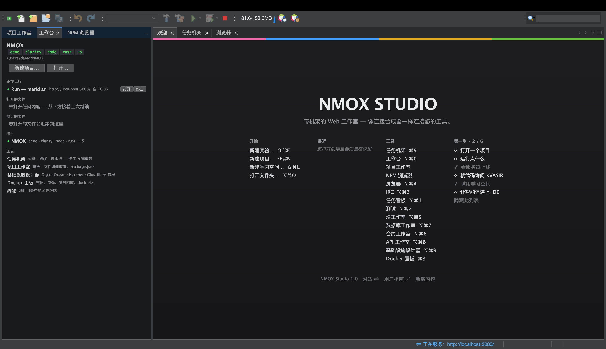
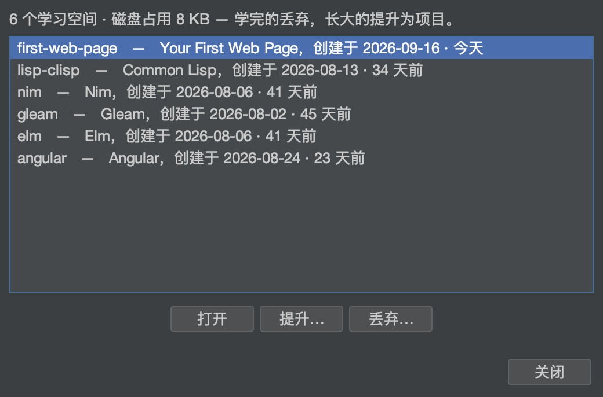
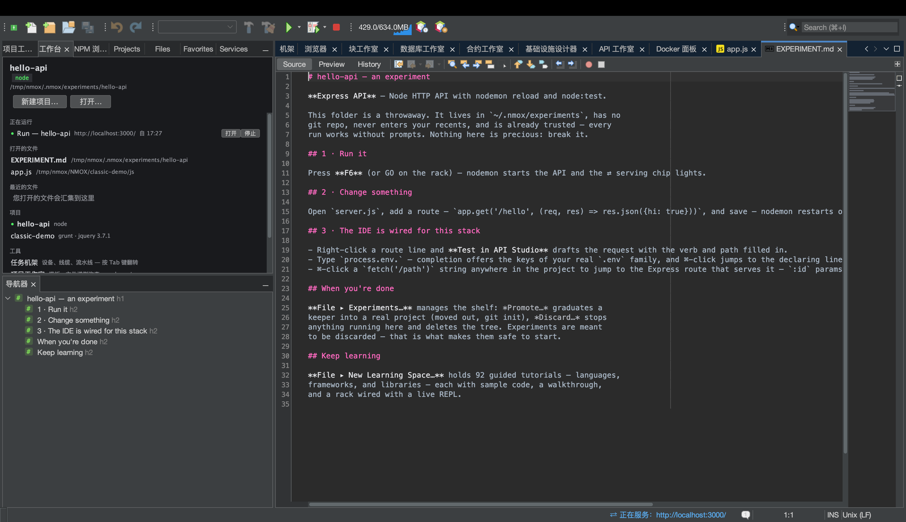
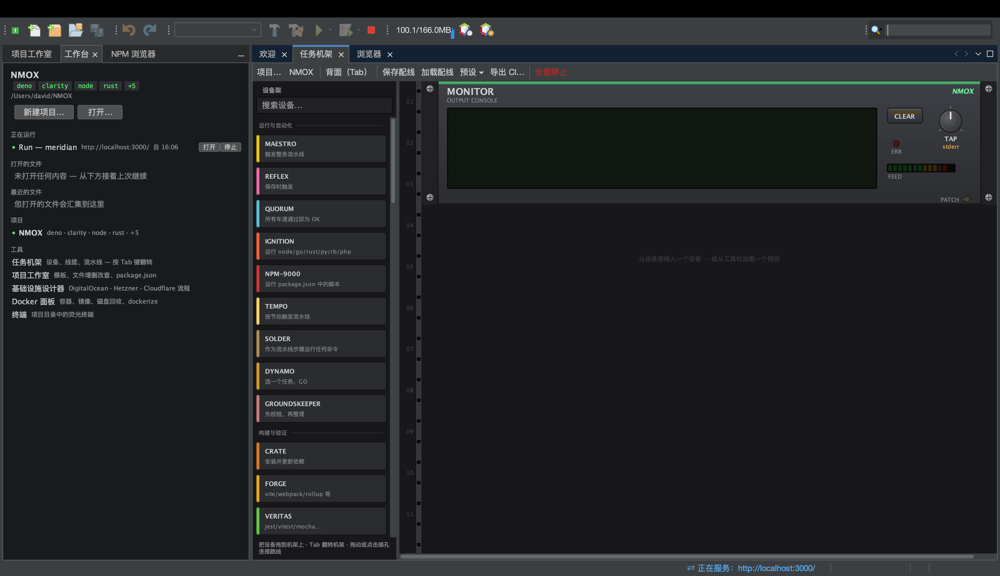
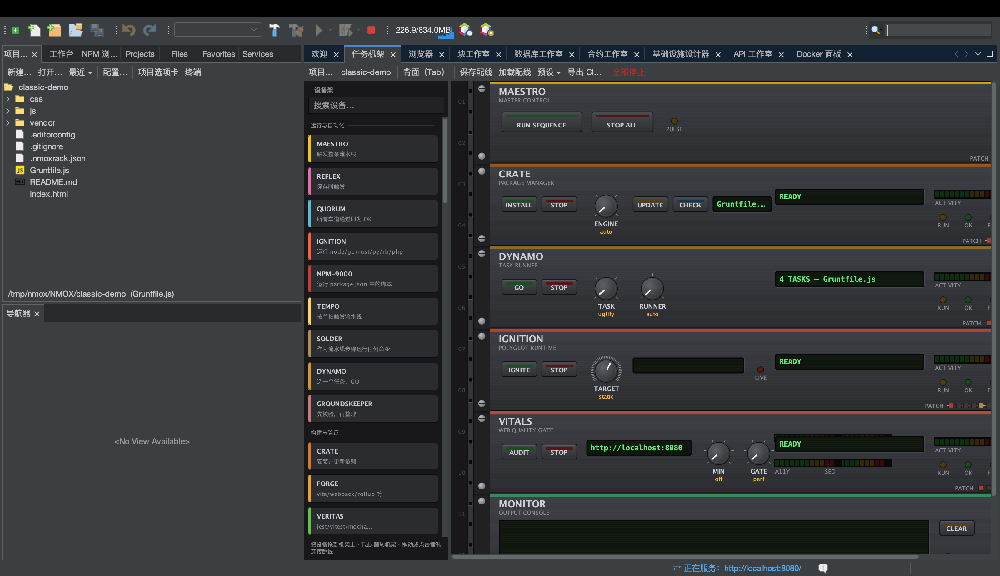
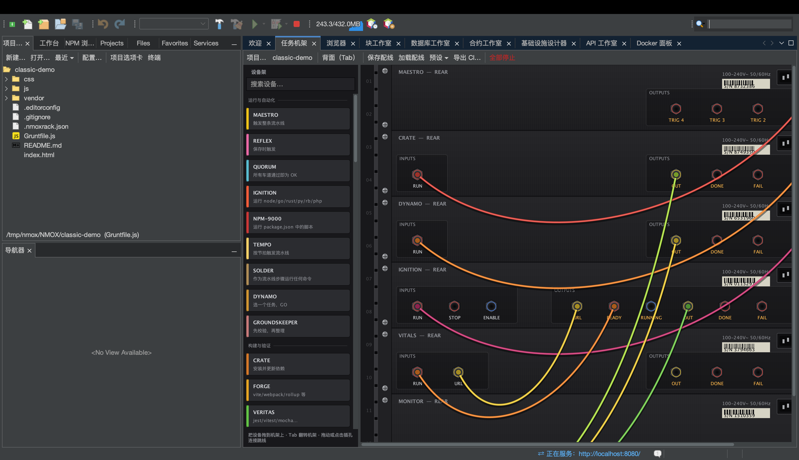
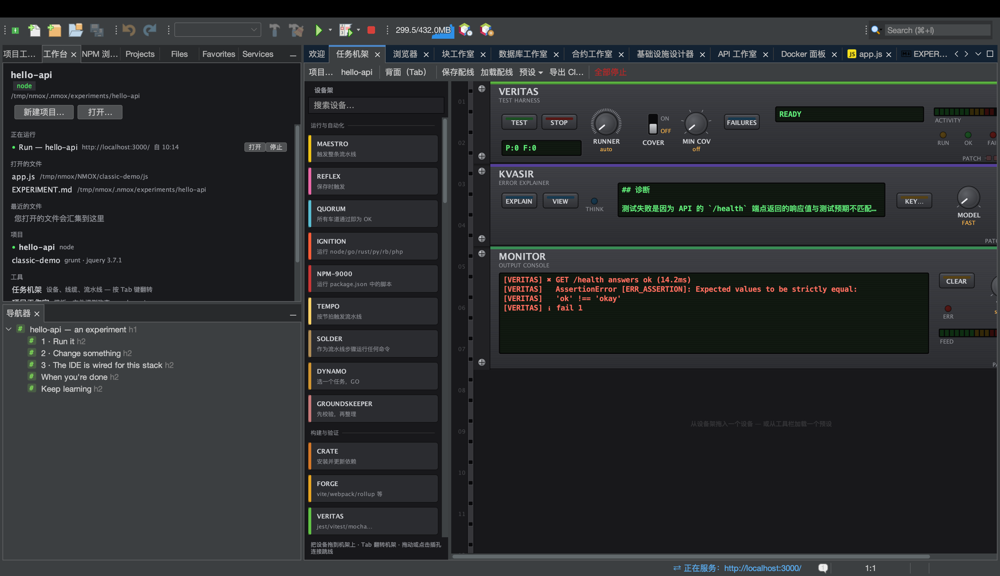
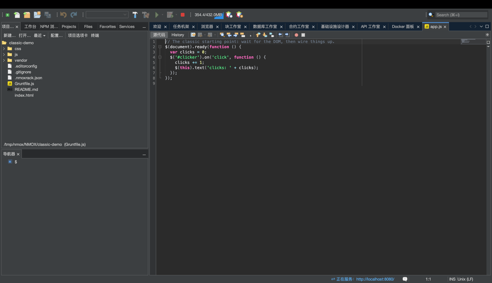

# NMOX Studio — 用户指南

<!-- languages -->
[English](user-guide.md) · [Español](user-guide.es.md) · [Français](user-guide.fr.md) · [Deutsch](user-guide.de.md) · [Русский](user-guide.ru.md) · [Українська](user-guide.uk.md) · [Polski](user-guide.pl.md) · [Português (Brasil)](user-guide.pt.md) · [Bahasa Indonesia](user-guide.id.md) · [Filipino](user-guide.tl.md) · [Tiếng Việt](user-guide.vi.md) · **简体中文** · [हिन्दी](user-guide.hi.md) · [עברית](user-guide.he.md) · [العربية](user-guide.ar.md)
<!-- /languages -->

如何使用本产品。本指南按你会遇到的顺序介绍功能：安装、首次启动、项目、机架、各工作室、向导以及各种安全网。

---

<a id="1-install"></a>
## 1. 安装

**macOS（推荐）：**
```bash
brew trust --cask nmox/nmox-studio/nmox-studio
brew install nmox/nmox-studio/nmox-studio
```

`brew trust` 这一行是 Homebrew 对任何第三方 tap 的一次性确认：以后更新不会再问。应用已使用 Apple Developer ID 签名并经 Apple 公证，因此 Gatekeeper 原样接受它 —— cask 只是复制它，不再做任何处理。手动从 DMG 安装也是一样。

**其他平台：**从[最新版本](https://github.com/NMOX/NMOX-Studio/releases/latest)下载文件 — macOS 用 `.dmg`，Windows 用 `-setup.exe`，Debian/Ubuntu 用 `.deb`，Linux 通用则用 `.tar.gz`。这四种都自带 Java 运行时，无需事先安装任何东西。`-portable.zip` 是唯一使用你自己的 Java 的构件（需要 PATH 中有 Java 21+，或用 `--jdkhome <jdk-路径>` 启动）。

> **macOS 首次启动：**双击它。macOS 会问一次是否打开这个从互联网下载的应用，并说明 Apple 已检查过它：点击**打开**。应用已使用 Apple Developer ID 签名并已公证，票据同时装订在应用和 DMG 上，因此校验可离线完成 —— 无需右键，也无需 `xattr`。内置更新安装到你的用户目录而非应用包内，所以更新永远不会破坏该签名。
>
> 如果 3.0.0、3.0.1 或 3.0.2 的安装回答的是 *"NMOX Studio.app" Not Opened*（macOS 按系统语言显示这个对话框，中文系统上的意思是“未打开”），那是应用启动其启动脚本的方式有缺陷，已在 3.1.0 修复：请安装 3.1.0 或更新的版本（`brew upgrade --cask nmox-studio`，或重新下载）。

### 校验你下载的文件

可选，二十秒，两项检查 —— 因为它们回答的是不同的问题。

**这些是我们发布的字节吗？**在任何平台都可用，覆盖每一个文件 —— `SHA256SUMS` 和 `SHA256SUMS.asc` 随版本一起发布：

```bash
curl -sL https://raw.githubusercontent.com/NMOX/NMOX-Studio/main/KEYS | gpg --import
gpg --verify SHA256SUMS.asc SHA256SUMS
sha256sum -c SHA256SUMS --ignore-missing
```

**macOS 会为它背书吗？**这是另一个问题，由 Apple 回答：

```bash
spctl --assess --type execute -vv "/Applications/NMOX Studio.app"
```

你需要看到 `source=Notarized Developer ID`。Windows 安装包尚未签名：对于 Windows 下载，上面这项检查就是办法。

### 更新

**工具 ▸ 插件 ▸ 更新**（或**帮助 ▸ 检查更新**）会提供任何更新版本的产品模块，来源是“NMOX Studio Updates”更新中心，它指向最新的 GitHub 版本。安装、按提示重启，就完成了。平台也会自己检查，默认每周一次（在**工具 ▸ 插件 ▸ 设置**里修改）；另外，IDE 每天会提一次有更新的版本，可以在 选项 ▸ 常规 里关掉（macOS 上是 NMOX Studio ▸ Settings…，其他系统是 工具 ▸ 选项）。每个模块都已签名，证书随产品一起提供，所以安装更新时不会弹出任何证书提示。

更新程序替换的是模块，而不是包着它们的应用。自带的 Java 运行时、启动器和 NetBeans 平台本身，只有在你安装一个版本时才会改变（`brew upgrade --cask nmox-studio`，或重新下载）；改动其中之一的版本会在发布说明里写明 —— 3.1.0 的 `nmox` 命令和 macOS 启动器修复就是例子。早于 2.35.0 的安装完全无法在应用内更新，因为 2.35.0 换了平台：请直接安装一个当前版本。

<a id="2-first-launch"></a>
## 2. 首次启动

在终端里，`nmox .` 会打开你所在的文件夹，就像 `code .` 那样：`cd myproject && nmox .`。文件夹的指向方式与欢迎页上“打开文件夹…”完全相同，有没有清单文件都一样；如果给的是一个文件，它会在编辑器里打开（`nmox src/app.js`）；像 `code -g` 那样写上行号，就会打开到那一行（`nmox src/app.js:42` —— 也接受列号，编辑器会打开到那一行的行首）。不存在的名字会在终端里被拒绝（`nmox: typo.js: no such file or folder`），而不会启动任何东西。VS Code 的 `-r` 可以使用，`-n` 会在那唯一的窗口里打开；`-a` 和 `-v` 会被按名字拒绝。`nmox -w file` 会打开文件并一直等到你关闭它的标签页，`nmox -d left right` 会在差异视图中比较两个文件，这样 NMOX Studio 就能充当 git 的编辑器和 difftool：`git config --global core.editor "nmox -w"`，而 `nmox --help` 会打印出让它成为 difftool 和 mergetool 的那几行。保存提交信息、关闭标签页，git 就会继续。设好 mergetool（`mergetool.nmox.cmd` 设为 `nmox -w "$MERGED"`）之后，`git mergetool` 会在编辑器里逐个打开有冲突的文件。在这个文件里，以及任何带有 git 冲突标记的文件里，每处冲突的当前一方着一种颜色，传入一方着另一种颜色；`<<<<<<<` 那一行带着一条警告，它的快速修复（Mac 上按 ⌘.，其他系统按 Alt+Enter，或点边栏里的灯泡）提供 VS Code 的三个选择：**接受当前更改**、**接受传入的更改**和**接受两项更改**。每一个都是一次编辑，按一次 ⌘Z 就能撤销；如果警告出现之后这个块又变了，就什么也不替换，状态栏会说明原因。形状与 git 的格式不完全一致的块（多出一条分隔线、块中套块）不会得到任何选项，而不是被猜着处理。这些着色就是选项 ▸ 字体和颜色 ▸ Highlighting 里的“合并冲突”各项。**团队 ▸ 在 Git 中使用 NMOX Studio…** 会把这些设置和它们现在的值并排列出，并替你设好。提交信息会作为 git 自己的文件打开：以 `#` 开头的行是注释，只有你写的内容会做拼写检查，摘要行一旦超过 git 工具截断处的 72 个字符就会得到警告。`git rebase -i` 列表会高亮每条命令和每个提交，切换注释可以让一行失效而不删除它。除此之外，命令会立即返回 —— 第一次 `nmox` 在后台启动 IDE，之后每一次都把它的文件夹交给已经在运行的 IDE。只输入 `nmox` 则只是启动 IDE。把 `nmox` 放进 PATH：

- **macOS，Homebrew：**cask 会替你建好链接。
- **macOS，从 DMG 安装：**为应用的启动器建一个链接（不是复制）——
  `sudo mkdir -p /usr/local/bin && sudo ln -s "/Applications/NMOX Studio.app/Contents/MacOS/nmox-studio" /usr/local/bin/nmox`。
  通过链接启动时，它知道自己来自终端；从访达或程序坞启动时，它的行为和以前一样。
- **Windows：**安装程序里的 *Add "nmox" to PATH* 复选框，默认已勾选（简体中文系统上安装程序显示英文）。之后请打开一个新的终端；已经打开的终端仍保留旧的 PATH。
- **Linux：**`.deb` 会安装 `/usr/bin/nmox`。用压缩包安装时，自己建链接：`ln -s "$PWD/nmox-studio-<version>/bin/nmox" ~/.local/bin/nmox`。

在 Linux 和 Windows 上，不用终端也能把文件夹交给 NMOX Studio，指向方式相同：

- **Linux（`.deb`）：**文件管理器会在文件夹的*打开方式*里列出 NMOX Studio。它不会成为文件夹的默认程序；默认的仍然是文件管理器。
- **Windows：**勾选安装程序里的 *Add "Open with NMOX Studio" to the right-click menu of folders in Explorer* 复选框（它默认不勾选，和 VS Code 一样）。之后资源管理器会在文件夹上、以及文件夹内部的空白处提供 **Open with NMOX Studio**；在 Windows 11 上，它在*显示更多选项*里。卸载时会一并移除。

在 macOS 上，请用 `nmox .` 或**文件 ▸ 打开文件夹…**。访达的*打开方式*和程序坞图标目前还无法把文件夹交给 NMOX Studio，所以应用不会在那里提供自己。

IDE 启动时会在编辑区旁打开三个标签页：**欢迎 → 任务机架 → 浏览器**。其余每个窗口都只需一个 ⌥⌘ 快捷键，并且都列在欢迎页的**工具**一栏里。左侧停靠栏中有：**项目工作室**（文件树与模板）、作为基地的 **工作台**，以及 **NPM 浏览器**。系统会创建 `~/NMOX` 文件夹作为默认工作区；在你打开项目之前，机架都指向那里。



值得第一天就记住的快捷键（欢迎标签页上也全部列出）：

| 快捷键 | 打开 |
|---|---|
| **⌘I** | 快速搜索 — 什么都能找到（见第 9 章） |
| **⇧⌘P** | 同样是快速搜索 — VS Code 把这个组合键叫作命令面板 |
| **⌘9** | 任务机架 |
| **⌥⌘0** | 工作台 |
| **⌥⌘1** | 任务看板 |
| **⌥⌘2** | 测试 |
| **⌥⌘3** | IRC 聊天客户端 |
| **⌥⌘4** | 浏览器（内置 WebKit，带 DevTools） |
| **⌥⌘5** | 块工作室 |
| **⌥⌘6** | 合约工作室 |
| **⌥⌘7** | 数据库工作室 |
| **⌥⌘8** | API 工作室 |
| **⌥⌘9** | 基础设施设计器 |
| **⌘8** | Docker 面板 |
| **⌘7** | 当前文件的结构 |
| **⇧⌘N / ⌥⌘O** | 新建项目… / 打开文件夹… |
| **⌥⌘K / ⇧⌘L** | 新建实验… / 新建学习空间… |
| **⇧⌘E** | 项目工作室，焦点落在文件树上 |
| **⇧⌘X** | 工具 ▸ 插件 |
| **⌃\`** | 项目文件夹里的一个终端，或已经打开的那个（Windows 和 Linux 上是 Ctrl+\`） |
| **⌥⌘P / ⌥⇧⌘K** | 切换项目… / 实验… |

从 VS Code 过来？[从 VS Code 迁移](coming-from-vscode.zh.md)对照了组合键和概念，macOS 的写法旁边附有 Windows 和 Linux 的写法。

**终端里的位置可以用 ⌘-点击打开**（Windows 和 Linux 上是 Ctrl-点击）。点击工具打印出来的某个位置，文件就会在那一行打开：tsc 的 `src/app.ts:42:7`、Node 或 Jest 栈帧里的 `(/abs/app.js:10:5)`、pytest 的 `tests/test_x.py:12:`、rustc 的 `--> src/main.rs:3:5`、Python 回溯里的 `File "x.py", line 12`。绝对路径按打印出来的样子打开。相对路径从所指向项目的文件夹读起，也就是 ⌃\` 启动其 shell 的地方；`cd` 进子文件夹之后，路径可能指向那里并不存在的文件，这时状态栏会说明它找的是哪个路径，而不是去猜。URL 或 `host:port` 永远不会成为链接。

<a id="3-projects"></a>
## 3. 项目

**打开：**任何带有 60 种可识别清单之一的文件夹都会作为真正的项目打开 — `package.json`、`Cargo.toml`、`go.mod`、`pom.xml`、`composer.json`、`foundry.toml`、`bower.json`、`Gruntfile.js` 等等 — 也包括各合约链自己的清单：一个 Aiken（`aiken.toml`）或 Clarinet（`Clarinet.toml`）仓库打开时，它真正的流程通道已经接好。一个只有 HTML 和 `<script>` 标签、**没有**任何清单的普通文件夹同样能打开，作为 STATIC 项目：经典网页在这里是一等公民，而不是一个错误。

**创建：***新建项目…* 提供真正可用的脚手架 — Angular、Vue、Svelte、原生 JavaScript、Elixir/Phoenix、PHP Web（LEMP）以及经典网页（jQuery）。每一个都自带接好的检查、格式化与测试配置，并已初始化 git 仓库：一次脚手架提交；当向导替你执行安装时，这次提交也包含锁文件，因此你的第一次 `git status` 是干净的。

**文件树**就是项目工作室（⇧⌘E）。在文件或文件夹上右键，可以新建、剪切、复制、粘贴、删除和重命名；还有和 VS Code 资源管理器里一样的**复制路径**、**复制相对路径**（相对于项目）和**在访达中显示**（在 Windows 上是**在文件资源管理器中显示**，在 Linux 上是**打开所在文件夹**）。

**切换项目是安全的：**如果有设备正在运行（开发服务器、监视器），IDE 会在切换前询问并干净地把它们停掉。绝不会有任何东西在你背后继续运行。即使强制退出 IDE，也不会留下孤儿进程。

**实验**是尝试一套技术栈最快的方式。**文件 ▸ 新建实验…**（⌥⌘K）挑选一个模板，在 `~/.nmox/experiments` 下生成一个用完即弃的项目：没有 git、不进入最近列表、已经受信任、依赖已安装 — 这样**第一次运行就能成功**。它会打开自己的 `EXPERIMENT.md` 导览，告诉你该按什么、该改哪个文件，以及这套技术栈的 IDE 智能功能在哪里。留下有价值的：**文件 ▸ 实验…** ▸ **提升**把它移出并初始化 git，**复制**在旁边生成一份副本以尝试第二种做法，**丢弃**清理其余的。架子上显示每一个的存在时长和实测占用的磁盘空间。更想要带引导的路径？对话框会把 93 个学习空间放在前面。





**运行、构建、测试 — 以及停止：**工具栏的 ▶（F6）会按项目自己的工具链方式运行它：package.json 中的 `dev`、`start` 或 `serve` 脚本（有哪个用第一个），`cargo run`、`go run`、`dotnet run`；对于只有 HTML 的文件夹，则在从 8080 起的第一个空闲端口上启动一个小型静态服务器。三个脚本都没有的 Node 项目，在你按下 ▶ 时会如实说明，并在 NPM 浏览器里列出它的脚本，双击其中一个就能运行。构建、测试和清理就在旁边，也在“运行”菜单里。宣告了自己地址的开发服务器会点亮状态栏上的 ⇄ 标记，并在内置浏览器中打开该页面。所有这些第一次都要先通过工作区信任确认。无法启动的运行会如实说明，并提供打开环境体检的入口。要停止：调试右侧的 ■（⌥⌘.）会一次停掉所有正在运行的命令，并说明停掉了什么；**运行 ▸ 停止构建/运行**只停一个，随后提供**重复**。■ 能看到产品替你启动的一切，包括各种安装；把光标停在上面，提示会准确说出按下去会停掉什么，以及每一项已经运行了多久。

**到处可用的 `.env`：**如果你的项目里有 `.env`，从机架启动的设备就会拿到这些变量。编辑它之后，状态栏会说明重启才会生效 — 正在运行的进程会诚实地保留它们原有的环境。

<a id="4-the-task-rack"></a>
## 4. 任务机架



机架是本产品的心脏。你工作流程中的每一件工具 — npm、打包器、测试运行器、开发服务器、代码检查器、git、部署 — 都是机架上的一台硬件设备：旋钮选择任务，GO 执行它，指示灯显示状态，而一块液晶屏用文字告诉你发生了什么。



**基础操作：**

- **添加设备**：从面板中拖出来即可（面板带有分类和搜索过滤）。每台设备都附有自己的*使用方法*卡片。
- **运行点什么**：按下设备的 GO 按钮。先把光标停在上面：提示会显示将要执行的确切命令行。没有魔法。
- **连成一条流水线**：按 **Tab** 把机架翻到背面。从一台设备的 **OK** 插孔拉一根跳线到下一台设备的 **GO** 插孔。现在`安装 → 构建 → 测试`只需一次按键：链条自己往下走，并在第一个失败处停住。输出会滚过 MONITOR 设备的荧光屏。
- **撤销任何结构性改动**：用 **⌘Z** — 添加、移除、重新接线。移除一台正在运行的设备会先停掉它的进程。
- **预设**只需一次点击就给你一整个接好线的机架 — Ship Gate、Dev Intelligence、Monorepo Lanes、E2E Loop、LAMP Bench、Web3 Bench、Uptime Watch。**保存配线**会把机架以 `.nmoxrack.json` 写在项目旁边；再次指定该项目时就会加载它。在你按下它之前，什么都不会保存。



**当流水线变大时的协调手段：**

- **QUORUM** 汇合多条通道：只有当它接入的*全部*输入都成功时才触发 — 经典的“等 lint 和测试和类型检查都通过”。
- 长时间运行者上的 **ENABLE 闸门**：开发服务器的 ENABLE 输入意思是“在这个触发之前不要启动”。
- **REFLEX** 监视文件并按通配符分流 — `src/**/*.css` 走一条链，`**/*.ts` 走另一条，在单体仓库里按通道划分。
- **ROSETTA** 在混合仓库中选择工具链通道（机架按目录识别 Node/Rust/Go/PHP/… 并相应地为每台设备定向）。

**说你自己工具链语言的通道。**在 AUTO 位置上，检查与格式化设备（PURITY、GLOSS）说的是项目自己的工具链，而不是到处去够 Node 的工具：Deno 工作区用 `deno lint` 和 `deno fmt`，Cargo 项目用 `cargo clippy` 和 `cargo fmt`，Go 模块用 `go vet`（若项目自带配置则用 `golangci-lint`）和 `gofmt`。一个 `biome.json` 会把 Node 通道切换到 Biome，而旋钮上的明确选择永远压过 AUTO。

**你自己的设备。**这个货架用一个文本编辑器就能扩展：`~/.nmox/devices.d/` 下的任何 `*.json` 都会变成一台真正的设备 — 旋钮、按钮、指示灯、端口和跳线，保存进接线方案，并可从 ⌘I 找到。把命令声明为一个参数数组，给旋钮起个名字，按下按钮时 `{{旋钮}}` 就会被替换进去。规矩留在宿主这边，而不在你的文件里：**工作区信任把守着项目里的第一次启动，与内置设备完全一样**。

**质量闸门**把“看起来完成了”变成“确实完成了”：

- **VITALS** 对着你正在运行的服务器跑 Lighthouse，并要求性能、无障碍、最佳实践或 SEO 达到下限。
- **VERITAS** 强制执行覆盖率下限，并按名字精确地重跑那些失败的测试。
- **GAUNTLET** 对一个端点加压并要求最低吞吐量。**PRISM** 把关打包体积，**BEACON** 盯着某个网址的证书与可用性，而 **PREFLIGHT** 是发布前的检查清单 — 把它的 OK 接到你的部署设备上，那么在全部变绿之前，部署根本就跑不起来。
- **GOVERNOR** 为 Solidity 工作把关 gas 回退（`.gas-snapshot`）。

**其他任何东西：****SOLDER** 把任意 shell 命令包装成一台一等公民的设备 — 而整个机架**可以导出为 GitHub Actions**（你本地的流水线和你的持续集成是同一套接线）。**HELM** 通过 ssh 在远程服务器上执行命令，**TAIL** 跟随任意日志文件，**PHOSPHOR** 则是机架里的一个终端。如果命令打印出一个本地地址，⇄ 标记就会像任何提供服务的设备那样亮起，并在这次运行结束时熄灭。

**机架会自己保持同步。**编辑 `package.json`，NPM-9000 的脚本旋钮就地更新。编辑 `Gruntfile`，DYNAMO 会重新解析它的任务。添加一个依赖，CRATE 的显示就会刷新。不需要重新指向，也没有刷新按钮。

### KVASIR — 解释最近一次失败



**KVASIR** 是机架方式的 AI 协助：一台解释当前 MONITOR 总线上那个错误的设备，而不是一条聊天侧边栏。当一次运行失败时，按下 **EXPLAIN**，KVASIR 就会问你的 AI 哪里出了问题，以及具体的下一步该怎么做。一个简短的结论落在显示屏上；**VIEW** 打开完整回答。**MODEL** 在 **FAST**（快而便宜，默认）和 **DEEP**（更强）之间选择。EXPLAIN 是蓝色的：它只读取和询问，从不改动你的项目。

KVASIR 会用 NMOX Studio 当前设置的语言回答。

**选择你的 AI，放上你的密钥。**KVASIR 可以配合 **Claude（Anthropic）**、**ChatGPT（OpenAI）**或 **Gemini（Google）** — 你的密钥，你来选。按 **KEY…** 选择服务商并粘贴其密钥；选择会被记住，而密钥只住在操作系统的钥匙串里。各服务商常用的环境变量也会被读取，且已保存的密钥优先于环境变量。

**KVASIR 会发送什么，以及仅此而已。**你第一次按下 EXPLAIN 时，一个对话框会准确列出哪些内容会离开你的机器、哪些不会；没有这份同意就什么都不会发送，而且同意是按服务商分别给出的。一次成功的 EXPLAIN 之后，**VIEW** 按钮会把回答作为一场对话打开 — 你可以就同一次失败继续追问。

**就你的代码问 KVASIR。**同一个助手也能到达编辑器：选中代码并选择**就选中内容询问 KVASIR…**，或者**用 KVASIR 编辑…**来说明要改什么，并在任何改动落地之前先看一份前后对照。**⌥⌘G** 会在光标处以幽灵文本补全，只有按下 Tab 才会真正插入；而 git 分支标记可以替你起草提交信息。

**把一个代理指向你的 IDE。**工具 ▸ Agent Port (MCP)… 会开启一个 MCP 端点，外部助手可以来查询：它在**构造上就是只读的**，在你打开它之前一直关闭，只在本机接口上监听，并且要求启动时生成的令牌。

机架是可扩展的：第三方插件可以添加设备（通过 工具 ▸ 插件 安装它们的 NBM）。若要自己写一个，请参见 [device-spi.md](device-spi.md)。

<a id="5-the-editor"></a>
## 5. 编辑器



70 多种语言都能正确高亮 — 现代技术栈、经典技术栈（含 CoffeeScript），以及整个配置层，一直到 `.env`、`.editorconfig`、nginx 与 Apache 配置、Dockerfile 和锁文件。

- **补全**理解上下文，也懂*经典库*：如果你的项目带有 jQuery、MooTools、Prototype、Backbone/Underscore 或 Knockout（无论是通过 npm 依赖*还是*普通的 `<script>` 标签），它们的 API 都会出现在补全里。使用 jQuery 1.x 或 2.x 的项目会得到一枚诚实的生命周期终止标记，而不是一遍遍的唠叨。
- **导航器大纲（⌘7）**为 58 种文件类型显示文件结构；点击即可跳转。
- **缩略图** — 每个编辑器滚动条旁的整份文件轮廓；点击或拖动即可滚动。整份文档始终能装进这条窄带：文件越长，每行越细。视图 ▸ 缩略图可一次性为所有打开的编辑器开关它。
- **粘性滚动** — 包住视图顶部的那些声明（先是类，然后是你滚进去的那个方法）会钉在正文上方，最多三行源码本身；点击其中一行即可跳过去。当没有任何东西包住最上面那行时，这条栏就消失。
- **转到符号（⌥⇧⌘O）**只需输入名字，就能跳到整个项目中的任意函数、类、规则或标题 — 支持按前缀、按词中大写、按通配符匹配。索引是有界而诚实的：`node_modules` 会被跳过；在非常大的项目里，对话框会说它只索引了前 2000 个文件，而不是假装全都读过。
- **测试窗口（⌥⌘2）**在*任何东西运行之前*就列出项目中的每一个测试，并可运行单个测试、单个文件或全部。
- **LSP**：打开一个已安装语言服务器的文件（typescript、gopls、rust-analyzer、pyright 等），就有诊断、悬停提示和转到定义。服务器报告的错误和警告也会作为行出现在**操作项**（⌘6）里，以服务器命名（`[lsp:gopls]`），覆盖服务器报告过的每一个文件。有些服务器只报告你打开着的文件；gopls 报告整个包。缺服务器？IDE 会给出安装命令，而不是悄无声息地失败。

  

- **`.editorconfig` 会被遵守** —— 输入时和保存时都是。`indent_style`、`indent_size` 和 `tab_width` 决定 Tab、回车和重新缩进写出什么，所以用制表符的项目得到制表符，用四个空格的项目得到四个空格，按文件、按通配符小节分别生效；每次保存都会应用 `trim_trailing_whitespace` 和 `insert_final_newline`。对 `.editorconfig` 的修改会在几秒钟内到达已打开的编辑器。文件里已有的字面制表符仍按选项中设置的制表符宽度显示，`charset` 和 `end_of_line` 不会被应用。其余的交给你的格式化设备（GLOSS 等）。
- **仓库的 `.vscode/settings.json` 也以同样的方式被遵守**：`editor.tabSize`、`editor.insertSpaces` 和 `editor.indentSize` 决定缩进，`files.trimTrailingWhitespace` 和 `files.insertFinalNewline`（为 `true` 时）在保存时生效，而像 `"[typescript]": {…}` 这样的语言块会为它的语言覆盖这些设置。如果项目同时还有 `.editorconfig`，凡是两者都有规定的地方，以 `.editorconfig` 为准。VS Code 的 `editor.detectIndentation`（让文件自己的缩进说了算）在这里没有对应的设置。

### 展开缩写（⌥⌘E）

输入一个 Emmet 缩写再按 **⌥⌘E**：`ul>li*3` 就会变成完整的列表。它在 HTML 中、在 Angular 模板中都能用；以 CSS 形式则可用在 `<style>` 块和 `style` 属性里，其取用范围被限制在该区域内，因此绝不会吞掉周围的标记。产品不认识的缩写会被拒绝，并原样保留你输入的文字。

### 设计令牌（自定义属性）

输入 `var(` 会列出你项目真实样式表中声明的令牌，每个都带有色块以及它声明的位置。对 `var(--令牌)` 的用处**⌘-点击**可跳到它的声明。颜色会按其本来的颜色绘制 — hex、`rgb()`、`hsl()`、颜色名，以及 `oklch()`、`lab()` 和 `color-mix()` — 而对颜色字面量**⌘-点击**会打开一个拾色器，并以你书写时的同一种形式替换它。

### class 属性了解你的样式表

在 `class="…"` 中输入时，会列出你项目真正定义的类，并注明它们来自哪张样式表；对某个类**⌘-点击**可跳到它的规则，对 `.类名` 选择器**⌘-点击**则跳到它在标记中的第一次使用。**重命名类…**会在整个项目中改名 — 只匹配完整词元，并按文件给出计数 — 如果新名字已被占用或还有未保存的改动，它会明确拒绝。

### 从光标处运行脚本

在 `package.json` 的 `scripts` 段落里，**运行脚本**会执行光标所在的那一行 — 经过与其他任何运行相同的工作区信任确认，并归同一个 ■ 管辖。

### 环境变量键，一等公民

输入 `process.env.` 或 `import.meta.env.` 会列出你的 `.env` 文件族真正定义的键，**⌘-点击**则跳到声明该键的那一行。显示的值是截断的：提示在，秘密不在。

### 你项目里的翻译

一个 Web 项目自己的翻译目录，就是编辑器会去读的数据 —— 和你的样式表、你的 `.env` 一样。**工具 ▸ 检查翻译…** 会找到这些目录（i18next、vue-i18n、svelte-i18n、Angular 的 XLIFF、Lingui、Paraglide、react-intl，或者 I18n Kit 自己的），挑出源语言，然后报告三件事，以波浪线和任务列表中的条目呈现：**缺失**（复数与上下文形式按基础键比较）、**与源相同**（是复制而非翻译），以及**占位符不匹配** —— 这一项才是错误，因为 `{{name}}` 或 `%s` 集合与源不同的翻译就是坏的。第四项**未使用**只在完整普查时出现。

### 文档里的链接

README 是在 GitHub 上读的，里面一个哪儿也去不了的链接，会被下一位读者发现，而不是你。**工具 ▸ 检查 Markdown 链接…** 会读取瞄准的项目中的每个 Markdown 文件，并按 GitHub 渲染的方式检查每个相对链接和图片：它指向的文件或文件夹必须存在，`#heading` 必须按 GitHub 的锚点规则是该文件中的一个标题（转成小写、去掉标点、空格换成连字符，重复的标题依次编号 `-1`、`-2`）。哪儿也去不了的链接是错误；缺失的标题，以及跳出项目的链接，是警告。它们以链接上的波浪线和任务列表中的条目呈现，状态栏则用一句话总结这次检查（`Markdown 链接：12 个文件，148 个链接，1 个指向不存在的文件`）。

带协议的链接（`https:`、`mailto:`）不检查：什么都不会离开你的机器。代码块或行内代码里的内容也不检查，因为示例里的链接就是示例；指向源文件的链接里的片段同样不检查（`app.js#L10` 是 GitHub 的行锚点）。以 `/` 开头的链接从项目根目录读起，和 GitHub 的读法一样。

### Angular 模板，一等公民

`.component.html` 文件会以模板专用的高亮打开，补全中含 `@if`/`@for` 块与结构型指令。安装 Angular Language Service，模板的类型检查就真的能到位：属性名写错时，Angular 自己的编译器会给出正确的建议。模板中的 **⌘B** 跳到声明处，右键菜单则在组件、它的模板、它的样式和它的测试之间切换。

### Vue 与 Svelte 组件，一等公民

`.vue` 和 `.svelte` 文件会以各自的高亮、各自的补全（含 Svelte 5 的点式 rune）打开，模板块内也可用 Emmet。Vue 的诊断信息经由 Vue 自己的语言服务器，真正抵达编辑器。

### 用真正的断点调试

在左侧边栏点击，选择**调试文件（断点）**，程序就会停在那里 — 带调用栈、变量和表达式求值。JavaScript 与 TypeScript 依靠内置适配器开箱即用；Python 使用 debugpy，Go 使用 delve，这两个需要你自己安装。**在 Chrome 中调试**对网页做同样的事：你源码里的断点会在 IDE 内停下，而浏览器跑在一个用完即弃的配置文件上。所有这些都要先经过工作区信任确认。带有 `.vscode/launch.json` 的仓库还有第三扇门：在快速搜索里输入某个配置的名字，回车就会在它的 `cwd` 里、带着它的 `args` 和 `env` 启动该配置的 Node 或 Python `program`，或者用它的 `webRoot` 打开 Chrome 配置的 `url`；设置了 `envFile`、`runtimeExecutable` 或其他任何调试器无法传递的字段的配置，会在状态栏上按名字被拒绝，而不是缺了它们照样启动。

### 在浏览器里调试

浏览器里的 JavaScript 也一样调试：右键点击 `.html`、`.js` 或 `.ts` 文件 → **在 Chrome 中调试（断点）**。在编辑器里下的断点会停住*运行在浏览器里*的代码，栈和变量都一致。浏览器去哪里，取决于最鲜活的来源：如果已有服务设备在为该项目播报 URL，打开的就是那个页面；否则 `.html` 直接从磁盘打开。没有服务器的单独脚本没有页面可加载 —— 状态栏会这么说，而不是去猜。Chrome 以一次性配置启动，你自己的配置不受影响。**Web Worker** 也能调试：每个 `new Worker(…)` 都成为独立会话。

### 演示与分享

**视图 ▸ 演示模式**一次性放大每一个打开的编辑器、内置浏览器中的页面、输出窗口和终端 — 退出时又原封不动地恢复。**视图 ▸ 显示按键**会大字显示你刚按下的组合键，但永远不会显示你键入的内容。**编辑 ▸ 复制为 Markdown** 把选中内容复制成带正确语言标记的围栏代码块，而**带链接**的变体还会附上指向同样几行的 GitHub 链接。**编辑 ▸ 在 GitHub 上打开**和**编辑 ▸ 复制 GitHub 链接**（也可以右键，在编辑器里和项目工作室的树上）给出同样的链接，但不带代码块：光标所在的行或选中的几行、一个文件，或一个文件夹（它的 `tree` 页面；项目的根文件夹就是仓库首页）。打开会用你自己的浏览器，你在那里已经登录，所以 blame 和评审评论都能用。git 仓库之外的文件、没有 `origin` 的仓库，或不是 GitHub 的 origin，都会在状态栏上被拒绝，什么也不复制；有未保存修改的编辑器同样会被拒绝，因为链接显示的行会和你看到的不一样。**团队 ▸ 在 GitHub 上新建拉取请求**（分支标记的菜单里也有）会在你的浏览器里打开 GitHub 自己的 New Pull Request 页面，对应你当前检出的分支：这是推送之后的下一步，不必再手动去找仓库和分支。游离的 HEAD 会被拒绝，因为它没有可以提议的分支。**工具 ▸ 保存截图…**以二倍尺寸绘制整个窗口，另有仅编辑器标签页、直接进剪贴板，以及把项目树复制为 Markdown 的几种变体。

<a id="6-the-studios"></a>
## 6. 各工作室

### 键盘与屏幕阅读器访问

机架上的每一个控件都有可读的名称，而且每次构建都会检查这一点。旋钮是响应方向键、Home 和 End 的滑块；按钮响应空格和回车，包括那些变灰的按钮 — 它们会说明自己为什么拒绝；指示灯和显示屏都会播报自己的状态。Tab 会翻转机架 — 除非焦点正落在某个控件上，这时它让位给平常的焦点切换。

### 状态栏上的 Git

**⎇ 分支**标记显示你在哪个分支、改了多少个文件；它是从磁盘读出来的，因此不占用任何进程。点击一下会打开完整历史，菜单里还带有**项目差异**、**逐行追溯**、经由你自己的 `gh` 列出的拉取请求，以及**用 KVASIR 起草提交信息**。

后面的 `↑2 ↓1` 是你的分支有而其上游没有的提交（待推送），以及反过来的提交（待拉取）；只有在不为零、且分支有上游时才会显示。它的菜单以**切换分支…**、**提交…**、**拉取…**和**推送…**开头，也就是 git 模块自己的对话框。

分支标记旁边还有一条更安静的提示，回答你最常问的问题：光标所在的这一行是谁写的？`Ada Lovelace，3 天前 · Fix the parser` 会跟着光标走，用的是你的语言，它的工具提示会给出提交和日期。点击它会打开整个文件的逐行追溯，和分支标记提供的**逐行追溯**是同一个。它对文件的每个已保存版本只询问 git 一次，从不在启动时询问，也从不为仓库之外的文件询问；对 git 不跟踪的文件，它什么也不显示。你改过但还没提交的行显示**尚未提交**。文件有未保存的修改时，提示显示的不是名字，而是**行作者：有未保存的更改**，因为 git 读的是保存后的文件，屏幕上的第 40 行不一定是磁盘上的第 40 行；保存之后名字就会回来。**视图 ▸ 行作者**可以关闭或打开这条提示。

### 任务板（⌥⌘1）

每个项目一块看板，保存在 `.nmoxtasks.json` 里 — 与你的代码放在一起，也跟着一起进版本库。拖动卡片，或者用键盘移动：**⌘↑/⌘↓** 调整顺序，被移动的卡片仍然保持焦点。在制品上限是建议而不是关卡：列头会变红，但没有什么会拦住你。**总览**按钮把列换成一块仪表板 — 在制、今天与本周完成、每日流量、正在变老的卡片 — 而计时器（**打卡**）按卡片记录真实工时，整块板上始终只有一个时钟在走。**站会**会把这一切变成一份可以直接粘贴的报告。

### 块工作室（⌥⌘5）

用带类型、可互锁的积木拼出真正的 Web Component，就像 Scratch 那样：非法的嵌套会被拒绝，代码生成为一个自足的自定义元素，点击某块积木会高亮它对应的代码行。一个内存中的预览服务器会真实地呈现这个组件，并与你库中其他有效组件组合在一起。往返是精确的：把刚读进来的东西重新生成，会逐字节得到同一个文件。

### API 工作室（⌥⌘8）

集合、请求、带 `{{变量}}` 的环境和测试，保存在 `.nmoxapi.json` 中 — 而密钥只在钥匙串里，绝不进那个文件。每个响应都会依据自己的响应头得到一个安全评分。可从 curl、`.http`、OpenAPI、Postman、Insomnia 和 HAR 导入；可导出为 `.http`，也可复制为 curl 或 `fetch`，变量都已解析好。

### 数据库工作室（⌥⌘7）

SQLite、PostgreSQL、MySQL、MariaDB、MongoDB 和 CouchDB，驱动随附，密码只存在钥匙串里。控制台了解各个引擎，每条语句都有自己的结果网格；只要有主键，就可以直接在网格里改行 — 应用之前会先预览确切的 UPDATE 语句，而当某处只读时会给出一个诚实的理由。可导出为 CSV 或 JSON，并对公式做了无害化处理。

### 合约工作室（⌥⌘6）

Foundry 与 Hardhat 的构件树、由 ABI 引导的**交互**（返回值与回滚都已解码）、跟踪区块和事件的**观察**面板，以及带有 gas 表、EIP-170 体积判定和地址簿的**监管**面板。**从不接触私钥**：发送走的是本地网络的解锁账户，而机密的 URL 住在钥匙串里。

### 基础设施设计器（⌥⌘9）

面向 DigitalOcean、Hetzner 和 Cloudflare 的一块画布：与真实存在的资源同步，刷新以查看差异，并在费用摆在眼前的情况下销毁一整套资源。非法的连线会明确拒绝并说明原因；而当一次云端操作正在进行时，画布会锁住，并用一条横幅说明这一点。

### IRC（⌥⌘3）

IDE 内部的一个完整客户端：带真正主机名校验的 TLS、SASL、IRCv3 扩展、Tab 补全、高亮、在内置浏览器中打开的链接、写入磁盘的日志、你自己的过滤规则，以及一份可以边打字边筛选的频道列表。

### 随附的网站

**帮助 ▸ NMOX Studio 网站（本地）**会从产品自己的机架上，在本机接口提供这个网站。它讲的正是 IDE 所讲的那十五种语言；切换器就在页脚。

### 浏览器（⌥⌘4）

IDE 内部一个真正的浏览器，带有我们自己的开发者工具 — 控制台、DOM、网络、存储，以及面向 Vue、Svelte 和 Angular 的面板 — 因为它的引擎本身不带检查器，这一套是我们做的。它了解你的源码：选中一个元素，打开生成它的那一行，就地改它的样式，而这条声明会落进真正的源样式表。保存文件会重新加载页面，还有真实的设备尺寸可用来检验你的响应式布局。

复杂文字的页面会正确成形：阿拉伯文、波斯文、乌尔都文（包括波斯体 Nastaliq）、库尔德文、普什图文、信德文、维吾尔文、叙利亚文、塔纳文和西非书面文字 N’Ko 会连写字母、按自己的顺序阅读，数字也按数字自己的顺序；印地文和其他印度系文字（孟加拉文、古木基文、古吉拉特文、奥里亚文、泰米尔文、泰卢固文、卡纳达文、马拉雅拉姆文、僧伽罗文）、泰文、藏文、缅甸文和高棉文会把元音符号和连字放在正确位置；以独立字符书写的重音符号（macOS 就是这样写文件名的）会落在它们的字母上。JavaFX 的 WebKit 自己不做这些。在 macOS 和 Windows 上，浏览器会开启 WebKit 自己的复杂文字引擎，所以表单字段、粗体和斜体短语、两端对齐的段落以及选区都能精确测量。在 Linux 上没有这个开关，浏览器自己为文字成形，并按你的发行版所安装的字体拟合宽度估计，所以满是连字或以 Nastaliq 排版的短语可能会偏几个像素。老挝文不做成形：JavaFX 自己的文字也会让它的元音漂移。希伯来文、亚美尼亚文、格鲁吉亚文和埃塞俄比亚文本身就能正确显示，包括希伯来文的元音点（niqqud）。

<a id="7-docker"></a>
## 7. Docker

Docker 标签页是一块控制面板：引擎状态、容器、镜像、卷和网络，附带启动、停止、查看日志和清理。机架上的 HARBOR 设备一眼就能给你同样的东西。前面也说过：跑起一个 Postgres、MySQL 或 Mongo 容器，数据库工作室就会给你一个现成的连接。

**Dockerize** 标签页会生成可用于生产的 `Dockerfile`、`.dockerignore` 和编排文件，并按你项目的工具链调好 — Node、PHP-FPM 配 nginx，等等。

<a id="8-wizards-and-kits"></a>
## 8. 向导与套件

它们都在 *新建文件…* 和项目的右键菜单里，也都**幂等且从不覆盖**：再跑一次只会更新属于它自己的东西，你的修改原封不动；不能重写的内容会落在旁边，成为一个 `.suggested` 文件。

### 标准套件

`robots.txt`、`sitemap.xml`、Web 清单、符合 RFC 9116 的 `security.txt` 和 `humans.txt`，都由你的回答生成。

### PWA 套件

从一张图片锻造出的整套图标，包含可遮罩的变体；一个读得懂的 service worker — 应用外壳优先还是网络优先，由你决定 —，一个断网时的页面，以及把这一切串起来的 `index.html` 接线。

### 无障碍套件

无障碍是起点，不是事后的审查：`a11y.css`（看得见的焦点环、只给屏幕阅读器读的文本工具、跳转链接的样式，以及给偏好少动效的人的一段规则）、`A11Y-NOTES.md`（键盘走一遍的路线，以及自动化回答不了的那些问题），还有 `index.html` 的幂等接线 — 语言、跳转链接、样式表。禁止缩放的 viewport 只会得到提醒，绝不被改写；套件修不了的事情它会说出来，而不是动手。

### 国际化套件

从第一天起就可翻译，是无障碍套件的兄弟：`locales/en.json` 和 `locales/es.json`（每种语言一份目录，键完全相同）、一个无依赖的 `i18n.js`，把目录套到 `data-i18n` 标记上，让 `<html lang>` 说实话，并把缺失的键原样显示出来，而不是一片无声的空白；再加上 `I18N-NOTES.md` — 不拼接片段，日期和数字交给 `Intl`，从右往左的走查，以及伪本地化。

### 合约套件（Web3）

挑一条链 — Solidity 配 Foundry、Soroban、Solana、CosmWasm、ink!、Cairo、Move、Bitcoin 配 Miniscript、Stacks 上的 Clarity、Cardano 配 Aiken，或 TON 配 Tact — 再取个合约名，套件就会搭出经过实测的起点：清单、合约、原生测试，以及一份点名机架设备和一次性步骤的 CONTRACT-NOTES.md。密钥从不碰到 IDE。

### 经典套件

给任何代码加上 jQuery、MooTools、Prototype、Backbone 配 Underscore，或 Knockout，可以直接放进仓库（版本钉死，记下 sha256），也可以做成 npm 依赖；再加上 webpack、grunt、gulp 或 bower 的脚手架。

<a id="9-quick-search-status-line-and-staying-oriented"></a>
## 9. 快速搜索、状态栏，以及不迷失方向

### **⇄ 正在服务** 标记

只要有服务器在跑，状态栏就会出现 **⇄ 正在服务** 的标记：IDE 自己的运行、正在服务的设备，以及任何打印出本地地址的命令。点一下挑一个：它会在内置浏览器里打开；那个标签页接不住时，就交给系统浏览器。

### ⌘I，万能查找

一个输入框就够到：你的项目（最近的和已知的）、机架上的每个设备（直接跳到它的旋钮）、**正在跑的服务器**（回车就在浏览器里打开）、API 工作室的请求、数据库工作室的连接和表、合约、基础设施节点，任务板的卡片（命中还会说出卡片所在的那一列），**VS Code 的命令名**（*Format Document*、*Toggle Terminal*、*Git: Commit*、*Open Settings* —— 每一个都列在 *VS Code 命令* 下，挨着在这里做同一件事的操作，所以下次你输入的就是它在这里的名字），以及瞄准的项目的 **npm 脚本**：输入 `dev` 或 `test`，命中会写成 *运行脚本：dev — vite*；回车就用项目自己的包管理器（npm、yarn 或 pnpm）运行它，和在 NPM 浏览器里双击完全一样 —— 对还没信任的项目，工作区信任会先问你，这次运行归工具栏的 ■ 管，它打印出的开发服务器会点亮 ⇄ 标记。在单体仓库里，列出的脚本就是 NPM 浏览器显示的那些。带有 `.vscode/tasks.json` 的仓库以同样的方式列出它的任务 —— *运行任务：build — make all* —— 回车就在同样的信任询问之后运行该任务，输出在 Output 窗口，归工具栏的 ■ 管；shell 任务在 VS Code 会使用的那个 shell 里运行（你的 `$SHELL`，在 macOS 上是登录 shell；Windows 上是 PowerShell），或者在它的 `options.shell` 指定的那个 shell 里运行；需要某个只有 VS Code 才能提供的值、或者依赖另一个任务的任务，会在状态栏上说明原因，而不会运行。该仓库的 `.vscode/launch.json` 把它的配置列在旁边 —— *调试：Launch Program — ${workspaceFolder}/server.js* —— 回车会在同样的信任询问之后，对该配置启动断点调试器。

**在项目中查找（⇧⌘F）搜索的是你的代码，而不是仓库忽略的东西。**在 git 仓库中，它会跳过仓库自己的 `.gitignore` 文件（根目录的那个以及任何嵌套在子目录里的）和 `.git/info/exclude` 所忽略的一切，还有 `.git` 本身——所以搜索一个函数名，找到的是 `src/`，而不是模板的 `.gitignore` 所列出的 `node_modules` 和 `dist/` 里的副本。它从不越过 git 所忽略的范围：你的仓库跟踪的文件夹，无论叫什么名字，都会被搜索。在仓库之外，它还会跳过产品中每次遍历都会跳过的构建和包文件夹（`node_modules`、`dist`、`build`、`out`、`target`、`coverage`、`.next`、`.nuxt`、`.svelte-kit`、`.angular`、`.venv`、`__pycache__`）。这些文件夹仍然留在项目树里；只是搜索从它们旁边经过。如果仍要搜索它们，请在“在项目中查找”对话框中勾选**在生成的源代码中搜索**（这个选择会被记住，直到你取消勾选）；“在项目中替换”没有这个复选框，也从不改写仓库忽略的内容。你的全局 git 排除文件不会被读取，所以只被它忽略的路径仍会被搜索。

### 状态栏告诉你什么还活着

服务器标记旁边是瞄准的项目和它的工具链，还有 Git 分支以及你改了几个文件。这些都从磁盘或产品本来就在记的记录里读出来：看一眼不花一个进程。只要 IDE 检查的任何东西有问题，就会出现一个 **✕ 2 ⚠ 1** 计数，显示来自每个语言服务器和工具的错误与警告；点击它就会打开操作项。

### 工作台

这里是母港：当前项目、打开过和最近的文件、最近的项目，以及每个界面的入口。只要还有东西在跑，**正在运行**一节就领在页首 — 产品替你启动的每一条命令，带上它宣告过的地址和从几点开始跑，再加上机架设备正在服务的每个服务器。每一行都有真正的**打开**和**停止**按钮，键盘和屏幕阅读器都够得着，所以停掉一次运行不会把别的一起带倒。工作台上每个标题都是真按钮：Tab 走得到，回车能打开。⌘I 也够到同样这些运行：输入“停止”，回车停下的就是那一个。你自己停掉的，在任何汇报结果的地方都读作*已停止*，绝不会写成失败。

### Emacs（还有 Eclipse、IntelliJ）的快捷键

工具 ▸ 选项 ▸ 键盘映射（macOS 上是 NMOX Studio ▸ Settings… ▸ 键盘映射）可以整套切换：每个编辑器里都用 Emacs 的移动和剪切粘贴，或者换成 Eclipse、IDEA 那一套 — 看你的手记得哪一种。NMOX 的每个快捷键（⌥⌘ 窗口一族、⌘P 转到文件、Emmet 的 ⌥⌘E，以及 VS Code 的那些组合键）在五套配置里都注册过，所以换配置从不让你丢掉工作室的那些键。有一个例外是有意的：在 Eclipse 配置里，⇧⌘E 仍然是 Eclipse 自己的“切换到编辑器”，因为选了 Eclipse 的人期待的就是它。

<a id="10-the-safety-nets-things-you-dont-have-to-do-anything-for"></a>
## 10. 安全网（你什么都不用做就有的东西）

### 会话复活

机架每隔几秒就给正在跑的东西拍一张快照。强制退出、崩溃、`kill -9` — 下次打开时会有一条提示，让你一键把丢掉的那次会话原样接上。

### 不留孤儿的保证

退出 IDE 会杀掉它启动过的每一个进程 — 开发服务器、REPL、链条、守望者 — 先 TERM，赖着不走就 KILL，连子孙一起。

### BLACKBOX 与 SONAR

把 **BLACKBOX** 放上机架，你就有了一只黑匣子：每次启动和每次退出，带上时长、走势，以及自上一次绿色构建以来有什么变了。你自己停掉的读作 已停止 — 既不是绿的也不是失败，更不会成为拿去问 KVASIR 的那件事。**SONAR** 告诉你端口被谁占着，还和 Docker 对上号，一键把赖在 3000 上的那位请走。

### 从不被覆盖的文件

四个工作室的工作文件（`.nmoxapi.json`、`.nmoxdb.json`、`.nmoxweb3.json`、`.nmoxinfra.json`）在你于 IDE 之外编辑时会重新载入 — 但只要你有没保存的改动，就会先问你，绝不覆盖。损坏的文件会被挪到一旁存为 `.bak` 并告诉你，绝不悄悄替换。

### 不用构建的 TypeScript

入口是 `index.ts`、`main.ts` 或 `src/index.ts` 的项目，可以直接从 IGNITION 用 Node 自己的类型剥离跑起来（`--experimental-strip-types`，Node 22.6 起；23.6 和 22.18 LTS 起为默认）。更旧的 Node 拒绝时，那句拒绝会被翻译成点名这条门槛的话。

### 你的语言

NMOX Studio 会讲十五种语言：English、Español、Français、Deutsch、Русский、Українська、Polski、Português (Brasil)、Bahasa Indonesia、Filipino、Tiếng Việt、简体中文、हिन्दी、עברית 和 العربية。在**选项 ▸ 常规 ▸ 语言**里挑你的那种 — 每一种都用它自己的名字写着，好让你总能找到自己的。这个选择会写进你的启动设置（`etc/nmoxstudio.conf` 里的 `--locale` 参数），并且当场生效。会变的是：菜单、对话框、提示、状态栏、欢迎页和选项。不变的是：机架面板上的那套词（GO、STOP、EXPLAIN — 那是设备上的标签，像合成器一样），以及平台自己更深处的对话框，它们还没有译文。你也许根本不用去挑：全新安装本来就说你系统的语言，连我们从没点过名的地方也一样 — 台湾、新加坡、葡萄牙和魁北克都会落到自己的语言上，而不是英文，因为这些目录是按语言命名的，从不按国家。

### 每天一次的更新检查

安静地，一天一次：有更新的版本时，通知会把你带到模块管理器的更新标签页，更新中心会在原地装上新模块。可以在 选项 ▸ 常规 里关掉。

<a id="11-learning-spaces"></a>
## 11. 学习空间

### 检查你的功课

有些空间带检查点：挑一个带检查点的，**文件 ▸ 检查我的作业**就会真的去核对练习 — 文件的主张用纯 Java 核对，包括*缺席*检查，那是唯一能验证「你改了标题」的办法：样例里原来的那句必须已经不见了。命令的主张则走这个空间自己的工具链。每个 ✗ 都用这个空间自己的提示来回答；有检查没过时，报告会给出**请 KVASIR 解释…**：没过的检查点，加上（若是文件检查）你自己的那个文件，都是有上限的，并且在一份明确说出什么会离开本机的许可之下。答案读起来像一位家教：改什么，然后再检查一遍。

### 你自己的教程

把一个 `*.json` 文件放进 `~/.nmox/learn-catalog.d/`，它就加入了新建空间的挑选列表，用的是和内置的一样的结构；`slug` 撞上的会顶掉内置那份。在带课？那就一边做一边写：把练习做成一个普通项目，**文件 ▸ 导出为学习空间…** 会替你生成那份文件 — 样例文件、你的 `TUTORIAL.md`、运行脚本，以及你的检查点 — 在写出之前先用挑选列表自己的解析器验过，所以你交给学生的，正是他们的列表会加载的东西。

### 目录

*新建学习空间…* 提供 93 份内置教程 — 语言、框架和库。每一份都会生成一个小样例项目、一份带着走的教程，以及一个已经接好**真解释器**的机架：你在机架里敲，活的解释器就回答。ENGINE 旋钮在 37 种解释器里选；缺哪个，INSTALL 按钮就地把它装上，进度直接打在屏幕上。这些空间住在 `~/.nmox/learn`，和你真正的工作分开。

### 第一步，在欢迎页上

第四栏列出最初的六个动作 — 打开一个项目、在机架里跑点东西、看着一个服务器活过来、就代码问问 KVASIR、试一个学习空间、把一个代理指向这个 IDE — 并按产品本来就在记的记录逐个打勾。每一行都是一扇门：点一下就打开那个窗口或那个动作。打过的勾从不撤销；六个齐了这一栏就消失，或者你按**隐藏这个列表**。

### 帮助菜单的三个回答

**新增内容…** 给出你正跑的这个版本的发布说明，就打包在这次构建里；更新后第一次启动时它会自己打开，带着你这台安装还没见过的那些版本。**报告问题…** 把你的环境和日志最后四十行拼成一份报告，先做过遮蔽 — 你的家目录变成 `~`，登录名变成 `<user>`，任何看起来像凭据的东西变成 `[redacted]` —；你改一改，**在 GitHub 上打开**就把一个议题预填好，由你自己提交，或者直接复制。产品从不自己发出任何东西。**键盘快捷键…** 列出你当前配置里的每个 NMOX 快捷键，外加全局的那些（欢迎页的 ⌥⌘K / ⇧⌘N / ⇧⌘L 三扇门），是通过平台从正在运行的键盘映射里读的，所以它不可能和菜单实际做的事情走岔。编辑器套件的组合键（Emmet 的 ⌥⌘E、模板里转到声明的 ⌘B）写在第 5 章。

<a id="12-when-somethings-wrong"></a>
## 12. 出问题的时候

### 环境医生

在工具菜单里，它实时探测 66 个外部工具 — node、npm、docker、forge、composer、gopls… — 显示找到的版本，缺的则给出安装命令。

### 带门的墙

缺语言服务器或缺工具时，IDE 会告诉你该跑哪条命令，或者提出替你跑；从不只丢一个失败。有一堵墙带自己的门：TypeScript 7 不带 tsserver，所以语言服务器找到的若是 7，编辑器会说一次，并提出装 5 系列 — 它自己替你装的也正是 5，理由相同。端口被占时，错误会点名坐在上面的那个进程，SONAR 能把它请走。

### 按了 GO 却什么都没发生

看它的屏幕：设备会用话把自己解释清楚，而 GO 按钮的提示会显示它将要运行的那条确切命令，你可以拿到终端里试。

### 打开应用什么也没出现（macOS）

没有窗口也没有报错，装完第一次启动时：在已签名的构建上不该发生这种情况。如果发生了，说明这份副本损坏了，或者在下载后被改动过 —— 用 `codesign --verify --deep --strict "/Applications/NMOX Studio.app"` 检查，若失败就重新下载。 志在 `~/Library/Application Support/nmoxstudio/…/var/log/` 下面，需要提议题时用得上。

<a id="appendix-the-files-nmox-studio-writes-and-what-to-commit"></a>
## 附录：NMOX Studio 写下的文件（以及哪些该提交）

IDE 为一个项目保存的所有东西，都是项目根目录下可读的 JSON 文件，本来就是给你和队友共享的。

| 文件 | 里面是什么 | 要提交吗？ |
|---|---|---|
| `.nmoxapi.json` | API 工作室的集合、请求、环境和测试 | **要** — 队友拿到你整个工作现场 |
| `.nmoxdb.json` | 连接、保存的查询和历史 | **要** — 密码*从不*在里面（只在钥匙串里） |
| `.nmoxweb3.json` | 合约工作室的网络和部署地址簿 | **要** — 保密地址*从不*在里面（只在钥匙串里） |
| `.nmoxinfra.json` | 基础设施画布：节点、连线、属性 | **要** — 令牌*从不*在里面（只在钥匙串里） |
| `.nmoxtasks.json` | 任务板：列、卡片、在制品上限 | **要** — 团队共用一块板；想留私人就忽略它 |
| `.gas-snapshot` | Foundry 的逐测试 gas 基线（GOVERNOR 盯着它） | **要** — gas 的退步就是这样在评审时被逮住的 |
| `.env` | 你的环境变量 | **不要** — `.env` 存在的全部意义就在这里 |
| `*.bak` | 一个解析不了的工作文件，替你留着 | 不要 — 取回需要的，然后删掉 |

在 IDE 之外改动四个 `.nmox*.json` 中的任何一个，或者拉下队友的改动，对应的工作室都会自己重新载入 — 除非你那里还有没保存的改动，那它会先问你。

项目之外：`~/NMOX` 是默认工作区，实验住在 `~/.nmox/experiments`，学习空间在 `~/.nmox/learn`，而 IDE 自己的状态 — 窗口布局、机架补丁、偏好设置 — 在平台的用户目录里。
